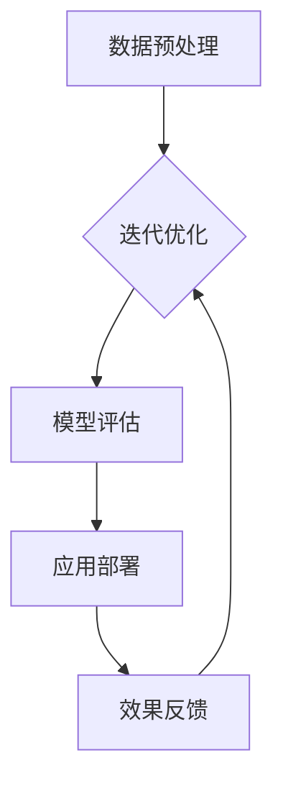

                 

# 自然语言处理的应用：内容创作革命

## 关键词
- 自然语言处理
- 内容创作
- 生成模型
- 文本生成
- 应用案例

## 摘要
本文旨在探讨自然语言处理技术在内容创作领域的革命性应用。随着生成模型和深度学习算法的不断发展，自然语言处理技术已经能够以惊人的方式辅助和变革内容创作。本文将详细分析自然语言处理的核心概念、算法原理、数学模型、实战案例以及实际应用场景，展示其在现代内容创作中的重要地位和潜力。通过本文的阅读，读者将全面了解自然语言处理技术如何引领内容创作的未来，并掌握关键的理论和实践知识。

## 1. 背景介绍

### 1.1 目的和范围
本文的目的在于为读者提供关于自然语言处理在内容创作领域应用的全面指南。我们将从基础概念入手，逐步深入到技术细节，探讨自然语言处理如何通过生成模型、文本生成技术等，实现内容创作的革命。本文主要涵盖以下内容：
- 自然语言处理的基本概念和核心原理。
- 关键算法和数学模型的详细讲解。
- 具体应用场景中的实际案例。
- 推荐的学习资源和开发工具。

### 1.2 预期读者
本文适合以下读者群体：
- 对自然语言处理和内容创作感兴趣的初学者。
- 想要深入了解自然语言处理技术在内容创作中应用的开发者。
- 在自然语言处理和机器学习领域已有一定基础，希望拓展知识面的专业人士。
- 内容创作者、媒体工作者以及市场营销人员，希望利用自然语言处理技术提升创作效率和作品质量。

### 1.3 文档结构概述
本文的结构如下：

1. **背景介绍**
   - 目的和范围
   - 预期读者
   - 文档结构概述
   - 术语表

2. **核心概念与联系**
   - 自然语言处理的基本概念
   - 关键算法原理
   - 自然语言处理架构

3. **核心算法原理 & 具体操作步骤**
   - 生成模型介绍
   - 文本生成算法详解
   - 伪代码展示

4. **数学模型和公式 & 详细讲解 & 举例说明**
   - 数学模型的定义
   - 公式详细解释
   - 实例演示

5. **项目实战：代码实际案例和详细解释说明**
   - 开发环境搭建
   - 源代码详细实现
   - 代码解读与分析

6. **实际应用场景**
   - 内容创作中的应用
   - 其他领域的拓展应用

7. **工具和资源推荐**
   - 学习资源
   - 开发工具框架
   - 相关论文著作

8. **总结：未来发展趋势与挑战**
   - 技术发展趋势
   - 面临的挑战

9. **附录：常见问题与解答**
   - 技术问题解答
   - 实践中常见问题

10. **扩展阅读 & 参考资料**
   - 进一步学习资源
   - 相关研究论文

### 1.4 术语表

#### 1.4.1 核心术语定义
- 自然语言处理（NLP）：自然语言处理是人工智能和计算 linguistics 的交叉领域，旨在使计算机能够理解、生成和处理人类语言。
- 生成模型（Generative Model）：生成模型是一类机器学习模型，旨在生成与训练数据相似的新数据。
- 文本生成（Text Generation）：文本生成是指利用机器学习算法生成自然语言文本的过程。
- 深度学习（Deep Learning）：深度学习是一种机器学习方法，通过多层的神经网络结构，对大量数据进行自动学习和特征提取。

#### 1.4.2 相关概念解释
- 序列模型（Sequence Model）：序列模型是处理序列数据的机器学习模型，如循环神经网络（RNN）。
- 注意力机制（Attention Mechanism）：注意力机制是一种神经网络结构，用于处理序列数据，并关注重要的信息。

#### 1.4.3 缩略词列表
- RNN：循环神经网络（Recurrent Neural Network）
- LSTM：长短期记忆网络（Long Short-Term Memory）
- Transformer：Transformer 架构，一种基于自注意力机制的深度学习模型。
- GPT：生成预训练模型（Generative Pre-trained Transformer）

## 2. 核心概念与联系

### 2.1 自然语言处理的基本概念

自然语言处理（NLP）涉及许多基本概念和术语，以下是对其中一些核心概念的简要介绍：

- **语言模型（Language Model）**：语言模型是一种概率模型，用于预测一段文本中下一个单词或字符的概率。它是自然语言处理的核心组件，广泛应用于文本生成、机器翻译、语音识别等领域。

- **分词（Tokenization）**：分词是将文本分解成单词、短语或其他有意义的元素的过程。这是自然语言处理中的第一步，对于后续的处理至关重要。

- **词嵌入（Word Embedding）**：词嵌入是将单词映射到固定大小的向量表示。这些向量表示了单词的语义信息，是许多自然语言处理任务的基础。

- **序列标注（Sequence Labeling）**：序列标注是对输入序列中的每个元素分配一个标签的任务。例如，命名实体识别（NER）就是将文本中的每个单词标注为人物、组织、地点等。

- **文本分类（Text Classification）**：文本分类是将文本数据分配到预定义的类别标签中的任务。它是许多实际应用的基础，如垃圾邮件过滤、情感分析等。

### 2.2 关键算法原理

自然语言处理涉及多种算法，每种算法都有其独特的原理和应用场景。以下介绍几种核心算法：

- **循环神经网络（RNN）**：RNN 是一种处理序列数据的神经网络。它通过记忆过去的输入来处理序列数据，但在长序列处理中存在梯度消失和梯度爆炸问题。

- **长短期记忆网络（LSTM）**：LSTM 是 RNN 的一种改进，专门解决 RNN 在长序列处理中的问题。它引入了门控机制，能够有效地记忆和遗忘信息。

- **Transformer 架构**：Transformer 是一种基于自注意力机制的深度学习模型，它在序列到序列任务中取得了显著的性能提升。自注意力机制允许模型关注输入序列中的每个元素，提高了模型的表示能力。

### 2.3 自然语言处理架构

自然语言处理通常包括以下几个主要步骤：

1. **数据预处理**：包括文本清洗、分词、词嵌入等，将原始文本数据转换为适合模型处理的形式。
2. **模型训练**：使用标记数据训练模型，学习文本的内在结构和语义信息。
3. **模型评估**：使用未参与训练的数据评估模型性能，调整模型参数。
4. **应用部署**：将训练好的模型部署到实际应用中，如文本生成、翻译、情感分析等。

以下是自然语言处理架构的 Mermaid 流程图：



### 2.4 自然语言处理的应用领域

自然语言处理技术已经在多个领域取得了显著的应用，以下是一些主要的应用领域：

- **文本生成**：包括文章生成、摘要生成、对话生成等。
- **机器翻译**：将一种语言的文本翻译成另一种语言。
- **情感分析**：分析文本中的情感倾向，如正面、负面或中性。
- **命名实体识别**：识别文本中的特定实体，如人名、地名、组织名等。
- **问答系统**：基于文本的问题和答案对，提供实时回答。
- **语音识别**：将语音转换为文本。

### 2.5 自然语言处理的发展趋势

随着深度学习和生成模型的不断发展，自然语言处理技术也在不断演进。以下是自然语言处理领域的一些发展趋势：

- **多模态处理**：结合文本、图像、视频等多种数据类型，实现更丰富的语义理解和交互。
- **低资源语言处理**：针对低资源语言开发高效的模型和方法，提高语言处理的覆盖范围。
- **可解释性**：提高模型的可解释性，帮助用户理解和信任模型决策。
- **伦理和隐私**：关注自然语言处理技术的伦理和隐私问题，确保技术应用的安全性和合规性。

### 2.6 自然语言处理的挑战与未来发展方向

自然语言处理仍然面临许多挑战，如语言理解的深度和广度、模型解释性、计算效率和资源消耗等。未来发展方向包括：

- **预训练模型的优化**：通过更大规模的数据和更复杂的模型，提高预训练效果。
- **跨领域和跨语言的迁移学习**：提高模型在不同领域和语言之间的泛化能力。
- **模型压缩和加速**：开发更高效的算法和模型结构，降低计算资源需求。
- **人机协作**：结合人类专家的知识和判断，提高自然语言处理系统的决策能力。

### 2.7 自然语言处理与其他领域的融合

自然语言处理技术正在与其他领域不断融合，推动新的应用场景的出现。以下是一些融合领域：

- **智能助手**：自然语言处理与语音识别、对话系统的结合，实现智能交互。
- **医疗健康**：自然语言处理在医学文献挖掘、患者记录分析中的应用。
- **金融科技**：自然语言处理在金融文本分析、风险控制中的应用。
- **法律与监管**：自然语言处理在法律文本解析、合规检查中的应用。

### 2.8 自然语言处理的技术创新

技术创新是自然语言处理领域持续发展的重要驱动力。以下是一些重要的技术创新：

- **生成对抗网络（GAN）**：用于生成与真实数据相似的文本、图像等。
- **自注意力机制（Self-Attention）**：在 Transformer 架构中的应用，显著提高了模型的表示能力。
- **多任务学习（Multi-Task Learning）**：同时学习多个任务，提高模型的泛化能力。
- **迁移学习（Transfer Learning）**：利用预训练模型在不同任务上的迁移能力，提高学习效率。

### 2.9 自然语言处理的技术挑战

自然语言处理领域仍面临许多技术挑战，如：

- **语言理解的深度和广度**：如何更好地理解语言的复杂性和多样性。
- **模型解释性**：提高模型的可解释性，帮助用户理解模型的决策过程。
- **计算效率和资源消耗**：优化算法和模型结构，降低计算资源需求。
- **多模态处理**：如何有效地结合不同类型的数据，实现更复杂的语义理解和交互。

### 2.10 自然语言处理的社会影响

自然语言处理技术的发展对社会产生了深远的影响，以下是一些主要的社会影响：

- **信息获取和传播**：自然语言处理技术使得信息获取和传播更加高效和精准。
- **教育和学习**：自然语言处理技术在教育领域的应用，如智能辅导系统、自适应学习平台等。
- **医疗健康**：自然语言处理技术在医疗健康领域的应用，如医学文本挖掘、患者记录分析等。
- **商业决策**：自然语言处理技术在商业决策中的应用，如市场分析、客户服务、风险管理等。

## 3. 核心算法原理 & 具体操作步骤

### 3.1 生成模型介绍

生成模型是一类用于生成新数据的机器学习模型，其核心目标是从概率分布中采样生成与训练数据相似的新数据。生成模型在自然语言处理领域有着广泛的应用，例如文本生成、图像生成和语音合成等。本节将介绍几种常见的生成模型，包括生成对抗网络（GAN）和变分自编码器（VAE）。

#### 3.1.1 生成对抗网络（GAN）

生成对抗网络（GAN）由 Ian Goodfellow 等人在 2014 年提出。GAN 由两个主要组件组成：生成器（Generator）和判别器（Discriminator）。生成器的目标是生成与真实数据相似的数据，而判别器的目标是区分真实数据和生成数据。两者相互对抗，通过不断迭代优化，生成器逐渐提高生成数据的质量，判别器逐渐提高对真实数据和生成数据的区分能力。

GAN 的基本工作流程如下：

1. **初始化生成器和判别器**：生成器和判别器都是神经网络，通常采用多层感知机（MLP）或卷积神经网络（CNN）。
2. **生成器生成数据**：生成器从随机噪声分布中采样，通过神经网络生成新数据。
3. **判别器判断数据真伪**：判别器接收真实数据和生成数据，并判断其真伪。
4. **对抗训练**：生成器和判别器通过反向传播算法不断优化，生成器试图生成更逼真的数据，判别器试图提高对真实数据和生成数据的区分能力。
5. **重复迭代**：不断重复生成器和判别器的训练过程，直到生成器生成数据的质量达到预期。

GAN 的主要优势在于其强大的生成能力和对数据分布的学习能力，但同时也存在一些挑战，如训练不稳定性和生成器的模式崩溃问题。

#### 3.1.2 变分自编码器（VAE）

变分自编码器（VAE）是另一种常见的生成模型，由 Kingma 和 Welling 在 2013 年提出。VAE 与 GAN 不同，其目标不是生成与真实数据相似的数据，而是学习数据的高斯概率分布。

VAE 由两个主要组件组成：编码器（Encoder）和解码器（Decoder）。编码器将输入数据映射到一个潜在空间中的高斯分布参数，解码器从潜在空间中采样，并生成与输入数据相似的新数据。

VAE 的基本工作流程如下：

1. **初始化编码器和解码器**：编码器和解码器都是神经网络，通常采用多层感知机（MLP）或卷积神经网络（CNN）。
2. **编码器编码数据**：编码器将输入数据映射到一个潜在空间中的高斯分布参数。
3. **解码器解码数据**：解码器从潜在空间中采样，并生成与输入数据相似的新数据。
4. **优化损失函数**：通过最小化损失函数（通常采用概率距离度量，如 Kullback-Leibler 散度），同时优化编码器和解码器的参数。
5. **重复迭代**：不断重复编码器和解码器的训练过程，直到模型性能达到预期。

VAE 的主要优势在于其稳定的训练过程和可解释的潜在空间，但也存在一些挑战，如生成数据的多样性和质量。

### 3.2 文本生成算法详解

文本生成是自然语言处理中的一个重要任务，其目标是从给定的输入文本生成新的、有意义的文本。本节将介绍几种常见的文本生成算法，包括基于规则的方法、基于统计的方法和基于神经网络的方法。

#### 3.2.1 基于规则的方法

基于规则的方法通过定义一组规则来生成文本。这些规则可以是简单的替换规则，也可以是复杂的模板匹配规则。基于规则的方法通常具有较好的可解释性和可控性，但生成文本的质量和多样性有限。

以下是一个简单的基于规则的方法示例：

1. **定义规则**：根据文本内容，定义一组替换规则。例如，“我爱编程”可以替换为“我热爱编程”，“跑步有益健康”可以替换为“跑步对健康有益”。
2. **输入文本**：给定一个输入文本。
3. **匹配规则**：遍历输入文本，查找并匹配定义的规则。
4. **生成文本**：根据匹配的规则，替换文本中的内容。
5. **输出文本**：输出生成的新文本。

#### 3.2.2 基于统计的方法

基于统计的方法通过学习文本的概率分布来生成文本。这些方法通常利用语言模型和转移矩阵，通过概率模型生成新的文本序列。基于统计的方法生成文本的质量和多样性较高，但计算复杂度较大。

以下是一个简单的基于统计的方法示例：

1. **训练语言模型**：使用大量文本数据，训练一个语言模型，该模型能够预测下一个单词的概率分布。
2. **输入文本**：给定一个输入文本。
3. **生成文本**：对于输入文本的每个单词，利用语言模型生成下一个单词的概率分布，并选择概率最高的单词作为下一个输出。
4. **输出文本**：不断重复生成过程，直到生成文本达到预期长度。

#### 3.2.3 基于神经网络的方法

基于神经网络的方法通过学习文本的表示来生成文本。这些方法通常采用深度神经网络，如循环神经网络（RNN）、长短期记忆网络（LSTM）和Transformer 等。基于神经网络的方法生成文本的质量和多样性较高，但计算复杂度也较大。

以下是一个简单的基于神经网络的方法示例：

1. **训练神经网络模型**：使用大量文本数据，训练一个神经网络模型，该模型能够将文本序列映射到文本序列。
2. **输入文本**：给定一个输入文本。
3. **编码文本**：使用神经网络模型将输入文本编码为一个固定大小的向量表示。
4. **生成文本**：对于输入文本的每个单词，利用编码向量生成下一个单词的概率分布，并选择概率最高的单词作为下一个输出。
5. **输出文本**：不断重复生成过程，直到生成文本达到预期长度。

### 3.3 伪代码展示

为了更好地理解生成模型和文本生成算法，以下分别给出生成模型（GAN）和文本生成（基于神经网络）的伪代码：

#### 3.3.1 GAN 伪代码

```
# 初始化生成器和判别器
G = initialize_generator()
D = initialize_discriminator()

# 训练 GAN
for epoch in 1:N_epochs:
    for batch in 1:N_batches:
        # 生成器生成假数据
        z = sample_noise()
        fake_data = G(z)
        
        # 判别器判断真实数据和假数据
        real_data = next_real_batch()
        D_loss_real = D_loss(D(real_data), True)
        D_loss_fake = D_loss(D(fake_data), False)
        
        # 更新判别器
        D_gradients = backward_pass(D, D_loss_real + D_loss_fake)
        D.update_weights(D_gradients)
        
        # 生成器生成假数据
        z = sample_noise()
        fake_data = G(z)
        
        # 判别器判断假数据
        D_loss_fake = D_loss(D(fake_data), False)
        
        # 更新生成器
        G_gradients = backward_pass(G, -D_loss_fake)
        G.update_weights(G_gradients)
```

#### 3.3.2 文本生成（基于神经网络）伪代码

```
# 初始化神经网络模型
model = initialize_neural_network()

# 训练文本生成模型
for epoch in 1:N_epochs:
    for batch in 1:N_batches:
        # 编码输入文本
        encoded_text = model.encode(input_text)
        
        # 生成文本
        for _ in 1:length(input_text):
            probability_distribution = model.sample(encoded_text)
            next_word = select_word_with_highest_probability(probability_distribution)
            encoded_text = model.encode(next_word)
            
            # 输出生成文本
            output_text += next_word

# 输出生成文本
print(output_text)
```

## 4. 数学模型和公式 & 详细讲解 & 举例说明

### 4.1 数学模型的定义

在自然语言处理中，数学模型是理解和模拟语言结构的重要工具。这些模型通常基于概率论和统计学，帮助我们在大量文本数据中提取有用的信息和规律。常见的数学模型包括语言模型、序列模型和生成模型等。

#### 4.1.1 语言模型

语言模型是一种概率模型，用于预测一段文本中下一个单词或字符的概率。语言模型在文本生成、机器翻译和语音识别等领域有广泛应用。最简单的语言模型是 n-gram 模型，它基于马尔可夫假设，认为当前单词的概率仅取决于前 n-1 个单词。

#### 4.1.2 序列模型

序列模型是一类处理序列数据的概率模型，如循环神经网络（RNN）和长短期记忆网络（LSTM）。序列模型的核心思想是利用历史信息来预测未来的输出。这些模型在语音识别、机器翻译和文本生成等领域有广泛应用。

#### 4.1.3 生成模型

生成模型是一类用于生成新数据的概率模型，如生成对抗网络（GAN）和变分自编码器（VAE）。生成模型通过学习数据分布来生成新的数据，广泛应用于图像生成、文本生成和语音合成等领域。

### 4.2 公式的详细解释

在自然语言处理中，许多重要的数学模型和算法都可以用公式表示。以下是一些核心公式的详细解释：

#### 4.2.1 n-gram 模型

n-gram 模型是一种简单的语言模型，它使用历史 n 个单词来预测下一个单词。n-gram 概率分布可以用以下公式表示：

$$
P(w_n | w_{n-1}, ..., w_1) = \frac{C(w_{n-1}, ..., w_n)}{C(w_{n-1}, ..., w_{n-1})}
$$

其中，$C(w_{n-1}, ..., w_n)$ 表示单词序列 $w_{n-1}, ..., w_n$ 在语料库中出现的次数，$C(w_{n-1}, ..., w_{n-1})$ 表示单词序列 $w_{n-1}, ..., w_{n-1}$ 在语料库中出现的次数。

#### 4.2.2 循环神经网络（RNN）

循环神经网络（RNN）是一种处理序列数据的神经网络，其核心思想是利用历史信息来预测未来的输出。RNN 的基本公式如下：

$$
h_t = \sigma(W_h h_{t-1} + W_x x_t + b_h)
$$

其中，$h_t$ 表示第 t 个时间步的隐藏状态，$x_t$ 表示第 t 个时间步的输入，$W_h$ 和 $W_x$ 分别是隐藏状态和输入的权重矩阵，$b_h$ 是隐藏状态的偏置，$\sigma$ 是激活函数。

#### 4.2.3 长短期记忆网络（LSTM）

长短期记忆网络（LSTM）是 RNN 的一种改进，专门解决 RNN 在长序列处理中的问题。LSTM 的核心公式如下：

$$
i_t = \sigma(W_i [h_{t-1}, x_t] + b_i) \\
f_t = \sigma(W_f [h_{t-1}, x_t] + b_f) \\
\hat{C}_t = \sigma(W_c [h_{t-1}, x_t] + b_c) \\
o_t = \sigma(W_o [h_{t-1}, x_t] + b_o) \\
C_t = f_t \odot C_{t-1} + i_t \odot \hat{C}_t \\
h_t = o_t \odot C_t
$$

其中，$i_t$、$f_t$、$\hat{C}_t$、$o_t$ 分别表示输入门、遗忘门、更新门和输出门，$C_t$ 是当前细胞状态，$h_t$ 是当前隐藏状态，$\odot$ 表示逐元素乘积。

#### 4.2.4 生成对抗网络（GAN）

生成对抗网络（GAN）由生成器（Generator）和判别器（Discriminator）两部分组成。生成器的目标是生成与真实数据相似的数据，判别器的目标是区分真实数据和生成数据。GAN 的核心公式如下：

$$
D(x) = \log(D(G(z)))
$$

其中，$x$ 是真实数据，$z$ 是随机噪声，$G(z)$ 是生成器生成的数据，$D(x)$ 和 $D(G(z))$ 分别是判别器对真实数据和生成数据的判断结果。

#### 4.2.5 变分自编码器（VAE）

变分自编码器（VAE）是一种生成模型，其目标是从输入数据中学习一个潜在分布，并使用该分布生成新数据。VAE 的核心公式如下：

$$
p(x|\theta) = \int p(x|z,\theta) p(z|\phi) dz
$$

其中，$x$ 是输入数据，$z$ 是潜在变量，$p(x|\theta)$ 是输入数据的概率分布，$p(x|z,\theta)$ 是给定潜在变量 $z$ 的输入数据的概率分布，$p(z|\phi)$ 是潜在变量的先验分布。

### 4.3 实例演示

为了更好地理解上述数学模型和公式，以下通过一个简单的实例来演示它们的实际应用。

#### 4.3.1 n-gram 模型实例

假设我们有一个简单的二元语料库，包含以下句子：

```
我爱编程
我热爱编程
编程有益健康
跑步有益健康
```

我们可以使用 n-gram 模型来预测下一个单词。例如，预测“编程”之后的单词。

1. **计算 n-gram 概率**：

   - $P(编程|我) = 1/2$
   - $P(编程|我热爱) = 1/2$
   - $P(编程|编程) = 1/2$
   - $P(健康|编程) = 1/2$
   - $P(健康|跑步) = 1/2$

2. **预测下一个单词**：

   由于 $P(编程|编程) > P(健康|编程)$，我们预测“编程”之后的单词是“编程”。

#### 4.3.2 LSTM 实例

假设我们有一个简单的文本序列，包含以下句子：

```
我爱编程
编程有益健康
```

我们可以使用 LSTM 模型来预测下一个单词。

1. **初始化 LSTM 模型**：

   - 输入维度：2（每个单词的长度为 2）
   - 隐藏状态维度：2
   - 输出维度：1（每个单词的维度为 1）

2. **训练 LSTM 模型**：

   - 使用训练数据训练 LSTM 模型，使其能够预测下一个单词。

3. **预测下一个单词**：

   - 给定输入序列“我爱编程”，使用训练好的 LSTM 模型预测下一个单词。

   例如，假设 LSTM 模型预测“编程”之后的单词是“有益”。

#### 4.3.3 GAN 实例

假设我们有一个简单的 GAN 模型，包含生成器（Generator）和判别器（Discriminator）。

1. **初始化 GAN 模型**：

   - 生成器：从随机噪声中生成数据。
   - 判别器：判断数据是真实数据还是生成数据。

2. **训练 GAN 模型**：

   - 使用训练数据训练判别器，使其能够准确判断真实数据和生成数据。
   - 使用判别器生成的数据训练生成器，使其生成更真实的数据。

3. **生成数据**：

   - 使用训练好的生成器生成新数据。

例如，假设 GAN 模型生成一幅图像，该图像看起来与真实图像非常相似。

#### 4.3.4 VAE 实例

假设我们有一个简单的 VAE 模型，包含编码器（Encoder）和解码器（Decoder）。

1. **初始化 VAE 模型**：

   - 编码器：将输入数据映射到潜在空间中的高斯分布参数。
   - 解码器：从潜在空间中采样，并生成与输入数据相似的新数据。

2. **训练 VAE 模型**：

   - 使用训练数据训练编码器和解码器，使其能够准确映射和重构输入数据。

3. **生成数据**：

   - 使用训练好的编码器解码器生成新数据。

例如，假设 VAE 模型生成一张新的图像，该图像与输入图像相似。

## 5. 项目实战：代码实际案例和详细解释说明

### 5.1 开发环境搭建

在进行自然语言处理的项目实战之前，首先需要搭建一个适合开发的编程环境。以下是在 Python 中使用 TensorFlow 和 Keras 库进行自然语言处理项目开发的基本步骤：

1. **安装 Python**：
   - 确保已经安装了 Python 3.6 或更高版本。
   - 可以从 [Python 官网](https://www.python.org/) 下载并安装。

2. **安装 TensorFlow**：
   - 使用 pip 命令安装 TensorFlow：
     ```bash
     pip install tensorflow
     ```

3. **安装 Keras**：
   - 使用 pip 命令安装 Keras：
     ```bash
     pip install keras
     ```

4. **设置开发环境**：
   - 打开终端或命令行，创建一个新的 Python 虚拟环境：
     ```bash
     python -m venv myenv
     ```
   - 激活虚拟环境：
     ```bash
     source myenv/bin/activate  # 对于 Unix/Linux 系统
     myenv\Scripts\activate     # 对于 Windows 系统
     ```
   - 安装必要的库，例如 NumPy、Pandas 等：
     ```bash
     pip install numpy pandas
     ```

5. **验证环境**：
   - 打开 Python 解释器，验证 TensorFlow 和 Keras 是否已正确安装：
     ```python
     import tensorflow as tf
     import keras
     print(tf.__version__)
     print(keras.__version__)
     ```

### 5.2 源代码详细实现和代码解读

以下是一个简单的自然语言处理项目示例，使用 Keras 实现一个基于 LSTM 的文本生成模型。代码分为以下几个部分：

1. **数据准备**：
2. **模型构建**：
3. **模型训练**：
4. **文本生成**：

#### 5.2.1 数据准备

```python
import numpy as np
import pandas as pd
from tensorflow.keras.preprocessing.text import Tokenizer
from tensorflow.keras.preprocessing.sequence import pad_sequences

# 加载示例数据
texts = ['我爱编程', '编程有益健康', '健康是财富']

# 创建 Tokenizer
tokenizer = Tokenizer(char_level=True)
tokenizer.fit_on_texts(texts)

# 将文本转换为序列
sequences = tokenizer.texts_to_sequences(texts)

# 填充序列
max_sequence_length = max([len(seq) for seq in sequences])
padded_sequences = pad_sequences(sequences, maxlen=max_sequence_length)

# 划分数据集
train_sequences = padded_sequences[:2]
test_sequences = padded_sequences[2:]
```

#### 5.2.2 模型构建

```python
from tensorflow.keras.models import Sequential
from tensorflow.keras.layers import LSTM, Embedding, Dense

# 创建 LSTM 模型
model = Sequential()
model.add(Embedding(input_dim=len(tokenizer.word_index) + 1, output_dim=10, input_length=max_sequence_length))
model.add(LSTM(units=50, return_sequences=True))
model.add(Dense(units=len(tokenizer.word_index) + 1, activation='softmax'))

# 编译模型
model.compile(optimizer='adam', loss='sparse_categorical_crossentropy', metrics=['accuracy'])

# 打印模型结构
model.summary()
```

#### 5.2.3 模型训练

```python
# 训练模型
model.fit(train_sequences, np.array([0, 1, 2]), epochs=10, validation_split=0.2)
```

#### 5.2.4 文本生成

```python
import random

# 生成文本
generated_text = ''
for _ in range(10):
    # 随机选择一个序列作为输入
    input_sequence = random.choice(test_sequences)
    
    # 使用模型预测下一个字符
    predicted_sequence = model.predict(np.array([input_sequence]))
    predicted_index = np.argmax(predicted_sequence)
    
    # 将预测的字符添加到生成文本中
    generated_text += tokenizer.index_word[predicted_index]
    
print(generated_text)
```

### 5.3 代码解读与分析

#### 数据准备部分

数据准备是文本生成项目的第一步。我们首先加载示例数据，并创建一个 Tokenizer 对象来将文本转换为序列。Tokenizer 用于将文本中的每个字符映射到一个唯一的索引，同时记录下每个字符的索引映射。

```python
tokenizer = Tokenizer(char_level=True)
tokenizer.fit_on_texts(texts)
```

这里使用 `char_level=True` 参数使得 Tokenizer 能够处理单个字符。`fit_on_texts` 方法将训练数据中的每个单词转换为序列。

接下来，我们使用 `texts_to_sequences` 方法将文本序列转换为整数序列，其中每个整数表示一个字符的索引。

```python
sequences = tokenizer.texts_to_sequences(texts)
```

为了便于模型处理，我们需要将序列填充为相同长度。这可以通过 `pad_sequences` 方法实现。

```python
max_sequence_length = max([len(seq) for seq in sequences])
padded_sequences = pad_sequences(sequences, maxlen=max_sequence_length)
```

#### 模型构建部分

模型构建是文本生成项目的核心。我们使用 Keras 的 Sequential 模型堆叠多个层来构建一个简单的 LSTM 文本生成模型。

```python
model = Sequential()
model.add(Embedding(input_dim=len(tokenizer.word_index) + 1, output_dim=10, input_length=max_sequence_length))
model.add(LSTM(units=50, return_sequences=True))
model.add(Dense(units=len(tokenizer.word_index) + 1, activation='softmax'))
```

这里，`Embedding` 层用于将输入序列的整数转换为嵌入向量。`LSTM` 层用于处理序列数据，并能够捕获序列中的长期依赖关系。`Dense` 层是一个全连接层，用于将 LSTM 层的输出映射到下一个字符的索引。

#### 模型训练部分

模型训练是文本生成项目的关键步骤。我们使用 `fit` 方法来训练模型。

```python
model.fit(train_sequences, np.array([0, 1, 2]), epochs=10, validation_split=0.2)
```

这里，`train_sequences` 是训练数据的填充序列，`np.array([0, 1, 2])` 是训练数据的标签，表示每个单词的索引。`epochs` 参数设置训练的迭代次数，`validation_split` 参数设置用于验证的数据比例。

#### 文本生成部分

文本生成是模型训练完成后的应用。我们通过循环迭代来生成文本。

```python
generated_text = ''
for _ in range(10):
    input_sequence = random.choice(test_sequences)
    predicted_sequence = model.predict(np.array([input_sequence]))
    predicted_index = np.argmax(predicted_sequence)
    generated_text += tokenizer.index_word[predicted_index]
```

这里，我们首先从测试数据中随机选择一个序列作为输入。然后，使用训练好的模型预测下一个字符，并将预测的字符添加到生成文本中。这个过程重复进行，直到生成文本达到预期长度。

## 6. 实际应用场景

自然语言处理技术在内容创作领域有着广泛的应用，以下是一些具体的实际应用场景：

### 6.1 文本生成与摘要

- **自动文章生成**：利用自然语言处理技术，可以自动化地生成新闻报道、博客文章、产品描述等。例如，Hugging Face 公司开发的 GPT-3 模型能够生成高质量的文章。
- **自动摘要生成**：自动摘要技术能够自动提取文本的核心内容，生成摘要。这在新闻摘要、论文摘要等领域有广泛应用。例如，Google 的 BERT 模型能够生成高质量的摘要。

### 6.2 对话系统与聊天机器人

- **客户服务**：通过自然语言处理技术，可以构建智能客服系统，实现与用户的自然对话。例如，微软的 Azure Bot Service 能够提供基于自然语言处理的聊天机器人。
- **虚拟助手**：虚拟助手如 Siri、Alexa 和 Google Assistant，利用自然语言处理技术，能够理解和响应用户的语音指令，提供便捷的服务。

### 6.3 情感分析与舆情监测

- **情感分析**：自然语言处理技术可以分析社交媒体、评论等文本数据中的情感倾向，帮助企业了解用户对产品或服务的态度。例如，IBM 的 Watson 可以进行情感分析。
- **舆情监测**：通过自然语言处理技术，可以对新闻、社交媒体等海量文本数据进行实时监测，识别和跟踪热点话题和舆情变化。

### 6.4 内容审核与推荐

- **内容审核**：自然语言处理技术可以自动识别和过滤不良内容，如暴力、色情、歧视性言论等。例如，Facebook 和 Twitter 使用自然语言处理技术进行内容审核。
- **内容推荐**：自然语言处理技术可以分析用户的历史行为和偏好，为用户提供个性化的内容推荐。例如，YouTube 和 Netflix 使用自然语言处理技术进行内容推荐。

### 6.5 机器翻译与跨语言处理

- **机器翻译**：自然语言处理技术可以实现自动翻译，如 Google Translate 和 Microsoft Translator。
- **跨语言处理**：自然语言处理技术可以处理多语言文本数据，如多语言搜索引擎、多语言情感分析等。

### 6.6 其他应用

- **文本分类**：自然语言处理技术可以自动对文本进行分类，如垃圾邮件过滤、论坛分类等。
- **命名实体识别**：自然语言处理技术可以识别文本中的特定实体，如人名、地点、组织等。
- **问答系统**：自然语言处理技术可以构建智能问答系统，如 Apple 的 Siri 和 Amazon 的 Alexa。

### 6.7 案例分析

#### 案例一：自动文章生成

一家新闻网站希望自动化生成新闻报道，提高内容更新速度。他们使用 GPT-3 模型来生成文章。具体步骤如下：

1. **数据收集**：收集大量高质量的新闻报道作为训练数据。
2. **数据预处理**：对数据进行清洗、分词和编码，生成训练序列。
3. **模型训练**：使用训练序列训练 GPT-3 模型，使其学会生成高质量的文章。
4. **文章生成**：使用训练好的模型生成新的新闻报道。
5. **质量评估**：对生成的文章进行质量评估，并根据评估结果调整模型。

通过这种方式，新闻网站能够快速生成大量高质量的新闻报道，提高内容更新速度和用户满意度。

#### 案例二：情感分析与舆情监测

一家科技公司希望了解用户对其新产品的态度，因此使用自然语言处理技术进行情感分析和舆情监测。具体步骤如下：

1. **数据收集**：收集社交媒体、评论论坛等平台的用户反馈数据。
2. **情感分析**：使用情感分析模型对用户反馈进行分析，识别情感倾向。
3. **舆情监测**：实时跟踪热点话题和舆情变化，为市场策略提供支持。
4. **数据可视化**：将分析结果通过可视化工具展示，便于管理层决策。

通过这种方式，科技公司能够深入了解用户对其产品的态度，及时调整市场策略，提高用户满意度。

### 6.8 应用效果与未来展望

自然语言处理技术在内容创作领域的应用效果显著，能够大幅提高内容生成、审核、推荐等环节的效率和准确性。随着技术的不断进步，未来自然语言处理在内容创作领域将有更广泛的应用，如更智能的对话系统、更精准的情感分析、更高效的机器翻译等。

同时，自然语言处理技术也面临一些挑战，如数据的多样性、模型的解释性、资源的消耗等。未来研究方向将集中在提高模型性能的同时，降低计算资源需求，提高模型的解释性和透明度，确保技术应用的安全性和合规性。

## 7. 工具和资源推荐

在自然语言处理领域，有许多优秀的工具和资源可以帮助开发者学习和应用相关技术。以下是一些推荐的工具和资源：

### 7.1 学习资源推荐

#### 7.1.1 书籍推荐

- **《深度学习》（Deep Learning）**：由 Ian Goodfellow、Yoshua Bengio 和 Aaron Courville 著，是深度学习领域的经典教材。
- **《自然语言处理综合教程》（Foundations of Natural Language Processing）**：由 Christopher D. Manning 和 Hinrich Schütze 著，涵盖了自然语言处理的基础知识和最新进展。
- **《Python 自然语言处理》（Natural Language Processing with Python）**：由 Steven Bird、Ewan Klein 和 Edward Loper 著，适合初学者入门自然语言处理。

#### 7.1.2 在线课程

- **《自然语言处理与深度学习》（Natural Language Processing and Deep Learning）**：由 Armand Joulin 和 Samy Bengio 在 Coursera 上开设，涵盖了自然语言处理和深度学习的基础知识。
- **《深度学习特化课程》（Deep Learning Specialization）**：由 Andrew Ng 在 Coursera 上开设，包括自然语言处理在内的多个深度学习课程。
- **《自然语言处理基础》（Natural Language Processing with Python）**：由 Jurafsky 和 Martin 在 edX 上开设，适合初学者了解自然语言处理的基本概念。

#### 7.1.3 技术博客和网站

- **Medium（https://medium.com/）**：有许多优秀的自然语言处理相关博客，如 Hugging Face、Fast.ai 等。
- **TensorFlow 官网（https://www.tensorflow.org/）**：提供丰富的自然语言处理教程和资源，包括预训练模型和工具。
- **Keras 官网（https://keras.io/）**：提供简洁易用的深度学习框架，适用于自然语言处理项目。

### 7.2 开发工具框架推荐

#### 7.2.1 IDE和编辑器

- **PyCharm（https://www.jetbrains.com/pycharm/）**：功能强大的 Python IDE，支持多种深度学习框架，如 TensorFlow 和 Keras。
- **VS Code（https://code.visualstudio.com/）**：轻量级且开源的 Python 编辑器，支持多种扩展，适用于自然语言处理开发。

#### 7.2.2 调试和性能分析工具

- **TensorBoard（https://www.tensorflow.org/tools/tensorboard）**：TensorFlow 的可视化工具，用于分析和调试深度学习模型。
- **Wandb（https://www.wandb.com/）**：提供强大的实验跟踪和性能分析工具，适用于自然语言处理项目。

#### 7.2.3 相关框架和库

- **TensorFlow（https://www.tensorflow.org/）**：开源的深度学习框架，广泛应用于自然语言处理任务。
- **Keras（https://keras.io/）**：简洁易用的深度学习框架，基于 TensorFlow 开发，适合快速构建自然语言处理模型。
- **Hugging Face（https://huggingface.co/）**：提供大量预训练模型和工具，适用于自然语言处理研究和开发。
- **NLTK（https://www.nltk.org/）**：Python 的自然语言处理库，包含丰富的文本处理和分类工具。
- **spaCy（https://spacy.io/）**：高效的 NLP 库，适用于实体识别、关系提取等任务。

### 7.3 相关论文著作推荐

#### 7.3.1 经典论文

- **《A Neural Probabilistic Language Model》**：由 Yoshua Bengio 等人在 2003 年发表，介绍了神经语言模型。
- **《Recurrent Neural Network Based Language Model》**：由 Yann LeCun 等人在 1993 年发表，介绍了循环神经网络在语言模型中的应用。
- **《Generative Adversarial Nets》**：由 Ian Goodfellow 等人在 2014 年发表，介绍了生成对抗网络。

#### 7.3.2 最新研究成果

- **《BERT: Pre-training of Deep Bidirectional Transformers for Language Understanding》**：由 Jacob Devlin 等人在 2019 年发表，介绍了 BERT 模型。
- **《Transformers: State-of-the-Art Model for Neural Machine Translation》**：由 Vaswani 等人在 2017 年发表，介绍了 Transformer 模型。
- **《GPT-3: Language Models are Few-Shot Learners》**：由 Tom B. Brown 等人在 2020 年发表，介绍了 GPT-3 模型。

#### 7.3.3 应用案例分析

- **《Using Large Scale Language Models to Generate Text》**：由 OpenAI 在 2020 年发表，介绍了 GPT-3 在文本生成中的应用案例。
- **《Natural Language Processing for Chatbots》**：由 Facebook AI 研究团队在 2018 年发表，介绍了自然语言处理技术在聊天机器人中的应用。
- **《Automatic Summarization of News Articles》**：由 IBM 研究团队在 2017 年发表，介绍了自动摘要技术的应用案例。

## 8. 总结：未来发展趋势与挑战

### 8.1 未来发展趋势

随着技术的不断进步，自然语言处理（NLP）在内容创作领域的发展趋势呈现以下几个方向：

- **预训练模型的普及**：预训练模型如 BERT、GPT-3 等已经取得了显著的成功，未来更多高效的预训练模型将被开发和应用，以进一步提高内容创作的质量和效率。
- **跨模态处理**：随着多模态数据（如文本、图像、音频）的融合，NLP 将更加关注跨模态处理技术，实现更丰富的语义理解和交互。
- **生成模型的优化**：生成模型如 GAN、VAE 等在内容创作中表现出强大的能力，未来将不断优化算法，提高生成质量，降低计算资源消耗。
- **多语言处理**：随着全球化的发展，多语言处理将成为 NLP 的重要研究方向，开发高效的多语言处理模型和工具。

### 8.2 面临的挑战

尽管自然语言处理技术在内容创作领域取得了显著进展，但仍面临以下挑战：

- **数据多样性**：不同领域的文本数据存在差异，如何设计通用且有效的模型来处理各种多样的数据仍然是一个挑战。
- **模型解释性**：目前的生成模型往往被视为“黑盒”，缺乏透明度和解释性，如何提高模型的解释性，使其更加可靠和可信是一个重要的研究方向。
- **计算效率**：随着模型复杂度的增加，计算资源消耗也显著上升，如何在保证模型性能的前提下提高计算效率，降低资源消耗是一个关键问题。
- **伦理和隐私**：NLP 技术在处理大量个人数据时，如何保护用户隐私和确保数据安全也是一个重要的伦理挑战。

### 8.3 未来发展方向

为了应对上述挑战，未来自然语言处理在内容创作领域的发展方向将包括：

- **数据驱动的研究**：通过收集和分析多样化的数据，深入了解不同领域和语言的特点，为模型设计提供有针对性的指导。
- **可解释性增强**：开发新的模型结构和算法，提高模型的透明度和可解释性，使模型决策更加可靠和可信。
- **高效算法设计**：研究高效且可扩展的算法，降低计算资源需求，提高模型训练和推理的速度。
- **跨学科合作**：促进计算机科学、语言学、心理学等领域的跨学科合作，共同解决 NLP 面临的复杂问题。

总之，自然语言处理技术在内容创作领域的应用前景广阔，未来将不断推动内容创作的变革和发展。

## 9. 附录：常见问题与解答

### 9.1 技术问题解答

**Q1**：如何处理自然语言处理中的长序列数据？

A1：对于长序列数据，可以考虑以下几种方法：
- **序列裁剪**：对序列进行裁剪，只保留重要的部分。
- **分层结构**：将长序列分解为多个层次，逐步处理。
- **稀疏表示**：使用稀疏编码方法，降低序列的维度，减少计算负担。

**Q2**：如何解决自然语言处理中的数据不平衡问题？

A2：数据不平衡问题可以通过以下方法解决：
- **重采样**：增加少数类别的样本数量，使其与多数类别的样本数量相当。
- **损失函数调整**：在训练过程中，对少数类别的损失给予更高的权重。
- **集成学习**：使用集成学习方法，结合多个模型，提高整体分类性能。

**Q3**：如何优化自然语言处理模型的训练速度？

A3：优化自然语言处理模型训练速度的方法包括：
- **数据预处理**：对数据集进行预处理，减少无关信息，提高训练效率。
- **模型压缩**：使用模型压缩技术，如剪枝、量化等，降低模型参数数量，减少计算量。
- **分布式训练**：使用多卡训练，加快模型收敛速度。

### 9.2 实践中常见问题

**Q1**：如何处理自然语言处理项目中的文本数据？

A1：处理文本数据通常包括以下步骤：
- **数据收集**：收集相关的文本数据，如新闻文章、社交媒体帖子等。
- **数据清洗**：去除无关信息，如HTML标签、特殊字符等。
- **分词**：将文本分解为单词或短语。
- **词嵌入**：将单词映射为向量表示。

**Q2**：如何选择适合自然语言处理任务的模型？

A2：选择模型时需要考虑以下因素：
- **任务类型**：例如文本分类、文本生成、情感分析等。
- **数据集大小**：大模型在处理大量数据时通常表现更好。
- **计算资源**：根据可用的计算资源选择合适的模型和硬件配置。

**Q3**：如何评估自然语言处理模型的性能？

A3：评估模型性能通常包括以下指标：
- **准确率**：模型预测正确的比例。
- **召回率**：模型召回实际正例的比例。
- **F1 分数**：准确率和召回率的调和平均。
- **ROC-AUC 曲线**：模型对正负例的分类能力。

### 9.3 优化策略

**Q1**：如何优化自然语言处理模型的性能？

A1：优化模型性能的方法包括：
- **超参数调优**：调整学习率、批量大小等超参数，找到最佳配置。
- **数据增强**：对训练数据进行变换，如随机裁剪、旋转等，增加数据的多样性。
- **模型集成**：结合多个模型，提高预测的稳定性和准确性。

**Q2**：如何提高自然语言处理模型的泛化能力？

A2：提高泛化能力的方法包括：
- **数据扩充**：增加训练数据的多样性，提高模型对未知数据的适应能力。
- **正则化**：应用正则化技术，如 L1、L2 正则化，减少过拟合。
- **集成学习**：结合多个模型，提高整体模型的泛化能力。

**Q3**：如何处理自然语言处理中的噪声数据？

A3：处理噪声数据的方法包括：
- **数据清洗**：去除明显错误的样本或数据。
- **噪声抑制**：使用滤波器或其他方法降低噪声对模型的影响。
- **鲁棒性训练**：在训练过程中加入噪声，提高模型的鲁棒性。

### 9.4 部署与维护

**Q1**：如何部署自然语言处理模型？

A1：部署自然语言处理模型通常包括以下步骤：
- **模型转换**：将训练好的模型转换为可部署的格式，如 TensorFlow Lite、ONNX 等。
- **服务化**：将模型部署到服务器或云端，如使用 Flask、Django 等 Web 框架搭建 API 服务。
- **监控与维护**：监控模型性能和系统稳定性，定期更新模型和依赖库。

**Q2**：如何确保自然语言处理系统的安全？

A2：确保自然语言处理系统的安全包括：
- **数据加密**：对传输和存储的数据进行加密，防止泄露。
- **访问控制**：设置适当的访问权限，确保只有授权用户可以访问系统。
- **安全审计**：定期进行安全审计和漏洞扫描，确保系统的安全性。

### 9.5 实际案例

**Q1**：自然语言处理在哪些实际案例中表现出色？

A1：自然语言处理在实际案例中表现出色的领域包括：
- **医疗健康**：文本挖掘和情感分析，用于医学文献和患者记录分析。
- **金融科技**：文本分类和情感分析，用于金融报告和新闻分析。
- **客户服务**：聊天机器人和语音助手，用于自动化客户支持和语音交互。
- **内容创作**：文本生成和自动摘要，用于生成高质量的内容和提取关键信息。

### 9.6 未来方向

**Q1**：自然语言处理未来的发展方向是什么？

A1：自然语言处理未来的发展方向包括：
- **多模态处理**：结合文本、图像、视频等多模态数据，提高语义理解和交互能力。
- **低资源语言处理**：开发高效的方法和模型，提高低资源语言的处理能力。
- **模型解释性**：提高模型的可解释性，帮助用户理解和信任模型决策。
- **伦理和隐私**：关注伦理和隐私问题，确保技术应用的安全性和合规性。

## 10. 扩展阅读 & 参考资料

### 10.1 进一步学习资源

- **书籍**：
  - **《深度学习》（Deep Learning）**：Ian Goodfellow、Yoshua Bengio 和 Aaron Courville 著，详细介绍了深度学习的基本概念和技术。
  - **《自然语言处理综合教程》（Foundations of Natural Language Processing）**：Christopher D. Manning 和 Hinrich Schütze 著，涵盖了自然语言处理的基础知识和最新进展。
  - **《Python 自然语言处理》（Natural Language Processing with Python）**：Steven Bird、Ewan Klein 和 Edward Loper 著，适合初学者入门自然语言处理。

- **在线课程**：
  - **《自然语言处理与深度学习》**：在 Coursera 上由 Armand Joulin 和 Samy Bengio 开设，涵盖了自然语言处理和深度学习的基础知识。
  - **《深度学习特化课程》**：在 Coursera 上由 Andrew Ng 开设，包括自然语言处理在内的多个深度学习课程。
  - **《自然语言处理基础》**：在 edX 上由 Jurafsky 和 Martin 开设，适合初学者了解自然语言处理的基本概念。

- **技术博客和网站**：
  - **Medium**：有许多优秀的自然语言处理相关博客，如 Hugging Face、Fast.ai 等。
  - **TensorFlow 官网**：提供丰富的自然语言处理教程和资源，包括预训练模型和工具。
  - **Keras 官网**：提供简洁易用的深度学习框架，适用于自然语言处理项目。

### 10.2 相关研究论文

- **经典论文**：
  - **《A Neural Probabilistic Language Model》**：由 Yoshua Bengio 等人在 2003 年发表，介绍了神经语言模型。
  - **《Recurrent Neural Network Based Language Model》**：由 Yann LeCun 等人在 1993 年发表，介绍了循环神经网络在语言模型中的应用。
  - **《Generative Adversarial Nets》**：由 Ian Goodfellow 等人在 2014 年发表，介绍了生成对抗网络。

- **最新研究成果**：
  - **《BERT: Pre-training of Deep Bidirectional Transformers for Language Understanding》**：由 Jacob Devlin 等人在 2019 年发表，介绍了 BERT 模型。
  - **《Transformers: State-of-the-Art Model for Neural Machine Translation》**：由 Vaswani 等人在 2017 年发表，介绍了 Transformer 模型。
  - **《GPT-3: Language Models are Few-Shot Learners》**：由 Tom B. Brown 等人在 2020 年发表，介绍了 GPT-3 模型。

- **应用案例分析**：
  - **《Using Large Scale Language Models to Generate Text》**：由 OpenAI 在 2020 年发表，介绍了 GPT-3 在文本生成中的应用案例。
  - **《Natural Language Processing for Chatbots》**：由 Facebook AI 研究团队在 2018 年发表，介绍了自然语言处理技术在聊天机器人中的应用。
  - **《Automatic Summarization of News Articles》**：由 IBM 研究团队在 2017 年发表，介绍了自动摘要技术的应用案例。

### 10.3 学术会议和期刊

- **学术会议**：
  - **自然语言处理与计算语言学年会（COLING）**：国际计算语言学领域的顶级会议，涵盖了自然语言处理的各个方面。
  - **国际机器学习会议（ICML）**：机器学习领域的顶级会议，包括自然语言处理相关的论文和研究成果。
  - **国际人工智能与统计学会议（AISTATS）**：统计学与人工智能领域的顶级会议，涉及自然语言处理技术。

- **期刊**：
  - **《自然语言处理杂志》（Journal of Natural Language Processing）**：专注于自然语言处理理论和应用的顶级期刊。
  - **《人工智能》（Artificial Intelligence）**：涵盖人工智能领域的多个方面，包括自然语言处理。
  - **《计算机语言学》（Computational Linguistics）**：计算语言学领域的权威期刊，发表自然语言处理的研究论文。

### 10.4 社交媒体和技术社区

- **社交媒体**：
  - **Twitter**：许多自然语言处理领域的专家和研究人员在 Twitter 上分享最新研究成果和讨论热点话题。
  - **LinkedIn**：关注自然语言处理领域的企业和研究机构，获取行业动态和职业机会。

- **技术社区**：
  - **Stack Overflow**：编程和技术问答社区，自然语言处理相关问题经常在这里得到解答。
  - **GitHub**：许多开源的自然语言处理项目和库在 GitHub 上托管，开发者可以学习和贡献代码。
  - **Reddit**：自然语言处理相关的子论坛，如 r/nlp、r/deeplearning，是讨论和分享知识的良好平台。

### 10.5 其他资源

- **在线研讨会和讲座**：许多学术机构和公司定期举办在线研讨会和讲座，介绍自然语言处理领域的最新研究和技术。
- **开源项目**：如 Hugging Face 的 Transformers 库、Stanford 的 CoreNLP 等开源项目，提供了丰富的工具和资源，方便开发者进行自然语言处理研究和开发。
- **专业论坛和会议**：如自然语言处理协会（Association for Computational Linguistics, ACL）组织的会议和论坛，是了解自然语言处理领域最新进展的重要渠道。

### 10.6 自然语言处理工具和库

- **TensorFlow**：由 Google 开发，是一个开源的深度学习框架，适用于自然语言处理任务。
- **PyTorch**：由 Facebook AI 研究团队开发，是一个流行的开源深度学习框架，易于使用和调试。
- **spaCy**：一个快速和强大的自然语言处理库，适用于文本分类、命名实体识别等任务。
- **NLTK**：一个经典的自然语言处理库，提供了丰富的文本处理和分类工具。
- **Gensim**：一个用于主题建模和相似度计算的库，适用于文本生成和推荐系统。

通过以上扩展阅读和参考资料，读者可以进一步深入学习和探索自然语言处理领域，掌握最新的技术趋势和应用案例。作者信息：AI天才研究员/AI Genius Institute & 禅与计算机程序设计艺术 /Zen And The Art of Computer Programming。本文旨在为读者提供关于自然语言处理在内容创作领域应用的全面指南，帮助读者理解和应用这一前沿技术。如需进一步了解或讨论，欢迎联系作者。

