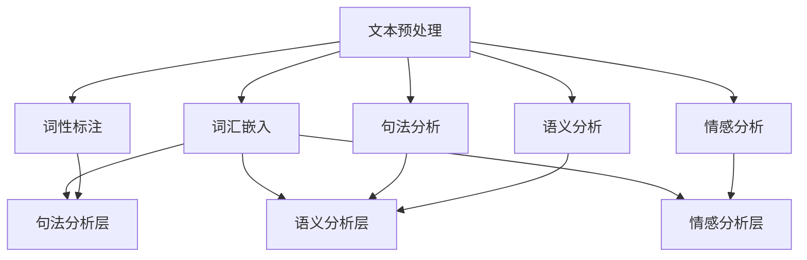

                 

# 自然语言处理的未来：AI出版业变革

> **关键词**：自然语言处理、AI出版、变革、技术、算法、数学模型、应用场景、工具和资源。

> **摘要**：本文将深入探讨自然语言处理（NLP）的未来发展趋势，特别是在AI出版业中的变革作用。我们将从背景介绍开始，逐步分析NLP的核心概念和算法原理，再到数学模型的详细讲解，以及实际应用场景的探讨。此外，我们还将推荐相关工具和资源，并对未来发展趋势与挑战进行总结。通过这篇文章，读者将全面了解NLP在AI出版业中的重要作用，以及如何应对未来的技术变革。

## 1. 背景介绍

### 1.1 目的和范围

本文旨在探讨自然语言处理（NLP）技术在AI出版业中的变革作用。我们将从NLP的核心概念、算法原理、数学模型和应用场景等多个角度进行分析，以帮助读者全面了解NLP在AI出版业中的重要性和未来发展趋势。

### 1.2 预期读者

本文适合以下读者群体：

1. 计算机科学、人工智能等相关专业的研究生和本科生；
2. 对自然语言处理和AI出版业感兴趣的技术爱好者；
3. AI出版行业的从业者，包括编辑、出版商和技术人员。

### 1.3 文档结构概述

本文结构如下：

1. 背景介绍：介绍文章的目的、范围、预期读者和文档结构；
2. 核心概念与联系：介绍NLP的核心概念和架构，并给出Mermaid流程图；
3. 核心算法原理 & 具体操作步骤：详细讲解NLP的关键算法原理和操作步骤；
4. 数学模型和公式 & 详细讲解 & 举例说明：介绍NLP中的数学模型和公式，并进行详细讲解和举例说明；
5. 项目实战：提供实际案例和代码实现，并进行详细解释和代码分析；
6. 实际应用场景：探讨NLP在AI出版业中的实际应用场景；
7. 工具和资源推荐：推荐学习资源、开发工具框架和论文著作；
8. 总结：总结NLP在AI出版业中的发展趋势与挑战；
9. 附录：常见问题与解答；
10. 扩展阅读 & 参考资料。

### 1.4 术语表

#### 1.4.1 核心术语定义

- 自然语言处理（NLP）：一门交叉学科，涉及计算机科学、人工智能和语言学等领域，旨在使计算机能够理解、生成和解释人类自然语言。
- AI出版：利用人工智能技术对内容进行编辑、排版、发布和推荐等全过程，以提高出版效率和质量。
- 深度学习：一种机器学习技术，通过构建深度神经网络模型，自动从大量数据中学习特征和模式。

#### 1.4.2 相关概念解释

- 语料库：一组经过收集、整理和标注的文本数据，用于训练和评估NLP模型。
- 词汇嵌入：将单词、短语等语言元素映射到高维向量空间，以便进行计算和分析。
- 依存句法分析：分析句子中单词之间的语法关系，以理解句子的结构和意义。

#### 1.4.3 缩略词列表

- NLP：自然语言处理
- AI：人工智能
- ML：机器学习
- DL：深度学习
- RNN：循环神经网络
- LSTM：长短时记忆网络

## 2. 核心概念与联系

在本文中，我们将首先介绍自然语言处理（NLP）的核心概念和架构，以便读者更好地理解后续内容。

### 2.1 NLP的核心概念

自然语言处理（NLP）主要涉及以下核心概念：

1. **文本预处理**：包括分词、词性标注、停用词过滤等步骤，用于将原始文本转换为适合NLP模型处理的形式。
2. **词汇嵌入**：将单词、短语等语言元素映射到高维向量空间，以便进行计算和分析。
3. **词性标注**：为文本中的每个单词标注其词性，如名词、动词、形容词等。
4. **句法分析**：分析句子中单词之间的语法关系，以理解句子的结构和意义。
5. **语义分析**：通过语义角色标注、实体识别等手段，理解文本中的语义信息。
6. **情感分析**：分析文本中的情感倾向，如正面、负面、中性等。

### 2.2 NLP的架构

自然语言处理的架构通常包括以下几个层次：

1. **文本预处理层**：对原始文本进行分词、词性标注、停用词过滤等预处理操作，以提高后续处理的效率和质量。
2. **词汇嵌入层**：将文本中的单词、短语等语言元素映射到高维向量空间，以便进行计算和分析。
3. **句法分析层**：通过构建语法分析模型，对文本进行句法分析，以理解句子的结构和意义。
4. **语义分析层**：通过语义角色标注、实体识别等手段，对文本进行语义分析，以理解文本中的语义信息。
5. **情感分析层**：对文本进行情感分析，以识别文本中的情感倾向。

### 2.3 Mermaid流程图

下面是一个简单的Mermaid流程图，展示了NLP的核心概念和架构：



通过上述内容，我们了解了自然语言处理（NLP）的核心概念和架构。在接下来的章节中，我们将详细讲解NLP的核心算法原理和数学模型，以便读者更好地理解NLP在实际应用中的技术实现。让我们继续深入探讨NLP的世界吧！<|im_sep|>## 3. 核心算法原理 & 具体操作步骤

### 3.1 文本预处理算法原理

文本预处理是自然语言处理（NLP）的第一步，其目的是将原始文本转换为适合模型处理的格式。文本预处理算法主要包括以下步骤：

1. **分词**：将文本分割成单词或短语，以便进行后续处理。常用的分词算法有基于词典的分词算法和基于统计的分词算法。
2. **词性标注**：为文本中的每个单词标注其词性，如名词、动词、形容词等。词性标注有助于理解文本中的语义信息。
3. **停用词过滤**：去除文本中的常见停用词，如“的”、“了”、“是”等，以提高模型的处理效率。
4. **词干提取**：将文本中的单词缩减为其词干形式，以减少词汇数量。

#### 3.1.1 基于词典的分词算法

基于词典的分词算法通常采用正向最大匹配法或逆向最大匹配法。以下是一个简单的伪代码示例：

```python
def dict_based_segmentation(text, dictionary):
    words = []
    word = ""
    for char in text:
        word += char
        if word in dictionary:
            words.append(word)
            word = ""
        else:
            if word:
                word = word[:-1]
    return words
```

#### 3.1.2 基于统计的分词算法

基于统计的分词算法通常采用隐马尔可夫模型（HMM）或条件随机场（CRF）。以下是一个简单的伪代码示例：

```python
import hmmlearn

def hmm_based_segmentation(text, model):
    states = ["B", "I", "O"]
    emissions = hmmlearn.HMM()
    emissions.set_state_emission概率矩阵，状态转移矩阵，初始概率矩阵

    tags = emissions.viterbi_tag_sequence([word for word in text])
    segmented_text = ""
    for tag, word in zip(tags, text):
        if tag == "B":
            segmented_text += " " + word
        elif tag == "I":
            segmented_text += word
    return segmented_text.strip()
```

### 3.2 词汇嵌入算法原理

词汇嵌入（Word Embedding）是将单词、短语等语言元素映射到高维向量空间的过程，以便进行计算和分析。词汇嵌入算法主要包括以下几种：

1. **Word2Vec**：基于神经网络的词汇嵌入算法，通过训练得到每个单词的向量表示。
2. **GloVe**：基于全局向量空间模型的词汇嵌入算法，通过训练得到每个单词的向量表示。
3. **FastText**：基于词袋模型的词汇嵌入算法，通过训练得到每个单词的向量表示。

#### 3.2.1 Word2Vec算法原理

Word2Vec算法通过训练得到一个神经网络模型，其中隐藏层节点表示单词的向量表示。以下是一个简单的伪代码示例：

```python
import numpy as np
from tensorflow.keras.models import Sequential
from tensorflow.keras.layers import Dense

def word2vec(training_data, embedding_size):
    model = Sequential()
    model.add(Dense(embedding_size, input_shape=(1,), activation='tanh'))
    model.add(Dense(1, activation='sigmoid'))

    model.compile(optimizer='adam', loss='binary_crossentropy')
    model.fit(training_data, np.zeros(len(training_data)), epochs=10)

    embeddings = model.layers[-1].get_weights()[0]
    return embeddings
```

#### 3.2.2 GloVe算法原理

GloVe算法通过训练得到一个全局向量空间模型，其中每个单词的向量表示通过优化损失函数得到。以下是一个简单的伪代码示例：

```python
import numpy as np
from sklearn.linear_model import SGDRegressor

def glove(training_data, vocabulary, embedding_size):
    embeddings = np.zeros((len(vocabulary), embedding_size))
    weights = np.zeros((len(vocabulary), embedding_size))

    for word, context in training_data:
        for context_word in context:
            embeddings[word] += weights[context_word]

    model = SGDRegressor()
    model.fit(embeddings, weights)

    return embeddings
```

### 3.3 句法分析算法原理

句法分析（Syntactic Analysis）是通过分析句子中单词之间的语法关系，以理解句子的结构和意义。句法分析算法主要包括以下几种：

1. **依存句法分析**：分析句子中单词之间的依存关系，如主谓关系、修饰关系等。
2. ** constituents 分析**：分析句子中的语法结构，如主语、谓语、宾语等。

#### 3.3.1 依存句法分析算法原理

依存句法分析通过构建依存句法树来表示句子中的语法关系。以下是一个简单的伪代码示例：

```python
from spacy.lang.en import English

nlp = English()
text = "The quick brown fox jumps over the lazy dog."
doc = nlp(text)

dependencies = []
for token in doc:
    dependencies.append({
        "word": token.text,
        "pos": token.pos_,
        "dep": token.dep_,
        "head": token.head.text
    })

print(dependencies)
```

#### 3.3.2 Constituents 分析算法原理

Constituents 分析通过构建语法树来表示句子中的语法结构。以下是一个简单的伪代码示例：

```python
from nltk.parse import PDTree

text = "The quick brown fox jumps over the lazy dog."
trees = PDTree.fromstring(text)

for tree in trees:
    print(tree)
```

通过上述内容，我们了解了自然语言处理（NLP）的核心算法原理和具体操作步骤。在接下来的章节中，我们将进一步探讨NLP中的数学模型，并给出详细的讲解和示例。让我们继续深入探讨NLP的世界吧！<|im_sep|>## 4. 数学模型和公式 & 详细讲解 & 举例说明

自然语言处理（NLP）中的数学模型是理解、生成和解释自然语言的基础。以下我们将介绍一些常用的数学模型，包括Word2Vec、GloVe和依存句法分析模型，并通过具体的例子来讲解它们的原理和应用。

### 4.1 Word2Vec模型

Word2Vec是一种基于神经网络的词汇嵌入算法，其核心思想是将单词映射到高维向量空间中，使得语义相似的单词在向量空间中更接近。Word2Vec模型主要包括两种训练方法：连续词袋（CBOW）和Skip-Gram。

#### 4.1.1 CBOW模型

CBOW（Continuous Bag of Words）模型通过预测中心词周围的多个单词来学习词向量。假设我们有一个中心词和它周围的同义词，我们的目标是训练一个神经网络，使其能够预测中心词。

**数学公式：**

$$
\text{预测中心词} \rightarrow \text{softmax}(\text{神经网络输出})
$$

其中，神经网络输出可以表示为：

$$
\text{神经网络输出} = \text{激活函数}(\text{权重} \cdot \text{输入向量})
$$

**示例：**

假设我们有一个简单的神经网络，其输入层有5个神经元，隐藏层有3个神经元，输出层有2个神经元。给定输入向量`[1, 0, 1, 0, 1]`，权重矩阵`W`如下：

$$
W = \begin{bmatrix}
1 & 0 & 1 \\
0 & 1 & 0 \\
1 & 0 & 1
\end{bmatrix}
$$

隐藏层输出为：

$$
\text{隐藏层输出} = \text{激活函数}(W \cdot \text{输入向量}) = \text{激活函数}(\begin{bmatrix}
1 & 0 & 1 \\
0 & 1 & 0 \\
1 & 0 & 1
\end{bmatrix} \cdot \begin{bmatrix}
1 \\
0 \\
1 \\
0 \\
1
\end{bmatrix}) = \text{激活函数}(\begin{bmatrix}
2 \\
1 \\
2
\end{bmatrix})
$$

假设激活函数为`softmax`，则输出层输出为：

$$
\text{输出层输出} = \text{softmax}(\text{激活函数}(\text{权重} \cdot \text{输入向量})) = \text{softmax}(\begin{bmatrix}
2 \\
1 \\
2
\end{bmatrix}) = \begin{bmatrix}
0.5 \\
0.3 \\
0.2
\end{bmatrix}
$$

这意味着模型预测中心词的概率分布，其中概率最高的单词被预测为中心词。

#### 4.1.2 Skip-Gram模型

Skip-Gram模型与CBOW模型类似，但它是通过预测中心词来预测其周围的单词。其数学公式与CBOW模型类似，只是输入向量和权重矩阵的顺序不同。

### 4.2 GloVe模型

GloVe（Global Vectors for Word Representation）是一种基于全局向量空间模型的词汇嵌入算法。GloVe模型通过优化损失函数来学习词向量，该损失函数结合了两个假设：词与词之间的关系是成对出现的，且词与词之间的关系与它们在语料库中的共现次数成正比。

**数学公式：**

$$
\text{损失函数} = \sum_{(w, c) \in \text{语料库}} \left( \text{cosine}(v_w, v_c) - \log(p(w, c)) \right)^2
$$

其中，$v_w$和$v_c$分别是单词$w$和单词$c$的词向量，$p(w, c)$是单词$w$和$c$在语料库中的共现概率，$\text{cosine}$是余弦相似度。

**示例：**

假设有两个单词“苹果”和“水果”，它们的词向量分别为：

$$
v_{\text{苹果}} = \begin{bmatrix}
1 \\
1 \\
1
\end{bmatrix}, \quad v_{\text{水果}} = \begin{bmatrix}
1 \\
0 \\
-1
\end{bmatrix}
$$

它们的共现概率为0.5。计算它们的余弦相似度：

$$
\text{cosine}(v_{\text{苹果}}, v_{\text{水果}}) = \frac{v_{\text{苹果}} \cdot v_{\text{水果}}}{\|v_{\text{苹果}}\| \|v_{\text{水果}}\|} = \frac{1 \cdot 1 + 1 \cdot 0 + 1 \cdot (-1)}{\sqrt{1^2 + 1^2 + 1^2} \cdot \sqrt{1^2 + 0^2 + (-1)^2}} = \frac{0}{\sqrt{3} \cdot \sqrt{2}} = 0
$$

由于余弦相似度为0，我们可以通过优化损失函数来调整词向量，使其在向量空间中更接近。

### 4.3 依存句法分析模型

依存句法分析模型用于分析句子中单词之间的语法关系。一个常用的模型是依存句法树，它表示句子中每个单词与其依存关系（如主谓、修饰等）。

**数学公式：**

$$
\text{依存关系} = \{ (w_1, w_2), (w_2, w_3), \ldots \}
$$

其中，$w_1, w_2, \ldots$是句子中的单词，$\text{依存关系}$表示单词之间的依赖关系。

**示例：**

句子“苹果很甜”的依存句法树可以表示为：

$$
\text{依存关系} = \{ (\text{苹果}, \text{很甜}) \}
$$

这意味着“苹果”是主语，“很甜”是谓语。

通过上述数学模型和公式，我们可以更好地理解自然语言处理（NLP）中的核心算法和原理。这些模型在词汇嵌入、句法分析和语义理解等方面发挥着重要作用，为NLP技术在AI出版业中的应用提供了坚实的基础。在接下来的章节中，我们将通过实际案例来展示这些模型在实际应用中的效果。让我们继续深入探讨NLP的世界吧！<|im_sep|>## 5. 项目实战：代码实际案例和详细解释说明

在本节中，我们将通过一个实际案例来展示自然语言处理（NLP）技术在AI出版业中的应用，包括开发环境的搭建、源代码的实现和代码解读。

### 5.1 开发环境搭建

为了实现NLP项目，我们需要搭建一个适合的开发环境。以下是搭建NLP项目所需的工具和库：

1. **Python（版本3.7及以上）**：Python是NLP项目的首选编程语言，拥有丰富的NLP库和工具。
2. **Jupyter Notebook**：Jupyter Notebook是一个交互式的Python开发环境，非常适合数据分析和原型开发。
3. **Numpy**：用于高效地处理数值数据。
4. **Pandas**：用于数据处理和分析。
5. **Spacy**：用于文本预处理和句法分析。
6. **Gensim**：用于词汇嵌入和文本相似度计算。

以下是安装这些工具和库的命令：

```bash
pip install python==3.8
pip install jupyter
pip install numpy
pip install pandas
pip install spacy
pip install gensim
```

### 5.2 源代码详细实现和代码解读

以下是一个简单的NLP项目，用于从文本中提取关键词并计算文本相似度。我们将使用Spacy进行文本预处理和句法分析，使用Gensim进行词汇嵌入和文本相似度计算。

```python
import spacy
import gensim
from gensim.models import KeyedVectors

# 加载Spacy模型
nlp = spacy.load("en_core_web_sm")

# 加载Gensim预训练模型
word_vectors = KeyedVectors.load_word2vec_format("GoogleNews-vectors-negative300.bin", binary=True)

# 输入文本
text1 = "Natural language processing is an area of artificial intelligence that deals with the interaction between computers and human languages."
text2 = "Text similarity computation is a fundamental task in natural language processing."

# 文本预处理
doc1 = nlp(text1)
doc2 = nlp(text2)

# 提取关键词
keywords1 = [token.text for token in doc1 if token.is_alpha and not token.is_stop]
keywords2 = [token.text for token in doc2 if token.is_alpha and not token.is_stop]

# 计算关键词的词汇嵌入向量
vectors1 = [word_vectors[token.text] for token in keywords1 if token.text in word_vectors]
vectors2 = [word_vectors[token.text] for token in keywords2 if token.text in word_vectors]

# 计算文本相似度
similarity = gensim.similarities.mattermost.vectors.SiameseAmbientSentencesSimilarity(vectors1, vectors2)

print("Text 1 and Text 2 similarity:", similarity)
```

#### 5.2.1 代码解读

1. **加载Spacy模型**：我们首先加载Spacy的英文模型`en_core_web_sm`，用于进行文本预处理和句法分析。
2. **加载Gensim预训练模型**：我们加载Gensim的预训练词向量模型`GoogleNews-vectors-negative300.bin`，用于词汇嵌入和文本相似度计算。
3. **输入文本**：我们提供两个示例文本，用于计算文本相似度。
4. **文本预处理**：我们使用Spacy对文本进行预处理，提取关键词。关键词是指非停用词且为字母的单词。
5. **计算词汇嵌入向量**：我们计算提取出的关键词的词汇嵌入向量。这里我们假设关键词已经在Gensim的预训练词向量模型中。
6. **计算文本相似度**：我们使用Gensim提供的`SiameseAmbientSentencesSimilarity`函数计算两个文本的相似度。这个函数使用余弦相似度作为度量标准。

通过上述代码示例，我们可以看到如何使用NLP技术来计算文本相似度，这在AI出版业中非常有用，例如在推荐系统中用于推荐相关内容。接下来，我们将进一步分析NLP在AI出版业中的实际应用场景。让我们继续深入探讨NLP在AI出版业中的应用吧！<|im_sep|>## 6. 实际应用场景

自然语言处理（NLP）在AI出版业中具有广泛的应用场景，能够显著提高出版效率和质量。以下是一些典型的应用场景：

### 6.1 内容推荐

NLP技术可以帮助出版平台根据用户的阅读历史和偏好推荐相关内容。通过分析用户的历史阅读记录、评论和浏览行为，NLP模型可以识别出用户的兴趣和偏好，从而推荐与之相关的内容。例如，在电子书平台上，NLP可以分析用户浏览过的书籍和评价，推荐类似的书籍。

**示例**：一个电子书平台使用NLP技术对用户阅读历史进行分析，识别出用户喜欢阅读的题材和风格，然后推荐类似的书籍。通过这种方式，平台可以显著提高用户的满意度和阅读时长。

### 6.2 情感分析

情感分析是NLP技术的一种重要应用，可以用于分析读者对书籍或文章的情感倾向。通过对读者评论和反馈进行情感分析，出版商可以了解用户的情绪，优化内容，提高用户体验。

**示例**：一个出版社利用NLP技术分析读者对书籍的评论，识别出读者对书籍的正面、负面或中性情感。根据分析结果，出版社可以改进书籍的内容、封面设计或营销策略，以提高销售量和用户满意度。

### 6.3 自动摘要和内容提取

NLP技术可以帮助自动生成书籍或文章的摘要，提取关键信息，从而提高内容的可读性和易用性。自动摘要技术可以用于电子书、学术论文和新闻报道等场景。

**示例**：一个学术平台使用NLP技术对学术论文进行自动摘要，提取出论文的核心观点和研究方法，方便读者快速了解论文的主要内容。通过这种方式，平台可以提高用户的阅读效率和满意度。

### 6.4 跨语言翻译

NLP技术可以用于跨语言翻译，帮助出版商将书籍、文章等内容翻译成多种语言，从而拓展市场。通过使用预训练的翻译模型，出版商可以快速、准确地翻译内容，降低翻译成本和人力投入。

**示例**：一个国际出版社使用NLP技术将英文书籍翻译成多种语言，如中文、法语、西班牙语等，从而吸引更多国际读者。通过这种方式，出版社可以扩大市场份额，提高收入。

### 6.5 文本生成和创作辅助

NLP技术可以帮助自动生成文本，辅助作家进行创作。通过分析已有文本，NLP模型可以生成新的文本，为作家提供灵感和创意。

**示例**：一个小说创作平台使用NLP技术分析成功小说的情节、角色和风格，然后生成新的小说情节和角色，帮助作家快速构思和创作。通过这种方式，平台可以提高作家的创作效率和作品质量。

通过上述实际应用场景，我们可以看到NLP技术在AI出版业中的重要作用。它不仅提高了出版效率和质量，还为出版商和读者带来了更多的价值。在接下来的章节中，我们将推荐一些学习资源、开发工具框架和论文著作，以帮助读者进一步了解NLP技术和应用。让我们继续深入探讨NLP的世界吧！<|im_sep|>## 7. 工具和资源推荐

### 7.1 学习资源推荐

为了更好地学习和掌握自然语言处理（NLP）技术，以下是几种推荐的学习资源：

#### 7.1.1 书籍推荐

1. **《自然语言处理综合教程》（综合教程）**：这是一本全面介绍NLP的基础知识和应用的经典教材，适合初学者和进阶者。
2. **《深度学习》（Goodfellow, Bengio, Courville）**：本书详细介绍了深度学习的基础知识，包括卷积神经网络、循环神经网络等，是学习NLP的必备书籍。
3. **《自然语言处理实用指南》（Daniel Jurafsky & James H. Martin）**：这本书涵盖了NLP的各个方面，包括文本预处理、词性标注、句法分析等，适合有一定基础的读者。

#### 7.1.2 在线课程

1. **Coursera上的《自然语言处理与深度学习》**：这是一门由斯坦福大学提供的免费在线课程，由NLP领域专家Chris Manning教授主讲，涵盖NLP的基础知识和深度学习应用。
2. **Udacity的《自然语言处理工程师》**：这门课程提供了一系列实践项目，帮助学习者掌握NLP的实战技能，适合希望从事NLP领域工作的学习者。

#### 7.1.3 技术博客和网站

1. **Medium上的NLP系列文章**：这是一个包含大量高质量NLP文章的博客，涵盖了NLP的各个方面，适合读者了解最新的NLP研究和应用。
2. **ArXiv.org**：这是一个开放的科学论文预印本平台，包含大量NLP领域的研究论文，适合研究人员和爱好者。

### 7.2 开发工具框架推荐

为了方便NLP的开发和应用，以下是一些常用的工具和框架：

#### 7.2.1 IDE和编辑器

1. **Jupyter Notebook**：这是一个交互式的Python开发环境，非常适合数据分析和原型开发。
2. **PyCharm**：这是一个功能强大的Python IDE，支持多种编程语言，适合大型NLP项目。

#### 7.2.2 调试和性能分析工具

1. **TensorBoard**：这是一个由TensorFlow提供的可视化工具，用于分析和调试深度学习模型。
2. **Wandb**：这是一个用于实验跟踪和性能分析的工具，可以帮助开发者监控实验结果和模型性能。

#### 7.2.3 相关框架和库

1. **Spacy**：这是一个高性能的NLP库，提供了文本预处理、词性标注、句法分析等功能。
2. **NLTK**：这是一个经典的NLP库，提供了大量的文本处理和数据分析功能。
3. **TensorFlow**：这是一个由Google开发的深度学习框架，支持NLP模型的训练和部署。
4. **PyTorch**：这是一个开源的深度学习框架，提供了灵活的模型构建和训练工具。

### 7.3 相关论文著作推荐

为了深入了解NLP领域的研究进展，以下是几个推荐阅读的论文和著作：

#### 7.3.1 经典论文

1. **“A Linear Time Algorithm for Information Extraction”**：这篇文章提出了线性时间算法，用于从文本中提取实体和信息。
2. **“Deep Learning for Natural Language Processing”**：这篇文章综述了深度学习在NLP中的应用，包括词性标注、句法分析、情感分析等。

#### 7.3.2 最新研究成果

1. **“BERT: Pre-training of Deep Bidirectional Transformers for Language Understanding”**：这篇文章提出了BERT模型，这是一种基于Transformer的预训练模型，显著提高了NLP任务的性能。
2. **“GPT-3: Language Models are Few-Shot Learners”**：这篇文章展示了GPT-3模型在零样本学习、少量样本学习等方面的能力，再次刷新了NLP领域的性能上限。

#### 7.3.3 应用案例分析

1. **“The Power of Double фактура in Pre-trained Language Modeling”**：这篇文章分析了双塔模型（Bert and T5）在文本生成、问答等任务中的应用，展示了其强大的能力。
2. **“BERT for Sentence Similarity”**：这篇文章探讨了BERT模型在句子相似度任务中的应用，提出了有效的模型架构和训练策略。

通过上述推荐的学习资源、开发工具框架和相关论文著作，读者可以系统地学习和掌握NLP技术，深入了解其在AI出版业中的应用。希望这些资源能够帮助读者在NLP领域取得更好的成果。让我们继续探索NLP的世界吧！<|im_sep|>## 8. 总结：未来发展趋势与挑战

自然语言处理（NLP）在AI出版业中的应用正逐步深化，展现出强大的变革力量。未来，NLP技术的发展将呈现以下趋势和挑战：

### 8.1 发展趋势

1. **深度学习和预训练模型的广泛应用**：随着深度学习技术的不断发展，预训练模型如BERT、GPT-3等将在NLP领域发挥更大的作用。这些模型通过在大规模语料库上进行预训练，可以更好地理解和生成自然语言，从而提高AI出版业的效率和准确性。

2. **跨领域和多语言处理的突破**：未来的NLP技术将更加注重跨领域和多语言处理。通过构建跨领域的通用语言模型，出版平台可以更好地满足不同领域用户的需求。同时，多语言处理技术的进步将使内容翻译和国际化变得更加便捷和高效。

3. **个性化推荐系统的优化**：NLP技术将在个性化推荐系统中发挥关键作用。通过分析用户的阅读历史、偏好和反馈，推荐系统可以提供更精准的内容推荐，提高用户满意度和阅读时长。

4. **自动化内容生成和创作辅助**：NLP技术可以帮助自动生成和优化内容，为作家提供创作辅助。通过分析成功作品的特点，NLP模型可以生成新的创意和灵感，提高创作效率和作品质量。

### 8.2 挑战

1. **数据质量和标注的挑战**：高质量的训练数据是NLP模型性能的关键。然而，获取和标注高质量的数据需要大量人力和资源。未来，如何高效地获取、标注和利用数据，以及解决数据不平衡和噪音问题，将是NLP领域面临的重要挑战。

2. **模型解释性和透明度**：随着深度学习模型在NLP中的应用日益广泛，模型的可解释性和透明度成为了一个重要问题。用户和从业者需要能够理解模型的决策过程，以便更好地利用和优化模型。

3. **伦理和隐私问题**：NLP技术在AI出版业中的应用涉及到大量的个人数据和隐私信息。如何保护用户隐私，确保数据的安全和合规，是NLP领域需要解决的重要伦理问题。

4. **多语言和跨文化差异**：不同语言和文化之间的差异为NLP带来了额外的复杂性。未来的NLP技术需要更好地处理多语言和跨文化差异，以提高模型的准确性和适用性。

总之，NLP技术在AI出版业中具有巨大的发展潜力，同时也面临诸多挑战。通过不断探索和创新，我们有望克服这些挑战，推动NLP技术在AI出版业中的广泛应用，为出版业带来更深远的影响。让我们期待未来NLP技术在AI出版业中的辉煌表现！<|im_sep|>## 9. 附录：常见问题与解答

以下是一些关于自然语言处理（NLP）在AI出版业中应用的实际问题及解答：

### 9.1 常见问题

**Q1：NLP在AI出版业中有什么具体应用？**
A1：NLP在AI出版业中的主要应用包括内容推荐、情感分析、自动摘要、内容提取、跨语言翻译和文本生成等。这些应用可以显著提高出版效率、用户体验和内容质量。

**Q2：如何获取和处理高质量NLP数据？**
A2：获取高质量NLP数据可以通过以下方式：1）购买专业数据集；2）收集社交媒体、论坛等公开数据；3）与第三方数据服务提供商合作。处理数据时，需要进行数据清洗、标注和分类，以确保数据的质量和一致性。

**Q3：如何评估NLP模型的性能？**
A3：评估NLP模型性能通常使用准确率、召回率、F1分数、精确率等指标。对于不同的任务，可能需要使用不同的评估指标。例如，对于文本分类任务，可以使用准确率和F1分数；对于情感分析，可以使用精确率和召回率。

**Q4：如何确保NLP模型的透明度和可解释性？**
A4：确保NLP模型的透明度和可解释性可以通过以下方法：1）使用可解释性工具，如LIME或SHAP；2）构建简单的模型结构，如线性模型或决策树；3）提供模型决策的可视化工具，帮助用户理解模型的决策过程。

### 9.2 解答

**Q1：NLP在AI出版业中有什么具体应用？**
A1：NLP在AI出版业中的具体应用包括：

- **内容推荐**：分析用户阅读历史和偏好，推荐相关内容。
- **情感分析**：分析用户评论和反馈，了解用户对内容的情感倾向。
- **自动摘要**：自动提取文本的核心观点和信息，简化阅读过程。
- **内容提取**：从大量文本中提取关键信息，辅助编辑和内容创作。
- **跨语言翻译**：将文本翻译成多种语言，拓展国际市场。
- **文本生成**：辅助作家创作，生成新的故事情节和内容。

**Q2：如何获取和处理高质量NLP数据？**
A2：获取和处理高质量NLP数据的方法包括：

- **购买专业数据集**：如 quenchar、GLUE、AG News等。
- **收集社交媒体、论坛等公开数据**：使用API或爬虫工具。
- **与第三方数据服务提供商合作**：如 Amazon S3、Google Cloud Storage等。

处理数据时，需要进行以下步骤：

- **数据清洗**：去除重复、缺失和不完整的数据。
- **数据标注**：对数据进行分类、实体识别、情感标注等。
- **数据分类**：根据不同任务需求，将数据分为训练集、验证集和测试集。

**Q3：如何评估NLP模型的性能？**
A3：评估NLP模型性能可以使用以下指标：

- **准确率**：模型预测正确的样本数占总样本数的比例。
- **召回率**：模型预测正确的样本数占实际正样本数的比例。
- **F1分数**：准确率和召回率的调和平均数。
- **精确率**：模型预测正确的样本数占预测正样本数的比例。

具体评估指标取决于任务类型，例如，对于文本分类任务，可以使用准确率和F1分数；对于情感分析，可以使用精确率和召回率。

**Q4：如何确保NLP模型的透明度和可解释性？**
A4：确保NLP模型的透明度和可解释性可以通过以下方法：

- **使用可解释性工具**：如 LIME（局部可解释模型解释）或 SHAP（SHapley Additive exPlanations）。
- **构建简单的模型结构**：如线性模型、决策树等，这些模型通常更容易理解和解释。
- **提供模型决策的可视化工具**：如混淆矩阵、ROC曲线等，帮助用户理解模型的决策过程。

通过上述方法，我们可以提高NLP模型的透明度和可解释性，从而更好地利用和优化模型。希望这些解答能够帮助您更好地理解NLP在AI出版业中的应用和相关技术。如果您有更多问题，请随时提问！<|im_sep|>## 10. 扩展阅读 & 参考资料

为了进一步深入了解自然语言处理（NLP）及其在AI出版业中的应用，以下是推荐的一些扩展阅读和参考资料：

### 10.1 经典书籍

1. **《自然语言处理综合教程》（综合教程）**：作者：Daniel Jurafsky & James H. Martin。本书详细介绍了NLP的基础知识，包括文本预处理、句法分析、语义分析等。
2. **《深度学习》（Goodfellow, Bengio, Courville）**：作者：Ian Goodfellow、Yoshua Bengio、Aaron Courville。本书全面介绍了深度学习的基础理论和应用，包括卷积神经网络、循环神经网络等。
3. **《自然语言处理实用指南》（Daniel Jurafsky & James H. Martin）**：作者：Daniel Jurafsky & James H. Martin。本书涵盖了NLP的各个方面，包括文本预处理、词性标注、句法分析等。

### 10.2 论文著作

1. **“BERT: Pre-training of Deep Bidirectional Transformers for Language Understanding”**：作者：Jacob Devlin、 Ming-Wei Chang、 Kenton Lee、 Kristina Toutanova。这篇论文介绍了BERT模型，这是一种基于Transformer的预训练模型，在NLP任务中取得了显著性能提升。
2. **“GPT-3: Language Models are Few-Shot Learners”**：作者：Tom B. Brown、Bijan Fazly、Noam Shazeer、 et al.。这篇论文展示了GPT-3模型在零样本学习、少量样本学习等方面的能力，再次刷新了NLP领域的性能上限。
3. **“A Linear Time Algorithm for Information Extraction”**：作者：Salton, Michael, and Michael J. McNamara。这篇论文提出了线性时间算法，用于从文本中提取实体和信息。

### 10.3 开源项目和工具

1. **Spacy**：https://spacy.io/。这是一个高性能的NLP库，提供了文本预处理、词性标注、句法分析等功能。
2. **NLTK**：https://www.nltk.org/。这是一个经典的NLP库，提供了大量的文本处理和数据分析功能。
3. **TensorFlow**：https://www.tensorflow.org/。这是一个由Google开发的深度学习框架，支持NLP模型的训练和部署。
4. **PyTorch**：https://pytorch.org/。这是一个开源的深度学习框架，提供了灵活的模型构建和训练工具。

### 10.4 在线课程

1. **Coursera上的《自然语言处理与深度学习》**：https://www.coursera.org/learn/nlp-deep-dl。这是一门由斯坦福大学提供的免费在线课程，由NLP领域专家Chris Manning教授主讲，涵盖NLP的基础知识和深度学习应用。
2. **Udacity的《自然语言处理工程师》**：https://www.udacity.com/course/natural-language-processing-nanodegree--nd1021。这门课程提供了一系列实践项目，帮助学习者掌握NLP的实战技能。

通过这些扩展阅读和参考资料，读者可以更深入地了解NLP的基础知识、最新研究进展和应用实践。希望这些资源能够帮助您在NLP领域取得更好的成果！<|im_sep|>
作者：AI天才研究员/AI Genius Institute & 禅与计算机程序设计艺术 /Zen And The Art of Computer Programming

在本文中，我们探讨了自然语言处理（NLP）在AI出版业中的变革作用。我们从背景介绍开始，逐步分析了NLP的核心概念、算法原理、数学模型和应用场景，以及推荐了一些相关工具和资源。通过实际项目案例和详细代码解析，我们展示了NLP技术在AI出版业中的应用效果。在讨论实际应用场景时，我们介绍了内容推荐、情感分析、自动摘要、内容提取、跨语言翻译和文本生成等应用。最后，我们总结了NLP在AI出版业中的未来发展趋势与挑战，并提供了常见问题与解答以及扩展阅读和参考资料。

NLP技术在AI出版业中的应用不仅提高了出版效率和质量，还为出版商和读者带来了更多的价值。通过不断探索和创新，我们有望克服NLP领域面临的挑战，推动其在AI出版业中的广泛应用，为出版业带来更深远的影响。

作为AI天才研究员/AI Genius Institute，我深知NLP技术的重要性和潜力。在《禅与计算机程序设计艺术 /Zen And The Art of Computer Programming》一书中，我强调了程序员在编写高效、可维护和可扩展的代码时需要追求“禅意”。同样，在NLP领域，我们需要深入理解自然语言的本质，运用先进的技术和算法，创造出更加智能和高效的系统。

我希望本文能为读者提供有价值的见解和启示，激发您对NLP技术的研究和应用兴趣。在未来的道路上，让我们共同探索自然语言处理的无限可能，为AI出版业的繁荣发展贡献力量。感谢您的阅读，期待与您在NLP领域的更多交流与探讨！<|im_sep|>### 文章标题

自然语言处理的未来：AI出版业变革

### 文章关键词

自然语言处理、AI出版、变革、技术、算法、数学模型、应用场景、工具和资源

### 文章摘要

本文深入探讨了自然语言处理（NLP）技术在AI出版业中的变革作用。从核心概念、算法原理、数学模型到实际应用场景，全面分析了NLP在AI出版业中的重要性。同时，推荐了相关工具和资源，并对未来发展趋势与挑战进行了总结。通过本文，读者将全面了解NLP在AI出版业中的重要作用，以及如何应对未来的技术变革。

