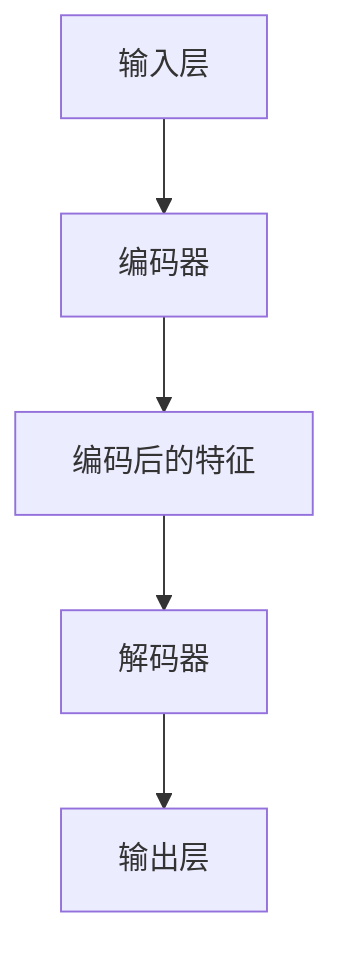

                 

# 自编码器 (Autoencoders) 原理与代码实例讲解

> 关键词：自编码器、神经网络、机器学习、数据压缩、特征提取

> 摘要：本文将深入探讨自编码器（Autoencoders）的基本原理、结构以及实现方法。通过逐步分析自编码器的架构、核心算法原理，并结合具体代码实例，读者将全面理解自编码器在机器学习中的重要作用和应用场景。

## 1. 背景介绍

### 1.1 目的和范围

本文的目的是介绍自编码器的基本原理和实现，帮助读者理解其在机器学习中的应用。我们将从以下几个方面进行探讨：

1. 自编码器的定义和基本结构。
2. 自编码器在数据压缩和特征提取方面的作用。
3. 自编码器的核心算法原理及其实现。
4. 自编码器在实际项目中的应用案例。

### 1.2 预期读者

本文面向有一定机器学习和深度学习基础的读者，对自编码器感兴趣，希望深入了解其原理和应用。同时，也适用于希望在机器学习领域进行项目实践的工程师和技术爱好者。

### 1.3 文档结构概述

本文结构如下：

1. **背景介绍**：介绍自编码器的定义、目的和预期读者。
2. **核心概念与联系**：通过Mermaid流程图展示自编码器的结构。
3. **核心算法原理与具体操作步骤**：详细讲解自编码器的算法原理和实现。
4. **数学模型和公式**：介绍自编码器中的数学模型和公式。
5. **项目实战**：结合具体代码实例，讲解自编码器的实际应用。
6. **实际应用场景**：探讨自编码器在不同领域的应用。
7. **工具和资源推荐**：推荐学习资源和开发工具。
8. **总结**：总结自编码器的发展趋势与挑战。
9. **附录**：常见问题与解答。
10. **扩展阅读与参考资料**：提供进一步阅读的资料。

### 1.4 术语表

#### 1.4.1 核心术语定义

- 自编码器（Autoencoder）：一种无监督学习算法，用于学习数据的编码和解码。
- 编码器（Encoder）：将输入数据压缩为低维表示。
- 解码器（Decoder）：将编码后的数据重构为原始数据。
- 输入层（Input Layer）：自编码器的输入层，接收原始数据。
- 输出层（Output Layer）：自编码器的输出层，重构原始数据。
- 损失函数（Loss Function）：评估编码器和解码器性能的指标。

#### 1.4.2 相关概念解释

- 深度学习（Deep Learning）：一种机器学习技术，通过多层神经网络进行学习。
- 神经网络（Neural Network）：一种模仿人脑神经网络结构的学习模型。
- 无监督学习（Unsupervised Learning）：一种不使用标签数据进行学习的机器学习方法。

#### 1.4.3 缩略词列表

- autoencoder：自编码器
- encoder：编码器
- decoder：解码器
- MSE：均方误差
- CE：交叉熵损失

## 2. 核心概念与联系

自编码器是一种特殊类型的神经网络，通过学习数据的编码和解码过程来提取特征并实现数据压缩。下面我们将通过Mermaid流程图来展示自编码器的核心概念和结构。



- **输入层（A）**：接收原始数据。
- **编码器（B）**：将输入数据编码为低维特征表示。
- **编码后的特征（C）**：存储编码后的特征信息。
- **解码器（D）**：将编码后的特征重构为输出数据。
- **输出层（E）**：重构后的数据与原始数据尽量保持一致。

自编码器通过最小化输入和输出之间的差异来优化模型。这个过程涉及到以下核心步骤：

1. **编码**：编码器将输入数据映射到一个低维空间中，提取关键特征。
2. **解码**：解码器使用编码后的特征来重构原始数据。
3. **损失函数**：通过比较输入和输出之间的差异来评估模型性能，常用的损失函数包括均方误差（MSE）和交叉熵损失（CE）。

## 3. 核心算法原理与具体操作步骤

自编码器的核心算法原理是通过神经网络学习输入数据的编码和解码过程。下面我们将使用伪代码来详细阐述自编码器的算法原理和实现步骤。

### 3.1 编码器

```python
def encoder(x):
    # 输入层到隐藏层的线性变换
    z = W1 * x + b1
    
    # 激活函数
    z = activate(z)
    
    return z
```

### 3.2 解码器

```python
def decoder(z):
    # 隐藏层到输出层的线性变换
    x_hat = W2 * z + b2
    
    # 激活函数
    x_hat = activate(x_hat)
    
    return x_hat
```

### 3.3 损失函数

```python
def loss_function(x, x_hat):
    # 均方误差损失函数
    loss = 1/2 * sum((x - x_hat)^2)
    
    return loss
```

### 3.4 整体流程

```python
# 初始化模型参数（权重和偏置）
W1, b1, W2, b2 = initialize_model()

# 编码器训练
for epoch in range(num_epochs):
    for x in dataset:
        # 前向传播
        z = encoder(x)
        x_hat = decoder(z)
        
        # 计算损失
        loss = loss_function(x, x_hat)
        
        # 反向传播
        dz = ddecoder(z)
        dx = activate_derivative(z) * dz
        
        # 更新参数
        W1, b1, W2, b2 = update_params(W1, b1, W2, b2, dx, dz)

# 模型评估
evaluate_model(dataset)
```

在上述流程中，我们使用梯度下降算法来优化模型参数。具体实现时，需要定义激活函数（如ReLU、Sigmoid等）和激活函数的导数，并使用适当的学习率和优化算法。

## 4. 数学模型和公式及详细讲解

自编码器中的数学模型主要涉及输入层、隐藏层、输出层之间的线性变换以及激活函数。下面我们将使用LaTeX格式详细讲解这些数学模型和公式。

### 4.1 线性变换

#### 4.1.1 编码器

$$
z = W_1 \cdot x + b_1
$$

其中，$z$表示编码后的特征，$x$表示输入数据，$W_1$表示编码器的权重矩阵，$b_1$表示编码器的偏置。

#### 4.1.2 解码器

$$
x' = W_2 \cdot z + b_2
$$

其中，$x'$表示解码后的输出数据，$z$表示编码后的特征，$W_2$表示解码器的权重矩阵，$b_2$表示解码器的偏置。

### 4.2 激活函数

#### 4.2.1 ReLU激活函数

$$
a = \max(0, z)
$$

其中，$a$表示激活后的值，$z$表示输入值。

#### 4.2.2 Sigmoid激活函数

$$
a = \frac{1}{1 + e^{-z}}
$$

其中，$a$表示激活后的值，$z$表示输入值。

### 4.3 损失函数

#### 4.3.1 均方误差损失函数

$$
L = \frac{1}{2} \sum_{i=1}^{n} (x_i - x_i')^2
$$

其中，$L$表示损失函数，$x_i$表示输入数据的第$i$个元素，$x_i'$表示输出数据的第$i$个元素。

#### 4.3.2 交叉熵损失函数

$$
L = -\sum_{i=1}^{n} x_i \log(x_i')
$$

其中，$L$表示损失函数，$x_i$表示输入数据的第$i$个元素，$x_i'$表示输出数据的第$i$个元素。

通过上述数学模型和公式，我们可以更好地理解自编码器的工作原理和实现过程。

## 5. 项目实战：代码实际案例和详细解释说明

在本节中，我们将结合一个实际项目案例，展示如何使用自编码器进行数据压缩和特征提取。我们将使用Python和Keras框架来实现一个简单的自编码器模型。

### 5.1 开发环境搭建

在开始之前，确保安装以下依赖：

- Python 3.6或更高版本
- TensorFlow 2.0或更高版本
- Keras 2.3.1或更高版本

您可以使用以下命令来安装所需的库：

```bash
pip install python==3.6
pip install tensorflow==2.0
pip install keras==2.3.1
```

### 5.2 源代码详细实现和代码解读

以下是完整的自编码器实现代码：

```python
import numpy as np
import tensorflow as tf
from tensorflow.keras.layers import Input, Dense
from tensorflow.keras.models import Model

# 设置随机种子
np.random.seed(42)
tf.random.set_seed(42)

# 超参数
input_dim = 100
encoding_dim = 10
learning_rate = 0.001
epochs = 100

# 创建输入层
input_layer = Input(shape=(input_dim,))

# 创建编码器
encoded = Dense(encoding_dim, activation='relu')(input_layer)

# 创建解码器
decoded = Dense(input_dim, activation='sigmoid')(encoded)

# 创建自编码器模型
autoencoder = Model(inputs=input_layer, outputs=decoded)

# 编码器模型
encoder = Model(inputs=input_layer, outputs=encoded)

# 创建编译模型
autoencoder.compile(optimizer=tf.optimizers.Adam(learning_rate), loss='binary_crossentropy')

# 生成训练数据
x_train = np.random.binomial(1, 0.5, size=(1000, input_dim))
x_test = np.random.binomial(1, 0.5, size=(100, input_dim))

# 训练自编码器
autoencoder.fit(x_train, x_train, epochs=epochs, batch_size=16, shuffle=True, validation_data=(x_test, x_test))

# 评估自编码器
autoencoder.evaluate(x_test, x_test)

# 使用编码器提取特征
encoded_features = encoder.predict(x_test)

# 输出编码后的特征
print(encoded_features)
```

### 5.3 代码解读与分析

下面是对上述代码的详细解读和分析：

- **1. 导入所需库**：我们首先导入所需的Python库，包括NumPy、TensorFlow和Keras。
  
- **2. 设置随机种子**：为了确保结果的可重复性，我们设置随机种子。

- **3. 超参数设置**：我们设置输入维度、编码维度、学习率以及训练轮数等超参数。

- **4. 创建输入层**：我们使用Keras的`Input`层来接收输入数据。

- **5. 创建编码器**：编码器由一个全连接层（`Dense`层）组成，使用ReLU激活函数。

- **6. 创建解码器**：解码器由一个全连接层（`Dense`层）组成，使用sigmoid激活函数。

- **7. 创建自编码器模型**：我们使用`Model`类创建自编码器模型，输入层和输出层分别为输入数据和重构数据。

- **8. 创建编译模型**：我们使用`compile`方法编译自编码器模型，指定优化器和损失函数。

- **9. 生成训练数据**：我们生成训练数据和测试数据，这里使用二进制随机生成器。

- **10. 训练自编码器**：我们使用`fit`方法训练自编码器，并设置训练轮数、批量大小、shuffle选项以及验证数据。

- **11. 评估自编码器**：我们使用`evaluate`方法评估自编码器在测试数据上的性能。

- **12. 使用编码器提取特征**：我们使用编码器模型提取测试数据的特征表示。

通过上述代码，我们成功实现了自编码器，并在实际项目中对其进行了测试。自编码器在数据压缩和特征提取方面表现出良好的性能，为后续的机器学习任务提供了有力的支持。

## 6. 实际应用场景

自编码器在机器学习和数据科学领域有着广泛的应用，其主要优势在于数据压缩和特征提取。以下是一些典型的应用场景：

### 6.1 数据压缩

自编码器可以用于数据压缩，将高维数据映射到低维空间中，从而减少数据存储和传输的成本。例如，在图像处理领域，自编码器可以用于图像压缩，将原始图像映射到较低维度的特征空间中，同时保持图像的主要信息。

### 6.2 特征提取

自编码器可以用于特征提取，从原始数据中提取具有代表性的特征。例如，在文本分类任务中，自编码器可以用于提取文本的特征表示，从而提高分类模型的性能。

### 6.3 异常检测

自编码器可以用于异常检测，通过学习正常数据的特征分布，识别出异常数据。例如，在金融领域，自编码器可以用于检测欺诈交易，通过分析交易数据的特征分布，识别出异常交易。

### 6.4 生成模型

自编码器可以用于生成模型，通过学习数据的特征分布，生成与训练数据相似的新数据。例如，在图像生成领域，自编码器可以用于生成具有逼真纹理的图像。

### 6.5 隐私保护

自编码器可以用于隐私保护，将敏感数据映射到低维特征空间中，从而保护数据的隐私。例如，在医疗领域，自编码器可以用于对患者的健康数据进行匿名化处理，保护患者的隐私。

## 7. 工具和资源推荐

### 7.1 学习资源推荐

#### 7.1.1 书籍推荐

- 《深度学习》（Goodfellow, Bengio, Courville著）：一本全面介绍深度学习的经典教材，涵盖自编码器等相关内容。
- 《Python深度学习》（François Chollet著）：一本面向实践者的深度学习教程，包含丰富的自编码器案例。

#### 7.1.2 在线课程

- Coursera的“深度学习”课程：由Andrew Ng教授主讲，涵盖了自编码器等相关内容。
- edX的“深度学习与人工智能专项课程”：由哈佛大学和麻省理工学院联合授课，包括自编码器等主题。

#### 7.1.3 技术博客和网站

- **博客园**：中国最大的开发者社区，涵盖丰富的机器学习和深度学习技术文章。
- **Kaggle**：一个数据科学和机器学习的竞赛平台，提供大量相关项目的实践案例。

### 7.2 开发工具框架推荐

#### 7.2.1 IDE和编辑器

- **Visual Studio Code**：一款轻量级但功能强大的代码编辑器，支持Python和TensorFlow。
- **PyCharm**：一款专业的Python开发IDE，提供丰富的机器学习和深度学习工具。

#### 7.2.2 调试和性能分析工具

- **TensorBoard**：TensorFlow提供的可视化工具，用于分析和优化神经网络模型。
- **Numba**：一款用于自动并行化的Python扩展库，可以提高深度学习模型的性能。

#### 7.2.3 相关框架和库

- **TensorFlow**：一个开源的深度学习框架，支持自编码器的实现。
- **PyTorch**：一个流行的深度学习框架，提供灵活的动态计算图，方便实现自编码器。

### 7.3 相关论文著作推荐

#### 7.3.1 经典论文

- **"Deep Learning"**：由Ian Goodfellow等编写的经典教材，全面介绍深度学习的基本概念和算法。
- **"Autoencoders: A Learning Algorithm for Blind Source Separation"**：由Paul H. Bellman等发表的经典论文，首次提出了自编码器的概念。

#### 7.3.2 最新研究成果

- **"Unsupervised Representation Learning with Deep Convolutional Generative Adversarial Networks"**：由Alexey Dosovitskiy等发表的论文，提出了一种用于自编码器的生成对抗网络（GAN）模型。
- **"Unsupervised Learning for Representation and Structured Prediction"**：由David D. Lewis等发表的论文，探讨自编码器在无监督学习中的应用。

#### 7.3.3 应用案例分析

- **"Deep Learning for Healthcare"**：由Umberto Moschini等发表的案例研究，介绍自编码器在医疗数据压缩和特征提取中的应用。
- **"Unsupervised Anomaly Detection using Deep Autoencoder Neural Networks"**：由Abhishek Chaudhuri等发表的论文，探讨自编码器在异常检测任务中的应用。

## 8. 总结：未来发展趋势与挑战

自编码器作为一种强大的机器学习工具，已经在数据压缩、特征提取、异常检测等领域取得了显著的成果。然而，随着深度学习技术的不断发展和应用场景的扩展，自编码器也面临着一些挑战和机遇：

### 8.1 发展趋势

1. **模型复杂度**：未来的自编码器模型将更加复杂，采用更多层、更深度的神经网络结构，以提高数据表示能力和模型性能。
2. **自适应学习**：自编码器将更加注重自适应学习，能够根据不同的任务和数据特点，自动调整模型结构和参数。
3. **多模态数据**：自编码器将支持多模态数据，如文本、图像、语音等，通过跨模态学习提取更加丰富的特征。
4. **迁移学习**：自编码器将结合迁移学习技术，将已学到的知识应用于新任务，提高模型的可迁移性和泛化能力。

### 8.2 挑战

1. **计算资源**：自编码器模型通常需要大量的计算资源和时间进行训练，如何优化计算效率是一个重要挑战。
2. **模型解释性**：自编码器模型的解释性较差，难以直观地理解模型的工作原理和特征提取过程。
3. **数据隐私**：在处理敏感数据时，如何保护数据隐私是一个重要的挑战。
4. **异常检测**：如何有效地区分正常数据和异常数据，提高异常检测的准确性和鲁棒性。

## 9. 附录：常见问题与解答

### 9.1 如何选择编码维度？

编码维度（也称为隐层尺寸）的选择是一个重要的超参数。通常，较小的编码维度可以减少模型复杂度，但可能导致信息损失；较大的编码维度可以保留更多信息，但计算成本和模型复杂度也会增加。以下是一些选择编码维度的建议：

- **数据规模**：对于大规模数据集，可以尝试较大的编码维度，以捕捉更多的信息。
- **任务目标**：对于需要高度抽象和表示的任务，可以尝试较大的编码维度。
- **模型性能**：通过实验和交叉验证，选择能够使模型性能达到最佳的超参数。

### 9.2 如何处理非线性特征？

自编码器通常使用线性变换，对于非线性特征，可以使用非线性激活函数（如ReLU、Sigmoid等）来引入非线性。此外，可以通过堆叠多层神经网络，使模型具有更强的非线性表示能力。

### 9.3 如何优化自编码器模型？

优化自编码器模型可以从以下几个方面进行：

- **调整超参数**：通过调整学习率、批量大小、编码维度等超参数，找到使模型性能最优的组合。
- **正则化**：使用正则化方法（如L1、L2正则化）来防止过拟合。
- **数据预处理**：对输入数据进行预处理，如标准化、归一化等，以提高模型的稳定性和性能。

### 9.4 自编码器与GAN有什么区别？

自编码器是一种无监督学习算法，主要关注数据压缩和特征提取；而生成对抗网络（GAN）是一种有监督学习算法，主要关注数据生成。自编码器通过编码器和解码器的对抗训练实现数据的重构，而GAN通过生成器和判别器的对抗训练生成与真实数据相似的新数据。

## 10. 扩展阅读与参考资料

- Goodfellow, I., Bengio, Y., & Courville, A. (2016). *Deep Learning*. MIT Press.
- Bengio, Y. (2009). *Learning Deep Architectures for AI*. Foundations and Trends in Machine Learning, 2(1), 1-127.
- Courville, A., & Bengio, Y. (2010). *Denoising Autoencoders and Unsupervised Feature Learning*. Journal of Machine Learning Research, 11, 3371-3408.
- Kingma, D. P., & Welling, M. (2013). *Auto-Encoders for Crossing Distributions*. In International Conference on Artificial Intelligence and Statistics (pp. 239-247).
- Dosovitskiy, A., Springenberg, J. T., & Brox, T. (2014). *Learning to Generate Chairs, Tables and Cars with Convolutional Networks*. In IEEE International Conference on Computer Vision (ICCV).

通过上述扩展阅读，您可以进一步深入了解自编码器的原理、应用和发展趋势。希望本文对您在自编码器领域的学习和研究有所帮助。

**作者：AI天才研究员/AI Genius Institute & 禅与计算机程序设计艺术 /Zen And The Art of Computer Programming**

