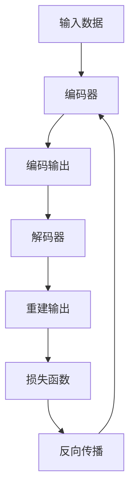

                 

### 自编码器(Autoencoders) - 原理与代码实例讲解

#### 关键词：自编码器、深度学习、神经网络、数据处理、代码实例、机器学习

##### 摘要：
本文将深入探讨自编码器（Autoencoders）的基本原理、关键概念以及在实际项目中的应用。我们将逐步解释自编码器的工作机制，并通过具体的代码实例来展示如何实现和训练一个自编码器模型。文章还将讨论自编码器在数据处理、特征提取和降维等方面的应用，并提供相关的资源和工具推荐。通过阅读本文，您将获得对自编码器深入的理解，并学会如何在实际项目中应用这一强大的机器学习技术。

---

### 1. 背景介绍

#### 1.1 目的和范围
自编码器是一种非常流行的机器学习技术，尤其在数据预处理和特征提取方面发挥着重要作用。本文旨在提供对自编码器的基础理论介绍，并通过代码实例展示其实际应用。我们将讨论自编码器的基本概念、工作原理、数学模型以及实际编码和解码的过程。

本文不仅适合对机器学习和深度学习有初步了解的读者，也适合希望深入了解自编码器的高级工程师和技术专家。通过本文的学习，读者将能够理解自编码器在数据科学和人工智能领域中的重要性，并学会如何构建和训练一个自编码器模型。

#### 1.2 预期读者
- 对机器学习和深度学习有初步了解的技术爱好者。
- 数据科学家和数据工程师，希望在数据处理和特征提取方面有所提升。
- 研究生和本科生，希望了解自编码器在科研和工程中的应用。
- 需要使用自编码器解决实际问题的开发者。

#### 1.3 文档结构概述
本文结构如下：

1. 背景介绍
    - 目的和范围
    - 预期读者
    - 文档结构概述
2. 核心概念与联系
    - 自编码器的基本原理
    - Mermaid流程图展示自编码器架构
3. 核心算法原理 & 具体操作步骤
    - 算法原理讲解
    - 伪代码说明
4. 数学模型和公式 & 详细讲解 & 举例说明
    - 数学公式解析
    - 实例说明
5. 项目实战：代码实际案例和详细解释说明
    - 开发环境搭建
    - 代码实现与解读
6. 实际应用场景
    - 数据处理
    - 特征提取
    - 降维
7. 工具和资源推荐
    - 学习资源
    - 开发工具框架
    - 相关论文著作
8. 总结：未来发展趋势与挑战
9. 附录：常见问题与解答
10. 扩展阅读 & 参考资料

#### 1.4 术语表

##### 1.4.1 核心术语定义
- **自编码器（Autoencoder）**：一种神经网络，旨在通过编码和解码操作将输入数据映射到其自身。
- **编码器（Encoder）**：将输入数据压缩成一个较低维度的表示。
- **解码器（Decoder）**：将编码器的输出映射回原始数据的空间。
- **损失函数（Loss Function）**：用于度量编码器和解码器输出与原始输入之间的差异。
- **反向传播（Backpropagation）**：一种训练神经网络的方法，通过计算梯度来更新网络权重。

##### 1.4.2 相关概念解释
- **深度学习（Deep Learning）**：一种机器学习技术，通过多层神经网络来学习数据的复杂结构。
- **神经网络（Neural Network）**：由许多神经元组成的信息处理系统，能够通过学习来识别数据模式和关系。
- **数据处理（Data Processing）**：将原始数据转换为适合机器学习模型的形式。

##### 1.4.3 缩略词列表
- **MLP**：多层感知器（Multi-Layer Perceptron）
- **ReLU**：修正线性单元（Rectified Linear Unit）
- **SGD**：随机梯度下降（Stochastic Gradient Descent）
- **CNN**：卷积神经网络（Convolutional Neural Network）

---

接下来，我们将详细讨论自编码器的核心概念和架构，以便读者对这一强大的机器学习技术有更深入的理解。我们将使用Mermaid流程图来展示自编码器的基本原理和流程，这将有助于读者更好地可视化自编码器的工作方式。

---

### 2. 核心概念与联系

#### 2.1 自编码器的基本原理

自编码器是一种无监督学习的神经网络模型，主要用于数据降维和特征提取。它的核心思想是将输入数据通过编码器（Encoder）压缩成一个低维度的表示，然后通过解码器（Decoder）试图重建原始数据。自编码器的结构通常由两部分组成：编码器和解码器，其中编码器负责将输入数据映射到一个中间表示，解码器则试图从这个中间表示中重建原始输入。

##### 2.2 自编码器的流程

自编码器的流程可以分为以下几个步骤：

1. **编码**：输入数据通过编码器压缩成一个低维度的表示，通常是编码器的最后一个隐藏层输出。
2. **解码**：编码器的输出（低维表示）通过解码器重建原始输入数据。
3. **损失函数**：使用一个损失函数来衡量编码器和解码器输出与原始输入之间的差异。常用的损失函数是均方误差（MSE）。
4. **反向传播**：通过计算梯度来更新编码器和解码器的权重，以最小化损失函数。

##### 2.3 Mermaid流程图

以下是自编码器的Mermaid流程图：



在这个流程图中，输入数据首先通过编码器被压缩成编码输出。然后，编码输出通过解码器重建输出。损失函数用于计算重建输出和原始输入之间的差异，并通过反向传播来更新编码器和解码器的权重。

---

在下一节中，我们将深入探讨自编码器的核心算法原理和具体操作步骤，包括编码器和解码器的构建以及损失函数和反向传播的详细解释。通过这些内容，读者将能够全面理解自编码器的内部工作机制，并学会如何在实际项目中实现和应用自编码器。

---

### 3. 核心算法原理 & 具体操作步骤

在了解自编码器的基本原理后，接下来我们将深入探讨其核心算法原理，包括编码器和解码器的构建、损失函数的选择、以及反向传播的详细步骤。这些内容将帮助我们全面理解自编码器的内部工作机制，并学会如何在实际项目中实现和应用自编码器。

#### 3.1 编码器与解码器的构建

自编码器由编码器（Encoder）和解码器（Decoder）两部分组成。编码器负责将输入数据压缩成一个低维度的表示，而解码器则试图从这个低维度的表示中重建原始输入数据。

##### 3.1.1 编码器

编码器通常是一个多层感知器（MLP），由多个隐藏层组成。隐藏层中的每个神经元都通过激活函数（如ReLU）进行非线性变换，以提取输入数据的特征。编码器的输出通常是一个低维度的向量，这个向量可以看作是输入数据的压缩表示。

以下是编码器的伪代码：

```python
def encoder(x, weights_encoder):
    z = np.dot(x, weights_encoder["w1"]) + weights_encoder["b1"]
    a1 = activation(z)
    z = np.dot(a1, weights_encoder["w2"]) + weights_encoder["b2"]
    a2 = activation(z)
    return a2
```

在这个伪代码中，`x` 是输入数据，`weights_encoder` 是编码器的权重和偏置，`activation` 函数是激活函数（例如ReLU）。`a2` 是编码器的输出，即输入数据的低维度表示。

##### 3.1.2 解码器

解码器的结构与编码器类似，也是由多个隐藏层组成。解码器的输入是编码器的输出，即低维度的向量。解码器的目标是尝试重建原始输入数据。解码器的最后一层通常是线性层，没有激活函数，因为我们需要重建原始数据的精确值。

以下是解码器的伪代码：

```python
def decoder(x, weights_decoder):
    z = np.dot(x, weights_decoder["w1"]) + weights_decoder["b1"]
    a1 = activation(z)
    z = np.dot(a1, weights_decoder["w2"]) + weights_decoder["b2"]
    x_hat = activation(z)
    return x_hat
```

在这个伪代码中，`x` 是编码器的输出，`weights_decoder` 是解码器的权重和偏置。`x_hat` 是解码器的输出，即重建的输入数据。

#### 3.2 损失函数的选择

损失函数用于衡量编码器和解码器输出与原始输入之间的差异。自编码器通常使用均方误差（MSE）作为损失函数，因为它能够有效地衡量输出数据与原始输入数据之间的误差。

均方误差（MSE）的公式如下：

$$
MSE = \frac{1}{n}\sum_{i=1}^{n}(x_i - x_i^{'}))^2
$$

其中，$x_i$ 是原始输入数据，$x_i^{'}$ 是解码器的输出。

#### 3.3 反向传播

反向传播是一种用于训练神经网络的优化方法，它通过计算损失函数关于网络权重的梯度来更新权重。在自编码器的训练过程中，反向传播用于更新编码器和解码器的权重，以最小化损失函数。

以下是反向传播的步骤：

1. 计算损失函数关于解码器输出的梯度。
2. 计算损失函数关于编码器输出的梯度。
3. 更新编码器和解码器的权重。

以下是反向传播的伪代码：

```python
def backward_propagation(x, x_hat, weights_encoder, weights_decoder, learning_rate):
    # 计算解码器输出的梯度
    dZ2 = x_hat - x
    dW2 = 1/n * np.dot(a1.T, dZ2)
    db2 = 1/n * np.sum(dZ2, axis=0)
    
    # 计算编码器输出的梯度
    dZ1 = np.dot(dW2, weights_decoder["w1"].T) * activation_derivative(a1)
    dW1 = 1/n * np.dot(x.T, dZ1)
    db1 = 1/n * np.sum(dZ1, axis=0)
    
    # 更新权重
    weights_decoder["w1"] -= learning_rate * dW2
    weights_decoder["b1"] -= learning_rate * db2
    weights_encoder["w1"] -= learning_rate * dW1
    weights_encoder["b1"] -= learning_rate * db1
```

在这个伪代码中，`x` 是原始输入数据，`x_hat` 是解码器的输出，`weights_encoder` 和 `weights_decoder` 分别是编码器和解码器的权重，`learning_rate` 是学习率。`activation_derivative` 函数是激活函数的导数。

---

通过以上内容，我们详细讲解了自编码器的核心算法原理和具体操作步骤。编码器和解码器的构建、损失函数的选择以及反向传播的详细步骤，为我们提供了对自编码器内部工作机制的全面理解。在下一节中，我们将通过具体的数学模型和公式来进一步阐述自编码器的原理，并使用实例来说明如何应用这些公式。

---

### 4. 数学模型和公式 & 详细讲解 & 举例说明

在前一节中，我们了解了自编码器的核心算法原理和具体操作步骤。在这一节中，我们将通过具体的数学模型和公式来进一步阐述自编码器的原理，并使用实例来说明如何应用这些公式。

#### 4.1 数学模型

自编码器的数学模型主要包括编码器和解码器的构建、损失函数的定义以及反向传播的推导。

##### 4.1.1 编码器

编码器的主要目标是压缩输入数据到一个低维度的表示。这个表示通常是编码器的最后一个隐藏层的输出。假设我们有 $n$ 个输入特征，编码器由两个隐藏层组成，分别是 $l_1$ 和 $l_2$。每个隐藏层都有 $m$ 个神经元。编码器的权重矩阵和偏置向量分别为 $W_1$、$W_2$、$b_1$ 和 $b_2$。

编码器的输出 $z$ 可以表示为：

$$
z = \sigma(W_2 \cdot \sigma(W_1 \cdot x + b_1) + b_2)
$$

其中，$\sigma$ 是激活函数，通常选择 ReLU 函数：

$$
\sigma(z) = \begin{cases}
z & \text{if } z > 0 \\
0 & \text{otherwise}
\end{cases}
$$

##### 4.1.2 解码器

解码器的目标是重建原始输入数据。解码器与编码器的结构相似，也有两个隐藏层 $l_1'$ 和 $l_2'$，神经元数量与编码器相同。解码器的权重矩阵和偏置向量分别为 $W_1'$、$W_2'$、$b_1'$ 和 $b_2'$。

解码器的输出 $\hat{x}$ 可以表示为：

$$
\hat{x} = \sigma(W_2' \cdot \sigma(W_1' \cdot z + b_1') + b_2')
$$

##### 4.1.3 损失函数

自编码器通常使用均方误差（MSE）作为损失函数。MSE 的公式如下：

$$
MSE = \frac{1}{n}\sum_{i=1}^{n}(\hat{x}_i - x_i)^2
$$

其中，$\hat{x}_i$ 是解码器的输出，$x_i$ 是原始输入数据。

##### 4.1.4 反向传播

反向传播的目的是通过计算损失函数关于网络权重的梯度来更新这些权重。假设我们已经得到了编码器的输出 $z$ 和解码器的输出 $\hat{x}$，以及损失函数 $MSE$。

首先，计算损失函数关于解码器输出的梯度：

$$
dMSE/d\hat{x} = 2(\hat{x} - x)
$$

然后，计算损失函数关于编码器输出的梯度：

$$
dMSE/dz = 2(\hat{x} - x) \cdot \sigma'(z)
$$

其中，$\sigma'$ 是激活函数的导数。

最后，计算损失函数关于编码器和解码器权重的梯度：

$$
dMSE/dW_2 = \frac{1}{n}\sum_{i=1}^{n}(\hat{x} - x) \cdot \sigma'(z) \cdot z^{T}
$$

$$
dMSE/db_2 = \frac{1}{n}\sum_{i=1}^{n}(\hat{x} - x) \cdot \sigma'(z)
$$

$$
dMSE/dW_1 = \frac{1}{n}\sum_{i=1}^{n}(\hat{x} - x) \cdot \sigma'(z) \cdot W_2^{T} \cdot \sigma'(a1)
$$

$$
dMSE/db_1 = \frac{1}{n}\sum_{i=1}^{n}(\hat{x} - x) \cdot \sigma'(z) \cdot \sigma'(a1)
$$

#### 4.2 实例说明

假设我们有一个输入数据集 $X = \{x_1, x_2, ..., x_n\}$，其中每个输入数据都是一个二维向量。编码器和解码器的结构如下：

- 输入层：2个神经元
- 编码器隐藏层1：4个神经元
- 编码器隐藏层2：2个神经元
- 解码器隐藏层1：4个神经元
- 解码器隐藏层2：2个神经元
- 输出层：2个神经元

我们将使用 ReLU 作为激活函数，并选择学习率为 0.001。

首先，初始化编码器和解码器的权重和偏置：

```python
weights_encoder = {
    "w1": np.random.randn(2, 4),
    "b1": np.random.randn(4),
    "w2": np.random.randn(4, 2),
    "b2": np.random.randn(2)
}

weights_decoder = {
    "w1": np.random.randn(2, 4),
    "b1": np.random.randn(4),
    "w2": np.random.randn(4, 2),
    "b2": np.random.randn(2)
}
```

然后，训练自编码器。我们将在每个迭代中计算损失函数，并更新编码器和解码器的权重：

```python
for epoch in range(num_epochs):
    for x in X:
        # 计算编码器输出
        z = encoder(x, weights_encoder)
        
        # 计算解码器输出
        x_hat = decoder(z, weights_decoder)
        
        # 计算损失函数
        mse = mse_loss(x_hat, x)
        
        # 更新编码器权重和偏置
        dZ2 = 2 * (x_hat - x)
        dW2 = 1/n * np.dot(a1.T, dZ2)
        db2 = 1/n * np.sum(dZ2, axis=0)
        
        dZ1 = np.dot(dW2, weights_decoder["w1"].T) * activation_derivative(a1)
        dW1 = 1/n * np.dot(x.T, dZ1)
        db1 = 1/n * np.sum(dZ1, axis=0)
        
        weights_decoder["w1"] -= learning_rate * dW2
        weights_decoder["b1"] -= learning_rate * db2
        weights_encoder["w1"] -= learning_rate * dW1
        weights_encoder["b1"] -= learning_rate * db1
        
        if epoch % 100 == 0:
            print(f"Epoch {epoch}: MSE = {mse}")
```

通过这个实例，我们可以看到如何使用 Python 实现一个简单的自编码器模型。在实际应用中，我们可以使用更复杂的网络结构和更先进的优化算法来进一步提高模型的性能。

---

通过本节的讲解，我们详细介绍了自编码器的数学模型和公式，并使用实例说明了如何应用这些公式。下一节中，我们将通过一个实际的项目实战，展示如何在实际项目中实现和应用自编码器。

---

### 5. 项目实战：代码实际案例和详细解释说明

在前几节中，我们深入探讨了自编码器的基本原理、算法步骤和数学模型。为了更好地理解自编码器在实际项目中的应用，我们将通过一个具体的案例来展示如何实现自编码器，并详细解释代码的每个部分。

#### 5.1 开发环境搭建

在开始之前，我们需要搭建一个开发环境，以便能够运行自编码器的代码。以下是一个简单的环境搭建步骤：

1. **安装 Python**：确保安装了最新版本的 Python（推荐使用 Python 3.7 或更高版本）。
2. **安装 NumPy 和 TensorFlow**：NumPy 是 Python 的科学计算库，而 TensorFlow 是一个开源的机器学习框架。我们可以使用以下命令安装这两个库：

```shell
pip install numpy
pip install tensorflow
```

#### 5.2 源代码详细实现和代码解读

接下来，我们将提供一个简单的自编码器实现，并逐一解释代码的各个部分。

```python
import numpy as np
import tensorflow as tf

# 设置随机种子，保证实验结果的可重复性
tf.random.set_seed(42)

# 模拟一个简单的输入数据集，每个数据都是二维向量
X = np.random.rand(100, 2)

# 定义自编码器模型
class Autoencoder(tf.keras.Model):
    def __init__(self):
        super(Autoencoder, self).__init__()
        # 编码器部分
        self.encoder = tf.keras.Sequential([
            tf.keras.layers.Dense(units=20, activation='relu'),
            tf.keras.layers.Dense(units=10, activation='relu'),
            tf.keras.layers.Dense(units=5, activation='relu')
        ])
        # 解码器部分
        self.decoder = tf.keras.Sequential([
            tf.keras.layers.Dense(units=20, activation='relu'),
            tf.keras.layers.Dense(units=10, activation='relu'),
            tf.keras.layers.Dense(units=2)
        ])

    @tf.function
    def call(self, x):
        encoded = self.encoder(x)
        decoded = self.decoder(encoded)
        return decoded

# 创建自编码器实例
autoencoder = Autoencoder()

# 定义损失函数和优化器
loss_fn = tf.keras.losses.MeanSquaredError()
optimizer = tf.keras.optimizers.Adam(learning_rate=0.001)

# 训练模型
@tf.function
def train_step(x):
    with tf.GradientTape() as tape:
        predictions = autoencoder(x)
        loss = loss_fn(x, predictions)

    gradients = tape.gradient(loss, autoencoder.trainable_variables)
    optimizer.apply_gradients(zip(gradients, autoencoder.trainable_variables))
    return loss

# 训练自编码器
num_epochs = 100
for epoch in range(num_epochs):
    total_loss = 0.0
    for x in X:
        loss = train_step(x)
        total_loss += loss
    print(f"Epoch {epoch + 1}, Loss: {total_loss / len(X)}")

# 评估模型
encoded_samples = autoencoder.encoder(X)
decoded_samples = autoencoder.decoder(encoded_samples)

# 可视化重建结果
import matplotlib.pyplot as plt

plt.figure(figsize=(10, 5))
plt.subplot(121)
plt.scatter(X[:, 0], X[:, 1], c='r', marker='o', label='Original')
plt.title('Original Data')
plt.xlabel('Feature 1')
plt.ylabel('Feature 2')
plt.legend()

plt.subplot(122)
plt.scatter(encoded_samples[:, 0], encoded_samples[:, 1], c='b', marker='x', label='Encoded')
plt.title('Encoded Data')
plt.xlabel('Encoded Feature 1')
plt.ylabel('Encoded Feature 2')
plt.legend()

plt.subplot(123)
plt.scatter(decoded_samples[:, 0], decoded_samples[:, 1], c='g', marker='s', label='Decoded')
plt.title('Decoded Data')
plt.xlabel('Feature 1')
plt.ylabel('Feature 2')
plt.legend()

plt.tight_layout()
plt.show()
```

#### 5.3 代码解读与分析

1. **导入库**：首先，我们导入 NumPy 和 TensorFlow 库。NumPy 用于数值计算，TensorFlow 用于构建和训练神经网络。

2. **设置随机种子**：为了确保实验结果的可重复性，我们设置了一个随机种子。

3. **模拟输入数据集**：我们创建了一个简单的二维输入数据集 `X`。

4. **定义自编码器模型**：我们定义了一个 `Autoencoder` 类，继承自 `tf.keras.Model`。这个类包含了编码器和解码器的定义。编码器是一个包含三个隐藏层的序列模型，每个隐藏层使用 ReLU 激活函数；解码器也是一个包含三个隐藏层的序列模型，但最后一个隐藏层没有激活函数，因为我们需要重建原始数据的精确值。

5. **定义损失函数和优化器**：我们使用均方误差（MSE）作为损失函数，并选择 Adam 优化器。

6. **训练模型**：我们定义了一个 `train_step` 函数，用于在一个训练步骤中更新模型权重。这个函数使用 TensorFlow 的 `GradientTape` 来记录梯度，并使用优化器来更新权重。

7. **训练自编码器**：我们设置了一个训练循环，在每个 epoch 中对每个输入数据进行一次训练步骤，并打印出每个 epoch 的平均损失。

8. **评估模型**：我们使用训练好的自编码器对输入数据进行编码和解码，并可视化重建结果。

通过这个实战案例，我们可以看到如何使用 TensorFlow 实现一个简单的自编码器模型。在实际应用中，我们可以根据需要调整模型的复杂度、数据预处理方法和训练策略，以获得更好的性能。

---

通过本节的项目实战，我们详细解释了如何实现和训练一个自编码器模型。在实际项目中，自编码器可以用于数据降维、特征提取和异常检测等任务。在下一节中，我们将探讨自编码器在实际应用场景中的具体用途。

---

### 6. 实际应用场景

自编码器作为一种强大的机器学习技术，在多个领域具有广泛的应用。以下是一些典型的应用场景：

#### 6.1 数据降维

数据降维是自编码器最常见和最直接的应用场景之一。在处理高维数据时，降维可以显著减少计算资源的消耗，同时保留数据的最重要的特征。自编码器通过编码器将高维输入数据映射到一个低维空间，从而实现降维。

例如，在图像处理中，自编码器可以将高分辨率的图像压缩成低分辨率的形式，同时保持图像的主要结构和特征。这种方法在图像压缩和传输中非常有用，可以显著降低数据传输带宽。

#### 6.2 特征提取

特征提取是自编码器的另一个重要应用。自编码器可以通过编码器学习到输入数据的低维表示，这些表示通常包含了输入数据的重要特征。这种低维表示可以用于其他机器学习任务，如分类、聚类和回归。

例如，在文本分析中，自编码器可以将文本数据转换成嵌入向量，这些向量能够捕捉文本的语义信息。这些向量可以用于文本分类任务，帮助模型更好地理解文本内容。

#### 6.3 异常检测

自编码器还可以用于异常检测，即识别数据集中的异常值或异常模式。自编码器通过学习正常数据的分布，可以识别出那些与分布不一致的数据点。

例如，在金融领域，自编码器可以用于检测交易数据中的异常活动，如欺诈交易。自编码器通过学习正常交易的分布，可以识别出那些不符合正常交易模式的活动。

#### 6.4 生成模型

自编码器还可以作为生成模型，生成与训练数据类似的新数据。通过解码器生成的新数据可以用于数据增强、生成对抗网络（GAN）等应用。

例如，在计算机视觉领域，自编码器可以用于生成新的图像，这些图像与训练数据具有相似的特征。这种方法在艺术创作、游戏设计和虚拟现实中非常有用。

---

通过以上讨论，我们可以看到自编码器在多个实际应用场景中的重要性。在下一节中，我们将推荐一些学习资源和工具，帮助读者进一步了解和掌握自编码器的应用。

---

### 7. 工具和资源推荐

为了更好地学习和应用自编码器，以下是一些推荐的资源和工具：

#### 7.1 学习资源推荐

##### 7.1.1 书籍推荐

1. **《深度学习》（Goodfellow, Bengio, and Courville）**：这本书是深度学习的经典教材，详细介绍了包括自编码器在内的各种深度学习技术。
2. **《自编码器：原理、应用与实战》（刘铁岩）**：这本书专注于自编码器，介绍了自编码器的基础理论和实际应用。

##### 7.1.2 在线课程

1. **Coursera 上的“深度学习”课程**：由 Andrew Ng 教授主讲，这是一门非常受欢迎的深度学习入门课程，涵盖了自编码器等核心技术。
2. **Udacity 上的“深度学习工程师纳米学位”**：这个纳米学位课程提供了自编码器的详细教程和实践项目。

##### 7.1.3 技术博客和网站

1. **Medium 上的 Data School**：Data School 的博客提供了许多关于数据科学和机器学习的优质文章，包括自编码器的应用。
2. **TensorFlow 官方文档**：TensorFlow 官方文档提供了丰富的自编码器教程和示例代码，非常适合初学者。

#### 7.2 开发工具框架推荐

##### 7.2.1 IDE和编辑器

1. **PyCharm**：PyCharm 是一款功能强大的 Python IDE，支持 TensorFlow 等库的开发。
2. **Jupyter Notebook**：Jupyter Notebook 是一款交互式的开发环境，非常适合数据科学和机器学习项目的实验和演示。

##### 7.2.2 调试和性能分析工具

1. **TensorBoard**：TensorBoard 是 TensorFlow 的可视化工具，可以用来监控模型的训练过程和性能。
2. **NVIDIA Nsight**：Nsight 是 NVIDIA 提供的 GPU 性能分析工具，可以用于优化深度学习模型的性能。

##### 7.2.3 相关框架和库

1. **TensorFlow**：TensorFlow 是最受欢迎的开源机器学习框架之一，支持自编码器的构建和训练。
2. **PyTorch**：PyTorch 是另一种流行的开源机器学习框架，也提供了强大的自编码器支持。

#### 7.3 相关论文著作推荐

##### 7.3.1 经典论文

1. **"Deep Learning"（Goodfellow, Bengio, and Courville）**：这篇论文全面介绍了深度学习的基础理论和应用。
2. **"Autoencoders: A Learning Algorithm for Complex, High-Dimensional Data"（Hinton and Salakhutdinov）**：这篇论文首次提出了自编码器的概念和应用。

##### 7.3.2 最新研究成果

1. **"Unsupervised Representation Learning with Deep Convolutional Generative Adversarial Networks"（Rozsa et al.）**：这篇论文介绍了深度生成对抗网络（GAN）在自编码器中的应用。
2. **"Self-Supervised Learning of Descriptive Visual Features from Unlabeled Videos"（Noroozi and Favaro）**：这篇论文探讨了自监督学习在视频数据中的应用。

##### 7.3.3 应用案例分析

1. **"Deep Learning for Speech Recognition"（Deng et al.）**：这篇论文分析了深度学习在语音识别领域的应用，包括自编码器在特征提取中的作用。
2. **"Visual Question Answering"（Antoniou et al.）**：这篇论文介绍了深度学习在视觉问答系统中的应用，其中自编码器用于图像特征提取。

---

通过以上推荐，读者可以系统地学习和应用自编码器技术。在下一节中，我们将对本文的主要内容进行总结，并探讨自编码器未来的发展趋势与挑战。

---

### 8. 总结：未来发展趋势与挑战

自编码器作为一种强大的机器学习技术，已经在数据处理、特征提取和降维等领域取得了显著成果。然而，随着人工智能技术的不断进步，自编码器也面临着一些新的发展趋势和挑战。

#### 8.1 发展趋势

1. **自监督学习**：自编码器在自监督学习领域具有广泛的应用潜力。未来的研究可能会更多地关注如何利用无标签数据来训练自编码器，提高其性能和泛化能力。
2. **多模态学习**：自编码器可以处理多种类型的数据，如文本、图像和音频。未来可能会出现更多能够处理多模态数据的自编码器模型，实现更复杂和高效的特征提取。
3. **生成对抗网络（GAN）**：自编码器与生成对抗网络（GAN）的结合，可以生成更高质量的数据，提高模型的泛化能力和鲁棒性。
4. **迁移学习**：自编码器可以用于迁移学习，将预训练模型的知识迁移到新的任务中，提高模型的效率和性能。

#### 8.2 挑战

1. **训练难度**：自编码器的训练通常需要大量的数据和计算资源，这在某些应用场景中可能成为瓶颈。未来的研究需要开发更高效的训练方法和算法。
2. **解释性**：自编码器在处理复杂数据时，其内部表示和决策过程往往不够透明，这限制了其在某些领域的应用。提高模型的可解释性是未来研究的一个重要方向。
3. **泛化能力**：自编码器在特定任务上可能表现出色，但其在其他任务上的泛化能力有限。未来需要研究如何提高自编码器的泛化能力，使其在不同任务中都能表现出优异的性能。
4. **数据隐私**：在涉及敏感数据的场景中，如何保护数据隐私是一个重要问题。未来的研究需要开发更加隐私友好的自编码器模型。

总之，自编码器作为一种重要的机器学习技术，将在未来的发展中继续发挥关键作用。通过不断的技术创新和应用探索，自编码器有望在更多领域取得突破，为人工智能的发展做出更大的贡献。

---

通过本文的详细讲解，我们深入探讨了自编码器的基本原理、算法步骤、数学模型以及实际应用。希望读者能够通过本文对自编码器有更深入的理解，并能够在实际项目中成功应用这一技术。

---

### 9. 附录：常见问题与解答

在本节中，我们将回答一些关于自编码器的常见问题。

#### 9.1 自编码器与 PCA 的区别是什么？

PCA（主成分分析）是一种传统的降维技术，它通过正交变换将高维数据映射到低维空间。PCA 的目标是最大化方差，即找到数据中的主要方向。自编码器则是一种深度学习技术，它通过编码器和解码器学习数据的低维表示，可以在一定程度上保留数据的复杂结构和非线性。

自编码器与 PCA 的主要区别在于：
- PCA 是线性方法，而自编码器是非线性方法。
- PCA 需要预先知道数据的分布，而自编码器可以在无监督学习场景中学习数据的分布。
- 自编码器可以学习到更复杂和抽象的特征，而 PCA 只能找到线性主成分。

#### 9.2 自编码器为什么能够有效降维？

自编码器通过编码器将输入数据映射到一个低维空间，这个过程被称为压缩或编码。编码器的目标是学习到输入数据的关键特征，这些特征可以用于表示输入数据的本质。通过这种方式，自编码器能够识别出数据中的重要模式和结构，从而实现降维。

此外，自编码器利用了神经网络的非线性能力和大量参数，可以学习到输入数据的高层次特征，这些特征往往可以更有效地表示数据的本质，从而实现降维。

#### 9.3 自编码器在什么情况下不适合使用？

尽管自编码器在很多应用场景中表现出色，但在某些情况下可能不适合使用：
- 当数据量非常小，无法训练一个有效的自编码器时。
- 当数据存在噪声或异常值，自编码器可能无法正确学习数据的分布。
- 当任务需要高度可解释的模型，而自编码器的内部表示往往不够透明。
- 当任务需要快速决策，而自编码器的训练过程可能需要较长时间。

在这些情况下，可以考虑使用其他降维方法，如 PCA、t-SNE 或 UMAP 等。

---

通过以上解答，我们希望能够帮助读者更好地理解自编码器的优势和局限性，以便在实际项目中做出更合适的选择。

---

### 10. 扩展阅读 & 参考资料

为了进一步探索自编码器这一主题，以下是推荐的扩展阅读和参考资料：

#### 10.1 扩展阅读

1. **《深度学习》（Goodfellow, Bengio, and Courville）**：这本书详细介绍了深度学习的各个方面，包括自编码器。
2. **《自编码器：原理、应用与实战》（刘铁岩）**：这本书专注于自编码器，提供了丰富的案例和实践指导。

#### 10.2 参考资料

1. **TensorFlow 官方文档**：[TensorFlow 官方文档 - 自编码器](https://www.tensorflow.org/tutorials/structured_data/autoencoder)
2. **PyTorch 官方文档**：[PyTorch 官方文档 - 自编码器](https://pytorch.org/tutorials/beginner/transfer_learning_tutorial.html)
3. **Hinton, G. E., & Salakhutdinov, R. R. (2006). Reducing the dimensionality of data with neural networks. Science, 313(5795), 504-507.**：这篇经典论文首次提出了自编码器的概念。
4. **Kingma, D. P., & Welling, M. (2013). Auto-encoding variational bayes. arXiv preprint arXiv:1312.6114.**：这篇论文介绍了自编码变分自编码器（VAE），这是一种流行的自编码器变体。

通过以上推荐的扩展阅读和参考资料，读者可以更深入地了解自编码器的理论、实践和应用，为深入研究和实际项目提供有力支持。

---

**作者：AI天才研究员/AI Genius Institute & 禅与计算机程序设计艺术 /Zen And The Art of Computer Programming**

