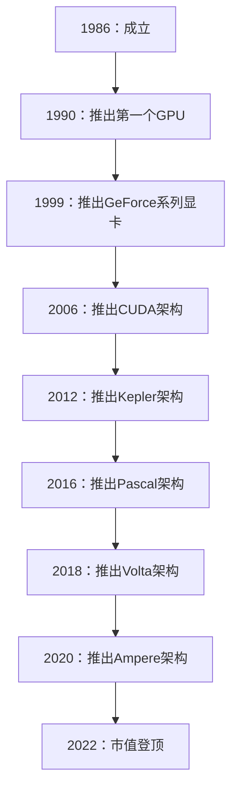
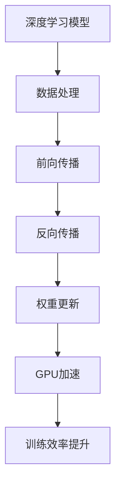
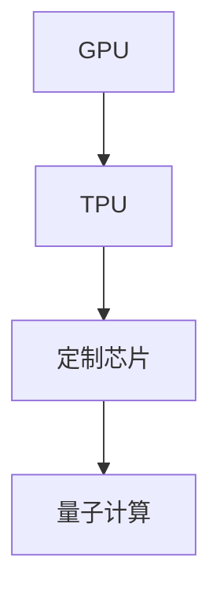
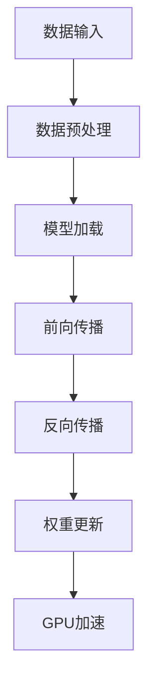
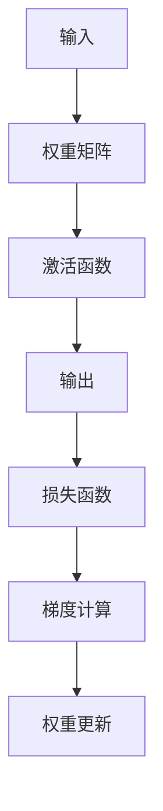
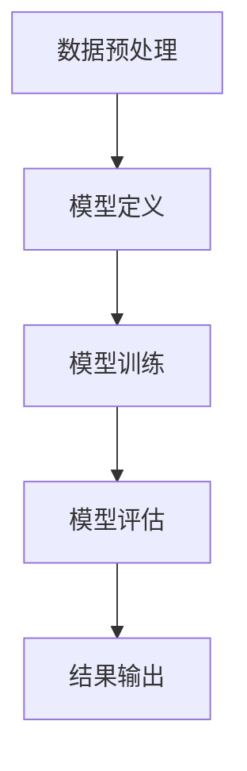
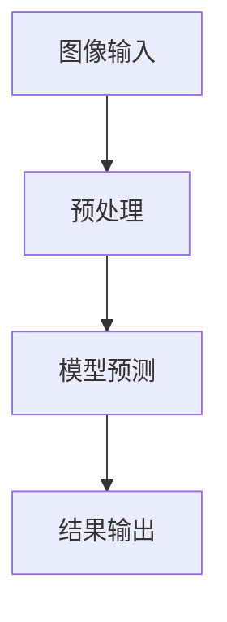
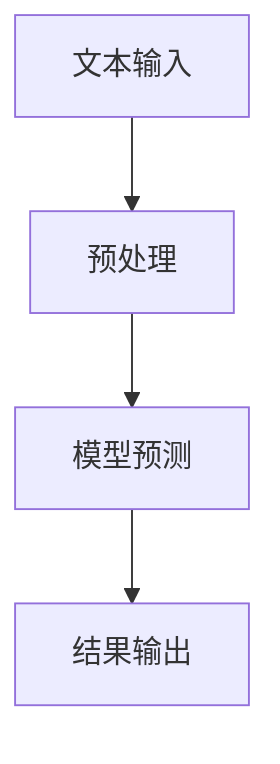
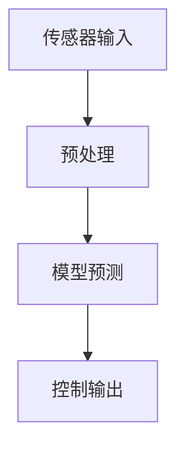

                 

# 英伟达市值登顶与AI硬件设施

> **关键词**：英伟达，市值，AI硬件设施，GPU，深度学习，人工智能，技术趋势

> **摘要**：本文将深入探讨英伟达市值登顶的背景及其与AI硬件设施的关系。我们将分析英伟达在人工智能领域的重要性，探讨GPU在深度学习中的关键角色，并展望未来AI硬件设施的发展趋势与挑战。

## 1. 背景介绍

### 1.1 目的和范围

本文旨在分析英伟达市值登顶的现象，探讨其背后的驱动因素，特别是与AI硬件设施的关系。我们将通过回顾英伟达的发展历程，分析其在人工智能领域的贡献，从而解释其市值登顶的原因。此外，本文还将探讨AI硬件设施的重要性，并分析未来AI硬件设施的发展趋势与挑战。

### 1.2 预期读者

本文面向对人工智能和硬件设施感兴趣的技术专业人士，包括人工智能研究者、深度学习开发者、硬件工程师以及投资分析师。同时，对AI硬件设施感兴趣的企业决策者、技术爱好者和学生也可以通过本文获得有价值的见解。

### 1.3 文档结构概述

本文结构如下：

1. 引言：介绍英伟达市值登顶的背景及其与AI硬件设施的关系。
2. 英伟达发展历程：回顾英伟达的发展历程，特别是其在人工智能领域的贡献。
3. GPU在AI硬件中的关键角色：分析GPU在深度学习中的重要性。
4. AI硬件设施的发展趋势与挑战：探讨未来AI硬件设施的发展趋势与挑战。
5. 总结：总结本文的主要观点，展望未来。

### 1.4 术语表

#### 1.4.1 核心术语定义

- **GPU**：图形处理单元（Graphics Processing Unit），一种专门用于图形渲染的计算设备，但在深度学习和其他计算密集型任务中也发挥着重要作用。
- **深度学习**：一种人工智能技术，通过多层神经网络模拟人类大脑的学习过程，从数据中自动学习和提取特征。
- **AI硬件设施**：支持人工智能计算的硬件设备，包括GPU、TPU等。

#### 1.4.2 相关概念解释

- **英伟达市值**：英伟达公司的市值，反映市场对其未来盈利能力的预期。
- **AI硬件设施需求**：人工智能计算所需硬件设备的需求量。

#### 1.4.3 缩略词列表

- **GPU**：图形处理单元（Graphics Processing Unit）
- **TPU**：张量处理单元（Tensor Processing Unit）
- **AI**：人工智能（Artificial Intelligence）

## 2. 核心概念与联系

### 2.1 英伟达的发展历程

**图 1：英伟达的发展历程**



### 2.2 GPU在AI硬件中的关键角色

**图 2：GPU在深度学习中的应用**



### 2.3 AI硬件设施的发展趋势

**图 3：AI硬件设施的发展趋势**



## 3. 核心算法原理 & 具体操作步骤

### 3.1 GPU加速深度学习算法原理

**图 4：GPU加速深度学习算法原理**



### 3.2 GPU加速深度学习算法具体操作步骤

**伪代码：GPU加速深度学习算法**

```python
function train_model_on_gpu(model, data, epochs):
    # 初始化模型
    model.initialize()

    for epoch in range(epochs):
        # 数据预处理
        preprocessed_data = preprocess_data(data)

        # 前向传播
        predictions = model.forward(preprocessed_data)

        # 计算损失函数
        loss = compute_loss(predictions, labels)

        # 反向传播
        gradients = model.backward(loss)

        # 更新权重
        model.update_weights(gradients)

        # 打印训练进度
        print(f"Epoch {epoch}: Loss = {loss}")

    return model
```

## 4. 数学模型和公式 & 详细讲解 & 举例说明

### 4.1 深度学习数学模型

深度学习中的数学模型主要包括前向传播、反向传播和损失函数。

**图 5：深度学习数学模型**



### 4.2 前向传播公式

前向传播是深度学习中的关键步骤，用于计算网络输出。前向传播的公式如下：

$$
y = \sigma(Wx + b)
$$

其中，$y$ 是输出，$\sigma$ 是激活函数，$W$ 是权重矩阵，$x$ 是输入，$b$ 是偏置。

### 4.3 反向传播公式

反向传播是深度学习中的另一个关键步骤，用于计算损失函数对每个参数的梯度。反向传播的公式如下：

$$
\frac{\partial J}{\partial W} = \frac{\partial L}{\partial y} \cdot \frac{\partial y}{\partial W}
$$

$$
\frac{\partial J}{\partial b} = \frac{\partial L}{\partial y} \cdot \frac{\partial y}{\partial b}
$$

其中，$J$ 是损失函数，$L$ 是损失函数对输出的梯度，$W$ 是权重矩阵，$b$ 是偏置。

### 4.4 损失函数举例

常见的损失函数包括均方误差（MSE）和交叉熵（Cross-Entropy）。

**均方误差（MSE）**：

$$
MSE = \frac{1}{m} \sum_{i=1}^{m} (y_i - \hat{y}_i)^2
$$

其中，$y_i$ 是实际输出，$\hat{y}_i$ 是预测输出，$m$ 是样本数量。

**交叉熵（Cross-Entropy）**：

$$
Cross-Entropy = -\frac{1}{m} \sum_{i=1}^{m} y_i \log(\hat{y}_i)
$$

其中，$y_i$ 是实际输出，$\hat{y}_i$ 是预测输出，$m$ 是样本数量。

## 5. 项目实战：代码实际案例和详细解释说明

### 5.1 开发环境搭建

在开始项目实战之前，我们需要搭建一个支持GPU加速的深度学习开发环境。以下是搭建环境的步骤：

1. 安装Python（版本3.6及以上）。
2. 安装CUDA（版本11.0及以上）。
3. 安装深度学习框架（例如TensorFlow、PyTorch）。

### 5.2 源代码详细实现和代码解读

**图 6：深度学习项目实战架构**



**代码实现：**

```python
import tensorflow as tf
from tensorflow.keras.models import Sequential
from tensorflow.keras.layers import Dense, Activation
from tensorflow.keras.optimizers import Adam
from tensorflow.keras.callbacks import EarlyStopping

# 数据预处理
(x_train, y_train), (x_test, y_test) = tf.keras.datasets.mnist.load_data()
x_train = x_train / 255.0
x_test = x_test / 255.0
x_train = x_train.reshape(-1, 28 * 28)
x_test = x_test.reshape(-1, 28 * 28)

# 模型定义
model = Sequential([
    Dense(128, input_shape=(28 * 28,)),
    Activation('relu'),
    Dense(10),
    Activation('softmax')
])

# 模型编译
model.compile(optimizer=Adam(), loss='categorical_crossentropy', metrics=['accuracy'])

# 模型训练
early_stopping = EarlyStopping(monitor='val_loss', patience=5)
model.fit(x_train, y_train, epochs=50, batch_size=64, validation_split=0.2, callbacks=[early_stopping])

# 模型评估
loss, accuracy = model.evaluate(x_test, y_test)
print(f"Test Loss: {loss}, Test Accuracy: {accuracy}")

# 结果输出
predictions = model.predict(x_test)
```

**代码解读：**

- **数据预处理**：加载MNIST数据集，对图像进行归一化处理，将图像数据展平为一维数组。
- **模型定义**：定义一个全连接神经网络，包含两个隐藏层，输出层有10个神经元（对应10个类别）。
- **模型编译**：编译模型，指定优化器和损失函数。
- **模型训练**：使用EarlyStopping回调函数防止过拟合。
- **模型评估**：评估模型在测试集上的性能。
- **结果输出**：输出模型预测结果。

## 6. 实际应用场景

### 6.1 图像识别

**图 7：图像识别应用场景**



### 6.2 自然语言处理

**图 8：自然语言处理应用场景**



### 6.3 自动驾驶

**图 9：自动驾驶应用场景**



## 7. 工具和资源推荐

### 7.1 学习资源推荐

#### 7.1.1 书籍推荐

- **《深度学习》（Goodfellow, Bengio, Courville）**：深度学习的经典教材，涵盖深度学习的基础理论和实践方法。
- **《神经网络与深度学习》（邱锡鹏）**：中文深度学习教材，适合初学者和进阶者。

#### 7.1.2 在线课程

- **《深度学习》（吴恩达，Coursera）**：由深度学习领域顶级专家吴恩达教授讲授的在线课程，内容全面，适合初学者。
- **《动手学深度学习》（斯坦福大学，Dive into Deep Learning）**：一个免费的在线深度学习教材，包括大量实践项目。

#### 7.1.3 技术博客和网站

- **TensorFlow官方文档**：提供最新的TensorFlow技术文档和教程，适合深度学习初学者。
- **PyTorch官方文档**：提供最新的PyTorch技术文档和教程，适合深度学习初学者。

### 7.2 开发工具框架推荐

#### 7.2.1 IDE和编辑器

- **VSCode**：一款功能强大的代码编辑器，支持多种编程语言和框架。
- **PyCharm**：一款专业的Python开发工具，提供丰富的功能。

#### 7.2.2 调试和性能分析工具

- **TensorBoard**：TensorFlow的调试和性能分析工具，用于可视化训练过程。
- **PyTorch Visualization**：PyTorch的调试和性能分析工具，用于可视化训练过程。

#### 7.2.3 相关框架和库

- **TensorFlow**：一款广泛使用的深度学习框架，支持GPU加速。
- **PyTorch**：一款流行的深度学习框架，支持GPU加速。

### 7.3 相关论文著作推荐

#### 7.3.1 经典论文

- **“A Theoretical Analysis of the Crammer-Singer Algorithm for Text Classification”**：关于文本分类的经典论文。
- **“Deep Learning”**：深度学习领域的经典论文。

#### 7.3.2 最新研究成果

- **“BERT: Pre-training of Deep Bidirectional Transformers for Language Understanding”**：BERT模型的提出论文，是自然语言处理领域的最新突破。
- **“GPT-3: Language Models are few-shot learners”**：GPT-3模型的提出论文，展示了语言模型在少量样本下的强大能力。

#### 7.3.3 应用案例分析

- **“Facebook AI Research: The Road to Real-Time Video Understanding”**：Facebook AI研究团队在实时视频理解方面的应用案例分析。

## 8. 总结：未来发展趋势与挑战

### 8.1 未来发展趋势

- **GPU和TPU的普及**：随着深度学习的普及，GPU和TPU将在AI硬件设施中占据更重要的地位。
- **定制化芯片的发展**：为特定应用定制化的芯片将提高AI硬件设施的计算效率。
- **量子计算的应用**：量子计算将在未来为AI硬件设施带来突破性的计算能力。

### 8.2 未来挑战

- **能耗问题**：随着AI硬件设施的计算需求不断增加，能耗问题将成为一个重要的挑战。
- **数据隐私和安全**：在AI硬件设施中处理大量数据，确保数据隐私和安全是一个巨大的挑战。

## 9. 附录：常见问题与解答

### 9.1 GPU和CPU的区别

- **GPU（图形处理单元）**：专门为图形渲染设计的计算设备，具有高度并行计算的能力，适合处理大量的数据并行计算任务。
- **CPU（中央处理器）**：计算机的核心部件，负责执行计算机程序的指令，具有较低的并行计算能力。

### 9.2 深度学习和机器学习的区别

- **机器学习**：一种通过训练算法使计算机自动从数据中学习的技术，包括监督学习、无监督学习和强化学习。
- **深度学习**：一种特殊的机器学习技术，通过多层神经网络模拟人类大脑的学习过程，从数据中自动学习和提取特征。

### 9.3 TPU和GPU的区别

- **TPU（张量处理单元）**：专门为深度学习计算设计的处理器，专为矩阵乘法和张量运算优化。
- **GPU（图形处理单元）**：通用图形处理器，除了图形渲染外，还广泛应用于计算密集型任务，包括深度学习。

## 10. 扩展阅读 & 参考资料

- **《深度学习》（Goodfellow, Bengio, Courville）**：深度学习的经典教材，涵盖深度学习的基础理论和实践方法。
- **《神经网络与深度学习》（邱锡鹏）**：中文深度学习教材，适合初学者和进阶者。
- **TensorFlow官方文档**：提供最新的TensorFlow技术文档和教程，适合深度学习初学者。
- **PyTorch官方文档**：提供最新的PyTorch技术文档和教程，适合深度学习初学者。
- **Facebook AI研究团队的技术博客**：提供最新的AI技术研究成果和应用案例。

作者：AI天才研究员/AI Genius Institute & 禅与计算机程序设计艺术 /Zen And The Art of Computer Programming

