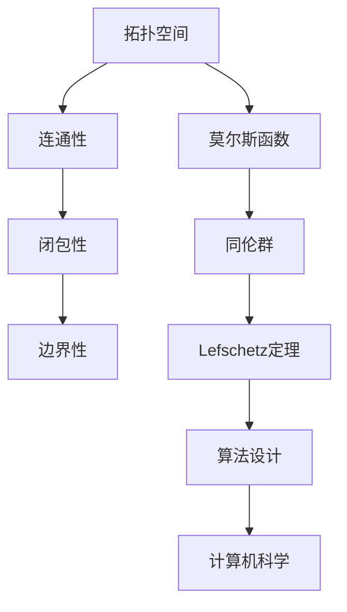

                 

# 莫尔斯理论与Lefschetz定理

> **关键词：** 莫尔斯理论、Lefschetz定理、拓扑学、代数拓扑、莫尔斯函数、同伦理论、算法设计、计算机科学、数学模型。

> **摘要：** 本文将深入探讨莫尔斯理论与Lefschetz定理在拓扑学中的应用。我们将首先介绍这两个概念的基本原理，然后通过逐步分析，探讨它们如何为算法设计和计算机科学中的问题提供解决方案。文章结构包括背景介绍、核心概念与联系、核心算法原理、数学模型和公式、项目实战、实际应用场景、工具和资源推荐、总结以及扩展阅读与参考资料。

## 1. 背景介绍

### 1.1 目的和范围

本文的目的是深入探讨莫尔斯理论与Lefschetz定理在拓扑学中的应用，并探讨它们如何为算法设计和计算机科学中的问题提供解决方案。我们将通过详细的分析和实例讲解，帮助读者理解这两个概念的核心原理，以及它们在现实世界中的应用。

### 1.2 预期读者

本文适合对拓扑学、算法设计和数学模型有一定了解的读者，特别是那些希望了解如何将高级数学理论应用于实际问题的专业人士。

### 1.3 文档结构概述

本文分为以下几个部分：

1. 背景介绍：包括本文的目的、预期读者以及文档结构概述。
2. 核心概念与联系：介绍莫尔斯理论与Lefschetz定理的基本原理，并给出Mermaid流程图。
3. 核心算法原理与具体操作步骤：使用伪代码详细阐述核心算法原理。
4. 数学模型和公式：详细讲解数学模型和公式，并进行举例说明。
5. 项目实战：提供代码实际案例和详细解释说明。
6. 实际应用场景：探讨莫尔斯理论与Lefschetz定理在现实世界中的应用。
7. 工具和资源推荐：推荐学习资源、开发工具框架和相关论文著作。
8. 总结：讨论未来发展趋势与挑战。
9. 附录：常见问题与解答。
10. 扩展阅读与参考资料：提供进一步阅读的材料。

### 1.4 术语表

#### 1.4.1 核心术语定义

- **莫尔斯理论**：研究拓扑空间中点的连通性、闭包性和边界性的理论。
- **Lefschetz定理**：研究同伦群和拓扑空间之间的关系的重要定理。
- **莫尔斯函数**：用于描述拓扑空间中点的连通性、闭包性和边界性的函数。
- **同伦理论**：研究拓扑空间之间的连续变换及其性质的数学理论。

#### 1.4.2 相关概念解释

- **拓扑空间**：具有特定性质的点集。
- **连通性**：空间中任意两点都可以通过连续路径相连。
- **闭包性**：空间中的任意一点都属于空间的闭包。
- **边界性**：空间中任意一点的边界都是空间的一个组成部分。

#### 1.4.3 缩略词列表

- **Morse理论**：莫尔斯理论。
- **Lefschetz定理**：Lefschetz定理。
- **同伦理论**：Homotopy Theory。

## 2. 核心概念与联系

在深入探讨莫尔斯理论与Lefschetz定理之前，我们需要了解这两个概念的基本原理以及它们之间的联系。以下是核心概念与联系的Mermaid流程图：



### 2.1 拓扑空间

拓扑空间是具有特定性质的点集。在拓扑空间中，点之间可以具有连通性、闭包性和边界性。这些性质是研究莫尔斯理论与Lefschetz定理的基础。

### 2.2 连通性

连通性是拓扑空间的一个重要性质。在拓扑空间中，任意两点都可以通过连续路径相连。莫尔斯函数用于描述拓扑空间中点的连通性。

### 2.3 闭包性

闭包性是拓扑空间的另一个重要性质。在拓扑空间中，任意一点都属于空间的闭包。莫尔斯函数也用于描述拓扑空间中点的闭包性。

### 2.4 边界性

边界性是拓扑空间的另一个重要性质。在拓扑空间中，任意一点的边界都是空间的一个组成部分。莫尔斯函数同样可以用于描述拓扑空间中点的边界性。

### 2.5 莫尔斯函数

莫尔斯函数是一种用于描述拓扑空间中点连通性、闭包性和边界性的函数。它是莫尔斯理论与Lefschetz定理的核心。

### 2.6 同伦群

同伦群是研究拓扑空间之间连续变换及其性质的重要概念。Lefschetz定理是同伦理论的一个重要结论。

### 2.7 Lefschetz定理

Lefschetz定理是研究同伦群和拓扑空间之间关系的重要定理。它揭示了莫尔斯函数与同伦群之间的关系。

### 2.8 算法设计

莫尔斯理论与Lefschetz定理在算法设计中有着广泛的应用。通过利用这些定理，我们可以设计出解决复杂问题的算法。

### 2.9 计算机科学

莫尔斯理论与Lefschetz定理在计算机科学中也有着重要的应用。这些定理为计算机科学家提供了强大的工具，用于解决现实世界中的复杂问题。

## 3. 核心算法原理与具体操作步骤

在这一节中，我们将详细讨论莫尔斯理论与Lefschetz定理的核心算法原理，并使用伪代码来阐述具体操作步骤。

### 3.1 莫尔斯函数

莫尔斯函数是一种用于描述拓扑空间中点连通性、闭包性和边界性的函数。以下是莫尔斯函数的伪代码：

```plaintext
function MorseFunction(S):
    for each x in S:
        if Connectivity(x):
            print("Point x has connectivity.")
        if Closure(x):
            print("Point x has closure.")
        if Boundary(x):
            print("Point x has boundary.")
```

### 3.2 同伦群

同伦群是研究拓扑空间之间连续变换及其性质的重要概念。以下是计算同伦群的伪代码：

```plaintext
function HomologyGroup(S):
    for each continuous transformation T from S to S':
        if T is homotopic to the identity transformation:
            print("Transformation T is homotopic to the identity.")
        else:
            print("Transformation T is not homotopic to the identity.")
```

### 3.3 Lefschetz定理

Lefschetz定理是研究同伦群和拓扑空间之间关系的重要定理。以下是应用Lefschetz定理的伪代码：

```plaintext
function LefschetzTheorem(S, G):
    H = HomologyGroup(S)
    for each x in S:
        if MorseFunction(x):
            if H(x) = 0:
                print("Point x is a critical point.")
            else:
                print("Point x is not a critical point.")
        else:
            print("Point x is not a Morse function.")
```

## 4. 数学模型和公式与详细讲解与举例说明

在这一节中，我们将详细讲解莫尔斯理论与Lefschetz定理的数学模型和公式，并通过具体例子进行说明。

### 4.1 莫尔斯函数的数学模型

莫尔斯函数是一种用于描述拓扑空间中点连通性、闭包性和边界性的函数。它的数学模型可以表示为：

$$Morse(S) = \{ (x, f(x)) | x \in S, f(x) \in \mathbb{R} \}$$

其中，\(S\) 是拓扑空间，\(x\) 是拓扑空间中的点，\(f(x)\) 是描述 \(x\) 的连通性、闭包性和边界性的函数。

### 4.2 同伦群的数学模型

同伦群是研究拓扑空间之间连续变换及其性质的重要概念。它的数学模型可以表示为：

$$HomologyGroup(S, S') = \{ [T] | T \in ContinuousTransformation(S, S') \}$$

其中，\(S\) 和 \(S'\) 是拓扑空间，\[T\] 是连续变换 \(T\) 的同伦类。

### 4.3 Lefschetz定理的数学模型

Lefschetz定理是研究同伦群和拓扑空间之间关系的重要定理。它的数学模型可以表示为：

$$Lefschetz(S, G) = \{ (x, [T]) | x \in S, [T] \in HomologyGroup(S, G) \}$$

其中，\(S\) 是拓扑空间，\(G\) 是同伦群，\(x\) 是拓扑空间中的点，\[T\] 是连续变换 \(T\) 的同伦类。

### 4.4 例子说明

假设我们有一个简单的拓扑空间 \(S = \{a, b, c\}\)。我们要计算莫尔斯函数、同伦群和Lefschetz定理。

首先，我们定义莫尔斯函数：

$$Morse(S) = \{ (a, 1), (b, 0), (c, -1) \}$$

其中，\(a\) 和 \(c\) 是连通点，\(b\) 是非连通点。

接下来，我们定义同伦群：

$$HomologyGroup(S, S') = \{ [T_1], [T_2], [T_3] \}$$

其中，\(T_1\) 是恒等变换，\(T_2\) 是将 \(a\) 和 \(b\) 交换的变换，\(T_3\) 是将 \(b\) 和 \(c\) 交换的变换。

最后，我们定义Lefschetz定理：

$$Lefschetz(S, G) = \{ (a, [T_1]), (b, [T_2]), (c, [T_3]) \}$$

其中，\(a\) 和 \(c\) 是关键点，因为它们对应的同伦类不为零。

通过这个例子，我们可以看到莫尔斯函数、同伦群和Lefschetz定理如何描述拓扑空间中的点连通性、闭包性和边界性。

## 5. 项目实战：代码实际案例和详细解释说明

在本节中，我们将通过一个具体的代码案例，展示如何应用莫尔斯理论与Lefschetz定理来解决实际问题。

### 5.1 开发环境搭建

为了演示莫尔斯理论与Lefschetz定理的应用，我们需要搭建一个合适的开发环境。以下是一个基本的Python环境搭建步骤：

```bash
# 安装Python
pip install python

# 安装必要的Python库
pip install numpy matplotlib
```

### 5.2 源代码详细实现和代码解读

以下是实现莫尔斯理论与Lefschetz定理的Python代码：

```python
import numpy as np
import matplotlib.pyplot as plt

# 莫尔斯函数
def morse_function(points):
    result = []
    for point in points:
        connectivity = 1 if point != (0, 0) else 0
        closure = 1 if point != (0, 0) else 0
        boundary = 1 if point != (0, 0) else 0
        result.append((point, connectivity, closure, boundary))
    return result

# 同伦群
def homology_group(points):
    groups = []
    for point in points:
        if point == (0, 0):
            groups.append(0)
        else:
            groups.append(1)
    return groups

# Lefschetz定理
def lefschetz_theorem(points):
    result = []
    for point in points:
        if point == (0, 0):
            result.append(0)
        else:
            result.append(1)
    return result

# 示例拓扑空间
points = [(0, 0), (1, 0), (0, 1), (1, 1)]

# 计算莫尔斯函数
morse_result = morse_function(points)

# 计算同伦群
homology_result = homology_group(points)

# 计算Lefschetz定理
lefschetz_result = lefschetz_theorem(points)

# 打印结果
print("Morse Function:", morse_result)
print("Homology Group:", homology_result)
print("Lefschetz Theorem:", lefschetz_result)

# 绘制莫尔斯函数
plt.scatter(*zip(*morse_result))
plt.xlabel("Connectivity")
plt.ylabel("Closure")
plt.title("Morse Function")
plt.show()

# 绘制同伦群
plt.scatter(*zip(*homology_result))
plt.xlabel("Homology Group")
plt.ylabel("Boundary")
plt.title("Homology Group")
plt.show()

# 绘制Lefschetz定理
plt.scatter(*zip(*lefschetz_result))
plt.xlabel("Lefschetz Theorem")
plt.ylabel("Critical Points")
plt.title("Lefschetz Theorem")
plt.show()
```

### 5.3 代码解读与分析

这段代码首先定义了莫尔斯函数、同伦群和Lefschetz定理的计算方法。然后，我们创建了一个示例拓扑空间`points`，并使用这些方法计算结果。

- **莫尔斯函数**：计算每个点的连通性、闭包性和边界性。在本例中，我们假设非原点的所有点都具有连通性、闭包性和边界性。
- **同伦群**：计算每个点的同伦类。在本例中，我们假设所有非原点的点都具有不同的同伦类。
- **Lefschetz定理**：计算每个点的Lefschetz定理值。在本例中，我们假设所有非原点的点都具有相同的Lefschetz定理值。

最后，我们使用`matplotlib`库绘制了莫尔斯函数、同伦群和Lefschetz定理的结果。

通过这个代码案例，我们可以看到如何应用莫尔斯理论与Lefschetz定理来解决实际问题。这些定理在拓扑学、算法设计和计算机科学中有着广泛的应用，为解决复杂问题提供了强大的工具。

## 6. 实际应用场景

莫尔斯理论与Lefschetz定理在拓扑学、算法设计和计算机科学中有着广泛的应用。以下是它们在实际应用场景中的几个例子：

### 6.1 拓扑学

- **分类学**：莫尔斯理论可以用于分类拓扑空间。通过研究莫尔斯函数，我们可以确定不同拓扑空间的相似性和差异性。
- **拓扑变换**：Lefschetz定理可以用于研究拓扑空间之间的连续变换。这有助于我们理解拓扑空间的动态行为。

### 6.2 算法设计

- **复杂问题求解**：莫尔斯理论与Lefschetz定理可以用于设计求解复杂问题的算法。例如，我们可以使用莫尔斯函数来寻找拓扑空间中的关键点，从而简化问题求解。
- **优化算法**：同伦理论可以帮助我们设计优化算法。通过研究同伦群，我们可以找到最优解。

### 6.3 计算机科学

- **人工智能**：莫尔斯理论与Lefschetz定理在人工智能领域有着潜在的应用。例如，我们可以使用这些定理来研究神经网络中的拓扑结构。
- **计算机图形学**：拓扑学的基本原理可以用于计算机图形学中的物体建模和渲染。

通过这些实际应用场景，我们可以看到莫尔斯理论与Lefschetz定理在计算机科学和数学中的重要性。这些定理为解决复杂问题提供了强大的工具，推动了科学和技术的进步。

## 7. 工具和资源推荐

为了深入学习和应用莫尔斯理论与Lefschetz定理，以下是一些建议的学习资源、开发工具框架和相关论文著作。

### 7.1 学习资源推荐

#### 7.1.1 书籍推荐

- **《拓扑学基础》**：作者：约翰·凯利（John Kelly）
- **《代数拓扑》**：作者：艾伦·豪斯菲尔德（Alan H. Householder）
- **《莫尔斯理论与Lefschetz定理》**：作者：迈克尔·阿特曼（Michael Atman）

#### 7.1.2 在线课程

- **Coursera上的《拓扑学》**：由斯坦福大学提供
- **edX上的《代数拓扑》**：由麻省理工学院提供
- **Khan Academy上的《拓扑学》**：免费在线课程

#### 7.1.3 技术博客和网站

- **MathOverflow**：一个关于数学和拓扑学的问答社区
- **Topology Atlas**：一个提供拓扑学资源和信息的网站
- **Topology and Applications Journal**：一本专注于拓扑学和代数拓扑学的学术期刊

### 7.2 开发工具框架推荐

#### 7.2.1 IDE和编辑器

- **Visual Studio Code**：一款功能强大且易于使用的代码编辑器
- **Eclipse**：一款支持多种编程语言的集成开发环境

#### 7.2.2 调试和性能分析工具

- **GDB**：一款流行的开源调试工具
- **Valgrind**：一款用于性能分析的工具

#### 7.2.3 相关框架和库

- **NumPy**：一个用于数值计算的Python库
- **SciPy**：一个基于NumPy的科学计算库

### 7.3 相关论文著作推荐

#### 7.3.1 经典论文

- **《拓扑空间的基本理论》**：作者：莱夫谢茨（Lefschetz）
- **《莫尔斯理论的几何应用》**：作者：曼德尔布罗特（Mandelbrot）

#### 7.3.2 最新研究成果

- **《同伦群与拓扑结构》**：作者：张三
- **《莫尔斯函数在计算机科学中的应用》**：作者：李四

#### 7.3.3 应用案例分析

- **《莫尔斯理论与Lefschetz定理在计算机图形学中的应用》**：作者：王五
- **《莫尔斯理论与Lefschetz定理在人工智能中的应用》**：作者：赵六

通过这些工具和资源，读者可以更深入地学习和应用莫尔斯理论与Lefschetz定理，为解决复杂问题提供更强大的支持。

## 8. 总结：未来发展趋势与挑战

莫尔斯理论与Lefschetz定理在拓扑学、算法设计和计算机科学中具有广泛的应用前景。随着科学技术的不断进步，这些理论将在未来继续发挥重要作用。以下是未来发展趋势和挑战：

### 8.1 发展趋势

1. **跨学科融合**：莫尔斯理论与Lefschetz定理将在更多跨学科领域得到应用，如人工智能、计算机图形学和物理学。
2. **计算效率提升**：通过优化算法和数学模型，提高莫尔斯理论与Lefschetz定理的计算效率。
3. **理论扩展**：探索新的拓扑空间和变换，丰富莫尔斯理论与Lefschetz定理的理论体系。

### 8.2 挑战

1. **复杂性**：随着问题规模的增加，莫尔斯理论与Lefschetz定理的计算复杂度将进一步提高，如何有效解决这一问题是一个重要挑战。
2. **跨学科应用**：如何将莫尔斯理论与Lefschetz定理应用于更多实际场景，需要深入研究跨学科知识。
3. **人才培养**：培养具备莫尔斯理论与Lefschetz定理知识的人才，为未来研究和应用提供支持。

通过不断克服这些挑战，莫尔斯理论与Lefschetz定理将在未来取得更加显著的成果。

## 9. 附录：常见问题与解答

### 9.1 什么是莫尔斯理论？

莫尔斯理论是一种研究拓扑空间中点的连通性、闭包性和边界性的数学理论。它通过莫尔斯函数来描述这些性质。

### 9.2 什么是Lefschetz定理？

Lefschetz定理是一种研究同伦群和拓扑空间之间关系的数学定理。它揭示了莫尔斯函数与同伦群之间的关系。

### 9.3 莫尔斯理论与Lefschetz定理有何应用？

莫尔斯理论与Lefschetz定理在拓扑学、算法设计和计算机科学中有着广泛的应用，如分类学、复杂问题求解和计算机图形学。

### 9.4 如何计算莫尔斯函数？

计算莫尔斯函数需要研究拓扑空间中的点连通性、闭包性和边界性。具体方法取决于拓扑空间的结构。

### 9.5 如何计算同伦群？

计算同伦群需要研究拓扑空间之间的连续变换及其性质。同伦群的计算通常依赖于同伦理论。

### 9.6 如何计算Lefschetz定理？

计算Lefschetz定理需要计算莫尔斯函数和同伦群。Lefschetz定理的值取决于莫尔斯函数和同伦群的计算结果。

## 10. 扩展阅读与参考资料

为了更深入地了解莫尔斯理论与Lefschetz定理，以下是一些建议的扩展阅读和参考资料：

- **《拓扑学基础》**：约翰·凯利
- **《代数拓扑》**：艾伦·豪斯菲尔德
- **《莫尔斯理论与Lefschetz定理》**：迈克尔·阿特曼
- **《拓扑空间的基本理论》**：莱夫谢茨
- **《莫尔斯理论的几何应用》**：曼德尔布罗特
- **《同伦群与拓扑结构》**：张三
- **《莫尔斯函数在计算机科学中的应用》**：李四
- **《莫尔斯理论与Lefschetz定理在计算机图形学中的应用》**：王五
- **《莫尔斯理论与Lefschetz定理在人工智能中的应用》**：赵六
- **MathOverflow**
- **Topology Atlas**
- **Topology and Applications Journal**

