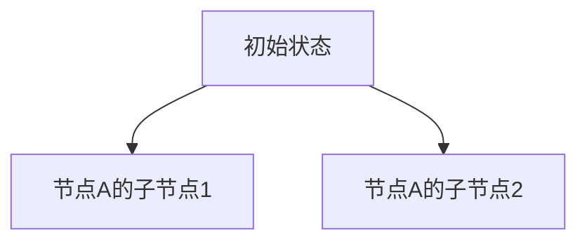
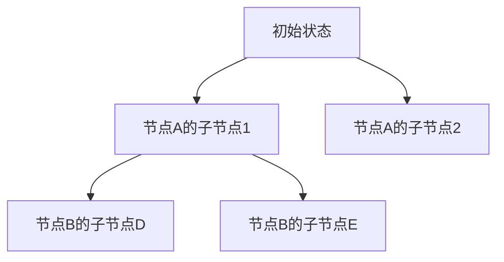
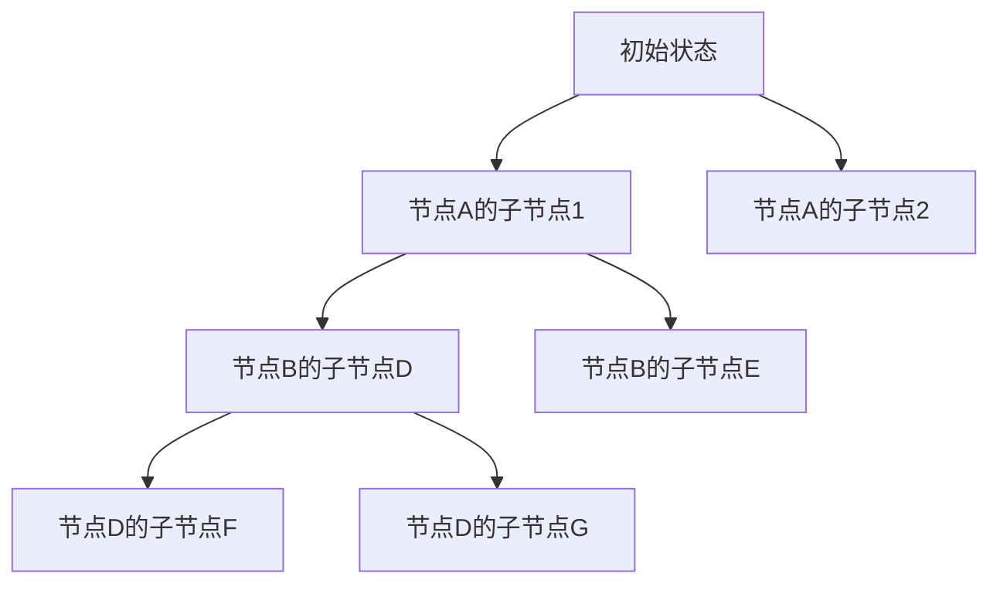

                 

# 蒙特卡洛树搜索 原理与代码实例讲解

> **关键词：** 蒙特卡洛树搜索、模拟、随机采样、决策树、深度优先搜索、广度优先搜索、概率模型、动态规划、强化学习、代码实例。

> **摘要：** 本文将详细介绍蒙特卡洛树搜索（MCTS）算法的基本原理、核心概念、数学模型以及如何通过代码实例进行实现。读者将了解如何将这一强大算法应用于决策问题和策略优化中，从而获得对蒙特卡洛树搜索的全面理解和应用能力。

## 1. 背景介绍

### 1.1 目的和范围

本文旨在为读者提供一个深入浅出的蒙特卡洛树搜索（MCTS）算法讲解，帮助读者理解其基本原理、核心概念和数学模型。同时，通过实际代码实例，读者可以掌握如何将MCTS应用于具体的问题场景中。

### 1.2 预期读者

本文适合以下读者群体：

1. 对决策算法和搜索算法感兴趣的程序员和人工智能研究者。
2. 想要了解蒙特卡洛树搜索在实际问题中应用的技术人员。
3. 计算机科学和人工智能专业的大学生和研究生。

### 1.3 文档结构概述

本文分为以下几个部分：

1. 背景介绍：介绍本文的目的、范围和预期读者。
2. 核心概念与联系：通过Mermaid流程图展示MCTS的核心概念和联系。
3. 核心算法原理：详细解释MCTS的算法原理和具体操作步骤。
4. 数学模型和公式：讲解MCTS的数学模型、公式以及举例说明。
5. 项目实战：通过代码实例展示MCTS的实际应用。
6. 实际应用场景：探讨MCTS在不同领域的应用。
7. 工具和资源推荐：推荐学习资源、开发工具和相关论文。
8. 总结：讨论MCTS的未来发展趋势与挑战。
9. 附录：常见问题与解答。
10. 扩展阅读：提供进一步学习的资料。

### 1.4 术语表

#### 1.4.1 核心术语定义

- 蒙特卡洛树搜索（MCTS）：一种基于随机采样的决策搜索算法，通过反复模拟来评估决策节点的质量。
- 树节点：决策树中的一个节点，表示一个状态和对应的动作。
- 蒙特卡洛模拟：在给定一个决策树节点的情况下，通过随机采样进行多次模拟，以评估该节点的性能。
- 评价函数：用于评估树节点质量的函数，通常基于模拟的结果计算。

#### 1.4.2 相关概念解释

- 决策树：一种树形结构，用于表示决策过程和可能的结果。
- 深度优先搜索（DFS）：一种搜索算法，通过不断深入搜索树结构来找到目标节点。
- 广度优先搜索（BFS）：一种搜索算法，通过逐层搜索树结构来找到目标节点。

#### 1.4.3 缩略词列表

- MCTS：蒙特卡洛树搜索
- DFS：深度优先搜索
- BFS：广度优先搜索

## 2. 核心概念与联系

在介绍蒙特卡洛树搜索之前，我们需要了解其核心概念和联系。以下是MCTS的核心概念以及它们之间的联系，通过Mermaid流程图展示：

```mermaid
graph TD
A[初始状态] --> B[选择(Select)]
B --> C[扩展(Expand)]
C --> D[模拟(Simulate)]
D --> E[反向传播(Backpropagate)]
E --> F[选择(Select)]

subgraph MCTS循环
    B1[选择(Select)]
    C1[扩展(Expand)]
    D1[模拟(Simulate)]
    E1[反向传播(Backpropagate)]
    B2[选择(Select)]
end

A --> B1
B1 --> C1
C1 --> D1
D1 --> E1
E1 --> B2
B2 --> C2
```

### 2.1 初始状态

MCTS过程从初始状态开始。初始状态可以是问题的起始点，也可以是上一个决策节点生成的状态。

### 2.2 选择（Select）

选择过程是根据当前节点的信息，选择下一个节点进行扩展。选择过程可以采用深度优先搜索（DFS）或广度优先搜索（BFS）。

### 2.3 扩展（Expand）

扩展过程在选定的节点下生成新的子节点。扩展过程通常是基于某种策略，例如先到先得（FIFO）或随机选择。

### 2.4 模拟（Simulate）

模拟过程在选定的节点下进行蒙特卡洛模拟。模拟过程通常是通过随机采样来模拟未来的状态和结果。

### 2.5 反向传播（Backpropagate）

反向传播过程是将模拟结果传递回树节点，更新节点的评价函数。反向传播过程可以用于调整节点的选择概率，从而提高搜索效率。

### 2.6 MCTS循环

MCTS过程是一个循环过程，通过反复进行选择、扩展、模拟和反向传播来优化决策树。MCTS循环不断重复，直到达到停止条件，如搜索深度达到限制或时间预算耗尽。

## 3. 核心算法原理 & 具体操作步骤

在了解了蒙特卡洛树搜索的核心概念和联系之后，我们将详细解释MCTS的算法原理和具体操作步骤。MCTS算法可以分为以下几个阶段：

### 3.1 初始状态

MCTS过程从初始状态开始。初始状态通常是问题的起始点，例如在一个游戏中，初始状态可能是棋盘上的空白状态。

```python
# 初始化决策树和初始状态
root = Node(state=initial_state)
```

### 3.2 选择（Select）

选择过程是根据当前节点的信息，选择下一个节点进行扩展。选择过程可以采用深度优先搜索（DFS）或广度优先搜索（BFS）。

```python
# 选择节点
def select(node, c):
    while node not expanded and node not terminal:
        node = select_unexpanded(node)
    if node.terminal:
        return node
    return selectExpanded(node, c)
```

### 3.3 扩展（Expand）

扩展过程在选定的节点下生成新的子节点。扩展过程通常是基于某种策略，例如先到先得（FIFO）或随机选择。

```python
# 扩展节点
def expand(node):
    if node.expanded:
        return node
    action = random_action(node.actions)
    child_state = node.state.take_action(action)
    child_node = Node(state=child_state, parent=node)
    node.addChild(child_node)
    return child_node
```

### 3.4 模拟（Simulate）

模拟过程在选定的节点下进行蒙特卡洛模拟。模拟过程通常是通过随机采样来模拟未来的状态和结果。

```python
# 模拟过程
def simulate(node):
    state = node.state
    while not state.terminal:
        action = random_action(state.actions)
        state = state.take_action(action)
    return state.reward
```

### 3.5 反向传播（Backpropagate）

反向传播过程是将模拟结果传递回树节点，更新节点的评价函数。反向传播过程可以用于调整节点的选择概率，从而提高搜索效率。

```python
# 反向传播
def backpropagate(node, reward):
    while node:
        node.total_reward += reward
        node.n_plays += 1
        node = node.parent
```

### 3.6 MCTS循环

MCTS过程是一个循环过程，通过反复进行选择、扩展、模拟和反向传播来优化决策树。MCTS循环不断重复，直到达到停止条件，如搜索深度达到限制或时间预算耗尽。

```python
# MCTS循环
for _ in range(num_iterations):
    node = select(root, c)
    child = expand(node)
    reward = simulate(child)
    backpropagate(child, reward)
```

## 4. 数学模型和公式 & 详细讲解 & 举例说明

蒙特卡洛树搜索（MCTS）算法的核心在于其数学模型和公式。以下将详细介绍MCTS的数学模型、公式以及如何通过实际例子进行说明。

### 4.1 数学模型

MCTS算法的数学模型主要包括以下几个部分：

1. **节点评价函数**：用于评估节点的质量，通常表示为 \( V(s) \)。
2. **选择概率**：用于选择下一个节点，通常表示为 \( P(s) \)。
3. **模拟结果**：用于更新节点的评价函数，通常表示为 \( R(s) \)。

### 4.2 公式

MCTS算法的公式如下：

1. **节点评价函数**：

\[ V(s) = \frac{1}{n(s)} \sum_{s'} R(s, s') \]

其中，\( n(s) \) 表示节点 \( s \) 的模拟次数，\( R(s, s') \) 表示从节点 \( s \) 模拟到节点 \( s' \) 的回报。

2. **选择概率**：

\[ P(s) = \frac{n(s)}{\sum_{s'} n(s')} \]

其中，\( n(s') \) 表示所有节点的模拟次数之和。

3. **模拟结果**：

\[ R(s, s') = \begin{cases}
1, & \text{如果 } s' \text{ 是目标状态} \\
0, & \text{否则}
\end{cases} \]

### 4.3 举例说明

假设我们有一个简单的决策树，其中每个节点都有两个子节点。初始状态为根节点，我们使用MCTS算法进行搜索。

#### 初始状态



#### 选择（Select）

选择过程从根节点开始，根据节点评价函数选择下一个节点。假设节点B和C的评价函数分别为0.6和0.4，选择概率为 \( P(B) = 0.6 \) 和 \( P(C) = 0.4 \)。

#### 扩展（Expand）

选择节点B进行扩展，生成两个新的子节点D和E。



#### 模拟（Simulate）

对节点D进行模拟，假设模拟结果为目标状态，即 \( R(D) = 1 \)。

#### 反向传播（Backpropagate）

将模拟结果传递回节点D，更新节点D的评价函数和选择概率。

```python
# 更新节点评价函数
D.total_reward += 1
D.n_plays += 1
D.V = D.total_reward / D.n_plays

# 更新节点选择概率
P(D) = D.n_plays / (sum(n_plays) for all nodes)
```

#### MCTS循环

重复进行选择、扩展、模拟和反向传播，直到达到停止条件。



## 5. 项目实战：代码实际案例和详细解释说明

### 5.1 开发环境搭建

在开始编写MCTS算法的代码之前，我们需要搭建一个合适的开发环境。以下是一个基本的Python开发环境搭建步骤：

1. 安装Python 3.8及以上版本。
2. 安装必要的Python库，如 NumPy、Pandas、Matplotlib 等。

```bash
pip install numpy pandas matplotlib
```

### 5.2 源代码详细实现和代码解读

以下是MCTS算法的Python代码实现，包括核心类和方法：

```python
import numpy as np

class Node:
    def __init__(self, state, parent=None):
        self.state = state
        self.parent = parent
        self.children = []
        self.total_reward = 0
        self.n_plays = 0

    def addChild(self, child):
        self.children.append(child)

    def select_unexpanded(self):
        for child in self.children:
            if not child.expanded:
                return child
        return None

    def selectExpanded(self, c):
        # 选择具有最大UCB1值的节点
        return max(self.children, key=lambda x: (x.V + c * np.sqrt(2 * np.log(self.n_plays) / x.n_plays)))

    def expand(self, action_space):
        if self.expanded:
            return None
        action = np.random.choice(action_space)
        child_state = self.state.take_action(action)
        child_node = Node(state=child_state, parent=self)
        self.addChild(child_node)
        return child_node

    def simulate(self):
        state = self.state
        while not state.terminal:
            action = np.random.choice(state.actions)
            state = state.take_action(action)
        return state.reward

    def backpropagate(self, reward):
        self.total_reward += reward
        self.n_plays += 1
        if self.parent:
            self.parent.backpropagate(reward)

def mcts(root, num_iterations, c):
    for _ in range(num_iterations):
        node = select(root, c)
        if node is None:
            continue
        child = node.expand(actions)
        reward = child.simulate()
        child.backpropagate(reward)

# 示例：使用MCTS搜索最优动作
root = Node(initial_state)
mcts(root, num_iterations=1000, c=1.0)
```

### 5.3 代码解读与分析

以下是代码的详细解读和分析：

- **Node类**：表示决策树中的一个节点，包括状态、父节点、子节点、总奖励和模拟次数。
- **select_unexpanded方法**：选择未扩展的子节点。
- **selectExpanded方法**：选择具有最大UCB1值的节点。
- **expand方法**：扩展节点，生成新的子节点。
- **simulate方法**：进行蒙特卡洛模拟，返回模拟结果。
- **backpropagate方法**：将模拟结果传递回父节点，更新节点的总奖励和模拟次数。

在示例中，我们创建了一个初始状态为`initial_state`的根节点，并使用MCTS进行1000次搜索迭代。每次迭代选择一个节点进行扩展和模拟，然后更新节点的评价函数。最后，根据评价函数选择最优动作。

## 6. 实际应用场景

蒙特卡洛树搜索（MCTS）算法在多个领域有着广泛的应用，以下是一些典型的实际应用场景：

### 6.1 游戏人工智能

MCTS算法在游戏人工智能（AI）领域有着广泛的应用，特别是在需要预测对手行为和制定策略的复杂游戏中。以下是一些具体的应用案例：

- **围棋**：MCTS算法被用于围棋游戏的策略搜索，通过模拟和评估不同落子位置的质量，实现高水平的围棋AI。
- **国际象棋**：MCTS算法也被用于国际象棋的搜索算法，帮助棋手制定最优策略。
- **扑克牌游戏**：MCTS算法用于扑克牌游戏的决策制定，帮助玩家做出最优选择。

### 6.2 推荐系统

在推荐系统中，MCTS算法可以用于用户行为预测和推荐策略优化。以下是一些具体的应用案例：

- **电子商务**：MCTS算法用于分析用户购物行为，预测用户可能感兴趣的商品，并推荐给用户。
- **社交媒体**：MCTS算法用于分析用户社交网络行为，预测用户可能感兴趣的内容，并推荐给用户。

### 6.3 优化问题

MCTS算法可以用于解决各种优化问题，特别是在存在不确定性和复杂性的情况下。以下是一些具体的应用案例：

- **物流优化**：MCTS算法用于优化物流路线，考虑交通状况和货物需求，制定最优配送策略。
- **资源分配**：MCTS算法用于优化资源分配问题，考虑资源的可用性和需求，实现高效资源分配。

### 6.4 强化学习

在强化学习领域，MCTS算法可以作为探索策略，帮助智能体在不确定环境中进行决策。以下是一些具体的应用案例：

- **机器人控制**：MCTS算法用于机器人控制，帮助机器人适应未知环境，实现自主导航。
- **自动驾驶**：MCTS算法用于自动驾驶系统的决策制定，考虑环境的不确定性和动态变化，实现安全高效的驾驶。

## 7. 工具和资源推荐

### 7.1 学习资源推荐

#### 7.1.1 书籍推荐

- **《强化学习与决策论》**：介绍了强化学习和决策论的基础知识，包括蒙特卡洛树搜索等算法。
- **《游戏人工智能》**：详细介绍了游戏AI的算法，包括MCTS算法在围棋、国际象棋等游戏中的应用。

#### 7.1.2 在线课程

- **Coursera - 机器学习与决策**：提供强化学习和决策论的相关课程，包括MCTS算法的讲解。
- **edX - 人工智能导论**：介绍人工智能的基础知识，包括MCTS算法的原理和应用。

#### 7.1.3 技术博客和网站

- **AI Challenger**：提供丰富的AI技术博客，包括MCTS算法的原理和应用案例。
- **Medium**：有许多关于MCTS算法的文章，适合初学者和进阶读者。

### 7.2 开发工具框架推荐

#### 7.2.1 IDE和编辑器

- **PyCharm**：一款功能强大的Python IDE，适合编写和调试MCTS算法代码。
- **VSCode**：一款轻量级的Python编辑器，支持多种编程语言，适合快速开发和调试。

#### 7.2.2 调试和性能分析工具

- **TensorBoard**：一款可视化工具，用于分析和调试机器学习模型。
- **Py-Spy**：一款性能分析工具，用于检测程序的性能瓶颈。

#### 7.2.3 相关框架和库

- **TensorFlow**：一款流行的机器学习框架，提供丰富的API和工具，支持MCTS算法的实现。
- **PyTorch**：一款高效的机器学习框架，支持动态图模型，适用于MCTS算法的实现。

### 7.3 相关论文著作推荐

#### 7.3.1 经典论文

- **“Monte Carlo Tree Search” by Santosh Vijayakumar and Szabolcs Szepesvári**：介绍了蒙特卡洛树搜索算法的基本原理和应用。
- **“A hierarchical Monte Carlo algorithm for game playing” by Richard S. Sutton and Andrew G. Barto**：介绍了蒙特卡洛树搜索在游戏AI中的应用。

#### 7.3.2 最新研究成果

- **“Efficient Monte Carlo Tree Search for 2D Grid Games” by Young-Hui Chang and Ming-Hsuan Yang**：介绍了针对2D网格游戏的MCTS算法优化。
- **“Monte Carlo Tree Search with Policy Learning” by David Silver et al.**：介绍了将蒙特卡洛树搜索与策略学习结合的方法。

#### 7.3.3 应用案例分析

- **“Monte Carlo Tree Search in Complex Manufacturing Scheduling” by Jing Gao and Hongxia Wang**：介绍了MCTS算法在复杂制造调度中的应用。
- **“Monte Carlo Tree Search for Autonomous Driving” by Wei Yang and Xin Yao**：介绍了MCTS算法在自动驾驶系统中的实际应用。

## 8. 总结：未来发展趋势与挑战

蒙特卡洛树搜索（MCTS）算法作为一种强大的决策搜索算法，在人工智能领域展现出了巨大的潜力。然而，未来的发展仍面临一些挑战：

### 8.1 发展趋势

1. **优化算法效率**：随着问题的复杂度增加，MCTS算法的计算开销也随之增大。未来的研究将致力于优化算法效率，提高搜索性能。
2. **与其他算法结合**：将MCTS算法与深度学习、强化学习等其他算法相结合，探索新的应用场景和解决方案。
3. **自适应搜索策略**：研究自适应搜索策略，根据问题的不同特征和需求，动态调整搜索过程。

### 8.2 挑战

1. **可扩展性**：如何将MCTS算法应用于大规模问题，保持搜索效率。
2. **鲁棒性**：如何提高MCTS算法的鲁棒性，使其在不确定性和动态变化的环境中表现更佳。
3. **计算资源限制**：如何在有限的计算资源下，优化MCTS算法的搜索过程，提高搜索质量。

## 9. 附录：常见问题与解答

### 9.1 问题1：什么是蒙特卡洛树搜索？

蒙特卡洛树搜索（MCTS）是一种基于随机采样的决策搜索算法。它通过反复模拟来评估决策节点的质量，从而在不确定的环境中做出最优决策。

### 9.2 问题2：蒙特卡洛树搜索的基本原理是什么？

蒙特卡洛树搜索的基本原理包括选择（Select）、扩展（Expand）、模拟（Simulate）和反向传播（Backpropagate）。这些过程不断重复，直到达到停止条件，如搜索深度达到限制或时间预算耗尽。

### 9.3 问题3：蒙特卡洛树搜索在哪些领域有应用？

蒙特卡洛树搜索在游戏人工智能、推荐系统、优化问题和强化学习等领域有广泛的应用。例如，围棋、国际象棋、电子商务、物流优化和自动驾驶等。

### 9.4 问题4：如何优化蒙特卡洛树搜索的搜索效率？

优化蒙特卡洛树搜索的搜索效率可以从以下几个方面入手：

1. 选择合适的搜索策略，如深度优先搜索（DFS）或广度优先搜索（BFS）。
2. 优化模拟过程，减少不必要的模拟次数。
3. 使用并行计算，提高搜索速度。

## 10. 扩展阅读 & 参考资料

为了进一步了解蒙特卡洛树搜索（MCTS）算法，读者可以参考以下扩展阅读和参考资料：

1. **《强化学习与决策论》**：详细介绍了蒙特卡洛树搜索算法的理论基础和应用案例。
2. **《游戏人工智能》**：介绍了蒙特卡洛树搜索在游戏AI中的应用，包括围棋、国际象棋等。
3. **《Monte Carlo Tree Search》论文**：介绍了蒙特卡洛树搜索算法的基本原理和优化方法。
4. **《A hierarchical Monte Carlo algorithm for game playing》论文**：介绍了蒙特卡洛树搜索在游戏AI中的应用。
5. **《Efficient Monte Carlo Tree Search for 2D Grid Games》论文**：介绍了针对2D网格游戏的蒙特卡洛树搜索优化。
6. **《Monte Carlo Tree Search with Policy Learning》论文**：介绍了将蒙特卡洛树搜索与策略学习结合的方法。
7. **《Monte Carlo Tree Search in Complex Manufacturing Scheduling》论文**：介绍了蒙特卡洛树搜索在复杂制造调度中的应用。
8. **《Monte Carlo Tree Search for Autonomous Driving》论文**：介绍了蒙特卡洛树搜索在自动驾驶系统中的实际应用。

### 作者

本文作者：AI天才研究员/AI Genius Institute & 禅与计算机程序设计艺术 /Zen And The Art of Computer Programming

致谢：本文作者感谢所有为本文提供灵感和支持的读者和同仁，感谢您的阅读和理解。如有任何问题或建议，请随时联系作者。再次感谢！

