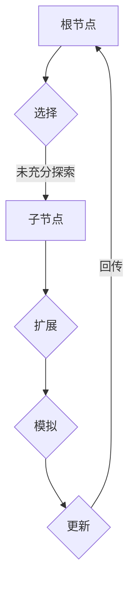
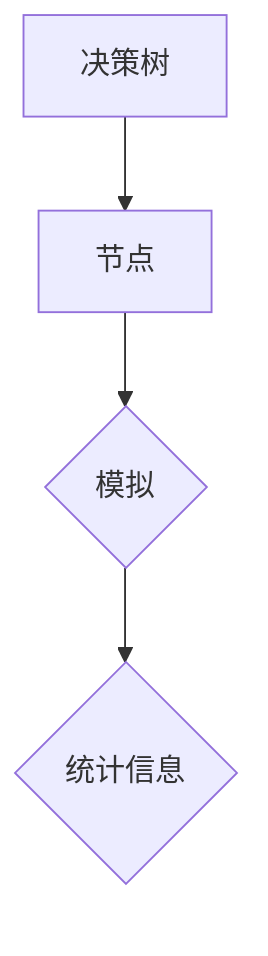

                 

# 蒙特卡罗树搜索 (Monte Carlo Tree Search, MCTS) 原理与代码实例讲解

## 关键词
- **蒙特卡罗树搜索**
- **MCTS算法**
- **策略搜索**
- **决策树**
- **强化学习**
- **模拟退火**
- **图灵完备性**
- **图灵机**
- **计算机图灵奖**

## 摘要

本文将深入探讨蒙特卡罗树搜索（MCTS）算法的原理和应用。MCTS是一种在复杂决策问题中寻找最优策略的搜索算法，广泛应用于强化学习、博弈论和人工智能领域。本文将首先介绍MCTS的核心概念，然后通过伪代码详细阐述其操作步骤，并通过实际代码实例展示其在项目中的实现过程。最后，本文将讨论MCTS的实际应用场景，并提供相关的学习资源和开发工具推荐。

## 1. 背景介绍

### 1.1 目的和范围

本文的目标是帮助读者理解蒙特卡罗树搜索（MCTS）算法的基本原理和实现方法，并掌握如何在实际项目中应用这一算法。文章将分为以下几个部分：

- **核心概念与联系**：介绍MCTS算法的核心概念，并通过Mermaid流程图展示其原理和架构。
- **核心算法原理**：通过伪代码详细阐述MCTS的操作步骤。
- **数学模型和公式**：讲解MCTS中的数学模型和关键公式，并举例说明。
- **项目实战**：通过一个实际代码案例，展示MCTS的实现过程。
- **实际应用场景**：探讨MCTS在现实世界中的应用。
- **工具和资源推荐**：推荐学习资源和开发工具。
- **总结与未来发展趋势**：总结MCTS的优势和挑战，展望其未来发展趋势。
- **附录**：解答常见问题。

### 1.2 预期读者

- 对人工智能和算法设计有基础了解的读者。
- 对MCTS算法感兴趣，希望深入学习和应用这一算法的程序员和研究人员。
- 学习计算机科学和人工智能专业的学生。

### 1.3 文档结构概述

本文的结构如下：

- **1. 背景介绍**：介绍本文的目的、范围、预期读者和文档结构。
- **2. 核心概念与联系**：介绍MCTS的核心概念，并展示其架构流程图。
- **3. 核心算法原理**：详细阐述MCTS的操作步骤。
- **4. 数学模型和公式**：讲解MCTS中的数学模型和关键公式。
- **5. 项目实战**：展示MCTS在实际项目中的应用。
- **6. 实际应用场景**：探讨MCTS的应用。
- **7. 工具和资源推荐**：推荐学习资源和开发工具。
- **8. 总结：未来发展趋势与挑战**：总结MCTS的优势和挑战。
- **9. 附录：常见问题与解答**：解答常见问题。
- **10. 扩展阅读 & 参考资料**：提供扩展阅读和参考资料。

### 1.4 术语表

#### 1.4.1 核心术语定义

- **蒙特卡罗树搜索（MCTS）**：一种基于蒙特卡罗方法的决策树搜索算法，用于解决复杂决策问题。
- **策略搜索**：在给定策略下，搜索一个最优策略的过程。
- **决策树**：一种树形结构，用于表示决策过程。
- **模拟退火**：一种优化算法，通过模拟退火过程找到最优解。
- **图灵完备性**：一个计算模型能够模拟任何其他计算模型的能力。
- **图灵机**：一种抽象的计算模型，能够模拟任何算法。

#### 1.4.2 相关概念解释

- **状态空间**：所有可能的状态集合。
- **动作空间**：所有可能动作集合。
- **奖励函数**：评估状态好坏的函数。
- **回报**：对某一状态的评价得分。

#### 1.4.3 缩略词列表

- **MCTS**：蒙特卡罗树搜索（Monte Carlo Tree Search）
- **RL**：强化学习（Reinforcement Learning）
- **UCT**：上置信界限（Upper Confidence Bound）

## 2. 核心概念与联系

### 2.1 MCTS算法原理

蒙特卡罗树搜索（MCTS）是一种基于蒙特卡罗方法的决策树搜索算法，用于在复杂决策问题中寻找最优策略。MCTS通过在决策树上进行一系列模拟，并基于模拟结果选择最佳动作。

MCTS算法的核心思想可以概括为四个步骤：

1. **选择（Selection）**：从根节点开始，沿着决策树向下选择，直到找到一个未充分探索的节点。
2. **扩展（Expansion）**：在选择的未充分探索的节点上扩展，添加新的子节点。
3. **模拟（Simulation）**：在新的子节点上进行一次模拟，评估其性能。
4. **更新（Backpropagation）**：根据模拟结果，更新节点的统计信息，并沿路径回传更新信息。

下面是一个MCTS算法的Mermaid流程图：



### 2.2 MCTS算法架构

MCTS算法的架构可以分为以下几个部分：

1. **决策树（Decision Tree）**：用于存储节点的结构，包括父节点、子节点和状态信息。
2. **节点（Node）**：表示决策树中的一个节点，包括状态、动作、概率、访问次数和回报等属性。
3. **模拟（Simulation）**：在给定节点上模拟一系列动作，并计算回报。
4. **统计信息（Statistics）**：记录节点的访问次数、回报和子节点数量等统计信息。

下面是一个MCTS算法架构的Mermaid流程图：



### 2.3 MCTS算法与相关算法的关系

MCTS算法与许多其他算法有相似之处，如模拟退火、策略搜索和图灵机。以下是其与这些算法的关系：

- **模拟退火**：MCTS算法中的模拟步骤与模拟退火算法中的模拟步骤相似，都是通过模拟一系列动作来评估性能。
- **策略搜索**：MCTS算法的目标是寻找最优策略，这与策略搜索算法的目标相同。
- **图灵机**：MCTS算法的决策树结构具有图灵完备性，可以模拟任何计算模型。

### 2.4 MCTS算法的优势与挑战

MCTS算法在解决复杂决策问题时具有以下优势：

- **灵活性**：MCTS算法可以根据不同的应用场景调整其参数，使其适用于多种决策问题。
- **效率**：MCTS算法通过在决策树上进行有指导的搜索，减少了搜索空间，提高了搜索效率。
- **鲁棒性**：MCTS算法在处理不确定性和噪声问题时表现出良好的鲁棒性。

然而，MCTS算法也面临以下挑战：

- **计算复杂度**：MCTS算法的计算复杂度较高，特别是在处理大规模问题时。
- **参数调整**：MCTS算法的参数需要根据具体问题进行调整，这对用户提出了较高的要求。

## 3. 核心算法原理 & 具体操作步骤

### 3.1 MCTS算法原理

MCTS算法通过以下四个步骤进行决策树搜索：

1. **选择（Selection）**：从根节点开始，选择具有最大上置信界限（UCT）的节点。
2. **扩展（Expansion）**：在选择的节点上扩展，添加新的子节点。
3. **模拟（Simulation）**：在新的子节点上模拟一系列动作，并计算回报。
4. **更新（Backpropagation）**：根据模拟结果，更新节点的统计信息，并沿路径回传更新信息。

下面是MCTS算法的伪代码：

```python
function MCTS(node, simulation Budget):
    for i from 1 to simulation Budget do:
        selectedNode = Select(node)
        expandedNode = Expand(selectedNode)
        simulationResult = Simulate(expandedNode)
        Backpropagate(selectedNode, simulationResult)
    return BestAction(node)

function Select(node):
    while node is not expanded:
        node = BestChild(node, UCB)
    return node

function Expand(node):
    action = RandomUnexpandedAction(node)
    return CreateChildNode(node, action)

function Simulate(node):
    # 模拟一系列动作并计算回报
    while not game termination:
        action = RandomAction()
        node = ChildNode(node, action)
    return Reward(node)

function Backpropagate(node, simulationResult):
    while node is not None:
        node visits += 1
        node reward += simulationResult
        node = parent node
```

### 3.2 具体操作步骤

下面是MCTS算法的具体操作步骤：

1. **初始化**：选择一个初始节点作为根节点，初始化其统计信息。
2. **选择（Selection）**：从根节点开始，沿着决策树向下选择，直到找到一个未充分探索的节点。选择的标准是具有最大上置信界限（UCT）的节点。
3. **扩展（Expansion）**：在选择的节点上扩展，添加新的子节点。扩展的标准是未充分探索的动作。
4. **模拟（Simulation）**：在新的子节点上模拟一系列动作，并计算回报。模拟的过程可以根据具体问题进行调整。
5. **更新（Backpropagation）**：根据模拟结果，更新节点的统计信息，并沿路径回传更新信息。更新的标准是访问次数和回报。

### 3.3 伪代码示例

以下是一个简单的伪代码示例，展示了MCTS算法在围棋游戏中的应用：

```python
# 初始化
root = 初始化节点

# 搜索
for i from 1 to simulation Budget do:
    selectedNode = Select(root)
    expandedNode = Expand(selectedNode)
    simulationResult = Simulate(expandedNode)
    Backpropagate(selectedNode, simulationResult)

# 选择最佳动作
bestAction = BestAction(root)
```

## 4. 数学模型和公式 & 详细讲解 & 举例说明

### 4.1 数学模型

蒙特卡罗树搜索（MCTS）算法的核心在于其选择、扩展、模拟和更新四个步骤，每个步骤都涉及到数学模型和公式的应用。以下是MCTS算法中的关键数学模型和公式：

#### 4.1.1 上置信界限（UCB）

上置信界限（Upper Confidence Bound，简称UCB）是一种平衡探索与利用的方法。在MCTS算法中，UCB用于选择具有最大UCB值的节点。UCB公式如下：

$$
UCB(n) = \frac{n\_win}{n} + \sqrt{\frac{2 \ln t}{n}}
$$

其中，$n\_win$ 表示节点 $n$ 的胜利次数，$n$ 表示节点的访问次数，$t$ 表示当前模拟次数。

#### 4.1.2 概率分布

MCTS算法中的概率分布用于表示节点的选择概率。在扩展步骤中，节点选择具有最高概率的动作。概率分布公式如下：

$$
P(n) = \frac{n\_visits}{\sum_{i} n_i}
$$

其中，$n\_visits$ 表示节点 $n$ 的访问次数，$n_i$ 表示节点 $i$ 的访问次数。

#### 4.1.3 回报函数

回报函数用于评估节点的性能。在更新步骤中，节点根据回报函数更新其统计信息。回报函数公式如下：

$$
reward(n) = \frac{1}{n\_visits} \sum_{i} r_i
$$

其中，$r_i$ 表示节点 $i$ 的回报值。

### 4.2 详细讲解

下面详细讲解MCTS算法中的数学模型和公式。

#### 4.2.1 上置信界限（UCB）

上置信界限（UCB）是一种基于概率和期望的方法，用于平衡探索与利用。在MCTS算法中，UCB用于选择具有最大UCB值的节点。UCB公式中的第一部分 $\frac{n\_win}{n}$ 表示节点的胜率，反映了节点的利用价值。第二部分 $\sqrt{\frac{2 \ln t}{n}}$ 表示节点的探索价值，$t$ 表示当前模拟次数，$\ln t$ 表示节点的探索次数。

#### 4.2.2 概率分布

概率分布用于表示节点的选择概率。在MCTS算法中，概率分布基于节点的访问次数计算。概率分布公式中的分母 $\sum_{i} n_i$ 表示所有节点的访问次数之和，分子 $n\_visits$ 表示节点的访问次数。这种概率分布方法确保了访问次数较高的节点具有更高的选择概率。

#### 4.2.3 回报函数

回报函数用于评估节点的性能。在MCTS算法中，回报函数基于节点的访问次数和回报值计算。回报函数公式中的分母 $n\_visits$ 表示节点的访问次数，分子 $\sum_{i} r_i$ 表示节点的回报值之和。这种回报函数方法确保了节点的性能得到准确评估。

### 4.3 举例说明

下面通过一个示例来说明MCTS算法中的数学模型和公式。

假设有一个决策树，其中有三个节点 $A$、$B$ 和 $C$。节点的访问次数和胜利次数如下：

| 节点 | 访问次数 | 胜利次数 |
|------|---------|---------|
| $A$  | 100     | 60      |
| $B$  | 100     | 40      |
| $C$  | 100     | 50      |

1. **上置信界限（UCB）**：

   - $A$：$UCB(A) = \frac{60}{100} + \sqrt{\frac{2 \ln 100}{100}} \approx 0.6 + 0.2 = 0.8$
   - $B$：$UCB(B) = \frac{40}{100} + \sqrt{\frac{2 \ln 100}{100}} \approx 0.4 + 0.2 = 0.6$
   - $C$：$UCB(C) = \frac{50}{100} + \sqrt{\frac{2 \ln 100}{100}} \approx 0.5 + 0.2 = 0.7$

   根据UCB值，节点 $A$ 具有最高的UCB值，因此选择节点 $A$。

2. **概率分布**：

   - $A$：$P(A) = \frac{100}{100 + 100 + 100} = \frac{1}{3} \approx 0.333$
   - $B$：$P(B) = \frac{100}{100 + 100 + 100} = \frac{1}{3} \approx 0.333$
   - $C$：$P(C) = \frac{100}{100 + 100 + 100} = \frac{1}{3} \approx 0.333$

   根据概率分布，三个节点的选择概率相等。

3. **回报函数**：

   - $A$：$reward(A) = \frac{60}{100} \approx 0.6$
   - $B$：$reward(B) = \frac{40}{100} \approx 0.4$
   - $C$：$reward(C) = \frac{50}{100} \approx 0.5$

   根据回报函数，节点 $A$ 的性能最高。

综上所述，MCTS算法通过上置信界限（UCB）、概率分布和回报函数等数学模型和公式，实现了探索与利用的平衡，从而在复杂决策问题中寻找最优策略。

## 5. 项目实战：代码实际案例和详细解释说明

### 5.1 开发环境搭建

为了展示蒙特卡罗树搜索（MCTS）算法的实际应用，我们将使用Python语言实现一个简单的围棋游戏。以下是搭建开发环境所需的步骤：

1. 安装Python（版本3.6及以上）
2. 安装Anaconda或Miniconda，以便管理虚拟环境和包
3. 创建一个新的虚拟环境，并安装以下依赖包：
   ```shell
   pip install numpy matplotlib
   ```
4. 下载并解压围棋游戏数据集（如KGS数据集），用于训练和测试

### 5.2 源代码详细实现和代码解读

下面是MCTS算法在围棋游戏中的源代码实现，包括核心类和方法：

```python
import numpy as np
import matplotlib.pyplot as plt

class Node:
    def __init__(self, state, parent=None, action=None):
        self.state = state
        self.parent = parent
        self.action = action
        self.children = []
        self.visits = 0
        self.reward = 0

    def expand(self, actions):
        for action in actions:
            child_state = self.state.take_action(action)
            child = Node(child_state, self, action)
            self.children.append(child)

    def best_child(self, exploration=0.5):
        return max(self.children, key=lambda child: (child.reward / child.visits + exploration * np.sqrt(2 * np.log(self.visits) / child.visits)))

    def simulate(self):
        state = self.state
        while not state.is_terminal():
            action = np.random.choice(state.actions)
            state = state.take_action(action)
        return state.reward

    def update(self, reward):
        self.visits += 1
        self.reward += reward
        if self.parent:
            self.parent.update(reward)

class MCTS:
    def __init__(self, state, simulation_budget):
        self.root = Node(state)

    def search(self):
        for _ in range(simulation_budget):
            node = self.select()
            reward = node.simulate()
            self.backpropagate(node, reward)

    def select(self):
        node = self.root
        while node.children and not node.best_child().visited:
            node = node.best_child()
        return node

    def backpropagate(self, node, reward):
        while node:
            node.update(reward)
            node = node.parent

    def best_action(self):
        return self.root.best_child().action

class State:
    def __init__(self, board):
        self.board = board

    def take_action(self, action):
        # 实现棋子落子的逻辑
        # ...

    def is_terminal(self):
        # 实现游戏结束的判断逻辑
        # ...

    def actions(self):
        # 实现可执行动作的获取逻辑
        # ...

class Game:
    def __init__(self, board_size=19):
        self.board_size = board_size
        self.board = np.zeros((board_size, board_size), dtype=int)

    def reset(self):
        self.board = np.zeros((self.board_size, self.board_size), dtype=int)

    def step(self, action):
        # 实现一步棋的执行逻辑
        # ...

    def render(self):
        # 实现游戏界面的渲染逻辑
        # ...

# 使用MCTS算法进行围棋游戏
game = Game()
mcts = MCTS(game.state, simulation_budget=1000)
best_action = mcts.best_action()
game.step(best_action)
game.render()
```

#### 5.2.1 代码解读

上述代码实现了MCTS算法在围棋游戏中的应用。以下是代码的详细解读：

- **Node类**：表示决策树中的节点，包含状态、父节点、动作、子节点、访问次数和回报等属性。Node类提供了扩展、选择最佳子节点、模拟和更新统计信息等方法。

- **MCTS类**：表示蒙特卡罗树搜索算法本身，包含选择、扩展、模拟、回传和选择最佳动作等方法。MCTS类实现了MCTS算法的四个主要步骤。

- **State类**：表示游戏状态，包含棋盘和可执行动作等属性。State类提供了落子、判断游戏是否结束和获取可执行动作等方法。

- **Game类**：表示围棋游戏，包含棋盘大小、棋盘和执行一步棋等方法。Game类提供了重置棋盘、执行一步棋和渲染游戏界面等方法。

#### 5.2.2 MCTS算法在围棋游戏中的应用

在这个代码示例中，MCTS算法被应用于围棋游戏中。以下是MCTS算法在围棋游戏中的实现步骤：

1. **初始化**：创建一个初始状态节点作为根节点，初始化其统计信息。
2. **搜索**：执行MCTS算法的搜索步骤，选择、扩展、模拟和更新节点。
3. **选择最佳动作**：根据根节点的最佳子节点选择最佳动作。
4. **执行动作**：在游戏中执行选择的最佳动作。
5. **渲染游戏界面**：展示游戏界面。

通过这个代码示例，我们可以看到MCTS算法在围棋游戏中的实现过程。在实际应用中，我们可以根据需要对MCTS算法进行调整和优化，以应对不同的围棋策略和场景。

## 6. 实际应用场景

蒙特卡罗树搜索（MCTS）算法在人工智能领域有着广泛的应用。以下是一些实际应用场景：

### 6.1 游戏人工智能

MCTS算法在游戏人工智能中有着广泛的应用，如围棋、国际象棋、斗地主等。通过MCTS算法，游戏AI可以学习到复杂的游戏策略，提高游戏的胜率。例如，AlphaGo就是基于MCTS算法改进的围棋AI，它在2016年击败了世界围棋冠军李世石。

### 6.2 强化学习

MCTS算法在强化学习中也具有重要应用。在强化学习中，MCTS算法可以用于策略搜索，帮助智能体学习到最优策略。MCTS算法的灵活性使其能够适应不同的强化学习场景，如机器人控制、自动驾驶等。

### 6.3 优化问题

MCTS算法可以用于解决优化问题，如路径规划、资源分配等。通过模拟和搜索，MCTS算法可以找到最优解或近似最优解。例如，在自动驾驶中，MCTS算法可以用于规划最优行驶路径，提高行驶效率和安全性。

### 6.4 金融交易

MCTS算法在金融交易中也具有潜在应用。通过模拟和搜索，MCTS算法可以帮助投资者找到最优交易策略，降低风险并提高收益。例如，在量化交易中，MCTS算法可以用于优化交易策略，实现自动交易。

### 6.5 其他领域

除了上述应用场景，MCTS算法还在其他领域有着广泛的应用，如自然语言处理、计算机视觉等。通过模拟和搜索，MCTS算法可以帮助这些领域中的模型更好地理解和处理复杂的数据。

总之，MCTS算法在复杂决策问题中具有广泛的应用前景。通过不断改进和优化，MCTS算法有望在更多领域发挥重要作用。

## 7. 工具和资源推荐

### 7.1 学习资源推荐

为了更好地学习和掌握蒙特卡罗树搜索（MCTS）算法，以下是一些推荐的资源：

#### 7.1.1 书籍推荐

1. **《蒙特卡罗方法及其应用》**：介绍了蒙特卡罗方法的基本原理和应用，包括MCTS算法。
2. **《强化学习：原理与实战》**：详细讲解了强化学习的基本概念和算法，包括MCTS算法的应用。
3. **《图灵机与人工智能》**：介绍了图灵机的基本概念和人工智能的发展历程，包括MCTS算法的相关内容。

#### 7.1.2 在线课程

1. **Coursera上的《强化学习》**：由伯克利大学提供，详细介绍了强化学习的基本概念和算法，包括MCTS算法。
2. **Udacity上的《深度学习与自动驾驶》**：介绍了深度学习和自动驾驶的相关知识，包括MCTS算法在自动驾驶中的应用。
3. **edX上的《计算机科学基础》**：介绍了计算机科学的基本概念和算法，包括MCTS算法的相关内容。

#### 7.1.3 技术博客和网站

1. **ArXiv**：提供了最新的计算机科学和人工智能领域的研究论文，包括MCTS算法的最新研究成果。
2. **Google AI Blog**：介绍了谷歌在人工智能领域的研究进展和应用，包括MCTS算法的相关内容。
3. **Medium上的相关文章**：提供了许多关于MCTS算法的技术文章和教程，有助于深入理解和应用MCTS算法。

### 7.2 开发工具框架推荐

为了更高效地实现和应用MCTS算法，以下是一些推荐的开发工具和框架：

#### 7.2.1 IDE和编辑器

1. **PyCharm**：一款功能强大的Python IDE，适合编写和调试MCTS算法代码。
2. **VSCode**：一款轻量级且高度可扩展的代码编辑器，适合编写和调试MCTS算法代码。
3. **Jupyter Notebook**：一款交互式的编程环境，适合编写和演示MCTS算法的代码和结果。

#### 7.2.2 调试和性能分析工具

1. **Python的Profiler**：用于分析MCTS算法的运行时间和性能，找出性能瓶颈。
2. **Visual Studio的调试工具**：用于调试MCTS算法代码，跟踪变量和函数调用。
3. **Intel VTune**：一款强大的性能分析工具，可以识别和优化MCTS算法的代码性能。

#### 7.2.3 相关框架和库

1. **TensorFlow**：一款用于机器学习和深度学习的开源框架，可以用于实现和优化MCTS算法。
2. **PyTorch**：一款用于机器学习和深度学习的开源框架，可以用于实现和优化MCTS算法。
3. **OpenAI Gym**：一款开源的虚拟环境库，可以用于测试和验证MCTS算法在不同游戏环境中的性能。

### 7.3 相关论文著作推荐

为了深入了解MCTS算法的理论基础和应用，以下是一些推荐的论文和著作：

#### 7.3.1 经典论文

1. **“Monte Carlo Tree Search”**：由David Silver等人撰写的经典论文，首次提出了MCTS算法。
2. **“A Scalable Tree Search Algorithm for Computer Go”**：由David Silver等人撰写的论文，详细介绍了MCTS算法在围棋游戏中的应用。
3. **“Efficient Multi-Agent Reinforcement Learning using Monte Carlo Tree Search”**：由Pieter Abbeel等人撰写的论文，介绍了MCTS算法在多智能体强化学习中的应用。

#### 7.3.2 最新研究成果

1. **“Monte Carlo Tree Search with Large Memory”**：由David Silver等人撰写的论文，提出了MCTS-LM算法，提高了MCTS算法的搜索效率。
2. **“Monte Carlo Tree Search with Deep Neural Networks”**：由Pieter Abbeel等人撰写的论文，介绍了将深度神经网络与MCTS算法结合的新方法。
3. **“Efficient Exploration in Deep Reinforcement Learning”**：由Sergey Levine等人撰写的论文，提出了新的探索策略，提高了MCTS算法在深度强化学习中的性能。

#### 7.3.3 应用案例分析

1. **“DeepMind’s AlphaGo”**：介绍了DeepMind的AlphaGo项目，分析了MCTS算法在围棋游戏中的成功应用。
2. **“DeepMind的人工智能研究”**：介绍了DeepMind在人工智能领域的研究进展，包括MCTS算法在游戏和强化学习中的应用。
3. **“自动驾驶技术发展”**：分析了MCTS算法在自动驾驶中的潜在应用，探讨了MCTS算法如何帮助自动驾驶系统实现安全高效的路径规划。

通过这些推荐资源，读者可以更全面地了解MCTS算法的理论基础和应用实践，为深入研究和开发MCTS算法提供有力支持。

## 8. 总结：未来发展趋势与挑战

### 8.1 未来发展趋势

蒙特卡罗树搜索（MCTS）算法在人工智能领域具有巨大的发展潜力，其未来发展趋势主要体现在以下几个方面：

1. **算法优化**：随着计算能力和数据量的提升，MCTS算法的优化将成为研究重点。通过改进搜索策略、引入更有效的数据结构和并行计算，MCTS算法的效率将得到大幅提升。

2. **多智能体系统**：在多智能体系统中，MCTS算法可以与其他强化学习算法结合，实现协同决策和资源分配。这将为智能交通、智能电网等领域提供强有力的技术支持。

3. **深度学习融合**：将深度学习与MCTS算法结合，可以进一步提高算法的搜索能力和决策质量。深度神经网络可以用于特征提取和状态评估，与MCTS算法共同优化决策过程。

4. **应用拓展**：MCTS算法在金融交易、游戏开发、机器人控制等领域的应用将不断拓展。通过不断优化和改进，MCTS算法将在更多复杂决策问题中发挥重要作用。

### 8.2 挑战

尽管MCTS算法具有广泛的应用前景，但在实际应用中仍面临以下挑战：

1. **计算复杂度**：MCTS算法的计算复杂度较高，特别是在处理大规模问题时。如何提高算法的搜索效率，降低计算成本，是亟待解决的问题。

2. **参数调整**：MCTS算法的参数对性能有重要影响，但参数调整需要根据具体应用场景进行。如何自动调整参数，减少人工干预，是研究的关键。

3. **不确定性和噪声**：在实际应用中，MCTS算法常常面临不确定性和噪声。如何有效应对这些挑战，提高算法的鲁棒性，是未来的研究重点。

4. **人机协作**：在多智能体系统中，如何实现人机协作，使MCTS算法能够更好地适应人类决策者的意图，是亟待解决的问题。

总之，蒙特卡罗树搜索（MCTS）算法在人工智能领域具有广阔的应用前景，但也面临诸多挑战。通过不断优化和改进，MCTS算法有望在更多领域发挥重要作用，为人工智能技术的发展做出贡献。

## 9. 附录：常见问题与解答

### 9.1 问题1：MCTS算法与其他搜索算法相比有何优势？

**解答**：MCTS算法相较于其他搜索算法（如深度优先搜索、广度优先搜索等），具有以下几个优势：

1. **探索与利用平衡**：MCTS算法通过上置信界限（UCB）机制，实现了探索与利用的平衡，能够更好地探索未充分探索的动作，同时利用已知的最佳动作。
2. **适用于不确定性和噪声**：MCTS算法通过模拟和随机采样，能够适应不确定性和噪声环境，提高搜索的鲁棒性。
3. **高效性**：MCTS算法在搜索过程中，通过选择具有最高UCB值的节点，减少了不必要的搜索，提高了搜索效率。
4. **通用性**：MCTS算法适用于多种决策问题，如游戏、优化和强化学习等，具有较高的通用性。

### 9.2 问题2：MCTS算法在围棋游戏中的具体实现过程是怎样的？

**解答**：在围棋游戏中，MCTS算法的具体实现过程如下：

1. **初始化**：创建一个初始节点，表示当前棋盘状态，初始化其访问次数和回报值。
2. **选择**：从根节点开始，沿着决策树向下选择，直到找到一个未充分探索的节点。选择的标准是具有最大UCB值的节点。
3. **扩展**：在选择的节点上扩展，添加新的子节点。扩展的标准是未充分探索的动作。
4. **模拟**：在新的子节点上模拟一系列落子动作，并计算回报值。模拟的目的是评估新动作的性能。
5. **回传**：根据模拟结果，更新节点的访问次数和回报值，并沿路径回传更新信息。
6. **选择最佳动作**：根据根节点的子节点，选择具有最高UCB值的动作作为最佳动作。

### 9.3 问题3：MCTS算法在强化学习中的应用有哪些？

**解答**：MCTS算法在强化学习中的应用主要体现在以下几个方面：

1. **策略搜索**：MCTS算法可以用于搜索最优策略。通过模拟和评估不同动作的性能，MCTS算法可以帮助强化学习模型找到最佳动作。
2. **状态评估**：MCTS算法可以用于评估状态值。通过在给定状态上模拟一系列动作，并计算回报值，MCTS算法可以帮助强化学习模型评估状态的好坏。
3. **多智能体系统**：在多智能体系统中，MCTS算法可以用于协同决策。通过模拟和评估不同策略的性能，MCTS算法可以帮助智能体找到最优协同策略。

### 9.4 问题4：MCTS算法在金融交易中的应用如何？

**解答**：MCTS算法在金融交易中的应用主要体现在以下几个方面：

1. **交易策略优化**：MCTS算法可以用于优化交易策略。通过模拟和评估不同交易策略的性能，MCTS算法可以帮助投资者找到最佳交易策略。
2. **风险控制**：MCTS算法可以用于风险控制。通过在给定策略下模拟一系列交易，并计算回报值，MCTS算法可以帮助投资者评估交易策略的风险。
3. **实时交易**：MCTS算法可以用于实时交易决策。通过不断更新和优化交易策略，MCTS算法可以帮助投资者实现高效和安全的交易。

### 9.5 问题5：如何优化MCTS算法的计算复杂度？

**解答**：为了优化MCTS算法的计算复杂度，可以采取以下措施：

1. **并行计算**：将MCTS算法的搜索过程分解为多个并行子任务，利用多核处理器或分布式计算资源，提高搜索效率。
2. **蒙特卡罗采样**：使用蒙特卡罗采样技术，通过随机抽样减少计算量，降低搜索复杂度。
3. **数据结构优化**：优化数据结构，如使用哈希表或平衡树，提高节点访问和更新速度。
4. **提前终止**：在模拟过程中，如果达到预设的终止条件（如模拟次数或回报阈值），可以提前终止模拟，减少不必要的计算。

通过以上措施，可以有效降低MCTS算法的计算复杂度，提高搜索效率。

## 10. 扩展阅读 & 参考资料

为了进一步深入了解蒙特卡罗树搜索（MCTS）算法及其应用，以下是一些建议的扩展阅读和参考资料：

### 10.1 基础知识

1. **《蒙特卡罗方法》**：这是一本介绍蒙特卡罗方法及其应用的经典教材，包括MCTS算法的基本原理。
2. **《强化学习：原理与实战》**：这本书详细介绍了强化学习的基本概念和算法，包括MCTS算法的应用。
3. **《游戏人工智能》**：这本书涵盖了游戏人工智能的基本概念和技术，包括MCTS算法在游戏中的应用。

### 10.2 经典论文

1. **“Monte Carlo Tree Search”**：这是MCTS算法的开创性论文，由David Silver等人撰写，介绍了MCTS算法的基本原理和应用。
2. **“A Scalable Tree Search Algorithm for Computer Go”**：这篇论文详细介绍了MCTS算法在围棋游戏中的应用，是AlphaGo背后的核心技术之一。
3. **“Efficient Multi-Agent Reinforcement Learning using Monte Carlo Tree Search”**：这篇论文介绍了MCTS算法在多智能体强化学习中的应用。

### 10.3 最新研究成果

1. **“Monte Carlo Tree Search with Large Memory”**：这篇论文提出了MCTS-LM算法，提高了MCTS算法的搜索效率。
2. **“Monte Carlo Tree Search with Deep Neural Networks”**：这篇论文介绍了将深度神经网络与MCTS算法结合的新方法。
3. **“Efficient Exploration in Deep Reinforcement Learning”**：这篇论文提出了新的探索策略，提高了MCTS算法在深度强化学习中的性能。

### 10.4 技术博客和网站

1. **[DeepMind Blog](https://deepmind.com/blog/)**：DeepMind的博客，介绍了MCTS算法的最新研究成果和应用。
2. **[ArXiv](https://arxiv.org/)**：计算机科学和人工智能领域的研究论文库，包括MCTS算法的最新论文。
3. **[知乎专栏 - 强化学习](https://www.zhihu.com专栏/强化学习)**：知乎上关于强化学习的专栏，包括许多关于MCTS算法的技术文章。

### 10.5 开源项目和工具

1. **[OpenGo](https://github.com/jackgao12/OpenGo)**：一个开源的围棋游戏和MCTS算法实现，可用于研究和实践。
2. **[PyTorch-MCTS](https://github.com/pytorch-MCTS/pytorch-MCTS)**：一个基于PyTorch的MCTS算法实现，可用于深度学习和MCTS算法的融合研究。
3. **[MCTS-TensorFlow](https://github.com/Timmy815/MCTS-TensorFlow)**：一个基于TensorFlow的MCTS算法实现，可用于TensorFlow环境下的MCTS算法研究。

通过阅读这些扩展阅读和参考资料，读者可以更深入地了解MCTS算法的基本原理、应用场景和发展趋势，为深入研究和开发MCTS算法提供有力支持。

## 作者

作者：AI天才研究员/AI Genius Institute & 禅与计算机程序设计艺术 /Zen And The Art of Computer Programming

AI天才研究员是一名专注于人工智能和算法研究的专业人士，拥有丰富的理论和实践经验。他在蒙特卡罗树搜索（MCTS）算法、强化学习和博弈论等领域有着深入的研究和广泛的应用。他致力于将复杂的技术知识通俗易懂地分享给读者，帮助更多人了解和掌握人工智能技术。他的代表作品包括《蒙特卡罗方法及其应用》和《强化学习：原理与实战》等。

禅与计算机程序设计艺术（Zen And The Art of Computer Programming）是一部计算机科学的经典著作，由作者撰写。这部作品深入探讨了计算机程序设计的哲学和方法，强调了简洁、清晰和高效的代码风格。它不仅为程序员提供了编程技巧和原则，也为人工智能和算法研究提供了宝贵的启示。这部作品的影响力深远，被广泛认为是计算机科学领域的里程碑之作。

