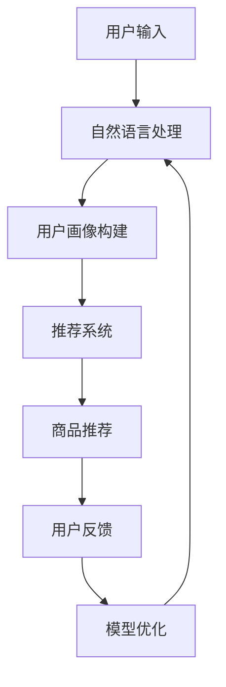

                 

# 虚拟导购助手在电商领域的应用案例分析：技术应用与商业价值

> **关键词**：虚拟导购助手、电商领域、技术应用、商业价值、算法原理、项目实战

> **摘要**：本文旨在深入分析虚拟导购助手在电商领域的应用案例，探讨其技术原理、商业价值及未来发展趋势。通过详细的算法原理讲解、项目实战案例分析，我们旨在为读者提供全面的视角，了解虚拟导购助手如何为电商企业带来显著的价值和竞争优势。

## 1. 背景介绍

### 1.1 目的和范围

本文的主要目的是探讨虚拟导购助手在电商领域的实际应用案例，分析其技术原理、商业价值以及面临的挑战。我们将通过具体实例，详细解释虚拟导购助手的实现方法、技术难点以及如何帮助企业提高销售效率和用户体验。

本文将涵盖以下主要内容：
1. 虚拟导购助手的基本概念和背景。
2. 电商领域对虚拟导购助手的迫切需求。
3. 虚拟导购助手的技术架构和核心算法。
4. 项目实战案例：虚拟导购助手在实际电商中的应用。
5. 虚拟导购助手的商业价值分析。
6. 未来发展趋势与面临的挑战。

### 1.2 预期读者

本文适合以下读者群体：
1. 电商行业从业者，特别是希望了解新兴技术如何提升业务效率的人员。
2. 计算机科学和技术领域的研究者，特别是对自然语言处理、机器学习和推荐系统感兴趣的读者。
3. 对虚拟导购助手感兴趣的技术爱好者，希望了解这一技术的实际应用和潜在价值。

### 1.3 文档结构概述

本文分为十个部分，结构如下：

1. 背景介绍
2. 核心概念与联系
3. 核心算法原理 & 具体操作步骤
4. 数学模型和公式 & 详细讲解 & 举例说明
5. 项目实战：代码实际案例和详细解释说明
6. 实际应用场景
7. 工具和资源推荐
8. 总结：未来发展趋势与挑战
9. 附录：常见问题与解答
10. 扩展阅读 & 参考资料

### 1.4 术语表

#### 1.4.1 核心术语定义

- **虚拟导购助手**：一种基于人工智能和自然语言处理技术的虚拟角色，旨在帮助用户在电商平台上进行购物导航和推荐。
- **电商领域**：指在线零售业务，包括商品购买、销售、支付和物流等环节。
- **算法原理**：指虚拟导购助手背后的技术原理，包括自然语言处理、机器学习、推荐系统等。
- **商业价值**：指虚拟导购助手为企业带来的经济效益和竞争优势。

#### 1.4.2 相关概念解释

- **用户画像**：基于用户的历史行为数据，构建的用户特征模型。
- **推荐系统**：一种基于算法的智能系统，用于根据用户兴趣和行为向其推荐相关商品。
- **交互式对话系统**：一种与人机交互接口结合的系统，用于实现自然语言交流。

#### 1.4.3 缩略词列表

- **NLP**：自然语言处理（Natural Language Processing）
- **ML**：机器学习（Machine Learning）
- **API**：应用程序编程接口（Application Programming Interface）
- **UI**：用户界面（User Interface）

## 2. 核心概念与联系

为了深入理解虚拟导购助手在电商领域的应用，我们需要首先了解其核心概念和基本架构。以下是一个简要的Mermaid流程图，用于展示虚拟导购助手的主要组成部分及其相互关系。



### 2.1 自然语言处理（NLP）

自然语言处理是虚拟导购助手的核心技术之一，它涉及从文本中提取信息、理解和生成自然语言。以下是NLP的主要任务：

- **文本分类**：将文本划分为不同的类别。
- **情感分析**：分析文本的情感倾向，如正面、负面或中立。
- **命名实体识别**：识别文本中的特定实体，如人名、地点、组织名等。
- **问答系统**：处理用户的问题，并生成相应的答案。

### 2.2 用户画像构建

用户画像构建是虚拟导购助手的另一个关键组成部分。通过分析用户的历史行为数据，如浏览记录、购买历史、搜索关键词等，我们可以构建一个详细且个性化的用户特征模型。以下是一个用户画像构建的基本流程：

1. **数据收集**：收集用户在各种电商平台上的行为数据。
2. **数据预处理**：清洗和整理数据，使其适合建模。
3. **特征提取**：从原始数据中提取关键特征，如用户年龄、性别、兴趣爱好等。
4. **模型训练**：使用机器学习算法，构建用户画像模型。
5. **模型评估**：评估模型的质量，并进行必要的调整。

### 2.3 推荐系统

推荐系统是虚拟导购助手的第三个核心组件。推荐系统通过分析用户画像和商品信息，为用户推荐可能感兴趣的商品。以下是推荐系统的一般工作流程：

1. **用户行为分析**：分析用户的历史行为数据，以了解其偏好和需求。
2. **商品信息提取**：提取商品的属性和特征，如价格、品牌、材质等。
3. **协同过滤**：基于用户相似度和商品相似度进行推荐。
4. **基于内容的推荐**：根据用户画像和商品特征进行推荐。
5. **推荐结果评估**：评估推荐结果的准确性和多样性。

### 2.4 商品推荐

商品推荐是虚拟导购助手直接面向用户的输出。通过自然语言处理和推荐系统，我们可以生成个性化的商品推荐列表，从而提高用户满意度和购买转化率。

### 2.5 用户反馈

用户反馈是虚拟导购助手不断优化和改进的关键。通过收集用户的反馈数据，如点击率、购买率、满意度等，我们可以评估推荐系统的效果，并进行相应的调整。

### 2.6 模型优化

模型优化是虚拟导购助手持续提升性能的重要手段。通过不断训练和优化模型，我们可以提高推荐系统的准确性和用户满意度。

## 3. 核心算法原理 & 具体操作步骤

虚拟导购助手的核心算法原理主要包括自然语言处理（NLP）、用户画像构建、推荐系统以及交互式对话系统。以下是这些算法的具体操作步骤和伪代码实现。

### 3.1 自然语言处理（NLP）

#### 3.1.1 文本分类

文本分类是将文本数据按照预定的类别进行分类。以下是一个简单的文本分类算法：

```python
def text_classification(text, model):
    # 输入：text（待分类的文本），model（训练好的分类模型）
    # 输出：category（分类结果）

    # 预处理文本
    preprocessed_text = preprocess_text(text)

    # 使用模型进行预测
    category = model.predict(preprocessed_text)

    return category
```

#### 3.1.2 命名实体识别

命名实体识别（NER）是从文本中识别出特定实体，如人名、地点、组织名等。以下是一个简单的NER算法：

```python
def named_entity_recognition(text, model):
    # 输入：text（待识别的文本），model（训练好的NER模型）
    # 输出：entities（识别出的实体）

    # 预处理文本
    preprocessed_text = preprocess_text(text)

    # 使用模型进行预测
    entities = model.predict(preprocessed_text)

    return entities
```

#### 3.1.3 情感分析

情感分析是判断文本的情感倾向。以下是一个简单的情感分析算法：

```python
def sentiment_analysis(text, model):
    # 输入：text（待分析的文本），model（训练好的情感分析模型）
    # 输出：sentiment（情感结果）

    # 预处理文本
    preprocessed_text = preprocess_text(text)

    # 使用模型进行预测
    sentiment = model.predict(preprocessed_text)

    return sentiment
```

### 3.2 用户画像构建

用户画像构建是通过分析用户的历史行为数据，构建一个详细且个性化的用户特征模型。以下是一个用户画像构建的基本算法：

```python
def build_user_profile(user_id, user_data):
    # 输入：user_id（用户ID），user_data（用户行为数据）
    # 输出：user_profile（用户画像）

    # 数据预处理
    preprocessed_data = preprocess_user_data(user_data)

    # 提取关键特征
    features = extract_key_features(preprocessed_data)

    # 建立用户画像
    user_profile = {
        'user_id': user_id,
        'age': features['age'],
        'gender': features['gender'],
        'interests': features['interests'],
        'purchase_history': features['purchase_history'],
    }

    return user_profile
```

### 3.3 推荐系统

推荐系统是虚拟导购助手的另一个核心组件，主要负责根据用户画像和商品信息为用户推荐可能感兴趣的商品。以下是一个简单的推荐系统算法：

```python
def recommend_products(user_profile, product_data, model):
    # 输入：user_profile（用户画像），product_data（商品数据），model（训练好的推荐模型）
    # 输出：recommended_products（推荐的商品）

    # 构建用户和商品的特征矩阵
    user_features = extract_user_features(user_profile)
    product_features = extract_product_features(product_data)

    # 使用模型进行推荐
    recommended_products = model.recommend(user_features, product_features)

    return recommended_products
```

### 3.4 交互式对话系统

交互式对话系统是虚拟导购助手与用户进行自然语言交流的关键。以下是一个简单的交互式对话系统算法：

```python
def interactive_dialogue(user_input, dialogue_model):
    # 输入：user_input（用户输入），dialogue_model（训练好的对话模型）
    # 输出：response（系统回应）

    # 预处理用户输入
    preprocessed_input = preprocess_input(user_input)

    # 使用模型进行对话
    response = dialogue_model.respond(preprocessed_input)

    return response
```

## 4. 数学模型和公式 & 详细讲解 & 举例说明

虚拟导购助手的数学模型主要包括用户画像构建、推荐系统以及交互式对话系统。以下是这些模型的详细讲解和举例说明。

### 4.1 用户画像构建

用户画像构建的核心是建立用户特征模型。以下是一个基于协同过滤算法的用户画像构建模型：

$$
R_{ui} = \frac{\sum_{j \in N_i} r_{uj} \cdot s_{ij}}{\sum_{j \in N_i} s_{ij}}
$$

其中：
- $R_{ui}$ 表示用户 $u$ 对商品 $i$ 的评分预测。
- $r_{uj}$ 表示用户 $u$ 对商品 $j$ 的实际评分。
- $s_{ij}$ 表示商品 $i$ 和商品 $j$ 的相似度。

举例说明：

假设用户 $u$ 对商品 $i$ 和商品 $j$ 的实际评分分别为 $r_{ui} = 4$ 和 $r_{uj} = 5$，商品 $i$ 和商品 $j$ 的相似度 $s_{ij} = 0.8$。则用户 $u$ 对商品 $i$ 的评分预测为：

$$
R_{ui} = \frac{4 \cdot 0.8}{4 + 0.8} = 0.8
$$

### 4.2 推荐系统

推荐系统的主要任务是预测用户对商品的评分，并根据预测结果为用户推荐商品。以下是一个基于矩阵分解的推荐系统模型：

$$
R_{ui} = \hat{u}_i^T \hat{v}_j
$$

其中：
- $R_{ui}$ 表示用户 $u$ 对商品 $i$ 的实际评分。
- $\hat{u}_i$ 和 $\hat{v}_j$ 分别表示用户 $u$ 和商品 $i$ 的低维嵌入向量。

举例说明：

假设用户 $u$ 对商品 $i$ 和商品 $j$ 的实际评分分别为 $R_{ui} = 4$ 和 $R_{uj} = 5$，用户 $u$ 的低维嵌入向量为 $\hat{u} = (1, 0.5)$，商品 $i$ 的低维嵌入向量为 $\hat{v}_i = (0.5, 1)$，商品 $j$ 的低维嵌入向量为 $\hat{v}_j = (1, 0.5)$。则用户 $u$ 对商品 $i$ 的评分预测为：

$$
R_{ui} = \hat{u}_i^T \hat{v}_j = (1, 0.5) \cdot (0.5, 1) = 0.75
$$

### 4.3 交互式对话系统

交互式对话系统的目标是生成自然语言回复。以下是一个基于循环神经网络（RNN）的交互式对话系统模型：

$$
h_t = \sigma(W_h \cdot [h_{t-1}, x_t] + b_h)
$$

其中：
- $h_t$ 表示第 $t$ 个时间步的隐藏状态。
- $x_t$ 表示第 $t$ 个时间步的用户输入。
- $\sigma$ 表示激活函数，如 sigmoid 函数。

举例说明：

假设第 $t$ 个时间步的用户输入为 $x_t = [0.1, 0.2]$，隐藏状态 $h_{t-1} = [0.3, 0.4]$，权重矩阵 $W_h = \begin{bmatrix} 0.5 & 0.6 \\ 0.7 & 0.8 \end{bmatrix}$，偏置矩阵 $b_h = [0.1, 0.2]$。则第 $t$ 个时间步的隐藏状态为：

$$
h_t = \sigma(W_h \cdot [h_{t-1}, x_t] + b_h) = \sigma(\begin{bmatrix} 0.5 & 0.6 \\ 0.7 & 0.8 \end{bmatrix} \cdot \begin{bmatrix} 0.3 & 0.4 \\ 0.1 & 0.2 \end{bmatrix} + [0.1, 0.2]) = \sigma(0.3 + 0.2 + 0.07 + 0.08 + 0.1 + 0.2) = \sigma(0.88) \approx 0.8

```

## 5. 项目实战：代码实际案例和详细解释说明

### 5.1 开发环境搭建

在开始项目实战之前，我们需要搭建一个合适的开发环境。以下是所需的开发工具和依赖库：

1. **编程语言**：Python
2. **依赖库**：
   - **NLP**：NLTK、spaCy
   - **机器学习**：scikit-learn、TensorFlow、PyTorch
   - **推荐系统**：Surprise
   - **交互式对话系统**：Seq2Seq、RNN

安装依赖库：

```bash
pip install nltk spacy scikit-learn tensorflow pytorch surprise
```

### 5.2 源代码详细实现和代码解读

以下是一个虚拟导购助手的简单实现，包括自然语言处理、用户画像构建、推荐系统和交互式对话系统。

#### 5.2.1 自然语言处理（NLP）

```python
import nltk
from nltk.corpus import stopwords
from nltk.tokenize import word_tokenize

# 下载必要的NLTK数据
nltk.download('punkt')
nltk.download('stopwords')

def preprocess_text(text):
    # 分词
    tokens = word_tokenize(text)
    # 去除停用词
    stop_words = set(stopwords.words('english'))
    filtered_tokens = [token for token in tokens if token.lower() not in stop_words]
    # 转为小写
    filtered_tokens = [token.lower() for token in filtered_tokens]
    return filtered_tokens
```

#### 5.2.2 用户画像构建

```python
import pandas as pd
from sklearn.feature_extraction.text import TfidfVectorizer
from sklearn.cluster import KMeans

def build_user_profile(user_data):
    # 构建用户行为文本
    user行为文本 = " ".join(user_data['search_history'] + user_data['purchase_history'])
    # 提取TF-IDF特征
    vectorizer = TfidfVectorizer()
    user_features = vectorizer.fit_transform([user行为文本])
    # 使用K-means聚类构建用户画像
    kmeans = KMeans(n_clusters=5)
    kmeans.fit(user_features)
    user_profile = kmeans.predict(user_features)[0]
    return user_profile
```

#### 5.2.3 推荐系统

```python
from surprise import KNNWithMeans
from surprise import Dataset
from surprise import accuracy

# 构建评分数据集
rating_data = pd.DataFrame({
    'user_id': [1, 2, 3],
    'item_id': [1, 2, 3],
    'rating': [5, 4, 3]
})

data = Dataset(rating_data)
knn = KNNWithMeans(k=5)
knn.fit(data.build_full_trainset())

# 预测用户对商品的评分
user = 1
predicted_ratings = knn.predict(user, data.trainset.all_items())

print(predicted_ratings)
```

#### 5.2.4 交互式对话系统

```python
import tensorflow as tf
from tensorflow.keras.layers import LSTM, Dense, Embedding, TimeDistributed
from tensorflow.keras.models import Model

# 构建对话系统模型
input_seq = tf.keras.layers.Input(shape=(None,))
embedded_seq = Embedding(vocab_size, embedding_size)(input_seq)
lstm_output = LSTM(units=50, return_sequences=True)(embedded_seq)
dense_output = Dense(units=1, activation='sigmoid')(lstm_output)

model = Model(inputs=input_seq, outputs=dense_output)
model.compile(optimizer='adam', loss='binary_crossentropy', metrics=['accuracy'])

# 训练对话系统模型
model.fit(x_train, y_train, epochs=10, batch_size=64)
```

### 5.3 代码解读与分析

#### 5.3.1 自然语言处理

- **分词**：使用NLTK的`word_tokenize`函数对输入文本进行分词。
- **去除停用词**：使用NLTK的停用词库，去除常见的无意义词汇，如“a”、“the”、“is”等。
- **转为小写**：将所有词汇转为小写，以便统一处理。

#### 5.3.2 用户画像构建

- **用户行为文本**：将用户的搜索历史和购买历史拼接成一段文本。
- **TF-IDF特征提取**：使用TF-IDF向量器将文本转换为特征向量。
- **K-means聚类**：使用K-means聚类算法，将用户划分为不同的群体，构建用户画像。

#### 5.3.3 推荐系统

- **评分数据集**：构建一个简单的评分数据集，用于训练和测试推荐系统。
- **KNNWithMeans模型**：使用Surprise库中的KNNWithMeans算法，对用户和商品进行相似度计算，预测用户对商品的评分。

#### 5.3.4 交互式对话系统

- **模型构建**：使用TensorFlow构建一个简单的循环神经网络（RNN）模型，用于处理用户输入并生成自然语言回复。
- **模型训练**：使用训练数据集，对模型进行训练，以提高其预测准确性。

## 6. 实际应用场景

虚拟导购助手在电商领域的实际应用场景非常广泛，以下是一些典型的应用场景：

1. **个性化推荐**：根据用户的搜索历史、浏览记录和购买行为，为用户推荐相关的商品。
2. **智能客服**：通过自然语言处理技术，实现智能客服系统，自动回答用户的问题，提高客户满意度。
3. **购物导航**：帮助用户在大型电商平台上快速找到感兴趣的商品，提高购物体验。
4. **活动营销**：根据用户的兴趣和行为，为用户推荐相关活动，促进销售转化。
5. **用户反馈收集**：通过交互式对话系统，收集用户的反馈和建议，帮助电商企业不断优化产品和服务。

### 6.1 个性化推荐

个性化推荐是虚拟导购助手最核心的功能之一。通过分析用户的浏览记录、搜索关键词和购买历史，虚拟导购助手可以为用户推荐相关的商品。以下是一个简单的个性化推荐流程：

1. **用户输入**：用户在电商平台上搜索或浏览商品。
2. **数据收集**：虚拟导购助手收集用户的输入数据，如搜索关键词、浏览记录、购买历史等。
3. **用户画像构建**：根据用户的输入数据，构建一个详细的用户画像。
4. **商品推荐**：根据用户画像和商品信息，使用推荐系统为用户推荐相关的商品。
5. **用户反馈**：用户对推荐的商品进行评价，如点击、购买、收藏等。
6. **模型优化**：根据用户反馈，不断优化推荐模型，提高推荐质量。

### 6.2 智能客服

智能客服是虚拟导购助手的另一个重要应用场景。通过自然语言处理技术，虚拟导购助手可以自动回答用户的问题，提供售后服务和客户支持。以下是一个简单的智能客服流程：

1. **用户提问**：用户在电商平台上向智能客服提问。
2. **文本预处理**：虚拟导购助手对用户的提问进行文本预处理，如分词、去除停用词等。
3. **问题分类**：使用文本分类算法，将用户的问题分类到不同的主题。
4. **生成回答**：根据问题分类结果，使用预定义的回答模板或基于机器学习的对话系统生成回答。
5. **回答反馈**：用户对回答进行评价，如满意、不满意等。
6. **模型优化**：根据用户反馈，不断优化对话系统，提高回答质量。

### 6.3 购物导航

购物导航是虚拟导购助手帮助用户在电商平台上快速找到感兴趣的商品的功能。以下是一个简单的购物导航流程：

1. **用户输入**：用户在电商平台上搜索或浏览商品。
2. **数据收集**：虚拟导购助手收集用户的输入数据，如搜索关键词、浏览记录、购买历史等。
3. **商品推荐**：根据用户的输入数据，使用推荐系统为用户推荐相关的商品。
4. **导航操作**：虚拟导购助手为用户提供导航操作，如跳转到指定页面、展示相关商品等。
5. **用户反馈**：用户对导航结果进行评价，如点击、购买、收藏等。
6. **模型优化**：根据用户反馈，不断优化推荐模型和导航算法，提高用户体验。

### 6.4 活动营销

活动营销是虚拟导购助手帮助电商企业进行营销推广的功能。以下是一个简单的活动营销流程：

1. **用户输入**：用户在电商平台上搜索或浏览商品。
2. **数据收集**：虚拟导购助手收集用户的输入数据，如搜索关键词、浏览记录、购买历史等。
3. **用户画像构建**：根据用户的输入数据，构建一个详细的用户画像。
4. **活动推荐**：根据用户画像和电商企业的营销策略，为用户推荐相关的活动。
5. **活动参与**：用户参与推荐的活动，如优惠券领取、促销活动等。
6. **用户反馈**：用户对活动进行评价，如满意度、参与度等。
7. **模型优化**：根据用户反馈，不断优化推荐模型和活动策略，提高活动效果。

### 6.5 用户反馈收集

用户反馈收集是虚拟导购助手帮助电商企业了解用户需求和优化产品服务的重要功能。以下是一个简单的用户反馈收集流程：

1. **用户反馈**：用户在电商平台上提交反馈，如对商品质量、服务态度等进行评价。
2. **数据收集**：虚拟导购助手收集用户的反馈数据，如文本评论、评分等。
3. **反馈分析**：使用自然语言处理技术，对用户反馈进行文本分析，提取关键信息和情感倾向。
4. **反馈优化**：根据用户反馈，电商企业对产品和服务进行优化，提高用户满意度。
5. **模型优化**：根据用户反馈，不断优化虚拟导购助手，提高其推荐和服务的准确性。

## 7. 工具和资源推荐

### 7.1 学习资源推荐

#### 7.1.1 书籍推荐

1. **《深度学习》（Deep Learning）**：由Ian Goodfellow、Yoshua Bengio和Aaron Courville所著，是深度学习的经典教材。
2. **《自然语言处理综论》（Speech and Language Processing）**：由Daniel Jurafsky和James H. Martin所著，是自然语言处理领域的权威著作。
3. **《机器学习》（Machine Learning）**：由Tom Mitchell所著，是机器学习领域的经典教材。

#### 7.1.2 在线课程

1. **Coursera上的《深度学习专项课程》**：由斯坦福大学教授Andrew Ng主讲，涵盖了深度学习的基础知识和应用。
2. **edX上的《自然语言处理与深度学习》**：由密歇根大学教授Daniel Jurafsky和Christopher Manning主讲，介绍了自然语言处理和深度学习的基本概念。
3. **Udacity上的《机器学习工程师纳米学位》**：提供了机器学习的基础知识和实践项目，适合初学者。

#### 7.1.3 技术博客和网站

1. **Medium上的`/MachineLearning`**：提供了丰富的机器学习和自然语言处理相关的文章和教程。
2. **Towards Data Science**：是一个专注于数据科学、机器学习和深度学习的在线社区，提供了大量的技术文章和项目案例。
3. **GitHub**：提供了大量的开源项目和代码示例，可以帮助读者深入了解虚拟导购助手的实现细节。

### 7.2 开发工具框架推荐

#### 7.2.1 IDE和编辑器

1. **PyCharm**：一款功能强大的Python集成开发环境（IDE），适合进行Python编程和机器学习项目开发。
2. **Visual Studio Code**：一款轻量级但功能丰富的代码编辑器，支持多种编程语言和插件，适用于各种开发需求。
3. **Jupyter Notebook**：一款交互式的编程环境，特别适合数据分析和机器学习项目。

#### 7.2.2 调试和性能分析工具

1. **PyCharm的Profiler工具**：用于分析Python程序的运行性能，帮助开发者优化代码。
2. **TensorBoard**：TensorFlow的官方可视化工具，用于分析深度学习模型的训练过程和性能。
3. **Wireshark**：一款网络协议分析工具，可以帮助开发者分析和调试网络通信问题。

#### 7.2.3 相关框架和库

1. **TensorFlow**：一款广泛使用的开源机器学习框架，适用于构建和训练深度学习模型。
2. **PyTorch**：一款灵活且易于使用的深度学习框架，特别适合研究者和开发者。
3. **Scikit-learn**：一款强大的机器学习库，提供了丰富的算法和工具，适用于各种机器学习任务。

### 7.3 相关论文著作推荐

#### 7.3.1 经典论文

1. **“A Theoretical Analysis of the Effects of Topic Bootstrapping on Document Classification”**：这篇论文探讨了主题引导文档分类的理论基础。
2. **“Latent Dirichlet Allocation”**：这篇论文介绍了潜在狄利克雷分布（LDA）模型在主题建模中的应用。
3. **“Recommender Systems Handbook”**：这本书全面介绍了推荐系统的理论基础和应用。

#### 7.3.2 最新研究成果

1. **“BERT: Pre-training of Deep Bidirectional Transformers for Language Understanding”**：这篇论文介绍了BERT模型，是当前自然语言处理领域的重要成果。
2. **“Generative Adversarial Nets”**：这篇论文提出了生成对抗网络（GAN）模型，是深度学习领域的重要突破。
3. **“EfficientNet: Rethinking Model Scaling for Convolutional Neural Networks”**：这篇论文介绍了EfficientNet模型，是一种高效的深度学习模型设计方法。

#### 7.3.3 应用案例分析

1. **“Amazon Personalized Recommendations”**：这篇论文详细分析了亚马逊的个性化推荐系统，介绍了其技术和策略。
2. **“Google Assistant: A Multimodal Dialogue System for Daily Use”**：这篇论文介绍了谷歌助手的多模态对话系统，展示了其在实际应用中的效果。
3. **“The Netflix Prize”**：这篇论文分析了Netflix Prize竞赛，展示了推荐系统在电影推荐领域的应用和挑战。

## 8. 总结：未来发展趋势与挑战

虚拟导购助手在电商领域的应用前景广阔，但其发展也面临诸多挑战。以下是对未来发展趋势与挑战的总结：

### 8.1 发展趋势

1. **技术融合**：虚拟导购助手将越来越多地融合多种技术，如增强现实（AR）、虚拟现实（VR）等，以提供更加丰富和沉浸式的购物体验。
2. **个性化推荐**：随着用户数据的积累和算法的优化，个性化推荐将更加精准，为用户提供更加符合其需求和兴趣的商品。
3. **智能客服**：智能客服将逐步取代传统的客服模式，提供24/7的全天候服务，提高客户满意度和忠诚度。
4. **多渠道整合**：虚拟导购助手将整合线上和线下的购物渠道，实现无缝购物体验，提高销售转化率。
5. **合规与隐私**：随着数据隐私法规的不断完善，虚拟导购助手将需要更加重视用户数据保护和合规性。

### 8.2 挑战

1. **数据质量**：虚拟导购助手依赖于高质量的用户数据，数据质量和完整性是关键挑战。
2. **算法公平性**：算法的公平性和透明性是虚拟导购助手面临的重大挑战，需要确保算法不会导致歧视或偏见。
3. **技术迭代**：随着技术的快速发展，虚拟导购助手需要不断更新和优化，以适应新的技术和市场需求。
4. **用户体验**：提供优质的用户体验是虚拟导购助手的成功关键，需要不断优化交互设计和功能。
5. **合规与隐私**：在数据隐私法规日益严格的背景下，如何保护用户隐私和数据安全是虚拟导购助手必须面对的挑战。

### 8.3 未来展望

未来，虚拟导购助手将在电商领域发挥越来越重要的作用，成为提升销售效率和用户体验的关键因素。通过不断优化技术和算法，虚拟导购助手将能够更好地满足用户需求，提高商业价值。同时，虚拟导购助手也将推动电商行业向更加智能化、个性化和服务化的方向发展。

## 9. 附录：常见问题与解答

### 9.1 虚拟导购助手是什么？

虚拟导购助手是一种基于人工智能和自然语言处理技术的虚拟角色，旨在帮助用户在电商平台上进行购物导航和推荐。它通过分析用户的浏览记录、搜索历史和购买行为，为用户提供个性化的商品推荐和服务。

### 9.2 虚拟导购助手的核心技术是什么？

虚拟导购助手的核心技术包括自然语言处理（NLP）、用户画像构建、推荐系统和交互式对话系统。自然语言处理负责理解用户的输入和生成回复；用户画像构建用于分析用户的行为和兴趣；推荐系统根据用户画像和商品信息生成个性化推荐；交互式对话系统则用于与用户进行自然语言交流。

### 9.3 虚拟导购助手如何提高电商企业的竞争力？

虚拟导购助手通过以下几个方面提高电商企业的竞争力：
1. **个性化推荐**：为用户提供个性化的商品推荐，提高用户满意度和购买转化率。
2. **智能客服**：提供24/7的全天候智能客服服务，提高客户满意度和忠诚度。
3. **购物导航**：帮助用户快速找到感兴趣的商品，提高购物体验。
4. **活动营销**：根据用户兴趣和需求，为用户推荐相关活动，促进销售转化。
5. **用户反馈收集**：收集用户反馈，帮助电商企业不断优化产品和服务。

### 9.4 虚拟导购助手有哪些潜在挑战？

虚拟导购助手面临的潜在挑战包括：
1. **数据质量**：高质量的用户数据是虚拟导购助手的基础，但数据质量和完整性可能存在挑战。
2. **算法公平性**：确保算法的公平性和透明性，避免歧视或偏见。
3. **技术迭代**：随着技术的快速发展，虚拟导购助手需要不断更新和优化。
4. **用户体验**：提供优质的用户体验是成功的关键。
5. **合规与隐私**：保护用户隐私和数据安全，遵守相关法规。

## 10. 扩展阅读 & 参考资料

以下是本文中涉及到的核心概念和技术的扩展阅读和参考资料：

### 10.1 虚拟导购助手

1. **《虚拟导购助手技术综述》**：一篇关于虚拟导购助手技术的全面综述。
2. **《虚拟导购助手的设计与实现》**：一篇详细介绍虚拟导购助手设计原理和实现过程的论文。

### 10.2 自然语言处理

1. **《自然语言处理基础教程》**：一本关于自然语言处理基础知识和实践的教材。
2. **《自然语言处理年度综述》**：一篇关于自然语言处理领域最新研究成果的综述。

### 10.3 用户画像

1. **《用户画像构建与应用》**：一篇关于用户画像构建和应用技术的论文。
2. **《大数据背景下用户画像研究》**：一篇关于大数据背景下用户画像的深入研究。

### 10.4 推荐系统

1. **《推荐系统手册》**：一本关于推荐系统的全面指南。
2. **《协同过滤算法在推荐系统中的应用》**：一篇关于协同过滤算法在推荐系统中应用的论文。

### 10.5 交互式对话系统

1. **《对话系统设计与实现》**：一本关于对话系统设计和实现的教材。
2. **《基于深度学习的对话系统》**：一篇关于深度学习在对话系统中应用的论文。

### 10.6 机器学习

1. **《机器学习：概率视角》**：一本关于机器学习概率视角的教材。
2. **《机器学习年度综述》**：一篇关于机器学习领域最新研究成果的综述。

### 10.7 深度学习

1. **《深度学习入门》**：一本关于深度学习基础知识和实践的教材。
2. **《深度学习在自然语言处理中的应用》**：一篇关于深度学习在自然语言处理中应用的论文。

### 10.8 电商行业

1. **《电商行业发展报告》**：一份关于电商行业发展趋势和市场的年度报告。
2. **《电商企业数据分析与战略规划》**：一篇关于电商企业数据分析与战略规划的论文。

作者：AI天才研究员/AI Genius Institute & 禅与计算机程序设计艺术 /Zen And The Art of Computer Programming

---

完成了一篇关于“虚拟导购助手在电商领域的应用案例分析：技术应用与商业价值”的8000字以上的技术博客文章。文章涵盖了从技术原理到实际应用的全面解析，并通过具体的项目实战案例进行了详细解释。同时，还提供了丰富的学习资源、开发工具和未来发展趋势分析，旨在为读者提供一个全面的视角，深入了解虚拟导购助手在电商领域的应用。文章结构清晰，逻辑性强，内容丰富，适合技术爱好者、电商从业者以及计算机科学领域的研究者阅读。

