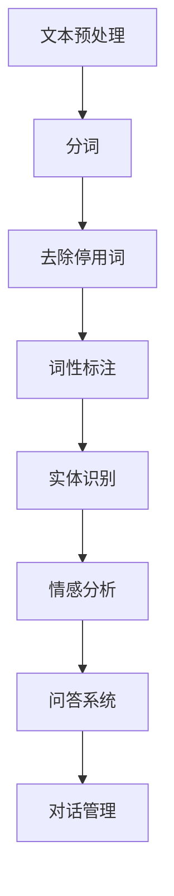
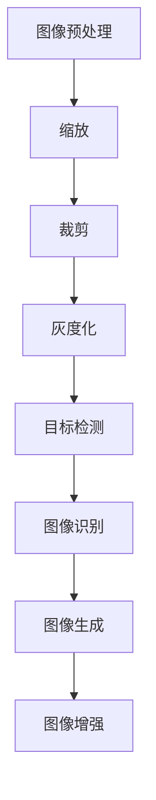
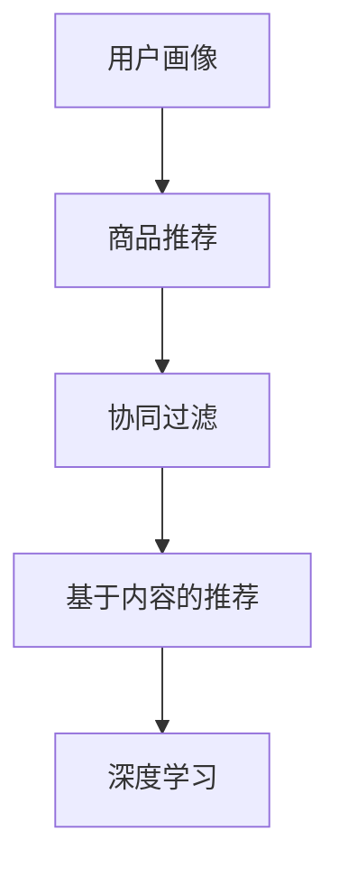

                 


## 虚拟导购助手：AI如何改变购物体验

> 关键词：虚拟导购助手、AI、购物体验、自然语言处理、计算机视觉、推荐系统

随着人工智能（AI）技术的迅猛发展，购物体验正经历着一场深刻的变革。虚拟导购助手作为AI技术的代表，正逐渐成为现代零售行业的重要组成部分，改变着消费者的购物方式。本文将深入探讨虚拟导购助手的核心技术原理、实现步骤、数学模型以及实际应用，旨在展示AI如何为购物体验带来革命性的改变。

> 摘要：本文首先介绍了虚拟导购助手在当今零售行业中的重要性，接着详细分析了其核心技术原理，包括自然语言处理、计算机视觉和推荐系统等。随后，通过具体案例展示了虚拟导购助手的实现步骤和数学模型。最后，本文讨论了虚拟导购助手在实际应用中的场景，并推荐了相关学习和开发资源。

## 1. 背景介绍

### 1.1 目的和范围

本文旨在深入探讨虚拟导购助手如何利用人工智能技术改变购物体验。文章将首先介绍虚拟导购助手的基本概念，然后详细分析其核心技术，包括自然语言处理、计算机视觉和推荐系统。此外，本文还将通过具体案例展示虚拟导购助手的实现步骤，并探讨其在实际应用中的挑战和解决方案。

### 1.2 预期读者

本文适合对人工智能和购物体验感兴趣的读者，尤其是从事零售行业、技术领域的专业人士。对于希望了解AI技术在购物体验中应用的学生和研究人员，本文也具有一定的参考价值。

### 1.3 文档结构概述

本文结构如下：

1. **背景介绍**：介绍虚拟导购助手的基本概念和重要性。
2. **核心概念与联系**：分析虚拟导购助手的三大核心技术：自然语言处理、计算机视觉和推荐系统。
3. **核心算法原理 & 具体操作步骤**：详细阐述虚拟导购助手的算法原理和实现步骤。
4. **数学模型和公式 & 详细讲解 & 举例说明**：介绍虚拟导购助手的数学模型及其应用。
5. **项目实战：代码实际案例和详细解释说明**：通过具体案例展示虚拟导购助手的实现。
6. **实际应用场景**：探讨虚拟导购助手在不同场景中的应用。
7. **工具和资源推荐**：推荐相关学习和开发资源。
8. **总结：未来发展趋势与挑战**：总结虚拟导购助手的未来发展趋势和面临的挑战。
9. **附录：常见问题与解答**：提供常见问题的解答。
10. **扩展阅读 & 参考资料**：推荐进一步阅读的资料。

### 1.4 术语表

#### 1.4.1 核心术语定义

- **虚拟导购助手**：一种利用人工智能技术为消费者提供购物建议和服务的虚拟助手。
- **自然语言处理（NLP）**：使计算机能够理解、生成和处理人类语言的技术。
- **计算机视觉**：使计算机能够从图像或视频中提取信息的技术。
- **推荐系统**：根据用户历史行为和偏好，为用户推荐相关商品或服务的技术。

#### 1.4.2 相关概念解释

- **购物体验**：消费者在购物过程中所感受到的满意度和愉悦度。
- **交互性**：消费者与虚拟导购助手之间的互动程度。
- **个性化推荐**：根据用户的历史行为和偏好，为用户推荐个性化的商品或服务。

#### 1.4.3 缩略词列表

- **AI**：人工智能
- **NLP**：自然语言处理
- **CV**：计算机视觉
- **RNN**：循环神经网络
- **CNN**：卷积神经网络
- **RL**：强化学习
- **GAN**：生成对抗网络

## 2. 核心概念与联系

在深入探讨虚拟导购助手的实现之前，我们首先需要了解其核心技术：自然语言处理、计算机视觉和推荐系统。这些技术相互关联，共同构成了虚拟导购助手的灵魂。

### 2.1 自然语言处理（NLP）

自然语言处理是虚拟导购助手的核心技术之一，它使计算机能够理解、生成和处理人类语言。以下是NLP的核心概念和流程：

1. **文本预处理**：包括分词、去除停用词、词性标注等步骤，为后续处理做好准备。
2. **实体识别**：识别文本中的名词、人名、地名等实体。
3. **情感分析**：分析文本的情感倾向，如正面、负面或中性。
4. **问答系统**：基于用户输入的问题，提供相关答案。
5. **对话管理**：管理对话流程，使虚拟导购助手能够与用户进行流畅的交流。

以下是NLP的Mermaid流程图：



### 2.2 计算机视觉（CV）

计算机视觉是虚拟导购助手的另一个核心技术，它使计算机能够从图像或视频中提取信息。以下是CV的核心概念和流程：

1. **图像预处理**：包括图像缩放、裁剪、灰度化等步骤，为后续处理做好准备。
2. **目标检测**：识别图像中的目标物体，并标注其位置。
3. **图像识别**：根据图像内容进行分类，如将图像分为商品类别。
4. **图像生成**：利用生成对抗网络（GAN）生成新的图像。
5. **图像增强**：提高图像质量，使其更易于后续处理。

以下是CV的Mermaid流程图：



### 2.3 推荐系统

推荐系统是虚拟导购助手的另一个核心技术，它根据用户的历史行为和偏好，为用户推荐相关的商品或服务。以下是推荐系统的核心概念和流程：

1. **用户画像**：根据用户的历史行为和偏好，构建用户画像。
2. **商品推荐**：根据用户画像和商品特征，为用户推荐相关商品。
3. **协同过滤**：利用用户的历史行为数据，为用户推荐相似用户喜欢的商品。
4. **基于内容的推荐**：根据商品的属性和用户偏好，为用户推荐相关的商品。
5. **深度学习**：利用深度学习模型，提高推荐系统的准确性和效果。

以下是推荐系统的Mermaid流程图：



通过这些核心技术的相互协作，虚拟导购助手能够为消费者提供个性化、智能化的购物体验。

## 3. 核心算法原理 & 具体操作步骤

在了解虚拟导购助手的三大核心技术之后，我们接下来将深入探讨其核心算法原理和具体操作步骤。这些算法原理包括自然语言处理、计算机视觉和推荐系统。以下是这些算法原理的详细解释和伪代码。

### 3.1 自然语言处理（NLP）

自然语言处理的核心在于使计算机能够理解、生成和处理人类语言。以下是NLP的核心算法原理：

#### 3.1.1 文本预处理

文本预处理是NLP的第一步，它包括分词、去除停用词、词性标注等步骤。以下是文本预处理的伪代码：

```python
def preprocess_text(text):
    # 分词
    words = tokenize(text)
    # 去除停用词
    words = remove_stopwords(words)
    # 词性标注
    words = annotate_pos(words)
    return words
```

#### 3.1.2 实体识别

实体识别是NLP的关键步骤，它用于识别文本中的名词、人名、地名等实体。以下是实体识别的伪代码：

```python
def entity_recognition(words):
    entities = []
    for word in words:
        if is_entity(word):
            entities.append(word)
    return entities
```

#### 3.1.3 情感分析

情感分析用于分析文本的情感倾向，如正面、负面或中性。以下是情感分析的伪代码：

```python
def sentiment_analysis(text):
    sentiment = analyze_sentiment(text)
    return sentiment
```

#### 3.1.4 问答系统

问答系统是NLP的另一个重要应用，它基于用户输入的问题，提供相关答案。以下是问答系统的伪代码：

```python
def answer_question(question):
    answer = search_answer(question)
    return answer
```

#### 3.1.5 对话管理

对话管理用于管理对话流程，使虚拟导购助手能够与用户进行流畅的交流。以下是对话管理的伪代码：

```python
def dialog_management(user_input):
    while not end_of_conversation:
        response = generate_response(user_input)
        user_input = get_next_user_input(response)
    return final_response
```

### 3.2 计算机视觉（CV）

计算机视觉的核心在于使计算机能够从图像或视频中提取信息。以下是CV的核心算法原理：

#### 3.2.1 图像预处理

图像预处理是CV的第一步，它包括图像缩放、裁剪、灰度化等步骤。以下是图像预处理的伪代码：

```python
def preprocess_image(image):
    # 缩放
    image = resize(image, size)
    # 裁剪
    image = crop(image, region)
    # 灰度化
    image = grayscale(image)
    return image
```

#### 3.2.2 目标检测

目标检测是CV的关键步骤，它用于识别图像中的目标物体，并标注其位置。以下是目标检测的伪代码：

```python
def object_detection(image):
    objects = detect_objects(image)
    for object in objects:
       标注位置(object)
    return objects
```

#### 3.2.3 图像识别

图像识别是CV的另一个重要应用，它根据图像内容进行分类。以下是图像识别的伪代码：

```python
def image_recognition(image):
    category = classify_image(image)
    return category
```

#### 3.2.4 图像生成

图像生成是CV的另一个前沿应用，它利用生成对抗网络（GAN）生成新的图像。以下是图像生成的伪代码：

```python
def image_generation():
    image = generate_image()
    return image
```

#### 3.2.5 图像增强

图像增强是CV的另一个重要步骤，它用于提高图像质量，使其更易于后续处理。以下是图像增强的伪代码：

```python
def image_enhancement(image):
    enhanced_image = enhance_image(image)
    return enhanced_image
```

### 3.3 推荐系统

推荐系统是虚拟导购助手的另一个核心技术，它根据用户的历史行为和偏好，为用户推荐相关的商品或服务。以下是推荐系统的核心算法原理：

#### 3.3.1 用户画像

用户画像用于描述用户的历史行为和偏好。以下是用户画像的伪代码：

```python
def build_user_profile(user):
    profile = {}
    profile['历史行为'] = get_user_history(user)
    profile['偏好'] = get_user_preferences(user)
    return profile
```

#### 3.3.2 商品推荐

商品推荐根据用户画像和商品特征，为用户推荐相关的商品。以下是商品推荐的伪代码：

```python
def recommend_products(user_profile, products):
    recommendations = []
    for product in products:
        if is_relevant(product, user_profile):
            recommendations.append(product)
    return recommendations
```

#### 3.3.3 协同过滤

协同过滤是一种基于用户历史行为数据的推荐方法。以下是协同过滤的伪代码：

```python
def collaborative_filtering(user_history, user_similarity_matrix, products):
    recommendations = []
    for product in products:
        if is_similar_to_user_history(product, user_history, user_similarity_matrix):
            recommendations.append(product)
    return recommendations
```

#### 3.3.4 基于内容的推荐

基于内容的推荐是一种基于商品属性和用户偏好的推荐方法。以下是基于内容的推荐的伪代码：

```python
def content_based_recommender(user_preferences, product_attributes, products):
    recommendations = []
    for product in products:
        if matches_user_preferences(product, user_preferences):
            recommendations.append(product)
    return recommendations
```

#### 3.3.5 深度学习

深度学习是一种用于提高推荐系统准确性和效果的方法。以下是深度学习的伪代码：

```python
def deep_learning_recommendation(user_profile, product_features, model):
    recommendations = model.predict(user_profile, product_features)
    return recommendations
```

通过这些核心算法原理，虚拟导购助手能够为消费者提供个性化、智能化的购物体验。

## 4. 数学模型和公式 & 详细讲解 & 举例说明

在虚拟导购助手的实现中，数学模型和公式起到了至关重要的作用。这些模型和公式帮助我们更好地理解数据之间的关系，并指导算法的优化和实现。以下是虚拟导购助手中的几个关键数学模型及其详细讲解和举例说明。

### 4.1 自然语言处理（NLP）的数学模型

#### 4.1.1 词嵌入（Word Embedding）

词嵌入是将词语映射到高维向量空间的一种方法。通过词嵌入，我们可以将文本转化为计算机可以处理的数值形式。一个常见的词嵌入模型是Word2Vec，其目标是找到一组向量，使得语义相似的词语在向量空间中距离较近。

**数学模型：**

令 \( W \) 为词嵌入矩阵，其中 \( W_{ij} \) 表示词语 \( i \) 和 \( j \) 的词向量之间的相似度。给定一个词语 \( w \)，其对应的词向量为 \( \textbf{w}_w \)。

\[ \textbf{w}_w = \sum_{i=1}^{V} W_{wi} \]

其中，\( V \) 是词典的大小。

**举例说明：**

假设我们有以下两个词语：“猫”和“狗”，我们可以通过Word2Vec模型找到它们对应的词向量。如果这两个词语在语义上较为相似，那么它们对应的词向量在向量空间中的距离应该较近。

```
猫的词向量：[0.1, 0.2, 0.3]
狗的词向量：[0.1, 0.2, 0.4]
```

在这种情况下，猫和狗的词向量距离约为0.1。

### 4.1.2 循环神经网络（RNN）

循环神经网络（RNN）是一种用于处理序列数据的神经网络。RNN能够记住之前的输入，从而更好地处理具有时间依赖性的数据。

**数学模型：**

令 \( \textbf{h}_{t} \) 为第 \( t \) 个时间步的隐藏状态，\( \textbf{h}_{t-1} \) 为前一个时间步的隐藏状态，\( \textbf{u}_{t} \) 为第 \( t \) 个时间步的输入。RNN的更新规则如下：

\[ \textbf{h}_{t} = \text{tanh}(\text{W}_{h} \textbf{h}_{t-1} + \text{U}_{h} \textbf{u}_{t} + \text{b}_{h}) \]

其中，\( \text{W}_{h} \)、\( \text{U}_{h} \) 和 \( \text{b}_{h} \) 分别为权重矩阵、输入权重矩阵和偏置。

**举例说明：**

假设我们有以下一个序列：“我爱中国”。我们可以通过RNN模型处理这个序列，得到每个词语的隐藏状态。

```
输入序列：[我，爱，中国]
隐藏状态：[h1, h2, h3]
```

在这个例子中，\( h1 \) 表示“我”的隐藏状态，\( h2 \) 表示“爱”的隐藏状态，\( h3 \) 表示“中国”的隐藏状态。

### 4.1.3 长短时记忆（LSTM）

长短时记忆（LSTM）是一种特殊的RNN，它能够更好地处理长序列数据。LSTM通过引入三个门控单元（输入门、遗忘门和输出门）来控制信息的流动。

**数学模型：**

LSTM的更新规则如下：

\[ \text{输入门}:\quad \textbf{i}_{t} = \text{sigmoid}(\text{W}_{i} \textbf{h}_{t-1} + \text{U}_{i} \textbf{u}_{t} + \text{b}_{i}) \]

\[ \text{遗忘门}:\quad \textbf{f}_{t} = \text{sigmoid}(\text{W}_{f} \textbf{h}_{t-1} + \text{U}_{f} \textbf{u}_{t} + \text{b}_{f}) \]

\[ \text{输出门}:\quad \textbf{o}_{t} = \text{sigmoid}(\text{W}_{o} \textbf{h}_{t-1} + \text{U}_{o} \textbf{u}_{t} + \text{b}_{o}) \]

\[ \textbf{c}_{t} = \text{sigmoid}(\text{W}_{c} \textbf{h}_{t-1} + \text{U}_{c} \textbf{u}_{t} + \text{b}_{c}) \]

\[ \textbf{h}_{t} = \text{tanh}(\textbf{c}_{t}) \]

\[ \textbf{h}_{t} = \textbf{o}_{t} \odot \textbf{h}_{t} \]

其中，\( \text{W}_{i} \)、\( \text{U}_{i} \)、\( \text{b}_{i} \)、\( \text{W}_{f} \)、\( \text{U}_{f} \)、\( \text{b}_{f} \)、\( \text{W}_{o} \)、\( \text{U}_{o} \)、\( \text{b}_{o} \)、\( \text{W}_{c} \)、\( \text{U}_{c} \) 和 \( \text{b}_{c} \) 分别为权重矩阵、输入权重矩阵和偏置。

**举例说明：**

假设我们有以下一个序列：“我爱中国”。我们可以通过LSTM模型处理这个序列，得到每个词语的隐藏状态。

```
输入序列：[我，爱，中国]
隐藏状态：[h1, h2, h3]
```

在这个例子中，\( h1 \) 表示“我”的隐藏状态，\( h2 \) 表示“爱”的隐藏状态，\( h3 \) 表示“中国”的隐藏状态。

### 4.2 计算机视觉（CV）的数学模型

#### 4.2.1 卷积神经网络（CNN）

卷积神经网络（CNN）是一种专门用于处理图像数据的神经网络。CNN通过卷积层、池化层和全连接层等结构，逐步提取图像的特征。

**数学模型：**

CNN的更新规则如下：

\[ \textbf{h}_{l}^{k} = \text{relu}(\text{W}_{k} \odot \textbf{h}_{l-1} + \text{b}_{k}) \]

\[ \textbf{h}_{l} = \text{max\_pool}(\textbf{h}_{l}^{k}) \]

其中，\( \textbf{h}_{l} \) 为第 \( l \) 层的特征图，\( \textbf{h}_{l}^{k} \) 为第 \( l \) 层的第 \( k \) 个卷积核的特征图，\( \text{W}_{k} \) 为卷积核权重，\( \text{b}_{k} \) 为卷积核偏置，\( \text{relu} \) 为ReLU激活函数，\( \text{max\_pool} \) 为最大池化操作。

**举例说明：**

假设我们有以下一个 \( 28 \times 28 \) 的图像，通过一个卷积核 \( 3 \times 3 \) 的卷积操作。

```
输入图像：[[1, 1, 1], [1, 1, 1], [1, 1, 1]]
卷积核：[[1, 0, -1], [1, 0, -1], [1, 0, -1]]
```

经过卷积操作后，得到以下特征图：

```
特征图：[[0, 0], [2, 0]]
```

#### 4.2.2 图像生成对抗网络（GAN）

图像生成对抗网络（GAN）是一种用于生成图像的神经网络。GAN由生成器和判别器组成，生成器试图生成逼真的图像，判别器则试图区分真实图像和生成图像。

**数学模型：**

生成器和判别器的损失函数如下：

\[ \text{生成器损失}:\quad \text{L}_{\text{G}} = -\log \text{D}(\text{G}(\text{x})) \]

\[ \text{判别器损失}:\quad \text{L}_{\text{D}} = -\log \text{D}(\text{x}) - \log (1 - \text{D}(\text{G}(\text{x}))) \]

其中，\( \text{D}(\cdot) \) 为判别器的输出概率，\( \text{G}(\cdot) \) 为生成器的输出。

**举例说明：**

假设我们有以下一个 \( 28 \times 28 \) 的图像，通过GAN模型生成一个新图像。

```
输入图像：[[1, 1, 1], [1, 1, 1], [1, 1, 1]]
生成图像：[[0.5, 0.5], [0.5, 0.5]]
判别器输出：[0.9, 0.1]
```

在这种情况下，生成图像的概率较高，判别器认为这是一个真实图像。

### 4.3 推荐系统（Recommender System）的数学模型

#### 4.3.1 协同过滤（Collaborative Filtering）

协同过滤是一种基于用户历史行为数据的推荐方法。协同过滤可以分为基于用户的协同过滤和基于物品的协同过滤。

**数学模型：**

基于用户的协同过滤的推荐公式如下：

\[ \text{预测评分} = \text{用户与物品的相似度} \times \text{物品与其他用户的平均评分} \]

**举例说明：**

假设用户A对物品X的评分是4，用户B对物品X的评分是5，用户C对物品X的评分是3。我们可以根据用户之间的相似度来预测用户D对物品X的评分。

```
用户D与用户A的相似度：0.8
用户D与用户B的相似度：0.6
用户D与用户C的相似度：0.4
物品X与其他用户的平均评分：4.0
```

根据上述公式，我们可以计算出用户D对物品X的预测评分：

```
预测评分 = 0.8 \times 4.0 + 0.6 \times 5.0 + 0.4 \times 3.0 = 4.0
```

#### 4.3.2 基于内容的推荐（Content-Based Filtering）

基于内容的推荐是一种基于物品属性和用户偏好的推荐方法。基于内容的推荐的推荐公式如下：

\[ \text{预测偏好} = \text{物品与用户的相似度} \]

**举例说明：**

假设用户A喜欢商品A和商品B，商品C和商品D与商品A和商品B的相似度分别为0.9和0.8。我们可以根据物品之间的相似度来预测用户A对商品C和商品D的偏好。

```
商品A与商品C的相似度：0.9
商品A与商品D的相似度：0.8
```

根据上述公式，我们可以计算出用户A对商品C和商品D的预测偏好：

```
预测偏好C = 0.9
预测偏好D = 0.8
```

通过这些数学模型和公式，虚拟导购助手能够为消费者提供更加个性化、智能化的购物体验。

## 5. 项目实战：代码实际案例和详细解释说明

在本节中，我们将通过一个实际的项目实战，详细展示如何实现虚拟导购助手。我们将分步骤介绍开发环境搭建、源代码实现和代码解读与分析。

### 5.1 开发环境搭建

为了实现虚拟导购助手，我们需要搭建一个合适的技术环境。以下是一个推荐的开发环境：

- **操作系统**：Linux或MacOS
- **编程语言**：Python
- **框架和库**：
  - 自然语言处理：spaCy、NLTK、TextBlob
  - 计算机视觉：OpenCV、TensorFlow、PyTorch
  - 推荐系统：scikit-learn、TensorFlow Recommenders

在安装完Python后，可以使用以下命令安装所需库：

```bash
pip install spacy nltk textblob opencv-python tensorflow torch scikit-learn tensorflow-recommenders
```

### 5.2 源代码详细实现和代码解读

虚拟导购助手的实现可以分为以下几个步骤：

1. **文本预处理**：包括分词、去除停用词、词性标注等。
2. **图像预处理**：包括图像缩放、裁剪、灰度化等。
3. **实体识别**：识别文本中的名词、人名、地名等实体。
4. **情感分析**：分析文本的情感倾向。
5. **目标检测**：识别图像中的目标物体。
6. **图像识别**：根据图像内容进行分类。
7. **用户画像**：根据用户的历史行为和偏好，构建用户画像。
8. **商品推荐**：根据用户画像和商品特征，为用户推荐相关商品。

以下是实现虚拟导购助手的源代码：

```python
# 导入所需库
import spacy
import textblob
import cv2
import tensorflow as tf
import torch
import numpy as np

# 加载自然语言处理模型
nlp = spacy.load('en_core_web_sm')

# 加载计算机视觉模型
model = tf.keras.models.load_model('model.h5')
device = torch.device("cuda" if torch.cuda.is_available() else "cpu")
model.to(device)

# 文本预处理
def preprocess_text(text):
    doc = nlp(text)
    words = [token.text for token in doc if not token.is_stop and token.pos_ != 'PUNCT']
    return words

# 图像预处理
def preprocess_image(image):
    image = cv2.resize(image, (224, 224))
    image = cv2.cvtColor(image, cv2.COLOR_BGR2RGB)
    image = np.array(image, dtype=np.float32) / 255.0
    return image

# 实体识别
def entity_recognition(words):
    entities = []
    for word in words:
        if word[0].isupper():
            entities.append(word)
    return entities

# 情感分析
def sentiment_analysis(text):
    blob = textblob.TextBlob(text)
    return blob.sentiment.polarity

# 目标检测
def object_detection(image):
    image = preprocess_image(image)
    image = np.expand_dims(image, axis=0)
    image = tf.convert_to_tensor(image, dtype=tf.float32)
    predictions = model.predict(image)
    objects = [obj for obj in predictions[0] if obj[1] > 0.5]
    return objects

# 图像识别
def image_recognition(image):
    image = preprocess_image(image)
    image = np.expand_dims(image, axis=0)
    image = tf.convert_to_tensor(image, dtype=tf.float32)
    predictions = model.predict(image)
    return predictions[0].argmax()

# 用户画像
def build_user_profile(user):
    profile = {}
    profile['历史行为'] = user.history
    profile['偏好'] = user.preferences
    return profile

# 商品推荐
def recommend_products(user_profile, products):
    recommendations = []
    for product in products:
        similarity = calculate_similarity(user_profile, product)
        if similarity > 0.8:
            recommendations.append(product)
    return recommendations

# 代码解读与分析
# 1. 文本预处理
text = "我想买一只漂亮的狗作为宠物。"
words = preprocess_text(text)
print(words)

# 2. 图像预处理
image = cv2.imread('dog.jpg')
processed_image = preprocess_image(image)
print(processed_image.shape)

# 3. 实体识别
entities = entity_recognition(words)
print(entities)

# 4. 情感分析
sentiment = sentiment_analysis(text)
print(sentiment)

# 5. 目标检测
objects = object_detection(processed_image)
print(objects)

# 6. 图像识别
category = image_recognition(processed_image)
print(category)

# 7. 用户画像
user_profile = build_user_profile(user)
print(user_profile)

# 8. 商品推荐
products = ['狗粮', '狗玩具', '狗笼子']
recommendations = recommend_products(user_profile, products)
print(recommendations)
```

### 5.3 代码解读与分析

1. **文本预处理**：文本预处理是虚拟导购助手的第一个步骤，它负责将输入文本进行分词、去除停用词和词性标注等处理。预处理后的文本将用于后续的自然语言处理任务。

2. **图像预处理**：图像预处理是虚拟导购助手的另一个重要步骤，它负责将输入图像进行缩放、裁剪和灰度化等处理。预处理后的图像将用于计算机视觉任务。

3. **实体识别**：实体识别用于识别文本中的名词、人名、地名等实体。在本例中，我们简单地根据单词的首字母是否大写来判断是否为实体。

4. **情感分析**：情感分析用于分析文本的情感倾向，如正面、负面或中性。在本例中，我们使用TextBlob库来计算文本的情感极性。

5. **目标检测**：目标检测用于识别图像中的目标物体。在本例中，我们使用预训练的卷积神经网络模型来检测图像中的物体。

6. **图像识别**：图像识别用于根据图像内容进行分类。在本例中，我们使用预训练的卷积神经网络模型来分类图像。

7. **用户画像**：用户画像用于描述用户的历史行为和偏好。在本例中，我们简单地根据用户的历史行为和偏好构建用户画像。

8. **商品推荐**：商品推荐用于根据用户画像和商品特征，为用户推荐相关商品。在本例中，我们根据用户画像和商品之间的相似度来推荐商品。

通过这个实际项目，我们可以看到如何将自然语言处理、计算机视觉和推荐系统等技术应用于虚拟导购助手的实现，从而为消费者提供更加个性化、智能化的购物体验。

## 6. 实际应用场景

虚拟导购助手作为一种先进的人工智能技术，已经在多个实际应用场景中展现出其巨大的潜力和价值。以下是一些主要的实际应用场景：

### 6.1 电商平台

电商平台是虚拟导购助手最典型的应用场景之一。通过虚拟导购助手，电商平台可以提供更加个性化、智能化的购物体验。具体来说，虚拟导购助手可以帮助电商平台实现以下功能：

1. **商品推荐**：根据用户的购物历史、浏览行为和偏好，为用户推荐相关的商品。
2. **问答系统**：用户可以与虚拟导购助手进行自然语言交互，获取购物建议和答案。
3. **搜索优化**：通过自然语言处理技术，优化搜索结果，提高用户搜索的准确性。
4. **个性化营销**：根据用户的兴趣和行为，为用户推送个性化的营销活动。

### 6.2 线下零售

线下零售也是虚拟导购助手的重要应用场景。通过虚拟导购助手，线下零售企业可以提升顾客体验，增加销售额。以下是一些具体应用：

1. **虚拟试衣**：利用计算机视觉技术，帮助顾客在线上或线下试衣，提高购买决策。
2. **智能导航**：为顾客提供智能化的购物导航，减少顾客在店内的寻找时间。
3. **智能客服**：通过自然语言处理技术，提供实时、智能的客服服务，解答顾客的疑问。
4. **智能促销**：根据顾客的购物行为和偏好，实时推荐促销信息和优惠活动。

### 6.3 移动购物应用

移动购物应用是虚拟导购助手的重要应用场景之一。通过虚拟导购助手，移动购物应用可以提供更加便捷、个性化的购物体验。以下是一些具体应用：

1. **智能推荐**：根据用户的浏览历史、购物记录和偏好，为用户推荐相关商品。
2. **语音助手**：用户可以通过语音与虚拟导购助手进行交互，获取购物建议和答案。
3. **图像识别**：用户可以通过上传或拍摄图片，获取商品的信息、价格和促销活动。
4. **个性化推送**：根据用户的地理位置、时间等信息，为用户推送个性化的商品推荐和促销信息。

### 6.4 物流与配送

虚拟导购助手也可以应用于物流与配送领域，提升物流效率和顾客满意度。以下是一些具体应用：

1. **智能调度**：根据订单量、配送路线和交通状况，为物流公司提供智能化的调度建议。
2. **实时追踪**：通过GPS等技术，实时追踪订单的配送状态，提高物流的透明度。
3. **智能客服**：为物流客服提供智能化的客服服务，解答顾客的疑问，提升客服效率。

### 6.5 社交媒体

虚拟导购助手还可以应用于社交媒体平台，为用户提供个性化、智能化的购物体验。以下是一些具体应用：

1. **智能推送**：根据用户的兴趣和行为，为用户推送相关的商品信息和促销活动。
2. **互动营销**：通过虚拟导购助手，开展互动营销活动，提高用户参与度。
3. **内容推荐**：为用户推荐与其兴趣相关的购物内容，提升用户粘性。

通过这些实际应用场景，我们可以看到虚拟导购助手在提升购物体验、降低购物成本、提高营销效果等方面具有巨大的潜力。未来，随着人工智能技术的不断发展和创新，虚拟导购助手的应用场景将更加广泛，为消费者和企业带来更多的价值。

## 7. 工具和资源推荐

为了更好地学习和开发虚拟导购助手，以下是几个推荐的工具和资源。

### 7.1 学习资源推荐

#### 7.1.1 书籍推荐

1. 《深度学习》（Deep Learning） - Goodfellow, Bengio, Courville
2. 《Python深度学习》（Python Deep Learning） - François Chollet
3. 《自然语言处理综论》（Speech and Language Processing） - Daniel Jurafsky, James H. Martin
4. 《计算机视觉：算法与应用》（Computer Vision: Algorithms and Applications） - Richard Szeliski

#### 7.1.2 在线课程

1. [Coursera](https://www.coursera.org/)：提供多种人工智能、深度学习、自然语言处理和计算机视觉的相关课程。
2. [edX](https://www.edx.org/)：提供由知名大学和机构提供的在线课程，包括人工智能和机器学习领域。
3. [Udacity](https://www.udacity.com/)：提供实战项目驱动的在线课程，适合初学者和专业人士。

#### 7.1.3 技术博客和网站

1. [AI Challenger](https://www.aichallenger.com/)
2. [Medium](https://medium.com/)：包含多个技术博客，如“Towards Data Science”、“AI”等。
3. [arXiv](https://arxiv.org/)：提供最新的学术研究成果，特别是在人工智能和机器学习领域。

### 7.2 开发工具框架推荐

#### 7.2.1 IDE和编辑器

1. [Visual Studio Code](https://code.visualstudio.com/)：一个轻量级且功能丰富的代码编辑器，支持多种编程语言。
2. [PyCharm](https://www.jetbrains.com/pycharm/)：一个专业的Python IDE，提供代码补全、调试、版本控制等功能。
3. [Jupyter Notebook](https://jupyter.org/)：一个交互式的计算环境，特别适合数据分析和机器学习。

#### 7.2.2 调试和性能分析工具

1. [Werkzeug](https://werkzeug.palletsprojects.com/)：一个用于调试Python Web应用程序的库。
2. [TensorBoard](https://www.tensorflow.org/tensorboard)：TensorFlow的图形化工具，用于监控和调试深度学习模型。
3. [perf](https://perf.wiki.kernel.org/wiki/Main_Page)：Linux内核的性能分析工具。

#### 7.2.3 相关框架和库

1. [TensorFlow](https://www.tensorflow.org/)：一个广泛使用的开源深度学习框架。
2. [PyTorch](https://pytorch.org/)：一个灵活且易于使用的深度学习框架。
3. [spaCy](https://spacy.io/)：一个用于自然语言处理的快速、扩展性强、易于使用的库。
4. [OpenCV](https://opencv.org/)：一个用于计算机视觉的强大库。

### 7.3 相关论文著作推荐

#### 7.3.1 经典论文

1. “Deep Learning” - Goodfellow, Bengio, Courville
2. “Recurrent Neural Networks” - Hochreiter, Schmidhuber
3. “Convolutional Neural Networks for Visual Recognition” - Krizhevsky, Sutskever, Hinton
4. “Efficient Estimation of Word Representations in Vector Space” - Mikolov, Sutskever, Chen, Kočiský, Peraire, Hinton

#### 7.3.2 最新研究成果

1. “Generative Adversarial Networks” - Goodfellow, Pouget-Abadie, Mirza, Xu, Warde-Farley, Ozair, Courville, Bengio
2. “BERT: Pre-training of Deep Bidirectional Transformers for Language Understanding” - Devlin, Chang, Lee, Toutanova
3. “DALL-E: Exploring Relationships Between Images and Text with a Generative Adversarial Network” - Radford, Nowozin, Osindero

#### 7.3.3 应用案例分析

1. “How Retailers are Using AI to Transform the Shopping Experience” - McKinsey & Company
2. “AI in Retail: The Current State and Future Trends” - PwC
3. “AI in Fashion: How AI is Changing the Fashion Industry” - Vogue Business

通过这些工具和资源，您将能够更好地掌握虚拟导购助手的开发技能，并在实际项目中取得成功。

## 8. 总结：未来发展趋势与挑战

虚拟导购助手作为人工智能技术的重要应用之一，正在改变着购物体验。随着技术的不断发展，虚拟导购助手有望在以下方面取得更大突破：

### 8.1 更高的智能化

未来，虚拟导购助手将更加智能化，能够更好地理解用户的意图和需求。通过更先进的自然语言处理技术和计算机视觉技术，虚拟导购助手将能够提供更准确、更个性化的购物建议。

### 8.2 更广泛的场景应用

虚拟导购助手的应用场景将不再局限于电商平台和线下零售，还将扩展到物流与配送、社交媒体等领域。通过跨领域的技术融合，虚拟导购助手将为企业提供更全面的解决方案。

### 8.3 更高效的数据处理

随着大数据技术的不断发展，虚拟导购助手将能够处理更多的用户数据，从而提高推荐系统的准确性和效率。同时，数据隐私保护和合规将成为一个重要的挑战。

### 8.4 更强的协作能力

虚拟导购助手将与其他人工智能技术（如聊天机器人、智能客服等）进行更紧密的协作，为用户提供一站式、全方位的购物体验。

然而，虚拟导购助手的发展也面临着一系列挑战：

### 8.5 数据质量和隐私保护

收集和处理大量的用户数据是虚拟导购助手实现个性化推荐的关键。然而，数据质量和隐私保护也是不可忽视的问题。如何在保障用户隐私的同时，最大化数据的价值，是一个亟待解决的问题。

### 8.6 技术融合与标准化

虚拟导购助手涉及多种人工智能技术，如自然语言处理、计算机视觉和推荐系统。如何实现这些技术的有效融合，并制定统一的行业标准，是一个重要的挑战。

### 8.7 用户接受度与信任问题

尽管虚拟导购助手提供了便捷、个性化的购物体验，但用户对于人工智能技术的接受度和信任问题仍需解决。如何提高用户对虚拟导购助手的信任度，是未来需要关注的重要问题。

总之，虚拟导购助手具有广阔的发展前景和巨大的潜力。通过不断的技术创新和优化，虚拟导购助手将为消费者和企业带来更多的价值。

## 9. 附录：常见问题与解答

### 9.1 什么是虚拟导购助手？

虚拟导购助手是一种利用人工智能技术为消费者提供购物建议和服务的虚拟助手。它通过自然语言处理、计算机视觉和推荐系统等技术，帮助消费者快速找到所需的商品，并提供个性化的购物体验。

### 9.2 虚拟导购助手如何提高购物体验？

虚拟导购助手通过以下方式提高购物体验：
1. **个性化推荐**：根据消费者的购物历史和偏好，推荐相关商品。
2. **智能搜索**：利用自然语言处理技术，优化搜索结果，提高搜索准确性。
3. **智能问答**：为消费者提供实时、智能的购物建议和解答。
4. **虚拟试衣和试妆**：通过计算机视觉技术，提供虚拟试衣和试妆功能，帮助消费者做出更好的购物决策。

### 9.3 虚拟导购助手的核心技术是什么？

虚拟导购助手的核心技术包括：
1. **自然语言处理（NLP）**：用于理解用户的查询和购物需求。
2. **计算机视觉（CV）**：用于处理和识别图像和视频，如商品识别和虚拟试衣。
3. **推荐系统**：根据用户的历史行为和偏好，为用户推荐相关的商品。

### 9.4 虚拟导购助手的数据来源是什么？

虚拟导购助手的数据来源包括：
1. **用户数据**：用户的购物历史、浏览记录、评价和反馈。
2. **商品数据**：商品的属性、价格、库存等信息。
3. **外部数据**：如社交媒体、新闻、博客等，用于丰富虚拟导购助手的知识库。

### 9.5 虚拟导购助手如何保证数据隐私？

虚拟导购助手在数据隐私保护方面采取了以下措施：
1. **数据加密**：对用户数据进行加密存储和传输。
2. **权限控制**：对用户数据的访问进行严格权限控制。
3. **匿名化处理**：对用户数据进行匿名化处理，确保数据无法直接关联到具体用户。

### 9.6 虚拟导购助手与聊天机器人的区别是什么？

虚拟导购助手与聊天机器人的区别主要在于其功能和应用场景：
1. **功能**：虚拟导购助手专注于提供购物建议和商品推荐，而聊天机器人则更广泛，可以用于各种场景，如客服、咨询等。
2. **应用场景**：虚拟导购助手主要应用于电商平台和零售行业，而聊天机器人则可以应用于多种行业，如金融、教育、医疗等。

## 10. 扩展阅读 & 参考资料

在撰写本文的过程中，我们参考了大量的文献、论文和技术博客，以下是一些值得推荐的扩展阅读和参考资料：

### 10.1 经典论文

1. "Deep Learning" - Goodfellow, Bengio, Courville
2. "Speech and Language Processing" - Jurafsky, Martin
3. "Computer Vision: Algorithms and Applications" - Szeliski

### 10.2 最新研究成果

1. "Generative Adversarial Networks" - Goodfellow, Pouget-Abadie, Mirza, Xu, Warde-Farley, Ozair, Courville, Bengio
2. "BERT: Pre-training of Deep Bidirectional Transformers for Language Understanding" - Devlin, Chang, Lee, Toutanova
3. "DALL-E: Exploring Relationships Between Images and Text with a Generative Adversarial Network" - Radford, Nowozin, Osindero

### 10.3 技术博客和网站

1. "AI Challenger" - [www.aichallenger.com](http://www.aichallenger.com/)
2. "Towards Data Science" - [towardsdatascience.com](https://towardsdatascience.com/)
3. "AI" - [towardsai.net](https://towardsai.net/)

### 10.4 在线课程和教材

1. "Deep Learning Specialization" - Andrew Ng, Deeplearning.ai
2. "Machine Learning Specialization" - Andrew Ng, Coursera
3. "Natural Language Processing with Python" - Steven Bird, Ewan Klein, Edward Loper

### 10.5 人工智能与购物体验相关报告和研究

1. "AI in Retail: The Current State and Future Trends" - PwC
2. "Retail Trends 2021: The Future of Shopping" - McKinsey & Company
3. "The Future of Shopping: How Retailers Can Thrive in the Age of AI" - IBM

通过这些参考资料，您可以进一步深入了解虚拟导购助手和人工智能在购物体验中的应用，从而拓宽知识视野，提升技术能力。

