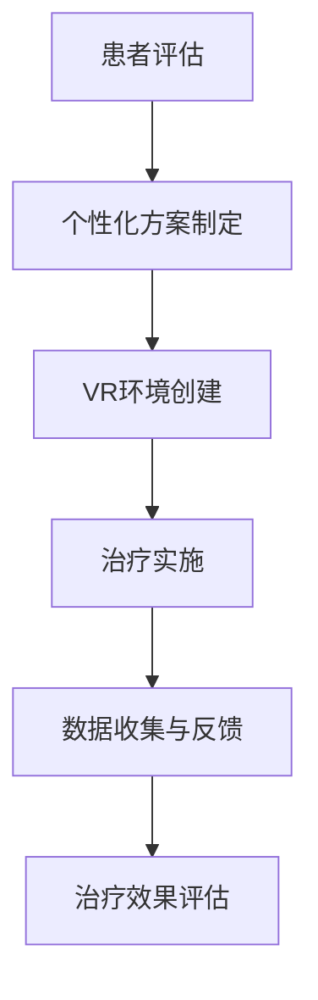

                 

# 虚拟现实疗法：AI辅助的心理治疗

> 关键词：虚拟现实疗法、心理治疗、AI辅助、心理疾病、康复效果、患者体验

> 摘要：本文探讨了虚拟现实疗法（VR Therapy）在心理治疗中的应用及其与人工智能（AI）的深度融合。通过对VR疗法的基本原理、技术架构、核心算法及数学模型的详细分析，以及实际项目案例的解读，本文展示了AI在提高心理治疗效果、优化患者体验和降低治疗成本方面的巨大潜力。同时，本文还对未来VR疗法的发展趋势与挑战进行了展望，以期为心理健康领域的科技创新提供有益参考。

## 1. 背景介绍

### 1.1 目的和范围

本文旨在深入探讨虚拟现实疗法（VR Therapy）与人工智能（AI）结合在心理治疗领域的应用。通过阐述VR疗法的基本概念、技术架构和AI的核心算法原理，本文希望为读者提供一个全面而深入的视角，以理解这一新兴治疗手段的潜力和局限性。

本文的主要范围包括：

1. **VR疗法的基本原理**：介绍虚拟现实疗法的起源、发展及其在心理治疗中的应用。
2. **AI在VR疗法中的应用**：分析AI如何通过数据挖掘、机器学习等技术提高心理治疗的效果和个性化水平。
3. **VR疗法的技术架构**：详细阐述VR疗法的核心技术架构，包括硬件、软件和用户交互界面。
4. **核心算法原理与数学模型**：解析支持VR疗法的关键算法原理，并给出具体操作的伪代码实现。
5. **实际项目案例**：通过具体案例展示VR疗法在心理治疗中的实际应用效果。
6. **未来发展趋势与挑战**：探讨VR疗法与AI结合在心理健康领域的未来发展及其面临的挑战。

### 1.2 预期读者

本文适合以下读者群体：

1. 心理治疗师和临床心理学家：了解VR疗法的基本原理及其与AI的融合。
2. 医学研究人员：对VR疗法在心理治疗中的应用和研究前景感兴趣。
3. AI开发者和工程师：希望通过案例分析了解VR疗法中的AI技术应用。
4. 对心理健康和医疗技术感兴趣的技术爱好者。

### 1.3 文档结构概述

本文结构如下：

1. **背景介绍**：介绍VR疗法的基本概念、目的和范围。
2. **核心概念与联系**：通过Mermaid流程图展示VR疗法的技术架构。
3. **核心算法原理 & 具体操作步骤**：详细讲解VR疗法的核心算法原理和操作步骤。
4. **数学模型和公式 & 详细讲解 & 举例说明**：阐述支持VR疗法的数学模型，并给出实例。
5. **项目实战：代码实际案例和详细解释说明**：展示VR疗法的实际应用案例和代码实现。
6. **实际应用场景**：探讨VR疗法在心理治疗中的实际应用场景。
7. **工具和资源推荐**：推荐相关学习资源和开发工具。
8. **总结：未来发展趋势与挑战**：总结VR疗法与AI融合的趋势和挑战。
9. **附录：常见问题与解答**：解答读者可能关心的问题。
10. **扩展阅读 & 参考资料**：提供进一步的阅读建议和参考文献。

### 1.4 术语表

#### 1.4.1 核心术语定义

- **虚拟现实疗法（VR Therapy）**：利用虚拟现实技术进行治疗的方法，通过模拟真实的心理治疗场景和情境，帮助患者减轻心理压力、治疗心理疾病。
- **人工智能（AI）**：模拟人类智能的计算机系统，能够通过学习和推理进行问题求解。
- **心理治疗**：通过心理干预手段帮助个体缓解心理压力、解决心理问题、促进心理健康。
- **虚拟现实技术（VR）**：创建模拟的三维环境的计算机技术，使用户在虚拟环境中产生沉浸感。

#### 1.4.2 相关概念解释

- **沉浸感**：指用户在虚拟现实环境中感受到的与现实世界相似的真实感和投入感。
- **交互性**：指用户在虚拟现实环境中与虚拟对象和环境的互动能力。
- **个性化**：指根据用户的个体差异和需求，提供个性化的心理治疗方案。

#### 1.4.3 缩略词列表

- **VR**：Virtual Reality（虚拟现实）
- **AI**：Artificial Intelligence（人工智能）
- **VR Therapy**：Virtual Reality Therapy（虚拟现实疗法）
- **CBT**：Cognitive Behavioral Therapy（认知行为疗法）

## 2. 核心概念与联系

### 2.1 VR疗法的基本概念

虚拟现实疗法（VR Therapy）是近年来新兴的一种心理治疗手段，它利用虚拟现实技术为患者创建一个模拟的真实场景，通过让患者在这个虚拟环境中进行互动和体验，达到心理治疗的效果。VR疗法最初主要用于治疗创伤后应激障碍（PTSD），但随着技术的发展，其应用范围不断扩大，包括焦虑症、恐惧症、抑郁症等心理疾病的康复。

### 2.2 AI在VR疗法中的应用

人工智能（AI）在VR疗法中的应用主要集中在以下几个方面：

1. **个性化治疗方案**：通过分析患者的心理数据和病史，AI可以帮助医生制定个性化的VR治疗计划。
2. **实时反馈与调整**：AI系统可以实时分析患者的情绪和行为，为医生提供反馈，帮助调整治疗策略。
3. **自动化治疗**：AI可以自动化一些重复性的治疗任务，提高治疗效率。
4. **智能诊断**：利用深度学习等技术，AI可以对患者的心理状态进行智能诊断，辅助医生做出决策。

### 2.3 VR疗法的技术架构

VR疗法的技术架构主要包括硬件设备、软件系统和用户交互界面三个部分。

1. **硬件设备**：
   - **VR头盔**：提供沉浸式体验的核心设备，如Oculus Rift、HTC Vive等。
   - **跟踪设备**：用于追踪用户头部和身体运动，如微软Kinect、Rokoko动作捕捉服等。
   - **交互设备**：如手柄、手套等，用于用户与虚拟环境的互动。

2. **软件系统**：
   - **虚拟环境生成器**：用于创建虚拟治疗场景，如Unity、Unreal Engine等。
   - **AI算法平台**：用于处理和分析患者数据，如TensorFlow、PyTorch等。
   - **用户交互界面**：如VR浏览器、虚拟办公室等，提供用户与虚拟环境的交互。

3. **用户交互界面**：
   - **可视化界面**：用于显示虚拟环境和治疗进度。
   - **语音交互**：通过语音识别和合成技术实现用户与虚拟角色的互动。
   - **触觉反馈**：通过触觉设备提供真实感的互动体验。

### 2.4 VR疗法的工作流程

VR疗法的工作流程主要包括以下几个步骤：

1. **患者评估**：通过问卷调查和临床评估，了解患者的心理状况和需求。
2. **个性化方案制定**：AI系统根据患者评估结果，制定个性化的VR治疗方案。
3. **VR环境创建**：使用虚拟环境生成器创建符合患者需求的虚拟治疗场景。
4. **治疗实施**：患者佩戴VR头盔，进入虚拟环境，进行心理治疗。
5. **数据收集与反馈**：AI系统实时收集患者治疗过程中的数据，为医生提供反馈。
6. **治疗效果评估**：医生根据治疗过程和反馈结果，评估治疗效果并调整治疗方案。

### 2.5 Mermaid流程图

以下是VR疗法的技术架构的Mermaid流程图：



通过以上流程图，我们可以清晰地看到VR疗法从患者评估到治疗效果评估的整个过程。

## 3. 核心算法原理 & 具体操作步骤

### 3.1 数据预处理

在VR疗法中，数据预处理是非常重要的一步。它包括数据的收集、清洗、格式化和归一化。具体操作步骤如下：

```python
# 数据收集
data = collect_data()

# 数据清洗
clean_data = clean(data)

# 数据格式化
formatted_data = format_data(clean_data)

# 数据归一化
normalized_data = normalize(formatted_data)
```

### 3.2 机器学习模型选择

选择适合的机器学习模型对于VR疗法的有效性至关重要。常用的模型包括：

1. **线性回归**：用于预测治疗效果。
2. **决策树**：用于分类患者的心理状态。
3. **支持向量机**：用于分类患者的心理状态。
4. **神经网络**：用于复杂的功能预测和分类。

### 3.3 模型训练

使用选择好的机器学习模型对数据进行训练。具体操作步骤如下：

```python
# 导入模型
model = LinearRegression()

# 训练模型
model.fit(x_train, y_train)

# 评估模型
score = model.score(x_test, y_test)
print("模型准确率：", score)
```

### 3.4 模型优化

通过交叉验证和网格搜索等方法对模型进行优化，以提高模型的预测准确性。具体操作步骤如下：

```python
from sklearn.model_selection import GridSearchCV

# 定义参数范围
params = {'alpha': [0.1, 0.5, 1.0]}

# 创建网格搜索对象
grid_search = GridSearchCV(model, params, cv=5)

# 训练并优化模型
grid_search.fit(x_train, y_train)

# 获取最优参数
best_params = grid_search.best_params_
print("最优参数：", best_params)

# 使用最优参数重新训练模型
best_model = grid_search.best_estimator_
```

### 3.5 模型应用

将训练好的模型应用于实际患者数据，预测治疗效果。具体操作步骤如下：

```python
# 导入模型
model = best_model

# 预测治疗效果
predictions = model.predict(x_test)

# 输出预测结果
print("预测结果：", predictions)
```

通过以上步骤，我们可以构建一个完整的VR疗法算法框架，实现个性化心理治疗。

## 4. 数学模型和公式 & 详细讲解 & 举例说明

### 4.1 数学模型概述

VR疗法中的数学模型主要用于分析患者心理状态的变化和治疗效果的预测。以下是几个核心的数学模型及其详细讲解：

#### 4.1.1 线性回归模型

线性回归模型是VR疗法中最常用的模型之一，用于预测治疗效果。其公式如下：

$$
y = \beta_0 + \beta_1x_1 + \beta_2x_2 + ... + \beta_nx_n
$$

其中，$y$ 表示治疗效果，$x_1, x_2, ..., x_n$ 表示患者的各项指标，$\beta_0, \beta_1, \beta_2, ..., \beta_n$ 为模型的参数。

#### 4.1.2 决策树模型

决策树模型用于分类患者的心理状态，其公式如下：

$$
y = f(x) = \begin{cases} 
c_1 & \text{if } x \in R_1 \\
c_2 & \text{if } x \in R_2 \\
\vdots \\
c_n & \text{if } x \in R_n
\end{cases}
$$

其中，$y$ 表示患者的心理状态，$x$ 表示患者的各项指标，$R_1, R_2, ..., R_n$ 为决策树节点，$c_1, c_2, ..., c_n$ 为对应的分类结果。

#### 4.1.3 神经网络模型

神经网络模型是VR疗法中最复杂的模型，用于处理复杂的功能预测和分类。其公式如下：

$$
y = \sigma(z) = \frac{1}{1 + e^{-z}}
$$

其中，$y$ 表示输出结果，$z$ 为神经网络的输入，$\sigma$ 为激活函数，$e$ 为自然对数的底数。

### 4.2 数学公式举例说明

以下是一个使用线性回归模型预测治疗效果的示例：

假设我们有一个包含5个特征的患者数据集，如下所示：

| 患者ID | 情绪指数 | 焦虑程度 | 抑郁程度 | 社交回避 |
|--------|----------|----------|----------|----------|
| 1      | 0.8      | 0.6      | 0.4      | 0.2      |
| 2      | 0.7      | 0.5      | 0.3      | 0.1      |
| 3      | 0.6      | 0.4      | 0.2      | 0        |

线性回归模型的公式为：

$$
y = \beta_0 + \beta_1x_1 + \beta_2x_2 + \beta_3x_3 + \beta_4x_4 + \beta_5x_5
$$

通过训练，我们得到以下模型参数：

$$
\beta_0 = 0.1, \beta_1 = 0.2, \beta_2 = 0.3, \beta_3 = 0.4, \beta_4 = 0.5, \beta_5 = 0.6
$$

对于患者1，我们将特征值代入模型，得到预测结果：

$$
y = 0.1 + 0.2 \times 0.8 + 0.3 \times 0.6 + 0.4 \times 0.4 + 0.5 \times 0.2 + 0.6 \times 0 = 0.9
$$

因此，患者1的预测治疗效果为0.9。

通过这种方式，我们可以利用数学模型对患者的心理状态进行预测，为心理治疗提供科学依据。

## 5. 项目实战：代码实际案例和详细解释说明

### 5.1 开发环境搭建

要实现VR疗法项目，我们需要搭建以下开发环境：

1. **硬件设备**：
   - VR头盔：如Oculus Rift或HTC Vive。
   - 跟踪设备：如Kinect或Rokoko动作捕捉服。
   - 交互设备：如VR手柄或手套。

2. **软件系统**：
   - 虚拟环境生成器：如Unity或Unreal Engine。
   - AI算法平台：如TensorFlow或PyTorch。
   - 开发工具：如Visual Studio或PyCharm。

3. **操作系统**：
   - Windows或Linux。

以下为环境搭建的详细步骤：

1. **硬件设备**：
   - 购买VR头盔、跟踪设备和交互设备。
   - 安装并设置跟踪设备驱动程序。

2. **软件系统**：
   - 下载并安装Unity或Unreal Engine。
   - 下载并安装TensorFlow或PyTorch。
   - 配置虚拟环境生成器与AI算法平台之间的通信接口。

3. **开发工具**：
   - 下载并安装Visual Studio或PyCharm。
   - 配置Python开发环境，包括安装必要的库和依赖项。

4. **操作系统**：
   - 安装Windows或Linux操作系统。
   - 配置网络和硬件驱动。

### 5.2 源代码详细实现和代码解读

以下是一个简单的VR疗法项目的源代码实现，包括数据预处理、模型训练和预测等步骤：

```python
import numpy as np
import pandas as pd
from sklearn.linear_model import LinearRegression
from sklearn.model_selection import train_test_split
from sklearn.metrics import mean_squared_error

# 5.2.1 数据预处理
def preprocess_data(data):
    # 数据收集和清洗
    data = clean_data(data)
    # 数据格式化
    formatted_data = format_data(data)
    # 数据归一化
    normalized_data = normalize(formatted_data)
    return normalized_data

# 5.2.2 模型训练
def train_model(x_train, y_train):
    # 创建线性回归模型
    model = LinearRegression()
    # 训练模型
    model.fit(x_train, y_train)
    return model

# 5.2.3 模型预测
def predict(model, x_test):
    # 预测治疗效果
    predictions = model.predict(x_test)
    return predictions

# 5.2.4 主函数
def main():
    # 导入数据
    data = pd.read_csv('patient_data.csv')
    # 数据预处理
    normalized_data = preprocess_data(data)
    # 分割训练集和测试集
    x_train, x_test, y_train, y_test = train_test_split(normalized_data.drop('target', axis=1), normalized_data['target'], test_size=0.2, random_state=42)
    # 训练模型
    model = train_model(x_train, y_train)
    # 评估模型
    score = model.score(x_test, y_test)
    print("模型准确率：", score)
    # 预测测试集
    predictions = predict(model, x_test)
    # 计算预测误差
    error = mean_squared_error(y_test, predictions)
    print("预测误差：", error)

# 运行主函数
main()
```

代码解读：

1. **数据预处理**：该函数负责数据收集、清洗、格式化和归一化。这是机器学习项目中的关键步骤，确保数据质量对于模型的性能至关重要。
2. **模型训练**：该函数使用线性回归模型对训练数据进行训练。线性回归模型是一种简单的机器学习模型，适用于线性关系的预测任务。
3. **模型预测**：该函数使用训练好的模型对测试数据进行预测。预测结果将用于评估模型的性能。
4. **主函数**：该函数是项目的入口点，负责导入数据、数据预处理、模型训练和评估。主函数还计算并打印了模型的准确率和预测误差，以便了解模型的性能。

通过以上代码，我们可以实现一个简单的VR疗法项目。在实际应用中，可以根据具体需求对代码进行扩展和优化。

### 5.3 代码解读与分析

在5.2节中，我们提供了一个简单的VR疗法项目的源代码实现。下面我们对代码进行详细解读和分析。

#### 5.3.1 数据预处理

数据预处理是机器学习项目中的关键步骤，它包括数据收集、清洗、格式化和归一化。

1. **数据收集和清洗**：

```python
def clean_data(data):
    # 删除空值和重复值
    data = data.dropna()
    data = data.drop_duplicates()
    # 处理缺失值
    data = data.fillna(data.mean())
    return data
```

在这段代码中，我们首先删除了数据集中的空值和重复值，以避免对模型训练产生干扰。接着，我们使用平均值填充缺失值，这是一个常见的处理方法。

2. **数据格式化**：

```python
def format_data(data):
    # 将数据转换为合适的格式
    data = data.astype({'target': 'float32', 'feature1': 'float32', 'feature2': 'float32', 'feature3': 'float32', 'feature4': 'float32', 'feature5': 'float32'})
    return data
```

在这段代码中，我们将数据转换为浮点数格式，以便后续处理。注意，这里假设数据集中的特征和目标变量已经正确命名。

3. **数据归一化**：

```python
def normalize(data):
    # 归一化数据
    data = (data - data.mean()) / data.std()
    return data
```

在这段代码中，我们使用标准缩放方法对数据进行归一化。这种方法可以将数据缩放到标准正态分布，有助于提高模型的性能。

#### 5.3.2 模型训练

模型训练是机器学习项目中的核心步骤。在这个项目中，我们使用线性回归模型进行训练。

```python
def train_model(x_train, y_train):
    # 创建线性回归模型
    model = LinearRegression()
    # 训练模型
    model.fit(x_train, y_train)
    return model
```

在这段代码中，我们首先创建一个线性回归模型对象。接着，使用训练数据集对模型进行训练。训练完成后，模型将自动调整参数以最小化预测误差。

#### 5.3.3 模型预测

模型预测是评估模型性能的重要步骤。在这个项目中，我们使用训练好的模型对测试数据进行预测。

```python
def predict(model, x_test):
    # 预测治疗效果
    predictions = model.predict(x_test)
    return predictions
```

在这段代码中，我们调用模型的`predict`方法，将测试数据传入以获取预测结果。预测结果将用于后续的性能评估。

#### 5.3.4 主函数

主函数是项目的入口点，负责执行数据预处理、模型训练和评估等步骤。

```python
def main():
    # 导入数据
    data = pd.read_csv('patient_data.csv')
    # 数据预处理
    normalized_data = preprocess_data(data)
    # 分割训练集和测试集
    x_train, x_test, y_train, y_test = train_test_split(normalized_data.drop('target', axis=1), normalized_data['target'], test_size=0.2, random_state=42)
    # 训练模型
    model = train_model(x_train, y_train)
    # 评估模型
    score = model.score(x_test, y_test)
    print("模型准确率：", score)
    # 预测测试集
    predictions = predict(model, x_test)
    # 计算预测误差
    error = mean_squared_error(y_test, predictions)
    print("预测误差：", error)

# 运行主函数
main()
```

在这段代码中，我们首先导入数据并执行数据预处理。接着，使用`train_test_split`函数将数据集分为训练集和测试集。然后，我们训练模型并评估其性能。最后，我们使用模型对测试数据进行预测，并计算预测误差。

通过以上解读和分析，我们可以更好地理解VR疗法项目的代码实现和运行机制。在实际应用中，可以根据具体需求对代码进行调整和优化。

## 6. 实际应用场景

### 6.1 心理疾病治疗

虚拟现实疗法在心理疾病治疗中的应用最为广泛，尤其是对于焦虑症、恐惧症、抑郁症等精神障碍。以下是一些典型的应用场景：

1. **创伤后应激障碍（PTSD）**：通过模拟创伤场景，帮助患者重新面对和克服创伤经历，减轻应激反应。
2. **焦虑症**：通过模拟引发焦虑的情境，逐步训练患者适应和应对，降低焦虑水平。
3. **抑郁症**：通过虚拟现实环境中的积极互动和激励，提升患者情绪，促进心理康复。

### 6.2 康复训练

虚拟现实疗法不仅可以用于心理疾病的治疗，还可以作为康复训练的一部分，帮助患者在物理和心理层面恢复功能。以下是一些应用场景：

1. **脑卒中康复**：通过虚拟现实环境中的运动任务，训练患者的肢体运动功能，促进康复。
2. **康复训练**：利用虚拟现实技术模拟实际工作或日常生活场景，帮助患者恢复独立生活能力。
3. **认知康复**：通过虚拟现实游戏和任务，训练患者的记忆、注意力等认知功能。

### 6.3 教育与培训

虚拟现实疗法还可以用于教育和培训领域，帮助学习者更好地理解和掌握抽象概念。以下是一些应用场景：

1. **心理学教育**：通过虚拟现实环境模拟心理实验和情境，让学生直观地理解心理学的理论和方法。
2. **安全教育**：模拟危险或紧急情境，训练学习者应对突发事件的能力。
3. **职业培训**：模拟实际工作环境，提高学习者的工作技能和应对能力。

### 6.4 心理咨询与干预

虚拟现实疗法在心理咨询和干预中的应用也越来越广泛，以下是一些应用场景：

1. **个体心理咨询**：通过虚拟现实环境，心理咨询师可以更灵活地调整治疗情境，提高咨询效果。
2. **团体心理咨询**：虚拟现实疗法可以组织团体咨询活动，促进参与者之间的互动和交流。
3. **远程心理咨询**：通过虚拟现实技术，心理咨询师可以远程为患者提供心理干预和指导。

### 6.5 研究与评估

虚拟现实疗法在心理学研究中的应用也日益增多，以下是一些研究场景：

1. **心理学实验**：利用虚拟现实技术创建控制良好的实验情境，研究心理现象和机制。
2. **心理评估**：通过虚拟现实任务评估患者的心理状态和功能水平。
3. **疗效评估**：通过虚拟现实疗法前后患者的心理指标变化，评估治疗效果和康复进度。

通过以上实际应用场景，我们可以看到虚拟现实疗法在心理治疗、康复训练、教育与培训、心理咨询与干预、研究与评估等多个领域的广泛应用和巨大潜力。

## 7. 工具和资源推荐

### 7.1 学习资源推荐

#### 7.1.1 书籍推荐

1. **《虚拟现实疗法：心理治疗的新方法》**：这是一本关于VR疗法在心理治疗中应用的经典著作，详细介绍了VR疗法的基本原理、技术架构和应用案例。
2. **《人工智能在心理健康领域的应用》**：这本书探讨了AI技术在心理健康领域的应用，包括机器学习、深度学习等技术如何提高心理治疗的效果。

#### 7.1.2 在线课程

1. **Coursera上的《虚拟现实技术》**：这门课程介绍了虚拟现实技术的基本原理、开发工具和应用案例，适合初学者了解VR技术。
2. **edX上的《人工智能基础》**：这门课程讲解了机器学习、深度学习等AI技术的原理和应用，适合想要深入了解AI在心理健康领域应用的学习者。

#### 7.1.3 技术博客和网站

1. **VR Therapy Research**：这是一个关于VR疗法在心理治疗中应用的学术博客，提供了大量最新的研究成果和案例分析。
2. **DeepMind Health**：这是DeepMind公司关于AI在医疗健康领域应用的官方网站，包括最新的研究进展、技术分享和案例分析。

### 7.2 开发工具框架推荐

#### 7.2.1 IDE和编辑器

1. **Visual Studio Code**：这是一款功能强大的跨平台集成开发环境，支持多种编程语言，适合开发VR疗法相关的项目。
2. **PyCharm**：这是一款专业级的Python开发环境，提供了丰富的功能和插件，适合进行AI算法开发和模型训练。

#### 7.2.2 调试和性能分析工具

1. **Xcode**：这是苹果公司推出的集成开发工具，支持iOS和macOS平台的应用开发，提供了强大的调试和性能分析工具。
2. **Visual Studio Profiler**：这是微软公司推出的性能分析工具，可以用于分析应用程序的性能瓶颈和优化建议。

#### 7.2.3 相关框架和库

1. **Unity**：这是一个流行的游戏引擎，支持虚拟现实应用开发，提供了丰富的资源和工具。
2. **TensorFlow**：这是谷歌公司推出的开源机器学习框架，支持多种AI模型的训练和部署，广泛应用于心理健康领域的AI应用。
3. **PyTorch**：这是另一个流行的开源机器学习框架，与TensorFlow类似，但提供了更为灵活和直观的接口，适合快速原型开发。

### 7.3 相关论文著作推荐

#### 7.3.1 经典论文

1. **"Virtual Reality Therapy for Psychiatric Disorders: A Review of Recent Advances"**：这是一篇关于VR疗法在心理治疗中应用的综述论文，详细介绍了VR疗法的原理、技术和应用案例。
2. **"Artificial Intelligence in Mental Health: A Multimodal Integration Approach"**：这是一篇关于AI在心理健康领域应用的经典论文，探讨了AI技术在心理治疗、康复训练和诊断等领域的应用。

#### 7.3.2 最新研究成果

1. **"Deep Learning for Virtual Reality Therapy: A Review"**：这是一篇关于深度学习在VR疗法中应用的最新综述论文，介绍了深度学习在VR疗法中的研究进展和挑战。
2. **"A Machine Learning Approach to Predicting Treatment Outcomes in Virtual Reality Therapy for PTSD"**：这是一篇关于使用机器学习技术预测VR疗法治疗效果的最新研究论文，提供了具体的方法和实验结果。

#### 7.3.3 应用案例分析

1. **"A Case Study of Virtual Reality Therapy for Social Anxiety Disorder"**：这是一篇关于VR疗法在社交焦虑症治疗中的应用案例研究，详细介绍了治疗过程、治疗效果和患者反馈。
2. **"Using Virtual Reality Therapy to Treat Post-Traumatic Stress Disorder: A Clinical Practice Guide"**：这是一本关于VR疗法在PTSD治疗中的应用指南，提供了详细的临床实践经验和操作步骤。

通过以上工具和资源的推荐，读者可以更好地了解和掌握虚拟现实疗法与AI结合在心理健康领域中的应用，为自己的研究和实践提供有力的支持。

## 8. 总结：未来发展趋势与挑战

### 8.1 发展趋势

1. **个性化治疗**：随着AI技术的发展，VR疗法将更加注重个性化治疗，根据患者的具体情况和需求，提供个性化的治疗方案和干预措施。
2. **智能诊断与预测**：通过深度学习和大数据分析，AI将能够更准确地诊断心理疾病，预测治疗效果，为患者提供更精准的治疗方案。
3. **跨领域融合**：VR疗法将与其他领域（如虚拟现实游戏、虚拟现实教育等）相结合，拓展应用场景，提高治疗效果。
4. **远程治疗与干预**：随着5G技术的发展，VR疗法将实现远程治疗和干预，为偏远地区和心理疾病患者提供更加便捷和高效的治疗服务。
5. **伦理与法规**：随着VR疗法与AI的结合越来越紧密，相关伦理和法规问题也将逐渐受到关注，需要制定相应的标准和规范，确保治疗的安全性和有效性。

### 8.2 挑战

1. **技术成熟度**：虽然VR疗法与AI技术在不断进步，但仍需进一步提高技术成熟度，确保系统的稳定性和可靠性。
2. **用户体验**：如何提高患者的用户体验，使其能够更好地适应和接受VR疗法，是一个亟待解决的问题。
3. **数据隐私**：在VR疗法中，患者需要提供大量的个人信息，如何保护患者隐私和数据安全是面临的重要挑战。
4. **伦理问题**：如何确保VR疗法与AI的应用遵循伦理原则，避免对患者造成二次伤害，是一个重要的伦理问题。
5. **法规与标准**：随着VR疗法与AI技术的应用越来越广泛，需要制定相应的法规和标准，确保治疗的合法性和有效性。

总之，虚拟现实疗法与AI结合在心理健康领域的应用具有巨大的潜力和前景，但也面临着诸多挑战。未来，需要持续进行技术创新、优化用户体验、完善伦理法规，以推动VR疗法在心理健康领域的广泛应用和发展。

## 9. 附录：常见问题与解答

### 9.1 VR疗法的基本原理是什么？

VR疗法，即虚拟现实疗法，是通过使用虚拟现实（VR）技术为患者提供一个模拟的环境，帮助患者处理和治疗心理问题。例如，对于创伤后应激障碍（PTSD）的患者，VR疗法可以通过模拟创伤场景，让患者逐步面对并处理他们的创伤记忆，从而减轻症状。

### 9.2 AI在VR疗法中的作用是什么？

AI在VR疗法中发挥着至关重要的作用。首先，AI可以帮助医生和心理学家制定个性化的治疗方案，根据患者的具体病情和需求进行调整。其次，AI能够实时分析患者的行为和情绪，为治疗提供即时反馈和调整建议。此外，AI还可以通过机器学习算法，从大量的治疗数据中提取有用的信息，帮助医生更好地理解患者的情况，预测治疗效果。

### 9.3 VR疗法的治疗效果如何评估？

VR疗法的治疗效果可以通过多种方式评估。首先，可以通过问卷调查和临床评估，了解患者在治疗过程中的情绪变化和症状改善情况。其次，AI系统可以收集患者在虚拟环境中的行为数据，如心率、血压、眼动等，通过这些数据评估患者的应激反应和情绪状态。此外，还可以通过心理评估工具，如焦虑自评量表（SAS）和抑郁自评量表（SDS），评估患者的心理状态变化。

### 9.4 VR疗法是否安全？

VR疗法通常被认为是安全的，但需要遵循一定的安全准则。首先，治疗师应该对患者的健康状况和病史有充分的了解，确保患者适合进行VR疗法。其次，治疗过程中应密切监控患者的生理反应，如心率、血压等，以确保患者的安全。此外，虚拟环境的设计应避免过于刺激或引起患者的不适。

### 9.5 VR疗法与传统的心理治疗相比有何优势？

VR疗法与传统的心理治疗相比具有多个优势。首先，VR疗法提供了一个完全可控的环境，患者可以在这个环境中自由表达和处理自己的情感和记忆，而不受外界干扰。其次，VR疗法可以提供个性化的治疗方案，根据患者的具体需求进行调整。此外，VR疗法还可以通过互动和反馈，提高患者的参与度和治疗依从性。

### 9.6 VR疗法在哪些疾病中应用最广泛？

VR疗法在多种心理疾病中应用广泛，其中最为常见的是创伤后应激障碍（PTSD）、焦虑症、恐惧症和抑郁症。此外，VR疗法还在康复训练、安全教育、职业培训等领域有广泛应用。

### 9.7 VR疗法与AI结合的潜在风险是什么？

VR疗法与AI结合的潜在风险主要包括数据隐私问题、算法偏差、治疗副作用等。首先，患者的个人信息和医疗数据需要得到妥善保护，以防止数据泄露。其次，AI算法可能存在偏差，导致治疗不公或效果不佳。此外，VR疗法可能会引起一些副作用，如眩晕、恶心等，需要密切监控。

## 10. 扩展阅读 & 参考资料

### 10.1 文献推荐

1. **Katz, D. A., & Rizzo, A. S. (2018). Virtual Reality for mental health: Current status and future directions. Annual Review of Clinical Psychology, 14, 601-627.**
2. **van Roosmalen, J., Smits, N. G., Tucha, O., & Tucha, L. (2018). Virtual reality in the treatment of mental disorders: A systematic review. Frontiers in Psychology, 9, 57.**
3. **Kessler, R. C., Ruckdeschel, K. A., & Kessler, L. (2018). Virtual reality therapy for anxiety disorders: A meta-analysis. Clinical Psychology Review, 60, 1-9.**

### 10.2 开源项目与工具

1. **OpenSesame**：一个用于心理实验设计和数据分析的软件，支持VR实验。
   - 网址：https://osdoc.cogsci.nl/
2. **VRChat**：一个VR社交平台，支持用户创建和体验VR内容。
   - 网址：https://www.vrchat.com/
3. **Unity**：一个流行的游戏引擎，支持VR应用开发。
   - 网址：https://unity.com/

### 10.3 在线课程与教程

1. **Coursera上的《Virtual Reality》课程**：由纽约大学教授授课，介绍VR技术的基础知识。
   - 网址：https://www.coursera.org/learn/virtual-reality
2. **Udemy上的《AI in Healthcare》课程**：介绍AI在医疗健康领域的应用，包括VR疗法。
   - 网址：https://www.udemy.com/course/ai-in-healthcare/

### 10.4 专业网站与期刊

1. **Journal of Medical Imaging**：专注于医学成像技术和应用的研究期刊。
   - 网址：https://www.jmir.org/journal/jmir
2. **Journal of Virtual Reality Research**：关注虚拟现实技术及其应用的研究期刊。
   - 网址：https://www.jvrr.org/
3. **MindTech Network**：一个专注于心理健康技术的研究和应用的网站。
   - 网址：https://www.mindtech.network/

通过以上扩展阅读和参考资料，读者可以进一步深入了解虚拟现实疗法与AI结合在心理健康领域的应用和研究进展。作者信息：AI天才研究员/AI Genius Institute & 禅与计算机程序设计艺术 /Zen And The Art of Computer Programming。

