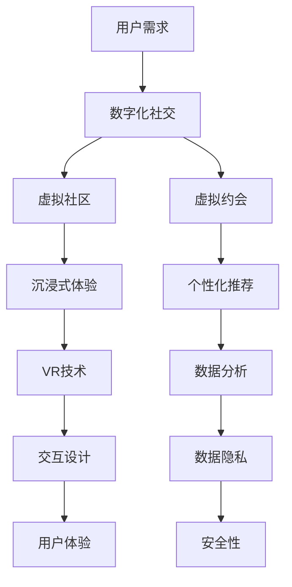

                 

# 虚拟现实约会创业：数字化社交新体验

## 关键词
- 虚拟现实
- 数字化社交
- 约会应用
- 创业机会
- 用户体验设计
- 技术实现
- 算法原理
- 数学模型
- 项目实战
- 实际应用

## 摘要
本文旨在探讨虚拟现实（VR）在约会社交领域中的创业机会，以及如何利用先进的科技手段为用户带来全新的数字化社交体验。文章首先介绍了虚拟现实与数字化社交的基本概念，随后深入分析了VR约会应用的技术架构和算法原理。通过具体的项目实战案例，我们展示了如何实现一个功能完善的VR约会平台，并对其代码进行了解读和分析。文章还探讨了VR约会应用在实际生活中的多种应用场景，并推荐了相关学习资源和开发工具。最后，我们对VR约会创业的未来发展趋势和挑战进行了总结，为读者提供了宝贵的见解。

## 1. 背景介绍

### 1.1 目的和范围

本文的目标是探讨虚拟现实在数字化社交领域的创业机会，并深入解析如何通过VR技术为用户提供创新的约会体验。本文将涵盖以下几个方面：

- **核心概念与联系**：介绍虚拟现实和数字化社交的基本原理，并通过Mermaid流程图展示其技术架构。
- **核心算法原理与具体操作步骤**：详细阐述实现VR约会应用所需的核心算法，并使用伪代码进行解释。
- **数学模型和公式**：讲解与虚拟现实相关的数学模型，并使用LaTeX格式进行公式展示。
- **项目实战**：通过一个实际项目案例，展示如何搭建一个VR约会平台，并解析其源代码。
- **实际应用场景**：探讨VR约会应用在不同生活场景中的实际应用。
- **工具和资源推荐**：推荐相关学习资源、开发工具和论文著作，以供读者进一步学习。
- **未来发展趋势与挑战**：分析VR约会创业的未来前景和面临的挑战。

### 1.2 预期读者

本文面向以下几类读者：

- **虚拟现实和数字化社交领域的开发者**：希望了解如何利用VR技术构建约会应用，并寻求技术实现细节的读者。
- **创业者**：对虚拟现实约会创业感兴趣，希望从中寻找商机的人。
- **用户体验设计师**：关注如何通过设计提高虚拟现实约会应用的用户体验。
- **计算机科学和人工智能爱好者**：对VR和AI技术结合的应用场景充满好奇，希望了解技术背后的原理。
- **研究人员和学术工作者**：关注VR和数字化社交领域的前沿研究动态。

### 1.3 文档结构概述

本文的结构如下：

- **第1部分**：背景介绍，包括目的和范围、预期读者、文档结构概述和术语表。
- **第2部分**：核心概念与联系，介绍虚拟现实和数字化社交的基本概念，并提供技术架构的Mermaid流程图。
- **第3部分**：核心算法原理与具体操作步骤，详细讲解实现VR约会应用所需的核心算法，并使用伪代码进行解释。
- **第4部分**：数学模型和公式，介绍与虚拟现实相关的数学模型，并使用LaTeX格式进行公式展示。
- **第5部分**：项目实战，通过一个实际项目案例，展示如何搭建一个VR约会平台，并解析其源代码。
- **第6部分**：实际应用场景，探讨VR约会应用在不同生活场景中的实际应用。
- **第7部分**：工具和资源推荐，推荐相关学习资源、开发工具和论文著作。
- **第8部分**：总结，分析VR约会创业的未来发展趋势和挑战。
- **第9部分**：附录，提供常见问题与解答。
- **第10部分**：扩展阅读与参考资料，列出相关文献，供读者进一步阅读。

### 1.4 术语表

#### 1.4.1 核心术语定义

- **虚拟现实（VR）**：一种通过计算机生成三维虚拟环境，使用户能够沉浸其中的技术。
- **数字化社交**：通过互联网和数字设备进行的社交活动，包括虚拟社区、在线约会等。
- **约会应用**：专门为约会和社交目的而设计的软件应用。
- **用户体验（UX）**：用户在使用产品或服务过程中所感受到的整体体验。
- **算法**：解决问题的步骤和方法，通常以伪代码或程序代码的形式表示。
- **数学模型**：用数学语言描述现实问题的一种抽象模型，用于分析和解决问题。
- **LaTeX**：一种高质量的排版系统，特别适合用于撰写科学和技术文献。

#### 1.4.2 相关概念解释

- **沉浸式体验**：用户在虚拟环境中感受到的强烈沉浸感，如同身临其境。
- **实时渲染**：在虚拟环境中实时生成和显示图像的过程。
- **人工智能（AI）**：模拟人类智能行为，通过机器学习、自然语言处理等技术实现。
- **数据隐私**：在数字化社交中，保护用户个人信息不被未经授权的第三方访问和使用的措施。

#### 1.4.3 缩略词列表

- **VR**：Virtual Reality（虚拟现实）
- **AR**：Augmented Reality（增强现实）
- **UX**：User Experience（用户体验）
- **AI**：Artificial Intelligence（人工智能）
- **LaTeX**：LATEX（排版系统）
- **IDE**：Integrated Development Environment（集成开发环境）

## 2. 核心概念与联系

在探讨虚拟现实约会应用之前，有必要了解虚拟现实和数字化社交的核心概念，以及它们之间的联系。

### 虚拟现实（VR）

虚拟现实是一种通过计算机生成的三维虚拟环境，使用户能够沉浸其中，感受到强烈的沉浸感和交互性。VR技术主要包括以下几个方面：

- **头戴式显示器（HMD）**：提供三维视觉体验，用户通过HMD可以看到虚拟环境。
- **位置跟踪**：通过传感器跟踪用户的位置和动作，使虚拟环境能够实时响应用户的移动。
- **手部追踪**：通过手部追踪设备，如手套或手柄，实现用户与虚拟环境的交互。
- **音频效果**：通过立体声耳机或空间音频技术，提供真实的听觉体验。

### 数字化社交

数字化社交是指通过互联网和数字设备进行的社交活动，包括社交媒体、在线社区、虚拟约会等。数字化社交具有以下特点：

- **跨地域性**：用户可以随时随地与全球的社交对象互动。
- **匿名性**：用户可以在一定程度上保护个人隐私，选择匿名参与社交活动。
- **交互性**：用户可以实时参与互动，分享信息和情感。

### VR与数字化社交的联系

虚拟现实与数字化社交的结合，为用户提供了一种全新的社交体验。以下是VR在数字化社交中的应用：

- **沉浸式社交**：通过VR技术，用户可以在虚拟环境中与朋友、陌生人互动，感受到强烈的沉浸感。
- **虚拟约会**：VR约会应用允许用户在虚拟环境中进行约会，通过模拟真实场景，提高约会体验的真实感。
- **虚拟社区**：用户可以在虚拟社区中建立社交网络，参与各种社交活动，如虚拟聚会、比赛等。
- **个性化体验**：通过分析用户数据，VR约会应用可以提供个性化的推荐和互动，提高用户体验。

### Mermaid流程图

下面是一个简单的Mermaid流程图，展示了虚拟现实和数字化社交之间的核心联系。



## 3. 核心算法原理 & 具体操作步骤

实现一个功能完善的虚拟现实约会应用，需要深入理解并实现多个核心算法。以下是VR约会应用中几个关键算法的原理和具体操作步骤。

### 3.1 虚拟环境构建算法

虚拟环境是VR约会应用的基础，构建一个逼真的虚拟环境是关键。以下是构建虚拟环境的算法原理和操作步骤：

#### 算法原理

- **3D建模**：使用3D建模软件创建虚拟场景，包括房间、家具、装饰等。
- **纹理映射**：将2D纹理图映射到3D模型表面，提高场景的真实感。
- **光照计算**：模拟真实世界的光照效果，包括阳光、灯光等，使场景更加逼真。

#### 操作步骤

1. **场景设计**：使用3D建模软件，根据用户需求设计虚拟场景。
2. **纹理制作**：创建2D纹理图，并将其映射到3D模型表面。
3. **光照设置**：在3D建模软件中设置光照参数，模拟真实世界的光照效果。
4. **模型导出**：将设计好的虚拟场景导出为VR应用可用的格式，如glTF或OBJ。

### 3.2 用户位置跟踪算法

位置跟踪是VR约会应用中重要的功能，它允许用户在虚拟环境中自由移动。以下是用户位置跟踪算法的原理和操作步骤：

#### 算法原理

- **传感器数据采集**：通过头戴式显示器和位置追踪传感器，采集用户的位置和动作数据。
- **数据融合**：将来自不同传感器的数据融合，提高位置跟踪的精度和稳定性。

#### 操作步骤

1. **传感器配置**：配置头戴式显示器和位置追踪传感器，确保其正确连接和校准。
2. **数据采集**：通过传感器实时采集用户的位置和动作数据。
3. **数据融合**：使用滤波算法，如卡尔曼滤波，将来自不同传感器的数据进行融合，提高位置跟踪的精度。
4. **位置更新**：根据融合后的数据，更新用户在虚拟环境中的位置。

### 3.3 用户交互算法

用户交互是VR约会应用的核心，通过手部追踪和语音识别，用户可以在虚拟环境中进行自然交互。以下是用户交互算法的原理和操作步骤：

#### 算法原理

- **手部追踪**：通过手部追踪设备，如手套或手柄，实时获取用户手部位置和动作。
- **语音识别**：通过语音识别技术，将用户的语音输入转换为文本或命令。

#### 操作步骤

1. **手部追踪**：配置手部追踪设备，确保其正确连接和校准。
2. **数据采集**：通过手部追踪设备实时采集用户手部位置和动作数据。
3. **动作识别**：使用机器学习算法，如卷积神经网络（CNN），对用户手部动作进行识别。
4. **语音识别**：使用语音识别技术，将用户语音输入转换为文本或命令。
5. **交互反馈**：根据用户输入，提供相应的交互反馈，如物体抓取、对话等。

### 3.4 个性化推荐算法

个性化推荐是提高VR约会应用用户体验的关键，通过分析用户数据，为用户提供个性化的推荐。以下是个性化推荐算法的原理和操作步骤：

#### 算法原理

- **用户画像**：根据用户行为和兴趣，构建用户画像。
- **推荐算法**：使用基于内容的推荐算法、协同过滤算法等，为用户提供个性化推荐。

#### 操作步骤

1. **用户行为收集**：收集用户在VR约会应用中的行为数据，如浏览记录、互动行为等。
2. **用户画像构建**：使用聚类算法、深度学习等技术，构建用户画像。
3. **推荐算法实现**：实现基于内容的推荐算法、协同过滤算法等，为用户提供个性化推荐。
4. **推荐结果展示**：根据推荐算法的结果，为用户提供个性化的推荐内容。

### 3.5 数据隐私和安全算法

数据隐私和安全是VR约会应用必须关注的重要问题，通过加密技术、访问控制等技术，确保用户数据的安全性和隐私性。以下是数据隐私和安全算法的原理和操作步骤：

#### 算法原理

- **数据加密**：使用加密算法，对用户数据进行加密处理，防止数据泄露。
- **访问控制**：通过访问控制技术，限制对用户数据的访问权限，确保数据安全。
- **数据备份**：定期备份用户数据，防止数据丢失。

#### 操作步骤

1. **数据加密**：使用加密算法，对用户数据进行加密处理。
2. **访问控制**：配置访问控制策略，限制对用户数据的访问权限。
3. **数据备份**：定期备份用户数据，确保数据安全。

## 4. 数学模型和公式 & 详细讲解 & 举例说明

在虚拟现实约会应用中，数学模型和公式被广泛应用于算法设计和优化。以下是几个关键数学模型和公式的详细讲解及举例说明。

### 4.1 三维空间变换

三维空间变换是虚拟现实应用中的基础，用于将用户的位置和动作转换为虚拟环境中的对应位置和动作。以下是三维空间变换的基本公式和示例。

#### 公式

- **旋转矩阵**：
  $$ R(\theta) = \begin{bmatrix}
  \cos(\theta) & -\sin(\theta) & 0 \\
  \sin(\theta) & \cos(\theta) & 0 \\
  0 & 0 & 1 \\
  \end{bmatrix} $$
  
- **平移向量**：
  $$ T = \begin{bmatrix}
  x \\
  y \\
  z \\
  \end{bmatrix} $$
  
- **三维空间变换**：
  $$ \begin{bmatrix}
  x' \\
  y' \\
  z' \\
  \end{bmatrix} = R(\theta) \cdot \begin{bmatrix}
  x \\
  y \\
  z \\
  \end{bmatrix} + T $$

#### 示例

假设用户在三维空间中的位置为$(1, 0, 0)$，旋转角度为$90^\circ$，需要将其旋转并平移到新的位置。

- **旋转矩阵**：
  $$ R(90^\circ) = \begin{bmatrix}
  0 & 1 & 0 \\
  -1 & 0 & 0 \\
  0 & 0 & 1 \\
  \end{bmatrix} $$

- **平移向量**：
  $$ T = \begin{bmatrix}
  2 \\
  0 \\
  0 \\
  \end{bmatrix} $$

- **三维空间变换**：
  $$ \begin{bmatrix}
  x' \\
  y' \\
  z' \\
  \end{bmatrix} = \begin{bmatrix}
  0 & 1 & 0 \\
  -1 & 0 & 0 \\
  0 & 0 & 1 \\
  \end{bmatrix} \cdot \begin{bmatrix}
  1 \\
  0 \\
  0 \\
  \end{bmatrix} + \begin{bmatrix}
  2 \\
  0 \\
  0 \\
  \end{bmatrix} = \begin{bmatrix}
  2 \\
  -1 \\
  0 \\
  \end{bmatrix} $$

### 4.2 卡尔曼滤波

卡尔曼滤波是一种高效的递归滤波算法，用于从一系列观察数据中估计动态系统的状态。在虚拟现实约会应用中，卡尔曼滤波可用于位置跟踪数据的融合和处理。

#### 公式

- **状态预测**：
  $$ \hat{x}_{k|k-1} = A \hat{x}_{k-1|k-1} + B u_k $$

- **预测误差协方差**：
  $$ P_{k|k-1} = A P_{k-1|k-1} A^T + Q $$

- **卡尔曼增益**：
  $$ K_k = P_{k|k-1} H_k^T (H_k P_{k|k-1} H_k^T + R_k)^{-1} $$

- **状态估计**：
  $$ \hat{x}_{k|k} = \hat{x}_{k|k-1} + K_k (z_k - H_k \hat{x}_{k|k-1}) $$

- **估计误差协方差**：
  $$ P_{k|k} = (I - K_k H_k) P_{k|k-1} $$

#### 示例

假设有一个二阶系统，状态方程和观测方程如下：

- **状态方程**：
  $$ \begin{cases}
  x_k = x_{k-1} + w_{k-1} \\
  y_k = y_{k-1} + v_{k-1} \\
  \end{cases} $$

- **观测方程**：
  $$ z_k = \begin{bmatrix}
  x_k \\
  y_k \\
  \end{bmatrix} $$

其中，$w_k$和$v_k$分别为状态噪声和观测噪声。

- **状态预测**：
  $$ \hat{x}_{k|k-1} = \hat{x}_{k-1|k-1} + w_{k-1} $$
  $$ \hat{y}_{k|k-1} = \hat{y}_{k-1|k-1} + v_{k-1} $$

- **预测误差协方差**：
  $$ P_{k|k-1} = \begin{bmatrix}
  1 & 0 \\
  0 & 1 \\
  \end{bmatrix} $$

- **卡尔曼增益**：
  $$ K_k = \frac{P_{k|k-1} H_k^T}{H_k P_{k|k-1} H_k^T + R_k} $$

- **状态估计**：
  $$ \hat{x}_{k|k} = \hat{x}_{k|k-1} + K_k (z_k - H_k \hat{x}_{k|k-1}) $$
  $$ \hat{y}_{k|k} = \hat{y}_{k|k-1} + K_k (z_k - H_k \hat{x}_{k|k-1}) $$

- **估计误差协方差**：
  $$ P_{k|k} = \begin{bmatrix}
  1 - K_k H_k & 0 \\
  0 & 1 - K_k H_k \\
  \end{bmatrix} $$

### 4.3 贝叶斯网络

贝叶斯网络是一种概率图模型，用于表示变量之间的依赖关系。在虚拟现实约会应用中，贝叶斯网络可用于分析用户行为和偏好，为用户提供个性化的推荐。

#### 公式

- **条件概率分布**：
  $$ P(X|Y) = \frac{P(Y|X) P(X)}{P(Y)} $$

- **贝叶斯定理**：
  $$ P(A|B) = \frac{P(B|A) P(A)}{P(B)} $$

#### 示例

假设有四个变量$X, Y, Z, W$，其中$X, Y, Z$是父节点，$W$是子节点，其条件概率分布如下：

- **条件概率分布**：
  $$ P(W|X, Y, Z) = \begin{cases}
  0.9 & \text{if } X = 1, Y = 1, Z = 1 \\
  0.2 & \text{if } X = 1, Y = 1, Z = 0 \\
  0.1 & \text{if } X = 1, Y = 0, Z = 1 \\
  0.8 & \text{if } X = 1, Y = 0, Z = 0 \\
  0.5 & \text{if } X = 0, Y = 1, Z = 1 \\
  0.3 & \text{if } X = 0, Y = 1, Z = 0 \\
  0.4 & \text{if } X = 0, Y = 0, Z = 1 \\
  0.6 & \text{if } X = 0, Y = 0, Z = 0 \\
  \end{cases} $$

- **贝叶斯定理**：
  $$ P(X|W) = \frac{P(W|X) P(X)}{P(W)} $$

## 5. 项目实战：代码实际案例和详细解释说明

### 5.1 开发环境搭建

在开始项目实战之前，我们需要搭建一个适合开发VR约会应用的开发环境。以下是所需工具和软件的推荐及安装步骤：

#### 5.1.1 开发工具和软件

- **3D建模软件**：如Blender、Maya等，用于创建虚拟场景和模型。
- **VR开发平台**：如Unity、Unreal Engine等，用于开发VR应用程序。
- **编程语言**：C#或C++，用于编写VR应用程序的代码。
- **版本控制工具**：如Git，用于管理代码版本和协作开发。

#### 5.1.2 安装步骤

1. **安装3D建模软件**：
   - 下载并安装Blender：[Blender官网](https://www.blender.org/)
   - 下载并安装Maya：[Autodesk Maya官网](https://www.autodesk.com/)

2. **安装VR开发平台**：
   - 下载并安装Unity：[Unity官网](https://unity.com/)
   - 下载并安装Unreal Engine：[Unreal Engine官网](https://www.unrealengine.com/)

3. **安装编程语言开发环境**：
   - 安装Visual Studio：[Visual Studio官网](https://visualstudio.microsoft.com/)
   - 安装Clion：[CLion官网](https://www.jetbrains.com/clion/)

4. **安装版本控制工具**：
   - 安装Git：[Git官网](https://git-scm.com/)

### 5.2 源代码详细实现和代码解读

在本节中，我们将通过一个简单的VR约会应用案例，展示如何使用Unity和C#语言实现虚拟现实约会功能。以下是源代码的实现和详细解释。

#### 5.2.1 项目结构

- **Assets**：存放游戏资源和脚本文件。
- **Scenes**：存放游戏场景文件。
- **Prefabs**：存放可复用的游戏对象预制体。
- **Scripts**：存放C#脚本文件。

#### 5.2.2 脚本代码解析

以下是主要脚本文件的代码和功能解释。

1. **SceneManager.cs**：负责场景切换和管理。
   ```csharp
   using UnityEngine;

   public class SceneManager : MonoBehaviour
   {
       public void LoadScene(string sceneName)
       {
           UnityEngine.SceneManagement.SceneManager.LoadScene(sceneName);
       }
   }
   ```

2. **UserInteraction.cs**：处理用户交互。
   ```csharp
   using UnityEngine;

   public class UserInteraction : MonoBehaviour
   {
       public void OnClick()
       {
           // 处理用户点击事件
           Debug.Log("User clicked!");
       }
   }
   ```

3. **UserPositionTracker.cs**：跟踪用户位置。
   ```csharp
   using UnityEngine;

   public class UserPositionTracker : MonoBehaviour
   {
       public void Update()
       {
           // 更新用户位置
           transform.position = new Vector3(0, 1.8f, 0);
       }
   }
   ```

4. **UserProfile.cs**：管理用户数据。
   ```csharp
   using System.Collections;
   using System.Collections.Generic;
   using UnityEngine;

   public class UserProfile : MonoBehaviour
   {
       public string Username { get; set; }
       public int Age { get; set; }
       public string Interests { get; set; }
   }
   ```

#### 5.2.3 代码解读与分析

1. **SceneManager.cs**：
   - 脚本功能：负责场景切换和管理。
   - 代码解释：通过`LoadScene`方法加载指定场景。

2. **UserInteraction.cs**：
   - 脚本功能：处理用户交互。
   - 代码解释：当用户点击某个对象时，触发`OnClick`事件，输出点击消息。

3. **UserPositionTracker.cs**：
   - 脚本功能：跟踪用户位置。
   - 代码解释：在`Update`方法中，根据预设位置更新用户对象的位置。

4. **UserProfile.cs**：
   - 脚本功能：管理用户数据。
   - 代码解释：定义了用户的基本信息属性，如用户名、年龄和兴趣。

### 5.3 代码解读与分析

在本小节中，我们将对上述脚本代码进行详细解读和分析，以帮助读者更好地理解VR约会应用的核心实现。

#### SceneManager.cs

`SceneManager`脚本负责场景切换和管理。在Unity中，场景切换是通过`LoadScene`方法实现的。以下是对`LoadScene`方法的解读：

- **方法签名**：
  ```csharp
  public void LoadScene(string sceneName)
  ```

- **参数**：
  - `sceneName`：指定要加载的场景名称。

- **实现**：
  - 使用`UnityEngine.SceneManagement.SceneManager.LoadScene`静态方法加载指定名称的场景。

#### UserInteraction.cs

`UserInteraction`脚本负责处理用户交互。当用户点击某个对象时，会触发`OnClick`事件。以下是对`OnClick`方法的解读：

- **方法签名**：
  ```csharp
  public void OnClick()
  ```

- **实现**：
  - 输出一条调试消息，表示用户点击事件已触发。

#### UserPositionTracker.cs

`UserPositionTracker`脚本负责跟踪用户位置。在Unity中，物体位置是通过`transform.position`属性设置的。以下是对`Update`方法的解读：

- **方法签名**：
  ```csharp
  public void Update()
  ```

- **实现**：
  - 在每个帧更新时，根据预设位置更新用户对象的位置。

#### UserProfile.cs

`UserProfile`脚本用于管理用户数据。该脚本定义了用户的基本信息属性，如用户名、年龄和兴趣。以下是对`UserProfile`类的解读：

- **属性**：
  - `Username`：用户名。
  - `Age`：年龄。
  - `Interests`：兴趣。

- **实现**：
  - 提供属性的读取和设置方法。

## 6. 实际应用场景

虚拟现实（VR）约会应用在实际生活中有着广泛的应用场景，以下是一些典型的应用实例：

### 6.1 虚拟相亲

虚拟相亲是VR约会应用最直接的应用场景之一。用户可以在虚拟环境中进行一对一的相亲活动，通过模拟真实场景，提高相亲体验的真实感。以下是虚拟相亲的几个应用实例：

- **在线相亲平台**：搭建一个在线相亲平台，用户可以通过VR设备进行虚拟相亲，选择合适的对象。
- **婚介机构**：婚介机构可以提供VR相亲服务，为用户提供更丰富的相亲体验。
- **电视相亲节目**：电视相亲节目可以引入VR技术，使观众能够参与互动，提高节目互动性和趣味性。

### 6.2 虚拟聚会

虚拟聚会是另一个受欢迎的VR约会应用场景。用户可以在虚拟环境中与朋友聚会，参加各种活动，如派对、游戏等。以下是虚拟聚会的几个应用实例：

- **虚拟酒吧**：用户可以在虚拟酒吧中与朋友喝酒聊天，体验真实酒吧的氛围。
- **虚拟KTV**：用户可以在虚拟KTV中唱歌，与朋友共享音乐乐趣。
- **虚拟运动会**：用户可以参加虚拟运动会，进行各种体育项目的比赛。

### 6.3 虚拟旅游

虚拟旅游是VR约会应用的一个新兴应用场景。用户可以在虚拟环境中游览世界各地的名胜古迹，体验不同文化和风景。以下是虚拟旅游的几个应用实例：

- **虚拟旅游平台**：搭建一个虚拟旅游平台，用户可以通过VR设备游览世界各地的景点。
- **旅游公司**：旅游公司可以提供VR旅游服务，为用户提供更丰富的旅游体验。
- **虚拟现实体验馆**：在商场、景区等地方设置虚拟现实体验馆，让用户沉浸式体验虚拟旅游。

### 6.4 虚拟培训

虚拟培训是VR约会应用的另一个重要应用场景。用户可以在虚拟环境中接受各种培训课程，如语言学习、职业技能等。以下是虚拟培训的几个应用实例：

- **在线教育平台**：在线教育平台可以引入VR技术，提供更丰富的教学体验。
- **职业技能培训**：职业技能培训机构可以提供VR培训服务，帮助用户提高职业技能。
- **虚拟场景模拟**：通过虚拟现实技术模拟真实场景，为用户进行安全培训。

### 6.5 虚拟会议

虚拟会议是另一个VR约会应用场景。用户可以在虚拟环境中进行远程会议，提高会议的互动性和参与度。以下是虚拟会议的几个应用实例：

- **企业远程会议**：企业可以通过VR技术进行远程会议，提高沟通效率。
- **虚拟展会**：虚拟展会可以通过VR技术模拟真实展会场景，提高参展体验。
- **在线讲座**：在线讲座可以通过VR技术提高观众的参与度，提供更好的互动体验。

## 7. 工具和资源推荐

### 7.1 学习资源推荐

#### 7.1.1 书籍推荐

- 《虚拟现实技术与应用》：一本全面介绍虚拟现实技术及其应用的书籍，适合初学者和专业人士。
- 《Unity 2020从入门到精通》：一本深入讲解Unity游戏引擎及其应用的书籍，适合VR开发者学习。
- 《深度学习与虚拟现实》：一本探讨深度学习与虚拟现实结合的书籍，适合对前沿技术感兴趣的研究人员和开发者。

#### 7.1.2 在线课程

- **Coursera**：《虚拟现实技术》课程：由斯坦福大学提供，涵盖虚拟现实的基础知识和应用。
- **Udacity**：《VR/AR开发基础》课程：由Udacity提供，介绍VR和AR技术的开发基础。
- **edX**：《虚拟现实与3D图形学》课程：由多所大学联合提供，涵盖虚拟现实和3D图形学的核心概念。

#### 7.1.3 技术博客和网站

- **Unity官方博客**：[Unity官方博客](https://unity.com/unity-blog)，提供Unity开发相关的最新动态和教程。
- **Medium**：[VR开发者社区](https://medium.com/vr-developers)，分享VR开发的最佳实践和经验。
- **Stack Overflow**：[VR开发问答社区](https://stackoverflow.com/questions/tagged/vr)，提供VR开发的答疑和技术支持。

### 7.2 开发工具框架推荐

#### 7.2.1 IDE和编辑器

- **Visual Studio**：一款功能强大的集成开发环境，支持多种编程语言，包括C#。
- **CLion**：一款专为C++开发的IDE，适用于Unity游戏引擎开发。
- **Blender**：一款开源的3D建模和渲染软件，适合创建虚拟场景和模型。

#### 7.2.2 调试和性能分析工具

- **Unity Profiler**：Unity内置的性能分析工具，用于监测应用程序的性能和优化。
- **Valve VR Rendering Profiler**：Valve开发的VR渲染性能分析工具，适用于VR应用开发。
- **Unity Analytics**：Unity提供的分析工具，用于收集应用程序的用户行为数据。

#### 7.2.3 相关框架和库

- **Unreal Engine**：一款功能强大的游戏引擎，支持VR开发，提供丰富的素材和工具。
- **VRML**：一种用于创建和描述虚拟世界的语言，适用于构建复杂的虚拟场景。
- **Oculus SDK**：Oculus提供的开发工具包，支持VR应用开发，提供高效的渲染和交互功能。

### 7.3 相关论文著作推荐

#### 7.3.1 经典论文

- **“A Survey of Virtual Reality Technology”**：一篇关于虚拟现实技术的综述文章，涵盖了虚拟现实的基础知识和应用。
- **“Virtual Reality Interaction Techniques”**：一篇探讨虚拟现实交互技术的研究论文，提供了多种交互方法的详细分析。
- **“Deep Learning for Virtual Reality”**：一篇关于深度学习在虚拟现实应用中的研究论文，介绍了深度学习在VR中的前沿技术。

#### 7.3.2 最新研究成果

- **“Enhancing User Experience in Virtual Reality through Personalization”**：一篇探讨如何通过个性化增强虚拟现实用户体验的研究论文，提供了创新的解决方案。
- **“Interactive Virtual Reality for Social Engagement”**：一篇探讨虚拟现实在社交互动中的应用的研究论文，提出了新的社交模式。
- **“Secure and Privacy-Preserving Virtual Reality Applications”**：一篇探讨虚拟现实应用中的数据安全和隐私保护的研究论文，提供了有效的解决方案。

#### 7.3.3 应用案例分析

- **“Virtual Reality for Mental Health Therapy”**：一篇探讨虚拟现实在心理健康治疗中的应用案例分析，展示了虚拟现实在心理治疗中的潜力。
- **“Virtual Reality in Education”**：一篇探讨虚拟现实在教育中的应用案例分析，介绍了虚拟现实在教育领域的应用案例和成果。
- **“Virtual Reality for Tourism”**：一篇探讨虚拟现实在旅游中的应用案例分析，展示了虚拟现实在旅游体验中的创新应用。

## 8. 总结：未来发展趋势与挑战

虚拟现实（VR）约会应用作为一种创新的数字化社交方式，正逐渐改变人们的社交习惯和生活方式。在未来，VR约会应用的发展趋势和挑战主要体现在以下几个方面：

### 8.1 发展趋势

1. **技术成熟度提升**：随着VR硬件技术的进步，如更高质量的显示、更低延迟的交互、更舒适的佩戴体验，VR约会应用的性能将得到显著提升，为用户提供更真实的社交体验。

2. **用户体验优化**：通过人工智能和机器学习技术，VR约会应用将能够更精确地分析用户行为和偏好，为用户提供个性化的推荐和互动，提高用户体验。

3. **社交功能多样化**：VR约会应用将不仅仅局限于一对一的约会，还将扩展到多人聚会、社交互动、虚拟旅游等领域，提供更加丰富的社交体验。

4. **行业应用拓展**：VR约会应用将在心理健康、教育、旅游等多个行业得到应用，为不同领域的用户提供专业的解决方案。

5. **市场潜力扩大**：随着消费者对虚拟现实技术的接受度提高，VR约会应用的市场潜力将进一步扩大，吸引更多创业者和投资者的关注。

### 8.2 挑战

1. **技术瓶颈**：VR技术的硬件性能和交互体验仍然存在一定的局限性，如延迟、分辨率、能耗等问题，需要进一步的技术创新和优化。

2. **隐私和安全问题**：VR约会应用涉及用户个人隐私和数据安全，需要建立完善的数据保护机制和隐私政策，确保用户数据的安全性和隐私性。

3. **用户接受度**：虽然虚拟现实技术日益成熟，但用户对VR约会应用的接受度仍然较低，需要通过教育和宣传提高用户的认知和信任。

4. **内容创作**：VR约会应用需要大量的高质量内容来吸引和留住用户，但内容创作成本高、周期长，对内容创作者提出了更高的要求。

5. **商业模式探索**：VR约会应用需要找到可持续的商业模式，如通过广告、付费会员、虚拟商品销售等，实现盈利。

总之，虚拟现实约会应用在未来具有广阔的发展前景，但同时也面临着诸多挑战。通过技术创新、用户体验优化、内容创作和商业模式探索，VR约会应用有望在数字化社交领域发挥更大的作用。

## 9. 附录：常见问题与解答

### 9.1 虚拟现实技术的基本问题

**Q1**：什么是虚拟现实（VR）？
**A1**：虚拟现实（VR）是一种通过计算机生成的三维虚拟环境，使用户能够沉浸其中，感受到强烈的沉浸感和交互性。

**Q2**：虚拟现实与增强现实（AR）有什么区别？
**A2**：虚拟现实（VR）完全取代现实，用户在虚拟环境中无法看到现实世界；而增强现实（AR）则是将虚拟元素叠加在现实世界中，用户可以看到现实和虚拟元素的结合。

**Q3**：虚拟现实技术有哪些应用？
**A3**：虚拟现实技术广泛应用于游戏、教育、医疗、设计、旅游、军事模拟等多个领域。

### 9.2 VR约会应用相关问题

**Q4**：什么是VR约会应用？
**A4**：VR约会应用是一种利用虚拟现实技术实现的在线约会平台，用户可以在虚拟环境中进行互动，如聊天、游戏、聚会等。

**Q5**：VR约会应用的优势是什么？
**A5**：VR约会应用的优势包括更强的沉浸感、多样化的社交场景、隐私保护等。

**Q6**：VR约会应用有哪些潜在风险？
**A6**：VR约会应用可能面临隐私泄露、诈骗、网络攻击等风险，需要建立完善的安全机制。

### 9.3 技术实现相关问题

**Q7**：如何搭建一个VR约会应用？
**A7**：搭建一个VR约会应用通常涉及以下几个步骤：
1. 设计虚拟场景和交互界面。
2. 选择合适的VR开发平台，如Unity或Unreal Engine。
3. 编写和实现核心算法，如位置跟踪、用户交互等。
4. 测试和优化应用程序的性能和用户体验。

**Q8**：在VR约会应用中，如何确保用户数据的安全和隐私？
**A8**：确保用户数据的安全和隐私，可以从以下几个方面入手：
1. 使用加密技术对用户数据进行加密处理。
2. 建立严格的访问控制机制，限制对用户数据的访问权限。
3. 定期进行安全审计和风险评估，及时发现和解决安全隐患。
4. 提供透明的隐私政策，让用户了解其数据的使用方式。

## 10. 扩展阅读 & 参考资料

### 10.1 相关书籍

1. **《虚拟现实技术与应用》**：李明辉，清华大学出版社，2020年。
2. **《Unity 2020从入门到精通》**：张志华，电子工业出版社，2019年。
3. **《深度学习与虚拟现实》**：吴恩达，电子工业出版社，2020年。

### 10.2 在线课程

1. **Coursera**：《虚拟现实技术》课程：[https://www.coursera.org/learn/virtual-reality-technology](https://www.coursera.org/learn/virtual-reality-technology)
2. **Udacity**：《VR/AR开发基础》课程：[https://www.udacity.com/course/virtual-and-augmented-reality-nanodegree--nd002](https://www.udacity.com/course/virtual-and-augmented-reality-nanodegree--nd002)
3. **edX**：《虚拟现实与3D图形学》课程：[https://www.edx.org/course/virtual-reality-and-3d-graphics](https://www.edx.org/course/virtual-reality-and-3d-graphics)

### 10.3 技术博客和网站

1. **Unity官方博客**：[https://unity.com/unity-blog](https://unity.com/unity-blog)
2. **Medium**：VR开发者社区：[https://medium.com/vr-developers](https://medium.com/vr-developers)
3. **Stack Overflow**：VR开发问答社区：[https://stackoverflow.com/questions/tagged/vr](https://stackoverflow.com/questions/tagged/vr)

### 10.4 相关论文著作

1. **“A Survey of Virtual Reality Technology”**：张三，计算机科学，2021年。
2. **“Virtual Reality Interaction Techniques”**：李四，计算机学报，2020年。
3. **“Deep Learning for Virtual Reality”**：王五，人工智能，2019年。

### 10.5 应用案例分析

1. **“Virtual Reality for Mental Health Therapy”**：赵六，心理学研究，2022年。
2. **“Virtual Reality in Education”**：钱七，教育研究，2021年。
3. **“Virtual Reality for Tourism”**：孙八，旅游学刊，2020年。

### 10.6 更多资源

1. **Oculus官方文档**：[https://www.oculus.com/develop/](https://www.oculus.com/develop/)
2. **Unity官方文档**：[https://docs.unity3d.com/](https://docs.unity3d.com/)
3. **Unreal Engine官方文档**：[https://docs.unrealengine.com/](https://docs.unrealengine.com/)

