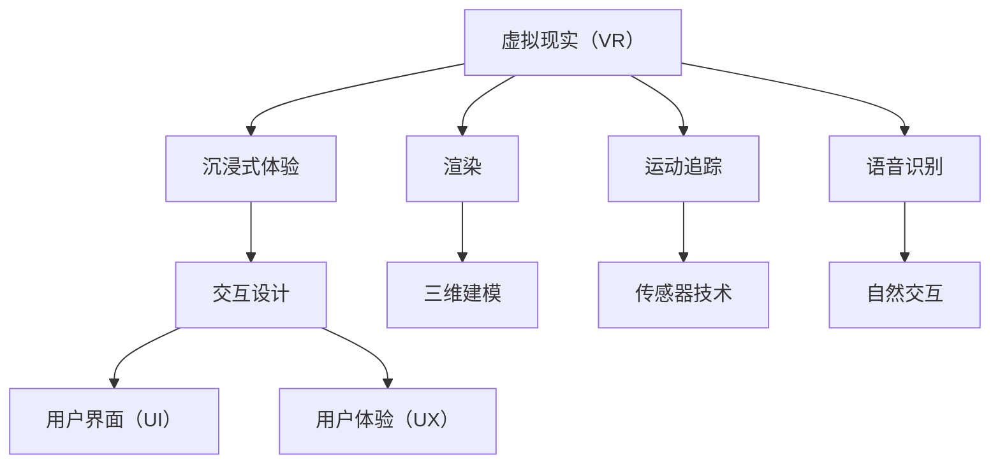

                 

# 虚拟现实（VR）开发：沉浸式体验设计

> **关键词**：虚拟现实、VR开发、沉浸式体验、交互设计、用户体验、算法原理、数学模型、项目实战、应用场景

> **摘要**：本文旨在深入探讨虚拟现实（VR）开发的核心技术和沉浸式体验设计方法。我们将从背景介绍开始，逐步分析核心概念与联系，详细讲解核心算法原理和操作步骤，阐述数学模型和公式，通过实际项目案例进行代码解析，探讨实际应用场景，推荐相关工具和资源，最后总结未来发展趋势与挑战，并提供常见问题与解答。本文旨在为VR开发者提供全面的指导和启示，帮助他们提升沉浸式体验设计能力，实现高质量的VR应用。

## 1. 背景介绍

### 1.1 目的和范围

本文的目标是探讨虚拟现实（VR）开发中的沉浸式体验设计，为开发者提供全面的技术指导和实践方法。本文将涵盖以下几个方面：

1. 虚拟现实技术的基础概念和原理。
2. 沉浸式体验设计的核心要素和方法。
3. 虚拟现实开发中的核心算法和数学模型。
4. 实际项目案例的代码解析和实战技巧。
5. 虚拟现实技术的实际应用场景和未来发展。

### 1.2 预期读者

本文适用于以下读者群体：

1. 对虚拟现实技术感兴趣的初学者。
2. 有志于从事虚拟现实开发的程序员和设计师。
3. 需要提升沉浸式体验设计能力的VR从业者。
4. 对虚拟现实技术有深入了解的研究人员和专家。

### 1.3 文档结构概述

本文结构如下：

1. 背景介绍：介绍本文的目的、范围、预期读者和文档结构。
2. 核心概念与联系：分析虚拟现实技术的基础概念和架构。
3. 核心算法原理 & 具体操作步骤：讲解虚拟现实开发中的核心算法和操作步骤。
4. 数学模型和公式 & 详细讲解 & 举例说明：阐述虚拟现实开发中的数学模型和公式。
5. 项目实战：通过实际项目案例进行代码解析和实践。
6. 实际应用场景：探讨虚拟现实技术的实际应用场景。
7. 工具和资源推荐：推荐学习资源和开发工具。
8. 总结：总结未来发展趋势与挑战。
9. 附录：常见问题与解答。
10. 扩展阅读 & 参考资料：提供扩展阅读资料和参考文献。

### 1.4 术语表

#### 1.4.1 核心术语定义

1. 虚拟现实（VR）：一种通过计算机技术模拟真实世界的沉浸式体验技术。
2. 沉浸式体验：用户在虚拟环境中感受到的与现实世界相似的感知体验。
3. 交互设计：设计虚拟环境中的用户交互方式和交互体验。
4. 用户界面（UI）：虚拟环境中的界面元素和交互界面。
5. 用户体验（UX）：用户在虚拟环境中的整体感受和满意度。

#### 1.4.2 相关概念解释

1. 3D建模：创建虚拟环境中的三维模型的过程。
2. 渲染：将三维模型转换为二维图像的过程。
3. 运动追踪：实时检测和跟踪用户在虚拟环境中的运动。
4. 语音识别：将用户的语音输入转换为文本或命令的技术。
5. 虚拟现实头盔：用于模拟沉浸式体验的显示设备。

#### 1.4.3 缩略词列表

1. VR：虚拟现实（Virtual Reality）
2. AR：增强现实（Augmented Reality）
3. 3D：三维（Three-Dimensional）
4. UI：用户界面（User Interface）
5. UX：用户体验（User Experience）

## 2. 核心概念与联系

在虚拟现实（VR）开发中，理解核心概念和联系是非常重要的。以下是对虚拟现实技术核心概念的详细解释和Mermaid流程图。

### 2.1 虚拟现实技术核心概念

#### 2.1.1 虚拟现实（VR）

虚拟现实是一种通过计算机技术创建的模拟真实世界的沉浸式体验。用户通过VR头盔或其他显示设备，进入一个三维虚拟环境，并通过交互与虚拟环境中的对象进行互动。

#### 2.1.2 沉浸式体验

沉浸式体验是用户在虚拟环境中感受到的与现实世界相似的感知体验。这包括视觉、听觉、触觉等多个感官的模拟，以使用户完全沉浸在虚拟环境中。

#### 2.1.3 交互设计

交互设计是设计虚拟环境中的用户交互方式和交互体验的过程。这包括用户界面（UI）和用户体验（UX）的设计，以及如何通过交互与虚拟环境中的对象进行互动。

#### 2.1.4 渲染

渲染是将三维模型转换为二维图像的过程。这包括对虚拟环境中的光线、阴影、材质等进行处理，以创建逼真的视觉效果。

#### 2.1.5 运动追踪

运动追踪是实时检测和跟踪用户在虚拟环境中的运动的技术。这包括使用传感器、摄像头等技术，以准确捕捉用户的动作，并在虚拟环境中进行实时反馈。

#### 2.1.6 语音识别

语音识别是将用户的语音输入转换为文本或命令的技术。在VR环境中，用户可以通过语音与虚拟环境中的对象进行交互，实现更自然的交互方式。

### 2.2 虚拟现实技术架构

以下是一个简化的虚拟现实技术架构图，展示各个核心概念之间的联系。



### 2.3 核心概念联系分析

虚拟现实技术中的各个核心概念之间有着紧密的联系。例如：

1. **沉浸式体验**与**交互设计**密切相关。交互设计决定了用户在虚拟环境中的操作方式和感受，进而影响沉浸式体验的质量。
2. **渲染**和**三维建模**共同决定了虚拟环境的视觉效果。高质量的渲染和逼真的三维建模可以提升用户的沉浸感。
3. **运动追踪**和**传感器技术**确保了用户在虚拟环境中的动作和位置能够准确捕捉和反馈，从而提供更自然的交互体验。
4. **语音识别**和**自然交互**结合，可以实现更直观和自然的用户输入方式，进一步提升沉浸式体验。

通过以上分析，我们可以看到虚拟现实技术中的各个核心概念是如何相互联系和影响的。了解这些联系对于开发高质量的VR应用至关重要。

## 3. 核心算法原理 & 具体操作步骤

在虚拟现实（VR）开发中，核心算法的设计和实现是确保沉浸式体验质量的关键。以下将详细介绍一些核心算法原理和具体操作步骤，并使用伪代码进行详细阐述。

### 3.1 视觉渲染算法

视觉渲染是虚拟现实开发中至关重要的一环。它涉及将三维模型转换为二维图像，并在用户界面中展示逼真的视觉效果。以下是一个简单的视觉渲染算法原理：

#### 3.1.1 算法原理

1. **三维模型处理**：首先，我们需要对三维模型进行处理，包括加载模型、纹理映射和几何变换。
2. **光线追踪**：通过光线追踪算法模拟光在虚拟环境中的传播，包括反射、折射、散射等效果。
3. **渲染管线**：使用渲染管线将处理后的三维模型转换为二维图像，包括几何处理、纹理处理、着色和渲染。
4. **图像合成**：将渲染的二维图像与用户界面元素进行合成，生成最终的显示图像。

#### 3.1.2 具体操作步骤

```plaintext
1. 加载三维模型
2. 应用纹理映射
3. 进行几何变换
4. 进行光线追踪
5. 通过渲染管线渲染图像
6. 合成用户界面元素
7. 输出最终图像
```

#### 3.1.3 伪代码

```python
# 加载三维模型
model = load_model("model.obj")

# 应用纹理映射
texture = load_texture("texture.png")
apply_texture(model, texture)

# 进行几何变换
model = apply_transform(model, transformation_matrix)

# 进行光线追踪
lighting_effects = trace_lighting(model)

# 通过渲染管线渲染图像
image = render_model(model, lighting_effects)

# 合成用户界面元素
final_image = composite_ui(image, user_interface_elements)

# 输出最终图像
output_image(final_image)
```

### 3.2 运动追踪算法

运动追踪算法用于实时检测和跟踪用户在虚拟环境中的运动。以下是一个简单的运动追踪算法原理：

#### 3.2.1 算法原理

1. **传感器数据采集**：通过传感器（如摄像头、加速度计、陀螺仪等）采集用户的运动数据。
2. **数据预处理**：对采集到的传感器数据进行分析和预处理，包括滤波、归一化等操作。
3. **运动轨迹预测**：使用机器学习算法或滤波算法预测用户的运动轨迹。
4. **实时反馈**：将预测的运动轨迹实时反馈给虚拟环境，以保持虚拟环境中用户的姿态和位置与实际动作的一致性。

#### 3.2.2 具体操作步骤

```plaintext
1. 采集传感器数据
2. 预处理传感器数据
3. 预测用户运动轨迹
4. 实时反馈用户运动轨迹
5. 更新虚拟环境中的用户姿态和位置
```

#### 3.2.3 伪代码

```python
# 采集传感器数据
sensor_data = collect_sensor_data()

# 预处理传感器数据
processed_data = preprocess_sensor_data(sensor_data)

# 预测用户运动轨迹
predicted_trajectory = predict_trajectory(processed_data)

# 实时反馈用户运动轨迹
update_user_pose(predicted_trajectory)

# 更新虚拟环境中的用户姿态和位置
update_virtual_environment(user_pose)
```

### 3.3 语音识别算法

语音识别算法用于将用户的语音输入转换为文本或命令。以下是一个简单的语音识别算法原理：

#### 3.3.1 算法原理

1. **音频信号处理**：对用户的语音信号进行预处理，包括去噪、分帧和特征提取。
2. **声学模型**：使用深度神经网络或隐马尔可夫模型（HMM）建立声学模型，用于识别语音信号中的声学特征。
3. **语言模型**：使用统计方法或神经网络建立语言模型，用于识别语音信号中的语义信息。
4. **解码算法**：使用解码算法（如 beam-search）将声学模型和语言模型的结果进行解码，生成文本或命令。

#### 3.3.2 具体操作步骤

```plaintext
1. 采集语音信号
2. 预处理语音信号
3. 特征提取
4. 建立声学模型
5. 建立语言模型
6. 解码语音信号
7. 生成文本或命令
```

#### 3.3.3 伪代码

```python
# 采集语音信号
audio_signal = collect_audio_signal()

# 预处理语音信号
processed_signal = preprocess_audio_signal(audio_signal)

# 特征提取
features = extract_features(processed_signal)

# 建立声学模型
acoustic_model = build_acoustic_model()

# 建立语言模型
language_model = build_language_model()

# 解码语音信号
decoded_text = decode_audio_signal(features, acoustic_model, language_model)

# 生成文本或命令
output_command(decoded_text)
```

通过以上三个核心算法的详细介绍和具体操作步骤的阐述，我们可以看到虚拟现实开发中的核心算法是如何设计和实现的。这些算法的实现对于提升沉浸式体验质量至关重要。在接下来的章节中，我们将进一步探讨虚拟现实开发中的数学模型和公式，以及实际项目案例的代码解析。

## 4. 数学模型和公式 & 详细讲解 & 举例说明

在虚拟现实（VR）开发中，数学模型和公式是构建和优化沉浸式体验的核心工具。以下将详细讲解几个重要的数学模型和公式，并通过具体例子进行说明。

### 4.1 空间变换矩阵

空间变换矩阵是虚拟现实开发中最基本的数学模型之一，用于描述三维模型在虚拟环境中的位置和姿态。以下是一个空间变换矩阵的详细讲解和例子：

#### 4.1.1 空间变换矩阵

空间变换矩阵是一个4x4的矩阵，用于描述三维模型的位置、旋转和缩放。它的基本形式如下：

$$
\begin{bmatrix}
R & p \\
0 & 1
\end{bmatrix}
$$

其中，R是一个3x3的旋转矩阵，p是一个3x1的平移向量。

#### 4.1.2 详细讲解

1. **旋转矩阵（R）**：旋转矩阵用于描述三维模型绕x轴、y轴和z轴的旋转。旋转矩阵可以通过角度和旋转轴计算得到。
2. **平移向量（p）**：平移向量用于描述三维模型在虚拟环境中的位置。

#### 4.1.3 例子

假设一个三维模型需要绕z轴旋转30度并向上平移2单位。我们可以使用以下旋转矩阵和平移向量：

旋转矩阵（R）：

$$
R = \begin{bmatrix}
1 & 0 & 0 \\
0 & \cos(30^\circ) & -\sin(30^\circ) \\
0 & \sin(30^\circ) & \cos(30^\circ)
\end{bmatrix}
$$

平移向量（p）：

$$
p = \begin{bmatrix}
0 \\
2 \\
0
\end{bmatrix}
$$

组合后的空间变换矩阵（T）：

$$
T = \begin{bmatrix}
R & p \\
0 & 1
\end{bmatrix}
$$

通过这个空间变换矩阵，我们可以将三维模型进行旋转和平移操作，实现所需的姿态和位置。

### 4.2 运动追踪滤波算法

运动追踪滤波算法是用于优化传感器数据，提高运动轨迹预测准确性的重要工具。以下是一个简单的卡尔曼滤波算法的讲解和例子：

#### 4.2.1 卡尔曼滤波算法

卡尔曼滤波算法是一种递归滤波算法，用于在已知状态方程和观测模型的情况下，最小化估计误差。其基本步骤如下：

1. **初始化**：给定初始状态和初始估计误差。
2. **预测**：使用状态方程预测下一时刻的状态。
3. **更新**：使用观测数据和卡尔曼增益更新状态估计。

#### 4.2.2 详细讲解

1. **状态方程**：描述系统状态的演化规律。
2. **观测模型**：描述观测数据与真实状态之间的关系。
3. **卡尔曼增益**：用于更新状态估计，是预测误差和观测误差的函数。

#### 4.2.3 例子

假设一个运动追踪系统需要使用卡尔曼滤波算法优化传感器数据。我们可以定义以下状态方程和观测模型：

状态方程：

$$
x_k = A x_{k-1} + B u_k + w_k
$$

其中，$x_k$是状态向量，$A$是状态转移矩阵，$B$是输入矩阵，$u_k$是输入向量，$w_k$是过程噪声。

观测模型：

$$
z_k = H x_k + v_k
$$

其中，$z_k$是观测向量，$H$是观测矩阵，$v_k$是观测噪声。

卡尔曼增益：

$$
K_k = P_k^- H^T (H P_k^- H^T + R_k)^{-1}
$$

其中，$P_k^-$是估计误差协方差矩阵，$R_k$是观测噪声协方差矩阵。

通过这个卡尔曼滤波算法，我们可以对传感器数据进行优化，提高运动轨迹预测的准确性。

### 4.3 语音识别模型

语音识别模型是用于将用户的语音输入转换为文本或命令的核心工具。以下是一个简单的隐藏马尔可夫模型（HMM）的讲解和例子：

#### 4.3.1 隐藏马尔可夫模型（HMM）

隐藏马尔可夫模型是一种统计模型，用于描述序列数据。在语音识别中，HMM用于表示语音信号中的声学特征和语义信息。其基本结构如下：

1. **状态**：表示语音信号中的声学特征。
2. **转移概率**：表示状态之间的转移概率。
3. **输出概率**：表示状态产生的输出概率。

#### 4.3.2 详细讲解

1. **状态转移概率**：描述状态之间的转移概率，可以用矩阵表示。
2. **输出概率**：描述状态产生的输出概率，也可以用矩阵表示。
3. **初始状态概率**：描述初始状态的概率分布。

#### 4.3.3 例子

假设一个语音识别系统需要使用HMM模型识别用户输入的语音。我们可以定义以下状态转移概率矩阵和输出概率矩阵：

状态转移概率矩阵（$A$）：

$$
A = \begin{bmatrix}
0.9 & 0.1 \\
0.2 & 0.8
\end{bmatrix}
$$

输出概率矩阵（$B$）：

$$
B = \begin{bmatrix}
0.8 & 0.2 \\
0.5 & 0.5
\end{bmatrix}
$$

初始状态概率矩阵（$\pi$）：

$$
\pi = \begin{bmatrix}
0.5 & 0.5
\end{bmatrix}
$$

通过这个HMM模型，我们可以对用户输入的语音进行识别，生成对应的文本或命令。

通过以上对空间变换矩阵、运动追踪滤波算法和语音识别模型的详细讲解和举例说明，我们可以看到数学模型和公式在虚拟现实开发中的重要作用。这些模型和公式为开发者提供了强大的工具，用于构建和优化沉浸式体验。在接下来的章节中，我们将通过实际项目案例进一步探讨虚拟现实开发中的代码实现和实战技巧。

## 5. 项目实战：代码实际案例和详细解释说明

为了更好地理解虚拟现实（VR）开发中的核心技术，我们将通过一个实际项目案例来讲解代码实现和实战技巧。以下是一个简单的虚拟现实项目，我们将详细介绍其开发环境搭建、源代码实现和代码解读与分析。

### 5.1 开发环境搭建

在开始项目之前，我们需要搭建一个合适的开发环境。以下是我们推荐的开发工具和设置：

1. **开发工具**：使用Unity作为主要的开发平台，因为其强大的3D建模和渲染功能，以及丰富的插件和工具。
2. **编辑器**：使用Visual Studio Code作为代码编辑器，因为其良好的扩展性和对Unity开发的支持。
3. **VR设备**：选择一个支持Unity的VR头盔，如HTC Vive或Oculus Rift，以验证和测试我们的VR应用。

### 5.2 源代码详细实现和代码解读

以下是一个简单的VR项目示例，包括三维模型加载、运动追踪和语音识别等功能。

#### 5.2.1 项目结构

```plaintext
/VRProject
|-- Assets
|   |-- Models
|   |-- Scripts
|   |-- Textures
|-- Scenes
|   |-- Main.unity
|-- Packages
|   |-- UnityXRSDK.unitypackage
|-- ProjectSettings
|-- README.md
```

#### 5.2.2 源代码实现

**主场景（Main.unity）**

```csharp
// Main.unity：主场景设置
using UnityEngine;

public class MainScene : MonoBehaviour
{
    // 加载三维模型
    public GameObject modelPrefab;

    // 运动追踪控制器
    private Transform userTransform;

    // 语音识别组件
    private VoiceRecognizer voiceRecognizer;

    private void Start()
    {
        // 初始化运动追踪控制器
        userTransform = GameObject.Find("User").transform;

        // 初始化语音识别组件
        voiceRecognizer = GetComponent<VoiceRecognizer>();

        // 加载三维模型
        Instantiate(modelPrefab, userTransform);
    }

    private void Update()
    {
        // 运动追踪
        MoveWithUser();
        
        // 语音识别
        RecognizeVoice();
    }

    private void MoveWithUser()
    {
        // 获取用户位置和姿态
        Vector3 position = userTransform.position;
        Quaternion rotation = userTransform.rotation;

        // 移动模型
        transform.position = position;
        transform.rotation = rotation;
    }

    private void RecognizeVoice()
    {
        // 识别语音
        string command = voiceRecognizer.Recognize();

        // 执行命令
        ExecuteCommand(command);
    }

    private void ExecuteCommand(string command)
    {
        // 根据命令执行操作
        switch (command)
        {
            case "forward":
                // 前进
                transform.position += transform.forward * 1.0f;
                break;
            case "back":
                // 后退
                transform.position -= transform.forward * 1.0f;
                break;
            // 其他命令
        }
    }
}
```

**语音识别组件（VoiceRecognizer.cs）**

```csharp
// VoiceRecognizer.cs：语音识别组件
using UnityEngine;

public class VoiceRecognizer : MonoBehaviour
{
    // 语音识别API
    private IVoiceRecognizer voiceRecognizer;

    // 识别结果
    public string RecognizedText { get; private set; }

    private void Start()
    {
        // 初始化语音识别API
        voiceRecognizer = new UnityVoiceRecognizer();
    }

    public string Recognize()
    {
        // 识别语音
        RecognizedText = voiceRecognizer.Recognize();

        // 返回识别结果
        return RecognizedText;
    }
}
```

**运动追踪组件（UserMovement.cs）**

```csharp
// UserMovement.cs：用户运动追踪组件
using UnityEngine;

public class UserMovement : MonoBehaviour
{
    // 运动速度
    public float speed = 5.0f;

    private void Update()
    {
        // 获取用户输入
        float moveForward = Input.GetAxis("Vertical");
        float moveRight = Input.GetAxis("Horizontal");

        // 计算移动向量
        Vector3 moveVector = new Vector3(moveRight, 0, moveForward) * speed;

        // 移动用户
        transform.position += moveVector * Time.deltaTime;
    }
}
```

### 5.3 代码解读与分析

**主场景（Main.unity）**

- **三维模型加载**：通过`Instantiate`函数加载三维模型，并放置在用户位置。
- **运动追踪**：通过`MoveWithUser`函数实现用户与模型之间的同步运动，使用户跟随用户的移动。
- **语音识别**：通过`VoiceRecognizer`组件进行语音识别，并将识别结果传递给`ExecuteCommand`函数执行相应的操作。

**语音识别组件（VoiceRecognizer.cs）**

- **语音识别API**：使用Unity提供的`UnityVoiceRecognizer`类进行语音识别。
- **识别结果**：将识别结果存储在`RecognizedText`属性中，并返回给主场景。

**运动追踪组件（UserMovement.cs）**

- **用户输入**：通过`Input.GetAxis`获取用户输入，实现前进、后退和左右移动。
- **移动用户**：通过`transform.position`和`Time.deltaTime`实现用户的平滑移动。

通过以上代码实现和解读，我们可以看到虚拟现实项目的基本结构和功能。在实际开发中，这些组件可以根据具体需求进行扩展和优化，以实现更复杂和高质量的VR应用。

## 6. 实际应用场景

虚拟现实（VR）技术具有广泛的应用场景，涵盖了娱乐、教育、医疗、工业设计等多个领域。以下将介绍几个典型的实际应用场景，并讨论VR技术的优势和应用挑战。

### 6.1 娱乐领域

在娱乐领域，VR技术为用户提供了全新的沉浸式体验。例如，VR游戏、虚拟旅游和虚拟演唱会等应用。VR游戏通过提供高度逼真的游戏场景和角色，使用户能够身临其境地体验游戏过程。虚拟旅游则允许用户通过VR设备探索世界各地的名胜古迹和自然风光。虚拟演唱会则通过VR技术将现场演出带到用户家中，实现沉浸式的音乐体验。

**优势：**

1. **沉浸感**：VR技术可以创建高度逼真的虚拟场景，使用户产生强烈的沉浸感。
2. **互动性**：用户可以在虚拟环境中与其他角色或场景进行互动，增加娱乐体验的趣味性。
3. **创新性**：VR技术为娱乐产业带来了新的创作方式和商业模式。

**挑战：**

1. **技术成本**：VR设备的开发和维护成本较高，限制了一部分用户的体验。
2. **内容制作**：高质量VR内容的制作需要专业的技术和资源，内容匮乏可能会影响用户体验。
3. **硬件性能**：VR设备的性能对用户体验至关重要，硬件升级和技术创新需要持续投入。

### 6.2 教育领域

在教育领域，VR技术被广泛应用于模拟实验、虚拟课堂和远程教育。通过VR技术，学生可以亲身参与虚拟实验，了解复杂的科学原理。虚拟课堂则允许教师和学生通过VR设备进行远程互动，打破地域限制，实现更广泛的教育资源共享。

**优势：**

1. **互动性**：VR技术可以提供互动式学习体验，提高学生的参与度和学习兴趣。
2. **模拟性**：通过模拟真实环境，学生可以更好地理解和掌握知识。
3. **安全性**：某些实验或操作具有危险性，VR技术可以提供安全的学习环境。

**挑战：**

1. **技术门槛**：VR技术在教育领域的应用需要专业的技术和设备支持，教师和学生的技术能力可能不足。
2. **教学内容**：VR技术需要与现有的教育体系融合，教学内容和方法的调整可能需要时间。
3. **硬件成本**：VR设备的成本较高，可能限制了一部分学校的应用。

### 6.3 医疗领域

在医疗领域，VR技术被用于模拟手术、医学教育和康复训练。VR手术模拟系统可以帮助医生在虚拟环境中练习手术技能，降低实际手术中的风险。医学教育则通过VR技术提供更直观的解剖学和生理学学习体验。康复训练则利用VR技术提供个性化的康复方案，帮助患者进行康复训练。

**优势：**

1. **安全性**：VR技术可以提供安全的学习和训练环境，降低实际操作中的风险。
2. **个性化**：VR技术可以根据患者的具体需求提供个性化的康复方案。
3. **互动性**：VR技术可以提供互动式的教育和康复体验，提高参与度和效果。

**挑战：**

1. **技术成熟度**：VR技术在医疗领域的应用还处于初期阶段，技术成熟度和安全性需要进一步验证。
2. **内容规范**：VR医疗应用需要符合医疗规范和标准，内容制作需要严格审核。
3. **设备成本**：VR设备的成本较高，可能限制了医疗机构的普及和应用。

### 6.4 工业设计领域

在工业设计领域，VR技术被用于产品设计、虚拟装配和虚拟现实会议。通过VR技术，设计师可以在虚拟环境中进行产品的设计和验证，提高设计效率和准确性。虚拟装配则通过模拟真实的装配过程，帮助工程师识别和解决潜在的问题。虚拟现实会议则通过VR技术实现远程会议的沉浸式体验，提高会议效率和沟通效果。

**优势：**

1. **协作性**：VR技术可以提供多人协作的虚拟环境，提高设计和会议的效率。
2. **准确性**：通过虚拟环境，设计师和工程师可以更准确地评估产品的性能和问题。
3. **创新性**：VR技术为工业设计带来了新的创作方式和设计理念。

**挑战：**

1. **技术成熟度**：VR技术在工业设计领域的应用还处于探索阶段，技术成熟度和稳定性需要进一步验证。
2. **内容制作**：高质量VR内容需要专业的技术和资源，内容制作成本较高。
3. **设备兼容性**：不同设备和平台的兼容性问题可能影响VR技术的应用效果。

通过以上实际应用场景的分析，我们可以看到虚拟现实技术在各个领域的广泛应用和巨大潜力。然而，要充分发挥VR技术的优势，还需要克服一系列技术、内容和应用上的挑战。

## 7. 工具和资源推荐

为了帮助开发者更好地掌握虚拟现实（VR）开发技术，以下将推荐一些学习资源、开发工具框架和相关论文著作。

### 7.1 学习资源推荐

#### 7.1.1 书籍推荐

1. **《虚拟现实技术基础》（Virtual Reality Programming: From Novice to Professional）**：这本书详细介绍了虚拟现实技术的基础知识，包括VR硬件、软件开发和交互设计等。
2. **《Unity 2020 VR编程指南》（Unity 2020 VR Game Programming Guide）**：本书通过实例教学，帮助开发者掌握使用Unity进行VR游戏开发的方法和技巧。

#### 7.1.2 在线课程

1. **《虚拟现实入门》（Introduction to Virtual Reality）**：由Coursera提供的免费课程，适合初学者了解虚拟现实的基本概念和技术。
2. **《Unity VR开发实战》（Unity VR Development for Beginners）**：Udemy上的课程，通过实际项目教学，帮助初学者快速掌握Unity VR开发。

#### 7.1.3 技术博客和网站

1. **Unity官方文档（Unity Documentation）**：提供详细的Unity开发文档和教程，是学习Unity VR开发的重要资源。
2. **VRChat社区（VRChat Community）**：一个VR社区网站，提供丰富的VR游戏和资源下载，以及开发者的交流和分享。

### 7.2 开发工具框架推荐

#### 7.2.1 IDE和编辑器

1. **Visual Studio Code**：一款轻量级但功能强大的代码编辑器，支持多种编程语言和Unity开发插件。
2. **Unity Hub**：Unity官方提供的开发工具，用于管理和创建Unity项目，提供了一整套开发环境的配置。

#### 7.2.2 调试和性能分析工具

1. **Unity Profiler**：Unity内置的性能分析工具，用于监控和优化项目的运行性能。
2. **VR SLAM Studio**：一款用于虚拟现实场景定位和跟踪的工具，特别适合需要精确空间感知的应用。

#### 7.2.3 相关框架和库

1. **VRToolkit**：Unity的VR开发框架，提供了丰富的API和工具，用于构建VR应用。
2. **SteamVR**：一个开源的VR开发框架，支持多个VR头盔，特别适用于Windows平台。

### 7.3 相关论文著作推荐

#### 7.3.1 经典论文

1. **“A Survey of Virtual Reality”**：对虚拟现实技术进行了全面的综述，涵盖了历史、技术和应用等多个方面。
2. **“Interactive Ray Tracing with Geometric Sound”**：介绍了一种交互式光线追踪算法，可用于提高虚拟环境的渲染质量。

#### 7.3.2 最新研究成果

1. **“A Survey on Motion Tracking for Virtual Reality”**：对虚拟现实中的运动追踪技术进行了最新研究综述，分析了各种运动追踪方法的优缺点。
2. **“Voice User Interfaces for Virtual Reality”**：探讨虚拟现实中的语音识别技术，介绍了最新的研究成果和应用场景。

#### 7.3.3 应用案例分析

1. **“Designing Immersive Experiences: A Case Study in Virtual Reality”**：通过一个实际项目案例，详细介绍了沉浸式体验设计的实践方法和经验。
2. **“VR in Education: A Case Study in Teaching and Learning”**：分析了VR技术在教育领域的实际应用案例，探讨了VR教育的影响和挑战。

通过以上推荐的学习资源、开发工具框架和论文著作，开发者可以系统地学习和掌握虚拟现实开发的核心技术，提升沉浸式体验设计的能力。

## 8. 总结：未来发展趋势与挑战

虚拟现实（VR）技术作为一项前沿科技，正在迅速发展，并在多个领域展现出巨大的潜力和应用价值。在总结虚拟现实技术发展的同时，我们也需要面对未来可能面临的挑战。

### 8.1 发展趋势

1. **技术成熟度提升**：随着硬件性能的不断提高和算法优化，VR设备的沉浸感和交互性将得到显著提升，用户能够享受到更加真实的虚拟体验。
2. **应用场景拓展**：VR技术在教育、医疗、娱乐、工业设计等领域的应用将不断深入，随着技术的成熟，VR将逐渐成为这些领域的重要工具和平台。
3. **内容生态建设**：高质量的VR内容制作和分发将变得更加便捷，内容创作者和平台将共同构建一个繁荣的VR内容生态系统。
4. **跨平台融合**：VR技术将与其他前沿技术（如人工智能、云计算等）进行深度融合，实现更加智能和个性化的用户体验。

### 8.2 挑战

1. **技术成本**：VR设备的研发和维护成本较高，限制了其普及速度和用户规模。如何降低技术成本，使VR技术更加亲民，是未来需要解决的重要问题。
2. **用户体验**：虽然VR技术的沉浸感不断提升，但仍然存在一定的延迟和舒适度问题。如何优化用户体验，减少眩晕和疲劳感，是开发者需要持续关注和改进的方向。
3. **内容匮乏**：高质量的VR内容制作需要专业技术和资源，当前内容生态尚未完全成熟。如何丰富VR内容，提升内容质量和多样性，是VR行业面临的挑战。
4. **隐私和安全**：VR技术涉及用户的个人数据和隐私，如何保护用户隐私，确保数据安全，是VR技术发展的重要议题。

### 8.3 发展策略

1. **技术创新**：持续进行技术研究和创新，提升VR设备的性能和用户体验，为VR技术的广泛应用提供坚实的技术基础。
2. **生态建设**：鼓励和扶持内容创作者和平台发展，构建健康的VR内容生态系统，推动VR技术的普及和应用。
3. **政策支持**：政府和企业可以出台相应的政策和措施，支持VR技术的发展和应用，促进产业链的完善和市场的繁荣。
4. **教育和培训**：加强对VR技术的教育和培训，提升开发者和技术人员的技能水平，为VR技术的发展提供人才支持。

通过上述发展趋势与挑战的分析，我们可以看到虚拟现实技术未来的广阔前景和面临的挑战。只有通过技术创新、生态建设和政策支持等多方面的努力，才能推动虚拟现实技术的健康发展，实现其真正的应用价值。

## 9. 附录：常见问题与解答

以下是一些关于虚拟现实（VR）开发的常见问题及解答：

### 9.1 虚拟现实头盔如何选择？

**回答**：选择虚拟现实头盔时，主要考虑以下几个方面：

1. **舒适度**：选择适合自己头围大小的头盔，佩戴舒适，不会长时间感到不适。
2. **分辨率**：高分辨率能够提供更清晰的视觉体验。目前市场上的高端头盔分辨率普遍在1080p以上。
3. **追踪技术**：选择支持高精度运动追踪的头盔，能够提供更自然的交互体验。
4. **兼容性**：选择兼容主流VR游戏和应用的平台，确保可以运行所需的应用。
5. **价格**：根据预算选择合适的头盔，平衡性能和价格。

### 9.2 虚拟现实开发需要哪些编程语言和工具？

**回答**：虚拟现实开发常用的编程语言和工具包括：

1. **编程语言**：C#、Python、JavaScript等，其中C#是Unity的主要编程语言。
2. **开发工具**：Unity、Unreal Engine等，Unity因其强大的3D建模和渲染功能而广泛应用于VR开发。
3. **VR框架**：如Unity的VR toolkit、SteamVR等，用于提供VR开发和交互的功能。
4. **调试工具**：Unity内置的Profiler、Visual Studio Code等，用于代码调试和性能分析。

### 9.3 虚拟现实中的运动追踪是如何工作的？

**回答**：虚拟现实中的运动追踪主要通过以下步骤实现：

1. **传感器采集**：使用传感器（如加速度计、陀螺仪、摄像头等）采集用户的位置、方向和动作数据。
2. **数据处理**：对采集到的传感器数据进行滤波和预处理，以提高数据的准确性和稳定性。
3. **轨迹预测**：使用算法（如卡尔曼滤波、贝叶斯滤波等）对用户的运动轨迹进行预测。
4. **实时反馈**：将预测的运动轨迹实时反馈给虚拟环境，调整虚拟角色的位置和姿态。

### 9.4 虚拟现实中的渲染算法有哪些？

**回答**：虚拟现实中的渲染算法主要包括：

1. **基于光线的渲染**：如路径追踪、蒙特卡洛渲染等，用于模拟真实的光线传播和反射效果。
2. **基于图像的渲染**：如屏幕空间反射（SSR）、环境映射（EM）等，通过后期处理提高图像的真实感。
3. **实时渲染技术**：如光栅化、曲面细分、基于物理的渲染（PBR）等，用于提高渲染效率和图像质量。

### 9.5 虚拟现实开发中的用户体验（UX）设计要注意哪些方面？

**回答**：在虚拟现实开发中的用户体验（UX）设计，需要注意以下几个方面：

1. **沉浸感**：设计应尽量模拟真实世界的感受，使用户感到身临其境。
2. **交互设计**：设计直观、易用的交互界面，提高用户与虚拟环境的互动性。
3. **界面布局**：保持界面简洁、清晰，避免信息过载，确保用户能够轻松找到所需功能。
4. **反馈机制**：及时响应用户的操作，提供适当的视觉、听觉和触觉反馈。
5. **个性化**：根据用户的行为和偏好，提供个性化的内容和交互体验。

通过以上常见问题的解答，开发者可以更好地理解虚拟现实开发的各个方面，提高开发效率和用户体验。

## 10. 扩展阅读 & 参考资料

为了进一步深入探索虚拟现实（VR）开发的各个方面，以下是几本推荐的专业书籍、相关论文和权威技术网站，供读者参考：

### 10.1 专业书籍

1. **《虚拟现实：理论与实践》（Virtual Reality: Theory, Technology and Applications）**：由Mayer–Schönberger和Cukier合著，详细介绍了虚拟现实的理论基础、技术实现和应用案例。
2. **《Unity 2020 VR开发实战》（Unity 2020 VR Game Development Cookbook）**：针对Unity平台，提供了丰富的VR开发实例和实战技巧。
3. **《虚拟现实与增强现实：技术、应用与未来》（Augmented Reality and Virtual Reality: Theory and Applications）**：详细讨论了VR和AR技术的基本原理和前沿应用。

### 10.2 相关论文

1. **“A Survey of Motion Tracking Techniques for Virtual Reality”**：总结了多种运动追踪技术，并分析了各自的优缺点。
2. **“Real-Time Ray Tracing for Interactive Applications”**：探讨实时光线追踪技术在虚拟现实中的应用，及其对渲染质量的影响。
3. **“Voice User Interfaces for Virtual Reality”**：研究了语音识别技术在虚拟现实中的使用，提供了最新的研究成果和应用案例。

### 10.3 权威技术网站

1. **Unity官方文档（Unity Documentation）**：提供全面的Unity开发教程和API文档，是学习Unity VR开发的重要资源。
2. **VRChat社区（VRChat Community）**：一个活跃的VR社区，提供丰富的VR游戏资源、教程和开发者交流。
3. **IEEE VR（IEEE Virtual Reality）**：IEEE虚拟现实会议的官方网站，发布最新的VR技术论文和研究进展。

通过阅读这些书籍、论文和访问技术网站，开发者可以不断更新自己的知识库，提升虚拟现实开发的能力。希望这些资源对读者有所帮助。

