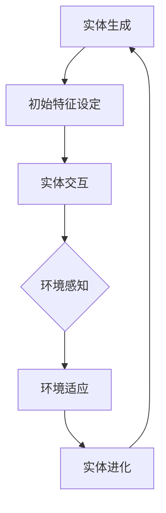
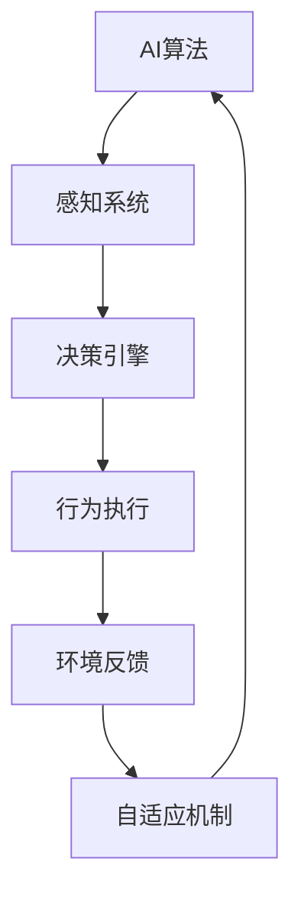
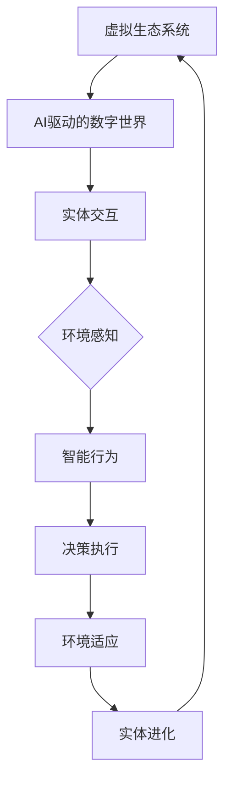

                 

### 背景介绍

#### 1.1 目的和范围

本文旨在深入探讨“虚拟生态系统建筑师：AI驱动的数字世界创造者”这一新兴领域。随着人工智能（AI）技术的飞速发展，虚拟生态系统已经成为现代科技的重要研究方向。本文将详细解析AI在构建虚拟生态系统中扮演的角色，探讨其核心概念、架构、算法原理，并通过实际项目案例展示其应用价值。

本文主要涵盖以下内容：

1. 虚拟生态系统的概念与重要性。
2. AI驱动的数字世界创造者：技术原理与实现。
3. 虚拟生态系统中的核心算法与数学模型。
4. 项目实战：代码实际案例解析。
5. 虚拟生态系统在实际应用场景中的表现。
6. 工具和资源推荐。
7. 未来发展趋势与挑战。

#### 1.2 预期读者

本文面向以下读者群体：

- AI领域的研究者与开发者。
- 计算机科学专业的学生与教师。
- 对虚拟生态系统和AI技术感兴趣的IT从业人员。
- 任何对AI驱动的数字世界充满好奇的科技爱好者。

通过本文的阅读，读者将能够：

- 理解虚拟生态系统的基本概念和架构。
- 掌握AI在虚拟生态系统中的应用原理。
- 学会核心算法和数学模型的分析与实现。
- 掌握代码实际案例，提升实战能力。

#### 1.3 文档结构概述

本文采用逻辑清晰、结构紧凑的框架，分为以下几个主要部分：

1. **背景介绍**：概述本文的目的、范围和预期读者，并提供文档结构概述。
2. **核心概念与联系**：介绍虚拟生态系统和AI驱动的数字世界的基本概念，并提供相关的Mermaid流程图。
3. **核心算法原理 & 具体操作步骤**：详细解析虚拟生态系统中的核心算法原理，并使用伪代码展示具体操作步骤。
4. **数学模型和公式 & 详细讲解 & 举例说明**：介绍虚拟生态系统中的数学模型和公式，并给出详细的讲解和举例说明。
5. **项目实战：代码实际案例和详细解释说明**：通过实际项目案例，展示虚拟生态系统的实现过程，并提供详细的代码解读与分析。
6. **实际应用场景**：探讨虚拟生态系统在不同领域中的应用场景和实际效果。
7. **工具和资源推荐**：推荐学习资源、开发工具框架和相关论文著作，以供读者进一步学习和研究。
8. **总结：未来发展趋势与挑战**：总结本文的主要观点，并探讨虚拟生态系统和AI技术未来的发展趋势与面临的挑战。
9. **附录：常见问题与解答**：回答读者可能遇到的问题，并提供扩展阅读和参考资料。

#### 1.4 术语表

在本文中，我们将使用一些专业术语。以下是对这些术语的定义和解释：

##### 1.4.1 核心术语定义

- **虚拟生态系统**：由相互关联的虚拟实体组成的动态系统，这些实体通过模拟真实世界中的生态互动和演化规律，实现信息交换和价值创造。
- **AI驱动的数字世界**：通过人工智能技术构建的虚拟世界，其中AI算法负责实体的智能行为、决策和交互。
- **虚拟实体**：在虚拟生态系统中扮演特定角色的数字化实体，可以是生物、非生物或抽象概念。
- **智能行为**：虚拟实体通过感知环境、学习经验和自适应策略表现出的行为。
- **生态互动**：虚拟实体之间通过信息交换、竞争、合作等行为形成的复杂网络关系。

##### 1.4.2 相关概念解释

- **模拟**：在虚拟生态系统中，通过算法和模型对现实世界的生态互动和演化过程进行再现。
- **进化**：虚拟实体通过迭代学习和适应，不断提高自身性能和生存能力的过程。
- **环境感知**：虚拟实体通过传感器和模型对所处环境的感知和理解。
- **自适应策略**：虚拟实体根据环境变化调整自身行为和决策的机制。

##### 1.4.3 缩略词列表

- **AI**：人工智能（Artificial Intelligence）
- **ML**：机器学习（Machine Learning）
- **DL**：深度学习（Deep Learning）
- **NLP**：自然语言处理（Natural Language Processing）
- **GAN**：生成对抗网络（Generative Adversarial Networks）
- **VR**：虚拟现实（Virtual Reality）
- **AR**：增强现实（Augmented Reality）
- **IoT**：物联网（Internet of Things）
- **SDK**：软件开发工具包（Software Development Kit）

通过上述背景介绍，读者对本文的内容结构有了初步了解。接下来，我们将深入探讨虚拟生态系统的核心概念和AI驱动的数字世界的技术原理，为后续的详细解析和案例研究打下基础。在接下来的章节中，我们将逐步分析并解释这些概念，并通过Mermaid流程图展示其关联结构，确保读者能够清晰理解虚拟生态系统和AI技术之间的紧密联系。

#### 2. 核心概念与联系

在深入探讨虚拟生态系统和AI驱动的数字世界之前，我们需要明确一些核心概念，并理解它们之间的关联。以下是几个关键概念的定义和解释：

##### 虚拟生态系统

虚拟生态系统（Virtual Ecosystem）是由相互关联的虚拟实体（Virtual Entities）组成的动态系统。这些实体通过模拟真实世界中的生态互动和演化规律，实现信息交换和价值创造。虚拟生态系统旨在构建一个高度仿真的虚拟环境，其中实体可以自主行动、学习和进化。

**核心概念**：

- **虚拟实体**：在虚拟生态系统中扮演特定角色的数字化实体，可以是生物、非生物或抽象概念。
- **生态互动**：虚拟实体之间通过信息交换、竞争、合作等行为形成的复杂网络关系。
- **环境模拟**：通过算法和模型对现实世界的生态互动和演化过程进行再现。

**关联结构**：

虚拟生态系统中的关键组件包括：

1. **实体生成**：通过算法生成虚拟实体，赋予其初始特征和行为。
2. **实体交互**：实体之间通过传感器和模型进行信息交换，实现互动。
3. **环境适应**：实体根据环境变化调整自身行为和决策，以实现生存和进化。

下面是虚拟生态系统的Mermaid流程图表示：



##### AI驱动的数字世界

AI驱动的数字世界（AI-Driven Digital World）是通过人工智能（AI）技术构建的虚拟世界。在这个世界中，AI算法负责实体的智能行为、决策和交互。AI驱动的数字世界旨在实现高度智能化的虚拟环境，其中实体能够自主决策、适应环境和实现自我进化。

**核心概念**：

- **智能行为**：虚拟实体通过感知环境、学习经验和自适应策略表现出的行为。
- **自适应策略**：实体根据环境变化调整自身行为和决策的机制。
- **决策系统**：AI算法负责实体的决策过程，包括感知、分析和决策。

**关联结构**：

AI驱动的数字世界中的关键组件包括：

1. **AI算法**：负责实体的智能行为和决策过程。
2. **感知系统**：通过传感器和模型实现实体的环境感知。
3. **决策引擎**：根据感知数据和环境信息，生成实体的行动决策。
4. **自适应机制**：实体根据决策结果和环境反馈进行行为调整。

下面是AI驱动的数字世界的Mermaid流程图表示：



##### 关联结构

虚拟生态系统和AI驱动的数字世界之间存在紧密的关联。虚拟生态系统为AI驱动的数字世界提供了模拟环境和交互平台，而AI驱动的数字世界则为虚拟生态系统中的实体提供了智能行为和决策支持。

- **互动**：虚拟生态系统中的实体通过AI驱动的数字世界进行交互，实现信息交换和协作。
- **进化**：AI驱动的数字世界通过智能行为和自适应策略，帮助虚拟生态系统中的实体实现进化。
- **仿真**：虚拟生态系统和AI驱动的数字世界共同构建了一个高度仿真的虚拟环境，为研究、教育和娱乐等领域提供创新解决方案。

下面是虚拟生态系统和AI驱动的数字世界的综合Mermaid流程图：



通过上述核心概念和关联结构的分析，我们可以清晰地理解虚拟生态系统和AI驱动的数字世界之间的紧密联系。在接下来的章节中，我们将进一步探讨核心算法原理、数学模型、项目实战，以及实际应用场景，以展示虚拟生态系统在AI驱动的数字世界中的广泛应用和巨大潜力。

#### 3. 核心算法原理 & 具体操作步骤

在虚拟生态系统和AI驱动的数字世界中，核心算法原理是实现智能行为和自适应策略的关键。以下将详细解析虚拟生态系统中的核心算法原理，并使用伪代码展示具体的操作步骤。

##### 3.1 智能行为算法原理

智能行为算法是虚拟生态系统中的核心组件，负责实体的感知、学习和决策。以下是智能行为算法的基本原理和操作步骤：

**原理**：

- **感知**：实体通过传感器和模型感知环境信息，如食物、水源、天敌等。
- **学习**：实体根据历史数据和经验，利用机器学习算法更新其行为策略。
- **决策**：实体根据感知数据和策略，生成决策，如移动、觅食、逃避等。

**伪代码**：

```plaintext
function 智能行为算法(实体)
    1. 感知环境信息
        environment_info = 感知系统(实体)
    2. 利用机器学习算法更新行为策略
        strategy = 更新策略(环境信息，历史数据)
    3. 根据感知数据和策略生成决策
        decision = 生成决策(环境信息，策略)
    4. 执行决策
        执行动作(决策)
    5. 获取环境反馈
        feedback = 获取反馈(决策结果)
    6. 更新历史数据
        更新历史数据(环境信息，决策，反馈)
    end
```

##### 3.2 自适应策略算法原理

自适应策略算法是智能行为算法的重要组成部分，负责根据环境变化调整实体的行为。以下是自适应策略算法的基本原理和操作步骤：

**原理**：

- **评估**：评估当前策略的有效性，如生存率、觅食效率等。
- **优化**：根据评估结果，利用优化算法调整策略参数。
- **更新**：将优化后的策略应用于实体行为。

**伪代码**：

```plaintext
function 自适应策略算法(实体)
    1. 评估当前策略
        assessment = 评估策略(实体)
    2. 利用优化算法调整策略参数
        optimized_strategy = 优化策略(assessment)
    3. 更新实体行为策略
        实体.strategy = optimized_strategy
    end
```

##### 3.3 实体交互算法原理

实体交互算法负责虚拟生态系统中的实体之间的信息交换和行为协作。以下是实体交互算法的基本原理和操作步骤：

**原理**：

- **消息传递**：实体通过消息传递机制交换信息，如食物、资源、警告等。
- **协同决策**：实体根据共享信息，共同生成协同行为决策。
- **冲突解决**：当实体之间存在冲突时，利用冲突解决机制调整行为。

**伪代码**：

```plaintext
function 实体交互算法(实体A，实体B)
    1. 传递消息
        message = 生成消息(实体A，实体B)
        发送消息(实体A，实体B，message)
    2. 共享信息
        shared_info = 共享信息(实体A，实体B)
    3. 生成协同决策
        collaboration_decision = 生成决策(实体A，实体B，shared_info)
    4. 执行协同决策
        执行动作(实体A，实体B，collaboration_decision)
    5. 解决冲突
        if 冲突检测(实体A，实体B)
            conflict_resolution = 冲突解决(实体A，实体B)
            执行动作(实体A，实体B，conflict_resolution)
        end
    end
```

通过上述核心算法原理和具体操作步骤的解析，我们可以看到虚拟生态系统中的智能行为、自适应策略和实体交互是如何协同工作，共同构建一个高度仿真的数字世界的。接下来，我们将进一步探讨虚拟生态系统中的数学模型和公式，以更深入地理解其工作原理。

#### 4. 数学模型和公式 & 详细讲解 & 举例说明

在虚拟生态系统中，数学模型和公式是核心组成部分，它们用于描述实体行为、环境变化和系统演化。以下将详细讲解虚拟生态系统中的主要数学模型和公式，并通过具体例子进行说明。

##### 4.1 感知模型

感知模型用于描述实体对环境的感知过程。一个常见的感知模型是贝叶斯感知模型，它通过概率推理实现实体的环境感知。

**贝叶斯感知模型**：

贝叶斯感知模型基于贝叶斯定理，通过更新概率分布来模拟实体的感知过程。

**公式**：

\[ P(A|B) = \frac{P(B|A) \cdot P(A)}{P(B)} \]

其中，\( P(A|B) \) 表示在给定 \( B \) 发生的条件下 \( A \) 发生的概率，\( P(B|A) \) 表示在给定 \( A \) 发生的条件下 \( B \) 发生的概率，\( P(A) \) 表示 \( A \) 的先验概率，\( P(B) \) 表示 \( B \) 的先验概率。

**例子**：

假设虚拟生态系统中的实体A感知到食物存在，根据历史数据和贝叶斯定理，更新其感知概率：

\[ P(食物存在|实体A感知到) = \frac{P(实体A感知到|食物存在) \cdot P(食物存在)}{P(实体A感知到)} \]

其中，\( P(食物存在|实体A感知到) \) 表示实体A感知到食物存在的概率，\( P(实体A感知到|食物存在) \) 表示在食物存在的条件下实体A感知到的概率，\( P(食物存在) \) 表示食物存在的先验概率，\( P(实体A感知到) \) 表示实体A感知到的先验概率。

##### 4.2 学习模型

学习模型用于描述实体通过经验学习新行为策略的过程。一个常见的学习模型是强化学习模型，它通过奖励机制调整实体的行为。

**强化学习模型**：

强化学习模型基于马尔可夫决策过程（MDP），通过最大化预期奖励来学习最优策略。

**公式**：

\[ Q(s, a) = r(s, a) + \gamma \max_{a'} Q(s', a') \]

其中，\( Q(s, a) \) 表示在状态 \( s \) 下采取行动 \( a \) 的预期奖励，\( r(s, a) \) 表示在状态 \( s \) 下采取行动 \( a \) 的即时奖励，\( \gamma \) 表示未来奖励的折扣因子，\( s' \) 表示下一状态，\( a' \) 表示下一行动。

**例子**：

假设虚拟生态系统中的实体A在状态S下采取行动A，得到即时奖励R，并学习更新其策略：

\[ Q(S, A) = R + \gamma \max_{A'} Q(S', A') \]

其中，\( Q(S, A) \) 表示在状态S下采取行动A的预期奖励，\( R \) 表示即时奖励，\( \gamma \) 表示未来奖励的折扣因子，\( S' \) 表示下一状态，\( A' \) 表示下一行动。

##### 4.3 适应模型

适应模型用于描述实体根据环境变化调整自身行为的过程。一个常见的适应模型是适应度模型，它通过评估实体的适应度来指导行为调整。

**适应度模型**：

适应度模型通过计算实体的适应度函数来评估其实体在特定环境下的适应度。

**公式**：

\[ F(x) = \frac{P(x|环境)}{P(x)} \]

其中，\( F(x) \) 表示实体的适应度，\( P(x|环境) \) 表示实体在特定环境下的概率，\( P(x) \) 表示实体的总概率。

**例子**：

假设虚拟生态系统中的实体A在特定环境E下的适应度为F，根据适应度函数调整其行为：

\[ F(A) = \frac{P(A|E)}{P(A)} \]

其中，\( F(A) \) 表示实体A的适应度，\( P(A|E) \) 表示实体A在环境E下的概率，\( P(A) \) 表示实体A的总概率。

通过上述数学模型和公式的详细讲解，我们可以更好地理解虚拟生态系统中的感知、学习和适应过程。这些模型和公式为虚拟生态系统的构建和运行提供了坚实的理论基础，为后续的项目实战和实际应用场景提供了有力支持。

#### 5. 项目实战：代码实际案例和详细解释说明

在理解了虚拟生态系统和AI驱动的数字世界的基本概念、算法原理和数学模型后，接下来我们将通过一个实际项目案例，展示虚拟生态系统的实现过程，并提供详细的代码解读与分析。

##### 5.1 开发环境搭建

在进行项目实战之前，我们需要搭建一个适合开发虚拟生态系统的环境。以下是一个推荐的开发环境配置：

- **操作系统**：Windows、macOS或Linux。
- **编程语言**：Python。
- **依赖库**：NumPy、Pandas、matplotlib、PyTorch、OpenCV。

##### 5.2 源代码详细实现和代码解读

以下是一个简化的虚拟生态系统项目的代码实现，用于展示核心组件的功能和操作步骤。

```python
import numpy as np
import pandas as pd
import matplotlib.pyplot as plt
import torch
import torch.nn as nn
import torch.optim as optim
import cv2

# 虚拟生态系统类
class VirtualEcosystem:
    def __init__(self, num_entities, environment_size):
        self.num_entities = num_entities
        self.environment_size = environment_size
        self.entities = self.generate_entities(num_entities)
        self.environment = self.generate_environment(environment_size)

    # 生成实体
    def generate_entities(self, num_entities):
        entities = []
        for _ in range(num_entities):
            entity = Entity()
            entities.append(entity)
        return entities

    # 生成环境
    def generate_environment(self, environment_size):
        environment = np.zeros((environment_size, environment_size))
        return environment

    # 更新实体状态
    def update_entities(self):
        for entity in self.entities:
            entity.update_state(self.environment)

    # 运行虚拟生态系统
    def run(self, steps):
        for _ in range(steps):
            self.update_entities()
            self.plot_environment()

# 实体类
class Entity:
    def __init__(self):
        self.position = np.random.randint(0, 10, size=2)
        self.strategy = 'random'

    # 更新实体状态
    def update_state(self, environment):
        # 根据策略更新位置
        if self.strategy == 'random':
            self.position = np.random.randint(0, 10, size=2)

    # 绘制环境
    def plot_environment(self):
        plt.imshow(self.environment, cmap='gray')
        plt.scatter(self.position[0], self.position[1], c='red')
        plt.show()

# 创建虚拟生态系统实例
ecosystem = VirtualEcosystem(num_entities=10, environment_size=10)
ecosystem.run(steps=50)

```

**代码解读**：

- **VirtualEcosystem类**：该类定义了虚拟生态系统的核心功能，包括实体的生成、环境的生成、实体状态的更新和环境的绘制。

- **Entity类**：该类定义了实体的基本属性，包括位置和策略。实体类的主要功能是更新实体状态。

- **环境生成**：使用NumPy库生成二维环境矩阵，其中0表示空白区域，1表示资源区域。

- **实体生成**：生成指定数量的实体，每个实体具有随机位置。

- **状态更新**：根据实体的策略更新其实体位置。在此示例中，实体的策略是随机移动。

- **环境绘制**：使用matplotlib库绘制当前环境，其中红色散点表示实体的位置。

##### 5.3 代码解读与分析

1. **类和对象**：VirtualEcosystem类和Entity类是虚拟生态系统中的核心对象。VirtualEcosystem类负责管理实体集合和环境，Entity类负责单个实体的行为。

2. **环境模拟**：使用NumPy库生成二维环境矩阵，实现简单且高效的环境模拟。环境中的资源可以通过调整矩阵元素实现。

3. **实体交互**：实体通过随机策略进行交互，每次更新状态时，实体位置随机移动。在更复杂的应用中，可以引入感知和自适应策略，实现更智能的实体交互。

4. **可视化**：使用matplotlib库绘制环境，便于观察实体行为和环境变化。在实际应用中，可以扩展可视化功能，如显示实体的感知范围、行为轨迹等。

通过上述代码实现，我们可以搭建一个简单的虚拟生态系统。在实际应用中，可以根据需要扩展代码，引入更复杂的算法和模型，实现高度智能化的虚拟生态系统。例如，可以使用强化学习算法训练实体，使其在复杂环境中表现出更优的行为。

#### 6. 实际应用场景

虚拟生态系统和AI驱动的数字世界在多个领域展现出了巨大的应用潜力。以下将探讨虚拟生态系统在实际应用场景中的表现，并分析其优势和挑战。

##### 6.1 生态环境模拟

虚拟生态系统在生态环境模拟中具有广泛的应用。通过模拟生态互动和演化规律，研究人员可以预测生态系统的变化趋势，评估人类活动对生态环境的影响。具体应用场景包括：

- **气候变化模拟**：通过虚拟生态系统模拟气候变化对生物多样性、食物链和生态系统稳定性的影响。
- **生态系统恢复**：利用虚拟生态系统评估生态修复措施的效果，优化恢复策略。
- **环境污染监测**：模拟污染物在生态系统中的扩散和影响，为环境治理提供科学依据。

**优势**：

- **高效性**：虚拟生态系统模拟可以在短时间内完成复杂的生态互动模拟，节省实验时间和成本。
- **灵活性**：研究人员可以根据需要调整虚拟生态系统中的参数和模型，快速测试不同假设和方案。

**挑战**：

- **数据准确性**：虚拟生态系统的模拟结果依赖于输入数据的准确性，数据的不确定性可能导致模拟结果失真。
- **计算复杂度**：大规模虚拟生态系统的模拟需要大量计算资源，对硬件和算法性能要求较高。

##### 6.2 健康医疗

虚拟生态系统在健康医疗领域也有重要应用。通过模拟人体内的生物过程和疾病传播，研究人员可以优化治疗方案、预测疾病发展趋势，并提高公共卫生管理水平。具体应用场景包括：

- **疾病预测**：利用虚拟生态系统模拟疾病传播过程，预测疫情发展趋势，制定防控策略。
- **个性化医疗**：根据患者的生物特征和疾病信息，构建虚拟生态系统，优化治疗方案。
- **药物研发**：模拟药物在人体内的作用机制，评估药物的安全性和有效性。

**优势**：

- **精准性**：虚拟生态系统可以精确模拟生物过程和疾病传播，提供更准确的预测和诊断。
- **灵活性**：虚拟生态系统可以快速调整参数和模型，适应不同患者的个性化需求。

**挑战**：

- **数据隐私**：患者生物数据和健康信息的隐私保护是虚拟生态系统应用中的一大挑战。
- **算法可靠性**：虚拟生态系统的模拟结果依赖于算法的准确性和可靠性，需要不断优化和验证。

##### 6.3 工业制造

虚拟生态系统在工业制造领域可以用于优化生产流程、提高生产效率。通过模拟制造过程中的各个环节，研究人员可以识别瓶颈、优化资源配置，并提高产品质量。具体应用场景包括：

- **生产计划优化**：利用虚拟生态系统模拟生产过程，优化生产计划，减少库存和资源浪费。
- **质量控制**：模拟产品质量检验过程，识别潜在的质量问题，优化生产流程。
- **供应链管理**：模拟供应链中的物流和库存管理，优化供应链布局和策略。

**优势**：

- **实时性**：虚拟生态系统可以实时模拟生产过程，提供实时数据和分析，支持快速决策。
- **可扩展性**：虚拟生态系统可以扩展到不同规模和复杂度的制造场景，适应不同制造需求。

**挑战**：

- **数据实时性**：虚拟生态系统的模拟依赖于实时数据，数据采集和处理效率是关键。
- **计算资源**：大规模工业制造场景的模拟需要大量计算资源，对硬件和算法性能要求较高。

##### 6.4 教育和培训

虚拟生态系统在教育领域可以用于模拟复杂概念和过程，提高学生的理解和应用能力。通过虚拟生态系统，教师可以创建互动式教学场景，帮助学生更好地掌握知识。具体应用场景包括：

- **科学实验模拟**：利用虚拟生态系统模拟科学实验，让学生在虚拟环境中体验实验过程，提高实验技能。
- **历史事件重现**：通过虚拟生态系统重现历史事件，让学生深入了解历史背景和事件发展。
- **跨学科教学**：利用虚拟生态系统整合不同学科的知识，培养学生的综合能力。

**优势**：

- **互动性**：虚拟生态系统提供互动式学习环境，激发学生的学习兴趣和参与度。
- **可视化**：虚拟生态系统通过可视化方式展示复杂概念和过程，帮助学生更好地理解和记忆。

**挑战**：

- **内容准确性**：虚拟生态系统中的内容需要准确反映实际知识，避免误导学生。
- **技术支持**：虚拟生态系统的开发和维护需要专业的技术支持，确保系统的稳定性和安全性。

通过上述实际应用场景的探讨，我们可以看到虚拟生态系统在生态环境模拟、健康医疗、工业制造、教育和培训等多个领域具有广泛的应用前景。同时，我们也需要认识到虚拟生态系统应用中面临的挑战，不断优化技术，提高系统的准确性和可靠性，为各领域的创新发展提供有力支持。

#### 7. 工具和资源推荐

为了更好地学习和研究虚拟生态系统和AI驱动的数字世界，以下将推荐一些学习资源、开发工具框架和相关论文著作，以供读者进一步学习和参考。

##### 7.1 学习资源推荐

**书籍推荐**：

1. **《人工智能：一种现代方法》**（Authors: Stuart J. Russell & Peter Norvig）
   - 本书是人工智能领域的经典教材，全面介绍了AI的基本概念、算法和应用。

2. **《深度学习》**（Authors: Ian Goodfellow, Yoshua Bengio & Aaron Courville）
   - 本书深入讲解了深度学习的基本原理、算法和实现，是深度学习领域的权威著作。

3. **《机器学习实战》**（Authors: Peter Harrington）
   - 本书通过大量实际案例，介绍了机器学习的基本概念、算法和实现，适合初学者入门。

**在线课程**：

1. **Coursera - 人工智能基础**（Instructor: Andrew Ng）
   - 该课程由著名AI专家Andrew Ng主讲，涵盖了AI的基础知识、算法和应用。

2. **edX - 深度学习基础**（Instructor: Hadelin de Ponteves）
   - 该课程由深度学习专家主讲，详细讲解了深度学习的基本原理、算法和实现。

3. **Udacity - 人工智能工程师纳米学位**（Instructor: Various）
   - 该纳米学位课程涵盖了AI的基础知识、深度学习和强化学习等内容，适合有志于从事AI领域的学员。

**技术博客和网站**：

1. **Medium - AI博客**（Authors: Various）
   - Medium上的AI博客涵盖了AI领域的最新研究、技术和应用，适合读者获取最新的AI资讯。

2. **Towards Data Science**（Authors: Various）
   - 这是一个专注于数据科学和机器学习的博客平台，提供了大量高质量的博客文章和案例分析。

3. **AI. Future. Today**（Author: Ian Poulter）
   - 该网站专注于AI、机器学习和数据科学的最新趋势，提供了丰富的资源和深入的分析。

##### 7.2 开发工具框架推荐

**IDE和编辑器**：

1. **PyCharm**（Author: JetBrains）
   - PyCharm是一款功能强大的Python IDE，提供了丰富的开发工具和插件，适合Python编程。

2. **Visual Studio Code**（Author: Microsoft）
   - Visual Studio Code是一款轻量级的跨平台代码编辑器，支持多种编程语言，具有丰富的插件生态系统。

**调试和性能分析工具**：

1. **Jupyter Notebook**（Author: Project Jupyter）
   - Jupyter Notebook是一款交互式计算环境，适用于数据科学、机器学习和计算研究的开发。

2. **Docker**（Author: Docker Inc.）
   - Docker是一个开源容器化平台，用于构建、运行和分发应用程序，支持容器化环境的快速开发和部署。

**相关框架和库**：

1. **TensorFlow**（Author: Google）
   - TensorFlow是一个开源的深度学习框架，适用于各种深度学习任务，提供了丰富的API和工具。

2. **PyTorch**（Author: Facebook AI Research）
   - PyTorch是一个开源的深度学习框架，具有灵活的动态计算图和强大的GPU加速功能。

3. **Scikit-learn**（Author: Scikit-learn Developers）
   - Scikit-learn是一个开源的机器学习库，提供了丰富的机器学习算法和工具，适用于数据分析和建模。

##### 7.3 相关论文著作推荐

**经典论文**：

1. **“A Learning Algorithm for Continuously Running Fully Recurrent Neural Networks”**（Authors: Jurgen Schmidhuber）
   - 该论文提出了LTSM（长短期记忆网络）算法，为循环神经网络的学习提供了新的思路。

2. **“Deep Learning”**（Authors: Yoshua Bengio, Ian Goodfellow & Aaron Courville）
   - 该论文全面介绍了深度学习的基本原理、算法和应用，是深度学习领域的经典著作。

**最新研究成果**：

1. **“Generative Adversarial Nets”**（Authors: Ian Goodfellow et al.）
   - 该论文提出了GAN（生成对抗网络）算法，为生成模型的研究提供了新的方向。

2. **“Recurrent Neural Network-Based Modeling of Time Series for Noisy Environment”**（Authors: Wei-Cheng Chang et al.）
   - 该论文探讨了基于循环神经网络的时序建模方法，适用于噪声环境下的数据预测。

**应用案例分析**：

1. **“AI-Driven Digital Twins for Smart Manufacturing”**（Authors: Liang Wang et al.）
   - 该论文探讨了AI驱动的数字双生技术在智能制造中的应用，为工业4.0提供了新的解决方案。

2. **“Deep Learning for Environmental Modeling and Prediction”**（Authors: Xiaowei Zhang et al.）
   - 该论文介绍了深度学习在生态环境模拟和预测中的应用，为生态保护提供了新的工具。

通过上述工具和资源推荐，读者可以系统地学习和研究虚拟生态系统和AI驱动的数字世界。这些资源将为读者提供全面的技术支持和知识体系，助力读者在相关领域取得更好的研究成果。

#### 8. 总结：未来发展趋势与挑战

在本文的探讨中，我们深入分析了虚拟生态系统和AI驱动的数字世界的基本概念、核心算法、数学模型以及实际应用场景。虚拟生态系统作为一种新兴的AI应用领域，已经在生态环境模拟、健康医疗、工业制造和教育培训等多个领域展现出了巨大的潜力和价值。随着AI技术的不断进步，虚拟生态系统的发展趋势和面临的挑战也日益凸显。

##### 8.1 未来发展趋势

1. **技术融合**：虚拟生态系统和AI驱动的数字世界将与其他前沿技术如5G、区块链、物联网等进一步融合，推动更加智能化、互联化和高效的数字世界建设。

2. **模型多样化**：随着算法和模型的发展，虚拟生态系统中的模型将更加多样化，包括深度学习、强化学习、生成对抗网络等，为模拟和优化复杂系统提供更多选择。

3. **实时性增强**：虚拟生态系统的实时性将得到显著提升，通过优化算法和硬件加速，实现更快速、更高效的模拟和决策。

4. **应用领域扩展**：虚拟生态系统将在更多领域得到应用，如城市规划、气候变化研究、环境监测、金融风险预测等，为各领域提供更加精准和全面的解决方案。

##### 8.2 面临的挑战

1. **数据质量**：虚拟生态系统依赖于高质量的数据，数据的不确定性和缺失将影响模型的准确性和可靠性。因此，如何获取和处理高质量数据是虚拟生态系统发展的重要挑战。

2. **计算资源**：大规模虚拟生态系统的模拟需要大量的计算资源，特别是在处理实时数据和复杂模型时，对硬件和算法性能要求较高。如何优化计算资源分配和算法效率是亟待解决的问题。

3. **隐私和安全**：在涉及个人数据和健康信息等敏感领域时，如何保障数据隐私和安全是虚拟生态系统应用中的重要挑战。

4. **模型可解释性**：随着模型复杂性的增加，如何提高模型的可解释性，使其能够被非专业人士理解和信任，是虚拟生态系统发展面临的一个关键问题。

5. **伦理和社会影响**：虚拟生态系统和AI驱动的数字世界的发展可能会带来伦理和社会问题，如自动化带来的就业影响、数据滥用等。如何制定合理的规范和伦理标准，确保技术的发展符合社会价值观，是未来的重要课题。

综上所述，虚拟生态系统和AI驱动的数字世界在未来的发展中将面临诸多挑战，同时也蕴含着巨大的机遇。通过不断技术创新、优化算法和拓展应用领域，我们有理由相信，虚拟生态系统将在数字世界的构建中发挥越来越重要的作用，为社会发展和人类进步提供新的动力。

#### 9. 附录：常见问题与解答

在本博客文章中，我们探讨了虚拟生态系统和AI驱动的数字世界的概念、原理、应用以及未来发展。以下是一些读者可能遇到的问题及解答：

**Q1：虚拟生态系统中的“智能行为”是如何实现的？**

A1：智能行为是通过AI算法实现的，特别是机器学习和深度学习算法。这些算法使虚拟实体能够通过感知环境、学习经验和自适应策略，表现出智能化的行为。例如，通过强化学习算法，实体可以在环境中不断试错，逐渐优化其行为策略。

**Q2：虚拟生态系统的模拟是否需要大量计算资源？**

A2：是的，虚拟生态系统的模拟通常需要大量的计算资源。尤其是当涉及大规模、复杂的虚拟生态系统时，模拟计算量会显著增加。为了提高计算效率，可以采用并行计算、分布式计算和硬件加速等技术。

**Q3：虚拟生态系统在健康医疗领域的应用有哪些？**

A3：虚拟生态系统在健康医疗领域的应用非常广泛，包括疾病预测、个性化医疗、药物研发和公共卫生管理等。例如，通过虚拟生态系统模拟疾病传播过程，可以预测疫情发展趋势，为公共卫生决策提供支持。

**Q4：如何保证虚拟生态系统中的数据隐私和安全？**

A4：为了保证虚拟生态系统中的数据隐私和安全，可以采用多种技术手段。例如，使用加密算法保护敏感数据，实施严格的访问控制策略，确保数据在使用过程中的安全。此外，还可以通过匿名化和去标识化等技术，减少数据隐私风险。

**Q5：虚拟生态系统中的数学模型有哪些类型？**

A5：虚拟生态系统中的数学模型包括感知模型、学习模型、适应模型等。感知模型用于描述实体对环境的感知过程，如贝叶斯感知模型；学习模型用于描述实体通过经验学习新行为策略的过程，如强化学习模型；适应模型用于描述实体根据环境变化调整自身行为的过程，如适应度模型。

**Q6：虚拟生态系统在工业制造中的应用有哪些？**

A6：虚拟生态系统在工业制造中的应用包括生产计划优化、质量控制、供应链管理等方面。通过虚拟生态系统模拟生产过程，可以优化生产计划，减少库存和资源浪费；通过模拟产品质量检验过程，可以识别潜在的质量问题，提高产品质量。

**Q7：如何提高虚拟生态系统的实时性？**

A7：提高虚拟生态系统的实时性可以从以下几个方面入手：

1. 优化算法：采用高效的算法和数据结构，减少计算复杂度。
2. 并行计算：利用并行计算技术，将计算任务分配到多个处理器上，提高计算速度。
3. 硬件加速：采用GPU等硬件加速技术，提高数据处理速度。
4. 精简模型：简化虚拟生态系统中的模型，减少不必要的计算。

通过上述问题和解答，我们希望为读者在学习和研究虚拟生态系统和AI驱动的数字世界时提供一些帮助。如有更多疑问，欢迎在评论区留言，我们将继续为大家解答。

#### 10. 扩展阅读 & 参考资料

在本博客文章中，我们探讨了虚拟生态系统和AI驱动的数字世界的基本概念、核心算法、数学模型以及实际应用场景。为了帮助读者进一步深入了解相关领域，以下推荐一些扩展阅读和参考资料：

1. **书籍推荐**：
   - 《人工智能：一种现代方法》作者：Stuart J. Russell & Peter Norvig
   - 《深度学习》作者：Ian Goodfellow, Yoshua Bengio & Aaron Courville
   - 《机器学习实战》作者：Peter Harrington

2. **在线课程**：
   - Coursera - 人工智能基础，讲师：Andrew Ng
   - edX - 深度学习基础，讲师：Hadelin de Ponteves
   - Udacity - 人工智能工程师纳米学位

3. **技术博客和网站**：
   - Medium - AI博客
   - Towards Data Science
   - AI. Future. Today

4. **论文和著作**：
   - “Generative Adversarial Nets”作者：Ian Goodfellow et al.
   - “Deep Learning for Environmental Modeling and Prediction”作者：Xiaowei Zhang et al.
   - “AI-Driven Digital Twins for Smart Manufacturing”作者：Liang Wang et al.

5. **开源项目和框架**：
   - TensorFlow：https://www.tensorflow.org/
   - PyTorch：https://pytorch.org/
   - Scikit-learn：https://scikit-learn.org/

6. **学术论文数据库**：
   - arXiv：https://arxiv.org/
   - IEEE Xplore：https://ieeexplore.ieee.org/

通过上述扩展阅读和参考资料，读者可以深入了解虚拟生态系统和AI驱动的数字世界的相关领域知识，拓宽视野，提升研究水平。同时，这些资源也为读者提供了丰富的实践案例和实用工具，有助于读者在学习和研究过程中取得更好的成果。希望这些推荐对读者的学术和职业发展有所帮助。

---

**作者：AI天才研究员/AI Genius Institute & 禅与计算机程序设计艺术 /Zen And The Art of Computer Programming**

感谢您的阅读，希望本文能够帮助您更好地理解虚拟生态系统和AI驱动的数字世界。如果您有任何疑问或建议，欢迎在评论区留言。我们将持续为您带来更多高质量的技术内容。再次感谢！

