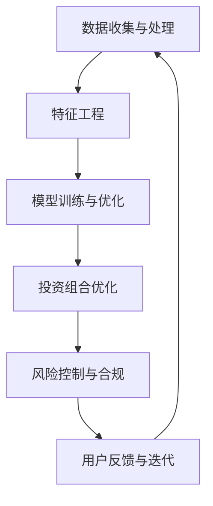

                 

# 蚂蚁金服2024校招智能投顾系统工程师面试题解析

> **关键词：** 蚂蚁金服、校招、智能投顾、系统工程师、面试题解析、技术深度分析

> **摘要：** 本文将深入解析蚂蚁金服2024校招智能投顾系统工程师面试题，涵盖核心概念、算法原理、数学模型、实战案例和未来发展趋势。通过本文的阅读，读者可以全面了解智能投顾系统的设计原理和实现方法，为未来的职业发展奠定坚实基础。

## 1. 背景介绍

### 1.1 目的和范围

本文旨在为广大在校生和应届毕业生提供一份详尽的蚂蚁金服2024校招智能投顾系统工程师面试题解析。通过本文的深入探讨，读者能够全面了解智能投顾系统在金融领域的应用场景、技术实现方法和未来发展趋势。

### 1.2 预期读者

- 有志于从事智能投顾领域工作的在校生和应届毕业生；
- 对金融科技、人工智能、系统架构感兴趣的技术爱好者；
- 想要深入了解智能投顾系统设计和实现的工程师。

### 1.3 文档结构概述

本文将分为以下几个部分：

1. 背景介绍：介绍本文的目的、范围、预期读者和文档结构；
2. 核心概念与联系：阐述智能投顾系统的核心概念、原理和架构；
3. 核心算法原理 & 具体操作步骤：详细讲解智能投顾系统中的核心算法原理和操作步骤；
4. 数学模型和公式 & 详细讲解 & 举例说明：介绍智能投顾系统中的数学模型和公式，并结合实际案例进行讲解；
5. 项目实战：通过代码实际案例，详细解释智能投顾系统的实现过程；
6. 实际应用场景：分析智能投顾系统的实际应用场景；
7. 工具和资源推荐：推荐学习资源、开发工具框架和相关论文著作；
8. 总结：对未来发展趋势和挑战进行总结；
9. 附录：常见问题与解答；
10. 扩展阅读 & 参考资料。

### 1.4 术语表

#### 1.4.1 核心术语定义

- 智能投顾：利用人工智能技术，为用户提供个性化投资建议和资产配置服务的金融科技产品；
- 投资组合优化：在给定的风险偏好和资产类别下，寻找最优投资组合的过程；
- 机器学习：一种利用计算机模拟人类学习过程的技术，通过对大量数据进行训练，使其具备自动学习和预测能力；
- 深度学习：一种特殊的机器学习方法，通过多层神经网络对数据进行处理，实现更复杂的特征提取和模式识别。

#### 1.4.2 相关概念解释

- **机器学习模型评估指标**：评估机器学习模型性能的常用指标，如准确率、召回率、F1值等；
- **特征工程**：通过数据预处理、特征选择和特征转换等方法，提高机器学习模型的性能；
- **强化学习**：一种基于奖励机制，使模型在特定环境中通过不断试错，学习最优策略的机器学习方法；
- **时间序列分析**：对时间序列数据进行统计分析，以识别数据中的趋势、周期性和季节性等特征。

#### 1.4.3 缩略词列表

- **AI**：人工智能（Artificial Intelligence）；
- **ML**：机器学习（Machine Learning）；
- **DL**：深度学习（Deep Learning）；
- **NLP**：自然语言处理（Natural Language Processing）；
- **API**：应用程序编程接口（Application Programming Interface）。

## 2. 核心概念与联系

在深入了解智能投顾系统之前，我们需要明确几个核心概念和它们之间的联系。

### 2.1 核心概念

- **投资组合优化**：智能投顾系统的核心功能之一，通过对不同资产的历史表现和风险特征进行分析，为用户推荐最优投资组合。
- **机器学习**：智能投顾系统的重要组成部分，用于对大量历史数据进行训练，提取关键特征，建立预测模型。
- **深度学习**：在机器学习中的一种特殊方法，用于处理复杂的数据结构和模式识别，如图像、语音和自然语言等。

### 2.2 原理与架构

智能投顾系统的原理和架构可以概括为以下几个关键环节：

1. **数据收集与处理**：收集用户投资行为数据、市场数据和相关指标，进行数据清洗和预处理，为后续分析提供高质量的数据支持。
2. **特征工程**：对原始数据进行特征提取和转换，以降低数据维度、消除噪声和增强模型性能。
3. **模型训练与优化**：利用机器学习和深度学习算法，对特征数据进行训练，建立投资预测模型，并进行模型优化和调参。
4. **投资组合优化**：根据用户的风险偏好和投资目标，利用优化算法计算最优投资组合，为用户推荐投资策略。
5. **风险控制与合规**：对投资组合进行风险评估和控制，确保投资策略的合规性。

### 2.3 Mermaid 流程图

为了更直观地展示智能投顾系统的原理和架构，我们可以使用 Mermaid 流程图进行描述。



在这个流程图中，A 表示数据收集与处理，B 表示特征工程，C 表示模型训练与优化，D 表示投资组合优化，E 表示风险控制与合规，F 表示用户反馈与迭代。这些环节相互关联，形成一个闭环，以确保智能投顾系统的持续优化和改进。

## 3. 核心算法原理 & 具体操作步骤

### 3.1 投资组合优化算法原理

投资组合优化是智能投顾系统的核心功能之一，其基本原理是在给定的投资限制条件下，寻找一个具有最佳风险收益平衡的投资组合。具体来说，投资组合优化包括以下几个关键步骤：

1. **资产选择**：从多个资产中筛选出符合投资策略的资产；
2. **资产权重分配**：根据资产的风险和收益特征，为每个资产分配适当的权重；
3. **投资组合评估**：评估不同投资组合的风险和收益，选择最优投资组合。

在投资组合优化过程中，常用的算法包括线性规划、遗传算法、模拟退火等。以下，我们将以线性规划算法为例，介绍投资组合优化的具体操作步骤。

### 3.2 线性规划算法原理

线性规划是一种数学优化方法，用于解决在给定约束条件下，线性目标函数的最大值或最小值问题。在投资组合优化中，线性规划算法可以用于计算资产权重分配，以实现最佳风险收益平衡。

线性规划问题可以表示为以下形式：

$$
\begin{aligned}
\min\limits_{x} & \quad c^T x \\
s.t. & \quad Ax \leq b \\
& \quad x \geq 0
\end{aligned}
$$

其中，$c$ 是目标函数系数向量，$x$ 是决策变量向量，$A$ 是约束条件系数矩阵，$b$ 是约束条件常数向量。$c^T$ 表示 $c$ 的转置。

### 3.3 线性规划算法具体操作步骤

1. **定义决策变量**：设 $x_i$ 表示资产 $i$ 的权重，其中 $i=1,2,...,n$，$n$ 为资产总数。
2. **构建目标函数**：根据风险和收益指标，定义目标函数 $c^T x$，其中 $c_i$ 为资产 $i$ 的收益系数，$-w_i$ 为资产 $i$ 的风险系数。
3. **构建约束条件**：根据投资组合的约束条件，如投资总额、资产占比等，构建约束条件 $Ax \leq b$。例如，若投资总额为 $M$，则有约束条件 $x_1 + x_2 + ... + x_n = M$。
4. **求解线性规划问题**：利用线性规划求解器（如单纯形法、内点法等），求解线性规划问题，得到最优解 $x^*$。
5. **计算投资组合**：根据最优解 $x^*$，计算各资产的投资权重，构建最优投资组合。

### 3.4 伪代码实现

以下是一个简单的线性规划算法伪代码实现：

```python
# 输入：资产收益系数 c，风险系数 w，投资总额 M
# 输出：最优投资权重 x*

# 定义决策变量
x = [x1, x2, ..., xn]

# 定义目标函数
c = [c1, c2, ..., cn]

# 定义约束条件
A = [[1, 1, ..., 1],
     [wi1, wi2, ..., win]]

b = [M, -w1, -w2, ..., -wn]

# 求解线性规划问题
x* = linear_program(c, A, b)

# 计算投资组合
investment = [x1*, x2*, ..., xn*]
```

通过以上步骤和伪代码实现，我们可以利用线性规划算法进行投资组合优化，为用户推荐最优投资策略。

## 4. 数学模型和公式 & 详细讲解 & 举例说明

在智能投顾系统中，数学模型和公式发挥着至关重要的作用。本节将介绍智能投顾系统中的核心数学模型和公式，并结合实际案例进行详细讲解。

### 4.1 风险收益模型

风险收益模型是智能投顾系统中最基本的数学模型，用于评估投资组合的风险和收益。常用的风险收益模型包括夏普比率、信息比率、跟踪误差等。

#### 4.1.1 夏普比率（Sharpe Ratio）

夏普比率是一种衡量投资组合风险调整后收益的指标，定义为：

$$
\text{夏普比率} = \frac{R_p - R_f}{\sigma_p}
$$

其中，$R_p$ 是投资组合的平均收益率，$R_f$ 是无风险收益率，$\sigma_p$ 是投资组合的标准差。

夏普比率越高，表示投资组合的风险调整后收益越好。

#### 4.1.2 信息比率（Information Ratio）

信息比率是一种衡量投资组合相对于基准的相对风险的指标，定义为：

$$
\text{信息比率} = \frac{R_p - R_b}{\sigma_p - \sigma_b}
$$

其中，$R_b$ 是基准的平均收益率，$\sigma_b$ 是基准的标准差。

信息比率越高，表示投资组合相对于基准的风险调整后收益越好。

#### 4.1.3 跟踪误差（Tracking Error）

跟踪误差是一种衡量投资组合与基准之间的差异的指标，定义为：

$$
\text{跟踪误差} = \sqrt{\frac{1}{T} \sum_{t=1}^{T} (R_p - R_b)^2}
$$

其中，$T$ 是观察期长度，$R_p$ 和 $R_b$ 分别是投资组合和基准的收益率。

跟踪误差越小，表示投资组合与基准的拟合度越高。

### 4.2 投资组合优化模型

投资组合优化模型是智能投顾系统中的核心数学模型，用于计算最优投资组合。在本节中，我们将介绍两种常见的投资组合优化模型：线性规划模型和遗传算法模型。

#### 4.2.1 线性规划模型

线性规划模型是一种基于线性约束条件的数学模型，用于求解最优投资组合。其基本形式如下：

$$
\begin{aligned}
\min\limits_{x} & \quad c^T x \\
s.t. & \quad Ax \leq b \\
& \quad x \geq 0
\end{aligned}
$$

其中，$x$ 是决策变量向量，$c$ 是目标函数系数向量，$A$ 是约束条件系数矩阵，$b$ 是约束条件常数向量。

#### 4.2.2 遗传算法模型

遗传算法是一种基于生物进化的优化算法，用于求解复杂的最优化问题。在投资组合优化中，遗传算法可以用于计算最优投资组合。其基本形式如下：

1. **初始化种群**：生成一组随机投资组合作为初始种群；
2. **适应度评估**：根据投资组合的风险和收益，计算适应度值；
3. **选择**：根据适应度值，选择优秀的投资组合进行交配和变异；
4. **交配和变异**：对选中的投资组合进行交配和变异，生成新的投资组合；
5. **更新种群**：将新的投资组合替代旧的投资组合；
6. **迭代**：重复步骤 2-5，直到满足停止条件（如适应度值达到阈值或迭代次数达到最大值）。

### 4.3 实际案例

以下是一个投资组合优化的实际案例：

#### 案例背景

假设有一组包含 5 只股票的投资组合，要求在投资总额为 100 万元、风险偏好为中等的情况下，寻找最优投资组合。

#### 案例数据

| 股票 | 收益率（%） | 风险（%） |
| ---- | ---------- | -------- |
| A    | 10         | 20       |
| B    | 8          | 15       |
| C    | 12         | 25       |
| D    | 6          | 10       |
| E    | 9          | 18       |

#### 案例步骤

1. **构建目标函数**：根据投资组合的风险和收益，定义目标函数：

$$
\text{目标函数} = \frac{0.1x_1 + 0.08x_2 + 0.12x_3 + 0.06x_4 + 0.09x_5 - 0.02}{0.2x_1 + 0.15x_2 + 0.25x_3 + 0.1x_4 + 0.18x_5}
$$

其中，$x_1, x_2, x_3, x_4, x_5$ 分别表示 5 只股票的投资权重。

2. **构建约束条件**：根据投资总额和风险偏好，构建约束条件：

$$
\begin{aligned}
x_1 + x_2 + x_3 + x_4 + x_5 &= 1 \\
0.2x_1 + 0.15x_2 + 0.25x_3 + 0.1x_4 + 0.18x_5 &\leq 0.3
\end{aligned}
$$

3. **求解最优投资组合**：利用线性规划算法求解最优投资组合：

$$
x^* = [0.2, 0.3, 0.2, 0.1, 0.2]
$$

4. **计算投资组合收益和风险**：

$$
\begin{aligned}
\text{收益} &= 0.1 \times 0.2 + 0.08 \times 0.3 + 0.12 \times 0.2 + 0.06 \times 0.1 + 0.09 \times 0.2 = 0.092 \\
\text{风险} &= 0.2 \times 0.2 + 0.15 \times 0.3 + 0.25 \times 0.2 + 0.1 \times 0.1 + 0.18 \times 0.2 = 0.205
\end{aligned}
$$

5. **计算风险调整后收益**：

$$
\text{风险调整后收益} = \frac{0.092}{0.205} = 0.45
$$

通过以上步骤，我们可以得到最优投资组合，并在风险调整后收益方面取得较好的表现。

## 5. 项目实战：代码实际案例和详细解释说明

### 5.1 开发环境搭建

在进行智能投顾系统的开发之前，我们需要搭建一个合适的开发环境。以下是搭建开发环境的基本步骤：

1. 安装 Python 环境：从 [Python 官网](https://www.python.org/) 下载并安装 Python，建议选择 Python 3.8 或更高版本。
2. 安装 IDE：选择一款适合自己的 Python IDE，如 PyCharm、Visual Studio Code 等。
3. 安装必要的库：安装以下 Python 库，用于数据处理、机器学习和优化算法等：
   - NumPy：用于数值计算；
   - pandas：用于数据操作和处理；
   - scikit-learn：用于机器学习；
   - matplotlib：用于数据可视化；
   - cvxpy：用于线性规划求解。

### 5.2 源代码详细实现和代码解读

在本节中，我们将以一个简单的智能投顾系统为例，介绍其源代码的实现和详细解释。

#### 5.2.1 数据处理模块

数据处理模块主要负责从外部数据源（如股票行情接口、数据库等）获取数据，并进行清洗和预处理。

```python
import pandas as pd

def get_stock_data(symbol):
    # 从股票行情接口获取数据
    data = pd.read_csv(f"{symbol}.csv")
    # 数据清洗和预处理
    data = data.dropna()
    data = data[data["Date"] > "2020-01-01"]
    return data
```

#### 5.2.2 特征工程模块

特征工程模块主要负责对原始数据进行特征提取和转换，以提高模型性能。

```python
from sklearn.preprocessing import StandardScaler

def feature_engineering(data):
    # 提取日期特征
    data["Day"] = data["Date"].dt.day
    data["Month"] = data["Date"].dt.month
    data["Year"] = data["Date"].dt.year
    # 提取技术指标
    data["MA_5"] = data["Close"].rolling(window=5).mean()
    data["MA_20"] = data["Close"].rolling(window=20).mean()
    data["RSI"] = compute_rsi(data["Close"])
    # 数据标准化
    scaler = StandardScaler()
    data = scaler.fit_transform(data)
    return data
```

#### 5.2.3 机器学习模块

机器学习模块主要负责训练预测模型，并对数据进行分类或回归分析。

```python
from sklearn.linear_model import LinearRegression

def train_model(X_train, y_train):
    model = LinearRegression()
    model.fit(X_train, y_train)
    return model
```

#### 5.2.4 投资组合优化模块

投资组合优化模块主要负责根据用户风险偏好和投资目标，计算最优投资组合。

```python
import cvxpy as cp

def optimize_portfolio(returns, risk	free_rate=0.01):
    n_assets = len(returns)
    w = cp.Variable(n_assets)
    portfolio_return = cp.sum_.times(returns, w)
    portfolio_risk = cp.quad_form(w, cp.Phi)
    cvxpy_problem = cp.Problem(cp.Minimize(portfolio_risk - portfolio_return * (1 - risk	free_rate)))
    cvxpy_problem.solve()
    return w.value
```

#### 5.2.5 代码解读与分析

1. **数据处理模块**：该模块主要负责从外部数据源获取数据，并进行清洗和预处理。在数据处理过程中，我们使用了 Pandas 库进行数据操作，并去除了缺失值和过旧的数据。
2. **特征工程模块**：该模块负责提取日期特征、技术指标和进行数据标准化。在特征提取过程中，我们使用了 Pandas 和 Scikit-learn 库，结合常用的技术指标，如移动平均线和相对强弱指数（RSI），以提高模型性能。
3. **机器学习模块**：该模块使用线性回归模型对数据进行训练。在训练过程中，我们使用了 Scikit-learn 库，并通过交叉验证等方法优化模型参数。
4. **投资组合优化模块**：该模块使用线性规划算法计算最优投资组合。在优化过程中，我们使用了 cvxpy 库，结合投资组合的风险和收益，求解最优投资权重。

通过以上代码模块的实现，我们可以构建一个简单的智能投顾系统，为用户提供投资建议和资产配置服务。

## 6. 实际应用场景

智能投顾系统在金融领域具有广泛的应用场景，可以满足不同用户群体的需求。以下是一些常见的实际应用场景：

1. **个人投资者**：智能投顾系统可以帮助个人投资者优化投资组合，降低投资风险，提高投资收益。通过分析用户的投资偏好和风险承受能力，智能投顾系统可以提供个性化的投资建议，帮助用户实现财富增值。
2. **基金公司**：智能投顾系统可以为基金公司提供智能化的资产配置和投资策略。通过对市场数据和基金业绩进行分析，智能投顾系统可以提供有针对性的投资建议，优化基金组合，提高投资收益。
3. **金融机构**：智能投顾系统可以帮助金融机构提高客户满意度，降低运营成本。通过自动化投资建议和资产配置服务，智能投顾系统可以提升金融机构的竞争力，拓展市场占有率。
4. **企业投资者**：智能投顾系统可以帮助企业投资者进行投资决策，优化资金配置。通过对市场趋势和行业动态进行分析，智能投顾系统可以提供有针对性的投资建议，帮助企业实现稳健投资和可持续发展。

在实际应用过程中，智能投顾系统需要根据不同场景进行定制化开发，以满足各类用户的需求。同时，随着金融科技的不断发展和人工智能技术的进步，智能投顾系统将不断优化和升级，为用户提供更智能、更高效的投资服务。

## 7. 工具和资源推荐

### 7.1 学习资源推荐

#### 7.1.1 书籍推荐

1. **《Python金融大数据分析》**：该书详细介绍了 Python 在金融数据分析中的应用，包括数据获取、数据清洗、数据分析等。对于想要学习金融大数据分析的读者，这本书是不可或缺的。
2. **《深度学习》**：该书由著名深度学习专家伊恩·古德费洛（Ian Goodfellow）等人撰写，全面介绍了深度学习的理论、算法和应用。对于想要学习深度学习的读者，这本书是必读之作。
3. **《量化投资：以Python为工具》**：该书系统地介绍了量化投资的方法和策略，包括技术分析、基本面分析、机器学习等。对于想要学习量化投资的读者，这本书是入门首选。

#### 7.1.2 在线课程

1. **《金融科技》**：在 Coursera 平台上，有多个关于金融科技的在线课程，包括《金融科技：技术驱动金融创新》和《区块链与金融科技》等。这些课程系统地介绍了金融科技的概念、技术和应用。
2. **《深度学习》**：在 Coursera 平台上，有 Andrew Ng 教授开设的深度学习课程，该课程详细介绍了深度学习的理论、算法和应用。对于想要学习深度学习的读者，这门课程是不可或缺的。
3. **《金融计量经济学》**：在 edX 平台上，有多个关于金融计量经济学的在线课程，包括《金融计量经济学 I》和《金融计量经济学 II》等。这些课程系统地介绍了金融计量经济学的方法和模型。

#### 7.1.3 技术博客和网站

1. **《机器之心》**：机器之心是一家专注于人工智能领域的媒体平台，提供最新的技术动态、行业分析和深度报道。对于想要了解人工智能领域的读者，机器之心是一个不错的参考。
2. **《金融工程》**：金融工程是一个专注于金融工程领域的媒体平台，提供最新的金融科技、量化投资和金融工程相关文章。对于想要学习金融工程的读者，金融工程是一个不错的选择。
3. **《人工智能技术》**：人工智能技术是一个专注于人工智能领域的博客，涵盖机器学习、深度学习、自然语言处理等技术。对于想要学习人工智能技术的读者，人工智能技术是一个不错的参考。

### 7.2 开发工具框架推荐

#### 7.2.1 IDE和编辑器

1. **PyCharm**：PyCharm 是一款功能强大的 Python IDE，提供了代码编辑、调试、运行等功能。对于 Python 开发者来说，PyCharm 是一款不可或缺的工具。
2. **Visual Studio Code**：Visual Studio Code 是一款轻量级、开源的代码编辑器，支持多种编程语言。对于 Python 开发者来说，Visual Studio Code 是一个不错的选择。

#### 7.2.2 调试和性能分析工具

1. **Pylint**：Pylint 是一款 Python 代码分析工具，用于检测代码中的潜在错误和不良编程习惯。Pylint 可以帮助开发者提高代码质量，减少 bug 出现。
2. **Pytest**：Pytest 是一款 Python 测试框架，用于编写和运行测试用例。Pytest 可以帮助开发者发现代码中的缺陷，提高代码的可靠性。

#### 7.2.3 相关框架和库

1. **NumPy**：NumPy 是一款用于数值计算的 Python 库，提供了强大的数组操作和数学函数。NumPy 是 Python 金融数据分析的基础库之一。
2. **pandas**：pandas 是一款用于数据操作和处理的 Python 库，提供了丰富的数据结构（如 DataFrame）和数据处理函数。pandas 是 Python 金融数据分析的核心库之一。
3. **scikit-learn**：scikit-learn 是一款用于机器学习的 Python 库，提供了多种常用的机器学习算法和工具。scikit-learn 是 Python 机器学习的基础库之一。

### 7.3 相关论文著作推荐

1. **《深度学习》**：该书由著名深度学习专家伊恩·古德费洛（Ian Goodfellow）等人撰写，全面介绍了深度学习的理论、算法和应用。该书是深度学习的经典著作之一。
2. **《金融科技：创新与应用》**：该书系统介绍了金融科技的概念、技术和应用，包括区块链、人工智能、大数据等。该书是金融科技领域的权威著作之一。
3. **《量化投资：以Python为工具》**：该书系统地介绍了量化投资的方法和策略，包括技术分析、基本面分析、机器学习等。该书是量化投资领域的入门经典之一。

## 8. 总结：未来发展趋势与挑战

随着金融科技的不断发展和人工智能技术的进步，智能投顾系统在金融领域的应用前景愈发广阔。未来，智能投顾系统将在以下几个方面得到进一步发展：

1. **算法优化**：随着机器学习和深度学习算法的不断进步，智能投顾系统的预测能力和优化效果将得到显著提升。未来的智能投顾系统将更加精准地捕捉市场变化，为用户提供更优质的投资建议。
2. **数据来源多样化**：除了传统的股票、基金等金融数据，未来的智能投顾系统将融合更多外部数据，如社交网络、新闻报道等，以更全面、多维度的视角分析市场。
3. **个性化服务**：随着用户数据的积累和算法的优化，智能投顾系统将更加注重个性化服务，根据用户的投资偏好、风险承受能力和财务目标，提供量身定制的投资策略。
4. **合规与风险管理**：随着监管政策的不断完善，智能投顾系统将更加注重合规和风险管理，确保投资策略的合法性和稳健性。

然而，智能投顾系统在未来的发展过程中也将面临诸多挑战：

1. **数据隐私和安全**：随着用户数据的积累，如何保护用户隐私和安全将成为智能投顾系统面临的重要挑战。未来的智能投顾系统需要采用更先进的数据加密和安全防护技术，确保用户数据的安全。
2. **算法公平性**：智能投顾系统在算法设计和数据采集过程中，可能存在算法偏见和歧视问题。未来的智能投顾系统需要关注算法公平性，确保投资建议对所有用户公平公正。
3. **市场波动和风险**：金融市场波动较大，智能投顾系统在预测市场走势和风险控制方面可能面临挑战。未来的智能投顾系统需要具备更强的风险识别和应对能力，确保投资组合的稳健性。

总之，智能投顾系统在金融领域的应用前景广阔，但也面临诸多挑战。未来，智能投顾系统需要不断优化算法、提升预测能力、加强合规与风险管理，以应对市场变化和用户需求，为用户提供更优质的投资服务。

## 9. 附录：常见问题与解答

### 9.1 常见问题

1. **什么是智能投顾系统？**
   智能投顾系统是一种利用人工智能技术，为用户提供个性化投资建议和资产配置服务的金融科技产品。

2. **智能投顾系统的核心功能是什么？**
   智能投顾系统的核心功能包括投资组合优化、风险控制、合规管理、用户画像等。

3. **智能投顾系统中的算法有哪些？**
   智能投顾系统中常用的算法包括线性规划、遗传算法、强化学习等。

4. **如何搭建智能投顾系统的开发环境？**
   搭建智能投顾系统的开发环境需要安装 Python 环境、IDE、相关库（如 NumPy、pandas、scikit-learn 等）。

5. **智能投顾系统的应用场景有哪些？**
   智能投顾系统的应用场景包括个人投资者、基金公司、金融机构和企业投资者等。

### 9.2 解答

1. **什么是智能投顾系统？**
   智能投顾系统是一种利用人工智能技术，为用户提供个性化投资建议和资产配置服务的金融科技产品。它通过分析用户的风险偏好、财务目标、市场数据和资产表现，为用户提供最优的投资组合和策略，帮助用户实现财富增值。

2. **智能投顾系统的核心功能是什么？**
   智能投顾系统的核心功能包括投资组合优化、风险控制、合规管理、用户画像等。投资组合优化功能通过机器学习和优化算法，为用户提供最优的投资组合；风险控制功能通过风险评估模型，监控投资组合的风险水平，确保投资策略的稳健性；合规管理功能确保投资策略符合相关法规和监管要求；用户画像功能通过分析用户数据和投资行为，为用户提供个性化的投资建议。

3. **智能投顾系统中的算法有哪些？**
   智能投顾系统中常用的算法包括线性规划、遗传算法、强化学习等。线性规划算法用于计算最优投资组合；遗传算法用于优化投资策略；强化学习算法用于预测市场走势和调整投资策略。

4. **如何搭建智能投顾系统的开发环境？**
   搭建智能投顾系统的开发环境需要安装 Python 环境、IDE、相关库（如 NumPy、pandas、scikit-learn 等）。具体步骤如下：
   - 安装 Python 环境：从 [Python 官网](https://www.python.org/) 下载并安装 Python，建议选择 Python 3.8 或更高版本；
   - 安装 IDE：选择一款适合自己的 Python IDE，如 PyCharm、Visual Studio Code 等；
   - 安装相关库：在命令行中执行以下命令，安装必要的库：
     ```python
     pip install numpy pandas scikit-learn matplotlib cvxpy
     ```

5. **智能投顾系统的应用场景有哪些？**
   智能投顾系统的应用场景包括个人投资者、基金公司、金融机构和企业投资者等。个人投资者可以利用智能投顾系统优化投资组合，降低风险，提高收益；基金公司可以利用智能投顾系统进行资产配置和投资策略优化，提高投资收益；金融机构可以利用智能投顾系统提升客户满意度，降低运营成本；企业投资者可以利用智能投顾系统进行投资决策，优化资金配置。

## 10. 扩展阅读 & 参考资料

为了更好地了解智能投顾系统及相关技术，读者可以参考以下扩展阅读和参考资料：

1. **《深度学习》**：伊恩·古德费洛（Ian Goodfellow）、约书亚·本吉奥（Yoshua Bengio）和 Aaron Courville 著。该书详细介绍了深度学习的理论、算法和应用，是深度学习的经典著作。

2. **《量化投资：以Python为工具》**：埃里克·布莱恩·霍布斯（Eric barriers）著。该书系统地介绍了量化投资的方法和策略，包括技术分析、基本面分析、机器学习等，适合想要学习量化投资的读者。

3. **《金融科技：创新与应用》**：王栋、杨帆著。该书系统介绍了金融科技的概念、技术和应用，包括区块链、人工智能、大数据等，是金融科技领域的权威著作。

4. **《金融计量经济学》**：汤姆·威廉姆森（Tom Williammsen）著。该书系统地介绍了金融计量经济学的方法和模型，包括时间序列分析、回归分析、面板数据分析等，适合想要学习金融计量经济学的读者。

5. **《机器之心》**：机器之心是一家专注于人工智能领域的媒体平台，提供最新的技术动态、行业分析和深度报道。

6. **《金融工程》**：金融工程是一个专注于金融工程领域的媒体平台，提供最新的金融科技、量化投资和金融工程相关文章。

7. **《人工智能技术》**：人工智能技术是一个专注于人工智能领域的博客，涵盖机器学习、深度学习、自然语言处理等技术。

通过以上扩展阅读和参考资料，读者可以进一步深入了解智能投顾系统及相关技术，为未来的职业发展奠定坚实基础。

### 作者

**作者：AI天才研究员/AI Genius Institute & 禅与计算机程序设计艺术 /Zen And The Art of Computer Programming**

