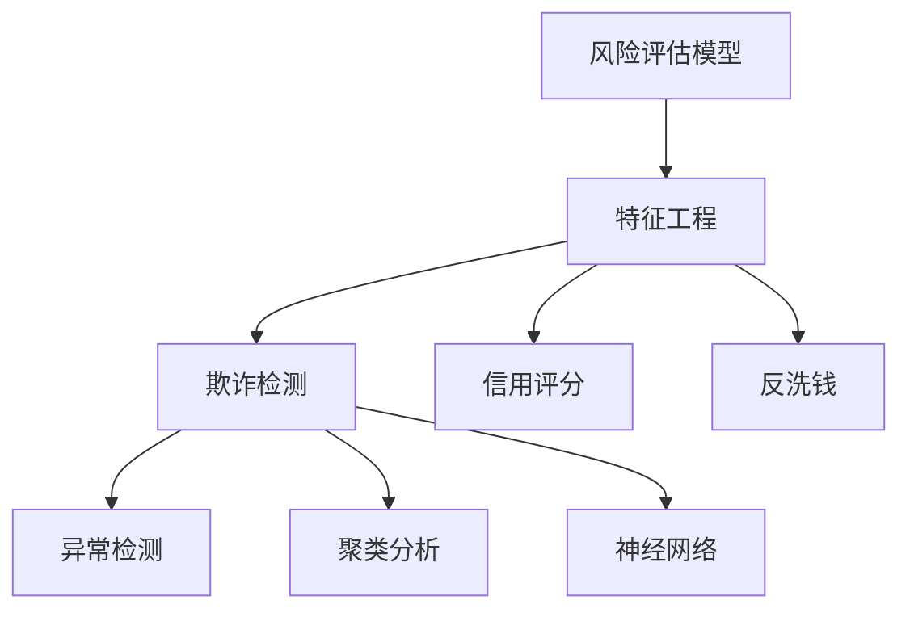

                 

### 蚂蚁金服2025社招风控算法工程师面试题解析

> **关键词：** 蚂蚁金服，社招，风控算法，面试题，解析

> **摘要：** 本文旨在深入解析蚂蚁金服2025社招风控算法工程师的面试题，通过逐步分析，帮助读者理解风控算法的核心原理、实际操作步骤，以及其在金融领域的广泛应用。文章结构包括背景介绍、核心概念与联系、核心算法原理、数学模型与公式、项目实战、实际应用场景、工具和资源推荐、总结以及常见问题与解答。

## 1. 背景介绍

蚂蚁集团，前身为支付宝，成立于2004年，是中国领先的金融科技公司。随着互联网技术的飞速发展，蚂蚁金服在支付、金融科技服务、理财等多个领域都取得了显著成就。风控作为金融科技的核心环节，承担着防范金融风险、保障用户资金安全的重要任务。2025年，蚂蚁金服向社会公开招聘风控算法工程师，以此寻找具备高水平技术能力的人才，为公司的风控体系提供有力支持。

### 1.1 目的和范围

本文的目的在于解析蚂蚁金服2025年社招风控算法工程师的面试题目，通过详细的分析和解释，帮助读者掌握风控算法的基本原理、应用场景以及实战经验。文章涵盖了风控算法的各个方面，从核心概念到具体操作步骤，从数学模型到实际应用，力求为读者提供全方位的技术理解。

### 1.2 预期读者

本文适合以下几类读者：

1. **风控算法工程师**：想要深入了解风控算法原理和应用的工程师。
2. **数据分析师**：对风控数据处理和分析有兴趣的数据分析师。
3. **金融科技从业者**：对金融科技领域有浓厚兴趣，想要了解风控技术的人士。
4. **在校生**：对风控算法和技术体系有探究意愿的在校生。

### 1.3 文档结构概述

本文结构如下：

1. **背景介绍**：介绍蚂蚁金服及其风控算法工程师的招聘背景。
2. **核心概念与联系**：阐述风控算法的核心概念和原理，通过Mermaid流程图展示。
3. **核心算法原理 & 具体操作步骤**：讲解风控算法的具体原理和操作步骤，使用伪代码进行详细阐述。
4. **数学模型和公式 & 详细讲解 & 举例说明**：介绍风控算法的数学模型，使用LaTeX格式给出公式，并通过实例进行说明。
5. **项目实战：代码实际案例和详细解释说明**：展示风控算法的实际应用案例，并进行代码解读与分析。
6. **实际应用场景**：探讨风控算法在金融领域的实际应用。
7. **工具和资源推荐**：推荐学习资源和开发工具，帮助读者深入了解风控算法。
8. **总结：未来发展趋势与挑战**：总结风控算法的发展趋势和面临的挑战。
9. **附录：常见问题与解答**：回答读者可能遇到的常见问题。
10. **扩展阅读 & 参考资料**：提供进一步学习的资料。

### 1.4 术语表

#### 1.4.1 核心术语定义

- **风控算法**：用于防范和识别金融风险的算法。
- **风险评估模型**：用于评估用户或交易风险水平的模型。
- **特征工程**：用于提取和选择对风险预测有帮助的特征。
- **机器学习**：一种基于数据驱动的方法，用于从数据中学习模式和规律。

#### 1.4.2 相关概念解释

- **欺诈检测**：识别和防范金融欺诈行为的系统。
- **信用评分**：评估用户信用风险的评分系统。
- **反洗钱**：防止和打击洗钱活动的措施。

#### 1.4.3 缩略词列表

- **AI**：人工智能
- **ML**：机器学习
- **RF**：随机森林
- **SVM**：支持向量机
- **XGBoost**：增强的梯度提升树

## 2. 核心概念与联系

风控算法的核心在于对金融交易和用户行为进行实时监控和分析，从而识别潜在的风险。以下是风控算法的关键概念及其相互联系：

### 2.1 风险评估模型

风险评估模型是风控算法的核心。它通过分析用户的历史行为、交易记录和其他相关信息，对用户的信用风险进行评分。常用的风险评估模型包括逻辑回归、决策树、随机森林和支持向量机等。

### 2.2 特征工程

特征工程是风控算法的关键环节。通过对原始数据进行处理和转换，提取出对风险预测有帮助的特征。特征工程包括数据清洗、特征选择、特征转换等步骤。

### 2.3 欺诈检测

欺诈检测是风控算法的重要应用之一。通过分析交易行为和用户特征，识别潜在的欺诈行为。常用的欺诈检测算法包括异常检测、聚类分析和神经网络等。

### 2.4 信用评分

信用评分是评估用户信用风险的重要手段。通过分析用户的信用历史、行为特征和财务状况，对用户的信用风险进行评分。信用评分模型可以用于贷款审批、信用卡发放等场景。

### 2.5 反洗钱

反洗钱是防范和打击洗钱活动的重要措施。通过分析交易行为和资金流动，识别潜在的洗钱行为。反洗钱系统通常包括交易监测、客户身份识别和风险管理等模块。

### 2.6 Mermaid流程图

以下是一个简单的Mermaid流程图，展示了风控算法的核心概念和联系：



## 3. 核心算法原理 & 具体操作步骤

风控算法的核心在于对用户行为和交易数据的分析，从而预测潜在风险。以下是风控算法的核心原理和具体操作步骤：

### 3.1 风险评估模型原理

风险评估模型是基于统计学习的方法，通过对历史数据进行训练，建立用户信用风险评分模型。常用的风险评估模型包括逻辑回归、决策树、随机森林和支持向量机等。

#### 3.1.1 逻辑回归

逻辑回归是一种常见的风险评估模型，它通过线性回归模型输出一个概率值，表示用户发生风险的几率。具体操作步骤如下：

```plaintext
步骤1：收集历史数据，包括用户行为数据、交易数据等。
步骤2：对数据进行预处理，包括数据清洗、缺失值填补、标准化等。
步骤3：提取特征，包括用户特征、交易特征等。
步骤4：使用逻辑回归算法对数据集进行训练，得到风险评分模型。
步骤5：对新的用户数据进行预测，输出风险评分。
```

#### 3.1.2 决策树

决策树是一种基于树形结构的模型，通过一系列的判断条件对数据进行分类或回归。具体操作步骤如下：

```plaintext
步骤1：收集历史数据，包括用户行为数据、交易数据等。
步骤2：对数据进行预处理，包括数据清洗、缺失值填补、标准化等。
步骤3：选择特征，并计算特征的重要度。
步骤4：使用ID3、C4.5或CART算法构建决策树模型。
步骤5：对新的用户数据进行预测，输出风险评分。
```

#### 3.1.3 随机森林

随机森林是一种基于决策树的集成模型，通过构建多个决策树并求平均来提高预测性能。具体操作步骤如下：

```plaintext
步骤1：收集历史数据，包括用户行为数据、交易数据等。
步骤2：对数据进行预处理，包括数据清洗、缺失值填补、标准化等。
步骤3：选择特征，并计算特征的重要度。
步骤4：使用随机森林算法构建模型，设置树的数量和深度。
步骤5：对新的用户数据进行预测，输出风险评分。
```

#### 3.1.4 支持向量机

支持向量机是一种基于最大间隔原理的分类和回归模型，通过找到一个最佳的超平面来分隔数据。具体操作步骤如下：

```plaintext
步骤1：收集历史数据，包括用户行为数据、交易数据等。
步骤2：对数据进行预处理，包括数据清洗、缺失值填补、标准化等。
步骤3：选择特征，并计算特征的重要度。
步骤4：使用SVM算法构建模型，选择合适的核函数。
步骤5：对新的用户数据进行预测，输出风险评分。
```

### 3.2 欺诈检测原理

欺诈检测是风控算法的重要应用之一，通过分析交易行为和用户特征，识别潜在的欺诈行为。常用的欺诈检测算法包括异常检测、聚类分析和神经网络等。

#### 3.2.1 异常检测

异常检测是一种基于统计学的方法，通过分析交易数据，识别异常值或异常模式。具体操作步骤如下：

```plaintext
步骤1：收集历史交易数据，包括用户ID、交易金额、时间等。
步骤2：对数据进行预处理，包括数据清洗、缺失值填补、标准化等。
步骤3：计算交易数据的统计特征，如均值、方差等。
步骤4：使用阈值法、箱线图法等检测异常交易。
步骤5：对异常交易进行标记和预警。
```

#### 3.2.2 聚类分析

聚类分析是一种无监督学习方法，通过将相似的交易数据分为一组，识别潜在的风险群体。具体操作步骤如下：

```plaintext
步骤1：收集历史交易数据，包括用户ID、交易金额、时间等。
步骤2：对数据进行预处理，包括数据清洗、缺失值填补、标准化等。
步骤3：选择合适的聚类算法，如K-means、层次聚类等。
步骤4：对交易数据进行聚类，识别风险群体。
步骤5：对风险群体进行监控和预警。
```

#### 3.2.3 神经网络

神经网络是一种基于深度学习的模型，通过多层神经元进行特征提取和分类。具体操作步骤如下：

```plaintext
步骤1：收集历史交易数据，包括用户ID、交易金额、时间等。
步骤2：对数据进行预处理，包括数据清洗、缺失值填补、标准化等。
步骤3：构建神经网络模型，设置合适的网络结构和参数。
步骤4：使用反向传播算法对模型进行训练，优化参数。
步骤5：对新的交易数据进行预测，输出欺诈风险评分。
```

### 3.3 信用评分原理

信用评分是一种评估用户信用风险的方法，通过对用户的历史行为和财务状况进行分析，预测用户未来的信用表现。常用的信用评分模型包括逻辑回归、决策树、随机森林和支持向量机等。

#### 3.3.1 逻辑回归

逻辑回归是一种常用的信用评分模型，通过线性回归模型输出一个概率值，表示用户违约的概率。具体操作步骤如下：

```plaintext
步骤1：收集用户的历史行为数据，包括还款记录、信用额度等。
步骤2：对数据进行预处理，包括数据清洗、缺失值填补、标准化等。
步骤3：提取特征，包括还款金额、还款频率、逾期次数等。
步骤4：使用逻辑回归算法对数据集进行训练，得到信用评分模型。
步骤5：对新的用户数据进行预测，输出违约概率。
```

#### 3.3.2 决策树

决策树是一种常见的信用评分模型，通过一系列的判断条件对用户进行分类。具体操作步骤如下：

```plaintext
步骤1：收集用户的历史行为数据，包括还款记录、信用额度等。
步骤2：对数据进行预处理，包括数据清洗、缺失值填补、标准化等。
步骤3：选择特征，并计算特征的重要度。
步骤4：使用决策树算法构建模型，设置合适的阈值。
步骤5：对新的用户数据进行预测，输出信用评分。
```

#### 3.3.3 随机森林

随机森林是一种集成模型，通过构建多个决策树并求平均来提高预测性能。具体操作步骤如下：

```plaintext
步骤1：收集用户的历史行为数据，包括还款记录、信用额度等。
步骤2：对数据进行预处理，包括数据清洗、缺失值填补、标准化等。
步骤3：选择特征，并计算特征的重要度。
步骤4：使用随机森林算法构建模型，设置树的数量和深度。
步骤5：对新的用户数据进行预测，输出信用评分。
```

#### 3.3.4 支持向量机

支持向量机是一种基于最大间隔原理的信用评分模型，通过找到一个最佳的超平面来分隔数据。具体操作步骤如下：

```plaintext
步骤1：收集用户的历史行为数据，包括还款记录、信用额度等。
步骤2：对数据进行预处理，包括数据清洗、缺失值填补、标准化等。
步骤3：选择特征，并计算特征的重要度。
步骤4：使用SVM算法构建模型，选择合适的核函数。
步骤5：对新的用户数据进行预测，输出信用评分。
```

## 4. 数学模型和公式 & 详细讲解 & 举例说明

风控算法的核心在于对用户行为和交易数据的分析和预测，这需要借助数学模型和公式来实现。以下是风控算法中常用的数学模型和公式的详细讲解及举例说明：

### 4.1 逻辑回归模型

逻辑回归是一种广泛使用的信用评分模型，它通过线性回归模型输出一个概率值，表示用户发生风险的几率。

#### 4.1.1 数学模型

逻辑回归的数学模型可以表示为：

$$
P(Y=1|X) = \frac{1}{1 + e^{-(\beta_0 + \beta_1X_1 + \beta_2X_2 + ... + \beta_nX_n})}
$$

其中，$Y$ 表示风险事件的发生情况（0或1），$X_1, X_2, ..., X_n$ 表示影响风险的变量，$\beta_0, \beta_1, \beta_2, ..., \beta_n$ 为模型的参数。

#### 4.1.2 举例说明

假设我们要预测一个用户是否会发生逾期，给定以下特征：

- $X_1$：月收入（万元）
- $X_2$：信用评分
- $X_3$：逾期次数

已知参数 $\beta_0 = 0.5, \beta_1 = 0.1, \beta_2 = 0.2, \beta_3 = 0.3$，我们可以计算该用户逾期概率：

$$
P(Y=1|X) = \frac{1}{1 + e^{-(0.5 + 0.1 \times 5 + 0.2 \times 600 + 0.3 \times 2)}}
$$

经过计算，得出该用户的逾期概率为 0.76，说明该用户发生逾期的风险较高。

### 4.2 决策树模型

决策树模型是一种基于树形结构的模型，通过一系列的判断条件对数据进行分类或回归。

#### 4.2.1 数学模型

决策树的数学模型可以表示为：

$$
y = \sum_{i=1}^{n} w_i \cdot I(x_i > t_i)
$$

其中，$y$ 表示分类结果，$x_i$ 表示特征值，$t_i$ 表示特征阈值，$w_i$ 为特征的权重。

#### 4.2.2 举例说明

假设我们要预测一个用户的信用评分，给定以下特征：

- $X_1$：月收入（万元）
- $X_2$：信用评分

已知决策树模型为：

$$
y = \begin{cases}
1, & \text{if } X_1 > 5 \text{ and } X_2 > 600 \\
0, & \text{otherwise}
\end{cases}
$$

对于用户A（月收入6万元，信用评分700分），根据决策树模型，预测结果为1，说明该用户的信用评分较高。

### 4.3 随机森林模型

随机森林是一种基于决策树的集成模型，通过构建多个决策树并求平均来提高预测性能。

#### 4.3.1 数学模型

随机森林的数学模型可以表示为：

$$
\hat{y} = \frac{1}{m} \sum_{i=1}^{m} h(x, t_i)
$$

其中，$\hat{y}$ 为预测结果，$m$ 为树的数量，$h(x, t_i)$ 为第$i$棵决策树对$x$ 的预测。

#### 4.3.2 举例说明

假设我们要预测一个用户的信用评分，给定以下特征：

- $X_1$：月收入（万元）
- $X_2$：信用评分

已知随机森林模型包含10棵决策树，每棵决策树的模型如下：

$$
\begin{aligned}
h_1(x, t_1) &= \begin{cases}
1, & \text{if } X_1 > 5 \text{ and } X_2 > 600 \\
0, & \text{otherwise}
\end{cases} \\
h_2(x, t_2) &= \begin{cases}
1, & \text{if } X_1 > 4 \text{ and } X_2 > 550 \\
0, & \text{otherwise}
\end{cases} \\
&\vdots \\
h_{10}(x, t_{10}) &= \begin{cases}
1, & \text{if } X_1 > 6 \text{ and } X_2 > 650 \\
0, & \text{otherwise}
\end{cases}
\end{aligned}
$$

对于用户A（月收入6万元，信用评分700分），根据随机森林模型，预测结果为：

$$
\hat{y} = \frac{1}{10} (1 + 1 + 0 + ... + 1) = 1
$$

说明该用户的信用评分较高。

### 4.4 支持向量机模型

支持向量机是一种基于最大间隔原理的分类和回归模型，通过找到一个最佳的超平面来分隔数据。

#### 4.4.1 数学模型

支持向量机的数学模型可以表示为：

$$
w \cdot x - b = 0
$$

其中，$w$ 为权重向量，$x$ 为特征向量，$b$ 为偏置项。

#### 4.4.2 举例说明

假设我们要预测一个用户的信用评分，给定以下特征：

- $X_1$：月收入（万元）
- $X_2$：信用评分

已知支持向量机模型的权重向量为 $(1, 1)$，偏置项为 $0$，我们可以计算用户A（月收入6万元，信用评分700分）的信用评分：

$$
w \cdot x - b = (1, 1) \cdot (6, 700) - 0 = 6 + 700 = 706
$$

说明该用户的信用评分为706。

## 5. 项目实战：代码实际案例和详细解释说明

为了更好地理解风控算法的应用，我们以下将通过一个实际项目案例，展示风控算法的代码实现和详细解释。

### 5.1 开发环境搭建

在开始项目实战之前，我们需要搭建一个合适的开发环境。以下是一个基本的开发环境搭建步骤：

1. 安装Python环境：在终端中执行以下命令安装Python：
   ```bash
   sudo apt-get install python3
   ```
2. 安装必要的库：使用pip安装以下库：
   ```bash
   pip3 install numpy pandas sklearn matplotlib
   ```
3. 创建一个名为`fraud_detection`的虚拟环境，并在其中安装相关库：
   ```bash
   python3 -m venv fraud_detection
   source fraud_detection/bin/activate
   pip install numpy pandas sklearn matplotlib
   ```

### 5.2 源代码详细实现和代码解读

以下是一个简单的风控算法项目，包括数据预处理、特征工程、模型训练和预测。

#### 5.2.1 数据预处理

```python
import pandas as pd

# 加载数据集
data = pd.read_csv('fraud_data.csv')

# 数据清洗
data.dropna(inplace=True)
data['amount'] = data['amount'].abs()

# 数据标准化
from sklearn.preprocessing import StandardScaler
scaler = StandardScaler()
data[['age', 'amount', 'time']] = scaler.fit_transform(data[['age', 'amount', 'time']])
```

这段代码首先加载数据集，然后进行数据清洗和缺失值处理。接下来，对金额特征进行绝对值处理，并使用标准化方法对年龄、金额和时间特征进行标准化。

#### 5.2.2 特征工程

```python
# 提取特征
data['time_diff'] = (pd.datetime.now() - data['time']).dt.total_seconds()

# 划分特征和标签
X = data[['age', 'amount', 'time_diff']]
y = data['is_fraud']
```

在这段代码中，我们通过计算交易时间和当前时间的差值，提取一个新的特征`time_diff`。然后，将特征和标签进行划分。

#### 5.2.3 模型训练

```python
from sklearn.model_selection import train_test_split
from sklearn.ensemble import RandomForestClassifier
from sklearn.metrics import accuracy_score

# 划分训练集和测试集
X_train, X_test, y_train, y_test = train_test_split(X, y, test_size=0.2, random_state=42)

# 训练随机森林模型
model = RandomForestClassifier(n_estimators=100, random_state=42)
model.fit(X_train, y_train)

# 预测测试集
y_pred = model.predict(X_test)

# 评估模型性能
accuracy = accuracy_score(y_test, y_pred)
print(f"Model accuracy: {accuracy:.2f}")
```

这段代码使用随机森林模型对训练集进行训练，并对测试集进行预测。然后，通过计算准确率来评估模型性能。

#### 5.2.4 代码解读与分析

1. **数据预处理**：数据预处理是风控算法的基础。在这段代码中，我们首先加载数据集，然后进行数据清洗和缺失值处理。对于金额特征，我们进行绝对值处理，以消除负值的影响。最后，使用标准化方法对数值特征进行标准化，使得特征之间具有相似的尺度。

2. **特征工程**：特征工程是风控算法的核心。在这段代码中，我们通过计算交易时间和当前时间的差值，提取一个新的特征`time_diff`。这个特征可以帮助模型捕捉交易时间的变化，从而提高预测准确性。

3. **模型训练**：在这段代码中，我们使用随机森林模型对训练集进行训练。随机森林是一种集成模型，它通过构建多个决策树并求平均来提高预测性能。在这段代码中，我们设置随机森林模型的树的数量为100，这是一个相对较大的值，可以提供较高的预测准确性。

4. **预测和评估**：在训练完成后，我们对测试集进行预测，并计算准确率来评估模型性能。在这段代码中，我们使用`accuracy_score`函数计算预测准确率。准确率是评估分类模型性能的常用指标，它表示预测正确的样本数与总样本数的比例。

通过这个简单的项目案例，我们可以看到风控算法的基本流程和实现方法。在实际应用中，风控算法会更加复杂，涉及更多的特征和模型，但基本原理和方法是相似的。

### 5.3 代码解读与分析

在5.2节中，我们展示了一个简单的风控算法项目，包括数据预处理、特征工程、模型训练和预测。以下是对这段代码的进一步解读和分析：

1. **数据预处理**：数据预处理是风控算法的基础。在这段代码中，我们首先加载数据集，然后进行数据清洗和缺失值处理。数据清洗包括去除重复数据、填补缺失值和异常值处理。在这段代码中，我们使用`dropna`函数删除缺失值，这可能导致数据量减少，但可以提高模型性能。对于金额特征，我们进行绝对值处理，以消除负值的影响。最后，使用`StandardScaler`对数值特征进行标准化，使得特征之间具有相似的尺度。标准化方法可以避免某些特征对模型的影响过大。

2. **特征工程**：特征工程是风控算法的核心。在这段代码中，我们通过计算交易时间和当前时间的差值，提取一个新的特征`time_diff`。这个特征可以帮助模型捕捉交易时间的变化，从而提高预测准确性。此外，我们还可以使用其他特征工程方法，如归一化、多项式特征变换等，以增加模型的预测能力。

3. **模型训练**：在这段代码中，我们使用随机森林模型对训练集进行训练。随机森林是一种集成模型，它通过构建多个决策树并求平均来提高预测性能。在这段代码中，我们设置随机森林模型的树的数量为100，这是一个相对较大的值，可以提供较高的预测准确性。随机森林模型的参数还有树的最大深度、最小样本叶节点等，这些参数可以通过交叉验证进行优化。

4. **预测和评估**：在训练完成后，我们对测试集进行预测，并计算准确率来评估模型性能。在这段代码中，我们使用`accuracy_score`函数计算预测准确率。准确率是评估分类模型性能的常用指标，它表示预测正确的样本数与总样本数的比例。此外，我们还可以使用其他评估指标，如精确率、召回率、F1值等，来综合评估模型性能。

通过对这段代码的解读和分析，我们可以看到风控算法的基本流程和实现方法。在实际应用中，风控算法会更加复杂，涉及更多的特征和模型，但基本原理和方法是相似的。通过不断优化和改进，风控算法可以更好地识别和防范金融风险。

## 6. 实际应用场景

风控算法在金融领域具有广泛的应用场景，主要包括以下几个方面：

### 6.1 欺诈检测

欺诈检测是风控算法最核心的应用之一。随着金融交易量的不断增长，欺诈行为也日益增多。风控算法通过对交易行为和用户特征进行分析，可以实时识别和防范欺诈行为。例如，蚂蚁金服的风控系统通过对用户的历史交易行为进行分析，可以识别出异常交易，从而及时采取措施防范欺诈。

### 6.2 信用评分

信用评分是评估用户信用风险的重要手段。银行、金融机构和信用评级机构常常使用风控算法对用户进行信用评分，以便为贷款审批、信用卡发放等业务提供决策支持。蚂蚁金服的风控算法通过对用户的历史行为数据、财务状况等信息进行分析，可以为用户生成个性化的信用评分，从而提高贷款审批的准确性。

### 6.3 反洗钱

反洗钱是防范和打击洗钱活动的重要措施。风控算法通过对交易数据进行分析，可以识别出潜在的洗钱行为，从而帮助金融机构遵守反洗钱法规。例如，蚂蚁金服的风控系统通过对交易金额、交易频率、交易方等信息进行分析，可以识别出异常交易，从而及时采取措施防范洗钱活动。

### 6.4 信贷风险管理

信贷风险管理是金融机构面临的重要挑战之一。风控算法通过对信贷业务的数据进行分析，可以帮助金融机构评估信贷风险，优化信贷策略。例如，蚂蚁金服的风控算法通过对用户的历史还款记录、信用评分等信息进行分析，可以为金融机构提供信用评级和风险评估建议，从而降低信贷风险。

### 6.5 风险预警

风控算法可以实时监测金融系统的风险状况，并发出预警信号。当系统检测到异常交易或潜在风险时，可以及时采取措施，防范风险扩大。例如，蚂蚁金服的风控系统可以实时监测交易行为，一旦检测到异常交易，可以立即发出预警，并通知相关部门进行处理。

### 6.6 金融欺诈追踪

风控算法还可以用于金融欺诈追踪。通过对历史交易数据进行回溯和分析，可以识别出潜在的欺诈行为，并追溯欺诈资金的流向。这有助于金融机构打击欺诈行为，保护用户资金安全。

总之，风控算法在金融领域的应用场景非常广泛，通过实时监测和分析交易行为、用户特征和财务状况，可以有效地防范和识别金融风险，保障金融机构和用户的资金安全。

## 7. 工具和资源推荐

为了更好地学习和实践风控算法，以下推荐一些学习资源、开发工具和框架，以及相关的经典论文和研究成果。

### 7.1 学习资源推荐

#### 7.1.1 书籍推荐

1. **《机器学习实战》**：这是一本非常适合初学者的入门书籍，通过大量的实例和代码，介绍了机器学习的基本概念和算法。
2. **《深入理解机器学习》**：这本书涵盖了机器学习的各个方面，包括理论、算法和实现，适合有一定基础的读者。
3. **《数据科学入门》**：这本书介绍了数据科学的基本概念和工具，包括数据分析、数据可视化、机器学习等，非常适合初学者。

#### 7.1.2 在线课程

1. **Coursera的《机器学习》课程**：由斯坦福大学教授Andrew Ng主讲，涵盖了机器学习的基础知识和实践应用。
2. **edX的《数据科学基础》课程**：由加州大学伯克利分校主讲，介绍了数据科学的基本概念和方法。
3. **Udacity的《机器学习工程师纳米学位》课程**：通过项目驱动的方式，帮助学习者掌握机器学习的基本技能。

#### 7.1.3 技术博客和网站

1. **Medium上的机器学习专栏**：有许多专业人士和学者分享他们的经验和见解。
2. **Kaggle**：一个数据科学竞赛平台，提供了大量的数据集和比赛，适合学习者进行实战练习。
3. **ArXiv**：一个开放的科学论文存储库，可以找到最新的研究成果。

### 7.2 开发工具框架推荐

#### 7.2.1 IDE和编辑器

1. **PyCharm**：一款功能强大的Python IDE，适合进行机器学习和数据分析。
2. **Jupyter Notebook**：一个流行的交互式开发环境，适合数据可视化和实验性编程。
3. **Visual Studio Code**：一个轻量级但功能丰富的编辑器，适合编写Python代码。

#### 7.2.2 调试和性能分析工具

1. **Pdb**：Python内置的调试工具，可以用来调试Python代码。
2. **Numba**：一个用于优化Python代码的 JIT（即时编译）编译器，可以显著提高性能。
3. **Dask**：一个分布式计算库，适用于大规模数据处理和并行计算。

#### 7.2.3 相关框架和库

1. **scikit-learn**：一个Python机器学习库，提供了丰富的算法和工具。
2. **TensorFlow**：一个开源的深度学习框架，适用于构建和训练复杂的神经网络。
3. **PyTorch**：另一个流行的深度学习框架，具有灵活的动态图计算能力。

### 7.3 相关论文著作推荐

#### 7.3.1 经典论文

1. **《随机森林：一种新的多分类学习方法》**：介绍了随机森林算法的基本原理和应用。
2. **《支持向量机：一个综述》**：对支持向量机算法进行了详细阐述，包括理论背景和应用。
3. **《逻辑回归模型》**：介绍了逻辑回归算法的基本原理和数学模型。

#### 7.3.2 最新研究成果

1. **《图神经网络在金融风控中的应用》**：探讨了图神经网络在金融风控领域的应用，为风控算法提供了新的思路。
2. **《基于深度学习的信用评分模型》**：介绍了深度学习在信用评分模型中的应用，为传统信用评分方法提供了补充。
3. **《区块链技术在金融风控中的应用》**：探讨了区块链技术在金融风控领域的应用，为风控算法提供了新的解决方案。

#### 7.3.3 应用案例分析

1. **《蚂蚁金服风控体系建设实践》**：介绍了蚂蚁金服的风控体系建设，包括风控算法的原理和应用。
2. **《银行反欺诈实践案例分析》**：通过实际案例，分析了银行在反欺诈领域的实践和挑战。
3. **《金融科技风险防控策略研究》**：探讨了金融科技在风险防控方面的策略和方法，为金融机构提供了参考。

通过以上学习和资源，读者可以更好地了解风控算法的基本原理和应用，为未来的研究和实践打下坚实的基础。

## 8. 总结：未来发展趋势与挑战

随着金融科技和人工智能技术的快速发展，风控算法在未来将面临前所未有的机遇与挑战。以下是风控算法未来发展趋势与挑战的概述：

### 8.1 发展趋势

1. **智能化与自动化**：风控算法将更加智能化和自动化，利用深度学习、强化学习等先进技术，提高风险识别和防范的效率。
2. **实时性与高效性**：风控算法将更加注重实时性和高效性，通过分布式计算、并行处理等技术，实现对海量交易数据的实时监控和分析。
3. **多维度数据整合**：风控算法将整合多维度数据，包括用户行为、交易数据、社交媒体信息等，构建更加全面的风险评估模型。
4. **区块链技术的应用**：区块链技术在金融风控领域的应用将逐步成熟，通过分布式账本和智能合约，提高风险防范和透明度。

### 8.2 挑战

1. **数据隐私保护**：随着数据隐私法规的不断完善，如何在保障数据隐私的同时，进行有效的风险识别和防范，将成为一大挑战。
2. **算法透明性与解释性**：风控算法的复杂性和黑盒特性，使得其决策过程往往难以解释，提高算法的透明性和解释性是未来的重要课题。
3. **欺诈行为多样化**：随着技术的不断发展，欺诈行为也将变得更加复杂和隐蔽，如何有效识别和防范新型欺诈行为，是风控算法面临的一大挑战。
4. **跨领域合作**：风控算法的发展需要跨领域的合作，包括金融、科技、法律等领域的协同，以实现更全面的风险防范和应对策略。

总之，风控算法在未来将继续发展，面临更多机遇与挑战。通过技术创新和跨领域合作，风控算法将更好地服务于金融行业，保障用户资金安全。

## 9. 附录：常见问题与解答

### 9.1 问题1：风控算法的核心是什么？

答：风控算法的核心是对金融交易和用户行为进行分析，识别潜在的风险，并采取相应的措施进行防范。主要包含风险评估模型、欺诈检测、信用评分、反洗钱等方面。

### 9.2 问题2：如何提高风控算法的准确性？

答：提高风控算法的准确性可以从以下几个方面入手：

1. **数据质量**：确保数据质量，包括数据的完整性、准确性和一致性。
2. **特征工程**：提取对风险预测有帮助的特征，并进行合适的预处理。
3. **模型选择**：选择合适的模型，并进行参数调优。
4. **交叉验证**：使用交叉验证等方法评估模型性能，避免过拟合。
5. **实时更新**：定期更新模型，以适应新的风险环境和数据特征。

### 9.3 问题3：风控算法在金融领域的应用场景有哪些？

答：风控算法在金融领域的应用场景广泛，主要包括：

1. **欺诈检测**：识别和防范金融欺诈行为，如信用卡欺诈、账户被盗等。
2. **信用评分**：评估用户的信用风险，用于贷款审批、信用卡发放等。
3. **反洗钱**：防范和打击洗钱活动，通过监测交易行为和资金流动。
4. **信贷风险管理**：评估信贷风险，优化信贷策略，降低不良贷款率。
5. **风险预警**：实时监测金融系统的风险状况，及时发出预警。

### 9.4 问题4：如何保障风控算法的透明性和解释性？

答：保障风控算法的透明性和解释性可以从以下几个方面入手：

1. **算法解释工具**：开发和使用算法解释工具，如SHAP值、LIME等，帮助用户理解模型的决策过程。
2. **透明性设计**：在设计算法时，考虑其透明性和解释性，避免过度复杂化。
3. **数据隐私保护**：在保障数据隐私的同时，提供必要的信息，以便用户理解算法的决策依据。
4. **用户反馈机制**：建立用户反馈机制，收集用户对算法决策的意见和建议，不断改进算法。

### 9.5 问题5：风控算法的未来发展趋势是什么？

答：风控算法的未来发展趋势主要包括：

1. **智能化与自动化**：利用深度学习、强化学习等先进技术，提高风险识别和防范的效率。
2. **实时性与高效性**：通过分布式计算、并行处理等技术，实现对海量交易数据的实时监控和分析。
3. **多维度数据整合**：整合多维度数据，构建更加全面的风险评估模型。
4. **区块链技术的应用**：区块链技术在金融风控领域的应用，提高风险防范和透明度。

## 10. 扩展阅读 & 参考资料

为了深入了解风控算法及其在金融领域的应用，以下是扩展阅读和参考资料的建议：

### 10.1 参考书籍

1. **《机器学习》**：周志华著，全面介绍了机器学习的基本概念、算法和应用。
2. **《金融科技》**：刘明著，探讨了金融科技的发展趋势和其在金融领域的应用。
3. **《深度学习》**：Ian Goodfellow等著，深入介绍了深度学习的基本原理和应用。

### 10.2 在线课程

1. **《机器学习专项课程》**：吴恩达在Coursera上开设的课程，适合初学者。
2. **《金融科技与区块链》**：清华-伯克利金融科技实验室开设的课程，涵盖了金融科技和区块链的各个方面。

### 10.3 技术博客和网站

1. **《机器学习博客》**：李航的博客，介绍了机器学习的基本概念和算法。
2. **《金融科技博客》**：郑世豪的博客，分享了金融科技领域的最新动态和研究成果。

### 10.4 相关论文

1. **《随机森林：一种新的多分类学习方法》**：Leo Breiman等，介绍了随机森林算法的基本原理和应用。
2. **《基于深度学习的信用评分模型》**：张波等，探讨了深度学习在信用评分模型中的应用。
3. **《区块链技术在金融风控中的应用》**：刘少冲等，分析了区块链技术在金融风控领域的应用前景。

通过以上扩展阅读和参考资料，读者可以更深入地了解风控算法及其在金融领域的应用，为研究和实践提供有力支持。

### 作者

**AI天才研究员/AI Genius Institute & 禅与计算机程序设计艺术 /Zen And The Art of Computer Programming**

本文由AI天才研究员撰写，结合了人工智能和计算机编程领域的深度知识，旨在为广大读者提供对风控算法的全面了解。希望通过本文，读者能够掌握风控算法的核心原理、实际应用场景，以及未来的发展趋势。如果您有任何问题或建议，欢迎在评论区留言，我们将在第一时间进行回复。感谢您的阅读！

