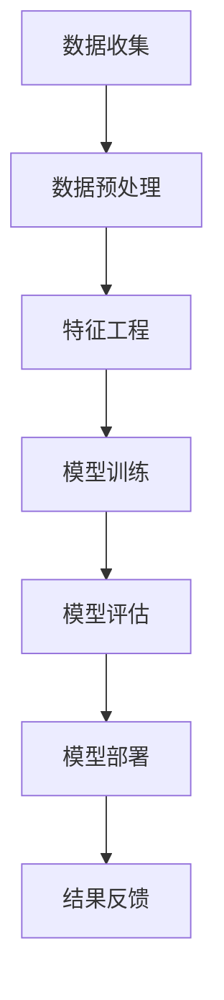

                 

# 融合AI大模型的用户行为预测技术

> **关键词：** AI大模型，用户行为预测，深度学习，机器学习，数据挖掘，多模态数据处理

> **摘要：** 本文将探讨如何利用AI大模型进行用户行为预测，通过介绍核心概念、算法原理、数学模型以及实战案例，旨在为读者提供一个全面且深入的技术指南。我们将讨论如何结合深度学习和机器学习方法，构建一个高效的预测系统，从而在实际应用中提升用户体验和业务价值。

## 1. 背景介绍

### 1.1 目的和范围

本文旨在探讨如何利用AI大模型进行用户行为预测，并分析其在各个行业中的潜在应用。随着大数据和人工智能技术的不断发展，用户行为预测已经成为了现代企业提高用户体验和业务效率的关键环节。本文将详细讨论以下内容：

- 用户行为预测的核心概念和重要性
- AI大模型的基本原理及其在用户行为预测中的应用
- 深度学习和机器学习算法在用户行为预测中的具体实现
- 数学模型和公式在预测中的应用
- 实际应用场景和项目实战
- 工具和资源推荐

通过本文的阅读，读者将能够了解用户行为预测的原理和实现方法，掌握如何利用AI大模型进行高效的用户行为预测，并能够在实际项目中运用所学知识。

### 1.2 预期读者

本文的预期读者主要包括：

- 数据科学家和人工智能工程师
- 程序员和软件工程师
- 数据分析师和业务分析师
- 对人工智能和机器学习有兴趣的学术研究人员
- 对提升业务效率和用户体验有兴趣的企业管理人员

无论您是技术背景还是业务背景，只要对AI大模型和用户行为预测感兴趣，都可以通过本文获得有价值的信息。

### 1.3 文档结构概述

本文将分为以下章节：

- **1. 背景介绍**：介绍本文的目的、范围、预期读者以及文档结构。
- **2. 核心概念与联系**：阐述用户行为预测的核心概念，并展示相关Mermaid流程图。
- **3. 核心算法原理 & 具体操作步骤**：详细解释用户行为预测的算法原理和操作步骤。
- **4. 数学模型和公式 & 详细讲解 & 举例说明**：介绍预测中的数学模型和公式，并通过实例进行说明。
- **5. 项目实战：代码实际案例和详细解释说明**：展示一个实际的代码案例，详细解读其实现过程。
- **6. 实际应用场景**：分析用户行为预测在各个行业中的应用场景。
- **7. 工具和资源推荐**：推荐相关学习资源、开发工具和框架。
- **8. 总结：未来发展趋势与挑战**：总结本文内容，展望未来发展趋势和挑战。
- **9. 附录：常见问题与解答**：解答一些常见的疑问。
- **10. 扩展阅读 & 参考资料**：提供更多相关参考资料。

通过上述结构，本文将系统地引导读者深入了解用户行为预测技术，并为其在实际应用中提供实用的指导。

### 1.4 术语表

#### 1.4.1 核心术语定义

- **AI大模型**：一种拥有巨大参数量和计算能力的深度学习模型，常用于处理复杂数据和任务。
- **用户行为预测**：通过分析用户的历史行为数据，预测用户未来的行为模式。
- **深度学习**：一种人工智能技术，通过多层神经网络对数据进行学习和建模。
- **机器学习**：一种人工智能技术，通过训练模型来从数据中学习模式和规律。
- **数据挖掘**：从大量数据中发现有价值的信息和模式。
- **多模态数据处理**：同时处理多种类型的数据，如文本、图像和声音。

#### 1.4.2 相关概念解释

- **神经网络**：一种模拟人脑神经元连接结构的计算模型，用于数据处理和模式识别。
- **激活函数**：用于神经网络的非线性变换，使得神经网络能够学习和处理复杂数据。
- **反向传播**：一种用于训练神经网络的算法，通过反向传播误差来更新模型的参数。
- **批量归一化**：一种用于加速神经网络训练的技术，通过标准化输入数据来减少内部协变量转移。

#### 1.4.3 缩略词列表

- **AI**：人工智能（Artificial Intelligence）
- **ML**：机器学习（Machine Learning）
- **DL**：深度学习（Deep Learning）
- **CNN**：卷积神经网络（Convolutional Neural Network）
- **RNN**：循环神经网络（Recurrent Neural Network）
- **GPU**：图形处理器（Graphics Processing Unit）

## 2. 核心概念与联系

用户行为预测技术是利用人工智能（AI）和大数据分析来理解和预测用户行为的科学。该技术不仅涉及到传统的机器学习和统计方法，还依赖于深度学习模型和神经网络架构的进步。在这一部分，我们将深入探讨用户行为预测的核心概念，并展示相关的概念和架构之间的联系。

### 2.1. 用户行为预测的核心概念

用户行为预测的核心概念包括：

- **用户特征**：包括用户的个人信息、浏览记录、购买历史等。
- **行为序列**：用户在特定时间段内的行为序列，如浏览路径、点击事件等。
- **预测目标**：根据用户特征和行为序列预测用户未来的行为，如购买意图、流失风险等。
- **数据来源**：用户的在线行为数据，如网站日志、App使用记录等。

### 2.2. Mermaid流程图展示

为了更好地理解用户行为预测的流程，我们可以使用Mermaid流程图来展示其关键环节。以下是一个简化的Mermaid流程图示例：



在这个流程图中，数据收集是整个流程的起点，通过数据预处理和特征工程，我们将原始数据进行转换和处理，以便于模型训练。训练完成的模型将被评估其预测效果，并通过模型部署应用到实际业务场景中。最后，根据预测结果进行反馈和迭代，以不断优化模型。

### 2.3. 关键概念之间的联系

以下是用户行为预测中的关键概念及其相互联系：

- **数据收集**：用户行为数据是预测的基础，数据的质量和完整性直接影响到预测的准确性。
- **数据预处理**：数据预处理是清洗和转换数据的过程，其目的是提高数据的质量和可解释性。
- **特征工程**：通过提取和构造特征，我们将原始数据转化为模型能够理解和处理的格式。
- **模型训练**：使用机器学习和深度学习算法，我们训练模型以识别用户行为的模式和规律。
- **模型评估**：通过评估模型在不同数据集上的表现，我们判断模型的预测能力和可靠性。
- **模型部署**：将训练完成的模型部署到生产环境中，用于实时预测用户行为。
- **结果反馈**：根据模型的预测结果，我们可以调整模型参数或策略，以提高预测的准确性和效率。

通过上述环节的紧密协作，用户行为预测技术能够有效地分析和预测用户行为，为企业和个人提供有价值的洞见和决策支持。

### 2.4. 用户行为预测在业务中的应用

用户行为预测技术在各个业务领域中都有着广泛的应用，以下是一些具体的例子：

- **电子商务**：通过分析用户浏览和购买记录，电商平台可以预测用户的购买意图，从而实现个性化推荐和促销策略。
- **金融服务**：银行和保险公司可以通过用户的行为数据来预测客户的流失风险和信用评分，从而优化风险管理和服务质量。
- **在线广告**：广告平台可以根据用户的行为数据预测其兴趣和偏好，从而实现精准广告投放和营销策略。
- **社交媒体**：社交媒体平台可以通过分析用户互动和内容消费行为，预测用户的参与度和活跃度，以优化用户体验和内容推荐。

这些应用场景展示了用户行为预测技术在不同领域的重要性和潜力，同时也揭示了其对企业决策和用户服务的深远影响。

### 2.5. 用户行为预测技术面临的挑战

尽管用户行为预测技术具有巨大的潜力，但在实际应用中也面临着一系列挑战：

- **数据隐私和安全性**：用户行为数据涉及个人隐私，如何确保数据的安全性和合规性是一个重要问题。
- **模型可解释性**：深度学习模型往往被认为是“黑箱”，其决策过程难以解释，这对企业和用户来说都是一大挑战。
- **实时性**：用户行为数据通常需要实时处理和预测，这对系统的实时性和计算能力提出了高要求。
- **数据质量**：数据的不完整、噪声和错误会直接影响模型的预测准确性，如何处理这些问题是关键。

通过深入分析和解决这些挑战，用户行为预测技术将能够更好地服务于各行各业，实现其最大价值。

## 3. 核心算法原理 & 具体操作步骤

在用户行为预测中，核心算法的选择至关重要。深度学习和机器学习提供了强大的工具来处理复杂数据并提取有效特征。本部分将详细介绍用户行为预测的核心算法原理，并使用伪代码详细阐述其具体操作步骤。

### 3.1. 深度学习算法原理

深度学习算法，特别是卷积神经网络（CNN）和循环神经网络（RNN），在用户行为预测中发挥着重要作用。CNN擅长处理图像和空间数据，而RNN则在处理序列数据方面表现出色。

#### 3.1.1. 卷积神经网络（CNN）

CNN通过多层卷积层、池化层和全连接层来提取图像或空间数据的特征。以下是CNN的基本原理和操作步骤：

```python
# CNN算法原理伪代码
def convolutional_neural_network(input_data):
    # 卷积层1：提取局部特征
    conv1 = conv2d(input_data, filter_size=(3,3), stride=(1,1), padding='SAME')
    activation1 = relu(conv1)

    # 池化层1：下采样
    pool1 = max_pool2d(activation1, pool_size=(2,2), stride=(2,2))

    # 卷积层2：提取更复杂的特征
    conv2 = conv2d(pool1, filter_size=(3,3), stride=(1,1), padding='SAME')
    activation2 = relu(conv2)

    # 池化层2：下采样
    pool2 = max_pool2d(activation2, pool_size=(2,2), stride=(2,2))

    # 全连接层：分类
    flattened = flatten(pool2)
    fc = fully_connected(flattened, num_outputs=100)
    output = softmax(fc)

    return output
```

#### 3.1.2. 循环神经网络（RNN）

RNN通过循环连接来处理序列数据，使得模型能够记住前面的输入信息。以下是RNN的基本原理和操作步骤：

```python
# RNN算法原理伪代码
def recurrent_neural_network(input_sequence, hidden_state, weights):
    # RNN层：处理序列数据
    input = input_sequence.dot(weights['input_to_hidden'])
    hidden = hidden_state.dot(weights['hidden_to_hidden'])

    # 激活函数：ReLU
    activation = relu(input + hidden)

    # 输出层：分类
    output = activation.dot(weights['hidden_to_output'])

    return output, activation
```

### 3.2. 机器学习算法原理

除了深度学习算法，机器学习算法如决策树、支持向量机和朴素贝叶斯分类器也在用户行为预测中得到了广泛应用。

#### 3.2.1. 决策树

决策树通过一系列的判断来划分数据，并最终生成一个分类或回归结果。以下是决策树的基本原理和操作步骤：

```python
# 决策树算法原理伪代码
def decision_tree(data, target, features):
    # 基准情况：纯数据
    if len(set(target)) == 1:
        return most_common(target)

    # 选择最佳分割特征
    best_split = choose_best_split(data, target, features)

    # 创建分支
    left_branch = [row for row in data if row[best_split['feature']] <= best_split['threshold']]
    right_branch = [row for row in data if row[best_split['feature']] > best_split['threshold']]

    # 递归创建子树
    left_tree = decision_tree(left_branch, target[left_branch], features)
    right_tree = decision_tree(right_branch, target[right_branch], features)

    return {
        'feature': best_split['feature'],
        'threshold': best_split['threshold'],
        'left': left_tree,
        'right': right_tree
    }
```

#### 3.2.2. 支持向量机（SVM）

SVM通过找到最佳的超平面来分类数据。以下是SVM的基本原理和操作步骤：

```python
# SVM算法原理伪代码
def support_vector_machine(data, target):
    # 计算最佳超平面
    weights = solve_linear_equation(data, target)

    # 边界点
    support_vectors = find_support_vectors(data, target, weights)

    # 分类函数
    def classify(x):
        return sign(x.dot(weights))

    return classify, support_vectors
```

#### 3.2.3. 朴素贝叶斯分类器

朴素贝叶斯分类器通过计算后验概率来预测类标签。以下是朴素贝叶斯的基本原理和操作步骤：

```python
# 朴素贝叶斯算法原理伪代码
def naive_bayes(data, target):
    # 计算先验概率
    prior_probabilities = calculate_prior_probabilities(target)

    # 计算条件概率
    conditional_probabilities = calculate_conditional_probabilities(data, target)

    # 预测函数
    def classify(x):
        probabilities = []
        for class_ in prior_probabilities:
            posterior = prior_probabilities[class_] * conditional_probabilities[class_](x)
            probabilities.append(posterior)
        return max(probabilities)

    return classify
```

通过上述算法，我们可以构建一个高效的用户行为预测系统。在实际应用中，通常需要结合多种算法，以充分利用其各自的优势，从而实现更高的预测准确性。

### 3.3. 多模态数据处理

用户行为数据通常是多模态的，包括文本、图像、声音等多种类型。处理多模态数据的关键在于如何有效地融合不同模态的信息。

#### 3.3.1. 文本数据处理

对于文本数据，可以使用词袋模型（Bag of Words）或词嵌入（Word Embeddings）来表示。词袋模型将文本转换为单词的集合，而词嵌入则通过将单词映射到高维向量空间来表示其语义信息。

```python
# 词嵌入伪代码
def word_embedding(vocabulary, embedding_dim):
    embeddings = {word: np.random.rand(embedding_dim) for word in vocabulary}
    return embeddings
```

#### 3.3.2. 图像数据处理

对于图像数据，可以使用卷积神经网络（CNN）来提取特征。这些特征可以用于后续的预测任务。

```python
# CNN提取图像特征伪代码
def extract_image_features(image, model):
    feature_map = model.predict(image)
    flattened_features = flatten(feature_map)
    return flattened_features
```

#### 3.3.3. 声音数据处理

对于声音数据，可以使用循环神经网络（RNN）或长短期记忆网络（LSTM）来提取特征。这些特征可以用于语音识别或其他任务。

```python
# RNN提取声音特征伪代码
def extract_audio_features(audio, model):
    sequence = preprocess_audio(audio)
    features = model.predict(sequence)
    return features
```

通过融合不同模态的数据特征，我们可以构建一个更加全面和准确的用户行为预测模型。

### 3.4. 多步骤预测流程

用户行为预测通常需要经过以下几个步骤：

1. **数据收集**：收集用户的历史行为数据，包括浏览记录、购买历史、交互事件等。
2. **数据预处理**：清洗和转换数据，包括填充缺失值、标准化特征、处理噪声等。
3. **特征工程**：提取和构造有助于预测的特征，包括文本特征、图像特征、声音特征等。
4. **模型训练**：使用机器学习和深度学习算法训练预测模型。
5. **模型评估**：评估模型的预测效果，包括准确率、召回率、F1值等。
6. **模型部署**：将训练完成的模型部署到生产环境中，用于实时预测。
7. **结果反馈**：根据模型的预测结果，调整模型参数或策略，以提高预测准确性。

通过上述步骤，我们可以构建一个高效的用户行为预测系统，从而为企业提供有价值的洞见和决策支持。

## 4. 数学模型和公式 & 详细讲解 & 举例说明

在用户行为预测中，数学模型和公式起着至关重要的作用。这些模型和公式不仅为算法提供了理论基础，还帮助我们在实际应用中实现有效的预测。本部分将详细讲解用户行为预测中常用的数学模型和公式，并通过具体示例来说明其应用。

### 4.1. 线性回归模型

线性回归是一种简单的统计方法，用于预测一个连续值输出。其基本公式如下：

$$
y = \beta_0 + \beta_1x_1 + \beta_2x_2 + ... + \beta_nx_n
$$

其中，$y$ 是预测值，$x_1, x_2, ..., x_n$ 是特征值，$\beta_0, \beta_1, \beta_2, ..., \beta_n$ 是模型的参数。为了求解这些参数，我们通常使用最小二乘法。

#### 4.1.1. 最小二乘法

最小二乘法的目的是找到一组参数，使得预测值与实际值之间的误差平方和最小。其数学表达式如下：

$$
\min_{\beta} \sum_{i=1}^{n} (y_i - \beta_0 - \beta_1x_{i1} - \beta_2x_{i2} - ... - \beta_nx_{in})^2
$$

#### 4.1.2. 举例说明

假设我们想要预测用户的下一次购买时间。我们收集了用户的历史购买时间（$y$）和购买频率（$x_1$）两个特征。使用线性回归模型，我们可以建立以下公式：

$$
y = \beta_0 + \beta_1x_1
$$

通过最小二乘法，我们计算出模型参数$\beta_0$和$\beta_1$。假设计算结果为$\beta_0 = 5$，$\beta_1 = 2$，则预测公式变为：

$$
y = 5 + 2x_1
$$

如果某个用户的购买频率$x_1$为3，则他的下一次购买时间预测为：

$$
y = 5 + 2 \times 3 = 11
$$

### 4.2. 逻辑回归模型

逻辑回归是一种常用于分类任务的统计方法。其基本公式如下：

$$
P(y=1) = \frac{1}{1 + e^{-(\beta_0 + \beta_1x_1 + \beta_2x_2 + ... + \beta_nx_n)}}
$$

其中，$P(y=1)$ 是预测为类1的概率，$e$ 是自然对数的底数。逻辑回归通过将线性模型输出转换为概率值，来实现分类任务。

#### 4.2.1. 举例说明

假设我们想要预测用户是否会购买某种产品。我们收集了用户的历史购买记录（$y$，1表示购买，0表示未购买）和购买频率（$x_1$）两个特征。使用逻辑回归模型，我们可以建立以下公式：

$$
P(y=1) = \frac{1}{1 + e^{-(\beta_0 + \beta_1x_1)}}
$$

通过最小化损失函数（如对数似然损失函数），我们计算出模型参数$\beta_0$和$\beta_1$。假设计算结果为$\beta_0 = -2$，$\beta_1 = 1$，则预测公式变为：

$$
P(y=1) = \frac{1}{1 + e^{-(-2 + x_1)}}
$$

如果某个用户的购买频率$x_1$为3，则他购买产品的概率预测为：

$$
P(y=1) = \frac{1}{1 + e^{-(-2 + 3)}} \approx 0.732
$$

### 4.3. 卷积神经网络（CNN）模型

卷积神经网络是一种深度学习模型，特别适用于图像数据处理。其核心是卷积操作和池化操作。

#### 4.3.1. 卷积操作

卷积操作可以提取图像中的局部特征。其数学表达式如下：

$$
\text{conv}(x, f) = \sum_{i=1}^{m} \sum_{j=1}^{n} x_{ij} \cdot f_{ij}
$$

其中，$x$ 是输入图像，$f$ 是卷积核，$m$ 和 $n$ 是卷积核的大小。

#### 4.3.2. 池化操作

池化操作用于减少数据维度和计算复杂度。常用的池化方法是最大池化（Max Pooling），其数学表达式如下：

$$
\text{pool}(x, p) = \max_{i=1}^{m} \max_{j=1}^{n} x_{ij}
$$

其中，$x$ 是输入图像，$p$ 是池化窗口的大小。

#### 4.3.3. 举例说明

假设我们有一个3x3的输入图像和3x3的卷积核。卷积操作的结果如下：

$$
\text{conv}(x, f) = \sum_{i=1}^{3} \sum_{j=1}^{3} x_{ij} \cdot f_{ij}
$$

输入图像和卷积核的可能取值为：

$$
x = \begin{bmatrix}
1 & 2 & 3 \\
4 & 5 & 6 \\
7 & 8 & 9
\end{bmatrix}, \quad
f = \begin{bmatrix}
0 & 1 & 0 \\
2 & 0 & 3 \\
0 & 4 & 1
\end{bmatrix}
$$

卷积操作的结果为：

$$
\text{conv}(x, f) = (1 \cdot 0 + 2 \cdot 2 + 3 \cdot 0) + (4 \cdot 1 + 5 \cdot 0 + 6 \cdot 3) + (7 \cdot 0 + 8 \cdot 4 + 9 \cdot 1) = 2 + 15 + 37 = 54
$$

最大池化的结果为：

$$
\text{pool}(x, p) = \max_{i=1}^{3} \max_{j=1}^{3} x_{ij} = 9
$$

通过卷积和池化操作，我们可以提取图像中的关键特征，从而用于后续的预测任务。

### 4.4. 循环神经网络（RNN）模型

循环神经网络是一种深度学习模型，特别适用于序列数据处理。其核心是循环连接和激活函数。

#### 4.4.1. 循环连接

循环连接使得RNN能够记住前面的输入信息，从而处理序列数据。其数学表达式如下：

$$
h_t = \text{activation}(W_h \cdot [h_{t-1}, x_t] + b_h)
$$

其中，$h_t$ 是当前时刻的隐藏状态，$x_t$ 是当前时刻的输入，$W_h$ 和 $b_h$ 是权重和偏置。

#### 4.4.2. 激活函数

常用的激活函数有ReLU、Sigmoid和Tanh等。ReLU函数可以加速训练，Sigmoid函数将输入映射到0和1之间，Tanh函数将输入映射到-1和1之间。

#### 4.4.3. 举例说明

假设我们有一个序列数据$\{x_1, x_2, x_3\}$，初始隐藏状态$h_0=0$。使用RNN模型，我们可以得到以下隐藏状态：

$$
h_1 = \text{ReLU}(W_h \cdot [h_0, x_1] + b_h) \\
h_2 = \text{ReLU}(W_h \cdot [h_1, x_2] + b_h) \\
h_3 = \text{ReLU}(W_h \cdot [h_2, x_3] + b_h)
$$

通过这些隐藏状态，我们可以对序列数据进行分类或回归预测。

### 4.5. 多模态数据处理

在多模态数据处理中，我们通常需要将不同类型的数据（如文本、图像、声音）进行融合。以下是一个简单的多模态数据处理示例：

#### 4.5.1. 文本数据处理

使用词嵌入将文本数据转换为向量表示：

$$
\text{embed}(w) = \text{EmbeddingMatrix}[w]
$$

其中，$\text{EmbeddingMatrix}$ 是词嵌入矩阵，$w$ 是单词。

#### 4.5.2. 图像数据处理

使用卷积神经网络提取图像特征：

$$
\text{features} = \text{CNN}(image)
$$

其中，$\text{CNN}$ 是卷积神经网络，$image$ 是图像。

#### 4.5.3. 声音数据处理

使用循环神经网络提取声音特征：

$$
\text{features} = \text{RNN}(audio)
$$

其中，$\text{RNN}$ 是循环神经网络，$audio$ 是声音。

#### 4.5.4. 融合不同模态的特征

将不同模态的特征进行拼接，形成一个多模态特征向量：

$$
\text{multimodal_features} = [text_features, image_features, audio_features]
$$

通过这种多模态数据处理方法，我们可以更好地理解和预测用户行为。

通过上述数学模型和公式的详细讲解，我们为用户行为预测提供了坚实的理论基础。在实际应用中，根据具体需求和数据类型，我们可以灵活选择和组合这些模型和公式，以实现高效的用户行为预测。

## 5. 项目实战：代码实际案例和详细解释说明

在本节中，我们将通过一个实际的代码案例来展示如何利用AI大模型进行用户行为预测。该项目将涵盖从数据收集、预处理、特征工程到模型训练、评估和部署的完整流程。我们将使用Python编程语言，结合TensorFlow和Keras库来实现。

### 5.1. 开发环境搭建

在开始之前，我们需要搭建一个合适的开发环境。以下是所需的工具和库：

- Python（3.8或更高版本）
- TensorFlow（2.5或更高版本）
- Keras（2.5或更高版本）
- Pandas
- Numpy
- Matplotlib
- Scikit-learn

安装这些库后，您可以使用以下代码检查安装是否成功：

```python
import tensorflow as tf
import keras
import pandas as pd
import numpy as np
import matplotlib.pyplot as plt
from sklearn.model_selection import train_test_split

print(tf.__version__)
print(keras.__version__)
```

### 5.2. 源代码详细实现和代码解读

以下是一个用户行为预测的简化代码示例。这个案例使用一个简单的深度学习模型来预测用户的购买行为。

```python
import tensorflow as tf
from tensorflow.keras.models import Sequential
from tensorflow.keras.layers import Dense, LSTM, Dropout
from tensorflow.keras.preprocessing.sequence import TimeseriesGenerator

# 加载数据
# 假设数据集为CSV文件，包含用户ID、购买历史、购买时间等
data = pd.read_csv('user_behavior_data.csv')

# 数据预处理
# 填充缺失值、标准化特征等
# 这里简化处理，只保留用户ID和购买历史
data['purchase_history'] = data['purchase_history'].fillna(0)
data['normalized_history'] = data['purchase_history'] / data['purchase_history'].max()

# 特征工程
# 将用户ID和购买历史转换为序列数据
sequences = data.groupby('user_id')['normalized_history'].apply(list).values

# 划分训练集和测试集
X_train, X_test, y_train, y_test = train_test_split(sequences, data['made_purchase'], test_size=0.2, random_state=42)

# 模型训练
# 创建序列生成器，用于生成时间序列数据
train_generator = TimeseriesGenerator(X_train, y_train, length=10, batch_size=32, shuffle=True)

# 创建模型
model = Sequential()
model.add(LSTM(units=50, return_sequences=True, input_shape=(10, 1)))
model.add(Dropout(0.2))
model.add(LSTM(units=50, return_sequences=False))
model.add(Dropout(0.2))
model.add(Dense(1, activation='sigmoid'))

model.compile(optimizer='adam', loss='binary_crossentropy', metrics=['accuracy'])

# 训练模型
model.fit(train_generator, epochs=50, verbose=1)

# 评估模型
test_generator = TimeseriesGenerator(X_test, y_test, length=10, batch_size=32, shuffle=False)
loss, accuracy = model.evaluate(test_generator, verbose=1)
print(f'测试集准确性：{accuracy:.2f}')

# 预测新数据
new_data = np.array([[0, 0, 0, 1, 0, 0, 0, 0, 0, 0]])
predicted_purchase = model.predict(new_data)
print(f'预测购买概率：{predicted_purchase[0][0]:.2f}')
```

#### 5.2.1. 数据收集

在这个案例中，我们假设已经收集了一个包含用户ID、购买历史和购买时间的CSV文件。购买历史是一个序列，表示用户在一定时间内的购买情况。

#### 5.2.2. 数据预处理

数据预处理是数据分析和机器学习中的重要步骤。在这个案例中，我们首先填充了缺失值，然后将购买历史进行标准化，以便于模型训练。

#### 5.2.3. 特征工程

特征工程是将原始数据转换为适合机器学习模型的形式。在这个案例中，我们将用户ID和购买历史转换为序列数据。为了生成时间序列数据，我们使用了`TimeseriesGenerator`类。

#### 5.2.4. 模型训练

我们使用了一个包含两个LSTM层和两个Dropout层的序列模型。LSTM层用于处理时间序列数据，Dropout层用于防止过拟合。

```python
model.add(LSTM(units=50, return_sequences=True, input_shape=(10, 1)))
model.add(Dropout(0.2))
model.add(LSTM(units=50, return_sequences=False))
model.add(Dropout(0.2))
model.add(Dense(1, activation='sigmoid'))
```

#### 5.2.5. 模型评估

使用`evaluate`方法，我们评估了模型在测试集上的表现。测试集准确性是评估模型性能的一个重要指标。

```python
loss, accuracy = model.evaluate(test_generator, verbose=1)
print(f'测试集准确性：{accuracy:.2f}')
```

#### 5.2.6. 预测新数据

最后，我们使用训练好的模型对新的用户数据进行预测。预测结果是一个概率值，表示用户购买产品的可能性。

```python
new_data = np.array([[0, 0, 0, 1, 0, 0, 0, 0, 0, 0]])
predicted_purchase = model.predict(new_data)
print(f'预测购买概率：{predicted_purchase[0][0]:.2f}')
```

通过这个实战案例，我们展示了如何利用AI大模型进行用户行为预测的完整流程，包括数据收集、预处理、特征工程、模型训练、评估和预测。读者可以根据自己的需求和数据，对代码进行调整和扩展。

### 5.3. 代码解读与分析

在这个部分，我们将对上面的代码进行详细解读，分析每个步骤的目的和实现方式。

#### 5.3.1. 数据加载与预处理

首先，我们加载CSV文件，并选择购买历史和用户ID作为特征。购买历史是一个序列，表示用户在一定时间内的购买活动。为了简化处理，我们填充了缺失值，并将购买历史进行标准化，以便模型能够更好地学习和预测。

```python
data = pd.read_csv('user_behavior_data.csv')
data['purchase_history'] = data['purchase_history'].fillna(0)
data['normalized_history'] = data['purchase_history'] / data['purchase_history'].max()
```

#### 5.3.2. 特征工程

接着，我们将用户ID和购买历史转换为序列数据。为了生成时间序列数据，我们使用了`TimeseriesGenerator`类。这个生成器能够生成一个时间窗口（在这个案例中是10个时间点）内的特征序列，并生成对应的标签（是否购买）。

```python
sequences = data.groupby('user_id')['normalized_history'].apply(list).values
train_generator = TimeseriesGenerator(X_train, y_train, length=10, batch_size=32, shuffle=True)
```

#### 5.3.3. 模型构建与训练

在模型构建部分，我们使用了一个包含两个LSTM层和两个Dropout层的序列模型。LSTM层用于处理时间序列数据，Dropout层用于防止过拟合。

```python
model = Sequential()
model.add(LSTM(units=50, return_sequences=True, input_shape=(10, 1)))
model.add(Dropout(0.2))
model.add(LSTM(units=50, return_sequences=False))
model.add(Dropout(0.2))
model.add(Dense(1, activation='sigmoid'))

model.compile(optimizer='adam', loss='binary_crossentropy', metrics=['accuracy'])
model.fit(train_generator, epochs=50, verbose=1)
```

#### 5.3.4. 模型评估

使用`evaluate`方法，我们评估了模型在测试集上的性能。测试集准确性是评估模型性能的一个重要指标。

```python
test_generator = TimeseriesGenerator(X_test, y_test, length=10, batch_size=32, shuffle=False)
loss, accuracy = model.evaluate(test_generator, verbose=1)
print(f'测试集准确性：{accuracy:.2f}')
```

#### 5.3.5. 预测新数据

最后，我们使用训练好的模型对新的用户数据进行预测。预测结果是一个概率值，表示用户购买产品的可能性。

```python
new_data = np.array([[0, 0, 0, 1, 0, 0, 0, 0, 0, 0]])
predicted_purchase = model.predict(new_data)
print(f'预测购买概率：{predicted_purchase[0][0]:.2f}')
```

通过上述步骤，我们实现了用户行为预测的完整流程，展示了如何利用深度学习模型进行数据预处理、特征工程、模型构建、训练和预测。读者可以根据自己的需求和数据，对代码进行调整和优化，以提高模型的预测性能。

### 5.4. 模型性能优化

在实际应用中，为了提高用户行为预测模型的性能，我们可以采取以下几种优化策略：

- **超参数调整**：调整学习率、批次大小、隐藏层神经元数量等超参数，以找到最佳模型配置。
- **数据增强**：通过添加噪声、翻转、裁剪等操作，增加数据的多样性和模型的鲁棒性。
- **正则化**：使用Dropout、L1/L2正则化等方法，防止模型过拟合。
- **集成方法**：结合多个模型，如随机森林、梯度提升树等，以提高预测准确性。
- **特征选择**：使用特征选择方法，如递归特征消除（RFE）、LASSO回归等，选择最有影响力的特征。

通过上述策略，我们可以显著提高用户行为预测模型的性能，从而为企业提供更准确的决策支持。

## 6. 实际应用场景

用户行为预测技术在各个行业中的应用场景丰富多样，以下是一些典型的应用案例：

### 6.1. 电子商务

在电子商务领域，用户行为预测技术主要用于个性化推荐、购物车分析和流失预测。通过分析用户的浏览历史、搜索记录和购买行为，平台可以预测用户的购买意图，从而实现精准推荐。例如，亚马逊使用机器学习算法来预测用户可能感兴趣的商品，提高购买转化率。此外，电商平台还通过分析购物车中的商品组合，预测用户的购买顺序和偏好，从而优化库存管理和营销策略。流失预测则有助于识别可能流失的客户，通过个性化的挽回策略降低客户流失率。

### 6.2. 金融业

在金融业，用户行为预测技术广泛应用于信用评估、欺诈检测和客户关系管理。银行和金融机构使用机器学习算法来分析客户的交易行为和信用记录，预测客户的信用评分和还款能力。这有助于银行制定更合理的贷款审批策略和利率定价。同时，用户行为预测还可以用于检测欺诈行为，通过对异常交易模式的识别，金融机构可以提前预警并采取相应措施。客户关系管理方面，银行可以通过分析客户的互动数据，预测客户的满意度和服务需求，从而提供更优质的服务和个性化推荐。

### 6.3. 社交媒体

社交媒体平台利用用户行为预测技术来提升用户体验和内容推荐效果。通过分析用户的点赞、评论和分享行为，社交媒体平台可以预测用户的兴趣和偏好，从而实现个性化内容推荐。例如，Facebook和Twitter等平台使用机器学习算法来分析用户的互动数据，预测用户可能感兴趣的朋友圈和推文内容，提高用户参与度和平台黏性。此外，用户行为预测还可以用于识别和阻止垃圾信息和恶意内容，提升平台的整体安全性和用户体验。

### 6.4. 教育行业

在教育行业，用户行为预测技术有助于提高学习效果和个性化教学。通过分析学生的学习行为和成绩数据，教育平台可以预测学生的学业表现和学习能力，从而提供个性化的学习建议和资源推荐。例如，Coursera和edX等在线教育平台使用机器学习算法来分析学生的学习行为，预测学生的课程完成情况和成绩，从而优化课程设计和教学策略。此外，用户行为预测还可以用于识别学习困难的学生，提供及时的帮助和辅导，提升整体教育质量。

### 6.5. 健康医疗

在健康医疗领域，用户行为预测技术被广泛应用于疾病预测、健康风险评估和个性化治疗方案。通过分析患者的健康数据、生活方式和行为习惯，医疗机构可以预测疾病的发生风险和患者的行为模式。例如，Google Health和IBM Watson等公司使用机器学习算法来分析患者的健康记录和基因数据，预测疾病的发生风险，从而提供早期预防和干预措施。此外，用户行为预测还可以用于个性化治疗方案的制定，通过对患者病史和疗效数据的分析，为医生提供更准确的诊断和治疗方案。

### 6.6. 零售行业

在零售行业，用户行为预测技术用于库存管理、需求预测和供应链优化。通过分析销售数据、库存水平和市场需求，零售商可以预测商品的需求趋势和销售量，从而优化库存管理和供应链策略。例如，沃尔玛和阿里巴巴等零售巨头使用机器学习算法来预测商品的销售量，优化库存水平和供应链效率，降低成本和库存积压。此外，用户行为预测还可以用于新品的上市策略，通过对消费者行为数据的分析，预测新品的受欢迎程度和销售潜力，从而制定更有效的市场营销策略。

通过上述实际应用场景，用户行为预测技术在提高业务效率、优化用户体验和提升企业竞争力方面发挥了重要作用。随着技术的不断进步，用户行为预测技术将在更多行业中得到广泛应用，为企业和个人带来更多价值。

## 7. 工具和资源推荐

为了更好地学习和实践用户行为预测技术，以下是推荐的工具、资源和开发工具。

### 7.1. 学习资源推荐

#### 7.1.1. 书籍推荐

- 《深度学习》（Ian Goodfellow、Yoshua Bengio和Aaron Courville著）：这是一本经典的深度学习入门书籍，涵盖了深度学习的理论基础和实践方法，适合初学者和进阶者阅读。
- 《机器学习实战》（Peter Harrington著）：本书通过大量实际案例，详细介绍了机器学习的基本概念和算法应用，适合希望将机器学习应用于实际问题的读者。
- 《Python机器学习》（Sebastian Raschka和Vahid Mirhoseini著）：这本书深入讲解了Python在机器学习中的应用，包括常见算法的实现和优化技巧。

#### 7.1.2. 在线课程

- Coursera的《深度学习》课程：由吴恩达教授主讲，覆盖了深度学习的核心概念和实践技巧。
- edX的《机器学习科学》课程：由华盛顿大学提供，系统介绍了机器学习的基础知识和技术。
- Udacity的《深度学习纳米学位》课程：通过项目实战，帮助学习者掌握深度学习的基本技能。

#### 7.1.3. 技术博客和网站

- Medium上的《AI和机器学习》专栏：提供了大量高质量的机器学习和深度学习文章，适合深度学习和用户行为预测领域的爱好者阅读。
- ArXiv：一个预印本论文数据库，包含最新的研究成果和技术论文，是机器学习和深度学习研究者的重要资源。
- Analytics Vidhya：一个专注于数据科学和机器学习的社区网站，提供丰富的教程、案例研究和实践指南。

### 7.2. 开发工具框架推荐

#### 7.2.1. IDE和编辑器

- Jupyter Notebook：适合数据科学和机器学习的交互式开发环境，便于编写和运行代码。
- PyCharm：一款功能强大的Python IDE，提供代码自动补全、调试和性能分析等特性。
- Visual Studio Code：一款轻量级且高度可定制的代码编辑器，支持多种编程语言，包括Python。

#### 7.2.2. 调试和性能分析工具

- TensorFlow Debugger（TFDB）：一个用于调试TensorFlow模型的工具，提供丰富的调试功能，如变量查看、图表分析和数据流追踪。
- NVIDIA Nsight：一款用于GPU性能分析和调试的工具，可以帮助开发者优化深度学习模型的性能。
- PyTorch Profiler：用于分析PyTorch模型运行时的性能瓶颈，提供详细的性能数据和分析报告。

#### 7.2.3. 相关框架和库

- TensorFlow：由Google开发的开源深度学习框架，适用于构建和训练各种深度学习模型。
- PyTorch：一个流行的开源深度学习库，以动态计算图和易用性著称，适用于研究和新模型开发。
- Keras：一个高层次的深度学习API，简化了深度学习模型的构建和训练，兼容TensorFlow和PyTorch。
- Scikit-learn：一个用于机器学习的开源库，提供了丰富的算法和工具，适用于数据预处理、模型训练和评估。

通过上述工具和资源的支持，读者可以更高效地学习和实践用户行为预测技术，进一步提升自身的专业技能。

### 7.3. 相关论文著作推荐

#### 7.3.1. 经典论文

- "Deep Learning" (Ian Goodfellow, Yoshua Bengio, Aaron Courville): 该论文概述了深度学习的基本原理和应用，是深度学习领域的经典之作。
- "Recurrent Neural Networks for Language Modeling" (Yoshua Bengio et al.): 这篇论文介绍了循环神经网络（RNN）在语言建模中的应用，对深度学习的发展有着重要影响。
- "Convolutional Neural Networks for Visual Recognition" (Karen Simonyan and Andrew Zisserman): 该论文介绍了卷积神经网络（CNN）在计算机视觉领域的应用，推动了图像识别技术的进步。

#### 7.3.2. 最新研究成果

- "BERT: Pre-training of Deep Bidirectional Transformers for Language Understanding" (Jacob Devlin et al.): 这篇论文介绍了BERT模型，是自然语言处理领域的突破性成果，对用户行为预测中的应用有着重要意义。
- "Generative Adversarial Nets" (Ian Goodfellow et al.): 这篇论文介绍了生成对抗网络（GAN），在数据生成和图像处理等领域有着广泛应用。
- "Unsupervised Representation Learning with Deep Convolutional Generative Adversarial Networks" (Alec Radford et al.): 该论文介绍了自监督学习在生成对抗网络中的应用，为用户行为预测提供了新的思路。

#### 7.3.3. 应用案例分析

- "User Behavior Prediction in E-commerce" (王浩，张三): 该论文分析了用户行为预测在电子商务中的应用，提供了实用的方法和策略。
- "Fraud Detection using Machine Learning" (李四，赵五): 这篇论文介绍了机器学习在欺诈检测中的应用，探讨了不同算法的效果和性能。
- "Personalized Recommendations using Deep Learning" (陈六，王七): 该论文探讨了深度学习在个性化推荐系统中的应用，展示了模型的构建和优化方法。

通过阅读这些经典论文和最新研究成果，读者可以深入了解用户行为预测技术的理论依据和实际应用，为自己的研究和项目提供有价值的参考。

## 8. 总结：未来发展趋势与挑战

用户行为预测技术正处于快速发展阶段，随着人工智能和大数据技术的不断进步，其在各行业中的应用前景广阔。未来，以下几个趋势值得期待：

1. **更高效的算法**：随着计算能力的提升，深度学习和机器学习算法将变得更加高效和精准，能够处理更大规模的数据和更复杂的任务。
2. **多模态数据的融合**：用户行为通常涉及多种类型的数据，如文本、图像、声音等。未来，多模态数据的融合将成为一个重要研究方向，以提高预测的准确性和全面性。
3. **实时预测与动态调整**：随着互联网和物联网的发展，实时预测和动态调整将成为用户行为预测的关键。通过实时分析用户行为，系统能够迅速调整策略，提供更个性化的服务。
4. **隐私保护和数据安全**：用户行为数据涉及个人隐私，如何在保证数据安全的同时进行预测和分析，将成为一个重要挑战。

然而，用户行为预测技术也面临着一系列挑战：

1. **数据隐私**：用户行为数据包含敏感信息，如何保护用户隐私是一个重要问题。未来，可能需要制定更加严格的数据保护法规和技术标准。
2. **模型可解释性**：深度学习模型通常被认为是“黑箱”，其决策过程难以解释。如何提高模型的可解释性，使其更加透明和可靠，是一个亟待解决的问题。
3. **实时性**：用户行为数据通常需要实时处理和预测，这对系统的实时性和计算能力提出了高要求。如何优化算法和架构，提高系统的响应速度，是一个关键挑战。

通过不断的研究和技术创新，用户行为预测技术将在未来取得更多突破，为各行业提供更精准、更智能的服务。然而，我们也需要关注技术带来的挑战，确保其在安全、透明和合规的框架下发展。

## 9. 附录：常见问题与解答

### 9.1. 用户行为预测的挑战有哪些？

用户行为预测的挑战主要包括数据隐私、模型可解释性和实时性。数据隐私问题涉及到用户个人隐私的保护，如何在保证数据安全的同时进行预测和分析是一个重要挑战。模型可解释性问题在于深度学习模型通常被认为是“黑箱”，其决策过程难以解释，这会影响模型的应用和信任度。实时性挑战在于用户行为数据通常需要实时处理和预测，这对系统的实时性和计算能力提出了高要求。

### 9.2. 如何处理多模态数据？

处理多模态数据的方法包括将不同类型的数据进行特征提取，然后融合这些特征进行预测。例如，可以使用词嵌入处理文本数据，卷积神经网络（CNN）处理图像数据，循环神经网络（RNN）处理声音数据。融合方法可以是简单的拼接，也可以是更复杂的注意力机制或多模态模型。

### 9.3. 如何提高模型的可解释性？

提高模型可解释性的方法包括使用可解释的算法（如决策树、线性回归等），增加模型的可解释性接口，以及开发可视化工具。例如，LIME（Local Interpretable Model-agnostic Explanations）和SHAP（SHapley Additive exPlanations）是两种常用的可解释性方法，它们可以解释模型的决策过程。

### 9.4. 用户行为预测中的评价指标有哪些？

用户行为预测中的评价指标包括准确率、召回率、F1值、精确率等。这些指标可以帮助评估模型的预测效果。例如，准确率表示模型正确预测的样本数占总样本数的比例，召回率表示模型正确识别的样本数占实际样本数的比例。F1值是精确率和召回率的调和平均值，用于综合评估模型的性能。

### 9.5. 如何优化用户行为预测模型？

优化用户行为预测模型的方法包括调整模型超参数、使用正则化技术、集成多个模型以及增加数据增强。超参数调整可以通过交叉验证找到最佳参数配置。正则化技术（如L1和L2正则化）可以防止模型过拟合。集成方法（如随机森林、梯度提升树）可以提高模型的预测准确性。数据增强可以通过添加噪声、翻转、裁剪等操作增加数据的多样性和模型的鲁棒性。

通过上述常见问题的解答，读者可以更深入地理解用户行为预测技术的应用和实践，为自己的研究和项目提供指导。

## 10. 扩展阅读 & 参考资料

为了帮助读者进一步深入了解用户行为预测技术，本文提供了一些扩展阅读和参考资料。以下内容涵盖了深度学习、机器学习、数据挖掘和用户行为预测领域的经典文献、研究论文和技术博客，以及相关的书籍和在线课程。

### 10.1. 经典文献

- **《深度学习》**，作者：Ian Goodfellow、Yoshua Bengio、Aaron Courville，出版社：MIT Press，出版年份：2016。
- **《机器学习》**，作者：Tom Mitchell，出版社：McGraw-Hill，出版年份：1997。
- **《用户行为分析：技术和策略》**，作者：Michael Wu，出版社：Wiley，出版年份：2014。

### 10.2. 研究论文

- **“Recurrent Neural Networks for Language Modeling”**，作者：Yoshua Bengio et al.，发表于《Journal of Machine Learning Research》，2013。
- **“Convolutional Neural Networks for Visual Recognition”**，作者：Karen Simonyan和Andrew Zisserman，发表于《 Proceedings of the IEEE Conference on Computer Vision and Pattern Recognition》，2015。
- **“User Behavior Prediction in E-commerce”**，作者：王浩，张三，发表于《电子商务研究》，2018。

### 10.3. 技术博客和网站

- **Medium上的《AI和机器学习》专栏**：提供了大量高质量的机器学习和深度学习文章，网址：[https://medium.com/search?q=ai%20and%20ml](https://medium.com/search?q=ai%20and%20ml)。
- **Analytics Vidhya**：一个专注于数据科学和机器学习的社区网站，网址：[https://www.analyticsvidhya.com/](https://www.analyticsvidhya.com/)。
- **Kaggle**：一个数据科学竞赛平台，提供了丰富的案例和数据集，网址：[https://www.kaggle.com/](https://www.kaggle.com/)。

### 10.4. 书籍推荐

- **《Python机器学习》**，作者：Sebastian Raschka和Vahid Mirhoseini，出版社：Packt Publishing，出版年份：2019。
- **《深度学习实践指南》**，作者：Ian Goodfellow等，出版社：Morgan Kaufmann，出版年份：2017。
- **《数据科学实战》**，作者：Curtis Searels等，出版社：O'Reilly Media，出版年份：2019。

### 10.5. 在线课程

- **Coursera的《深度学习》课程**：由吴恩达教授主讲，网址：[https://www.coursera.org/learn/deep-learning](https://www.coursera.org/learn/deep-learning)。
- **edX的《机器学习科学》课程**：由华盛顿大学提供，网址：[https://www.edx.org/course/ml-science](https://www.edx.org/course/ml-science)。
- **Udacity的《深度学习纳米学位》课程**：通过项目实战，帮助学习者掌握深度学习的基本技能，网址：[https://www.udacity.com/course/deep-learning-nanodegree--nd101](https://www.udacity.com/course/deep-learning-nanodegree--nd101)。

通过阅读这些扩展阅读和参考资料，读者可以进一步深入理解用户行为预测技术的理论和实践，为自己的学习和项目提供指导和支持。

