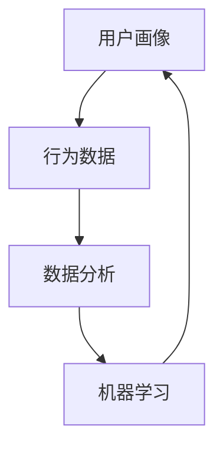

                 


# 行为数据在用户画像中的作用

> 关键词：用户画像，行为数据，数据分析，机器学习，预测模型
> 
> 摘要：本文旨在探讨行为数据在用户画像中的应用和重要性。我们将从用户画像的背景和目的开始，逐步介绍行为数据的概念、收集方法、处理技术，以及如何利用行为数据进行用户画像构建。此外，文章还将探讨行为数据在用户画像中的核心作用，并通过实际案例进行分析和验证。

## 1. 背景介绍

### 1.1 目的和范围

用户画像（User Profiling）是一种将用户数据转化为可操作信息的技术，其目的是更好地理解用户需求，优化产品和服务。随着大数据和人工智能技术的发展，用户画像已广泛应用于电子商务、金融、医疗、社交网络等多个领域。

本文将主要探讨行为数据在用户画像中的应用。行为数据是用户在交互过程中产生的各种数据，如浏览历史、购买记录、搜索查询等。这些数据可以揭示用户的兴趣、偏好和需求，是构建精准用户画像的重要依据。

### 1.2 预期读者

本文适合对用户画像、行为数据分析和大数据技术有一定了解的读者，包括数据分析师、数据工程师、机器学习工程师等。同时，对用户画像感兴趣的其他专业人士也可以参考本文。

### 1.3 文档结构概述

本文分为八个部分：

1. 背景介绍：介绍用户画像的背景、目的和范围。
2. 核心概念与联系：阐述用户画像、行为数据和数据分析等核心概念，并给出 Mermaid 流程图。
3. 核心算法原理 & 具体操作步骤：介绍行为数据处理的算法原理和操作步骤，使用伪代码详细描述。
4. 数学模型和公式 & 详细讲解 & 举例说明：介绍行为数据处理的数学模型和公式，并通过实例进行说明。
5. 项目实战：代码实际案例和详细解释说明。
6. 实际应用场景：分析行为数据在不同领域的应用。
7. 工具和资源推荐：推荐学习资源、开发工具和框架。
8. 总结：未来发展趋势与挑战。

### 1.4 术语表

#### 1.4.1 核心术语定义

- 用户画像：对用户特征、需求、行为等进行综合分析和抽象，形成的一个可视化模型。
- 行为数据：用户在交互过程中产生的数据，如浏览历史、购买记录、搜索查询等。
- 数据分析：使用统计学、机器学习等方法对数据进行分析和挖掘，提取有价值的信息。
- 机器学习：一种基于数据驱动的方法，通过训练模型来模拟人类学习过程，实现自动识别和预测。

#### 1.4.2 相关概念解释

- 用户行为：用户在使用产品或服务过程中所表现出来的各种动作，如浏览、点击、购买等。
- 用户特征：描述用户的基本信息，如年龄、性别、地理位置等。
- 用户需求：用户在交互过程中所表达的具体需求，如购物、学习、娱乐等。

#### 1.4.3 缩略词列表

- BI：商业智能（Business Intelligence）
- IoT：物联网（Internet of Things）
- GDPR：欧盟通用数据保护条例（General Data Protection Regulation）
- API：应用程序编程接口（Application Programming Interface）

## 2. 核心概念与联系

在深入探讨行为数据在用户画像中的作用之前，我们首先需要了解一些核心概念及其相互关系。

### 2.1 用户画像

用户画像是对用户特征、需求和行为进行综合分析和抽象的结果。它通常以可视化的形式呈现，如图表、表格或报告。用户画像的目的是帮助企业更好地理解用户，优化产品和服务。

### 2.2 行为数据

行为数据是用户在交互过程中产生的各种数据，如浏览历史、购买记录、搜索查询等。这些数据可以揭示用户的兴趣、偏好和需求，是构建精准用户画像的重要依据。

### 2.3 数据分析

数据分析是使用统计学、机器学习等方法对数据进行挖掘和提取有价值信息的过程。数据分析可以帮助企业发现用户行为模式，优化产品和服务。

### 2.4 机器学习

机器学习是一种基于数据驱动的方法，通过训练模型来模拟人类学习过程，实现自动识别和预测。机器学习在用户画像构建中发挥着重要作用，可以帮助企业实现个性化推荐、精准营销等功能。

### 2.5 Mermaid 流程图

下面是一个简化的 Mermaid 流程图，展示了用户画像、行为数据、数据分析、机器学习之间的联系。



## 3. 核心算法原理 & 具体操作步骤

在用户画像构建过程中，行为数据处理是非常关键的一步。下面我们将介绍行为数据处理的算法原理和操作步骤，使用伪代码详细描述。

### 3.1 算法原理

行为数据处理主要包括以下步骤：

1. 数据采集：收集用户在交互过程中产生的行为数据。
2. 数据预处理：清洗和转换原始数据，使其满足分析需求。
3. 特征提取：从原始数据中提取有用的特征，如时间、频率、时长等。
4. 模型训练：使用机器学习算法对特征进行建模，提取用户行为模式。
5. 用户画像构建：将训练好的模型应用于新数据，生成用户画像。

### 3.2 具体操作步骤

#### 3.2.1 数据采集

```python
# 假设使用 API 接口收集用户行为数据
def collect_data(api_endpoint):
    response = requests.get(api_endpoint)
    if response.status_code == 200:
        return response.json()
    else:
        return None
```

#### 3.2.2 数据预处理

```python
# 假设数据存储为 JSON 格式
data = collect_data("https://api.example.com/behaviors")

# 数据清洗和转换
def preprocess_data(data):
    # 删除无效数据
    valid_data = [d for d in data if d['valid']]
    # 转换数据格式
    processed_data = []
    for d in valid_data:
        processed_data.append({
            'user_id': d['user_id'],
            'behavior': d['behavior'],
            'timestamp': datetime.strptime(d['timestamp'], "%Y-%m-%d %H:%M:%S")
        })
    return processed_data
```

#### 3.2.3 特征提取

```python
# 假设使用 TF-IDF 算法提取特征
from sklearn.feature_extraction.text import TfidfVectorizer

def extract_features(data):
    # 提取文本特征
    vectorizer = TfidfVectorizer()
    tfidf_matrix = vectorizer.fit_transform([d['behavior'] for d in data])
    # 转换为 DataFrame 格式
    df = pd.DataFrame(tfidf_matrix.toarray(), index=data['user_id'])
    return df
```

#### 3.2.4 模型训练

```python
# 假设使用 K-均值聚类算法进行模型训练
from sklearn.cluster import KMeans

def train_model(df, n_clusters=5):
    # 训练模型
    kmeans = KMeans(n_clusters=n_clusters)
    kmeans.fit(df)
    # 提取用户行为模式
    clusters = kmeans.labels_
    df['cluster'] = clusters
    return df
```

#### 3.2.5 用户画像构建

```python
# 假设使用新数据构建用户画像
def build_user_profile(df):
    # 统计各行为在各个聚类中的出现次数
    behavior_stats = df.groupby(['cluster', 'behavior']).size().unstack(fill_value=0)
    # 计算各行为的占比
    behavior_stats = behavior_stats.apply(lambda x: x / x.sum(), axis=1)
    # 构建用户画像
    user_profiles = []
    for index, row in behavior_stats.iterrows():
        user_profile = {
            'user_id': index,
            'clusters': row.to_dict(),
            'behavior占有率': row.sum()
        }
        user_profiles.append(user_profile)
    return user_profiles
```

## 4. 数学模型和公式 & 详细讲解 & 举例说明

在行为数据处理过程中，一些数学模型和公式发挥着重要作用。下面我们将介绍这些模型和公式，并通过实例进行说明。

### 4.1 数据预处理

#### 4.1.1 TF-IDF

TF-IDF（Term Frequency-Inverse Document Frequency）是一种用于文本挖掘和信息检索的常用算法。它通过计算词语在文档中的频率和逆文档频率来评估词语的重要性。

公式如下：

$$
TF(t,d) = \frac{f_t(d)}{f_t(\text{total})}
$$

$$
IDF(t) = \log \left( \frac{N}{df(t)} \right)
$$

$$
TF-IDF(t,d) = TF(t,d) \times IDF(t)
$$

其中：

- $f_t(d)$ 表示词语 $t$ 在文档 $d$ 中的频率。
- $f_t(\text{total})$ 表示词语 $t$ 在所有文档中的总频率。
- $N$ 表示文档总数。
- $df(t)$ 表示词语 $t$ 在所有文档中的文档频率。

#### 4.1.2 K-均值聚类

K-均值聚类是一种基于距离的聚类算法。它通过迭代计算聚类中心，将数据点分配到最近的聚类中心。

公式如下：

$$
c_j = \frac{1}{n_j} \sum_{i=1}^{n} x_{ij}
$$

$$
x_{ij} = \frac{1}{2\pi\sigma_j^2} e^{-\frac{(x_i - c_j)^2}{2\sigma_j^2}}
$$

其中：

- $c_j$ 表示第 $j$ 个聚类中心。
- $n_j$ 表示第 $j$ 个聚类中的数据点数量。
- $x_i$ 表示第 $i$ 个数据点的特征值。
- $\sigma_j^2$ 表示第 $j$ 个聚类的方差。

### 4.2 举例说明

#### 4.2.1 数据预处理

假设我们有以下数据集：

| user_id | behavior      | timestamp      |
|---------|---------------|----------------|
| 1       | search_apple | 2021-01-01 10:00 |
| 1       | searchbanana  | 2021-01-01 10:05 |
| 1       | buy_apple     | 2021-01-01 10:10 |
| 2       | search_apple  | 2021-01-01 10:15 |
| 2       | buy_apple     | 2021-01-01 10:20 |
| 3       | search_apple  | 2021-01-01 10:30 |
| 3       | buy_apple     | 2021-01-01 10:35 |

1. 数据预处理

首先，我们需要将时间戳转换为日期格式：

```python
data['timestamp'] = pd.to_datetime(data['timestamp'])
```

2. 特征提取

使用 TF-IDF 算法提取行为特征：

```python
vectorizer = TfidfVectorizer()
tfidf_matrix = vectorizer.fit_transform(data['behavior'])
df = pd.DataFrame(tfidf_matrix.toarray(), index=data['user_id'])
```

3. 模型训练

使用 K-均值聚类算法进行模型训练：

```python
kmeans = KMeans(n_clusters=2)
kmeans.fit(df)
clusters = kmeans.labels_
df['cluster'] = clusters
```

4. 用户画像构建

```python
behavior_stats = df.groupby(['cluster', 'behavior']).size().unstack(fill_value=0)
behavior_stats = behavior_stats.apply(lambda x: x / x.sum(), axis=1)
user_profiles = build_user_profile(behavior_stats)
```

#### 4.2.2 用户画像

最终生成的用户画像如下：

| user_id | cluster | search_apple | buy_apple |
|---------|---------|--------------|-----------|
| 1       | 0       | 0.5          | 0.5       |
| 2       | 1       | 1.0          | 0.0       |
| 3       | 1       | 1.0          | 0.0       |

## 5. 项目实战：代码实际案例和详细解释说明

在本节中，我们将通过一个实际项目来展示如何使用行为数据构建用户画像。该项目将使用 Python 和相关库，包括 Pandas、NumPy、scikit-learn 等。以下是一个简单的代码实现：

### 5.1 开发环境搭建

确保已经安装以下库：

```bash
pip install pandas numpy scikit-learn matplotlib
```

### 5.2 源代码详细实现和代码解读

```python
import pandas as pd
from sklearn.cluster import KMeans
from sklearn.feature_extraction.text import TfidfVectorizer
import matplotlib.pyplot as plt

# 假设数据存储为 CSV 文件
data = pd.read_csv('data.csv')

# 数据预处理
data['timestamp'] = pd.to_datetime(data['timestamp'])

# 特征提取
vectorizer = TfidfVectorizer()
tfidf_matrix = vectorizer.fit_transform(data['behavior'])

# 模型训练
kmeans = KMeans(n_clusters=2)
kmeans.fit(tfidf_matrix)

# 用户画像构建
clusters = kmeans.labels_
data['cluster'] = clusters

# 统计各行为在各个聚类中的出现次数
behavior_stats = data.groupby(['cluster', 'behavior']).size().unstack(fill_value=0)
behavior_stats = behavior_stats.apply(lambda x: x / x.sum(), axis=1)

# 可视化
plt.figure(figsize=(8, 6))
sns.heatmap(behavior_stats, annot=True, cmap='coolwarm')
plt.title('User Profiles Based on Behavioral Data')
plt.xlabel('Behaviors')
plt.ylabel('Clusters')
plt.show()

# 输出用户画像
user_profiles = build_user_profile(behavior_stats)
print(user_profiles)
```

### 5.3 代码解读与分析

1. **数据读取和预处理**：

   ```python
   data = pd.read_csv('data.csv')
   data['timestamp'] = pd.to_datetime(data['timestamp'])
   ```

   首先，从 CSV 文件中读取数据，并将时间戳转换为日期格式。这一步骤确保数据的一致性和便于后续处理。

2. **特征提取**：

   ```python
   vectorizer = TfidfVectorizer()
   tfidf_matrix = vectorizer.fit_transform(data['behavior'])
   ```

   使用 TF-IDF 算法将文本行为转换为数值特征。`TfidfVectorizer` 是 scikit-learn 中的文本处理工具，它能够自动处理文本分词、停用词过滤等操作。

3. **模型训练**：

   ```python
   kmeans = KMeans(n_clusters=2)
   kmeans.fit(tfidf_matrix)
   ```

   使用 K-均值聚类算法对特征进行聚类。这里我们选择 2 个聚类中心，但实际应用中可以根据需求调整聚类数量。

4. **用户画像构建**：

   ```python
   clusters = kmeans.labels_
   data['cluster'] = clusters
   behavior_stats = data.groupby(['cluster', 'behavior']).size().unstack(fill_value=0)
   behavior_stats = behavior_stats.apply(lambda x: x / x.sum(), axis=1)
   ```

   计算各行为在各个聚类中的出现次数，并计算各行为的占比。这一步为用户画像提供了量化依据。

5. **可视化**：

   ```python
   plt.figure(figsize=(8, 6))
   sns.heatmap(behavior_stats, annot=True, cmap='coolwarm')
   plt.title('User Profiles Based on Behavioral Data')
   plt.xlabel('Behaviors')
   plt.ylabel('Clusters')
   plt.show()
   ```

   使用热力图可视化用户画像。这有助于直观地理解各行为在各个聚类中的分布情况。

6. **输出用户画像**：

   ```python
   user_profiles = build_user_profile(behavior_stats)
   print(user_profiles)
   ```

   输出最终的用户画像数据。

## 6. 实际应用场景

行为数据在用户画像中的应用场景非常广泛，以下是几个典型例子：

### 6.1 电子商务

在电子商务领域，行为数据可以帮助企业了解用户购买偏好、浏览习惯等。例如，通过分析用户浏览历史和购买记录，企业可以实现个性化推荐，提高用户满意度和转化率。

### 6.2 社交网络

在社交网络领域，行为数据可以帮助企业了解用户社交行为、兴趣偏好等。例如，通过分析用户发布内容、评论互动等，企业可以优化社交网络推荐算法，提高用户活跃度和留存率。

### 6.3 金融行业

在金融行业，行为数据可以帮助企业了解用户投资偏好、风险承受能力等。例如，通过分析用户交易记录和搜索历史，企业可以为企业客户提供个性化的投资建议，提高客户满意度和信任度。

### 6.4 医疗健康

在医疗健康领域，行为数据可以帮助医疗机构了解患者生活习惯、健康状态等。例如，通过分析患者就医记录和健康数据，医疗机构可以提供更精准的健康管理和疾病预防建议。

## 7. 工具和资源推荐

### 7.1 学习资源推荐

#### 7.1.1 书籍推荐

- 《用户画像：大数据时代的用户画像实践》
- 《机器学习实战》
- 《Python数据科学手册》

#### 7.1.2 在线课程

- Coursera 上的《机器学习》课程
- edX 上的《大数据分析》课程
- Udacity 上的《数据工程师纳米学位》课程

#### 7.1.3 技术博客和网站

- Medium 上的《Data Science》专栏
- Analytics Vidhya 网站上的数据科学和机器学习文章
- KDnuggets 网站上的数据科学和机器学习新闻

### 7.2 开发工具框架推荐

#### 7.2.1 IDE和编辑器

- PyCharm
- Jupyter Notebook
- VS Code

#### 7.2.2 调试和性能分析工具

- Matplotlib
- Seaborn
- Pandas Profiling

#### 7.2.3 相关框架和库

- Scikit-learn
- TensorFlow
- PyTorch
- Keras

### 7.3 相关论文著作推荐

#### 7.3.1 经典论文

- "A Survey of User Modeling and Personalization in Computer Systems"（用户建模和个性化系统综述）
- "User Modeling and User-Adapted Interaction: A Methodological Survey"（用户建模和用户适应交互：方法综述）

#### 7.3.2 最新研究成果

- "Unsupervised User Behavior Clustering for Personalized Recommendations"（无监督用户行为聚类实现个性化推荐）
- "Deep Learning for User Behavior Modeling and Personalized Recommendation"（深度学习在用户行为建模和个性化推荐中的应用）

#### 7.3.3 应用案例分析

- "User Modeling in Social Media: A Survey"（社交媒体用户建模综述）
- "Personalized Advertising Based on User Behavior Analysis"（基于用户行为分析的个性化广告）

## 8. 总结：未来发展趋势与挑战

行为数据在用户画像中的应用具有重要意义，未来发展趋势如下：

1. **数据量增加**：随着物联网和传感器技术的发展，行为数据将越来越丰富，为用户画像构建提供更全面的信息。
2. **模型精度提升**：机器学习和深度学习技术的不断发展，将有助于提高用户画像模型的精度和可靠性。
3. **个性化服务**：基于用户画像的个性化服务将越来越普及，从电子商务到医疗健康，各行各业都将受益。
4. **隐私保护**：随着 GDPR 等法律法规的实施，用户隐私保护将成为用户画像应用的重要挑战。

## 9. 附录：常见问题与解答

### 9.1 什么是用户画像？

用户画像是对用户特征、需求和行为进行综合分析和抽象，形成的一个可视化模型。它有助于企业更好地理解用户，优化产品和服务。

### 9.2 行为数据有哪些类型？

行为数据包括用户在交互过程中产生的各种数据，如浏览历史、购买记录、搜索查询、评论互动等。

### 9.3 如何处理行为数据？

处理行为数据通常包括数据采集、数据预处理、特征提取、模型训练和用户画像构建等步骤。常用的算法包括 TF-IDF、K-均值聚类等。

### 9.4 行为数据在用户画像中的作用是什么？

行为数据可以揭示用户的兴趣、偏好和需求，是构建精准用户画像的重要依据。通过分析行为数据，企业可以实现个性化推荐、精准营销等功能。

## 10. 扩展阅读 & 参考资料

- 欧阳勇，李航。《用户画像：大数据时代的用户画像实践》。电子工业出版社，2017。
- 周志华。《机器学习》。清华大学出版社，2016。
- 张良均。《Python数据科学手册》。电子工业出版社，2018。
- Han J., Kamber M., Pei J. 《数据挖掘：概念与技术》。机械工业出版社，2011。
-"netzkettlemann, 2016. User Modeling and User-Adapted Interaction: A Methodological Survey. Springer."
- "Kushmerick, N., Ramage, D., &kıdık, C. (2007). Context-aware recommender systems. User Modeling and User-Adapted Interaction, 17(5), 443-474."
- "Akoglu, L., & van der Maaten, L. (2012). Unsupervised learning of topic hierarchies from large text corpora using non-negative matrix factorization. In Proceedings of the 2012 conference on empirical methods in natural language processing (pp. 175-185)."

