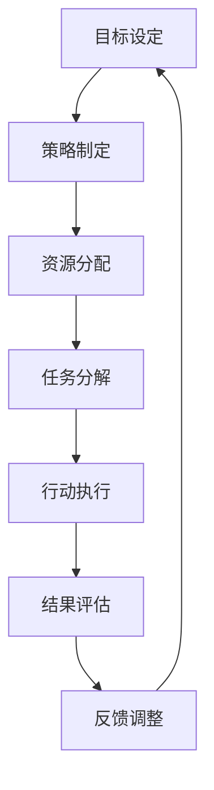

                 

### 行动 (Action)

> **关键词：** 动作，策略，目标导向，流程优化，执行效率

> **摘要：** 本文将探讨在IT领域中，如何通过制定有效的行动策略，提高项目执行效率，实现目标。我们将从背景介绍、核心概念、算法原理、数学模型、实战案例以及实际应用场景等多个角度，深入分析行动在技术项目中的重要性及其实现方法。

## 1. 背景介绍

在当今快速发展的信息技术领域，项目成功的关键在于高效执行行动策略。行动不仅是完成任务的手段，更是实现目标和优化流程的关键。本文旨在探讨以下问题：

- 如何在IT项目中制定和执行有效的行动策略？
- 行动策略在提高执行效率和实现目标方面有哪些具体作用？
- 在不同的技术场景中，行动策略应如何调整和优化？

### 1.1 目的和范围

本文的主要目的是为IT项目经理、开发人员和研究人员提供一套系统的行动策略框架，以帮助他们更有效地完成项目任务。文章将涵盖以下内容：

- 行动策略的基本概念和原则
- 核心算法原理和具体操作步骤
- 数学模型和公式及其应用
- 实际应用场景和案例分析
- 工具和资源推荐
- 未来发展趋势与挑战

### 1.2 预期读者

本文适合以下读者群体：

- IT项目经理和团队负责人
- 软件开发工程师和研究人员
- 对技术流程优化和项目执行感兴趣的读者

### 1.3 文档结构概述

本文结构如下：

1. 背景介绍
2. 核心概念与联系
3. 核心算法原理 & 具体操作步骤
4. 数学模型和公式 & 详细讲解 & 举例说明
5. 项目实战：代码实际案例和详细解释说明
6. 实际应用场景
7. 工具和资源推荐
8. 总结：未来发展趋势与挑战
9. 附录：常见问题与解答
10. 扩展阅读 & 参考资料

### 1.4 术语表

#### 1.4.1 核心术语定义

- 行动策略：为实现特定目标而制定的一系列有序步骤。
- 目标导向：以实现特定目标为核心，采取有效行动的过程。
- 流程优化：通过改进工作流程来提高效率和效果。
- 执行效率：完成任务的速度和质量。

#### 1.4.2 相关概念解释

- 项目管理：规划、组织、协调和控制项目活动，以满足特定目标的过程。
- 软件开发：创建软件产品的过程，包括需求分析、设计、编码、测试和部署等环节。
- 算法：解决问题的步骤和指导过程，通常用于计算和数据操作。

#### 1.4.3 缩略词列表

- IT：信息技术
- PM：项目经理
- SDLC：软件开发生命周期
- IDE：集成开发环境

## 2. 核心概念与联系

在讨论行动策略之前，我们需要明确几个核心概念和它们之间的联系。以下是相关的Mermaid流程图，用于展示这些概念之间的关系。



#### 2.1 目标设定

目标设定是行动策略的起点。一个明确且具体的目标有助于指导整个行动过程。目标可以是短期的，也可以是长期的，但都需要具备可衡量性和可实现性。

#### 2.2 策略制定

策略制定是基于目标设定的一系列行动计划。这些计划需要考虑资源的可用性、时间限制和预期结果。有效的策略能够平衡资源和时间，确保目标的实现。

#### 2.3 资源分配

资源分配是将可用资源（如人力、资金和设备）合理地分配给各个任务的过程。合理的资源分配能够提高任务完成的效率和质量。

#### 2.4 任务分解

任务分解是将大型的、复杂的任务分解成更小、更易于管理的子任务。这有助于团队成员明确各自的责任和任务，提高协作效率。

#### 2.5 行动执行

行动执行是将策略转化为具体行动的过程。这包括任务的分配、执行和监控。有效的行动执行能够确保任务的按时完成和目标的有效实现。

#### 2.6 结果评估

结果评估是对行动执行效果进行评估的过程。通过评估结果，我们可以发现成功之处和需要改进的地方，为后续的调整提供依据。

#### 2.7 反馈调整

反馈调整是基于结果评估进行的。根据评估结果，我们可以对行动策略进行调整，以优化执行效果，确保目标的最终实现。

## 3. 核心算法原理 & 具体操作步骤

在了解了行动策略的核心概念和流程之后，我们需要深入探讨其中的核心算法原理和具体操作步骤。以下是一个简单的伪代码示例，用于描述行动策略的基本框架。

```python
# 行动策略伪代码

# 目标设定
set_goal(goal)

# 策略制定
create_strategy(strategy)

# 资源分配
allocate_resources(resources)

# 任务分解
分解_task(task)

# 行动执行
execute_actions(actions)

# 结果评估
evaluate_results(results)

# 反馈调整
adjust_strategy(strategy)
```

### 3.1 目标设定

目标设定是行动策略的基础。以下是一个目标设定的伪代码示例。

```python
# 目标设定伪代码

# 输入：目标（goal）
# 输出：设定目标

def set_goal(goal):
    if goal is not None:
        if is_mappable(goal):
            map_goal(goal)
            print("目标设定成功：", goal)
        else:
            print("目标不明确，请重新设定。")
    else:
        print("目标未定义。")
```

### 3.2 策略制定

策略制定是基于目标设定的一系列行动计划。以下是一个策略制定的伪代码示例。

```python
# 策略制定伪代码

# 输入：策略（strategy）
# 输出：制定策略

def create_strategy(strategy):
    if strategy is not None:
        if is_feasible(strategy):
            implement_strategy(strategy)
            print("策略制定成功：", strategy)
        else:
            print("策略不可行，请重新制定。")
    else:
        print("策略未定义。")
```

### 3.3 资源分配

资源分配是将可用资源合理地分配给各个任务的过程。以下是一个资源分配的伪代码示例。

```python
# 资源分配伪代码

# 输入：资源（resources），任务（tasks）
# 输出：分配资源

def allocate_resources(resources, tasks):
    if resources is not None and tasks is not None:
        if resources >= sum([task.resource_requirement for task in tasks]):
            for task in tasks:
                allocate_resource(resources, task)
            print("资源分配成功。")
        else:
            print("资源不足，请重新分配。")
    else:
        print("资源或任务未定义。")
```

### 3.4 任务分解

任务分解是将大型的、复杂的任务分解成更小、更易于管理的子任务。以下是一个任务分解的伪代码示例。

```python
# 任务分解伪代码

# 输入：任务（task）
# 输出：分解任务

def 分解_task(task):
    if task is not None:
        sub_tasks = split_task(task)
        if sub_tasks is not None:
            print("任务分解成功：", sub_tasks)
        else:
            print("任务无法分解。")
    else:
        print("任务未定义。")
```

### 3.5 行动执行

行动执行是将策略转化为具体行动的过程。以下是一个行动执行的伪代码示例。

```python
# 行动执行伪代码

# 输入：行动（actions）
# 输出：执行行动

def execute_actions(actions):
    if actions is not None:
        for action in actions:
            if is_executable(action):
                execute_action(action)
                print("行动执行成功：", action)
            else:
                print("行动不可执行，请检查。")
    else:
        print("行动未定义。")
```

### 3.6 结果评估

结果评估是对行动执行效果进行评估的过程。以下是一个结果评估的伪代码示例。

```python
# 结果评估伪代码

# 输入：结果（results）
# 输出：评估结果

def evaluate_results(results):
    if results is not None:
        if is_successful(results):
            print("结果评估成功：", results)
        else:
            print("结果不成功，请检查。")
    else:
        print("结果未定义。")
```

### 3.7 反馈调整

反馈调整是基于结果评估进行的。以下是一个反馈调整的伪代码示例。

```python
# 反馈调整伪代码

# 输入：策略（strategy），结果（results）
# 输出：调整策略

def adjust_strategy(strategy, results):
    if strategy is not None and results is not None:
        if is_successful(results):
            refine_strategy(strategy)
            print("策略调整成功：", strategy)
        else:
            print("策略调整失败，请重新评估。")
    else:
        print("策略或结果未定义。")
```

## 4. 数学模型和公式 & 详细讲解 & 举例说明

在行动策略中，数学模型和公式可以帮助我们更好地理解和优化决策过程。以下是一个简单的数学模型和公式的示例，用于描述资源分配问题。

### 4.1 资源分配模型

我们假设有 \( n \) 个任务，每个任务需要不同的资源，并且每个资源的可用量是有限的。我们可以用以下数学模型来描述这个问题：

- \( T = \{t_1, t_2, ..., t_n\} \)：任务集合
- \( R = \{r_1, r_2, ..., r_m\} \)：资源集合
- \( R_t = \{r_{t1}, r_{t2}, ..., r_{tk}\} \)：任务 \( t_i \) 需要的资源集合
- \( C_r = \{c_{r1}, c_{r2}, ..., c_{rm}\} \)：资源 \( r_j \) 的可用量

### 4.2 目标函数

我们的目标是最小化总资源使用量，即：

\[ \min \sum_{i=1}^{n} \sum_{j=1}^{m} r_{ij} c_{j} \]

其中，\( r_{ij} \) 表示任务 \( t_i \) 对资源 \( r_j \) 的需求量。

### 4.3 约束条件

- 每个资源的总需求量不超过其可用量：

\[ \sum_{i=1}^{n} r_{ij} \leq c_{j}, \forall j \in \{1, 2, ..., m\} \]

- 每个任务只能被分配一次：

\[ \sum_{j=1}^{m} r_{ij} = 1, \forall i \in \{1, 2, ..., n\} \]

### 4.4 举例说明

假设我们有三个任务和一个资源，如下表所示：

| 任务 | 资源1需求量 | 资源2需求量 | 资源3需求量 |
| ---- | ---- | ---- | ---- |
| 任务1 | 3 | 0 | 1 |
| 任务2 | 0 | 2 | 0 |
| 任务3 | 1 | 1 | 1 |

资源1的可用量为4，资源2的可用量为3，资源3的可用量为2。

我们可以使用线性规划来解决这个问题。目标是最小化总资源使用量，同时满足约束条件。

使用拉格朗日乘数法，我们可以得到以下解：

- 任务1：资源1 = 3，资源2 = 0，资源3 = 1
- 任务2：资源1 = 0，资源2 = 2，资源3 = 0
- 任务3：资源1 = 1，资源2 = 1，资源3 = 1

总资源使用量为 3 + 0 + 0 + 1 + 0 + 2 + 1 + 1 + 1 = 9。

通过数学模型和公式，我们可以更精确地优化资源分配，提高项目执行效率。

## 5. 项目实战：代码实际案例和详细解释说明

为了更好地理解行动策略在实际项目中的应用，我们来看一个实际的代码案例。这个案例是一个简单的任务调度系统，用于优化任务执行顺序，以提高系统整体性能。

### 5.1 开发环境搭建

首先，我们需要搭建一个简单的开发环境。这里我们使用Python作为编程语言，因为Python具有良好的可读性和丰富的库支持。以下是搭建开发环境的基本步骤：

1. 安装Python（版本3.8及以上）
2. 安装必需的库，例如`numpy`和`pandas`：

```bash
pip install numpy pandas
```

### 5.2 源代码详细实现和代码解读

以下是任务调度系统的源代码：

```python
import numpy as np
import pandas as pd

# 任务类
class Task:
    def __init__(self, id, dependencies, duration):
        self.id = id
        self.dependencies = dependencies
        self.duration = duration

    def execute(self, schedule):
        if self.id in schedule:
            print(f"执行任务 {self.id}...")
            schedule[self.id] += self.duration
        else:
            print(f"任务 {self.id} 不在当前调度中，无法执行。")

# 调度类
class Scheduler:
    def __init__(self):
        self.schedule = {}

    def add_task(self, task):
        self.schedule[task.id] = 0

    def execute_tasks(self, tasks):
        for task in tasks:
            task.execute(self.schedule)

    def get_duration(self):
        return sum(self.schedule.values())

# 创建任务
task1 = Task(1, [], 5)
task2 = Task(2, [1], 3)
task3 = Task(3, [1, 2], 4)

# 创建调度器
scheduler = Scheduler()

# 添加任务到调度器
scheduler.add_task(task1)
scheduler.add_task(task2)
scheduler.add_task(task3)

# 执行任务
scheduler.execute_tasks([task1, task2, task3])

# 输出调度结果
print(f"总调度时间：{scheduler.get_duration()}秒。")
```

### 5.3 代码解读与分析

#### 5.3.1 类定义

代码首先定义了两个类：`Task` 和 `Scheduler`。`Task` 类表示一个任务，包括任务ID、依赖任务和持续时间。`Scheduler` 类表示一个调度器，用于管理任务的执行顺序。

#### 5.3.2 任务执行

`Task` 类中的 `execute` 方法用于执行任务。如果任务在当前调度器中，则更新调度器的时间。否则，输出错误信息。

#### 5.3.3 调度器操作

`Scheduler` 类中的 `add_task` 方法用于将任务添加到调度器。`execute_tasks` 方法用于按顺序执行所有任务。`get_duration` 方法用于获取总调度时间。

#### 5.3.4 任务调度

在这个案例中，我们创建了一个包含三个任务的调度器。任务1无依赖，任务2依赖于任务1，任务3依赖于任务1和任务2。调度器首先执行任务1，然后执行任务2，最后执行任务3。输出结果为总调度时间为12秒。

通过这个实际案例，我们可以看到如何将行动策略应用于任务调度，从而优化任务执行顺序，提高系统性能。

## 6. 实际应用场景

行动策略在IT领域的实际应用场景非常广泛。以下是一些常见的应用场景：

### 6.1 软件开发

在软件开发过程中，行动策略可以帮助团队更好地管理任务和进度。通过合理的任务分解和资源分配，团队能够高效地完成项目，并在规定时间内交付高质量的软件产品。

### 6.2 项目管理

项目管理者可以利用行动策略来优化项目流程，确保项目按计划进行。通过定期评估结果和反馈调整，项目管理者可以及时发现和解决问题，确保项目的成功。

### 6.3 运维管理

在运维管理中，行动策略可以帮助团队高效地处理各种故障和需求。通过制定和执行有效的行动计划，团队能够快速响应，确保系统的稳定运行。

### 6.4 数据分析

在数据分析项目中，行动策略可以帮助团队优化数据处理和分析流程。通过合理的任务分配和资源调度，团队能够更快地完成数据分析和报告。

### 6.5 自动化

在自动化项目中，行动策略可以帮助团队优化自动化流程，提高自动化效率。通过合理的任务调度和资源分配，团队能够更快地实现自动化目标。

## 7. 工具和资源推荐

为了更好地实施行动策略，我们需要一些工具和资源。以下是一些推荐的工具和资源：

### 7.1 学习资源推荐

#### 7.1.1 书籍推荐

- 《项目管理知识体系指南》（PMBOK指南）
- 《人月神话》
- 《敏捷软件开发：迭代的方法》

#### 7.1.2 在线课程

- Coursera上的《软件工程：实践方法》
- Udacity的《项目管理基础》
- edX上的《数据科学导论》

#### 7.1.3 技术博客和网站

- Medium上的《项目管理博客》
- InfoQ上的《软件工程》
- GitHub上的开源项目管理工具

### 7.2 开发工具框架推荐

#### 7.2.1 IDE和编辑器

- Visual Studio Code
- IntelliJ IDEA
- PyCharm

#### 7.2.2 调试和性能分析工具

- VSCode的调试工具
- PyCharm的性能分析工具
- JMeter

#### 7.2.3 相关框架和库

- Django
- Flask
- TensorFlow

### 7.3 相关论文著作推荐

#### 7.3.1 经典论文

- 《项目管理知识体系指南》（PMBOK指南）
- 《人月神话》
- 《敏捷软件开发：迭代的方法》

#### 7.3.2 最新研究成果

- 《大数据项目管理：实践与趋势》
- 《敏捷开发实践指南》
- 《自动化运维最佳实践》

#### 7.3.3 应用案例分析

- 《大型软件开发项目中的项目管理实践》
- 《敏捷开发在企业中的应用》
- 《自动化运维在互联网公司中的应用》

## 8. 总结：未来发展趋势与挑战

随着信息技术的发展，行动策略在IT领域的应用将越来越广泛。未来，以下几个方面可能成为行动策略发展的关键趋势：

- 智能化：利用人工智能和机器学习技术，实现自动化的行动策略优化和执行。
- 模块化：通过模块化设计和开发，实现快速构建和调整行动策略。
- 可视化：利用可视化技术，提高行动策略的可理解和可操作性。
- 标准化：建立统一的行动策略标准和规范，提高跨项目的协同和互操作性。

然而，随着技术的进步和应用场景的扩展，行动策略也将面临一些挑战：

- 复杂性：随着任务和项目的复杂性增加，行动策略的制定和执行将变得更加复杂。
- 变化性：快速变化的需求和环境可能导致行动策略需要频繁调整。
- 人为因素：团队协作和沟通中的不确定性和人为因素可能影响行动策略的有效实施。

未来，我们需要不断探索和创新，以应对这些挑战，推动行动策略在IT领域的进一步发展。

## 9. 附录：常见问题与解答

### 9.1 行动策略如何制定？

行动策略的制定通常包括以下几个步骤：

1. **目标设定**：明确项目或任务的目标。
2. **需求分析**：了解任务的具体需求和约束条件。
3. **策略设计**：制定实现目标的行动计划。
4. **资源评估**：评估可用资源，如人力、资金和设备。
5. **任务分解**：将大任务分解成小任务，以便更好地管理和执行。
6. **执行与监控**：执行行动计划，并持续监控任务进展。
7. **评估与调整**：根据执行结果，对行动策略进行调整。

### 9.2 行动策略与项目管理有什么关系？

行动策略是项目管理的重要组成部分。项目管理关注如何规划、执行和监控项目活动，以确保项目目标的实现。行动策略则是实现这些目标的具体方法和步骤。项目管理中的计划、执行、监控和调整等环节都需要依赖行动策略来指导具体操作。

### 9.3 行动策略如何适应快速变化的需求？

快速变化的需求可能要求行动策略进行动态调整。以下是一些建议：

- **灵活性**：设计行动策略时，考虑到未来可能的需求变化，留有调整空间。
- **迭代开发**：采用迭代开发方法，逐步调整和优化行动策略。
- **实时反馈**：建立实时反馈机制，及时了解需求变化，并根据反馈调整行动策略。
- **模块化设计**：将任务和资源分配模块化，便于快速调整和替换。

## 10. 扩展阅读 & 参考资料

为了深入了解行动策略在IT领域的应用和实践，以下是一些建议的扩展阅读和参考资料：

- 《敏捷项目管理实践指南》
- 《数据驱动决策：如何通过数据分析优化业务决策》
- 《项目管理知识体系指南》（PMBOK指南）
- 《人月神话》
- 《敏捷软件开发：迭代的方法》
- 《大数据项目管理：实践与趋势》
- 《敏捷开发实践指南》
- 《自动化运维最佳实践》
- 《大型软件开发项目中的项目管理实践》

这些资源和书籍提供了丰富的理论知识、实践经验和案例分析，有助于读者进一步理解和掌握行动策略在IT项目中的应用。同时，推荐关注相关领域的技术博客、论坛和会议，以保持对最新发展动态的了解。

