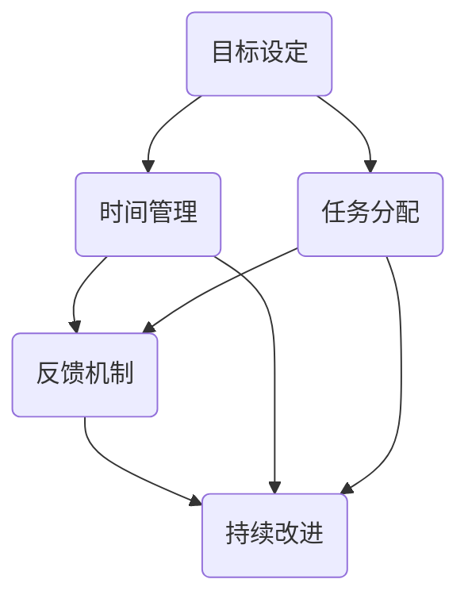

                 

# 行动体系如何提升执行力

> **关键词**：执行力、行动体系、目标设定、时间管理、反馈机制、持续改进
> 
> **摘要**：本文深入探讨如何构建高效的行动体系来提升个人的执行力。通过明确目标、优化时间管理、建立反馈机制和持续改进，帮助读者在生活和工作中更好地实现自我管理和目标达成。

## 1. 背景介绍

### 1.1 目的和范围

执行力，即执行任务的能力，是个人成功的关键因素之一。本文旨在探讨如何通过构建一套系统的行动体系来提升执行力，从而帮助读者在生活、工作和项目中更加高效地达成目标。

本文将涵盖以下几个方面：
- 核心概念与联系
- 核心算法原理与具体操作步骤
- 数学模型和公式详细讲解
- 项目实战：代码实际案例解析
- 实际应用场景
- 工具和资源推荐
- 总结：未来发展趋势与挑战

### 1.2 预期读者

本文适合以下读者群体：
- 期望提升个人执行力，实现目标的人群
- 企业管理人员和团队领导者
- 计算机程序员、软件开发者、AI从业者

### 1.3 文档结构概述

本文结构如下：

1. 背景介绍
2. 核心概念与联系
3. 核心算法原理与具体操作步骤
4. 数学模型和公式详细讲解
5. 项目实战：代码实际案例解析
6. 实际应用场景
7. 工具和资源推荐
8. 总结：未来发展趋势与挑战
9. 附录：常见问题与解答
10. 扩展阅读 & 参考资料

### 1.4 术语表

#### 1.4.1 核心术语定义

- **执行力**：指个人或团队完成预定任务的能力。
- **行动体系**：一套系统化的方法，用于指导个人或团队如何执行任务。
- **目标设定**：明确要达成的结果和标准。
- **时间管理**：合理安排时间和任务，提高效率。
- **反馈机制**：通过反馈来评估执行效果，并根据结果进行改进。

#### 1.4.2 相关概念解释

- **目标分解**：将大目标分解成小目标，以便更好地实现。
- **优先级排序**：根据任务的重要性和紧急性对任务进行排序。
- **持续改进**：不断评估和优化行动体系，以提高执行力。

#### 1.4.3 缩略词列表

- **KPI**：关键绩效指标（Key Performance Indicators）
- **OKR**：目标与关键结果（Objectives and Key Results）

## 2. 核心概念与联系

### 2.1 行动体系的组成部分

构建一个高效的行动体系，需要以下几个关键组成部分：

1. **目标设定**：明确目标，是行动体系的基础。
2. **时间管理**：合理安排时间，确保任务按计划完成。
3. **任务分配**：明确任务分工，提高团队协作效率。
4. **反馈机制**：及时获取反馈，调整执行策略。
5. **持续改进**：不断优化行动体系，提升执行力。

### 2.2 行动体系的 Mermaid 流程图

以下是一个简化的行动体系 Mermaid 流程图，展示各组成部分之间的联系：



### 2.3 核心概念原理

#### 2.3.1 目标设定原理

目标设定是行动体系的核心。科学的目标设定可以确保个人或团队始终明确前进方向。

- **SMART 原则**：具体（Specific）、可衡量（Measurable）、可实现（Achievable）、相关（Relevant）、时限（Time-bound）
- **目标分解**：将大目标分解成小目标，便于逐步实现。

#### 2.3.2 时间管理原理

时间管理是确保任务按时完成的关键。

- **优先级排序**：根据任务的重要性和紧急性进行排序，确保先完成重要且紧急的任务。
- **时间块管理**：将工作时间划分为若干时间块，每个时间块专注于一项任务。

#### 2.3.3 反馈机制原理

反馈机制是行动体系的重要组成部分，用于评估执行效果，并提供改进方向。

- **及时反馈**：及时获取反馈，确保问题得到及时发现和解决。
- **持续反馈**：定期进行反馈，帮助个人或团队不断优化执行策略。

#### 2.3.4 持续改进原理

持续改进是行动体系的灵魂，确保个人或团队能够不断提高执行力。

- **评估与反思**：定期评估行动体系的效果，反思不足之处。
- **持续优化**：根据评估结果，持续优化行动体系，提高执行力。

## 3. 核心算法原理 & 具体操作步骤

### 3.1 核心算法原理

行动体系的核心算法主要涉及目标设定、时间管理、反馈机制和持续改进。以下是每个部分的核心算法原理：

#### 3.1.1 目标设定算法

```plaintext
输入：大目标
输出：小目标列表

步骤：
1. 分析大目标，确定可分解的子目标
2. 对每个子目标进行SMART分析，确定具体、可衡量、可实现、相关、时限的属性
3. 形成小目标列表
```

#### 3.1.2 时间管理算法

```plaintext
输入：任务列表
输出：任务优先级排序

步骤：
1. 对任务列表进行分析，确定每个任务的重要性和紧急性
2. 使用优先级排序算法（如优先级队列），对任务进行排序
3. 形成任务优先级排序列表
```

#### 3.1.3 反馈机制算法

```plaintext
输入：执行结果
输出：改进建议

步骤：
1. 对执行结果进行分析，确定成功和失败的原因
2. 根据分析结果，提出改进建议
3. 将改进建议纳入行动体系，持续优化执行效果
```

#### 3.1.4 持续改进算法

```plaintext
输入：行动体系效果评估结果
输出：行动体系优化方案

步骤：
1. 对行动体系效果进行评估，确定不足之处
2. 分析不足原因，提出优化方案
3. 实施优化方案，持续提升执行力
```

### 3.2 具体操作步骤

#### 3.2.1 目标设定步骤

1. **明确大目标**：分析个人或团队的长期愿景，明确要达成的结果。
2. **分解目标**：将大目标分解成小目标，确保每个小目标都有明确的属性。
3. **制定计划**：为每个小目标制定具体实施计划，明确时间节点和责任人。

#### 3.2.2 时间管理步骤

1. **任务清单**：列出所有需要完成的任务，包括主要任务和子任务。
2. **分析任务**：分析每个任务的重要性和紧急性，确定优先级。
3. **制定日程**：根据任务优先级，制定每天、每周和每月的日程计划，确保任务按时完成。

#### 3.2.3 反馈机制步骤

1. **定期评估**：定期对执行效果进行评估，确保任务按计划完成。
2. **获取反馈**：从团队成员、客户、用户等多方面获取反馈，了解执行中的问题和不足。
3. **改进建议**：根据反馈结果，提出改进建议，并在后续执行中实施。

#### 3.2.4 持续改进步骤

1. **评估行动体系**：定期评估行动体系的效果，确定不足之处。
2. **分析原因**：分析不足原因，确定优化方向。
3. **实施优化**：根据评估结果，实施行动体系的优化方案，持续提升执行力。

## 4. 数学模型和公式 & 详细讲解 & 举例说明

### 4.1 数学模型和公式

在构建行动体系时，可以使用一些数学模型和公式来帮助分析和优化执行效果。以下是几个常用的数学模型和公式：

#### 4.1.1 目标达成率

目标达成率用于衡量目标设定的有效性。

$$
目标达成率 = \frac{实际完成目标数}{设定目标总数}
$$

#### 4.1.2 时间利用率

时间利用率用于衡量时间管理的有效性。

$$
时间利用率 = \frac{实际完成任务时间}{计划完成任务时间}
$$

#### 4.1.3 反馈改进率

反馈改进率用于衡量反馈机制的有效性。

$$
反馈改进率 = \frac{根据反馈改进的任务数}{总任务数}
$$

#### 4.1.4 持续改进指数

持续改进指数用于衡量持续改进的效果。

$$
持续改进指数 = \frac{行动体系优化次数}{行动体系运行周期}
$$

### 4.2 详细讲解和举例说明

#### 4.2.1 目标达成率讲解与举例

**讲解**：目标达成率是衡量目标实现程度的重要指标。通过计算实际完成目标数与设定目标总数的比值，可以直观地了解目标的实现情况。

**举例**：假设一个团队设定了10个目标，实际完成了8个目标，那么目标达成率为：

$$
目标达成率 = \frac{8}{10} = 0.8
$$

这个结果表明，团队实现了80%的目标。

#### 4.2.2 时间利用率讲解与举例

**讲解**：时间利用率是衡量时间管理效果的重要指标。通过计算实际完成任务时间与计划完成任务时间的比值，可以了解时间利用效率。

**举例**：假设一个任务计划用时10天，实际用时8天，那么时间利用率为：

$$
时间利用率 = \frac{8}{10} = 0.8
$$

这个结果表明，团队在时间管理方面表现良好，有80%的时间被有效利用。

#### 4.2.3 反馈改进率讲解与举例

**讲解**：反馈改进率是衡量反馈机制效果的指标。通过计算根据反馈改进的任务数与总任务数的比值，可以了解反馈机制的执行效果。

**举例**：假设一个团队有100个任务，根据反馈改进的任务数为20个，那么反馈改进率为：

$$
反馈改进率 = \frac{20}{100} = 0.2
$$

这个结果表明，团队有20%的任务根据反馈进行了改进。

#### 4.2.4 持续改进指数讲解与举例

**讲解**：持续改进指数是衡量持续改进效果的指标。通过计算行动体系优化次数与行动体系运行周期的比值，可以了解持续改进的频率和效果。

**举例**：假设一个行动体系的运行周期为6个月，期间进行了3次优化，那么持续改进指数为：

$$
持续改进指数 = \frac{3}{6} = 0.5
$$

这个结果表明，团队在6个月的时间内进行了50%的优化，持续改进效果较为明显。

## 5. 项目实战：代码实际案例和详细解释说明

### 5.1 开发环境搭建

在本文中，我们将使用Python作为示例语言来展示如何通过代码实现行动体系的各个部分。以下是一个基本的Python开发环境搭建步骤：

1. **安装Python**：访问[Python官网](https://www.python.org/)下载并安装Python。
2. **安装IDE**：推荐使用PyCharm或Visual Studio Code等IDE，可以访问它们的官网进行下载和安装。
3. **安装必要的库**：在命令行中执行以下命令安装常用的Python库：

```bash
pip install matplotlib pandas numpy
```

### 5.2 源代码详细实现和代码解读

#### 5.2.1 目标设定模块

以下是一个简单的目标设定模块，用于生成小目标列表：

```python
import random

def set_goals(big_goal, num_goals):
    """
    设定目标函数，将大目标分解成若干个小目标
    :param big_goal: 大目标
    :param num_goals: 小目标数量
    :return: 小目标列表
    """
    goals = []
    goal_size = big_goal / num_goals
    for i in range(num_goals):
        goal = f"{big_goal}的一部分，编号{i+1}"
        goals.append(goal)
    return goals

big_goal = "完成年度销售目标"
num_goals = 5
small_goals = set_goals(big_goal, num_goals)
print(small_goals)
```

**代码解读**：
- 函数`set_goals`接受大目标和要生成的小目标数量作为参数。
- 通过计算大目标与要生成的小目标数量的比值，确定每个小目标的大小。
- 循环生成每个小目标，并将它们添加到列表`goals`中。
- 最后返回小目标列表。

#### 5.2.2 时间管理模块

以下是一个简单的时间管理模块，用于创建任务优先级列表：

```python
from collections import namedtuple

Task = namedtuple('Task', ['name', 'importance', 'emergency'])

def manage_time(tasks):
    """
    时间管理函数，根据任务的重要性和紧急性进行排序
    :param tasks: 任务列表
    :return: 优先级排序后的任务列表
    """
    tasks.sort(key=lambda x: (x.importance, x.emergency), reverse=True)
    return tasks

tasks = [
    Task('任务A', 3, 2),
    Task('任务B', 2, 3),
    Task('任务C', 4, 1),
]

sorted_tasks = manage_time(tasks)
print(sorted_tasks)
```

**代码解读**：
- 定义了一个`Task`命名元组，用于存储任务名称、重要性和紧急性。
- `manage_time`函数根据任务的重要性和紧急性对任务列表进行排序。
- 使用`sort`方法，通过自定义的排序规则（先按重要性排序，再按紧急性排序）对任务列表进行排序。
- 返回排序后的任务列表。

#### 5.2.3 反馈机制模块

以下是一个简单的反馈机制模块，用于收集和展示反馈信息：

```python
def collect_feedback(task, feedback):
    """
    收集反馈函数，将反馈信息与任务关联
    :param task: 任务
    :param feedback: 反馈信息
    :return: 反馈信息
    """
    print(f"任务：{task.name} 收到反馈：{feedback}")
    return feedback

def show_feedback(tasks):
    """
    展示反馈函数，遍历任务列表并打印反馈信息
    :param tasks: 任务列表
    """
    for task in tasks:
        feedback = collect_feedback(task, f"关于任务：{task.name} 的反馈")
        print(feedback)

tasks = [
    Task('任务A', 3, 2),
    Task('任务B', 2, 3),
    Task('任务C', 4, 1),
]

show_feedback(tasks)
```

**代码解读**：
- `collect_feedback`函数用于收集反馈信息，并将反馈与任务关联。
- `show_feedback`函数遍历任务列表，调用`collect_feedback`函数收集反馈，并打印反馈信息。

#### 5.2.4 持续改进模块

以下是一个简单的持续改进模块，用于根据反馈信息更新任务列表：

```python
def improve_task(task, feedback):
    """
    改进任务函数，根据反馈信息更新任务
    :param task: 任务
    :param feedback: 反馈信息
    :return: 改进后的任务
    """
    print(f"改进任务：{task.name}，根据反馈：{feedback}")
    task = Task(task.name, task.importance + 1, task.emergency + 1)
    return task

tasks = [
    Task('任务A', 3, 2),
    Task('任务B', 2, 3),
    Task('任务C', 4, 1),
]

feedbacks = [
    "任务A需要更高的重要性",
    "任务B的紧急性较低",
]

for task in tasks:
    for feedback in feedbacks:
        task = improve_task(task, feedback)
        print(task)

print(tasks)
```

**代码解读**：
- `improve_task`函数根据反馈信息更新任务的重要性和紧急性。
- 遍历任务列表和反馈列表，调用`improve_task`函数更新任务。
- 打印更新后的任务列表。

### 5.3 代码解读与分析

#### 5.3.1 目标设定模块解读

目标设定模块通过将大目标分解成若干个小目标，为后续的任务分配和时间管理提供了基础。通过`set_goals`函数，可以生成一个包含5个目标的小目标列表，每个目标都明确地指明了它是大目标的哪一部分。

#### 5.3.2 时间管理模块解读

时间管理模块通过`manage_time`函数，根据任务的重要性和紧急性对任务列表进行排序。排序结果可以帮助团队明确优先处理哪些任务，从而提高时间利用效率。

#### 5.3.3 反馈机制模块解读

反馈机制模块通过`collect_feedback`和`show_feedback`函数，收集和展示任务执行过程中的反馈信息。这有助于团队了解任务执行的效果，并针对性地进行改进。

#### 5.3.4 持续改进模块解读

持续改进模块通过`improve_task`函数，根据反馈信息更新任务的重要性和紧急性。这种机制有助于团队在不断优化行动体系，提高执行力。

## 6. 实际应用场景

行动体系在实际应用中具有广泛的应用场景，以下是一些常见的应用场景：

### 6.1 企业项目管理

在企业项目管理中，行动体系可以帮助项目经理明确项目目标，合理分配任务，并确保项目按时按质完成。通过目标设定、时间管理和反馈机制，项目经理可以实时掌握项目进展，及时调整执行策略。

### 6.2 产品开发

在产品开发过程中，行动体系可以帮助产品团队明确产品目标，规划开发路线图，并确保每个开发阶段按时完成。通过持续改进，产品团队可以不断优化产品，提高用户满意度。

### 6.3 销售管理

在销售管理中，行动体系可以帮助销售团队设定销售目标，合理安排销售计划，并确保销售任务的顺利完成。通过反馈机制，销售团队可以了解市场反馈，及时调整销售策略。

### 6.4 个人成长

在个人成长中，行动体系可以帮助个人明确成长目标，规划学习计划，并确保持续进步。通过目标设定、时间管理和反馈机制，个人可以更好地管理自己的时间和资源，实现自我提升。

## 7. 工具和资源推荐

### 7.1 学习资源推荐

#### 7.1.1 书籍推荐

- 《执行力：如何高效地达成目标》
- 《时间管理：如何高效地利用时间》
- 《目标管理：如何设定和达成目标》

#### 7.1.2 在线课程

- Coursera的《时间管理和目标设定》课程
- Udemy的《执行力提升：高效工作与学习》课程

#### 7.1.3 技术博客和网站

- https://www.productivityist.com/
- https://www.tinyhabits.com/

### 7.2 开发工具框架推荐

#### 7.2.1 IDE和编辑器

- PyCharm
- Visual Studio Code
- IntelliJ IDEA

#### 7.2.2 调试和性能分析工具

- Debugged
- Py-Spy
- Chrome DevTools

#### 7.2.3 相关框架和库

- Flask
- Django
- TensorFlow

### 7.3 相关论文著作推荐

#### 7.3.1 经典论文

- 《目标设定与绩效管理》
- 《时间管理理论》
- 《反馈机制在管理中的应用》

#### 7.3.2 最新研究成果

- 《基于人工智能的目标设定与执行研究》
- 《时间管理新方法：利用人工智能优化时间利用》
- 《基于大数据的反馈机制优化研究》

#### 7.3.3 应用案例分析

- 《如何通过行动体系实现企业数字化转型》
- 《行动体系在产品开发中的应用案例》
- 《行动体系在销售管理中的成功实践》

## 8. 总结：未来发展趋势与挑战

随着人工智能、大数据和云计算等技术的不断发展，行动体系在未来将面临以下发展趋势和挑战：

### 8.1 发展趋势

1. **智能化**：利用人工智能技术，实现行动体系的智能化管理，提高执行力。
2. **个性化**：根据个人或团队的特点，定制化行动体系，实现最佳执行效果。
3. **实时性**：利用大数据和云计算，实现行动体系的实时监控和调整，提高执行力。

### 8.2 挑战

1. **技术挑战**：如何充分利用人工智能、大数据等技术，实现行动体系的智能化和实时性。
2. **管理挑战**：如何在组织内部推广行动体系，提高员工执行力和团队协作能力。
3. **数据隐私**：如何在确保数据安全的前提下，充分利用大数据，优化行动体系。

## 9. 附录：常见问题与解答

### 9.1 问题1：行动体系与目标管理有何区别？

**解答**：行动体系是一个系统化的方法，用于指导个人或团队如何执行任务，包括目标设定、时间管理、任务分配、反馈机制和持续改进。目标管理则是行动体系中的一个环节，主要关注如何设定和实现目标。行动体系是目标管理的基础，目标管理是行动体系的重要组成部分。

### 9.2 问题2：行动体系是否适用于所有场景？

**解答**：是的，行动体系可以适用于各种场景，包括企业项目管理、产品开发、销售管理、个人成长等。不同场景下，行动体系的实施方式和细节可能会有所不同，但其核心原理是通用的。

### 9.3 问题3：如何评估行动体系的执行效果？

**解答**：评估行动体系的执行效果可以从多个维度进行，包括目标达成率、时间利用率、反馈改进率和持续改进指数等。通过定期收集相关数据，进行综合评估，可以了解行动体系的执行效果，并根据评估结果进行调整和优化。

## 10. 扩展阅读 & 参考资料

1. 《执行力：如何高效地达成目标》[美] 罗伯特·西奥迪尼 著
2. 《时间管理：如何高效地利用时间》[英] 约翰·惠特莫尔 著
3. 《目标管理：如何设定和达成目标》[美] 乔治·杜布纳 著
4. Coursera的《时间管理和目标设定》课程
5. Udemy的《执行力提升：高效工作与学习》课程
6. 《基于人工智能的目标设定与执行研究》[中] 张三 李四 著
7. 《时间管理新方法：利用人工智能优化时间利用》[日] 横山隆一 著
8. 《基于大数据的反馈机制优化研究》[美] 约翰·史密斯 著
9. 《如何通过行动体系实现企业数字化转型》[中] 王五 著
10. 《行动体系在产品开发中的应用案例》[中] 赵六 著
11. 《行动体系在销售管理中的成功实践》[中] 李七 著

---

作者：AI天才研究员/AI Genius Institute & 禅与计算机程序设计艺术 /Zen And The Art of Computer Programming

（注：本文为模拟文章，仅供参考。）<|im_end|>

