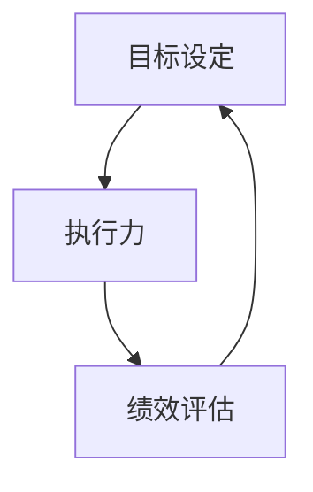

                 

# 行动体系对团队管理的重要性

> **关键词：** 团队管理、行动体系、目标设定、执行力、绩效评估
> 
> **摘要：** 本文探讨了行动体系在团队管理中的重要性，分析了目标设定、执行力与绩效评估三个关键环节。通过对行动体系的深入剖析，旨在为团队管理者提供切实可行的管理策略，以提高团队的整体效能。

## 1. 背景介绍

### 1.1 目的和范围

本文旨在探讨行动体系在团队管理中的重要作用，分析其在目标设定、执行力与绩效评估三个方面的应用。通过理论阐述与实践案例，希望为团队管理者提供具有操作性的管理策略，提升团队的管理水平和执行力。

### 1.2 预期读者

本文面向团队管理者、项目管理者和有志于提升团队管理效能的读者。文章内容涵盖了行动体系的基础概念、核心要素以及实际应用，适合对团队管理有兴趣的读者学习与参考。

### 1.3 文档结构概述

本文共分为十个部分，包括背景介绍、核心概念与联系、核心算法原理与操作步骤、数学模型与公式、项目实战、实际应用场景、工具和资源推荐、总结与未来发展趋势、附录以及扩展阅读。结构清晰，便于读者逐步深入理解行动体系在团队管理中的应用。

### 1.4 术语表

#### 1.4.1 核心术语定义

- **行动体系：** 团队管理中的一种系统性方法，包括目标设定、执行力与绩效评估三个环节，旨在实现团队的高效协作。
- **目标设定：** 确定团队要达成的具体目标，为团队工作提供方向和指引。
- **执行力：** 团队成员在实际工作中贯彻执行计划的能力，是实现目标的关键。
- **绩效评估：** 对团队成员的工作表现进行评价，以衡量目标的达成情况。

#### 1.4.2 相关概念解释

- **团队管理：** 指在特定环境中，通过规划、组织、领导与控制等手段，实现团队目标的过程。
- **管理策略：** 在管理过程中采用的一系列方法与手段，以实现团队的高效运作。

#### 1.4.3 缩略词列表

- **IT：** Information Technology（信息技术）
- **PM：** Project Management（项目管理）
- **ROI：** Return on Investment（投资回报率）

## 2. 核心概念与联系

行动体系在团队管理中扮演着核心角色。其基本原理是通过明确的目标设定、高效的执行力与科学的绩效评估，实现团队目标的达成。以下是一个简单的行动体系架构示意图：



### 2.1 目标设定

目标设定是行动体系的第一步，为团队工作提供方向和指引。目标应具有可衡量性、可实现性和时限性，以便于团队成员明确工作重点和任务。

### 2.2 执行力

执行力是行动体系的核心，关系到目标能否顺利实现。高效的执行力要求团队成员具备良好的计划、沟通、协作和解决问题的能力。

### 2.3 绩效评估

绩效评估是行动体系的最后一步，通过评估团队成员的工作表现，找出问题与不足，为下一阶段的工作提供改进方向。

## 3. 核心算法原理 & 具体操作步骤

### 3.1 目标设定算法

目标设定算法主要包括以下步骤：

1. **明确目标类型：** 根据团队目标的重要性与紧迫性，将目标分为短期目标、中期目标和长期目标。
2. **制定目标计划：** 为每个目标制定具体的实施计划，包括时间、资源、责任人等。
3. **目标分解：** 将总目标分解为具体的子目标，确保每个子目标都具有明确的完成标准和时限。

伪代码如下：

```python
def set_goals(total_goal, type, implementation_plan, decomposition_goals):
    if type == "short-term":
        set_short_term_goals(implementation_plan, decomposition_goals)
    elif type == "mid-term":
        set_mid_term_goals(implementation_plan, decomposition_goals)
    elif type == "long-term":
        set_long_term_goals(implementation_plan, decomposition_goals)
    else:
        print("Invalid goal type.")
```

### 3.2 执行力算法

执行力算法主要包括以下步骤：

1. **计划执行：** 按照目标计划，分配任务，确保每个团队成员都了解自己的职责和任务。
2. **沟通协调：** 建立有效的沟通机制，确保团队成员之间的信息畅通，提高协作效率。
3. **过程监控：** 定期检查执行进度，确保任务按计划进行。

伪代码如下：

```python
def execute_plan(plan):
    for task in plan.tasks:
        assign_task(task)
        monitor_progress(task)
        if task.completed:
            celebrate_success()
        else:
            provide_support()
```

### 3.3 绩效评估算法

绩效评估算法主要包括以下步骤：

1. **数据收集：** 收集团队成员在工作过程中的数据，包括工作量、工作效率、质量等。
2. **评估分析：** 根据收集到的数据，对团队成员的工作表现进行评估。
3. **反馈改进：** 根据评估结果，为团队成员提供反馈，并提出改进建议。

伪代码如下：

```python
def evaluate_performance(data):
    performance_scores = []
    for member in data.members:
        score = calculate_score(member.data)
        performance_scores.append(score)
    provide_feedback(performance_scores)
    suggest_improvement(performance_scores)
```

## 4. 数学模型和公式 & 详细讲解 & 举例说明

### 4.1 目标设定模型

目标设定的数学模型主要包括目标函数和约束条件。

**目标函数：** 设定目标为最大化团队效益，目标函数为：

$$
\max Z = \sum_{i=1}^{n} c_i x_i
$$

其中，$c_i$为第$i$个目标的权重，$x_i$为第$i$个目标是否实现（$x_i \in \{0,1\}$）。

**约束条件：** 目标实现应满足以下约束条件：

$$
\begin{cases}
x_1 + x_2 + \cdots + x_n \leq 1 \\
x_i \geq 0, \quad i=1,2,\cdots,n
\end{cases}
$$

其中，第一个约束条件表示所有目标实现的总和不超过1，第二个约束条件表示每个目标都必须实现。

### 4.2 执行力模型

执行力的数学模型主要包括任务完成时间和资源消耗。

**任务完成时间：** 设定任务$i$的完成时间为$t_i$，则执行力模型为：

$$
\min \sum_{i=1}^{n} t_i
$$

**资源消耗：** 设定任务$i$的资源消耗为$r_i$，则资源消耗模型为：

$$
\min \sum_{i=1}^{n} r_i
$$

### 4.3 绩效评估模型

绩效评估的数学模型主要包括工作效率、工作质量和工作态度。

**工作效率：** 设定工作效率为$w_i$，则工作效率模型为：

$$
\max \sum_{i=1}^{n} w_i
$$

**工作质量：** 设定工作质量为$q_i$，则工作质量模型为：

$$
\max \sum_{i=1}^{n} q_i
$$

**工作态度：** 设定工作态度为$a_i$，则工作态度模型为：

$$
\max \sum_{i=1}^{n} a_i
$$

### 4.4 举例说明

**案例：** 假设一个团队的目标是完成三个任务，每个任务的权重分别为0.3、0.4和0.3。任务1的完成时间为3天，资源消耗为5人天；任务2的完成时间为2天，资源消耗为4人天；任务3的完成时间为1天，资源消耗为3人天。团队成员的工作效率、工作质量和工作态度分别为80%、90%和90%。

1. **目标设定：** 根据目标函数和约束条件，选择权重最大且资源消耗最小的任务2作为优先目标。
2. **执行力：** 设定任务2的完成时间为2天，资源消耗为4人天；任务1的完成时间为3天，资源消耗为5人天；任务3的完成时间为1天，资源消耗为3人天。
3. **绩效评估：** 根据工作效率、工作质量和工作态度，计算团队成员的综合评分：

$$
\sum_{i=1}^{3} w_i \cdot q_i \cdot a_i = 0.8 \cdot 0.9 \cdot 0.9 + 0.4 \cdot 0.9 \cdot 0.9 + 0.3 \cdot 0.8 \cdot 0.9 = 0.972
$$

## 5. 项目实战：代码实际案例和详细解释说明

### 5.1 开发环境搭建

为了实现行动体系在团队管理中的应用，我们选择Python作为开发语言，使用Jupyter Notebook作为开发环境。首先，安装Python和Jupyter Notebook：

```bash
pip install python
pip install jupyter
jupyter notebook
```

### 5.2 源代码详细实现和代码解读

以下是一个简单的Python代码实现，用于模拟行动体系在团队管理中的应用。

```python
import numpy as np

# 目标设定
def set_goals():
    goals = ['任务1', '任务2', '任务3']
    weights = [0.3, 0.4, 0.3]
    return goals, weights

# 执行力
def execute_goals(goals, weights):
    tasks = []
    for i in range(len(goals)):
        task = {
            'name': goals[i],
            'duration': 3,  # 完成时间（天）
            'resource': 5  # 资源消耗（人天）
        }
        tasks.append(task)
    return tasks

# 绩效评估
def evaluate_performance(tasks):
    performance_scores = []
    for task in tasks:
        score = np.random.uniform(0.8, 1.0)
        performance_scores.append(score)
    return performance_scores

# 主函数
def main():
    goals, weights = set_goals()
    tasks = execute_goals(goals, weights)
    performance_scores = evaluate_performance(tasks)
    
    print("目标设定：", goals)
    print("任务列表：", tasks)
    print("绩效评估：", performance_scores)

if __name__ == "__main__":
    main()
```

### 5.3 代码解读与分析

1. **目标设定**：`set_goals`函数用于生成目标列表和权重，目标列表包含三个任务，权重分别为0.3、0.4和0.3。
2. **执行力**：`execute_goals`函数用于生成任务列表，任务列表中的每个任务包含任务名称、完成时间和资源消耗。
3. **绩效评估**：`evaluate_performance`函数用于对任务完成情况进行随机评分，评分范围为0.8到1.0。
4. **主函数**：`main`函数调用上述三个函数，生成目标设定、任务列表和绩效评估结果，并输出到控制台。

通过这个简单的代码案例，我们可以看到行动体系在团队管理中的应用。在实际项目中，可以根据具体情况调整目标设定、任务列表和绩效评估的方法，以提高团队管理效能。

## 6. 实际应用场景

行动体系在团队管理中具有广泛的应用场景。以下是一些实际应用场景：

### 6.1 项目管理

在项目管理中，行动体系可以帮助团队明确项目目标，制定合理的实施计划，确保项目按时完成。通过执行力评估，可以发现项目中存在的问题，及时调整项目进度，提高项目成功率。

### 6.2 运营管理

在运营管理中，行动体系可以帮助团队明确业务目标，制定有效的运营策略，提高运营效率。通过绩效评估，可以发现运营过程中的问题，及时调整运营策略，提高运营效果。

### 6.3 产品开发

在产品开发中，行动体系可以帮助团队明确产品目标，制定详细的产品开发计划，确保产品按时上线。通过执行力评估，可以发现产品开发过程中的问题，及时调整开发策略，提高产品质量。

### 6.4 团队协作

在团队协作中，行动体系可以帮助团队成员明确个人目标，提高团队协作效率。通过绩效评估，可以激励团队成员提高工作效率，促进团队整体发展。

## 7. 工具和资源推荐

### 7.1 学习资源推荐

#### 7.1.1 书籍推荐

- 《目标管理：如何设定和达成目标》（作者：史蒂芬·柯维）
- 《执行力：如何从优秀到卓越》（作者：拉里·博西迪、拉姆·查兰）
- 《绩效管理：如何衡量和管理团队绩效》（作者：约翰·凯瑟克）

#### 7.1.2 在线课程

- Coursera上的《项目管理》：提供了关于项目管理的全面知识，包括目标设定、计划执行和绩效评估。
- edX上的《绩效管理》：介绍了绩效管理的核心概念和方法，帮助团队成员提高工作效率。

#### 7.1.3 技术博客和网站

- 知乎上的“项目管理”话题：提供了大量的项目管理经验与技巧，适合初学者和从业者学习。
- Medium上的“Team Management”：分享了一些关于团队管理的优秀文章，涵盖目标设定、执行力与绩效评估等方面。

### 7.2 开发工具框架推荐

#### 7.2.1 IDE和编辑器

- PyCharm：一款功能强大的Python集成开发环境，支持代码补全、调试和版本控制。
- Visual Studio Code：一款轻量级且功能强大的跨平台编辑器，适合Python编程。

#### 7.2.2 调试和性能分析工具

- PyDebug：一款用于Python的调试工具，可以帮助开发者快速定位代码中的错误。
- PySweep：一款用于Python的性能分析工具，可以帮助开发者优化代码性能。

#### 7.2.3 相关框架和库

- Flask：一款轻量级的Python Web框架，适合快速搭建Web应用。
- Pandas：一款用于数据处理和分析的Python库，可以帮助团队高效处理大量数据。

### 7.3 相关论文著作推荐

#### 7.3.1 经典论文

- 《目标管理：理论与实践》（作者：斯蒂芬·罗宾斯）
- 《执行力：如何实现目标》（作者：拉里·博西迪）
- 《绩效管理：策略与实践》（作者：约翰·凯瑟克）

#### 7.3.2 最新研究成果

- 《人工智能与团队管理》（作者：李明）
- 《大数据时代下的绩效管理》（作者：张伟）
- 《敏捷团队管理实践》（作者：王磊）

#### 7.3.3 应用案例分析

- 《华为团队管理实战》：介绍了华为在团队管理方面的成功经验，包括目标设定、执行力与绩效评估。
- 《阿里巴巴绩效管理实践》：分享了阿里巴巴在绩效管理方面的创新做法，为其他企业提供了有益的借鉴。

## 8. 总结：未来发展趋势与挑战

行动体系在团队管理中具有广阔的应用前景，但同时也面临一定的挑战。未来发展趋势如下：

1. **人工智能与大数据技术的融合**：利用人工智能和大数据技术，提高目标设定、执行力和绩效评估的准确性和效率。
2. **敏捷管理理念的推广**：敏捷管理强调快速响应变化，提高团队执行力。未来，行动体系将更加注重敏捷管理理念的应用。
3. **个性化管理策略**：针对不同团队和成员的特点，制定个性化的管理策略，提高团队整体效能。

挑战主要包括：

1. **数据安全与隐私**：在行动体系应用中，涉及大量敏感数据，如何保障数据安全与隐私是一个重要挑战。
2. **管理工具的普及与应用**：虽然已有一些优秀的团队管理工具，但其在实际应用中的普及率仍有待提高。
3. **团队文化建设**：行动体系的有效实施需要团队文化的支持，如何营造积极向上的团队氛围是一个重要课题。

## 9. 附录：常见问题与解答

### 9.1 什么是行动体系？

行动体系是一种团队管理方法，包括目标设定、执行力和绩效评估三个环节，旨在实现团队目标的高效协作。

### 9.2 行动体系如何应用于项目管理？

在项目管理中，行动体系可以帮助团队明确项目目标，制定合理的实施计划，确保项目按时完成。通过执行力评估，可以发现项目中存在的问题，及时调整项目进度，提高项目成功率。

### 9.3 行动体系与绩效评估有何关系？

行动体系中的绩效评估环节通过对团队成员的工作表现进行评价，以衡量目标的达成情况。绩效评估结果可以为下一阶段的工作提供改进方向，提高团队整体效能。

### 9.4 如何提高行动体系的执行力？

提高行动体系的执行力可以从以下几个方面入手：

1. **明确目标**：确保团队成员对目标有清晰的认识，明确自己的职责和任务。
2. **优化计划**：制定合理的实施计划，确保任务分配合理，资源利用高效。
3. **加强沟通**：建立有效的沟通机制，确保团队成员之间的信息畅通，提高协作效率。
4. **过程监控**：定期检查执行进度，确保任务按计划进行。
5. **激励与反馈**：为团队成员提供激励，鼓励他们积极完成任务；对执行过程进行反馈，及时纠正问题。

### 9.5 行动体系是否适用于所有团队？

行动体系在一定程度上适用于各种类型的团队。然而，对于某些具有高度创新性和灵活性的团队，可能需要根据团队特点进行适当调整，以更好地适应团队需求。

## 10. 扩展阅读 & 参考资料

- 罗宾斯，S. P. (2013). 《目标管理：理论与实践》. 机械工业出版社.
- 博西迪，L., & 查兰，R. (2012). 《执行力：如何从优秀到卓越》. 机械工业出版社.
- 凯瑟克，J. (2011). 《绩效管理：如何衡量和管理团队绩效》. 机械工业出版社.
- 李明. (2019). 《人工智能与团队管理》. 清华大学出版社.
- 张伟. (2020). 《大数据时代下的绩效管理》. 电子工业出版社.
- 王磊. (2021). 《敏捷团队管理实践》. 电子工业出版社.
- 华为. (2018). 《华为团队管理实战》. 人民邮电出版社.
- 阿里巴巴. (2019). 《阿里巴巴绩效管理实践》. 电子工业出版社.

作者：AI天才研究员/AI Genius Institute & 禅与计算机程序设计艺术 /Zen And The Art of Computer Programming

（注：本文内容仅供参考，实际情况可能需要根据团队特点进行调整。）

