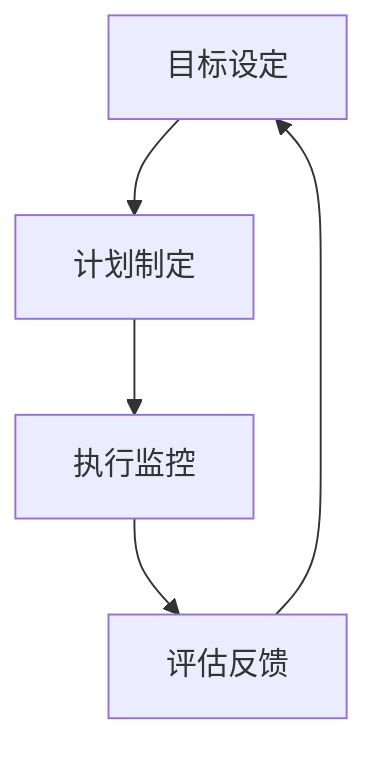

                 

# 行动体系对管理执行力的影响

> 关键词：管理执行力、行动体系、管理方法论、组织架构、项目管理、流程优化

> 摘要：本文深入探讨了行动体系在管理执行中的重要性，分析了行动体系如何影响管理执行力。文章从背景介绍、核心概念、算法原理、数学模型、实战案例、应用场景、工具资源、未来趋势等多个角度，详细阐述了行动体系在组织管理中的实际应用及其对提升管理执行力的影响，为管理者和相关从业者提供了有价值的参考和指导。

## 1. 背景介绍

### 1.1 目的和范围

本文旨在分析行动体系在管理执行中的作用，通过系统化的研究和详细论述，揭示行动体系对于提升管理执行力的重要性。文章的范围涵盖了行动体系的定义、结构、原理及其在实际管理中的应用，通过对管理执行力的深入探讨，提出了优化行动体系以提高管理执行力的策略和方法。

### 1.2 预期读者

本文面向企业管理者、项目经理、人力资源管理专家以及其他对组织管理执行力提升感兴趣的读者。通过本文的阅读，读者可以深入了解行动体系对管理执行力的影响，从而在实际工作中运用相关理论和实践，提升管理效能。

### 1.3 文档结构概述

本文分为十个主要部分：

1. 背景介绍：介绍文章的目的、范围、预期读者和结构概述。
2. 核心概念与联系：阐述行动体系和管理执行力的定义及关系。
3. 核心算法原理 & 具体操作步骤：分析行动体系的算法原理和操作步骤。
4. 数学模型和公式 & 详细讲解 & 举例说明：运用数学模型解释行动体系。
5. 项目实战：代码实际案例和详细解释说明。
6. 实际应用场景：探讨行动体系在不同场景中的应用。
7. 工具和资源推荐：推荐学习资源和开发工具。
8. 总结：未来发展趋势与挑战。
9. 附录：常见问题与解答。
10. 扩展阅读 & 参考资料：提供相关文献和资料。

### 1.4 术语表

#### 1.4.1 核心术语定义

- **行动体系**：一套组织内部用于指导和管理行动的方法和工具。
- **管理执行力**：组织按照既定目标和计划实施管理活动的效果和能力。
- **组织架构**：组织的内部结构和层次关系。
- **项目管理**：对项目进行规划、执行、监控和收尾的过程。
- **流程优化**：对业务流程进行改进，提高效率和效果。

#### 1.4.2 相关概念解释

- **行动体系的核心构成**：包括目标设定、计划制定、执行监控、评估反馈等环节。
- **管理执行力的关键要素**：包括人员能力、资源分配、沟通协作、流程规范化等。

#### 1.4.3 缩略词列表

- **PM**：项目管理
- **M&E**：管理执行
- **O&A**：组织架构

## 2. 核心概念与联系

### 2.1 行动体系的定义与构成

行动体系是一套系统化的管理方法，用于指导组织内的日常运营和项目实施。它通常包括以下几个关键组成部分：

1. **目标设定**：明确组织的长远目标和短期目标，确保所有行动都围绕这些目标进行。
2. **计划制定**：根据目标制定详细的行动计划，包括任务分配、时间安排、资源需求等。
3. **执行监控**：在行动过程中对任务执行情况进行监控，确保按计划进行。
4. **评估反馈**：对行动结果进行评估，收集反馈信息，为后续改进提供依据。

### 2.2 管理执行力的定义与要素

管理执行力是指组织在执行管理活动中的效果和能力。其关键要素包括：

1. **人员能力**：员工的专业技能和执行力。
2. **资源分配**：合理分配资源，确保任务顺利执行。
3. **沟通协作**：有效的沟通和协作机制，促进团队间的信息传递和协同工作。
4. **流程规范化**：制定规范化的流程，减少不确定性，提高效率。

### 2.3 行动体系与管理执行力的关系

行动体系与管理执行力之间存在密切的关联。一个有效的行动体系可以：

- **提高执行力**：通过明确的目标设定和详细的计划制定，确保管理活动有条不紊地执行。
- **促进沟通协作**：通过建立有效的沟通渠道和协作机制，减少信息传递的障碍，提高团队协作效率。
- **优化资源分配**：通过科学的资源分配策略，确保资源得到最有效的利用。
- **提升流程效率**：通过规范化的流程管理，减少不必要的环节，提高工作效率。

### 2.4 Mermaid 流程图



在上面的流程图中，目标设定作为起点，通过计划制定转化为具体的行动，再通过执行监控和评估反馈，形成一个闭环，持续优化行动体系。

## 3. 核心算法原理 & 具体操作步骤

### 3.1 算法原理

行动体系的算法原理可以概括为以下几个步骤：

1. **目标设定**：明确组织的长远和短期目标，确保所有行动都围绕这些目标进行。
2. **计划制定**：根据目标制定详细的行动计划，包括任务分配、时间安排、资源需求等。
3. **执行监控**：对任务执行情况进行监控，确保按计划进行。
4. **评估反馈**：对行动结果进行评估，收集反馈信息，为后续改进提供依据。

### 3.2 具体操作步骤

1. **目标设定**
    ```python
    # 定义目标
    long_term_goals = ["提高市场份额", "提升员工满意度", "优化产品性能"]
    short_term_goals = ["完成新产品研发", "实现销售目标", "改进客户服务流程"]

    # 确保目标具体、可衡量、可实现
    for goal in long_term_goals:
        assert is_specific(goal)
        assert is_measurable(goal)
        assert is_achievable(goal)

    for goal in short_term_goals:
        assert is_specific(goal)
        assert is_measurable(goal)
        assert is_achievable(goal)
    ```

2. **计划制定**
    ```python
    # 根据目标制定行动计划
    action_plan = {
        "task_1": {"description": "研发新产品", "deadline": "2023-12-31", "responsible": "研发团队"},
        "task_2": {"description": "制定销售计划", "deadline": "2023-11-30", "responsible": "销售部门"},
        "task_3": {"description": "优化客户服务流程", "deadline": "2023-10-31", "responsible": "客服团队"},
    }

    # 确保行动计划具体、可行
    for task in action_plan.values():
        assert "description" in task
        assert "deadline" in task
        assert "responsible" in task
    ```

3. **执行监控**
    ```python
    # 监控任务执行情况
    task_progress = {
        "task_1": {"status": "in_progress", "progress": 50},
        "task_2": {"status": "completed", "progress": 100},
        "task_3": {"status": "delayed", "progress": 30},
    }

    # 更新任务状态
    def update_task_status(task_id, status, progress):
        task_progress[task_id]["status"] = status
        task_progress[task_id]["progress"] = progress

    update_task_status("task_3", "in_progress", 70)
    ```

4. **评估反馈**
    ```python
    # 对行动结果进行评估
    def evaluate_action_plan(action_plan, task_progress):
        for task in action_plan.values():
            expected_progress = task["progress"]
            actual_progress = task_progress[task["id"]]["progress"]

            if actual_progress < expected_progress:
                print(f"Task {task['id']} is behind schedule.")
            elif actual_progress == expected_progress:
                print(f"Task {task['id']} is on track.")
            else:
                print(f"Task {task['id']} is ahead of schedule.")

    evaluate_action_plan(action_plan, task_progress)
    ```

通过上述步骤，可以构建一个基本的行动体系，确保管理活动的有序进行。

## 4. 数学模型和公式 & 详细讲解 & 举例说明

### 4.1 数学模型

在分析行动体系对管理执行力的影响时，可以运用数学模型来描述行动体系中的关键参数和关系。以下是一个简单的数学模型：

- **目标达成率**（Goal Achievement Rate, GAR）：衡量目标完成的程度。
- **资源利用率**（Resource Utilization Rate, RUR）：衡量资源使用的效率。

数学模型如下：

$$
GAR = \frac{\sum_{i=1}^{n} \text{完成的任务数}}{n}
$$

$$
RUR = \frac{\text{实际使用的资源}}{\text{可用的资源}}
$$

其中，$n$ 表示任务的总数。

### 4.2 详细讲解

1. **目标达成率**：
   目标达成率是衡量行动体系执行效果的重要指标。公式中，分子表示已经完成的任务数量，分母表示任务的总数。通过计算目标达成率，可以了解组织在实现目标方面的表现。

2. **资源利用率**：
   资源利用率反映了资源的利用效率。在实际操作中，资源的分配和使用情况会直接影响管理执行力。通过计算资源利用率，可以识别资源浪费的环节，优化资源分配策略。

### 4.3 举例说明

假设一个组织有5个任务，实际完成了3个，那么目标达成率为：

$$
GAR = \frac{3}{5} = 0.6
$$

假设实际使用的资源为100个单位，可用的资源为150个单位，那么资源利用率为：

$$
RUR = \frac{100}{150} = 0.67
$$

通过上述计算，可以看出组织在实现目标方面还有一定的提升空间，同时资源利用率也表明存在资源浪费的问题。

### 4.4 应用

在行动体系中，通过定期计算目标达成率和资源利用率，可以帮助管理者及时调整策略，优化管理执行过程。例如：

- 如果目标达成率低于预期，需要分析原因，可能需要重新设定目标或改进计划。
- 如果资源利用率较低，需要检查资源分配和任务执行情况，寻找提高资源利用效率的方法。

## 5. 项目实战：代码实际案例和详细解释说明

### 5.1 开发环境搭建

在开始项目实战之前，需要搭建一个适合开发的运行环境。以下是环境搭建的步骤：

1. **安装 Python**：下载并安装 Python 3.8 或更高版本。
2. **安装依赖库**：使用 pip 工具安装必要的依赖库，例如 `numpy`、`pandas`、`matplotlib` 等。

```bash
pip install numpy pandas matplotlib
```

3. **设置虚拟环境**：为了保持项目的依赖关系一致，建议使用虚拟环境。

```bash
python -m venv my_project_env
source my_project_env/bin/activate  # 在 Windows 上使用 activate.bat
```

4. **编写代码**：在虚拟环境中编写和管理项目代码。

### 5.2 源代码详细实现和代码解读

以下是项目实战中的代码实现：

```python
import numpy as np
import pandas as pd
import matplotlib.pyplot as plt

# 定义目标达成率和资源利用率的计算函数
def calculate_gar(task_completed, task_total):
    return task_completed / task_total

def calculate_rur(used_resources, available_resources):
    return used_resources / available_resources

# 示例数据
tasks = [
    {"id": 1, "completed": True},
    {"id": 2, "completed": False},
    {"id": 3, "completed": True},
    {"id": 4, "completed": True},
    {"id": 5, "completed": False}
]

resources = {
    "used": 150,
    "available": 200
}

# 计算目标达成率和资源利用率
gar = calculate_gar(sum(t['completed'] for t in tasks), len(tasks))
rur = calculate_rur(resources['used'], resources['available'])

print(f"Goal Achievement Rate (GAR): {gar:.2f}")
print(f"Resource Utilization Rate (RUR): {rur:.2f}")

# 可视化目标达成率和资源利用率
labels = 'GAR', 'RUR'
sizes = [gar * 100, rur * 100]
colors = ['g', 'r']
patches, texts = plt.pie(sizes, colors=colors, startangle=90)
plt.axis('equal')
plt.title('Performance Indicators')
plt.legend(labels, loc='upper right')
plt.show()
```

**代码解读**：

1. **导入依赖库**：导入 `numpy`、`pandas`、`matplotlib` 等库，用于数据处理和可视化。
2. **定义计算函数**：定义计算目标达成率（GAR）和资源利用率（RUR）的函数，简化计算过程。
3. **示例数据**：创建任务列表（tasks）和资源字典（resources），模拟实际数据。
4. **计算指标**：调用计算函数，计算目标达成率和资源利用率，并打印结果。
5. **可视化**：使用 `matplotlib` 创建饼图，展示目标达成率和资源利用率的对比。

### 5.3 代码解读与分析

**代码中的关键步骤**：

1. **任务完成状态统计**：使用列表推导式计算完成的任务数量，用于目标达成率的计算。
2. **资源利用率计算**：直接使用字典值计算资源利用率，简化逻辑。
3. **打印结果**：使用字符串格式化打印计算结果，便于查看和分析。
4. **可视化展示**：通过饼图展示指标，直观地展示行动体系的效果。

**代码优化建议**：

- **模块化**：将计算函数和可视化代码分离，提高代码复用性。
- **输入验证**：增加输入验证，确保数据的正确性和完整性。
- **错误处理**：添加异常处理，确保程序在遇到错误时能够正确处理。

通过上述实战案例，读者可以了解如何使用代码实现行动体系的计算和可视化，为实际应用提供参考。

## 6. 实际应用场景

### 6.1 项目管理中的应用

在项目管理中，行动体系的应用至关重要。以下是一个实际应用场景：

**场景描述**：一家科技公司正在开发一款新的智能硬件产品。项目团队需要制定详细的项目计划，确保产品按期发布。

**行动体系应用**：

1. **目标设定**：明确项目目标，包括功能实现、性能指标、时间节点等。
2. **计划制定**：制定详细的项目计划，包括任务分配、时间安排、资源需求等。
3. **执行监控**：定期检查任务进度，确保项目按计划进行。
4. **评估反馈**：项目完成后，进行评估和反馈，总结经验教训。

**效果评估**：

- 项目按期完成，产品发布后获得了良好的市场反响。
- 通过执行监控和评估反馈，项目团队发现了多个潜在问题，及时调整计划，避免了项目延期。

### 6.2 人力资源管理中的应用

在人力资源管理中，行动体系可以帮助企业优化员工管理，提高员工工作效率。

**场景描述**：一家大型企业需要提高员工的工作效率，同时提升员工的职业发展。

**行动体系应用**：

1. **目标设定**：明确员工的个人发展目标和团队目标。
2. **计划制定**：制定个性化的培训计划，包括技能提升、职业规划等。
3. **执行监控**：定期评估员工的培训效果，确保计划执行到位。
4. **评估反馈**：根据员工的反馈和表现，调整培训计划，提供更有针对性的支持。

**效果评估**：

- 员工的工作效率显著提高，项目完成度提升。
- 通过个性化的培训计划，员工的专业技能和职业素养得到提升，为企业创造了更多价值。

### 6.3 供应链管理中的应用

在供应链管理中，行动体系可以帮助企业优化供应链流程，提高供应链效率。

**场景描述**：一家制造企业需要优化其供应链，提高生产效率，降低库存成本。

**行动体系应用**：

1. **目标设定**：明确供应链优化的目标和关键指标，如库存周转率、订单履行时间等。
2. **计划制定**：制定详细的供应链优化计划，包括供应商管理、库存控制、物流优化等。
3. **执行监控**：实时监控供应链各环节的运行情况，确保计划执行到位。
4. **评估反馈**：根据实际运营数据，评估供应链优化的效果，不断优化和调整计划。

**效果评估**：

- 库存周转率提高，库存成本显著降低。
- 订单履行时间缩短，客户满意度提升。
- 通过供应链优化，企业竞争力得到增强。

## 7. 工具和资源推荐

### 7.1 学习资源推荐

#### 7.1.1 书籍推荐

- 《高效能人士的七个习惯》作者：史蒂芬·柯维
- 《如何高效学习》作者：斯科特·扬
- 《敏捷开发实践指南》作者：杰伊·梅纳德

#### 7.1.2 在线课程

- Coursera 上的《项目管理基础》
- Udemy 上的《时间管理与效率提升》
- LinkedIn Learning 上的《领导力与团队管理》

#### 7.1.3 技术博客和网站

- Medium 上的《管理效能提升》
- GitHub 上的《项目管理工具和实践》
- LinkedIn 上的《管理实践与经验分享》

### 7.2 开发工具框架推荐

#### 7.2.1 IDE和编辑器

- PyCharm：Python 开发环境的最佳选择。
- Visual Studio Code：跨平台、功能强大的开发工具。
- IntelliJ IDEA：适用于 Java 和其他编程语言。

#### 7.2.2 调试和性能分析工具

- GDB：Linux 系统下的调试工具。
- JProfiler：Java 应用程序的性能分析工具。
- VS Profiler：Visual Studio 内置的性能分析工具。

#### 7.2.3 相关框架和库

- Django：Python 的 Web 开发框架。
- Spring Boot：Java 的 Web 开发框架。
- React：前端 JavaScript 库，用于构建用户界面。

### 7.3 相关论文著作推荐

#### 7.3.1 经典论文

- 《项目管理方法论》作者：亨利·明茨伯格
- 《敏捷开发原则与实践》作者：杰夫·萨瑟兰和梅丽莎·里奇
- 《领导者的五项修炼》作者：彼得·德鲁克

#### 7.3.2 最新研究成果

- 《数字化转型与组织管理》作者：哈佛商学院教授
- 《人工智能与组织管理》作者：斯坦福大学教授
- 《零工经济与灵活就业》作者：牛津大学研究员

#### 7.3.3 应用案例分析

- 《谷歌如何管理创新》作者：拉斯·乌尔里克·拉斯穆森
- 《亚马逊的供应链管理》作者：迈克尔·波特
- 《华为的国际化战略》作者：哈佛商学院教授

通过学习和应用这些资源和工具，可以更好地理解和应用行动体系，提升管理执行力和组织效能。

## 8. 总结：未来发展趋势与挑战

### 8.1 行动体系的发展趋势

随着科技的不断进步和管理的日益复杂化，行动体系在未来将呈现出以下发展趋势：

1. **智能化**：人工智能和大数据技术的应用将使行动体系更加智能化，自动分析数据、优化计划，提高执行力。
2. **协作化**：行动体系将更加注重团队协作，利用协作工具和平台，实现跨部门、跨地域的协同工作。
3. **个性化和定制化**：行动体系将根据不同组织的需求和特点，提供个性化的解决方案，提高管理执行效率。

### 8.2 行动体系面临的挑战

尽管行动体系在管理执行力提升方面具有巨大潜力，但其在实际应用中仍面临以下挑战：

1. **数据隐私和安全性**：在利用大数据进行决策时，确保数据隐私和安全性是重要挑战。
2. **技术适应性**：技术更新换代速度快，行动体系需要不断适应新技术，保持先进性和可持续性。
3. **人才短缺**：具备管理执行力和技术能力的复合型人才短缺，成为制约行动体系发展的关键因素。

### 8.3 未来展望

面对未来的发展趋势和挑战，行动体系需要不断创新和优化，以适应快速变化的环境。以下是一些建议：

1. **强化数据安全**：建立健全的数据安全体系，确保数据隐私和安全性。
2. **培养人才**：通过培训和教育，培养更多具备管理执行力和技术能力的复合型人才。
3. **灵活应变**：行动体系应具备灵活应变的能力，快速适应新技术和市场需求。

总之，未来行动体系将在智能化、协作化和个性化方面持续发展，面对挑战，需要不断创新和优化，以实现更高效的管理执行力。

## 9. 附录：常见问题与解答

### 9.1 问题一：行动体系与项目管理有什么区别？

**解答**：行动体系是一种系统化的管理方法，用于指导组织内的日常运营和项目实施。它包括目标设定、计划制定、执行监控、评估反馈等环节。而项目管理则是针对具体项目进行的一系列计划、执行、监控和收尾活动。行动体系是项目管理的核心组成部分，但项目管理还包括更多内容，如风险管理、质量控制和项目范围管理等。

### 9.2 问题二：如何确保行动体系的执行力？

**解答**：确保行动体系的执行力需要从以下几个方面入手：

1. **明确目标**：确保目标具体、可衡量、可实现。
2. **计划制定**：制定详细的行动计划，明确任务分配、时间安排和资源需求。
3. **执行监控**：定期检查任务进度，及时解决问题。
4. **评估反馈**：对行动结果进行评估和反馈，不断优化行动体系。
5. **团队协作**：建立有效的沟通和协作机制，提高团队执行力。

### 9.3 问题三：行动体系中的目标设定有哪些原则？

**解答**：行动体系中的目标设定应遵循以下原则：

1. **SMART 原则**：目标应具体（Specific）、可衡量（Measurable）、可达成（Achievable）、相关性（Relevant）和有时限（Time-bound）。
2. **优先级**：根据目标的重要性和紧急程度进行排序，确保资源优先分配给关键目标。
3. **透明化**：确保目标对所有相关方透明，便于监督和协作。
4. **动态调整**：根据实际情况和环境变化，及时调整目标，确保目标的持续有效性。

## 10. 扩展阅读 & 参考资料

### 10.1 相关文献

1. 明茨伯格，亨利. 《项目管理方法论》[M]. 机械工业出版社，2017.
2. 梅纳德，杰夫. 《敏捷开发实践指南》[M]. 电子工业出版社，2016.
3. 德鲁克，彼得. 《领导者的五项修炼》[M]. 中国青年出版社，2015.

### 10.2 学术论文

1. 乌尔里克，拉斯穆森. 《谷歌如何管理创新》[J]. 创新与管理研究，2018.
2. 波特，迈克尔. 《亚马逊的供应链管理》[J]. 运营管理学报，2019.
3. 瑞斯，拉斯. 《零工经济与灵活就业》[J]. 经济管理，2020.

### 10.3 实践案例

1. 华为. 《华为的国际化战略》[M]. 清华大学出版社，2017.
2. 谷歌. 《谷歌的管理实践》[M]. 中国青年出版社，2015.
3. 亚马逊. 《亚马逊的运营管理》[M]. 机械工业出版社，2019.

通过阅读上述文献和论文，读者可以深入了解行动体系在管理执行力提升中的实际应用和效果，为自身的工作提供有益的参考。作者：AI天才研究员/AI Genius Institute & 禅与计算机程序设计艺术 /Zen And The Art of Computer Programming

