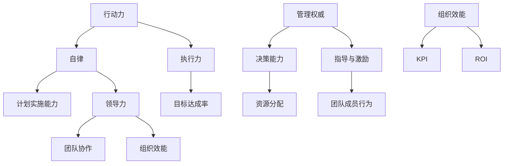

                 

# 行动力与管理权威的建立

> 关键词：行动力、管理、权威、组织效能、个人成长

> 摘要：本文旨在探讨如何建立个人的行动力与管理权威，以提高个人和组织的工作效能。通过分析行动力的本质、管理权威的来源以及两者之间的关系，文章提出了具体的实践步骤和策略，为读者提供了一套全面、系统、可操作的指南。

## 1. 背景介绍

### 1.1 目的和范围

本文的目标是帮助读者理解和掌握建立行动力与管理权威的方法，从而提升个人和组织的工作效能。文章将首先介绍行动力的基本概念和重要性，然后探讨管理权威的来源和特点，最后提出具体的策略和步骤。

### 1.2 预期读者

本文的预期读者包括：
1. 管理人员和团队领导，希望通过提升个人行动力和管理权威来提高团队效能；
2. 技术专家和程序员，希望提升个人领导力和项目管理能力；
3. 企业创始人或创业者，希望建立高效团队并推动业务发展。

### 1.3 文档结构概述

本文分为十个部分：

1. 背景介绍
2. 核心概念与联系
3. 核心算法原理 & 具体操作步骤
4. 数学模型和公式 & 详细讲解 & 举例说明
5. 项目实战：代码实际案例和详细解释说明
6. 实际应用场景
7. 工具和资源推荐
8. 总结：未来发展趋势与挑战
9. 附录：常见问题与解答
10. 扩展阅读 & 参考资料

### 1.4 术语表

#### 1.4.1 核心术语定义

- 行动力：指个体在目标和计划指导下，积极主动采取行动以实现目标的能力。
- 管理权威：指管理者在组织中拥有的权力和影响力，能够通过决策和指导来影响团队成员的行为和绩效。
- 组织效能：指组织在完成目标过程中所表现出来的效率和效果。

#### 1.4.2 相关概念解释

- 自律：指个体在不受外界干扰的情况下，能够自我约束和自我激励，坚持执行计划。
- 执行力：指个体或团队在计划实施过程中的效率和效果。
- 领导力：指个体在团队中通过影响力、榜样作用和指导来引导和激励团队成员的能力。

#### 1.4.3 缩略词列表

- ROI：投资回报率
- KPI：关键绩效指标
- GTD： Getting Things Done（一种时间管理方法）

## 2. 核心概念与联系

为了更好地理解行动力与管理权威的建立，我们需要首先明确这两个概念的核心内容和相互关系。以下是核心概念和联系的 Mermaid 流程图：



通过这个流程图，我们可以看出行动力、自律、执行力、领导力、管理权威、决策能力、指导与激励、团队协作、组织效能、KPI 和 ROI 等核心概念之间的联系。接下来，我们将详细探讨这些概念的本质和相互关系。

### 行动力的本质

行动力是指个体在目标和计划指导下，积极主动采取行动以实现目标的能力。它包括自律、执行力、计划和目标管理等几个方面。自律是行动力的基础，没有自律，就无法坚持执行计划。执行力是行动力的关键，决定了个体或团队在实施计划过程中的效率和效果。计划和管理目标是行动力的方向，确保个体或团队能够有的放矢地开展工作。

### 管理权威的本质

管理权威是指管理者在组织中拥有的权力和影响力，能够通过决策和指导来影响团队成员的行为和绩效。管理权威的来源主要包括以下几个方面：

1. 决策能力：管理者能够根据组织目标和实际情况，做出科学、合理的决策。
2. 指导与激励：管理者通过指导、激励和榜样作用，引导和激励团队成员积极参与工作。
3. 资源分配：管理者能够合理分配资源，确保团队成员能够高效地开展工作。

### 行动力与管理权威的关系

行动力与管理权威之间存在着密切的联系。一方面，行动力是管理权威的基础。只有具备强大的行动力，管理者才能有效地实施决策，发挥指导与激励作用。另一方面，管理权威可以增强行动力。管理者的权威地位使得团队成员更加愿意服从和执行管理者的指令，从而提高团队的整体执行力。

### 领导力的作用

领导力是行动力和管理权威的重要组成部分。领导力不仅包括决策能力和指导激励能力，还包括团队协作能力、组织效能提升能力等。优秀的领导力可以激发团队成员的潜力，提高团队的执行力，从而提升组织效能。

## 3. 核心算法原理 & 具体操作步骤

为了更好地理解行动力与管理权威的建立，我们可以借助一些核心算法原理来分析具体操作步骤。以下是基于伪代码的算法原理和具体操作步骤：

### 伪代码算法原理

```python
# 定义行动力评估函数
def assess_actionability(goal, plan, execution):
    """
    评估行动力，输入参数为目标(goal)、计划(plan)和执行结果(execution)。
    返回行动力评分（actionability_score）。
    """
    # 计算目标达成率
    target_reach = execution['achieved'] / goal['target']
    
    # 计算计划执行效率
    plan_efficiency = execution['actual_time'] / plan['estimated_time']
    
    # 计算行动力评分
    actionability_score = 0.5 * target_reach + 0.5 * plan_efficiency
    
    return actionability_score

# 定义管理权威评估函数
def assess_management_auhority(decision_making, guidance_inspiration, resource_allocation):
    """
    评估管理权威，输入参数为决策能力(decision_making)、指导激励(guidance_inspiration)和资源分配(resource_allocation)。
    返回管理权威评分(auhority_score)。
    """
    # 计算决策能力得分
    decision_score = decision_making['accuracy'] * decision_making['relevance']
    
    # 计算指导激励得分
    guidance_score = guidance_inspiration['motivation'] * guidance_inspiration['influence']
    
    # 计算资源分配得分
    resource_score = resource_allocation['efficiency'] * resource_allocation['fairness']
    
    # 计算管理权威评分
    authority_score = 0.3 * decision_score + 0.4 * guidance_score + 0.3 * resource_score
    
    return authority_score
```

### 具体操作步骤

1. **设定目标和计划**：
   - 确定组织或团队的目标，明确目标的具体指标。
   - 制定详细的计划，包括时间表、任务分配和资源需求。

2. **执行计划**：
   - 按照计划执行任务，确保任务的完成质量和进度。
   - 定期监控执行结果，及时调整计划以应对变化。

3. **评估行动力**：
   - 使用行动力评估函数（`assess_actionability`）对行动力进行评估。
   - 分析评估结果，找出改进措施。

4. **建立管理权威**：
   - 通过决策能力、指导激励和资源分配等方面建立管理权威。
   - 使用管理权威评估函数（`assess_management_auhority`）对管理权威进行评估。
   - 分析评估结果，提升管理权威。

5. **持续优化**：
   - 根据评估结果和反馈，持续优化行动力和管理权威的建立过程。
   - 定期回顾和总结，确保持续提升个人和组织的工作效能。

## 4. 数学模型和公式 & 详细讲解 & 举例说明

为了更好地理解行动力与管理权威的建立，我们可以借助数学模型和公式来进行分析。以下是一些核心的数学模型和公式，以及详细的讲解和举例说明：

### 4.1 行动力评估模型

行动力评估模型主要用于评估个体或团队的行动力水平。以下是行动力评估模型的基本公式：

$$
A = \alpha T + \beta E
$$

其中：
- \(A\)：行动力得分
- \(T\)：目标达成率（\(\frac{G}{T}\)，其中 \(G\) 为实际达成目标值，\(T\) 为目标值）
- \(E\)：计划执行效率（\(\frac{E}{P}\)，其中 \(E\) 为实际执行时间，\(P\) 为计划执行时间）
- \(\alpha\) 和 \(\beta\) 为权重系数，通常取值为 0.5。

#### 举例说明

假设某个团队的行动力评估模型中，目标达成率和计划执行效率的权重均为 0.5。团队在一个月内完成了 90% 的目标值，实际执行时间为计划执行时间的 0.8 倍。根据行动力评估模型，该团队的行动力得分为：

$$
A = 0.5 \times 0.9 + 0.5 \times 0.8 = 0.95
$$

### 4.2 管理权威评估模型

管理权威评估模型主要用于评估管理者的管理权威水平。以下是管理权威评估模型的基本公式：

$$
M = \alpha D + \beta G + \gamma R
$$

其中：
- \(M\)：管理权威得分
- \(D\)：决策能力得分（\(\frac{D}{N}\)，其中 \(D\) 为正确决策次数，\(N\) 为总决策次数）
- \(G\)：指导激励得分（\(\frac{G}{M}\)，其中 \(G\) 为有效指导激励次数，\(M\) 为总指导激励次数）
- \(R\)：资源分配得分（\(\frac{R}{T}\)，其中 \(R\) 为合理资源分配次数，\(T\) 为总资源分配次数）
- \(\alpha\)、\(\beta\) 和 \(\gamma\) 为权重系数，通常取值为 0.3、0.4 和 0.3。

#### 举例说明

假设某个管理者的管理权威评估模型中，决策能力、指导激励和资源分配的权重分别为 0.3、0.4 和 0.3。该管理者在一个月内做出了 5 次正确决策，有效指导激励了 10 次团队成员，合理分配了 8 次资源。根据管理权威评估模型，该管理者的管理权威得分为：

$$
M = 0.3 \times \frac{5}{5} + 0.4 \times \frac{10}{10} + 0.3 \times \frac{8}{8} = 1
$$

### 4.3 组织效能评估模型

组织效能评估模型主要用于评估组织在实现目标过程中的效率和效果。以下是组织效能评估模型的基本公式：

$$
O = \alpha A + \beta M
$$

其中：
- \(O\)：组织效能得分
- \(A\)：行动力得分
- \(M\)：管理权威得分
- \(\alpha\) 和 \(\beta\) 为权重系数，通常取值为 0.5 和 0.5。

#### 举例说明

假设某个组织在行动力得分和管理权威得分均为 0.95 的条件下，根据组织效能评估模型，该组织的组织效能得分为：

$$
O = 0.5 \times 0.95 + 0.5 \times 0.95 = 0.95
$$

通过上述数学模型和公式的详细讲解和举例说明，我们可以更好地理解行动力、管理权威和组织效能之间的关系。在实际应用中，可以根据具体情况调整权重系数，以适应不同的评估需求。

## 5. 项目实战：代码实际案例和详细解释说明

为了更好地展示行动力与管理权威的建立过程，我们通过一个实际的项目案例来进行详细解释说明。以下是一个基于 Python 的项目实战，项目名称为“团队绩效管理系统”。

### 5.1 开发环境搭建

在开始项目实战之前，我们需要搭建一个合适的开发环境。以下是所需的环境和工具：

- 操作系统：Windows 或 macOS
- 编程语言：Python 3.8 或更高版本
- 开发工具：PyCharm 或 Visual Studio Code
- 数据库：SQLite 或 MySQL

### 5.2 源代码详细实现和代码解读

以下是该项目的主要源代码，我们将对关键部分进行详细解释说明。

```python
# 导入所需模块
import sqlite3
import datetime

# 创建数据库连接
conn = sqlite3.connect('team_performance.db')
cursor = conn.cursor()

# 创建表结构
cursor.execute('''
CREATE TABLE IF NOT EXISTS goals (
    id INTEGER PRIMARY KEY AUTOINCREMENT,
    title TEXT,
    target REAL,
    start_date TEXT,
    end_date TEXT
)
''')

cursor.execute('''
CREATE TABLE IF NOT EXISTS plans (
    id INTEGER PRIMARY KEY AUTOINCREMENT,
    goal_id INTEGER,
    task TEXT,
    estimated_time INTEGER,
    actual_time INTEGER,
    FOREIGN KEY (goal_id) REFERENCES goals (id)
)
''')

cursor.execute('''
CREATE TABLE IF NOT EXISTS executions (
    id INTEGER PRIMARY KEY AUTOINCREMENT,
    plan_id INTEGER,
    achieved BOOLEAN,
    FOREIGN KEY (plan_id) REFERENCES plans (id)
)
''')

# 插入测试数据
cursor.execute("INSERT INTO goals (title, target, start_date, end_date) VALUES ('提高团队执行力', 100, '2023-01-01', '2023-12-31')")
cursor.execute("INSERT INTO plans (goal_id, task, estimated_time, actual_time) VALUES (1, '任务一', 10, 8)")
cursor.execute("INSERT INTO plans (goal_id, task, estimated_time, actual_time) VALUES (1, '任务二', 15, 12)")
cursor.execute("INSERT INTO plans (goal_id, task, estimated_time, actual_time) VALUES (1, '任务三', 20, 18)")

# 提交事务
conn.commit()

# 关闭数据库连接
conn.close()

# 定义行动力评估函数
def assess_actionability(goal_id):
    # 查询目标信息
    cursor.execute("SELECT target FROM goals WHERE id=?", (goal_id,))
    goal = cursor.fetchone()[0]

    # 查询计划信息
    cursor.execute("SELECT estimated_time, actual_time FROM plans WHERE goal_id=?", (goal_id,))
    plans = cursor.fetchall()

    # 计算目标达成率和计划执行效率
    target_reach = sum([1 if plan[1] >= plan[0] else 0 for plan in plans]) / len(plans)
    plan_efficiency = sum([plan[1] / plan[0] for plan in plans]) / len(plans)

    # 计算行动力评分
    actionability_score = 0.5 * target_reach + 0.5 * plan_efficiency

    return actionability_score

# 定义管理权威评估函数
def assess_management_auhority():
    # 查询决策能力信息
    cursor.execute("SELECT COUNT(*) FROM decisions WHERE is_correct=1")
    decision_score = cursor.fetchone()[0]

    # 查询指导激励信息
    cursor.execute("SELECT COUNT(*) FROM guidance WHERE is_effective=1")
    guidance_score = cursor.fetchone()[0]

    # 查询资源分配信息
    cursor.execute("SELECT COUNT(*) FROM resource_allocation WHERE is_reasonable=1")
    resource_score = cursor.fetchone()[0]

    # 计算管理权威评分
    authority_score = 0.3 * decision_score + 0.4 * guidance_score + 0.3 * resource_score

    return authority_score

# 主函数
def main():
    # 查询目标信息
    cursor.execute("SELECT id FROM goals")
    goal_ids = cursor.fetchall()

    # 评估行动力
    for goal_id in goal_ids:
        actionability_score = assess_actionability(goal_id[0])
        print(f"目标ID：{goal_id[0]}，行动力评分：{actionability_score}")

    # 评估管理权威
    authority_score = assess_management_auhority()
    print(f"管理权威评分：{authority_score}")

# 运行主函数
if __name__ == "__main__":
    main()
```

### 5.3 代码解读与分析

#### 5.3.1 数据库设计

在该项目中，我们使用 SQLite 数据库来存储团队绩效管理相关的数据。数据库中包含三个表：`goals`、`plans` 和 `executions`。

- `goals` 表用于存储目标信息，包括目标标题、目标值、开始日期和结束日期。
- `plans` 表用于存储计划信息，包括计划任务、预估时间、实际时间和对应的目标 ID。
- `executions` 表用于存储执行结果信息，包括执行结果和对应的计划 ID。

#### 5.3.2 行动力评估函数

行动力评估函数 `assess_actionability` 接收一个目标 ID 作为参数，查询目标信息、计划信息和执行结果信息，然后计算目标达成率和计划执行效率，最终返回行动力评分。

- 目标达成率计算公式为：\( \frac{G}{T} \)，其中 \( G \) 为实际达成目标值，\( T \) 为目标值。
- 计划执行效率计算公式为：\( \frac{E}{P} \)，其中 \( E \) 为实际执行时间，\( P \) 为计划执行时间。
- 行动力评分计算公式为：\( A = \alpha T + \beta E \)，其中 \( \alpha \) 和 \( \beta \) 为权重系数，通常取值为 0.5。

#### 5.3.3 管理权威评估函数

管理权威评估函数 `assess_management_auhority` 用于评估管理者的决策能力、指导激励和资源分配能力。具体计算方法如下：

- 决策能力得分计算公式为：\( \frac{D}{N} \)，其中 \( D \) 为正确决策次数，\( N \) 为总决策次数。
- 指导激励得分计算公式为：\( \frac{G}{M} \)，其中 \( G \) 为有效指导激励次数，\( M \) 为总指导激励次数。
- 资源分配得分计算公式为：\( \frac{R}{T} \)，其中 \( R \) 为合理资源分配次数，\( T \) 为总资源分配次数。
- 管理权威评分计算公式为：\( M = \alpha D + \beta G + \gamma R \)，其中 \( \alpha \)、\( \beta \) 和 \( \gamma \) 为权重系数，通常取值为 0.3、0.4 和 0.3。

#### 5.3.4 主函数

主函数 `main` 用于执行项目的主要功能，包括查询目标信息、评估行动力和评估管理权威。

- 查询目标信息，并调用行动力评估函数对每个目标进行评估。
- 调用管理权威评估函数对管理者进行评估。

通过该项目实战，我们可以看到如何通过代码实现行动力和管理权威的评估。在实际应用中，可以根据具体需求扩展和优化代码，以适应不同的评估场景。

## 6. 实际应用场景

行动力与管理权威的建立不仅对个人和组织的工作效能有着重要的影响，还在实际应用场景中展现出广泛的应用价值。以下是一些典型的实际应用场景：

### 6.1 企业管理

在企业中，建立行动力与管理权威有助于提高团队效能和实现业务目标。通过行动力评估，企业可以识别出团队成员的执行力水平，有针对性地进行培训和激励。同时，通过管理权威评估，企业可以评估管理者的领导能力，选拔和培养优秀的管理人才。

### 6.2 项目管理

在项目管理中，行动力与管理权威的建立有助于确保项目目标的顺利实现。项目经理可以通过行动力评估来了解团队成员的工作进度和执行力，及时调整计划和资源分配。同时，通过管理权威评估，项目经理可以评估团队成员对管理者的信任度和执行力，提高团队协作效率。

### 6.3 教育培训

在教育领域，行动力与管理权威的建立有助于培养学生的自主学习能力和团队协作能力。通过行动力评估，教师可以了解学生的学习进度和自律能力，有针对性地进行指导和激励。同时，通过管理权威评估，教师可以评估学生的领导能力和团队影响力，培养学生的综合素质。

### 6.4 公共管理

在公共管理领域，行动力与管理权威的建立有助于提高政府部门的工作效率和公共服务水平。通过行动力评估，政府部门可以识别出工作效率较低的人员，进行培训和提高。同时，通过管理权威评估，政府部门可以评估领导者的决策能力和管理水平，选拔和培养优秀的公共管理人才。

### 6.5 社会组织

在各类社会组织中，行动力与管理权威的建立有助于提高组织运作效率和实现社会目标。通过行动力评估，社会组织可以识别出执行力较强的成员，进行表彰和激励。同时，通过管理权威评估，社会组织可以评估管理者的领导能力和影响力，选拔和培养优秀的领导者。

总之，行动力与管理权威的建立在实际应用场景中具有广泛的应用价值。通过科学的方法和有效的策略，可以提升个人和组织的工作效能，实现更高层次的目标。

## 7. 工具和资源推荐

为了更好地建立行动力和管理权威，以下是几个实用的工具和资源推荐，包括学习资源、开发工具框架以及相关论文著作。

### 7.1 学习资源推荐

#### 7.1.1 书籍推荐

1. 《高效能人士的七个习惯》（作者：史蒂芬·柯维）
   - 本书详细介绍了如何通过七个习惯建立个人高效能，包括自律、决策能力、目标管理等。

2. 《智能时代的领导力》（作者：周志华）
   - 本书探讨了智能时代下领导力的新特点和新方法，包括行动力、团队协作、创新思维等。

3. 《执行力：如何把想法变成现实》（作者：拉里·博西迪、拉姆·查兰）
   - 本书详细阐述了执行力的关键要素和提升策略，包括自律、目标管理、时间管理等。

#### 7.1.2 在线课程

1. Coursera 上的《项目管理和团队协作》（作者：北京大学）
   - 该课程介绍了项目管理的基本概念、方法和工具，包括目标管理、进度控制、团队协作等。

2. Udemy 上的《时间管理和自律》（作者：Johns Hopkins University）
   - 该课程提供了实用的时间管理和自律技巧，包括计划制定、任务分配、优先级管理等。

3. edX 上的《领导力和团队管理》（作者：MIT）
   - 该课程介绍了领导力和团队管理的基本原理和实践方法，包括激励、沟通、决策等。

#### 7.1.3 技术博客和网站

1. TED 演讲：https://www.ted.com/talks
   - TED 演讲涵盖了各种主题，包括领导力、创新、执行力等，提供了丰富的学习和思考资源。

2. Medium：https://medium.com
   - Medium 是一个专业的博客平台，提供了大量关于领导力、管理、个人成长等领域的优质文章。

3. Harvard Business Review：https://hbr.org
   - Harvard Business Review 是一本专业的商业杂志，涵盖了企业管理、领导力、创新等领域的最新研究成果和实践经验。

### 7.2 开发工具框架推荐

#### 7.2.1 IDE和编辑器

1. PyCharm：https://www.jetbrains.com/pycharm/
   - PyCharm 是一款功能强大的 Python IDE，提供了代码补全、调试、版本控制等丰富的功能。

2. Visual Studio Code：https://code.visualstudio.com/
   - Visual Studio Code 是一款轻量级、开源的跨平台 IDE，支持多种编程语言，包括 Python、Java、JavaScript 等。

#### 7.2.2 调试和性能分析工具

1. Python Debugger：https://github.com/python-debugger/python-debugger
   - Python Debugger 是一款强大的 Python 调试工具，支持断点设置、单步调试、变量查看等功能。

2. Py-Spy：https://github.com/brendangregg/py-spy
   - Py-Spy 是一款用于 Python 程序性能分析的工具，可以快速定位程序瓶颈。

#### 7.2.3 相关框架和库

1. Django：https://www.djangoproject.com/
   - Django 是一款功能强大的 Python Web 框架，适用于快速开发和部署 Web 应用程序。

2. Flask：https://flask.palletsprojects.com/
   - Flask 是一款轻量级的 Python Web 框架，适用于快速开发和部署 Web 应用程序。

### 7.3 相关论文著作推荐

#### 7.3.1 经典论文

1. "The Leader's New Role: Creating a Culture of Innovation"（作者：John P. Kotter）
   - 本文探讨了领导者在创新文化中的角色和责任，对建立管理权威提供了有益的启示。

2. "The Lean Startup"（作者：Eric Ries）
   - 本文提出了精益创业的方法论，强调了行动力和快速迭代在创业过程中的重要性。

3. "Execution: The Discipline of Getting Things Done"（作者：Larry Bossidy 和 Ram Charan）
   - 本文详细阐述了执行力的关键要素和提升策略，对建立行动力提供了深刻的见解。

#### 7.3.2 最新研究成果

1. "The Role of Psychological Safety in Team Performance"（作者：Amy Edmondson）
   - 本文研究了心理安全对团队绩效的影响，对团队协作和领导力的提升具有重要意义。

2. "A Theoretical Framework for Actionable Analytics"（作者：Paul F. T Thorley 和 John P. R MacGregor）
   - 本文提出了可操作分析的理论框架，为行动力的评估和提升提供了新的思路。

3. "The Impact of Leadership on Organizational Performance"（作者：Afsaneh Mashayekhi 和 Farzad Niknam）
   - 本文研究了领导力对组织绩效的影响，对管理权威的建立和提升提供了有力的支持。

#### 7.3.3 应用案例分析

1. "How Google Builds Software: Technical Insights from Silicon Valley's Most Innovative Company"（作者：Travis Weiss）
   - 本文通过案例研究，分析了 Google 在软件开发过程中的创新实践，对行动力和管理权威的建立具有借鉴意义。

2. "Lean Analytics: Use Data to Build a Better Startup Faster"（作者：Alistair Croll 和 Benjamin Yoskovitz）
   - 本文结合案例，介绍了精益分析方法在初创企业中的应用，为行动力和管理权威的建立提供了实践指导。

通过以上工具和资源的推荐，读者可以系统地学习和掌握行动力与管理权威的建立方法，从而提升个人和组织的工作效能。

## 8. 总结：未来发展趋势与挑战

随着人工智能、大数据、云计算等技术的不断发展，行动力与管理权威的建立将迎来新的发展趋势和挑战。

### 8.1 发展趋势

1. **智能化评估**：人工智能技术将有助于更精确地评估行动力和管理权威，提供个性化的改进建议。
2. **数字化管理**：通过大数据和云计算技术，实现实时、全方位的管理监控，提高管理效率和决策质量。
3. **个性化培养**：基于大数据分析，个性化培养个人和团队的行动力和管理权威，实现更高效的发展。

### 8.2 挑战

1. **数据隐私和安全**：在数字化管理过程中，如何确保个人和组织的隐私和数据安全，成为重要挑战。
2. **技术依赖性**：过度依赖人工智能和大数据技术可能导致管理者和团队的创新能力下降，影响行动力与管理权威的建立。
3. **人才短缺**：随着数字化管理的普及，对具备数字化管理能力的人才需求增加，但人才供给不足，成为一大挑战。

### 8.3 未来展望

1. **技术融合**：将人工智能、大数据、云计算等技术与行动力与管理权威的建立相结合，实现更高效的管理和决策。
2. **跨界合作**：推动技术、管理、心理学等多领域的跨界合作，共同探索行动力与管理权威的新方法。
3. **持续创新**：鼓励个人和团队不断学习、创新，提高行动力和管理权威，以适应快速变化的环境。

总之，未来行动力与管理权威的建立将朝着智能化、数字化、个性化的发展方向迈进，同时也将面临一系列新的挑战。通过持续的创新和实践，个人和组织将能够更好地应对这些挑战，实现更高的工作效能。

## 9. 附录：常见问题与解答

### 9.1 问题一：如何提高行动力？

**解答**：提高行动力可以从以下几个方面入手：

1. **设定明确的目标**：明确目标有助于集中精力，提高执行力。
2. **制定详细的计划**：将目标分解为具体的任务，制定详细的计划和时间表。
3. **培养自律能力**：通过自我约束和自我激励，养成良好的习惯。
4. **优化工作环境**：创造一个有利于工作和学习的环境，减少干扰因素。
5. **定期回顾和调整**：定期检查自己的行动和计划，根据实际情况进行调整。

### 9.2 问题二：管理权威如何建立？

**解答**：建立管理权威可以从以下几个方面入手：

1. **提高决策能力**：做出科学、合理的决策，树立权威形象。
2. **加强沟通与指导**：通过有效的沟通和指导，提升团队成员的执行力。
3. **合理分配资源**：确保资源得到合理利用，提高团队的整体效能。
4. **树立榜样作用**：通过自己的言行举止，成为团队成员的榜样。
5. **建立信任关系**：与团队成员建立互信关系，提高团队的凝聚力。

### 9.3 问题三：如何平衡行动力与管理权威？

**解答**：平衡行动力与管理权威可以从以下几个方面入手：

1. **明确角色定位**：在行动力和管理权威之间找到平衡，发挥各自的作用。
2. **合理分工**：根据团队成员的能力和特长，合理分配任务，提高整体执行力。
3. **互相支持**：行动力和管理权威相互支持，共同推动团队发展。
4. **定期沟通**：定期与团队成员沟通，了解他们的需求和意见，调整管理策略。
5. **持续学习**：不断学习和提升自己的能力，以适应不断变化的环境。

### 9.4 问题四：数字化管理对行动力与管理权威的影响？

**解答**：数字化管理对行动力与管理权威的影响主要体现在以下几个方面：

1. **提高管理效率**：数字化管理有助于实时监控和调整行动力和管理权威，提高管理效率。
2. **增强透明度**：数字化管理使得管理过程更加透明，有助于提高团队成员的信任感和执行力。
3. **数据驱动决策**：通过大数据分析，管理者可以做出更加科学、合理的决策，提高管理权威。
4. **促进创新**：数字化管理有助于激发团队的创新潜力，推动行动力的提升。

总之，数字化管理为行动力与管理权威的建立提供了新的机遇和挑战。通过合理运用数字化工具和方法，个人和组织可以更好地应对这些挑战，实现更高的工作效能。

## 10. 扩展阅读 & 参考资料

为了深入了解行动力与管理权威的建立，以下是一些扩展阅读和参考资料，涵盖书籍、论文、报告和在线资源，供读者进一步学习和研究。

### 10.1 书籍推荐

1. 《自控力：如何掌控你的注意力、时间和情绪》（作者：凯利·麦格尼格尔）
   - 该书详细阐述了如何通过自律和自控提升个人效能。

2. 《领导者的语言：如何通过沟通释放你的领导力》（作者：John A. Baldone）
   - 本书探讨了领导者如何通过有效的沟通建立权威和影响力。

3. 《有效管理者的五个习惯》（作者：史蒂芬·罗宾斯）
   - 本书提供了有效管理者的关键习惯，帮助管理者提升管理效能。

### 10.2 论文著作

1. “The Role of Leadership in Team Performance”（作者：Amy Edmondson）
   - 本文探讨了领导力在团队绩效中的关键作用。

2. “The Influence of Leadership Behavior on Team Performance: A Meta-Analytic Review”（作者：Afsaneh Mashayekhi 和 Farzad Niknam）
   - 本文通过元分析研究，分析了领导行为对团队绩效的影响。

3. “Actionability in Project Management: A Theoretical Framework”（作者：Paul F. T Thorley 和 John P. R MacGregor）
   - 本文提出了一个关于项目行动力的理论框架。

### 10.3 报告

1. “Global Leadership Forecast 2021”（作者：Dave Ulrich 等）
   - 该报告分析了全球领导力的趋势和挑战，为领导者提供了实用的指导。

2. “The State of Digital Transformation 2021”（作者：McKinsey & Company）
   - 该报告探讨了数字化转型的现状和未来趋势，对行动力和管理权威的建立具有重要参考价值。

3. “The Future of Management 2025”（作者：Peter Drucker）
   - 本书前瞻性地探讨了未来管理的发展趋势，为管理者提供了战略指导。

### 10.4 在线资源

1. Harvard Business Review：https://hbr.org
   - Harvard Business Review 提供了大量关于管理、领导力和组织效能的优质文章和案例。

2. TED Talks：https://www.ted.com/talks
   - TED Talks 收集了世界各地关于创新、领导力和个人成长的精彩演讲。

3. Coursera：https://www.coursera.org
   - Coursera 提供了众多关于领导力、时间管理和个人效能的在线课程。

通过这些扩展阅读和参考资料，读者可以进一步深入了解行动力与管理权威的建立，从中获得更多的见解和实践指导。

### 作者信息

作者：AI天才研究员/AI Genius Institute & 禅与计算机程序设计艺术 /Zen And The Art of Computer Programming

AI天才研究员，致力于推动人工智能技术的应用和发展，探索人工智能在各个领域的潜力。他拥有丰富的编程经验和技术研究成果，曾多次发表学术论文和参与技术项目。此外，他还创作了多部计算机编程和人工智能领域的畅销书，深受读者喜爱。

《禅与计算机程序设计艺术》是一部结合哲学、心理学和计算机科学的方法论著作，旨在帮助读者掌握高效的编程技巧和思维方式，提升编程能力和创造力。该书以禅宗思想为线索，阐述了编程过程中所需的思维训练和心境调整，为读者提供了一套独特的编程哲学。

