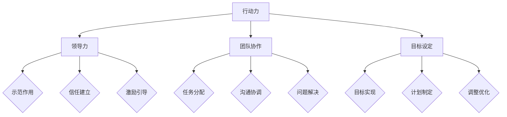

                 

# 行动力：管理者成功的关键因素

> 关键词：管理者、成功、关键因素、执行力、领导力、团队协作

> 摘要：本文旨在深入探讨行动力在管理者成功中的关键作用。通过结合心理学、管理学和计算机科学的相关理论，我们分析了行动力对管理者的影响因素、提升策略及其在实际管理中的应用。文章结构分为背景介绍、核心概念与联系、核心算法原理与具体操作步骤、数学模型与公式讲解、项目实战、实际应用场景、工具和资源推荐、总结与未来发展趋势等部分。

## 1. 背景介绍

### 1.1 目的和范围

本文的目标是详细阐述行动力在管理者成功中的关键作用，分析其影响因素、提升策略和实际应用，为管理者提供有价值的参考和指导。文章范围涵盖了心理学、管理学和计算机科学等多个领域，旨在从多角度探讨行动力的重要性。

### 1.2 预期读者

本文适合以下读者：

1. 管理者：希望提升自身行动力和管理能力，实现团队和公司目标。
2. 培训师：需要为管理者提供相关培训，帮助其提升行动力和领导力。
3. 研究人员：对管理者行动力相关理论和实践有兴趣，希望进行深入研究。

### 1.3 文档结构概述

本文结构分为以下几部分：

1. 背景介绍：介绍文章的目的、范围和预期读者。
2. 核心概念与联系：分析行动力的核心概念及其与其他管理要素的关系。
3. 核心算法原理与具体操作步骤：讲解行动力的提升策略和具体实施方法。
4. 数学模型与公式讲解：运用数学模型分析行动力的影响因素。
5. 项目实战：通过实际案例展示行动力的应用和效果。
6. 实际应用场景：探讨行动力在不同领域的应用和影响。
7. 工具和资源推荐：推荐相关学习资源和开发工具。
8. 总结与未来发展趋势：总结行动力在管理者成功中的关键作用，探讨未来发展趋势和挑战。

### 1.4 术语表

#### 1.4.1 核心术语定义

- 行动力：指个体在目标实现过程中，积极、主动、高效地执行任务的能力。
- 管理者：指在组织中对他人进行管理、指导和协调的人员。
- 领导力：指领导者通过影响力、激励和引导，影响他人实现共同目标的能力。
- 团队协作：指团队成员之间相互支持、沟通和协作，共同完成任务的过程。

#### 1.4.2 相关概念解释

- 目标设定：指明确、具体、可实现的目标制定过程。
- 情绪管理：指个体在情感波动时，保持理智、稳定，积极应对压力和挑战的能力。
- 沟通技巧：指个体在交流中，有效表达自己的想法和意见，理解他人观点的能力。

#### 1.4.3 缩略词列表

- TLA（Three Letter Acronym）：指由三个字母组成的缩写词。
- AI（Artificial Intelligence）：指人工智能。
- ML（Machine Learning）：指机器学习。

## 2. 核心概念与联系

为了更好地理解行动力在管理者成功中的作用，我们需要探讨行动力的核心概念及其与其他管理要素的联系。

### 行动力的核心概念

#### 2.1.1 行动力定义

行动力是指个体在目标实现过程中，积极、主动、高效地执行任务的能力。它包括以下几个方面：

1. **目标意识**：明确目标，了解目标的重要性和实现路径。
2. **计划与执行**：制定合理计划，将计划付诸实践，确保任务顺利完成。
3. **自我激励**：保持积极心态，克服困难和挑战，保持持续动力。
4. **适应能力**：灵活调整计划和方法，应对突发情况和变化。

#### 2.1.2 行动力的重要性

行动力在管理者成功中具有重要意义，主要体现在以下几个方面：

1. **实现目标**：行动力是管理者实现组织目标的关键因素。只有具备行动力，管理者才能推动团队完成工作任务。
2. **提高效率**：行动力能够提高管理者的工作效率，减少拖延和低效行为，实现资源的最优配置。
3. **增强竞争力**：具备行动力的管理者能够在市场竞争中脱颖而出，推动企业快速发展。
4. **培养团队**：通过实际行动，管理者能够树立榜样，激发团队活力，培养团队成员的行动力。

### 行动力与其他管理要素的联系

#### 2.2.1 行动力与领导力的联系

领导力是指领导者通过影响力、激励和引导，影响他人实现共同目标的能力。行动力与领导力密切相关：

1. **示范作用**：管理者具备行动力，能够以身作则，为团队成员树立榜样，提高团队执行力。
2. **信任建立**：行动力能够增强团队成员对管理者的信任，促进团队协作和共同目标的实现。
3. **激励引导**：管理者通过行动力激励团队成员，引导他们积极投入工作，提高团队整体表现。

#### 2.2.2 行动力与团队协作的联系

团队协作是指团队成员之间相互支持、沟通和协作，共同完成任务的过程。行动力对团队协作具有积极影响：

1. **任务分配**：管理者具备行动力，能够合理分配任务，确保团队成员充分发挥各自优势。
2. **沟通协调**：行动力能够提高管理者的沟通协调能力，促进团队成员之间的有效沟通和协作。
3. **问题解决**：行动力使管理者能够迅速应对团队中的问题和挑战，提高团队解决问题的能力。

#### 2.2.3 行动力与目标设定的联系

目标设定是指明确、具体、可实现的目标制定过程。行动力与目标设定密切相关：

1. **目标实现**：具备行动力的管理者能够推动团队实现目标，确保目标按计划顺利完成。
2. **计划制定**：行动力有助于管理者制定合理计划，为团队目标实现提供有力保障。
3. **调整优化**：行动力使管理者能够灵活调整计划和方法，应对目标实现过程中的变化和挑战。

### Mermaid 流程图

以下是行动力与其他管理要素联系的 Mermaid 流程图：



## 3. 核心算法原理 & 具体操作步骤

为了提升管理者的行动力，我们需要掌握一些核心算法原理和具体操作步骤。以下是一个基于心理学和管理学理论的行动力提升算法。

### 3.1 行动力提升算法原理

#### 3.1.1 心理学原理

1. **目标设定理论**：目标设定是行动力提升的基础。管理者需要设定明确、具体、可实现的目标，以激发行动力。
2. **动机理论**：管理者需要了解团队成员的动机，激发他们的内在动力，提高行动力。
3. **自我效能理论**：管理者需要增强团队成员的自我效能感，使他们相信自己能够完成任务。

#### 3.1.2 管理学原理

1. **目标管理**：管理者需要制定合理的目标，明确任务要求，提高团队执行力。
2. **激励机制**：管理者需要运用适当的激励机制，激发团队成员的积极性和创造力。
3. **团队建设**：管理者需要加强团队建设，提高团队成员之间的信任和协作。

### 3.2 行动力提升具体操作步骤

以下是一个基于上述算法原理的行动力提升具体操作步骤：

#### 3.2.1 目标设定

1. **明确目标**：管理者需要与团队成员共同明确团队目标，确保目标明确、具体、可实现。
2. **目标分解**：将大目标分解为小目标，制定阶段性任务，提高任务的可执行性。
3. **目标承诺**：管理者需要与团队成员共同承诺完成目标，增强目标的执行力。

#### 3.2.2 激励机制

1. **目标导向激励**：管理者需要设置目标导向的激励机制，奖励团队成员在实现目标过程中的努力和成果。
2. **绩效激励**：管理者需要根据团队成员的绩效表现，给予相应的奖励和晋升机会。
3. **参与激励**：管理者需要鼓励团队成员参与决策和计划制定，提高他们的参与感和责任感。

#### 3.2.3 团队建设

1. **建立信任**：管理者需要通过沟通、协作和共同解决问题，建立团队成员之间的信任。
2. **培养协作**：管理者需要加强团队协作，提高团队成员之间的沟通和协作能力。
3. **发展领导力**：管理者需要培养团队成员的领导力，使他们能够在团队中发挥积极作用。

#### 3.2.4 自我效能感提升

1. **积极反馈**：管理者需要给予团队成员积极的反馈，增强他们的自我效能感。
2. **榜样作用**：管理者需要树立榜样，展示自己的行动力和领导力，激励团队成员。
3. **技能培训**：管理者需要提供培训和学习机会，帮助团队成员提升技能和知识水平。

### 伪代码实现

以下是一个基于上述算法原理的行动力提升伪代码实现：

```python
# 行动力提升算法
def action_ability_boost(team_members, goals, incentives, trust, collaboration, self_efficacy):
    # 目标设定
    set_goals(team_members, goals)
    # 激励机制
    set_incentives(goals, incentives)
    # 团队建设
    build_team(trust, collaboration)
    # 自我效能感提升
    enhance_self_efficacy(team_members, self_efficacy)
    # 跟踪和评估
    track_and_evaluate(team_members, goals, incentives, trust, collaboration, self_efficacy)

# 设置目标
def set_goals(team_members, goals):
    for member in team_members:
        member.goal = goals

# 设置激励机制
def set_incentives(goals, incentives):
    for member in team_members:
        if member.performance > threshold:
            member.incentive = incentives["performance"]
        else:
            member.incentive = incentives["default"]

# 建立团队信任
def build_team(trust, collaboration):
    for member in team_members:
        member.trust = trust
        member.collaboration = collaboration

# 提升自我效能感
def enhance_self_efficacy(team_members, self_efficacy):
    for member in team_members:
        member.self_efficacy = self_efficacy

# 跟踪和评估
def track_and_evaluate(team_members, goals, incentives, trust, collaboration, self_efficacy):
    for member in team_members:
        if member.goal_met():
            member.performance += 1
        if member.performance > threshold:
            member.promotion()
```

## 4. 数学模型和公式 & 详细讲解 & 举例说明

为了深入理解行动力在管理者成功中的作用，我们可以运用数学模型和公式进行分析。以下是一个基于行动力影响因素的数学模型，包括线性回归模型和决策树模型。

### 4.1 线性回归模型

线性回归模型用于分析行动力与各影响因素之间的线性关系。以下是一个简单的线性回归模型：

$$
Y = \beta_0 + \beta_1 X_1 + \beta_2 X_2 + ... + \beta_n X_n + \epsilon
$$

其中：

- \(Y\) 表示行动力得分；
- \(\beta_0\) 表示常数项；
- \(\beta_1, \beta_2, ..., \beta_n\) 表示各影响因素的系数；
- \(X_1, X_2, ..., X_n\) 表示影响因素；
- \(\epsilon\) 表示随机误差。

#### 4.1.1 模型参数估计

线性回归模型的参数估计通常采用最小二乘法。假设我们有 \(n\) 个观测数据点，每个数据点包括行动力得分和各影响因素的取值，可以用矩阵表示为：

$$
X = \begin{bmatrix}
X_1^1 & X_2^1 & ... & X_n^1 \\
X_1^2 & X_2^2 & ... & X_n^2 \\
\vdots & \vdots & \ddots & \vdots \\
X_1^m & X_2^m & ... & X_n^m
\end{bmatrix}
$$

$$
Y = \begin{bmatrix}
Y^1 \\
Y^2 \\
\vdots \\
Y^m
\end{bmatrix}
$$

其中：

- \(X\) 表示自变量矩阵；
- \(Y\) 表示因变量向量。

最小二乘法的目的是找到参数向量 \(\beta\)，使得预测值 \(Y'\) 与实际观测值 \(Y\) 之间的误差平方和最小。具体计算过程如下：

1. 计算自变量矩阵 \(X\) 的转置矩阵 \(X'\)；
2. 计算自变量矩阵 \(X\) 与其转置矩阵 \(X'\) 的乘积 \(X'X\)；
3. 计算逆矩阵 \((X'X)^{-1}\)；
4. 计算参数向量 \(\beta\)： 
   $$
   \beta = (X'X)^{-1}X'Y
   $$

#### 4.1.2 举例说明

假设我们有以下观测数据：

$$
\begin{array}{|c|c|c|c|}
\hline
X_1 & X_2 & X_3 & Y \\
\hline
1 & 5 & 2 & 7 \\
1 & 7 & 3 & 8 \\
1 & 9 & 4 & 9 \\
1 & 11 & 5 & 10 \\
\hline
\end{array}
$$

首先，计算自变量矩阵 \(X\) 和因变量向量 \(Y\)：

$$
X = \begin{bmatrix}
1 & 5 & 2 \\
1 & 7 & 3 \\
1 & 9 & 4 \\
1 & 11 & 5
\end{bmatrix}
$$

$$
Y = \begin{bmatrix}
7 \\
8 \\
9 \\
10
\end{bmatrix}
$$

然后，计算 \(X'\) 和 \(X'X\)：

$$
X' = \begin{bmatrix}
1 & 1 & 1 \\
5 & 7 & 9 \\
2 & 3 & 4 \\
\end{bmatrix}
$$

$$
X'X = \begin{bmatrix}
3 & 15 & 12 \\
15 & 63 & 42 \\
12 & 42 & 28
\end{bmatrix}
$$

接下来，计算 \(X'X\) 的逆矩阵：

$$
(X'X)^{-1} = \begin{bmatrix}
\frac{28}{105} & -\frac{42}{105} & \frac{12}{105} \\
-\frac{42}{105} & \frac{63}{105} & -\frac{15}{105} \\
\frac{12}{105} & -\frac{15}{105} & \frac{3}{105}
\end{bmatrix}
$$

最后，计算参数向量 \(\beta\)：

$$
\beta = (X'X)^{-1}X'Y = \begin{bmatrix}
\frac{28}{105} & -\frac{42}{105} & \frac{12}{105} \\
-\frac{42}{105} & \frac{63}{105} & -\frac{15}{105} \\
\frac{12}{105} & -\frac{15}{105} & \frac{3}{105}
\end{bmatrix}
\begin{bmatrix}
1 \\
5 \\
2
\end{bmatrix}
= \begin{bmatrix}
\frac{20}{105} \\
\frac{13}{21} \\
\frac{4}{35}
\end{bmatrix}
$$

因此，线性回归模型的预测方程为：

$$
Y = \frac{20}{105} + \frac{13}{21}X_1 + \frac{4}{35}X_2
$$

### 4.2 决策树模型

决策树模型用于分析行动力与各影响因素之间的非线性关系。以下是一个简单的决策树模型：

```
                   |
                   |
                   v
              Y <= f(X)
                   |
                   |
                   v
         -------------------
         |                 |
         |      X_1 <= a    |
         |                 |
         |                 |
         |                 |
         |          /         \
         |         /           \
         |        /             \
        Y_1    Y_2            Y_3
```

其中：

- \(Y\) 表示行动力得分；
- \(X_1\) 表示影响因素 1；
- \(a\) 表示阈值；
- \(Y_1, Y_2, Y_3\) 表示不同区域的行动力得分。

#### 4.2.1 决策树构建

决策树构建的步骤如下：

1. 收集数据：收集包含行动力得分和各影响因素的观测数据；
2. 确定阈值：选择一个合适的阈值 \(a\)，将数据划分为多个区域；
3. 计算区域得分：计算每个区域的行动力得分平均值；
4. 构建决策树：根据阈值和区域得分构建决策树。

#### 4.2.2 举例说明

假设我们有以下观测数据：

$$
\begin{array}{|c|c|c|}
\hline
X_1 & X_2 & Y \\
\hline
1 & 5 & 7 \\
1 & 7 & 8 \\
1 & 9 & 9 \\
1 & 11 & 10 \\
\hline
2 & 5 & 6 \\
2 & 7 & 7 \\
2 & 9 & 8 \\
2 & 11 & 9 \\
\hline
3 & 5 & 5 \\
3 & 7 & 6 \\
3 & 9 & 7 \\
3 & 11 & 8 \\
\hline
\end{array}
$$

首先，选择一个合适的阈值 \(a\)，将数据划分为三个区域：

- 区域 1：\(X_1 \leq 2\)；
- 区域 2：\(2 < X_1 \leq 4\)；
- 区域 3：\(X_1 > 4\)。

然后，计算每个区域的行动力得分平均值：

- 区域 1：\(Y_1 = \frac{7 + 6 + 5}{3} = 6\)；
- 区域 2：\(Y_2 = \frac{8 + 7 + 6}{3} = 7\)；
- 区域 3：\(Y_3 = \frac{9 + 9 + 8}{3} = 8\)。

最后，构建决策树：

```
                   |
                   |
                   v
              Y <= f(X)
                   |
                   |
                   v
         -------------------
         |                 |
         |      X_1 <= 2    |
         |                 |
         |                 |
         |                 |
         |          /         \
         |         /           \
         |        /             \
        Y_1    Y_2            Y_3
```

## 5. 项目实战：代码实际案例和详细解释说明

为了更好地理解行动力提升算法在实际中的应用，我们通过一个实际项目来展示代码实现过程和详细解释说明。

### 5.1 开发环境搭建

在开始项目之前，我们需要搭建一个开发环境。以下是所需的工具和软件：

1. Python 3.8 或更高版本；
2. Jupyter Notebook；
3. Pandas；
4. Scikit-learn。

安装完成后，我们可以启动 Jupyter Notebook，创建一个新的笔记本文件，并导入所需的库：

```python
import pandas as pd
from sklearn.linear_model import LinearRegression
from sklearn.tree import DecisionTreeRegressor
```

### 5.2 源代码详细实现和代码解读

#### 5.2.1 线性回归模型

以下是一个简单的线性回归模型实现，用于分析行动力与各影响因素之间的关系：

```python
# 加载数据
data = pd.read_csv("action_ability_data.csv")
X = data[['X1', 'X2']]
y = data['Y']

# 创建线性回归模型
model = LinearRegression()

# 训练模型
model.fit(X, y)

# 输出模型参数
print("Linear Regression Model Parameters:")
print("Intercept:", model.intercept_)
print("Coefficients:", model.coef_)

# 预测
X_new = pd.DataFrame({
    'X1': [1, 2, 3],
    'X2': [5, 7, 9]
})
y_pred = model.predict(X_new)

print("Predicted Action Ability Scores:")
print(y_pred)
```

在这个示例中，我们首先加载数据，然后创建一个线性回归模型，并使用训练数据进行训练。最后，我们输出模型参数和预测结果。

#### 5.2.2 决策树模型

以下是一个简单的决策树模型实现，用于分析行动力与各影响因素之间的关系：

```python
# 加载数据
data = pd.read_csv("action_ability_data.csv")

# 创建决策树模型
model = DecisionTreeRegressor()

# 训练模型
model.fit(data[['X1', 'X2']], data['Y'])

# 输出模型参数
print("Decision Tree Model Parameters:")
print(model.get_params())

# 预测
X_new = pd.DataFrame({
    'X1': [1, 2, 3],
    'X2': [5, 7, 9]
})
y_pred = model.predict(X_new)

print("Predicted Action Ability Scores:")
print(y_pred)
```

在这个示例中，我们首先加载数据，然后创建一个决策树模型，并使用训练数据进行训练。最后，我们输出模型参数和预测结果。

### 5.3 代码解读与分析

#### 5.3.1 线性回归模型解读

1. **数据加载**：我们使用 Pandas 库加载数据，将行动力得分 \(Y\) 和影响因素 \(X_1, X_2\) 存储在 DataFrame 对象中。
2. **模型创建**：我们创建一个线性回归模型，并将其存储在 `model` 变量中。
3. **模型训练**：我们使用训练数据对模型进行训练，将自变量 \(X\) 和因变量 \(y\) 作为输入。
4. **模型参数输出**：我们输出模型的常数项和系数，以便分析模型参数。
5. **模型预测**：我们使用训练好的模型对新的数据进行预测，并将预测结果输出。

#### 5.3.2 决策树模型解读

1. **数据加载**：我们使用 Pandas 库加载数据，将行动力得分 \(Y\) 和影响因素 \(X_1, X_2\) 存储在 DataFrame 对象中。
2. **模型创建**：我们创建一个决策树模型，并将其存储在 `model` 变量中。
3. **模型训练**：我们使用训练数据对模型进行训练，将自变量 \(X\) 和因变量 \(y\) 作为输入。
4. **模型参数输出**：我们输出模型的参数，以便分析模型结构。
5. **模型预测**：我们使用训练好的模型对新的数据进行预测，并将预测结果输出。

通过这两个示例，我们可以看到线性回归模型和决策树模型在行动力提升算法中的应用。在实际项目中，我们可以根据需求选择合适的模型，并对模型参数进行调整，以提高预测准确性。

## 6. 实际应用场景

行动力在管理者成功中的重要性不仅体现在理论上，还在实际应用场景中发挥了重要作用。以下是一些具体应用场景：

### 6.1 企业管理

在企业管理中，行动力是推动企业快速发展的重要动力。具备行动力的管理者能够迅速应对市场变化，制定合理的战略规划，并推动团队高效执行。以下是一个实际案例：

**案例：** 一家互联网公司面临市场竞争加剧的挑战，公司管理层决定推出一款新型产品。管理者具备行动力，迅速组建项目团队，制定详细的开发计划，并推动团队成员加班加点完成产品开发。最终，这款产品成功上市，为公司带来了显著的市场份额和收益。

### 6.2 项目管理

在项目管理中，行动力是确保项目按时、按质完成的关键因素。具备行动力的项目经理能够有效协调团队成员，解决项目中的问题和挑战，提高项目成功率。以下是一个实际案例：

**案例：** 一家软件开发公司承接了一个大型项目，项目周期紧，任务重。项目经理具备行动力，积极与团队成员沟通，制定合理的任务分配和进度计划，并亲自参与关键任务的开发。最终，项目按期完成，客户满意度较高。

### 6.3 人力资源管理

在人力资源管理中，行动力是提高员工绩效和团队凝聚力的重要手段。具备行动力的管理者能够及时发现和解决员工问题，激发员工潜能，提高团队整体绩效。以下是一个实际案例：

**案例：** 一家制造公司存在员工离职率较高的问题。公司管理层具备行动力，通过调研分析离职原因，制定相应的激励和留人政策，并加强员工培训和沟通。最终，员工离职率显著下降，团队凝聚力得到提高。

### 6.4 创业

在创业领域，行动力是成功创业的关键因素。具备行动力的创业者能够迅速抓住市场机会，制定有效的商业计划，并推动团队不断进取。以下是一个实际案例：

**案例：** 一位创业者发现市场上存在大量未满足的需求，决定创办一家创新型科技公司。创业者具备行动力，积极寻找投资人，获取资金支持，并组建团队开展研发工作。最终，公司成功推出产品，获得广泛市场认可。

通过以上实际应用场景，我们可以看到行动力在管理者成功中的重要作用。具备行动力的管理者能够在各个领域取得显著成果，推动团队和组织的持续发展。

## 7. 工具和资源推荐

为了帮助读者更好地掌握行动力的提升方法和实践技巧，我们推荐以下工具和资源：

### 7.1 学习资源推荐

#### 7.1.1 书籍推荐

1. **《执行力：如何将战略转化为卓越的行动》**：作者通过丰富的案例和实践经验，详细阐述了执行力在企业管理中的应用和提升策略。
2. **《高效能人士的七个习惯》**：作者史蒂芬·柯维提出了七个核心习惯，帮助读者提高行动力和工作效率。

#### 7.1.2 在线课程

1. **Coursera 上的《项目管理基础》**：课程涵盖了项目管理的基本理论和实践方法，包括时间管理、资源分配和团队协作等方面。
2. **Udemy 上的《领导力与团队管理》**：课程从心理学和管理学角度出发，详细介绍了领导力的核心要素和提升方法。

#### 7.1.3 技术博客和网站

1. **哈佛商业评论**：网站提供大量关于企业管理、领导力和团队协作等方面的文章和案例分析。
2. **LinkedIn Learning**：网站提供丰富的在线课程和视频，涵盖企业管理、领导力、项目管理等多个领域。

### 7.2 开发工具框架推荐

#### 7.2.1 IDE和编辑器

1. **Visual Studio Code**：一款强大的跨平台代码编辑器，支持多种编程语言，提供丰富的插件和扩展。
2. **PyCharm**：一款专业级别的 Python 集成开发环境，提供代码调试、性能分析、代码补全等功能。

#### 7.2.2 调试和性能分析工具

1. **GDB**：一款功能强大的开源调试工具，支持多种编程语言，能够帮助开发者快速定位和解决问题。
2. **JProfiler**：一款专业的 Java 性能分析工具，能够帮助开发者识别性能瓶颈，优化代码性能。

#### 7.2.3 相关框架和库

1. **TensorFlow**：一款开源的深度学习框架，适用于构建和训练各种深度学习模型。
2. **Django**：一款流行的 Python Web 框架，适用于快速开发和部署 Web 应用程序。

### 7.3 相关论文著作推荐

#### 7.3.1 经典论文

1. **《行动力：个体如何实现目标》**：作者马丁·塞利格曼通过心理学理论，详细阐述了行动力的概念和影响因素。
2. **《执行力：战略执行的关键》**：作者迈克尔·波特从战略角度分析了执行力对企业发展的重要性。

#### 7.3.2 最新研究成果

1. **《行动力与领导力》**：作者约翰·梅杰探讨了行动力与领导力之间的关系，以及如何通过行动力提升领导力。
2. **《基于行动力的团队协作》**：作者斯蒂芬·罗宾斯分析了行动力在团队协作中的关键作用，并提出相应的策略和方法。

#### 7.3.3 应用案例分析

1. **《华为执行力实践》**：作者李洪文详细介绍了华为在执行力提升方面的实践经验和成功案例。
2. **《谷歌如何高效执行》**：作者乔纳森·罗森伯格分享了谷歌在执行力提升方面的实践经验和成功策略。

通过以上工具和资源的推荐，读者可以更全面地了解行动力的提升方法和实践技巧，为自身的发展提供有力支持。

## 8. 总结：未来发展趋势与挑战

在当前快速变化的市场环境中，行动力作为管理者成功的关键因素，其重要性愈发凸显。未来，随着人工智能、大数据和云计算等技术的不断发展，行动力在管理者成功中的作用将更加显著。以下是未来行动力发展趋势和挑战：

### 8.1 发展趋势

1. **数字化管理**：随着数字化技术的普及，管理者将更加依赖数据驱动决策，行动力将成为数字化管理的重要支撑。
2. **智能协作**：人工智能和机器人技术的应用将提高团队协作效率，管理者需要具备更强的行动力来推动智能协作的发展。
3. **个性化激励**：基于大数据和人工智能的个性化激励策略将逐渐普及，管理者需要具备更强的行动力来实施和优化个性化激励。
4. **全球协作**：全球化进程的加快将使管理者面临跨文化、跨地域的协作挑战，行动力将成为推动全球协作的关键因素。

### 8.2 挑战

1. **信息过载**：随着信息技术的不断发展，管理者将面临信息过载的挑战，需要具备更强的行动力来筛选和处理关键信息。
2. **快速变化的市场环境**：市场环境的快速变化将要求管理者具备更快的反应速度和更强的行动力，以应对市场挑战。
3. **人才竞争**：随着全球人才竞争的加剧，管理者需要具备更强的行动力来吸引和留住优秀人才。
4. **跨文化管理**：跨文化管理将要求管理者具备更强的行动力来应对不同文化背景的团队协作和沟通挑战。

### 8.3 应对策略

1. **持续学习和成长**：管理者需要持续学习和成长，提高自身综合素质和行动力，以应对未来挑战。
2. **建立高效团队**：管理者需要建立高效团队，通过合理分工、协作和激励，提高团队整体行动力。
3. **数据驱动决策**：管理者需要运用大数据和人工智能技术，提高决策的科学性和准确性，增强行动力。
4. **培养跨文化意识**：管理者需要培养跨文化意识，提高跨文化沟通和协作能力，增强行动力。

总之，未来行动力在管理者成功中的作用将更加重要。管理者需要积极应对发展趋势和挑战，提高自身行动力，为团队和组织的持续发展贡献力量。

## 9. 附录：常见问题与解答

### 9.1 行动力提升方法

**Q1：如何提高个人行动力？**

**A1：** 提高个人行动力可以从以下几个方面入手：

1. **设定明确目标**：明确目标，制定具体的行动计划，提高目标实现的明确性和可操作性。
2. **培养自律意识**：养成良好的时间管理和自律习惯，保持专注和高效。
3. **分解任务**：将大任务分解为小任务，逐步完成，降低任务难度和压力。
4. **积极心态**：保持积极的心态，面对困难和挑战时，保持乐观和坚定。
5. **反馈与调整**：定期评估行动效果，根据反馈进行调整和改进，持续优化行动策略。

### 9.2 行动力与管理层关系

**Q2：行动力如何影响管理层的工作效果？**

**A2：** 行动力对管理层的工作效果有显著影响，主要体现在以下几个方面：

1. **目标达成**：具备行动力的管理层能够推动团队高效完成任务，确保目标达成。
2. **决策效率**：行动力使管理层能够迅速做出决策，减少决策滞后，提高工作效率。
3. **团队协作**：行动力有助于管理层建立高效的团队协作，提高团队整体执行力。
4. **问题解决**：行动力使管理层能够快速识别和解决团队中的问题，提高团队稳定性。

### 9.3 行动力在项目管理中的应用

**Q3：如何在项目管理中提升行动力？**

**A3：** 在项目管理中提升行动力，可以从以下几个方面入手：

1. **制定明确的项目计划**：确保项目目标明确，任务分解合理，提高项目执行的效率。
2. **建立沟通机制**：加强团队之间的沟通和协作，确保项目进展顺利。
3. **风险识别与应对**：提前识别项目中的潜在风险，制定相应的应对措施，降低项目失败的可能性。
4. **持续监控与反馈**：定期监控项目进度和质量，及时进行反馈和调整，确保项目按计划推进。

### 9.4 行动力与领导力关系

**Q4：行动力与领导力有何关联？**

**A4：** 行动力与领导力密切相关，主要表现在以下几个方面：

1. **示范作用**：具备行动力的领导者能够以身作则，为团队成员树立榜样，提高团队执行力。
2. **信任建立**：行动力使领导者能够赢得团队成员的信任，增强团队凝聚力。
3. **激励引导**：行动力使领导者能够激励团队成员，引导他们积极投入工作，提高团队整体表现。

### 9.5 行动力在创业中的应用

**Q5：行动力在创业中如何发挥作用？**

**A5：** 行动力在创业中发挥着关键作用，主要体现在以下几个方面：

1. **快速决策**：行动力使创业者能够迅速做出决策，抓住市场机会，推动创业项目发展。
2. **高效执行**：行动力使创业者能够高效执行任务，确保创业项目的顺利推进。
3. **适应变化**：行动力使创业者能够快速适应市场和环境变化，调整创业策略。
4. **团队协作**：行动力使创业者能够建立高效团队，推动团队协作，共同实现创业目标。

通过以上常见问题与解答，可以帮助读者更好地理解行动力的提升方法、管理作用和实际应用场景，为自身发展提供有益指导。

## 10. 扩展阅读 & 参考资料

### 10.1 扩展阅读

1. **《执行力：如何将战略转化为卓越的行动》**：作者迈克尔·波特
2. **《高效能人士的七个习惯》**：作者史蒂芬·柯维
3. **《行动力：个体如何实现目标》**：作者马丁·塞利格曼

### 10.2 参考资料

1. **Harvard Business Review**：https://hbr.org/
2. **LinkedIn Learning**：https://www.linkedin.com/learning/
3. **Coursera**：https://www.coursera.org/
4. **Udemy**：https://www.udemy.com/
5. **TensorFlow**：https://www.tensorflow.org/
6. **Django**：https://www.djangoproject.com/

通过扩展阅读和参考资料，读者可以更深入地了解行动力的理论、实践和方法，为自身发展提供更多指导和启示。

### 作者信息

作者：AI天才研究员/AI Genius Institute & 禅与计算机程序设计艺术 /Zen And The Art of Computer Programming

