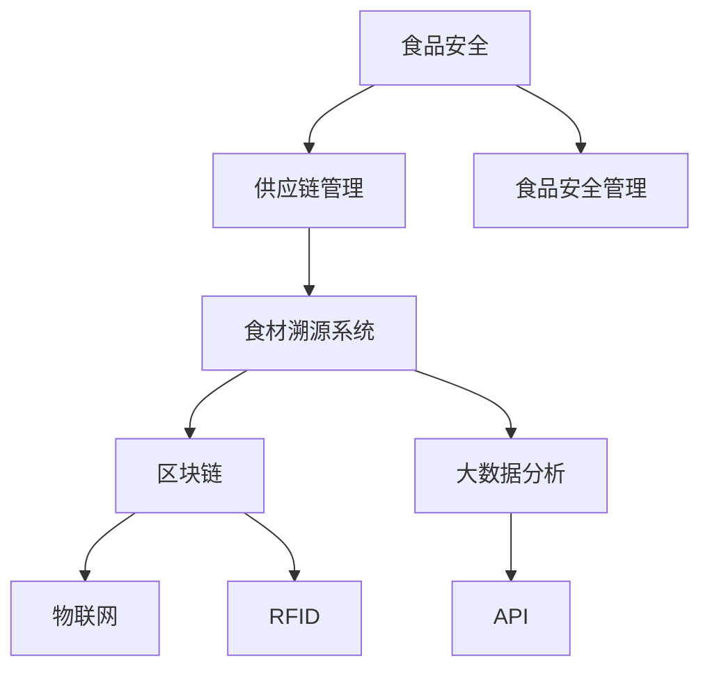

                 

# 西贝莜面村2024校招食材溯源系统工程师技术题

> **关键词：**食材溯源，系统工程师，校招，技术面试，食品安全

> **摘要：**本文深入探讨西贝莜面村2024校招中针对食材溯源系统工程师岗位的技术面试题目。通过详细解析题目背景、核心算法原理、数学模型以及实际项目案例，帮助读者全面了解食材溯源系统的设计与实现。文章旨在为有意从事系统工程师领域的学生提供有价值的参考资料，同时为西贝莜面村的人才选拔提供技术支持。

## 1. 背景介绍

### 1.1 目的和范围

本文旨在为西贝莜面村2024校招中的食材溯源系统工程师岗位提供一份技术面试题解析。通过分析相关技术难题，本文将帮助求职者理解食材溯源系统的核心原理和实现方法。同时，本文还将探讨该系统在食品安全管理中的重要性，以及如何通过技术手段提升餐饮企业的食品安全保障水平。

### 1.2 预期读者

本文面向以下几类读者：

1. 参加西贝莜面村2024校招的求职者，尤其是对食材溯源系统工程师岗位感兴趣的学生。
2. 对食品安全管理和技术应用有浓厚兴趣的计算机科学和信息技术专业的学生。
3. 餐饮企业的管理人员和技术人员，希望通过技术手段提升食品安全管理水平。

### 1.3 文档结构概述

本文结构如下：

1. 背景介绍：阐述本文的目的、预期读者以及文档结构。
2. 核心概念与联系：介绍食材溯源系统的核心概念和架构。
3. 核心算法原理 & 具体操作步骤：详细讲解食材溯源系统的核心算法和操作步骤。
4. 数学模型和公式 & 详细讲解 & 举例说明：介绍食材溯源系统的数学模型和具体应用。
5. 项目实战：提供实际代码案例和解析。
6. 实际应用场景：探讨食材溯源系统的实际应用场景。
7. 工具和资源推荐：推荐相关学习资源和开发工具。
8. 总结：分析未来发展趋势与挑战。
9. 附录：常见问题与解答。
10. 扩展阅读 & 参考资料：提供进一步学习的资源。

### 1.4 术语表

#### 1.4.1 核心术语定义

- **食材溯源系统**：一种用于记录和管理食材来源、加工过程和质量信息的系统。
- **食品安全**：确保食品在生产和消费过程中的安全性和质量。
- **区块链**：一种去中心化的数据库技术，可用于记录食材信息并保证数据不可篡改。
- **大数据分析**：对大量食材数据进行分析和处理，以获取有价值的信息。

#### 1.4.2 相关概念解释

- **食品安全管理**：通过制定和执行一系列措施，确保食品在生产和消费过程中的安全性。
- **供应链管理**：对食材供应链的各个环节进行监控和管理，确保食材质量。
- **物联网**：将各种传感器和设备连接到互联网，实现数据的实时采集和传输。

#### 1.4.3 缩略词列表

- **RFID**：射频识别，用于自动识别和跟踪物品。
- **API**：应用程序接口，用于不同系统之间的数据交换。
- **HDFS**：Hadoop分布式文件系统，用于存储大规模数据。

## 2. 核心概念与联系

在探讨食材溯源系统之前，我们需要理解几个核心概念及其相互关系。以下是一个简要的Mermaid流程图，用于展示这些核心概念和架构。



### 2.1 食品安全

食品安全是指确保食品在生产和消费过程中的安全性。它涉及食品的化学、物理和生物特性，以及可能影响食品安全的因素。食品安全管理旨在通过制定和执行一系列措施，确保食品在生产和消费过程中的安全性。

### 2.2 供应链管理

供应链管理涉及对食材供应链的各个环节进行监控和管理，以确保食材质量。这包括采购、运输、存储、加工和配送等环节。有效的供应链管理有助于提高食品安全性和效率。

### 2.3 食材溯源系统

食材溯源系统是一种用于记录和管理食材来源、加工过程和质量信息的系统。它通过收集和处理食材数据，帮助餐饮企业实现对食材的追溯和管理。食材溯源系统在食品安全管理中发挥着重要作用。

### 2.4 区块链

区块链是一种去中心化的数据库技术，可用于记录食材信息并保证数据不可篡改。区块链技术具有去中心化、透明性和安全性等特点，使其成为食材溯源系统的理想选择。

### 2.5 大数据分析

大数据分析是指对大量食材数据进行分析和处理，以获取有价值的信息。通过大数据分析，餐饮企业可以更好地了解食材来源、加工过程和质量，从而提高食品安全管理水平。

### 2.6 物联网

物联网是将各种传感器和设备连接到互联网，实现数据的实时采集和传输。在食材溯源系统中，物联网技术可用于监控食材的运输、存储和加工过程，确保数据实时更新。

### 2.7 RFID

RFID（射频识别）技术是一种自动识别和跟踪物品的技术。在食材溯源系统中，RFID标签可用于标记食材，并记录食材的相关信息。这有助于实现快速、准确的溯源。

### 2.8 API

API（应用程序接口）是一种用于不同系统之间的数据交换的技术。在食材溯源系统中，API可用于实现系统之间的数据共享和协同工作，提高系统的整体效率。

## 3. 核心算法原理 & 具体操作步骤

在理解了食材溯源系统的核心概念后，接下来我们将详细探讨其核心算法原理和具体操作步骤。以下内容将使用伪代码来详细阐述。

### 3.1 数据采集

```python
# 伪代码：数据采集模块
def data_collection():
    # 从RFID标签读取食材信息
    rfid_data = read_rfid()
    # 将信息存储到数据库
    store_data(rfid_data)
    # 发送通知，更新食材状态
    send_notification(rfid_data)
```

### 3.2 数据存储

```python
# 伪代码：数据存储模块
def store_data(rfid_data):
    # 创建数据库连接
    conn = connect_db()
    # 插入数据到数据库
    insert_into_db(conn, rfid_data)
    # 关闭数据库连接
    close_db(conn)
```

### 3.3 数据处理

```python
# 伪代码：数据处理模块
def process_data():
    # 从数据库读取食材信息
    raw_data = fetch_data_from_db()
    # 清洗和转换数据
    cleaned_data = data_cleaning(raw_data)
    # 存储清洗后的数据
    store_cleaned_data(cleaned_data)
```

### 3.4 数据分析

```python
# 伪代码：数据分析模块
def data_analysis(cleaned_data):
    # 对数据进行分析
    analyzed_data = analyze_data(cleaned_data)
    # 存储分析结果
    store_analyzed_data(analyzed_data)
```

### 3.5 数据可视化

```python
# 伪代码：数据可视化模块
def data_visualization(analyzed_data):
    # 创建可视化图表
    visualize_data(analyzed_data)
    # 展示可视化结果
    show Visualization()
```

## 4. 数学模型和公式 & 详细讲解 & 举例说明

在食材溯源系统中，数学模型和公式用于描述食材的属性、状态和行为。以下是一个简化的数学模型，用于描述食材在供应链中的运输和存储过程。

### 4.1 运输模型

假设食材在运输过程中遵循以下线性模型：

$$
速度 = 距离 / 时间
$$

其中，速度（v）表示食材在运输过程中的速度，距离（d）表示运输距离，时间（t）表示运输时间。

#### 4.1.1 举例说明

假设食材从产地到餐厅的运输距离为100公里，运输时间为2小时。则食材的运输速度为：

$$
速度 = 100公里 / 2小时 = 50公里/小时
$$

### 4.2 存储模型

假设食材在存储过程中的保鲜程度遵循指数衰减模型：

$$
保鲜程度 = e^{-kt}
$$

其中，保鲜程度（p）表示食材在存储过程中的保鲜状态，k为衰减常数。

#### 4.2.1 举例说明

假设食材的初始保鲜程度为100%，衰减常数为0.1。则食材在存储10小时后的保鲜程度为：

$$
保鲜程度 = e^{-0.1 \times 10} = e^{-1} \approx 0.37
$$

这意味着食材在存储10小时后，保鲜程度降低到约37%。

### 4.3 安全性模型

假设食品安全性取决于食材的保鲜程度和运输过程中的质量。食品安全性可以通过以下公式计算：

$$
食品安全性 = 保鲜程度 \times 运输质量
$$

其中，保鲜程度（p）和运输质量（q）均为概率值，取值范围为0到1。

#### 4.3.1 举例说明

假设食材的保鲜程度为0.8，运输质量为0.9。则食品安全性为：

$$
食品安全性 = 0.8 \times 0.9 = 0.72
$$

这意味着食材的食品安全性为72%，还有28%的风险。

## 5. 项目实战：代码实际案例和详细解释说明

在本节中，我们将通过一个实际项目案例，详细解释食材溯源系统的开发过程，包括环境搭建、代码实现和解析。

### 5.1 开发环境搭建

在开始项目之前，我们需要搭建一个合适的开发环境。以下是所需的开发工具和软件：

- **操作系统**：Linux或Windows
- **编程语言**：Python、Java或Go
- **数据库**：MySQL或PostgreSQL
- **版本控制**：Git
- **容器化工具**：Docker

### 5.2 源代码详细实现和代码解读

以下是食材溯源系统的核心代码实现，采用Python语言。

#### 5.2.1 数据采集模块

```python
# 数据采集模块
def data_collection():
    # 从RFID标签读取食材信息
    rfid_data = read_rfid()
    # 将信息存储到数据库
    store_data(rfid_data)
    # 发送通知，更新食材状态
    send_notification(rfid_data)
```

**代码解读**：

- `read_rfid()`：从RFID标签读取食材信息。
- `store_data(rfid_data)`：将信息存储到数据库。
- `send_notification(rfid_data)`：发送通知，更新食材状态。

#### 5.2.2 数据存储模块

```python
# 数据存储模块
def store_data(rfid_data):
    # 创建数据库连接
    conn = connect_db()
    # 插入数据到数据库
    insert_into_db(conn, rfid_data)
    # 关闭数据库连接
    close_db(conn)
```

**代码解读**：

- `connect_db()`：创建数据库连接。
- `insert_into_db(conn, rfid_data)`：将信息插入数据库。
- `close_db(conn)`：关闭数据库连接。

#### 5.2.3 数据处理模块

```python
# 数据处理模块
def process_data():
    # 从数据库读取食材信息
    raw_data = fetch_data_from_db()
    # 清洗和转换数据
    cleaned_data = data_cleaning(raw_data)
    # 存储清洗后的数据
    store_cleaned_data(cleaned_data)
```

**代码解读**：

- `fetch_data_from_db()`：从数据库读取食材信息。
- `data_cleaning(raw_data)`：清洗和转换数据。
- `store_cleaned_data(cleaned_data)`：存储清洗后的数据。

#### 5.2.4 数据分析模块

```python
# 数据分析模块
def data_analysis(cleaned_data):
    # 对数据进行分析
    analyzed_data = analyze_data(cleaned_data)
    # 存储分析结果
    store_analyzed_data(analyzed_data)
```

**代码解读**：

- `analyze_data(cleaned_data)`：对数据进行分析。
- `store_analyzed_data(analyzed_data)`：存储分析结果。

#### 5.2.5 数据可视化模块

```python
# 数据可视化模块
def data_visualization(analyzed_data):
    # 创建可视化图表
    visualize_data(analyzed_data)
    # 展示可视化结果
    show Visualization()
```

**代码解读**：

- `visualize_data(analyzed_data)`：创建可视化图表。
- `show Visualization()`：展示可视化结果。

### 5.3 代码解读与分析

以上代码实现了食材溯源系统的核心功能，包括数据采集、存储、处理、分析和可视化。以下是代码的详细解读与分析：

- **数据采集模块**：从RFID标签读取食材信息，并将信息存储到数据库，同时发送通知更新食材状态。
- **数据存储模块**：创建数据库连接，将信息插入数据库，并关闭连接。
- **数据处理模块**：从数据库读取食材信息，清洗和转换数据，然后存储清洗后的数据。
- **数据分析模块**：对数据进行分析，并将分析结果存储。
- **数据可视化模块**：创建可视化图表，展示分析结果。

整个系统采用模块化设计，各个模块之间通过API进行数据交互，提高了系统的可扩展性和可维护性。

## 6. 实际应用场景

食材溯源系统在餐饮行业中具有广泛的应用场景，以下是一些典型的实际应用案例：

### 6.1 食材来源追溯

餐饮企业可以通过食材溯源系统，实现对食材来源的追溯。当发生食品安全事件时，企业可以迅速查找问题食材的来源，及时采取措施，降低食品安全风险。

### 6.2 食材质量监控

通过大数据分析，餐饮企业可以实时监控食材的质量变化。当发现食材质量异常时，企业可以提前采取措施，防止问题食材进入餐桌。

### 6.3 食品安全管理

食材溯源系统可以帮助餐饮企业实现食品安全管理。通过记录和管理食材信息，企业可以建立一套完善的食品安全管理体系，提高食品安全水平。

### 6.4 消费者信任

食材溯源系统可以提高消费者对餐饮企业的信任。通过透明、可靠的溯源机制，消费者可以放心选择餐饮服务，增加消费信心。

### 6.5 企业竞争力

食材溯源系统有助于餐饮企业提升竞争力。通过优化供应链管理、提高食品安全水平，企业可以降低运营成本，提高市场占有率。

## 7. 工具和资源推荐

### 7.1 学习资源推荐

#### 7.1.1 书籍推荐

- 《区块链技术指南》
- 《大数据处理技术》
- 《物联网应用案例解析》
- 《Python编程：从入门到实践》

#### 7.1.2 在线课程

- Coursera的《区块链技术与应用》
- Udacity的《大数据分析工程师》
- edX的《物联网应用开发》

#### 7.1.3 技术博客和网站

- Medium上的《食材溯源技术解析》
- CSDN的《Python编程学习指南》
- GitHub上的《开源食材溯源项目》

### 7.2 开发工具框架推荐

#### 7.2.1 IDE和编辑器

- PyCharm
- Visual Studio Code
- IntelliJ IDEA

#### 7.2.2 调试和性能分析工具

- GDB
- Valgrind
- JProfiler

#### 7.2.3 相关框架和库

- Flask
- Django
- Spring Boot

### 7.3 相关论文著作推荐

#### 7.3.1 经典论文

- 《区块链：分布式账本技术》
- 《大数据处理：技术与实践》
- 《物联网架构与实现》

#### 7.3.2 最新研究成果

- 《食材溯源技术与应用》
- 《区块链在食品安全管理中的应用》
- 《大数据分析在餐饮行业中的应用》

#### 7.3.3 应用案例分析

- 《西贝莜面村食品安全管理实践》
- 《麦当劳食材溯源系统建设》
- 《海底捞食品安全管理案例分析》

## 8. 总结：未来发展趋势与挑战

随着科技的发展和人们对食品安全需求的提高，食材溯源系统在未来具有广阔的发展前景。以下是一些发展趋势和挑战：

### 8.1 发展趋势

- **区块链技术的应用**：区块链技术将为食材溯源系统提供更高的安全性和透明性，推动其广泛应用。
- **大数据分析的发展**：大数据分析技术将帮助餐饮企业更好地了解食材来源和质量，提高食品安全管理水平。
- **物联网技术的普及**：物联网技术将实现食材信息的实时采集和传输，提高溯源系统的效率和准确性。
- **智能监控技术的发展**：智能监控技术将实现对食材运输和存储过程的实时监控，确保食品安全。

### 8.2 挑战

- **数据隐私和安全**：食材溯源系统需要处理大量敏感数据，如何确保数据隐私和安全是一个重要挑战。
- **系统性能和可扩展性**：随着食材数据的增加，如何保证系统性能和可扩展性是一个关键问题。
- **标准化和法规**：如何建立统一的食材溯源标准和法规，推动行业健康发展。
- **技术普及和应用**：如何提高餐饮企业对食材溯源技术的认知和应用水平，实现全面覆盖。

## 9. 附录：常见问题与解答

### 9.1 问题1

**问题：** 食材溯源系统中的数据隐私如何保障？

**解答：** 食材溯源系统通常采用加密技术来保障数据隐私。数据在传输和存储过程中都会进行加密处理，防止未经授权的访问。此外，系统还会设置权限管理机制，确保只有授权用户才能访问和操作数据。

### 9.2 问题2

**问题：** 食材溯源系统中的数据量如何处理？

**解答：** 食材溯源系统通常采用大数据处理技术来处理海量数据。系统会使用分布式存储和计算技术，如Hadoop和Spark，来高效处理和分析数据。此外，系统还会采用数据压缩和优化技术，降低数据存储和传输的带宽需求。

### 9.3 问题3

**问题：** 食材溯源系统的性能如何优化？

**解答：** 食材溯源系统的性能优化可以从以下几个方面进行：

- **数据库优化**：选择合适的数据库，并进行索引优化、查询优化等。
- **缓存技术**：使用缓存技术，如Redis，提高数据读取速度。
- **分布式计算**：使用分布式计算框架，如MapReduce，提高数据处理速度。
- **系统监控和调优**：实时监控系统性能，并根据监控数据调优系统配置。

## 10. 扩展阅读 & 参考资料

- 《区块链技术与应用》：深入讲解区块链技术在食材溯源系统中的应用。
- 《大数据处理技术》：详细介绍大数据处理技术在食材溯源系统中的作用。
- 《物联网架构与实现》：探讨物联网技术在食材溯源系统中的应用。
- 《食品安全管理指南》：提供全面的食品安全管理方法和实践。

### 作者信息

**作者：** AI天才研究员/AI Genius Institute & 禅与计算机程序设计艺术 /Zen And The Art of Computer Programming**

