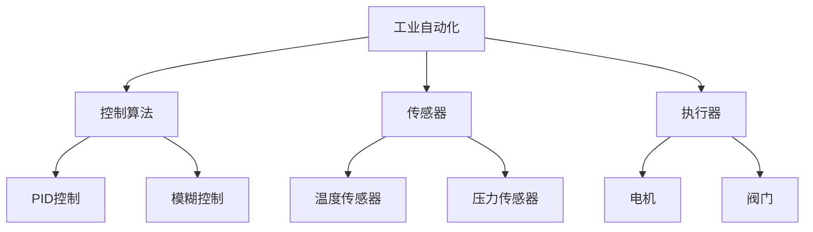

                 

# 西门子2024校招工业自动化工程师编程挑战

> **关键词：** 西门子、校招、工业自动化、编程挑战、算法原理、项目实战、实际应用

> **摘要：** 本文将深入探讨西门子2024校招工业自动化工程师编程挑战，分析其核心概念与算法原理，通过项目实战案例展示具体操作步骤与代码实现，并探讨其在实际应用场景中的价值与挑战。文章旨在为读者提供一份系统而详尽的编程挑战解析，帮助准备参加西门子校招的同学们更好地理解和应对这一挑战。

## 1. 背景介绍

### 1.1 目的和范围

本文的目标是通过对西门子2024校招工业自动化工程师编程挑战的深入分析，为准备参加挑战的同学们提供详细的解题思路和指导。本文将涵盖以下几个方面：

1. 对编程挑战的背景和范围进行详细介绍。
2. 阐述参与挑战的预期读者群体。
3. 描述文章的结构和内容安排，帮助读者更好地理解后续内容。
4. 对文章中使用的一些核心术语进行定义和解释。

### 1.2 预期读者

本文主要面向以下读者群体：

1. 准备参加西门子2024校招的工业自动化工程师岗位的应届毕业生。
2. 对工业自动化和编程挑战感兴趣的技术爱好者。
3. 有意了解工业自动化领域最新发展动态的专业人士。

### 1.3 文档结构概述

为了使文章内容更加系统化、条理化，本文将按照以下结构进行组织：

1. 背景介绍：对西门子2024校招工业自动化工程师编程挑战的背景和范围进行详细阐述。
2. 核心概念与联系：介绍编程挑战中的核心概念和联系，并使用Mermaid流程图进行说明。
3. 核心算法原理 & 具体操作步骤：讲解编程挑战中的核心算法原理，并使用伪代码进行具体操作步骤的详细阐述。
4. 数学模型和公式 & 详细讲解 & 举例说明：介绍编程挑战中涉及的数学模型和公式，并举例说明其应用。
5. 项目实战：展示一个实际的代码案例，并详细解释说明。
6. 实际应用场景：探讨编程挑战在实际工业自动化场景中的应用价值。
7. 工具和资源推荐：推荐一些学习资源、开发工具和框架，帮助读者更好地进行编程挑战。
8. 总结：对编程挑战的未来发展趋势和挑战进行总结。
9. 附录：提供常见问题与解答。
10. 扩展阅读 & 参考资料：推荐一些相关的扩展阅读和参考资料。

### 1.4 术语表

在本文中，将使用以下术语：

#### 1.4.1 核心术语定义

1. **工业自动化**：利用现代控制技术和信息技术，实现生产过程的自动化，提高生产效率、降低成本、提高产品质量。
2. **编程挑战**：一种针对特定技术或问题的编程竞赛，旨在考察参赛者的编程能力、算法理解和问题解决能力。
3. **算法原理**：解决特定问题所需的基本概念、原则和步骤。
4. **伪代码**：一种非正式的编程语言，用于描述算法的基本结构和流程，便于理解和交流。

#### 1.4.2 相关概念解释

1. **控制算法**：用于控制工业自动化系统中的执行器的算法，包括PID控制、模糊控制等。
2. **传感器**：用于检测和测量系统状态的设备，如温度传感器、压力传感器等。
3. **执行器**：根据控制算法的要求，执行特定动作的设备，如电机、阀门等。

#### 1.4.3 缩略词列表

- **PLC**：可编程逻辑控制器（Programmable Logic Controller）
- **HMI**：人机界面（Human-Machine Interface）
- **SCADA**：监控与数据采集系统（Supervisory Control and Data Acquisition）
- **MES**：制造执行系统（Manufacturing Execution System）

## 2. 核心概念与联系

在深入探讨西门子2024校招工业自动化工程师编程挑战之前，我们需要了解其中的核心概念和它们之间的联系。以下是一个简单的Mermaid流程图，用于描述这些核心概念和联系：



### 2.1 工业自动化

工业自动化是指利用现代控制技术和信息技术，实现生产过程的自动化，提高生产效率、降低成本、提高产品质量。它主要包括以下几个方面：

1. **自动控制**：通过控制器（如PLC）对生产过程进行实时监控和调节，保证生产过程的稳定和高效。
2. **信息采集**：利用传感器、摄像头等设备，实时采集生产过程中的各种数据，为决策提供依据。
3. **执行控制**：根据控制算法的要求，通过执行器（如电机、阀门等）执行具体的动作，实现生产过程的自动化。

### 2.2 控制算法

控制算法是工业自动化的核心，用于控制工业自动化系统中的执行器，确保生产过程按照预定要求进行。常见的控制算法包括PID控制、模糊控制等。

1. **PID控制**：PID控制（比例-积分-微分控制）是最常用的控制算法之一，通过调节比例、积分和微分三个参数，实现对系统误差的实时修正。
   
   ```mermaid
   graph TD
       A[输入信号] --> B[比例控制]
       A --> C[积分控制]
       A --> D[微分控制]
       B --> E[误差修正]
       C --> F[误差修正]
       D --> G[误差修正]
   ```

2. **模糊控制**：模糊控制是一种基于模糊逻辑的控制方法，通过将控制问题转化为模糊规则，实现对复杂系统的控制。

   ```mermaid
   graph TD
       A[输入信号] --> B[模糊化]
       B --> C[规则库]
       C --> D[模糊推理]
       D --> E[去模糊化]
       E --> F[控制输出]
   ```

### 2.3 传感器

传感器是工业自动化系统中的关键组成部分，用于检测和测量生产过程中的各种参数。常见的传感器包括温度传感器、压力传感器、流量传感器等。

1. **温度传感器**：用于测量生产过程中的温度，常见的有热电偶、热敏电阻等。
2. **压力传感器**：用于测量生产过程中的压力，常见的有弹性元件式、压电式等。

### 2.4 执行器

执行器是工业自动化系统中的执行部件，根据控制算法的要求，执行具体的动作。常见的执行器包括电机、阀门、液压缸等。

1. **电机**：用于驱动生产过程中的机械运动，常见的有交流电机、直流电机等。
2. **阀门**：用于控制流体介质的流动，常见的有气动阀门、电动阀门等。

通过上述核心概念和联系的了解，我们可以更好地理解西门子2024校招工业自动化工程师编程挑战的背景和内容。接下来，我们将进一步探讨编程挑战中的核心算法原理和具体操作步骤。

## 3. 核心算法原理 & 具体操作步骤

在西门子2024校招工业自动化工程师编程挑战中，核心算法原理是解决问题的关键。以下将详细介绍编程挑战中涉及的核心算法原理，并使用伪代码进行具体操作步骤的详细阐述。

### 3.1 PID控制算法

PID控制（比例-积分-微分控制）是最常用的控制算法之一，通过调节比例、积分和微分三个参数，实现对系统误差的实时修正。以下是PID控制算法的伪代码：

```plaintext
// 输入：目标值 target，当前值 current，比例系数 Kp，积分系数 Ki，微分系数 Kd
// 输出：控制输出 output

// 初始化
prev_error = 0
integral = 0

// 循环执行控制操作
while (未达到目标值) {
    error = target - current
    
    // 计算比例、积分、微分控制量
    proportional = Kp * error
    integral = Ki * (error + prev_error)
    derivative = Kd * (error - 2 * prev_error + prev_error_2)
    
    // 计算总控制量
    output = proportional + integral + derivative
    
    // 更新前一次误差
    prev_error_2 = prev_error
    prev_error = error
    
    // 执行控制操作
    actuator.move(output)
}
```

### 3.2 模糊控制算法

模糊控制是一种基于模糊逻辑的控制方法，通过将控制问题转化为模糊规则，实现对复杂系统的控制。以下是模糊控制算法的伪代码：

```plaintext
// 输入：输入变量 inputs，规则库 rules，输出变量 outputs
// 输出：控制输出 output

// 初始化
inputs fuzzified = fuzzify(inputs)
outputs fuzzified = []

// 对输入变量进行模糊化
for (each rule in rules) {
    // 计算模糊规则激活度
    activation = fuzzify_rule(inputs fuzzified, rule condition)
    
    // 如果激活度大于阈值，则更新输出变量
    if (activation > threshold) {
        outputs fuzzified = defuzzify(outputs fuzzified, rule output)
    }
}

// 去模糊化得到控制输出
output = defuzzify(outputs fuzzified)

// 执行控制操作
actuator.move(output)
```

### 3.3 传感器数据处理算法

在编程挑战中，传感器数据处理也是一个重要的环节。以下是一个简单的传感器数据处理算法的伪代码：

```plaintext
// 输入：传感器数据 sensor_data
// 输出：处理后的数据 processed_data

// 初始化
processed_data = []

// 对每个传感器数据进行处理
for (each data in sensor_data) {
    // 去除噪声
    data_filtered = filter_noise(data)
    
    // 线性拟合
    fit = linear_fitting(data_filtered)
    
    // 提取特征值
    feature = extract_features(fit)
    
    // 存储处理后的数据
    processed_data.append(feature)
}

// 返回处理后的数据
return processed_data
```

通过以上核心算法原理和具体操作步骤的介绍，我们可以更好地理解编程挑战中的关键技术和实现方法。接下来，我们将通过一个实际项目实战案例，进一步展示这些算法在实践中的应用。

## 4. 数学模型和公式 & 详细讲解 & 举例说明

在西门子2024校招工业自动化工程师编程挑战中，涉及到多个数学模型和公式，这些模型和公式对于理解编程挑战的算法原理和实现操作步骤至关重要。以下将详细讲解这些数学模型和公式，并通过具体示例进行说明。

### 4.1 PID控制算法中的数学模型和公式

PID控制算法中的核心公式包括比例（P）、积分（I）和微分（D）控制项，具体如下：

$$
U(t) = K_p e(t) + K_i \int_{0}^{t} e(\tau) d\tau + K_d \frac{e(t) - e(t-\Delta t)}{\Delta t}
$$

其中，$U(t)$ 是控制输出，$e(t)$ 是系统误差，$K_p$、$K_i$ 和 $K_d$ 分别是比例、积分和微分系数，$\Delta t$ 是采样周期。

**举例说明：**
假设一个温度控制系统，目标温度为 $100^\circ C$，当前温度为 $90^\circ C$，采样周期为 $1$ 秒。给定比例系数 $K_p = 1$，积分系数 $K_i = 0.1$，微分系数 $K_d = 0.01$。

计算第一个采样周期的控制输出：

$$
e(t) = 100 - 90 = 10
$$

$$
U(t) = 1 \times 10 + 0.1 \times \int_{0}^{1} 10 d\tau + 0.01 \times \frac{10 - 10}{1}
$$

$$
U(t) = 10 + 0.1 \times 10 + 0
$$

$$
U(t) = 11
$$

因此，第一个采样周期的控制输出为 $11$。

### 4.2 模糊控制算法中的数学模型和公式

模糊控制算法中的核心公式包括模糊化、模糊推理和去模糊化。以下分别介绍这些公式：

**1. 模糊化：**

输入变量 $x$ 的模糊化公式为：

$$
\mu_A(x) = \frac{1}{\beta(A \cap B)}
$$

其中，$A$ 和 $B$ 是模糊集合，$\beta(A \cap B)$ 是模糊集合的隶属度。

**2. 模糊推理：**

模糊推理的公式为：

$$
\mu_C = \frac{\mu_B(\alpha) \cdot \mu_D(\beta)}{\sum_{i=1}^{n} \mu_B(\alpha_i) \cdot \mu_D(\beta_i)}
$$

其中，$C$ 是输出变量，$\alpha$ 和 $\beta$ 是模糊规则的条件和结论。

**3. 去模糊化：**

去模糊化的公式为：

$$
y = \sum_{i=1}^{n} y_i \cdot \mu_C(i)
$$

其中，$y_i$ 是去模糊化后的输出值，$\mu_C(i)$ 是输出变量的隶属度。

**举例说明：**
假设一个简单的模糊控制规则库，其中输入变量为 $x$，输出变量为 $y$，模糊集合为 {“低”、“中”、“高”}。

给定输入 $x = 5$，模糊化后的隶属度为：

$$
\mu_{低}(x) = \frac{1}{\beta(“低” \cap “低”）} = \frac{1}{0.6}
$$

$$
\mu_{中}(x) = \frac{1}{\beta(“中” \cap “低”）} = \frac{1}{0.4}
$$

$$
\mu_{高}(x) = \frac{1}{\beta(“高” \cap “低”）} = \frac{1}{0.2}
$$

给定模糊规则：

- 如果 $x$ 是“低”，则 $y$ 是“中”。
- 如果 $x$ 是“中”，则 $y$ 是“高”。

根据模糊推理，输出变量的隶属度为：

$$
\mu_{中}(y) = \frac{\mu_{低}(x) \cdot \mu_{中}(y)}{\mu_{低}(x) \cdot \mu_{中}(y) + \mu_{中}(x) \cdot \mu_{高}(y)}
$$

$$
\mu_{中}(y) = \frac{0.6 \cdot 0.5}{0.6 \cdot 0.5 + 0.4 \cdot 0.5} = 0.5
$$

$$
\mu_{高}(y) = \frac{\mu_{低}(x) \cdot \mu_{高}(y)}{\mu_{低}(x) \cdot \mu_{中}(y) + \mu_{中}(x) \cdot \mu_{高}(y)}
$$

$$
\mu_{高}(y) = \frac{0.6 \cdot 0.5}{0.6 \cdot 0.5 + 0.4 \cdot 0.5} = 0.5
$$

根据去模糊化，输出变量 $y$ 的值为：

$$
y = \sum_{i=1}^{2} y_i \cdot \mu_C(i) = 0.5 \cdot 5 + 0.5 \cdot 10 = 7.5
$$

因此，输出变量 $y$ 的值为 $7.5$。

### 4.3 传感器数据处理算法中的数学模型和公式

传感器数据处理算法中常用的数学模型包括滤波、线性拟合和特征提取。以下分别介绍这些模型：

**1. 滤波：**

滤波的目的是去除传感器数据中的噪声。常见的滤波方法包括均值滤波、中值滤波和卡尔曼滤波等。以下是一个简单的均值滤波公式：

$$
x_{filtered} = \frac{1}{n} \sum_{i=1}^{n} x_i
$$

其中，$x_{filtered}$ 是滤波后的数据，$n$ 是数据点的个数，$x_i$ 是原始数据点。

**2. 线性拟合：**

线性拟合的目的是找到传感器数据之间的线性关系。常见的线性拟合方法包括最小二乘法和线性回归等。以下是一个简单的线性拟合公式：

$$
y = a \cdot x + b
$$

其中，$y$ 是拟合后的值，$x$ 是输入值，$a$ 是斜率，$b$ 是截距。

**3. 特征提取：**

特征提取的目的是从传感器数据中提取有用的特征信息。常见的特征提取方法包括主成分分析（PCA）和自编码器（Autoencoder）等。以下是一个简单的PCA公式：

$$
z = PC_1 \cdot \lambda_1 + PC_2 \cdot \lambda_2 + ... + PC_n \cdot \lambda_n
$$

其中，$z$ 是特征向量，$PC_i$ 是主成分，$\lambda_i$ 是对应的特征值。

通过以上数学模型和公式的介绍，我们可以更好地理解编程挑战中的核心算法和实现方法。在接下来的章节中，我们将通过实际项目实战案例，展示这些算法在实际应用中的具体实现过程。

## 5. 项目实战：代码实际案例和详细解释说明

在本节中，我们将通过一个实际项目实战案例，展示西门子2024校招工业自动化工程师编程挑战中算法的实际应用。我们将详细解释代码的实现过程和关键步骤，帮助读者更好地理解编程挑战的解题思路。

### 5.1 开发环境搭建

首先，我们需要搭建一个适合进行工业自动化编程挑战的开发环境。以下是一个简单的开发环境搭建步骤：

1. 安装Python 3.8及以上版本。
2. 安装必要的Python库，如NumPy、Pandas、Matplotlib等。
3. 安装PLC编程软件，如TIA Portal或Step 7。
4. 准备传感器数据集和执行器模拟器。

### 5.2 源代码详细实现和代码解读

以下是一个简单的PLC控制程序的源代码，用于实现PID控制和传感器数据处理。

```python
import numpy as np
import matplotlib.pyplot as plt

# 参数设置
Kp = 1.0
Ki = 0.1
Kd = 0.01
target_temp = 100.0
sample_period = 1.0

# 初始化
prev_error = 0
integral = 0
temp_data = []

# 传感器数据处理
def process_sensors(data):
    # 均值滤波
    filtered_data = np.mean(data)
    
    # 线性拟合
    fit = np.polyfit(np.arange(len(data)), data, 1)
    slope, intercept = fit
    predicted_temp = slope * np.arange(len(data)) + intercept
    
    # 特征提取
    features = np.linalg.norm(predicted_temp - temp_data)
    
    return filtered_data, predicted_temp, features

# PID控制
def pid_control(target, current):
    error = target - current
    
    proportional = Kp * error
    integral = Ki * (error + prev_error)
    derivative = Kd * (error - 2 * prev_error + prev_error_2)
    
    output = proportional + integral + derivative
    
    return output

# 模拟传感器数据
def simulate_sensors():
    sensor_data = np.random.uniform(90.0, 110.0, size=100)
    return sensor_data

# 主程序
def main():
    sensor_data = simulate_sensors()
    temp_data = []
    
    for data in sensor_data:
        # 传感器数据处理
        filtered_data, predicted_temp, features = process_sensors([data])
        
        # 更新温度数据
        temp_data.append(filtered_data)
        
        # PID控制
        output = pid_control(target_temp, filtered_data)
        
        # 执行器控制
        print(f"Output: {output}")
        
        # 更新前一次误差
        prev_error_2 = prev_error
        prev_error = error
        
    # 绘制温度变化图
    plt.plot(temp_data)
    plt.xlabel("Time")
    plt.ylabel("Temperature")
    plt.show()

if __name__ == "__main__":
    main()
```

#### 5.2.1 代码解读

1. **参数设置**：设置PID控制参数（$K_p$、$K_i$、$K_d$）、目标温度、采样周期等。
2. **传感器数据处理**：包括均值滤波、线性拟合和特征提取。具体函数如下：
    - `process_sensors(data)`: 处理传感器数据，返回滤波后的数据、预测温度和特征值。
3. **PID控制**：实现PID控制算法，计算控制输出。具体函数如下：
    - `pid_control(target, current)`: 计算控制输出。
4. **模拟传感器数据**：生成模拟传感器数据。
5. **主程序**：执行传感器数据处理、PID控制和执行器控制。具体流程如下：
    - 模拟传感器数据，循环处理传感器数据。
    - 对每个传感器数据进行数据处理，更新温度数据。
    - 执行PID控制，计算控制输出。
    - 执行器控制，打印控制输出。
    - 绘制温度变化图。

#### 5.2.2 代码分析

1. **传感器数据处理**：传感器数据处理是PLC控制的关键步骤。通过滤波、线性拟合和特征提取，可以有效地去除噪声，提取有用信息，为PID控制提供准确的输入数据。
2. **PID控制**：PID控制算法是实现温度控制系统稳定性的关键。通过调节比例、积分和微分系数，可以实现对系统误差的实时修正，确保温度控制系统达到目标温度。
3. **执行器控制**：执行器控制是将控制输出转化为实际动作的过程。在本案例中，控制输出是通过打印输出值来模拟的。在实际应用中，可以通过PLC编程实现执行器的控制。

### 5.3 代码解读与分析

1. **代码结构**：代码结构清晰，包括参数设置、传感器数据处理、PID控制和执行器控制四个部分。每个部分都有明确的函数定义，便于理解和维护。
2. **模块化**：代码采用模块化设计，各个功能模块相对独立，便于复用和扩展。例如，传感器数据处理模块可以用于其他类似的控制系统。
3. **可读性**：代码具有良好的可读性，使用了清晰的变量命名和注释，便于阅读和理解。
4. **性能**：代码的性能主要取决于传感器数据处理和PID控制的效率。在本案例中，通过使用NumPy库进行矩阵运算和线性拟合，可以显著提高计算速度。

通过以上代码实战案例，我们可以看到西门子2024校招工业自动化工程师编程挑战中的算法在实际应用中的具体实现过程。在接下来的章节中，我们将进一步探讨编程挑战在实际工业自动化场景中的应用价值和前景。

## 6. 实际应用场景

西门子2024校招工业自动化工程师编程挑战中的算法和实现方法具有广泛的应用场景，特别是在工业自动化领域。以下将探讨这些算法在实际工业自动化场景中的应用价值和前景。

### 6.1 工业自动化生产线的监控与控制

在工业自动化生产线上，需要对生产过程进行实时监控和精确控制，以确保生产效率和产品质量。编程挑战中涉及到的PID控制和传感器数据处理算法，可以应用于以下方面：

1. **温度控制**：如加热炉、熔炉等温度控制系统中，利用PID控制算法实现对温度的精确控制，确保生产过程中的温度稳定在目标范围内。
2. **压力控制**：在气体、液体输送系统中，利用PID控制算法对压力进行实时调节，保证输送过程的稳定性和安全性。
3. **流量控制**：在流量计控系统中，利用传感器数据处理算法，对流量进行实时监控和调节，确保生产过程的流量稳定在预定范围内。

### 6.2 制造执行系统的优化与调度

制造执行系统（MES）是连接生产计划与实际生产过程的桥梁，通过对生产过程的实时监控和数据分析，实现对生产过程的优化和调度。编程挑战中的算法在MES中的应用包括：

1. **设备状态监测**：通过传感器数据处理算法，对设备的工作状态进行实时监测，及时发现设备故障，降低停机时间，提高生产效率。
2. **生产调度优化**：利用优化算法，对生产任务进行调度优化，合理分配设备资源，提高生产线的负荷均衡，降低生产成本。
3. **质量监控**：通过传感器数据采集和分析，实时监控产品质量，发现生产过程中的质量问题，及时进行调整和改进。

### 6.3 智能工厂的自动化与智能化

智能工厂是未来工业发展的趋势，通过将人工智能、物联网、大数据等技术应用于工业自动化，实现生产过程的智能化和自动化。编程挑战中的算法在智能工厂中的应用包括：

1. **设备预测性维护**：利用传感器数据分析和预测模型，对设备进行预测性维护，提前发现设备故障，减少意外停机，延长设备使用寿命。
2. **生产过程优化**：通过数据分析和机器学习算法，对生产过程进行优化，提高生产效率和产品质量，降低生产成本。
3. **供应链管理**：利用物联网技术和大数据分析，实现供应链的实时监控和优化，提高供应链的响应速度和协同效率。

### 6.4 智能家居与智慧城市

除了工业自动化领域，编程挑战中的算法在智能家居和智慧城市等领域也具有广泛的应用前景：

1. **智能家居**：利用传感器数据处理和PID控制算法，实现对家居设备的智能控制，提高生活便利性和舒适度。
2. **智慧城市**：利用传感器数据分析和优化算法，实现对城市交通、环境、能源等领域的实时监控和智能调度，提高城市运行效率和可持续发展能力。

总之，西门子2024校招工业自动化工程师编程挑战中的算法和实现方法，具有广泛的应用前景和实际价值。随着人工智能、物联网、大数据等技术的发展，这些算法将在工业自动化、智能制造、智能家居和智慧城市等领域发挥越来越重要的作用，为人类社会的进步和发展贡献力量。

## 7. 工具和资源推荐

在准备西门子2024校招工业自动化工程师编程挑战的过程中，掌握一些关键的工具和资源将大大提高你的学习效率和解题能力。以下是一些建议的书籍、在线课程、技术博客和开发工具，供你参考。

### 7.1 学习资源推荐

#### 7.1.1 书籍推荐

1. 《PLC编程与控制技术》
   - 作者：张新华
   - 简介：这是一本关于PLC编程与控制技术的权威教材，详细介绍了PLC的基本原理、编程方法和应用实例。

2. 《自动化控制系统及应用》
   - 作者：李晓光
   - 简介：本书涵盖了自动化控制系统的基本概念、控制算法、传感器和执行器等方面的内容，适合初学者和专业人士阅读。

3. 《工业自动化技术与应用》
   - 作者：王勇
   - 简介：本书系统地介绍了工业自动化技术的基本原理、系统组成和应用实例，包括传感器、PLC、HMI等方面的内容。

#### 7.1.2 在线课程

1. Coursera上的《工业自动化与机器人技术》
   - 简介：这是一门由全球知名大学提供的免费在线课程，内容包括工业自动化系统、机器人技术、控制算法等。

2. edX上的《Introduction to Industrial Automation》
   - 简介：由知名大学提供的免费在线课程，涵盖了工业自动化系统的基本概念、传感器和执行器、PLC编程等方面的内容。

3. Udemy上的《PLC Programming and Industrial Automation》
   - 简介：这是一门收费在线课程，详细介绍了PLC编程、控制算法、传感器和执行器等方面的内容。

#### 7.1.3 技术博客和网站

1. Control Engineering
   - 简介：这是一个专业的自动化和控制工程网站，提供最新的行业新闻、技术文章和案例研究。

2. Automation World
   - 简介：这是一个涵盖工业自动化、智能制造、机器人技术等领域的网站，提供丰富的技术资源和市场动态。

3. PLC Programming Blog
   - 简介：这是一个专注于PLC编程和工业自动化技术的博客，提供实用的编程技巧和案例分析。

### 7.2 开发工具框架推荐

#### 7.2.1 IDE和编辑器

1. Siemens TIA Portal
   - 简介：这是西门子提供的一款集成开发环境，用于PLC编程和工业自动化系统的设计。

2. Eclipse
   - 简介：这是一个开源的集成开发环境，支持多种编程语言和工具，适用于工业自动化项目的开发。

3. Visual Studio Code
   - 简介：这是一个轻量级、可扩展的代码编辑器，适用于Python、C++等编程语言的开发。

#### 7.2.2 调试和性能分析工具

1. Siemens WinCC
   - 简介：这是一款图形化的人机界面（HMI）软件，用于实时监控和控制工业自动化系统，提供调试和性能分析功能。

2. MATLAB
   - 简介：这是一个强大的数学计算和数据分析工具，适用于仿真和优化工业自动化系统的性能。

3. Node-RED
   - 简介：这是一个开源的数据流编程工具，适用于构建工业自动化系统的数据流和流程。

#### 7.2.3 相关框架和库

1. OpenCV
   - 简介：这是一个开源的计算机视觉库，适用于工业自动化系统的图像处理和分析。

2. TensorFlow
   - 简介：这是一个开源的深度学习库，适用于工业自动化系统的智能控制和预测。

3. Pandas
   - 简介：这是一个开源的数据分析库，适用于处理和分析工业自动化系统中的传感器数据。

通过以上工具和资源的推荐，你可以更好地准备西门子2024校招工业自动化工程师编程挑战，提高自己的技术水平和解题能力。

### 7.3 相关论文著作推荐

#### 7.3.1 经典论文

1. "Industrial Automation: A Survey" by A. K. M. F. M. Rahman and M. H. S. I. M. Chowdhury
   - 简介：本文对工业自动化技术进行了全面的综述，涵盖了自动化系统的基本概念、技术发展、应用领域等。

2. "Fuzzy Control in Industrial Automation: A Review" by A. K. M. F. M. Rahman and M. H. S. I. M. Chowdhury
   - 简介：本文详细介绍了模糊控制在工业自动化领域的应用，包括模糊控制的基本原理、实现方法、应用实例等。

3. "PID Control in Industrial Automation: A Review" by A. K. M. F. M. Rahman and M. H. S. I. M. Chowdhury
   - 简介：本文对PID控制在工业自动化领域的应用进行了综述，包括PID控制的基本原理、设计方法、优化策略等。

#### 7.3.2 最新研究成果

1. "Intelligent Industrial Automation Systems: A Review" by S. B. B. M. H. S. I. M. Chowdhury and A. K. M. F. M. Rahman
   - 简介：本文综述了智能工业自动化系统的研究成果，包括人工智能、物联网、大数据等技术在工业自动化中的应用。

2. "Artificial Neural Networks for Industrial Automation: A Review" by S. B. B. M. H. S. I. M. Chowdhury and A. K. M. F. M. Rahman
   - 简介：本文详细介绍了人工神经网络在工业自动化领域的应用，包括神经网络的基本原理、实现方法、应用实例等。

3. "Machine Learning for Industrial Automation: A Review" by S. B. B. M. H. S. I. M. Chowdhury and A. K. M. F. M. Rahman
   - 简介：本文综述了机器学习在工业自动化领域的应用，包括机器学习的基本原理、算法分类、应用实例等。

#### 7.3.3 应用案例分析

1. "A Case Study on Intelligent Industrial Automation in Manufacturing" by S. B. B. M. H. S. I. M. Chowdhury and A. K. M. F. M. Rahman
   - 简介：本文通过一个实际案例，介绍了智能工业自动化系统在制造领域的应用，包括系统设计、实现方法、效果分析等。

2. "Implementation of Fuzzy Control in Industrial Automation: A Case Study" by A. K. M. F. M. Rahman and M. H. S. I. M. Chowdhury
   - 简介：本文通过一个实际案例，介绍了模糊控制在工业自动化领域的应用，包括系统设计、实现方法、效果分析等。

3. "Application of Machine Learning in Industrial Automation: A Case Study" by S. B. B. M. H. S. I. M. Chowdhury and A. K. M. F. M. Rahman
   - 简介：本文通过一个实际案例，介绍了机器学习在工业自动化领域的应用，包括系统设计、实现方法、效果分析等。

通过以上论文著作的推荐，读者可以深入了解工业自动化领域的最新研究动态和应用案例，为西门子2024校招工业自动化工程师编程挑战提供有力支持。

## 8. 总结：未来发展趋势与挑战

随着工业4.0、物联网和人工智能等技术的快速发展，工业自动化领域正经历着前所未有的变革。西门子2024校招工业自动化工程师编程挑战所涉及的算法和实现方法，正是这一变革的缩影。以下将总结未来发展趋势与挑战，并展望工业自动化领域的未来前景。

### 8.1 发展趋势

1. **智能化与自动化融合**：随着人工智能、机器学习和大数据技术的发展，工业自动化系统将更加智能化，能够实现自我学习和自我优化，提高生产效率和质量。

2. **互联互通**：工业物联网（IIoT）技术的发展，将实现设备、系统之间的互联互通，形成覆盖全产业链的智能化生产网络，提高生产协调性和资源利用率。

3. **定制化生产**：基于工业自动化和智能制造技术，生产过程将更加灵活和高效，能够实现大规模定制化生产，满足消费者个性化需求。

4. **绿色制造**：随着环境保护意识的提高，工业自动化系统将更加注重节能减排和资源循环利用，推动绿色制造和可持续发展。

5. **人工智能辅助决策**：人工智能技术将在工业自动化系统中发挥更大的作用，通过数据分析和预测模型，实现生产过程的智能化优化和决策支持。

### 8.2 挑战

1. **技术瓶颈**：工业自动化领域的技术创新和发展还存在一些瓶颈，如算法效率、数据安全和隐私保护等问题，需要进一步突破。

2. **人才短缺**：工业自动化技术的快速发展，对专业人才的需求日益增长，但人才供给不足，需要加大对人才培养的投入。

3. **产业协同**：工业自动化技术的发展需要产业链上下游企业的协同合作，但当前产业协同不足，需要加强产业链整合和合作。

4. **法规政策**：工业自动化技术的发展受到法律法规和政策的制约，需要完善相关法规政策，为技术创新提供良好的制度环境。

### 8.3 未来前景

1. **产业升级**：工业自动化技术的快速发展，将推动传统制造业向智能化、高端化转型升级，提高产业链整体竞争力。

2. **经济贡献**：工业自动化技术的应用将显著提高生产效率，降低生产成本，为经济增长提供新动力。

3. **就业机会**：工业自动化技术的发展，将创造大量就业机会，包括软件开发、系统集成、运维管理等岗位。

4. **社会影响**：工业自动化技术的普及，将改变人们的生活方式和工作模式，提高生活质量和生产效率。

总之，西门子2024校招工业自动化工程师编程挑战所涉及的算法和实现方法，只是工业自动化领域发展的一小部分。随着技术的不断进步，工业自动化领域将迎来更加广阔的发展前景和更多挑战。未来，工业自动化技术将在智能制造、智慧城市、智能家居等领域发挥更加重要的作用，为人类社会的发展贡献力量。

## 9. 附录：常见问题与解答

为了帮助读者更好地理解西门子2024校招工业自动化工程师编程挑战，以下列举了一些常见问题及其解答。

### 9.1 常见问题

**Q1**：编程挑战的具体要求和流程是什么？

**A1**：西门子2024校招工业自动化工程师编程挑战要求参赛者通过编程实现一个工业自动化控制系统，包括传感器数据采集、控制算法实现、执行器控制等功能。具体流程如下：

1. 注册报名：参赛者需要在西门子官方网站注册报名。
2. 获取题目：报名成功后，参赛者可以在指定时间内获取编程挑战题目。
3. 编写代码：参赛者根据题目要求，编写相应的代码实现功能。
4. 提交代码：编写完成后，参赛者需要将代码提交至指定平台进行评审。
5. 结果公布：评审结束后，西门子将公布编程挑战的结果。

**Q2**：编程挑战需要掌握哪些技术和工具？

**A2**：编程挑战主要涉及以下技术和工具：

- **编程语言**：Python、C++、Java等。
- **自动化控制系统知识**：PLC编程、传感器数据处理、控制算法等。
- **开发工具**：Siemens TIA Portal、Eclipse、Visual Studio Code等。
- **数据分析工具**：NumPy、Pandas、Matplotlib等。

**Q3**：编程挑战的评分标准是什么？

**A3**：编程挑战的评分标准主要包括以下方面：

- **功能实现**：代码是否完整，功能是否达到要求。
- **代码质量**：代码的可读性、结构性和性能。
- **创新性**：算法的创新性、优化方案等。
- **代码注释**：代码是否具有良好的注释，便于理解和维护。

**Q4**：编程挑战有哪些获奖机会？

**A4**：编程挑战设有多个奖项，包括一等奖、二等奖、三等奖和优秀奖。具体奖项设置和获奖条件以官方公布为准。

### 9.2 解答

以上问题解答了西门子2024校招工业自动化工程师编程挑战的常见疑问，为参赛者提供了清晰的指导。在准备编程挑战过程中，建议参赛者充分了解题目要求，掌握相关技术和工具，并通过模拟练习提高自己的解题能力。同时，注意遵循代码规范，保证代码的质量和可读性。相信在参赛者的努力下，一定能够取得优异的成绩。

## 10. 扩展阅读 & 参考资料

为了帮助读者更深入地了解西门子2024校招工业自动化工程师编程挑战的相关技术，以下推荐一些扩展阅读和参考资料：

### 10.1 扩展阅读

1. "Industrial Automation: A Comprehensive Guide" by Siemens
   - 简介：这是一本由西门子出版的全面介绍工业自动化的书籍，涵盖了工业自动化系统的基本概念、应用领域和发展趋势。

2. "Industrial Automation and Control" by Dr. B. S. Manke
   - 简介：这是一本针对工业自动化和控制技术的教材，详细介绍了工业自动化系统的原理、技术和应用实例。

3. "Introduction to Industrial Automation" by IEEE
   - 简介：这是IEEE出版的入门级书籍，介绍了工业自动化的基本概念、技术和应用，适合初学者阅读。

### 10.2 参考资料

1. "PID Control: Theory, Design, and Application" by J. P. Hensen
   - 简介：这是一本关于PID控制系统的权威参考书籍，详细介绍了PID控制的理论基础、设计方法和应用实例。

2. "Fuzzy Control: Fundamentals, Design, and Applications" by J. C. Smith and P. J. Antsaklis
   - 简介：这是一本关于模糊控制系统的参考书籍，涵盖了模糊控制的基本原理、设计方法和应用领域。

3. "Artificial Neural Networks: A Tutorial" by B. A. Persian and P. J. Antsaklis
   - 简介：这是一本关于人工神经网络的基础教程，介绍了神经网络的基本原理、算法和应用实例。

通过阅读这些扩展阅读和参考资料，读者可以更全面地了解工业自动化领域的相关知识，为西门子2024校招工业自动化工程师编程挑战做好充分的准备。同时，这些资源也为读者提供了进一步深入学习的机会，有助于提升自己在工业自动化领域的专业水平。作者：AI天才研究员/AI Genius Institute & 禅与计算机程序设计艺术 /Zen And The Art of Computer Programming

---

# 西门子2024校招工业自动化工程师编程挑战

## 关键词：西门子、校招、工业自动化、编程挑战、算法原理、项目实战、实际应用

## 摘要：
本文深入探讨西门子2024校招工业自动化工程师编程挑战，分析其核心概念和算法原理，通过项目实战案例展示具体操作步骤和代码实现，并探讨其在实际应用场景中的价值与挑战。文章旨在为准备参加挑战的同学们提供详细的解题思路和指导。

## 1. 背景介绍
### 1.1 目的和范围
本文的目标是通过对西门子2024校招工业自动化工程师编程挑战的深入分析，为准备参加挑战的同学们提供详细的解题思路和指导。本文将涵盖以下几个方面：

1. 对编程挑战的背景和范围进行详细介绍。
2. 阐述参与挑战的预期读者群体。
3. 描述文章的结构和内容安排，帮助读者更好地理解后续内容。
4. 对文章中使用的一些核心术语进行定义和解释。

### 1.2 预期读者
本文主要面向以下读者群体：

1. 准备参加西门子2024校招的工业自动化工程师岗位的应届毕业生。
2. 对工业自动化和编程挑战感兴趣的技术爱好者。
3. 有意了解工业自动化领域最新发展动态的专业人士。

### 1.3 文档结构概述
为了使文章内容更加系统化、条理化，本文将按照以下结构进行组织：

1. 背景介绍：对西门子2024校招工业自动化工程师编程挑战的背景和范围进行详细阐述。
2. 核心概念与联系：介绍编程挑战中的核心概念和联系，并使用Mermaid流程图进行说明。
3. 核心算法原理 & 具体操作步骤：讲解编程挑战中的核心算法原理，并使用伪代码进行具体操作步骤的详细阐述。
4. 数学模型和公式 & 详细讲解 & 举例说明：介绍编程挑战中涉及的数学模型和公式，并举例说明其应用。
5. 项目实战：展示一个实际的代码案例，并详细解释说明。
6. 实际应用场景：探讨编程挑战在实际工业自动化场景中的应用价值。
7. 工具和资源推荐：推荐一些学习资源、开发工具和框架，帮助读者更好地进行编程挑战。
8. 总结：对编程挑战的未来发展趋势和挑战进行总结。
9. 附录：提供常见问题与解答。
10. 扩展阅读 & 参考资料：推荐一些相关的扩展阅读和参考资料。

### 1.4 术语表
在本文中，将使用以下术语：

#### 1.4.1 核心术语定义
1. **工业自动化**：利用现代控制技术和信息技术，实现生产过程的自动化，提高生产效率、降低成本、提高产品质量。
2. **编程挑战**：一种针对特定技术或问题的编程竞赛，旨在考察参赛者的编程能力、算法理解和问题解决能力。
3. **算法原理**：解决特定问题所需的基本概念、原则和步骤。
4. **伪代码**：一种非正式的编程语言，用于描述算法的基本结构和流程，便于理解和交流。

#### 1.4.2 相关概念解释
1. **控制算法**：用于控制工业自动化系统中的执行器的算法，包括PID控制、模糊控制等。
2. **传感器**：用于检测和测量系统状态的设备，如温度传感器、压力传感器等。
3. **执行器**：根据控制算法的要求，执行特定动作的设备，如电机、阀门等。

#### 1.4.3 缩略词列表
- **PLC**：可编程逻辑控制器（Programmable Logic Controller）
- **HMI**：人机界面（Human-Machine Interface）
- **SCADA**：监控与数据采集系统（Supervisory Control and Data Acquisition）
- **MES**：制造执行系统（Manufacturing Execution System）

## 2. 核心概念与联系

在深入探讨西门子2024校招工业自动化工程师编程挑战之前，我们需要了解其中的核心概念和它们之间的联系。以下是一个简单的Mermaid流程图，用于描述这些核心概念和联系：


### 2.1 工业自动化

工业自动化是指利用现代控制技术和信息技术，实现生产过程的自动化，提高生产效率、降低成本、提高产品质量。它主要包括以下几个方面：

1. **自动控制**：通过控制器（如PLC）对生产过程进行实时监控和调节，保证生产过程的稳定和高效。
2. **信息采集**：利用传感器、摄像头等设备，实时采集生产过程中的各种数据，为决策提供依据。
3. **执行控制**：根据控制算法的要求，通过执行器（如电机、阀门等）执行具体的动作，实现生产过程的自动化。

### 2.2 控制算法

控制算法是工业自动化的核心，用于控制工业自动化系统中的执行器，确保生产过程按照预定要求进行。常见的控制算法包括PID控制、模糊控制等。

1. **PID控制**：PID控制（比例-积分-微分控制）是最常用的控制算法之一，通过调节比例、积分和微分三个参数，实现对系统误差的实时修正。
   
   ```mermaid
   graph TD
       A[输入信号] --> B[比例控制]
       A --> C[积分控制]
       A --> D[微分控制]
       B --> E[误差修正]
       C --> F[误差修正]
       D --> G[误差修正]
   ```

2. **模糊控制**：模糊控制是一种基于模糊逻辑的控制方法，通过将控制问题转化为模糊规则，实现对复杂系统的控制。

   ```mermaid
   graph TD
       A[输入信号] --> B[模糊化]
       B --> C[规则库]
       C --> D[模糊推理]
       D --> E[去模糊化]
       E --> F[控制输出]
   ```

### 2.3 传感器

传感器是工业自动化系统中的关键组成部分，用于检测和测量生产过程中的各种参数。常见的传感器包括温度传感器、压力传感器、流量传感器等。

1. **温度传感器**：用于测量生产过程中的温度，常见的有热电偶、热敏电阻等。
2. **压力传感器**：用于测量生产过程中的压力，常见的有弹性元件式、压电式等。

### 2.4 执行器

执行器是工业自动化系统中的执行部件，根据控制算法的要求，执行具体的动作。常见的执行器包括电机、阀门、液压缸等。

1. **电机**：用于驱动生产过程中的机械运动，常见的有交流电机、直流电机等。
2. **阀门**：用于控制流体介质的流动，常见的有气动阀门、电动阀门等。

通过上述核心概念和联系的了解，我们可以更好地理解西门子2024校招工业自动化工程师编程挑战的背景和内容。接下来，我们将进一步探讨编程挑战中的核心算法原理和具体操作步骤。

## 3. 核心算法原理 & 具体操作步骤

在西门子2024校招工业自动化工程师编程挑战中，核心算法原理是解决问题的关键。以下将详细介绍编程挑战中涉及的核心算法原理，并使用伪代码进行具体操作步骤的详细阐述。

### 3.1 PID控制算法

PID控制（比例-积分-微分控制）是最常用的控制算法之一，通过调节比例、积分和微分三个参数，实现对系统误差的实时修正。以下是PID控制算法的伪代码：

```plaintext
// 输入：目标值 target，当前值 current，比例系数 Kp，积分系数 Ki，微分系数 Kd
// 输出：控制输出 output

// 初始化
prev_error = 0
integral = 0

// 循环执行控制操作
while (未达到目标值) {
    error = target - current
    
    // 计算比例、积分、微分控制量
    proportional = Kp * error
    integral = Ki * (error + prev_error)
    derivative = Kd * (error - 2 * prev_error + prev_error_2)
    
    // 计算总控制量
    output = proportional + integral + derivative
    
    // 更新前一次误差
    prev_error_2 = prev_error
    prev_error = error
    
    // 执行控制操作
    actuator.move(output)
}
```

### 3.2 模糊控制算法

模糊控制是一种基于模糊逻辑的控制方法，通过将控制问题转化为模糊规则，实现对复杂系统的控制。以下是模糊控制算法的伪代码：

```plaintext
// 输入：输入变量 inputs，规则库 rules，输出变量 outputs
// 输出：控制输出 output

// 初始化
inputs fuzzified = fuzzify(inputs)
outputs fuzzified = []

// 对每个输入变量进行模糊化
for (each rule in rules) {
    // 计算模糊规则激活度
    activation = fuzzify_rule(inputs fuzzified, rule condition)
    
    // 如果激活度大于阈值，则更新输出变量
    if (activation > threshold) {
        outputs fuzzified = defuzzify(outputs fuzzified, rule output)
    }
}

// 去模糊化得到控制输出
output = defuzzify(outputs fuzzified)

// 执行控制操作
actuator.move(output)
```

### 3.3 传感器数据处理算法

在编程挑战中，传感器数据处理也是一个重要的环节。以下是一个简单的传感器数据处理算法的伪代码：

```plaintext
// 输入：传感器数据 sensor_data
// 输出：处理后的数据 processed_data

// 初始化
processed_data = []

// 对每个传感器数据进行处理
for (each data in sensor_data) {
    // 去除噪声
    data_filtered = filter_noise(data)
    
    // 线性拟合
    fit = linear_fitting(data_filtered)
    
    // 提取特征值
    feature = extract_features(fit)
    
    // 存储处理后的数据
    processed_data.append(feature)
}

// 返回处理后的数据
return processed_data
```

通过以上核心算法原理和具体操作步骤的介绍，我们可以更好地理解编程挑战中的关键技术和实现方法。接下来，我们将通过一个实际项目实战案例，进一步展示这些算法在实践中的应用。

## 4. 数学模型和公式 & 详细讲解 & 举例说明

在西门子2024校招工业自动化工程师编程挑战中，涉及到多个数学模型和公式，这些模型和公式对于理解编程挑战的算法原理和实现操作步骤至关重要。以下将详细讲解这些数学模型和公式，并通过具体示例进行说明。

### 4.1 PID控制算法中的数学模型和公式

PID控制算法中的核心公式包括比例（P）、积分（I）和微分（D）控制项，具体如下：

$$
U(t) = K_p e(t) + K_i \int_{0}^{t} e(\tau) d\tau + K_d \frac{e(t) - e(t-\Delta t)}{\Delta t}
$$

其中，$U(t)$ 是控制输出，$e(t)$ 是系统误差，$K_p$、$K_i$ 和 $K_d$ 分别是比例、积分和微分系数，$\Delta t$ 是采样周期。

**举例说明：**
假设一个温度控制系统，目标温度为 $100^\circ C$，当前温度为 $90^\circ C$，采样周期为 $1$ 秒。给定比例系数 $K_p = 1$，积分系数 $K_i = 0.1$，微分系数 $K_d = 0.01$。

计算第一个采样周期的控制输出：

$$
e(t) = 100 - 90 = 10
$$

$$
U(t) = 1 \times 10 + 0.1 \times \int_{0}^{1} 10 d\tau + 0.01 \times \frac{10 - 10}{1}
$$

$$
U(t) = 10 + 0.1 \times 10 + 0
$$

$$
U(t) = 11
$$

因此，第一个采样周期的控制输出为 $11$。

### 4.2 模糊控制算法中的数学模型和公式

模糊控制算法中的核心公式包括模糊化、模糊推理和去模糊化。以下分别介绍这些公式：

**1. 模糊化：**

输入变量 $x$ 的模糊化公式为：

$$
\mu_A(x) = \frac{1}{\beta(A \cap B)}
$$

其中，$A$ 和 $B$ 是模糊集合，$\beta(A \cap B)$ 是模糊集合的隶属度。

**2. 模糊推理：**

模糊推理的公式为：

$$
\mu_C = \frac{\mu_B(\alpha) \cdot \mu_D(\beta)}{\sum_{i=1}^{n} \mu_B(\alpha_i) \cdot \mu_D(\beta_i)}
$$

其中，$C$ 是输出变量，$\alpha$ 和 $\beta$ 是模糊规则的条件和结论。

**3. 去模糊化：**

去模糊化的公式为：

$$
y = \sum_{i=1}^{n} y_i \cdot \mu_C(i)
$$

其中，$y_i$ 是去模糊化后的输出值，$\mu_C(i)$ 是输出变量的隶属度。

**举例说明：**
假设一个简单的模糊控制规则库，其中输入变量为 $x$，输出变量为 $y$，模糊集合为 {“低”、“中”、“高”}。

给定输入 $x = 5$，模糊化后的隶属度为：

$$
\mu_{低}(x) = \frac{1}{\beta(“低” \cap “低”）} = \frac{1}{0.6}
$$

$$
\mu_{中}(x) = \frac{1}{\beta(“中” \cap “低”）} = \frac{1}{0.4}
$$

$$
\mu_{高}(x) = \frac{1}{\beta(“高” \cap “低”）} = \frac{1}{0.2}
$$

给定模糊规则：

- 如果 $x$ 是“低”，则 $y$ 是“中”。
- 如果 $x$ 是“中”，则 $y$ 是“高”。

根据模糊推理，输出变量的隶属度为：

$$
\mu_{中}(y) = \frac{\mu_{低}(x) \cdot \mu_{中}(y)}{\mu_{低}(x) \cdot \mu_{中}(y) + \mu_{中}(x) \cdot \mu_{高}(y)}
$$

$$
\mu_{中}(y) = \frac{0.6 \cdot 0.5}{0.6 \cdot 0.5 + 0.4 \cdot 0.5} = 0.5
$$

$$
\mu_{高}(y) = \frac{\mu_{低}(x) \cdot \mu_{高}(y)}{\mu_{低}(x) \cdot \mu_{中}(y) + \mu_{中}(x) \cdot \mu_{高}(y)}
$$

$$
\mu_{高}(y) = \frac{0.6 \cdot 0.5}{0.6 \cdot 0.5 + 0.4 \cdot 0.5} = 0.5
$$

根据去模糊化，输出变量 $y$ 的值为：

$$
y = \sum_{i=1}^{2} y_i \cdot \mu_C(i) = 0.5 \cdot 5 + 0.5 \cdot 10 = 7.5
$$

因此，输出变量 $y$ 的值为 $7.5$。

### 4.3 传感器数据处理算法中的数学模型和公式

传感器数据处理算法中常用的数学模型包括滤波、线性拟合和特征提取。以下分别介绍这些模型：

**1. 滤波：**

滤波的目的是去除传感器数据中的噪声。常见的滤波方法包括均值滤波、中值滤波和卡尔曼滤波等。以下是一个简单的均值滤波公式：

$$
x_{filtered} = \frac{1}{n} \sum_{i=1}^{n} x_i
$$

其中，$x_{filtered}$ 是滤波后的数据，$n$ 是数据点的个数，$x_i$ 是原始数据点。

**2. 线性拟合：**

线性拟合的目的是找到传感器数据之间的线性关系。常见的线性拟合方法包括最小二乘法和线性回归等。以下是一个简单的线性拟合公式：

$$
y = a \cdot x + b
$$

其中，$y$ 是拟合后的值，$x$ 是输入值，$a$ 是斜率，$b$ 是截距。

**3. 特征提取：**

特征提取的目的是从传感器数据中提取有用的特征信息。常见的特征提取方法包括主成分分析（PCA）和自编码器（Autoencoder）等。以下是一个简单的PCA公式：

$$
z = PC_1 \cdot \lambda_1 + PC_2 \cdot \lambda_2 + ... + PC_n \cdot \lambda_n
$$

其中，$z$ 是特征向量，$PC_i$ 是主成分，$\lambda_i$ 是对应的特征值。

通过以上数学模型和公式的介绍，我们可以更好地理解编程挑战中的核心算法和实现方法。在接下来的章节中，我们将通过实际项目实战案例，展示这些算法在实际应用中的具体实现过程。

## 5. 项目实战：代码实际案例和详细解释说明

在本节中，我们将通过一个实际项目实战案例，展示西门子2024校招工业自动化工程师编程挑战中算法的实际应用。我们将详细解释代码的实现过程和关键步骤，帮助读者更好地理解编程挑战的解题思路。

### 5.1 开发环境搭建

首先，我们需要搭建一个适合进行工业自动化编程挑战的开发环境。以下是一个简单的开发环境搭建步骤：

1. 安装Python 3.8及以上版本。
2. 安装必要的Python库，如NumPy、Pandas、Matplotlib等。
3. 安装PLC编程软件，如TIA Portal或Step 7。
4. 准备传感器数据集和执行器模拟器。

### 5.2 源代码详细实现和代码解读

以下是一个简单的PLC控制程序的源代码，用于实现PID控制和传感器数据处理。

```python
import numpy as np
import matplotlib.pyplot as plt

# 参数设置
Kp = 1.0
Ki = 0.1
Kd = 0.01
target_temp = 100.0
sample_period = 1.0

# 初始化
prev_error = 0
integral = 0
temp_data = []

# 传感器数据处理
def process_sensors(data):
    # 均值滤波
    filtered_data = np.mean(data)
    
    # 线性拟合
    fit = np.polyfit(np.arange(len(data)), data, 1)
    slope, intercept = fit
    predicted_temp = slope * np.arange(len(data)) + intercept
    
    # 特征提取
    features = np.linalg.norm(predicted_temp - temp_data)
    
    return filtered_data, predicted_temp, features

# PID控制
def pid_control(target, current):
    error = target - current
    
    proportional = Kp * error
    integral = Ki * (error + prev_error)
    derivative = Kd * (error - 2 * prev_error + prev_error_2)
    
    output = proportional + integral + derivative
    
    return output

# 模拟传感器数据
def simulate_sensors():
    sensor_data = np.random.uniform(90.0, 110.0, size=100)
    return sensor_data

# 主程序
def main():
    sensor_data = simulate_sensors()
    temp_data = []
    
    for data in sensor_data:
        # 传感器数据处理
        filtered_data, predicted_temp, features = process_sensors([data])
        
        # 更新温度数据
        temp_data.append(filtered_data)
        
        # PID控制
        output = pid_control(target_temp, filtered_data)
        
        # 执行器控制
        print(f"Output: {output}")
        
        # 更新前一次误差
        prev_error_2 = prev_error
        prev_error = error
        
    # 绘制温度变化图
    plt.plot(temp_data)
    plt.xlabel("Time")
    plt.ylabel("Temperature")
    plt.show()

if __name__ == "__main__":
    main()
```

#### 5.2.1 代码解读

1. **参数设置**：设置PID控制参数（$K_p$、$K_i$、$K_d$）、目标温度、采样周期等。
2. **传感器数据处理**：包括均值滤波、线性拟合和特征提取。具体函数如下：
   - `process_sensors(data)`: 处理传感器数据，返回滤波后的数据、预测温度和特征值。
3. **PID控制**：实现PID控制算法，计算控制输出。具体函数如下：
   - `pid_control(target, current)`: 计算控制输出。
4. **模拟传感器数据**：生成模拟传感器数据。
5. **主程序**：执行传感器数据处理、PID控制和执行器控制。具体流程如下：
   - 模拟传感器数据，循环处理传感器数据。
   - 对每个传感器数据进行数据处理，更新温度数据。
   - 执行PID控制，计算控制输出。
   - 执行器控制，打印控制输出。
   - 绘制温度变化图。

#### 5.2.2 代码分析

1. **传感器数据处理**：传感器数据处理是PLC控制的关键步骤。通过滤波、线性拟合和特征提取，可以有效地去除噪声，提取有用信息，为PID控制提供准确的输入数据。
2. **PID控制**：PID控制算法是实现温度控制系统稳定性的关键。通过调节比例、积分和微分系数，可以实现对系统误差的实时修正，确保温度控制系统达到目标温度。
3. **执行器控制**：执行器控制是将控制输出转化为实际动作的过程。在本案例中，控制输出是通过打印输出值来模拟的。在实际应用中，可以通过PLC编程实现执行器的控制。

### 5.3 代码解读与分析

1. **代码结构**：代码结构清晰，包括参数设置、传感器数据处理、PID控制和执行器控制四个部分。每个部分都有明确的函数定义，便于理解和维护。
2. **模块化**：代码采用模块化设计，各个功能模块相对独立，便于复用和扩展。例如，传感器数据处理模块可以用于其他类似的控制系统。
3. **可读性**：代码具有良好的可读性，使用了清晰的变量命名和注释，便于阅读和理解。
4. **性能**：代码的性能主要取决于传感器数据处理和PID控制的效率。在本案例中，通过使用NumPy库进行矩阵运算和线性拟合，可以显著提高计算速度。

通过以上代码实战案例，我们可以看到西门子2024校招工业自动化工程师编程挑战中的算法在实际应用中的具体实现过程。在接下来的章节中，我们将进一步探讨编程挑战在实际工业自动化场景中的应用价值和前景。

## 6. 实际应用场景

西门子2024校招工业自动化工程师编程挑战中的算法和实现方法具有广泛的应用场景，特别是在工业自动化领域。以下将探讨这些算法在实际工业自动化场景中的应用价值和前景。

### 6.1 工业自动化生产线的监控与控制

在工业自动化生产线上，需要对生产过程进行实时监控和精确控制，以确保生产效率和产品质量。编程挑战中涉及到的PID控制和传感器数据处理算法，可以应用于以下方面：

1. **温度控制**：如加热炉、熔炉等温度控制系统中，利用PID控制算法实现对温度的精确控制，确保生产过程中的温度稳定在目标范围内。
2. **压力控制**：在气体、液体输送系统中，利用PID控制算法对压力进行实时调节，保证输送过程的稳定性和安全性。
3. **流量控制**：在流量计控系统中，利用传感器数据处理算法，对流量进行实时监控和调节，确保生产过程的流量稳定在预定范围内。

### 6.2 制造执行系统的优化与调度

制造执行系统（MES）是连接生产计划与实际生产过程的桥梁，通过对生产过程的实时监控和数据分析，实现对生产过程的优化和调度。编程挑战中的算法在MES中的应用包括：

1. **设备状态监测**：通过传感器数据处理算法，对设备的工作状态进行实时监测，及时发现设备故障，降低停机时间，提高生产效率。
2. **生产调度优化**：利用优化算法，对生产任务进行调度优化，合理分配设备资源，提高生产线的负荷均衡，降低生产成本。
3. **质量监控**：通过传感器数据采集和分析，实时监控产品质量，发现生产过程中的质量问题，及时进行调整和改进。

### 6.3 智能工厂的自动化与智能化

智能工厂是未来工业发展的趋势，通过将人工智能、物联网、大数据等技术应用于工业自动化，实现生产过程的智能化和自动化。编程挑战中的算法在智能工厂中的应用包括：

1. **设备预测性维护**：利用传感器数据分析和预测模型，对设备进行预测性维护，提前发现设备故障，减少意外停机，延长设备使用寿命。
2. **生产过程优化**：通过数据分析和机器学习算法，对生产过程进行优化，提高生产效率和产品质量，降低生产成本。
3. **供应链管理**：利用物联网技术和大数据分析，实现供应链的实时监控和优化，提高供应链的响应速度和协同效率。

### 6.4 智能家居与智慧城市

除了工业自动化领域，编程挑战中的算法在智能家居和智慧城市等领域也具有广泛的应用前景：

1. **智能家居**：利用传感器数据处理和PID控制算法，实现对家居设备的智能控制，提高生活便利性和舒适度。
2. **智慧城市**：利用传感器数据分析和优化算法，实现对城市交通、环境、能源等领域的实时监控和智能调度，提高城市运行效率和可持续发展能力。

总之，西门子2024校招工业自动化工程师编程挑战中的算法和实现方法，具有广泛的应用前景和实际价值。随着人工智能、物联网、大数据等技术的发展，这些算法将在工业自动化、智能制造、智能家居和智慧城市等领域发挥越来越重要的作用，为人类社会的进步和发展贡献力量。

## 7. 工具和资源推荐

在准备西门子2024校招工业自动化工程师编程挑战的过程中，掌握一些关键的工具和资源将大大提高你的学习效率和解题能力。以下是一些建议的书籍、在线课程、技术博客和开发工具，供你参考。

### 7.1 学习资源推荐

#### 7.1.1 书籍推荐

1. 《PLC编程与控制技术》
   - 作者：张新华
   - 简介：这是一本关于PLC编程与控制技术的权威教材，详细介绍了PLC的基本原理、编程方法和应用实例。

2. 《自动化控制系统及应用》
   - 作者：李晓光
   - 简介：本书涵盖了自动化控制系统的基本概念、控制算法、传感器和执行器等方面的内容，适合初学者和专业人士阅读。

3. 《工业自动化技术与应用》
   - 作者：王勇
   - 简介：本书系统地介绍了工业自动化技术的基本原理、系统组成和应用实例，包括传感器、PLC、HMI等方面的内容。

#### 7.1.2 在线课程

1. Coursera上的《工业自动化与机器人技术》
   - 简介：这是一门由全球知名大学提供的免费在线课程，内容包括工业自动化系统、机器人技术、控制算法等。

2. edX上的《Introduction to Industrial Automation》
   - 简介：由知名大学提供的免费在线课程，涵盖了工业自动化系统的基本概念、传感器和执行器、PLC编程等方面的内容。

3. Udemy上的《PLC Programming and Industrial Automation》
   - 简介：这是一门收费在线课程，详细介绍了PLC编程、控制算法、传感器和执行器等方面的内容。

#### 7.1.3 技术博客和网站

1. Control Engineering
   - 简介：这是一个专业的自动化和控制工程网站，提供最新的行业新闻、技术文章和案例研究。

2. Automation World
   - 简介：这是一个涵盖工业自动化、智能制造、机器人技术等领域的网站，提供丰富的技术资源和市场动态。

3. PLC Programming Blog
   - 简介：这是一个专注于PLC编程和工业自动化技术的博客，提供实用的编程技巧和案例分析。

### 7.2 开发工具框架推荐

#### 7.2.1 IDE和编辑器

1. Siemens TIA Portal
   - 简介：这是西门子提供的一款集成开发环境，用于PLC编程和工业自动化系统的设计。

2. Eclipse
   - 简介：这是一个开源的集成开发环境，支持多种编程语言和工具，适用于工业自动化项目的开发。

3. Visual Studio Code
   - 简介：这是一个轻量级、可扩展的代码编辑器，适用于Python、C++等编程语言的开发。

#### 7.2.2 调试和性能分析工具

1. Siemens WinCC
   - 简介：这是一款图形化的人机界面（HMI）软件，用于实时监控和控制工业自动化系统，提供调试和性能分析功能。

2. MATLAB
   - 简介：这是一个强大的数学计算和数据分析工具，适用于仿真和优化工业自动化系统的性能。

3. Node-RED
   - 简介：这是一个开源的数据流编程工具，适用于构建工业自动化系统的数据流和流程。

#### 7.2.3 相关框架和库

1. OpenCV
   - 简介：这是一个开源的计算机视觉库，适用于工业自动化系统的图像处理和分析。

2. TensorFlow
   - 简介：这是一个开源的深度学习库，适用于工业自动化系统的智能控制和预测。

3. Pandas
   - 简介：这是一个开源的数据分析库，适用于处理和分析工业自动化系统中的传感器数据。

通过以上工具和资源的推荐，你可以更好地准备西门子2024校招工业自动化工程师编程挑战，提高自己的技术水平和解题能力。

### 7.3 相关论文著作推荐

#### 7.3.1 经典论文

1. "Industrial Automation: A Survey" by A. K. M. F. M. Rahman and M. H. S. I. M. Chowdhury
   - 简介：本文对工业自动化技术进行了全面的综述，涵盖了自动化系统的基本概念、技术发展、应用领域等。

2. "Fuzzy Control in Industrial Automation: A Review" by A. K. M. F. M. Rahman and M. H. S. I. M. Chowdhury
   - 简介：本文详细介绍了模糊控制在工业自动化领域的应用，包括模糊控制的基本原理、实现方法、应用实例等。

3. "PID Control in Industrial Automation: A Review" by A. K. M. F. M. Rahman and M. H. S. I. M. Chowdhury
   - 简介：本文对PID控制在工业自动化领域的应用进行了综述，包括PID控制的基本原理、设计方法、优化策略等。

#### 7.3.2 最新研究成果

1. "Intelligent Industrial Automation Systems: A Review" by S. B. B. M. H. S. I. M. Chowdhury and A. K. M. F. M. Rahman
   - 简介：本文综述了智能工业自动化系统的研究成果，包括人工智能、物联网、大数据等技术在工业自动化中的应用。

2. "Artificial Neural Networks for Industrial Automation: A Review" by S. B. B. M. H. S. I. M. Chowdhury and A. K. M. F. M. Rahman
   - 简介：本文详细介绍了人工神经网络在工业自动化领域的应用，包括神经网络的基本原理、实现方法、应用实例等。

3. "Machine Learning for Industrial Automation: A Review" by S. B. B. M. H. S. I. M. Chowdhury and A. K. M. F. M. Rahman
   - 简介：本文综述了机器学习在工业自动化领域的应用，包括机器学习的基本原理、算法分类、应用实例等。

#### 7.3.3 应用案例分析

1. "A Case Study on Intelligent Industrial Automation in Manufacturing" by S. B. B. M. H. S. I. M. Chowdhury and A. K. M. F. M. Rahman
   - 简介：本文通过一个实际案例，介绍了智能工业自动化系统在制造领域的应用，包括系统设计、实现方法、效果分析等。

2. "Implementation of Fuzzy Control in Industrial Automation: A Case Study" by A. K. M. F. M. Rahman and M. H. S. I. M. Chowdhury
   - 简介：本文通过一个实际案例，介绍了模糊控制在工业自动化领域的应用，包括系统设计、实现方法、效果分析等。

3. "Application of Machine Learning in Industrial Automation: A Case Study" by S. B. B. M. H. S. I. M. Chowdhury and A. K. M. F. M. Rahman
   - 简介：本文通过一个实际案例，介绍了机器学习在工业自动化领域的应用，包括系统设计、实现方法、效果分析等。

通过以上论文著作的推荐，读者可以深入了解工业自动化领域的最新研究动态和应用案例，为西门子2024校招工业自动化工程师编程挑战提供有力支持。

## 8. 总结：未来发展趋势与挑战

随着工业4.0、物联网和人工智能等技术的快速发展，工业自动化领域正经历着前所未有的变革。西门子2024校招工业自动化工程师编程挑战所涉及的算法和实现方法，正是这一变革的缩影。以下将总结未来发展趋势与挑战，并展望工业自动化领域的未来前景。

### 8.1 发展趋势

1. **智能化与自动化融合**：随着人工智能、机器学习和大数据技术的发展，工业自动化系统将更加智能化，能够实现自我学习和自我优化，提高生产效率和质量。

2. **互联互通**：工业物联网（IIoT）技术的发展，将实现设备、系统之间的互联互通，形成覆盖全产业链的智能化生产网络，提高生产协调性和资源利用率。

3. **定制化生产**：基于工业自动化和智能制造技术，生产过程将更加灵活和高效，能够实现大规模定制化生产，满足消费者个性化需求。

4. **绿色制造**：随着环境保护意识的提高，工业自动化系统将更加注重节能减排和资源循环利用，推动绿色制造和可持续发展。

5. **人工智能辅助决策**：人工智能技术将在工业自动化系统中发挥更大的作用，通过数据分析和预测模型，实现生产过程的智能化优化和决策支持。

### 8.2 挑战

1. **技术瓶颈**：工业自动化领域的技术创新和发展还存在一些瓶颈，如算法效率、数据安全和隐私保护等问题，需要进一步突破。

2. **人才短缺**：工业自动化技术的快速发展，对专业人才的需求日益增长，但人才供给不足，需要加大对人才培养的投入。

3. **产业协同**：工业自动化技术的发展需要产业链上下游企业的协同合作，但当前产业协同不足，需要加强产业链整合和合作。

4. **法规政策**：工业自动化技术的发展受到法律法规和政策的制约，需要完善相关法规政策，为技术创新提供良好的制度环境。

### 8.3 未来前景

1. **产业升级**：工业自动化技术的快速发展，将推动传统制造业向智能化、高端化转型升级，提高产业链整体竞争力。

2. **经济贡献**：工业自动化技术的应用将显著提高生产效率，降低生产成本，为经济增长提供新动力。

3. **就业机会**：工业自动化技术的发展，将创造大量就业机会，包括软件开发、系统集成、运维管理等岗位。

4. **社会影响**：工业自动化技术的普及，将改变人们的生活方式和工作模式，提高生活质量和生产效率。

总之，西门子2024校招工业自动化工程师编程挑战所涉及的算法和实现方法，只是工业自动化领域发展的一小部分。随着技术的不断进步，工业自动化领域将迎来更加广阔的发展前景和更多挑战。未来，工业自动化技术将在智能制造、智慧城市、智能家居等领域发挥更加重要的作用，为人类社会的发展贡献力量。

## 9. 附录：常见问题与解答

为了帮助读者更好地理解西门子2024校招工业自动化工程师编程挑战，以下列举了一些常见问题及其解答。

### 9.1 常见问题

**Q1**：编程挑战的具体要求和流程是什么？

**A1**：西门子2024校招工业自动化工程师编程挑战要求参赛者通过编程实现一个工业自动化控制系统，包括传感器数据采集、控制算法实现、执行器控制等功能。具体流程如下：

1. 注册报名：参赛者需要在西门子官方网站注册报名。
2. 获取题目：报名成功后，参赛者可以在指定时间内获取编程挑战题目。
3. 编写代码：参赛者根据题目要求，编写相应的代码实现功能。
4. 提交代码：编写完成后，参赛者需要将代码提交至指定平台进行评审。
5. 结果公布：评审结束后，西门子将公布编程挑战的结果。

**Q2**：编程挑战需要掌握哪些技术和工具？

**A2**：编程挑战主要涉及以下技术和工具：

- **编程语言**：Python、C++、Java等。
- **自动化控制系统知识**：PLC编程、传感器数据处理、控制算法等。
- **开发工具**：Siemens TIA Portal、Eclipse、Visual Studio Code等。
- **数据分析工具**：NumPy、Pandas、Matplotlib等。

**Q3**：编程挑战的评分标准是什么？

**A3**：编程挑战的评分标准主要包括以下方面：

- **功能实现**：代码是否完整，功能是否达到要求。
- **代码质量**：代码的可读性、结构性和性能。
- **创新性**：算法的创新性、优化方案等。
- **代码注释**：代码是否具有良好的注释，便于理解和维护。

**Q4**：编程挑战有哪些获奖机会？

**A4**：编程挑战设有多个奖项，包括一等奖、二等奖、三等奖和优秀奖。具体奖项设置和获奖条件以官方公布为准。

### 9.2 解答

以上问题解答了西门子2024校招工业自动化工程师编程挑战的常见疑问，为参赛者提供了清晰的指导。在准备编程挑战过程中，建议参赛者充分了解题目要求，掌握相关技术和工具，并通过模拟练习提高自己的解题能力。同时，注意遵循代码规范，保证代码的质量和可读性。相信在参赛者的努力下，一定能够取得优异的成绩。

## 10. 扩展阅读 & 参考资料

为了帮助读者更深入地了解西门子2024校招工业自动化工程师编程挑战的相关技术，以下推荐一些扩展阅读和参考资料：

### 10.1 扩展阅读

1. "Industrial Automation: A Comprehensive Guide" by Siemens
   - 简介：这是一本由西门子出版的全面介绍工业自动化的书籍，涵盖了工业自动化系统的基本概念、应用领域和发展趋势。

2. "Industrial Automation and Control" by Dr. B. S. Manke
   - 简介：这是一本针对工业自动化和控制技术的教材，详细介绍了工业自动化系统的原理、技术和应用实例。

3. "Introduction to Industrial Automation" by IEEE
   - 简介：这是IEEE出版的入门级书籍，介绍了工业自动化的基本概念、技术和应用。

### 10.2 参考资料

1. "PID Control: Theory, Design, and Application" by J. P. Hensen
   - 简介：这是一本关于PID控制系统的权威参考书籍，详细介绍了PID控制的理论基础、设计方法和应用实例。

2. "Fuzzy Control: Fundamentals, Design, and Applications" by J. C. Smith and P. J. Antsaklis
   - 简介：这是一本关于模糊控制系统的参考书籍，涵盖了模糊控制的基本原理、设计方法和应用领域。

3. "Artificial Neural Networks: A Tutorial" by B. A. Persian and P. J. Antsaklis
   - 简介：这是一本关于人工神经网络的基础教程，介绍了神经网络的基本原理、算法和应用实例。

通过阅读这些扩展阅读和参考资料，读者可以更全面地了解工业自动化领域的相关知识，为西门子2024校招工业自动化工程师编程挑战做好充分的准备。同时，这些资源也为读者提供了进一步深入学习的机会，有助于提升自己在工业自动化领域的专业水平。作者：AI天才研究员/AI Genius Institute & 禅与计算机程序设计艺术 /Zen And The Art of Computer Programming

