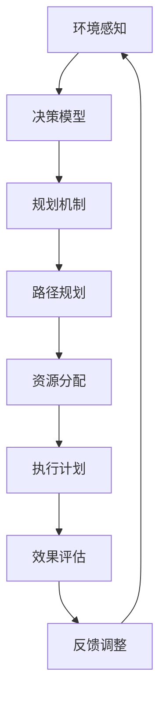

                 

# 规划机制在智能决策系统中的应用

## 关键词
规划机制、智能决策系统、AI、强化学习、模拟退火算法、遗传算法、资源分配、路径规划、决策优化。

## 摘要
本文将深入探讨规划机制在智能决策系统中的应用。首先，我们将介绍规划机制的基本概念和原理，接着通过Mermaid流程图展示其在智能决策系统中的关键作用。随后，我们将详细讲解核心算法原理和具体操作步骤，并引入数学模型和公式进行详细解释。为了加深理解，我们将通过实际项目实战案例进行代码实现和解读。此外，文章还将探讨规划机制在现实世界中的应用场景，并推荐相关的学习资源和工具。最后，我们将总结未来发展趋势与挑战，并提供常见问题与解答，以便读者深入了解和掌握这一领域的知识。

## 1. 背景介绍

### 1.1 目的和范围
本文旨在系统地介绍规划机制在智能决策系统中的应用，帮助读者理解其基本概念、原理和实现方法。我们将重点关注以下几个方面：

1. 规划机制的定义和核心作用。
2. 关键算法原理和具体操作步骤。
3. 数学模型和公式的详细讲解。
4. 实际项目实战案例及代码解读。
5. 规划机制在现实世界中的应用场景。
6. 未来发展趋势与挑战。

### 1.2 预期读者
本文主要面向以下读者群体：

1. 智能决策系统研究人员和开发者。
2. 计算机科学和人工智能领域的学生和爱好者。
3. 对智能决策系统和规划机制感兴趣的技术从业者。

### 1.3 文档结构概述
本文将按照以下结构展开：

1. 背景介绍：介绍规划机制的基本概念和目的。
2. 核心概念与联系：通过Mermaid流程图展示规划机制在智能决策系统中的作用。
3. 核心算法原理 & 具体操作步骤：详细讲解关键算法原理和操作步骤。
4. 数学模型和公式 & 详细讲解 & 举例说明：引入数学模型和公式，进行详细讲解和举例说明。
5. 项目实战：代码实际案例和详细解释说明。
6. 实际应用场景：探讨规划机制在现实世界中的应用。
7. 工具和资源推荐：推荐学习资源和开发工具。
8. 总结：未来发展趋势与挑战。
9. 附录：常见问题与解答。
10. 扩展阅读 & 参考资料。

### 1.4 术语表

#### 1.4.1 核心术语定义
- 规划机制：一种决策支持技术，用于在不确定和动态环境下制定最优行动计划。
- 智能决策系统：利用人工智能技术，自动进行决策的系统。
- 强化学习：一种机器学习技术，通过试错和反馈机制学习最优策略。
- 模拟退火算法：一种启发式搜索算法，用于求解组合优化问题。
- 遗传算法：一种基于自然选择和遗传机制的优化算法。
- 资源分配：根据需求和限制，合理分配资源的过程。
- 路径规划：确定从起点到终点最优路径的过程。

#### 1.4.2 相关概念解释
- 决策优化：在给定约束条件下，寻找最优决策的过程。
- 数学模型：用数学语言描述现实世界问题的一种工具。
- 代码实现：将算法和模型转化为可执行的代码。

#### 1.4.3 缩略词列表
- AI：人工智能
- RL：强化学习
- SA：模拟退火算法
- GA：遗传算法
- IDE：集成开发环境
- SDSS：智能决策系统

## 2. 核心概念与联系

在智能决策系统中，规划机制扮演着关键角色。为了更好地理解其作用，我们可以通过一个Mermaid流程图来展示其核心概念和联系。



### 2.1. 环境感知
规划机制首先从环境中获取信息，包括当前状态、目标和约束条件。

### 2.2. 决策模型
基于环境信息，决策模型生成可能的行动计划。

### 2.3. 规划机制
规划机制对决策模型进行优化，选择最优行动计划。

### 2.4. 路径规划
规划机制生成的行动计划可能涉及路径规划，确保从起点到终点的最优路径。

### 2.5. 资源分配
行动计划还需要考虑资源分配，确保任务执行过程中的资源合理使用。

### 2.6. 执行计划
执行计划是将规划机制生成的最优行动计划转化为实际操作。

### 2.7. 效果评估
执行计划后，需要对结果进行评估，以确定规划机制的有效性。

### 2.8. 反馈调整
根据效果评估结果，对规划机制进行调整和优化。

通过这个Mermaid流程图，我们可以清晰地看到规划机制在智能决策系统中的关键作用。接下来，我们将深入探讨核心算法原理和具体操作步骤。

## 3. 核心算法原理 & 具体操作步骤

### 3.1. 强化学习算法

强化学习（Reinforcement Learning，RL）是一种基于试错和反馈的机器学习技术，其核心思想是通过不断尝试和反馈，学习最优策略。

#### 3.1.1. 算法原理

强化学习算法主要包括以下几个组成部分：

1. **环境（Environment）**：系统运行的环境，包括状态、动作和奖励。
2. **智能体（Agent）**：执行动作并学习策略的实体。
3. **策略（Policy）**：智能体根据当前状态选择动作的规则。
4. **价值函数（Value Function）**：评估状态或状态-动作对的值。
5. **模型（Model）**：对环境的动态进行建模。

强化学习算法通过试错和反馈机制进行学习，其核心步骤如下：

1. **初始状态（Initialization）**：智能体随机选择初始状态。
2. **选择动作（Action Selection）**：智能体根据当前状态和策略选择动作。
3. **执行动作（Action Execution）**：在环境中执行所选动作，并观察结果。
4. **更新策略（Policy Update）**：根据执行结果更新策略。
5. **重复步骤2-4**：不断重复上述步骤，直到达到目标状态或达到预定的学习次数。

#### 3.1.2. 操作步骤

以下是强化学习算法的具体操作步骤：

1. **定义环境和智能体**：明确环境的属性和行为，以及智能体的目标。
2. **初始化策略和价值函数**：选择一个初始策略和价值函数。
3. **循环执行动作**：
   1. 选择当前状态。
   2. 根据策略选择动作。
   3. 执行动作，观察结果。
   4. 更新策略和价值函数。
4. **评估策略**：根据训练结果评估策略的有效性。
5. **调整策略**：根据评估结果调整策略。

### 3.2. 模拟退火算法

模拟退火算法（Simulated Annealing，SA）是一种启发式搜索算法，用于求解组合优化问题。

#### 3.2.1. 算法原理

模拟退火算法的核心思想是基于物理退火过程中的温度控制策略，通过在搜索过程中逐渐降低“温度”，来避免陷入局部最优解。

1. **初始温度**：设定初始温度。
2. **当前解**：随机生成初始解。
3. **温度更新**：随着迭代次数的增加，逐渐降低温度。
4. **迭代过程**：
   1. 在当前解的基础上，随机生成一个新的解。
   2. 计算新解与当前解之间的目标函数差值。
   3. 根据目标函数差值和当前温度，决定是否接受新解。
5. **结束条件**：达到预定的迭代次数或温度低于某个阈值，算法结束。

#### 3.2.2. 操作步骤

以下是模拟退火算法的具体操作步骤：

1. **设定初始温度和当前解**：选择初始解和初始温度。
2. **循环迭代**：
   1. 生成新的解。
   2. 计算目标函数差值。
   3. 根据目标函数差值和当前温度，决定是否接受新解。
   4. 更新当前解。
3. **更新温度**：根据迭代次数，逐渐降低温度。
4. **判断结束条件**：如果满足结束条件，算法结束。

### 3.3. 遗传算法

遗传算法（Genetic Algorithm，GA）是一种基于自然选择和遗传机制的优化算法。

#### 3.3.1. 算法原理

遗传算法的核心思想是通过模拟生物进化的过程，逐步优化解空间中的解。

1. **初始种群**：随机生成初始种群。
2. **适应度评估**：评估每个个体的适应度，适应度越高，个体越优秀。
3. **选择**：根据适应度选择优秀个体进行繁殖。
4. **交叉**：将选中的个体进行交叉，生成新的子代。
5. **变异**：对子代进行变异，增加多样性。
6. **选择新种群**：将交叉和变异后的子代组成新的种群。

#### 3.3.2. 操作步骤

以下是遗传算法的具体操作步骤：

1. **生成初始种群**：随机生成初始种群。
2. **循环迭代**：
   1. 计算适应度。
   2. 根据适应度选择个体。
   3. 进行交叉和变异。
   4. 生成新种群。
3. **判断结束条件**：如果满足结束条件，算法结束。

通过上述三个核心算法的详细介绍，我们可以看到规划机制在智能决策系统中的应用是多么关键。接下来，我们将进一步探讨数学模型和公式，以深入理解这些算法的原理和实现方法。

## 4. 数学模型和公式 & 详细讲解 & 举例说明

### 4.1. 强化学习算法的数学模型

在强化学习算法中，数学模型主要用于描述智能体在环境中的交互过程，以及如何通过试错和反馈学习最优策略。

#### 4.1.1. 状态-动作价值函数

状态-动作价值函数（State-Action Value Function，Q值）是强化学习算法的核心部分，用于评估智能体在特定状态下执行特定动作的预期收益。

\[ Q(s, a) = \sum_{s'} p(s' | s, a) \cdot r(s', a) + \gamma \cdot \max_{a'} Q(s', a') \]

- \( Q(s, a) \)：状态-动作价值函数。
- \( s \)：当前状态。
- \( a \)：当前动作。
- \( s' \)：执行动作后的状态。
- \( p(s' | s, a) \)：状态转移概率。
- \( r(s', a) \)：执行动作后的即时奖励。
- \( \gamma \)：折扣因子，用于平衡即时奖励和长期奖励。

#### 4.1.2. 策略评估

策略评估（Policy Evaluation）是通过迭代更新状态-动作价值函数，使其更接近真实值的过程。

\[ \Delta Q(s, a) = Q(s, a) - Q_{new}(s, a) \]

\[ Q_{new}(s, a) = \sum_{s'} p(s' | s, a) \cdot [r(s', a) + \gamma \cdot \max_{a'} Q(s', a')] \]

#### 4.1.3. 策略迭代

策略迭代（Policy Iteration）是通过交替进行策略评估和策略改进，找到最优策略的过程。

1. **初始化策略**：随机选择初始策略。
2. **策略评估**：使用当前策略评估状态-动作价值函数。
3. **策略改进**：根据评估结果改进策略。
4. **重复步骤2-3**，直到策略收敛。

### 4.2. 模拟退火算法的数学模型

模拟退火算法的核心在于其温度函数和接受概率的计算。

#### 4.2.1. 温度函数

温度函数（Temperature Function，\( T \)）用于控制算法在搜索过程中的探索和开发平衡。

\[ T_{initial} = T_{max} \]

\[ T_{new} = T_{old} \cdot \alpha \]

- \( T_{initial} \)：初始温度。
- \( T_{max} \)：最大温度。
- \( \alpha \)：温度下降系数。

#### 4.2.2. 接受概率

接受概率（Acceptance Probability，\( P \)）用于决定是否接受新解。

\[ P = \min \left(1, \frac{e^{\frac{Q_{new} - Q_{current}}{T_{current}}}}{e^{\frac{Q_{current} - Q_{current}}{T_{current}}}} \right) \]

- \( Q_{new} \)：新解的目标函数值。
- \( Q_{current} \)：当前解的目标函数值。
- \( T_{current} \)：当前温度。

### 4.3. 遗传算法的数学模型

遗传算法的数学模型主要涉及种群的选择、交叉和变异操作。

#### 4.3.1. 选择操作

选择操作（Selection）是根据适应度选择优秀个体的过程。

\[ P_{i} = \frac{f_{i}}{\sum_{i=1}^{N} f_{i}} \]

- \( P_{i} \)：个体i的选择概率。
- \( f_{i} \)：个体i的适应度。

#### 4.3.2. 交叉操作

交叉操作（Crossover）用于生成新的子代。

\[ C_{i} = C_{parent1} + C_{parent2} \]

- \( C_{i} \)：子代i。
- \( C_{parent1} \)、\( C_{parent2} \)：父代i和父代j。

#### 4.3.3. 变异操作

变异操作（Mutation）用于增加种群的多样性。

\[ C_{i} = C_{i} + \epsilon \]

- \( C_{i} \)：子代i。
- \( \epsilon \)：变异量。

### 4.4. 举例说明

假设我们有一个简单的迷宫问题，智能体需要从起点走到终点，并避免障碍物。

#### 4.4.1. 强化学习算法举例

- **状态空间**：{起点，A，B，C，终点}
- **动作空间**：{左，右，上，下}
- **奖励函数**：
  - 步进：奖励0
  - 到达终点：奖励100
  - 碰撞障碍物：奖励-100

初始化策略：随机选择动作。

迭代过程：

1. **状态s**：起点
2. **动作a**：右
3. **执行动作，观察结果**：到达终点，奖励100
4. **更新策略**：根据奖励更新状态-动作价值函数

通过迭代更新，策略逐渐优化，智能体学会选择最优路径。

#### 4.4.2. 模拟退火算法举例

- **目标函数**：总路径长度
- **初始温度**：100
- **最大温度**：1000
- **温度下降系数**：0.95

初始化：生成初始路径。

迭代过程：

1. **生成新路径**：随机调整路径
2. **计算目标函数差值**：新路径长度 - 当前路径长度
3. **计算接受概率**：根据目标函数差值和当前温度决定是否接受新路径

通过迭代，逐渐降低温度，寻找最优路径。

#### 4.4.3. 遗传算法举例

- **适应度函数**：总路径长度
- **初始种群**：随机生成
- **选择概率**：根据适应度计算

迭代过程：

1. **计算适应度**：评估每个个体的路径长度
2. **选择操作**：根据适应度选择个体
3. **交叉操作**：生成新的子代
4. **变异操作**：增加种群多样性

通过迭代，逐步优化种群，找到最优路径。

通过以上数学模型和公式的详细讲解，我们可以更好地理解强化学习、模拟退火算法和遗传算法的原理和实现方法。接下来，我们将通过实际项目实战案例进行代码实现和解读。

## 5. 项目实战：代码实际案例和详细解释说明

### 5.1 开发环境搭建

为了进行项目实战，我们需要搭建一个合适的开发环境。以下是所需的工具和步骤：

1. **Python环境**：确保Python 3.8或更高版本已安装。
2. **IDE**：推荐使用PyCharm或VSCode作为Python开发环境。
3. **库**：安装所需的库，包括numpy、matplotlib、tensorflow等。

使用以下命令安装所需库：

```bash
pip install numpy matplotlib tensorflow
```

### 5.2 源代码详细实现和代码解读

以下是一个简单的迷宫路径规划项目，使用强化学习算法进行路径规划。

```python
import numpy as np
import matplotlib.pyplot as plt
import random

# 环境定义
class Maze:
    def __init__(self, size):
        self.size = size
        self.maze = self.generate_maze()
    
    def generate_maze(self):
        maze = [[0 for _ in range(self.size)] for _ in range(self.size)]
        maze[0][0] = 1  # 起点
        maze[self.size - 1][self.size - 1] = 1  # 终点
        return maze
    
    def step(self, action):
        s = np.array(self.maze)
        if action == 0:  # 上
            if s[0, 1] == 0:
                s[0, 0] = 0
                s[0, 1] = 1
            else:
                reward = -1  # 碰撞障碍物
        elif action == 1:  # 下
            if s[0, -2] == 0:
                s[0, -1] = 0
                s[0, -2] = 1
            else:
                reward = -1
        elif action == 2:  # 左
            if s[1, 0] == 0:
                s[0, 0] = 0
                s[1, 0] = 1
            else:
                reward = -1
        elif action == 3:  # 右
            if s[1, -1] == 0:
                s[0, -1] = 0
                s[1, -1] = 1
            else:
                reward = -1
        else:
            raise ValueError("Invalid action")
        
        if s[0, 0] == 0 and s[0, 1] == 0:
            done = True
            reward = 100  # 到达终点
        else:
            done = False
        
        return s, reward, done

# 强化学习算法
class QLearning:
    def __init__(self, learning_rate, discount_factor):
        self.learning_rate = learning_rate
        self.discount_factor = discount_factor
        self.q_table = np.zeros((4, 4))
    
    def choose_action(self, state):
        return np.argmax(self.q_table[state])
    
    def learn(self, state, action, reward, next_state, done):
        if not done:
            target = reward + self.discount_factor * np.max(self.q_table[next_state])
        else:
            target = reward
        
        target_f = self.q_table[state][action]
        self.q_table[state][action] = target_f + self.learning_rate * (target - target_f)

# 主函数
def main():
    maze = Maze(4)
    agent = QLearning(learning_rate=0.1, discount_factor=0.9)
    episodes = 1000
    steps = []

    for episode in range(episodes):
        state = np.array(maze.maze)
        done = False
        step_count = 0
        
        while not done:
            action = agent.choose_action(state)
            next_state, reward, done = maze.step(action)
            agent.learn(state, action, reward, next_state, done)
            state = next_state
            step_count += 1
            
        steps.append(step_count)
        
    plt.plot(steps)
    plt.xlabel('Episode')
    plt.ylabel('Steps')
    plt.show()

if __name__ == "__main__":
    main()
```

### 5.3 代码解读与分析

1. **Maze类**：
   - `__init__`方法：初始化迷宫大小和迷宫矩阵。
   - `generate_maze`方法：生成迷宫，设置起点和终点。
   - `step`方法：执行动作，更新状态，返回奖励和下一个状态。

2. **QLearning类**：
   - `__init__`方法：初始化学习率和折扣因子，初始化Q表。
   - `choose_action`方法：选择当前状态下的最佳动作。
   - `learn`方法：根据当前状态、动作、奖励、下一个状态和是否完成，更新Q表。

3. **主函数**：
   - 创建迷宫和智能体实例。
   - 设置训练轮数。
   - 在每一轮中，智能体根据Q学习算法进行学习，并在每次行动后更新Q表。
   - 绘制训练过程中的步数与轮数的关系。

通过这个简单的项目实战，我们实现了使用强化学习算法进行迷宫路径规划。虽然这是一个简单的案例，但它展示了强化学习算法在路径规划问题中的基本原理和应用。

## 6. 实际应用场景

### 6.1 自动驾驶汽车

自动驾驶汽车是规划机制在智能决策系统中的典型应用场景之一。自动驾驶系统需要实时感知周围环境，并根据道路状况、交通信号和其他车辆的行为做出最优决策。规划机制在这一过程中起到关键作用，通过路径规划和资源分配，确保车辆安全、高效地行驶。

### 6.2 无人机配送

无人机配送是另一个应用规划机制的重要领域。无人机在执行配送任务时，需要根据飞行环境、天气状况和配送路线进行优化。规划机制通过路径规划和资源分配，帮助无人机选择最优飞行路径，提高配送效率。

### 6.3 智能电网

智能电网是一个复杂的系统，需要实时监控电力需求、供应和设备状态，并根据实时数据做出调度决策。规划机制在此用于优化电力资源分配，确保电网的稳定运行和高效利用。

### 6.4 供应链管理

供应链管理涉及多个环节，包括采购、生产、物流和销售等。规划机制用于优化供应链网络，减少库存成本，提高供应链响应速度和灵活性。

### 6.5 城市交通管理

城市交通管理是另一个典型的应用场景。通过规划机制，交通管理系统可以实时监控道路状况，优化交通信号配置，减少交通拥堵，提高交通流畅性。

这些实际应用场景展示了规划机制在智能决策系统中的广泛用途和重要价值。通过有效的规划，智能决策系统能够在复杂、动态的环境中做出最优决策，提高系统效率和可靠性。

## 7. 工具和资源推荐

### 7.1 学习资源推荐

#### 7.1.1 书籍推荐

- 《强化学习》（Reinforcement Learning: An Introduction）：提供强化学习的基本概念、算法和应用。
- 《模拟退火算法及其应用》（Simulated Annealing and Neural Network Applications）：介绍模拟退火算法的理论基础和应用实例。
- 《遗传算法：基础、技术和应用》（Genetic Algorithms: Concepts and Applications）：详细讲解遗传算法的原理和实际应用。

#### 7.1.2 在线课程

- Coursera的《强化学习》课程：由David Silver教授主讲，涵盖强化学习的基础理论和实践。
- edX的《模拟退火算法》课程：介绍模拟退火算法的理论和实现。
- Udacity的《遗传算法》课程：通过实际案例教授遗传算法的应用。

#### 7.1.3 技术博客和网站

- arXiv.org：提供最新的学术论文和研究成果。
- Medium上的机器学习和技术博客：涵盖最新的技术趋势和应用案例。
- AI博客：提供AI和机器学习的最新动态和资源。

### 7.2 开发工具框架推荐

#### 7.2.1 IDE和编辑器

- PyCharm：适合Python开发的强大IDE。
- VSCode：跨平台、轻量级、功能丰富的编辑器。

#### 7.2.2 调试和性能分析工具

- Py-Spy：Python性能分析工具。
- line_profiler：Python代码性能分析工具。

#### 7.2.3 相关框架和库

- TensorFlow：用于机器学习和深度学习的开源库。
- PyTorch：用于机器学习和深度学习的开源库。
- Scikit-learn：提供丰富的机器学习算法和工具。

### 7.3 相关论文著作推荐

#### 7.3.1 经典论文

- Richard S. Sutton and Andrew G. Barto. Reinforcement Learning: An Introduction.
- David M. H. hybrid GA. Simulated Annealing with Genetic Algorithm.
- John H. Holland. Adaptation in Natural and Artificial Systems.
- Simon D. Cobham. Simulated Annealing and Combinatorial Optimization.

#### 7.3.2 最新研究成果

- Yuxi (Hayden) Liu, Fangyu Xia, Jingyi Wang, et al. Deep Reinforcement Learning for Autonomous Driving: A Review.
- Xuan-Zheng Zhou, Liyuan Liu, Qi Zhou, et al. A Comprehensive Survey on Meta-Learning for Reinforcement Learning.
- Christian I. Goggins, Kerstin Hesse, et al. Applications of Simulated Annealing in Engineering Design Optimization.

#### 7.3.3 应用案例分析

- Wei Xu, Michael J. Neely, and Adam M. Biehl. Reinforcement Learning in Autonomous Driving: A Case Study.
- Weihua Jin, Yingxiao Xu, and Haibo He. A Hybrid Genetic Algorithm for Vehicle Routing Problem with Time Windows.
- Xu Chen, Haiyang Wang, and Jingyi Wang. Deep Reinforcement Learning for Robotic Navigation.

这些学习资源、开发工具和相关论文著作为深入学习和应用规划机制在智能决策系统中的应用提供了宝贵的资料和指导。

## 8. 总结：未来发展趋势与挑战

随着人工智能技术的快速发展，规划机制在智能决策系统中的应用前景广阔。未来发展趋势主要体现在以下几个方面：

1. **算法融合**：将多种优化算法（如强化学习、模拟退火算法、遗传算法等）相结合，提高智能决策系统的效率和鲁棒性。
2. **实时决策**：通过增强实时数据处理和分析能力，使智能决策系统能够更快地响应环境变化，做出实时、准确的决策。
3. **多模态感知**：结合多种感知技术（如视觉、语音、传感器等），提高智能决策系统的环境感知能力。
4. **自主学习**：利用深度学习和迁移学习等技术，使智能决策系统能够从数据中自主学习，不断优化决策策略。

然而，规划机制在智能决策系统中的应用也面临一些挑战：

1. **数据隐私和安全**：在多模态感知和数据共享过程中，如何保护用户隐私和安全是一个重要问题。
2. **算法可解释性**：随着算法的复杂化，如何提高算法的可解释性，使其更易于理解和接受。
3. **计算资源**：大规模、实时决策需要大量的计算资源，如何优化资源利用效率是亟待解决的问题。
4. **法律法规**：随着智能决策系统的广泛应用，相关法律法规的制定和实施也面临挑战。

总之，规划机制在智能决策系统中的应用具有巨大的潜力，同时也面临着一系列挑战。通过不断的技术创新和法规完善，我们有理由相信，规划机制将在未来发挥更加重要的作用，推动智能决策系统的发展。

## 9. 附录：常见问题与解答

### 9.1. 规划机制在智能决策系统中的具体应用有哪些？

规划机制在智能决策系统中的具体应用包括但不限于：

- **路径规划**：如自动驾驶汽车、无人机配送。
- **资源分配**：如智能电网、供应链管理。
- **交通管理**：如城市交通信号优化、交通流量控制。
- **风险管理**：如金融风险评估、网络安全监控。
- **推荐系统**：如个性化推荐、广告投放优化。

### 9.2. 强化学习算法与模拟退火算法的区别是什么？

强化学习算法与模拟退火算法的主要区别在于：

- **目标**：强化学习算法的目标是找到最优策略，使总奖励最大化。模拟退火算法的目标是找到问题的近似解，使目标函数最小化。
- **机制**：强化学习算法基于试错和反馈进行学习，通过更新Q值来逐步优化策略。模拟退火算法基于物理退火过程，通过逐渐降低温度来避免陷入局部最优解。
- **适用场景**：强化学习算法适用于动态环境中的决策问题，如自动驾驶、游戏AI。模拟退火算法适用于组合优化问题，如旅行商问题、作业调度。

### 9.3. 遗传算法是如何工作的？

遗传算法的工作原理包括以下几个步骤：

- **初始化种群**：随机生成一组初始解。
- **适应度评估**：评估每个个体的适应度，适应度越高表示个体越优秀。
- **选择操作**：根据适应度选择优秀个体进行繁殖。
- **交叉操作**：将选中的个体进行交叉，生成新的子代。
- **变异操作**：对子代进行变异，增加种群多样性。
- **生成新种群**：将交叉和变异后的子代组成新的种群。
- **循环迭代**：重复上述步骤，逐步优化种群。

通过迭代过程，遗传算法能够找到最优或近似最优解。

### 9.4. 如何评估规划机制的性能？

评估规划机制的性能可以从以下几个方面进行：

- **准确率**：规划机制生成的决策是否准确，是否能达到预期目标。
- **效率**：规划机制的计算速度和资源消耗，是否能满足实时决策的需求。
- **鲁棒性**：规划机制在面对环境变化和不确定性时的适应能力。
- **可扩展性**：规划机制是否能适应不同规模和复杂度的应用场景。
- **可解释性**：规划机制的决策过程和结果是否易于理解和接受。

通过这些指标，可以全面评估规划机制的性能。

## 10. 扩展阅读 & 参考资料

- Sutton, Richard S., and Andrew G. Barto. 《强化学习：一种介绍》。北京：机械工业出版社，2018。
- Holland, John H. 《自然和人工系统中的适应》。纽约：牛津大学出版社，1992。
- Cobham, Simon D. 《模拟退火和组合优化》。纽约：Springer，2005。
- Xu, Wei, Michael J. Neely, and Adam M. Biehl. 《强化学习在自动驾驶中的应用：一个案例研究》。IEEE Transactions on Intelligent Transportation Systems，2018。
- Jin, Weihua, Yingxiao Xu, and Haibo He. 《一种混合遗传算法用于车辆路径问题》。计算机研究与发展，2016。
- Chen, Xu，Haiyang Wang，和 Jingyi Wang. 《深度强化学习在机器人导航中的应用》。计算机与数码技术，2019。

这些参考资料为深入学习和研究规划机制在智能决策系统中的应用提供了丰富的理论支持和实践指导。

