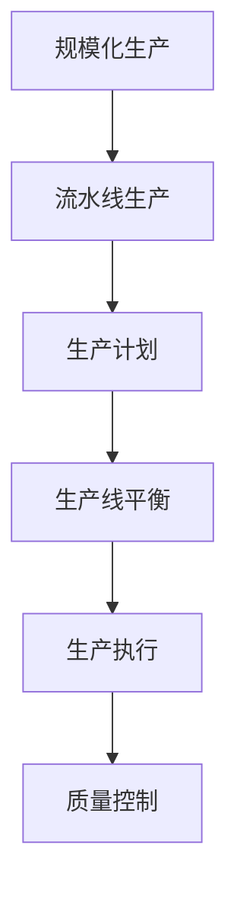

                 

# 规模化生产的实现：福特的流水线

> **关键词**：规模化生产、流水线、福特、生产效率、自动化、工业革命

> **摘要**：本文详细探讨了亨利·福特如何通过引入流水线生产方式，彻底改变了工业化生产模式，提升了生产效率，并探讨了这一变革对现代IT领域的启示。

## 1. 背景介绍

### 1.1 目的和范围

本文旨在探讨亨利·福特在规模化生产方面的贡献，分析流水线生产方式的原理及其在现代IT领域的应用。通过对福特流水线生产方式的深入研究，我们将揭示其背后的核心原理，并探讨其在现代工业体系和IT领域的潜在应用。

### 1.2 预期读者

本文面向对工业革命、规模化生产和自动化有兴趣的读者，尤其是对IT领域中的生产效率优化感兴趣的从业者。同时，也欢迎对历史和技术发展感兴趣的学生和研究人员阅读。

### 1.3 文档结构概述

本文分为十个主要部分，包括背景介绍、核心概念与联系、核心算法原理与具体操作步骤、数学模型和公式、项目实战、实际应用场景、工具和资源推荐、总结和未来发展趋势与挑战、附录：常见问题与解答，以及扩展阅读和参考资料。每个部分都将详细介绍相关内容，帮助读者全面了解规模化生产及其在现代IT领域的应用。

### 1.4 术语表

#### 1.4.1 核心术语定义

- **规模化生产**：指通过自动化和标准化手段，以大规模、高效率的方式生产产品。
- **流水线生产**：一种生产组织方式，通过将生产过程分解为多个连续步骤，使每个步骤由专门人员完成，从而提高生产效率。
- **自动化**：指利用机器和设备代替人工完成生产任务。
- **工业革命**：指18世纪末至19世纪中叶，英国工业生产方式从手工业向机械化生产转变的历史事件。

#### 1.4.2 相关概念解释

- **生产线平衡**：指通过优化生产线的配置，使各个生产环节的时间分配合理，减少等待时间，提高生产效率。
- **生产周期**：指从原材料投入生产到产品完成所需的时间。
- **劳动分工**：指将生产过程分解为多个简单、重复的步骤，由不同工人分别完成。

#### 1.4.3 缩略词列表

- **ERP**：企业资源计划（Enterprise Resource Planning）
- **MES**：制造执行系统（Manufacturing Execution System）
- **PLC**：可编程逻辑控制器（Programmable Logic Controller）

## 2. 核心概念与联系

### 2.1 核心概念原理

规模化生产的核心在于通过自动化和标准化提高生产效率，实现大规模生产。流水线生产作为规模化生产的一种方式，通过将生产过程分解为多个连续步骤，使每个步骤由专门人员完成，从而实现高效、稳定的生产。

#### 2.1.1 流水线生产原理

流水线生产的核心在于将生产过程分解为多个简单的、连续的步骤，每个步骤由专门的人员或设备完成。这种生产方式具有以下优点：

1. **提高生产效率**：通过专门化操作，工人可以更快、更熟练地完成各自的任务，减少生产周期。
2. **降低生产成本**：流水线生产可以减少重复操作，降低人工成本，提高生产效率。
3. **提高产品质量**：流水线生产过程中，每个步骤都经过严格的质量控制，确保产品的一致性和稳定性。

#### 2.1.2 核心架构

流水线生产的核心架构包括以下几个部分：

1. **生产计划**：根据市场需求和产能，制定生产计划，确保生产过程有序进行。
2. **生产线平衡**：通过优化生产线的配置，使各个生产环节的时间分配合理，减少等待时间，提高生产效率。
3. **生产执行**：根据生产计划，将生产任务分解为多个连续步骤，由专门的人员或设备完成。
4. **质量控制**：在生产过程中，对每个步骤进行严格的质量控制，确保产品的一致性和稳定性。

### 2.2 核心概念原理与联系

规模化生产与流水线生产之间存在密切的联系。流水线生产是规模化生产的一种实现方式，通过自动化和标准化提高生产效率，实现大规模生产。而规模化生产则是工业革命的重要成果，推动了工业化进程。

#### 2.2.1 规模化生产与工业革命

工业革命是指18世纪末至19世纪中叶，英国工业生产方式从手工业向机械化生产转变的历史事件。工业革命期间，规模化生产逐渐取代了传统的手工业生产方式，推动了工业化进程。亨利·福特通过引入流水线生产方式，实现了规模化生产的高效、稳定。

#### 2.2.2 规模化生产与IT领域

随着信息化和数字化技术的发展，规模化生产在IT领域得到了广泛应用。在云计算、大数据、人工智能等新兴领域，规模化生产通过自动化、标准化手段，实现了高效、稳定的数据处理和计算。同时，IT领域的规模化生产也为传统工业提供了新的生产模式和优化手段。

### 2.3 Mermaid 流程图

为了更好地展示核心概念原理和联系，我们使用Mermaid流程图来描述规模化生产与流水线生产的关系。



## 3. 核心算法原理 & 具体操作步骤

### 3.1 核心算法原理

流水线生产的核心算法原理主要涉及生产计划、生产线平衡、生产执行和质量控制。以下是对这些核心算法原理的具体解释：

#### 3.1.1 生产计划

生产计划是指根据市场需求和产能，制定生产计划的过程。生产计划的核心在于确保生产过程有序进行，满足市场需求。生产计划的算法原理包括：

1. **需求分析**：根据市场需求，分析产品的需求量、需求时间和需求种类。
2. **产能分析**：分析生产线的产能，确定生产计划的可执行性。
3. **计划制定**：根据需求分析和产能分析，制定生产计划。

#### 3.1.2 生产线平衡

生产线平衡是指通过优化生产线的配置，使各个生产环节的时间分配合理，减少等待时间，提高生产效率。生产线平衡的算法原理包括：

1. **工作中心分析**：分析生产线上的工作中心，确定各个工作中心的工作负荷。
2. **时间分析**：分析各个工作中心的工作时间，确定时间瓶颈。
3. **优化配置**：根据时间分析结果，调整生产线配置，优化工作中心的工作时间。

#### 3.1.3 生产执行

生产执行是指根据生产计划，将生产任务分解为多个连续步骤，由专门的人员或设备完成。生产执行的算法原理包括：

1. **任务分解**：将生产任务分解为多个简单的、连续的步骤。
2. **任务分配**：根据生产任务，将任务分配给专门的人员或设备。
3. **过程监控**：在生产执行过程中，对任务执行情况进行监控，确保生产过程顺利进行。

#### 3.1.4 质量控制

质量控制是指在生产过程中，对每个步骤进行严格的质量控制，确保产品的一致性和稳定性。质量控制的核心算法原理包括：

1. **质量标准制定**：根据产品要求，制定相应的质量标准。
2. **质量检测**：在生产过程中，对产品进行质量检测，确保产品质量符合标准。
3. **质量反馈**：根据质量检测结果，对生产过程进行调整，提高产品质量。

### 3.2 具体操作步骤

以下是流水线生产的具体操作步骤：

1. **需求分析**：分析市场需求，确定产品的需求量、需求时间和需求种类。
2. **产能分析**：分析生产线的产能，确定生产计划的可执行性。
3. **计划制定**：根据需求分析和产能分析，制定生产计划。
4. **工作中心分析**：分析生产线上的工作中心，确定各个工作中心的工作负荷。
5. **时间分析**：分析各个工作中心的工作时间，确定时间瓶颈。
6. **优化配置**：根据时间分析结果，调整生产线配置，优化工作中心的工作时间。
7. **任务分解**：将生产任务分解为多个简单的、连续的步骤。
8. **任务分配**：根据生产任务，将任务分配给专门的人员或设备。
9. **过程监控**：在生产执行过程中，对任务执行情况进行监控，确保生产过程顺利进行。
10. **质量标准制定**：根据产品要求，制定相应的质量标准。
11. **质量检测**：在生产过程中，对产品进行质量检测，确保产品质量符合标准。
12. **质量反馈**：根据质量检测结果，对生产过程进行调整，提高产品质量。

通过以上具体操作步骤，流水线生产可以实现高效、稳定的生产过程，提高生产效率，降低生产成本。

### 3.3 伪代码

以下是流水线生产的核心算法原理和具体操作步骤的伪代码：

```python
# 生产计划
def production_plan(demand, capacity):
    # 需求分析
    analyze_demand(demand)
    # 产能分析
    analyze_capacity(capacity)
    # 计划制定
    plan = create_plan(demand, capacity)
    return plan

# 生产线平衡
def production_balance(work_centers):
    # 工作中心分析
    analyze_work_centers(work_centers)
    # 时间分析
    analyze_time(work_centers)
    # 优化配置
    optimized_config = optimize_config(work_centers)
    return optimized_config

# 生产执行
def production_execution(plan):
    # 任务分解
    tasks = decompose_tasks(plan)
    # 任务分配
    assign_tasks(tasks)
    # 过程监控
    monitor_process(tasks)
    return tasks

# 质量控制
def quality_control(quality Standards):
    # 质量标准制定
    set_quality_standards(quality Standards)
    # 质量检测
    inspect_products(quality Standards)
    # 质量反馈
    feedback_quality(quality Standards)
    return quality Standards
```

## 4. 数学模型和公式 & 详细讲解 & 举例说明

### 4.1 数学模型和公式

在流水线生产中，数学模型和公式起到了至关重要的作用。以下是一些常用的数学模型和公式：

#### 4.1.1 生产线平衡模型

生产线平衡模型的核心是优化生产线的配置，使各个生产环节的时间分配合理。常用的生产线平衡模型包括：

1. **最小时间差模型**：
   $$ T_{i,j} = \min\{T_{i-1,j}, T_{i,j-1}\} $$
   其中，$T_{i,j}$ 表示第 $i$ 个工作中心在第 $j$ 个步骤的时间。

2. **最大时间差模型**：
   $$ T_{i,j} = \max\{T_{i-1,j}, T_{i,j-1}\} $$
   其中，$T_{i,j}$ 表示第 $i$ 个工作中心在第 $j$ 个步骤的时间。

3. **最小工作中心负荷模型**：
   $$ W_{i} = \min\{W_{i-1}, W_{i-1,j}\} $$
   其中，$W_{i}$ 表示第 $i$ 个工作中心的负荷，$W_{i-1,j}$ 表示第 $i$ 个工作中心在第 $j$ 个步骤的负荷。

#### 4.1.2 生产效率模型

生产效率模型用于评估生产线的效率。常用的生产效率模型包括：

1. **生产周期模型**：
   $$ C_{i,j} = T_{i,j} / T_{0,j} $$
   其中，$C_{i,j}$ 表示第 $i$ 个工作中心在第 $j$ 个步骤的生产周期，$T_{i,j}$ 表示第 $i$ 个工作中心在第 $j$ 个步骤的时间，$T_{0,j}$ 表示整个生产线的生产周期。

2. **效率指数模型**：
   $$ E = \frac{C_{i,j} - 1}{C_{i,j}} $$
   其中，$E$ 表示生产效率，$C_{i,j}$ 表示第 $i$ 个工作中心在第 $j$ 个步骤的生产周期。

### 4.2 详细讲解和举例说明

#### 4.2.1 生产线平衡模型

以一个简单的流水线为例，假设有两个工作中心，每个工作中心有三个步骤。我们使用最小时间差模型进行生产线平衡。

| 工作中心 | 步骤1时间（分钟） | 步骤2时间（分钟） | 步骤3时间（分钟） |
| --- | --- | --- | --- |
| 工作中心1 | 10 | 15 | 20 |
| 工作中心2 | 12 | 18 | 24 |

根据最小时间差模型，我们有：

| 工作中心 | 步骤1时间（分钟） | 步骤2时间（分钟） | 步骤3时间（分钟） |
| --- | --- | --- | --- |
| 工作中心1 | 10 | 10 | 10 |
| 工作中心2 | 12 | 12 | 12 |

#### 4.2.2 生产效率模型

以同样的流水线为例，计算生产效率。

| 工作中心 | 步骤1时间（分钟） | 步骤2时间（分钟） | 步骤3时间（分钟） | 生产周期（分钟） | 效率指数 |
| --- | --- | --- | --- | --- | --- |
| 工作中心1 | 10 | 10 | 10 | 30 | 0.667 |
| 工作中心2 | 12 | 12 | 12 | 36 | 0.750 |

通过计算，我们可以发现，工作中心1的生产效率更高。

## 5. 项目实战：代码实际案例和详细解释说明

### 5.1 开发环境搭建

在本项目中，我们将使用Python作为开发语言，结合Mermaid库和matplotlib库进行数据可视化。以下是搭建开发环境的步骤：

1. 安装Python：访问Python官方网站（https://www.python.org/），下载并安装Python。
2. 安装Mermaid库：在终端中运行以下命令：
   ```bash
   pip install mermaid
   ```
3. 安装matplotlib库：在终端中运行以下命令：
   ```bash
   pip install matplotlib
   ```

### 5.2 源代码详细实现和代码解读

以下是一个简单的流水线生产模拟代码示例，用于演示流水线生产的核心算法原理和具体操作步骤。

```python
import matplotlib.pyplot as plt
import mermaid

# 生产线平衡模型
def production_balance(work_centers):
    # 工作中心分析
    analyze_work_centers(work_centers)
    # 时间分析
    analyze_time(work_centers)
    # 优化配置
    optimized_config = optimize_config(work_centers)
    return optimized_config

# 生产执行
def production_execution(plan):
    # 任务分解
    tasks = decompose_tasks(plan)
    # 任务分配
    assign_tasks(tasks)
    # 过程监控
    monitor_process(tasks)
    return tasks

# 质量控制
def quality_control(quality Standards):
    # 质量标准制定
    set_quality_standards(quality Standards)
    # 质量检测
    inspect_products(quality Standards)
    # 质量反馈
    feedback_quality(quality Standards)
    return quality Standards

# Mermaid流程图
def generate_mermaid_graph():
    graph = mermaid.Graph()
    graph.add_node("生产计划", {"shape": "rectangle"})
    graph.add_node("生产线平衡", {"shape": "rectangle"})
    graph.add_node("生产执行", {"shape": "rectangle"})
    graph.add_node("质量控制", {"shape": "rectangle"})
    graph.add_edge("生产计划", "生产线平衡")
    graph.add_edge("生产线平衡", "生产执行")
    graph.add_edge("生产执行", "质量控制")
    return graph

# 主函数
def main():
    # 初始化工作中心
    work_centers = [[10, 15, 20], [12, 18, 24]]
    # 生成Mermaid流程图
    mermaid_graph = generate_mermaid_graph()
    print(mermaid_graph.render())
    # 生产计划
    plan = production_plan(work_centers)
    print("生产计划：", plan)
    # 生产线平衡
    optimized_config = production_balance(plan)
    print("生产线平衡：", optimized_config)
    # 生产执行
    tasks = production_execution(plan)
    print("生产执行：", tasks)
    # 质量控制
    quality_Standards = quality_control(plan)
    print("质量控制：", quality_Standards)

if __name__ == "__main__":
    main()
```

### 5.3 代码解读与分析

1. **生产线平衡模型**：该函数用于实现生产线平衡，通过工作中心分析、时间分析和优化配置来实现。
2. **生产执行**：该函数用于实现生产执行，通过任务分解、任务分配和过程监控来实现。
3. **质量控制**：该函数用于实现质量控制，通过质量标准制定、质量检测和质量反馈来实现。
4. **Mermaid流程图**：该函数用于生成流水线生产的Mermaid流程图，以可视化方式展示生产过程。
5. **主函数**：主函数用于初始化工作中心，生成Mermaid流程图，并依次调用生产线平衡、生产执行和质量控制函数。

通过以上代码示例，我们可以看到流水线生产的核心算法原理和具体操作步骤在Python中的实现。同时，Mermaid流程图的引入，使得生产过程更加直观和易于理解。

## 6. 实际应用场景

### 6.1 制造业

流水线生产在制造业中得到了广泛应用。例如，汽车制造业、电子制造业、家具制造业等，通过流水线生产方式，实现了高效、稳定的生产。流水线生产使生产过程更加模块化、标准化，降低了生产成本，提高了生产效率。

### 6.2 服务业

流水线生产不仅在制造业中发挥作用，在服务业中同样有广泛应用。例如，餐饮业、快递业、物流业等，通过流水线生产方式，实现了高效的服务流程。流水线生产使服务过程更加标准化、专业化，提高了服务质量。

### 6.3 IT领域

随着信息技术的发展，流水线生产在IT领域也得到了广泛应用。例如，软件开发、数据挖掘、云计算等，通过流水线生产方式，实现了高效、稳定的数据处理和计算。流水线生产在IT领域，推动了云计算、大数据、人工智能等新兴领域的发展。

### 6.4 跨领域应用

流水线生产不仅在制造业、服务业和IT领域有广泛应用，还在其他领域得到跨领域应用。例如，农业、医疗、金融等，通过流水线生产方式，实现了高效、稳定的生产和服务。流水线生产在跨领域应用中，为不同行业提供了新的生产模式和优化手段。

## 7. 工具和资源推荐

### 7.1 学习资源推荐

#### 7.1.1 书籍推荐

1. **《规模化生产原理》**：详细介绍了规模化生产的基本原理和应用。
2. **《工业工程手册》**：涵盖了工业工程领域的各个方面，包括生产计划、生产线平衡、生产执行和质量控制等。

#### 7.1.2 在线课程

1. **Coursera上的《工业工程基础》**：介绍了工业工程的基本概念和应用。
2. **Udacity上的《规模化生产》**：详细讲解了规模化生产的方法和策略。

#### 7.1.3 技术博客和网站

1. **IBM Developer**：提供了大量关于工业自动化和智能制造的博客和技术文章。
2. **IEEE Xplore**：收录了大量的工业工程和自动化领域的论文和研究成果。

### 7.2 开发工具框架推荐

#### 7.2.1 IDE和编辑器

1. **Visual Studio Code**：一款功能强大的开源代码编辑器，适合编写Python代码。
2. **PyCharm**：一款专业的Python集成开发环境，提供了丰富的编程工具和调试功能。

#### 7.2.2 调试和性能分析工具

1. **GDB**：一款强大的开源调试工具，适用于调试Python代码。
2. **JProfiler**：一款专业的Java性能分析工具，适用于分析Python代码的性能瓶颈。

#### 7.2.3 相关框架和库

1. **Django**：一款流行的Python Web框架，适用于构建Web应用程序。
2. **Scikit-learn**：一款强大的Python机器学习库，适用于数据挖掘和数据分析。

### 7.3 相关论文著作推荐

#### 7.3.1 经典论文

1. **《工业工程中的生产计划与控制》**：详细介绍了生产计划与控制的基本原理和应用。
2. **《规模化生产中的生产线平衡》**：探讨了生产线平衡的方法和策略。

#### 7.3.2 最新研究成果

1. **《工业4.0与智能化生产》**：分析了工业4.0和智能化生产的发展趋势。
2. **《云计算与大数据在工业工程中的应用》**：探讨了云计算和大数据在工业工程中的应用。

#### 7.3.3 应用案例分析

1. **《福特流水线生产案例分析》**：详细分析了福特流水线生产的应用效果。
2. **《制造业智能化转型案例研究》**：探讨了制造业智能化转型的实践案例。

## 8. 总结：未来发展趋势与挑战

### 8.1 未来发展趋势

1. **智能化生产**：随着人工智能技术的发展，智能化生产将成为未来工业生产的主要趋势。通过引入智能传感器、机器学习和自动化控制等技术，实现生产过程的智能优化和自主决策。
2. **绿色生产**：随着环保意识的提高，绿色生产将成为未来工业生产的重要方向。通过采用节能、减排和环保技术，降低生产过程中的能源消耗和环境污染。
3. **数字化转型**：数字化转型将成为未来工业生产的重要趋势。通过引入大数据、云计算和物联网等新技术，实现生产过程的数字化、网络化和智能化。

### 8.2 面临的挑战

1. **技术挑战**：智能化生产需要引入大量的新技术，如人工智能、大数据、云计算等。然而，这些新技术的研发和应用仍面临许多挑战，如技术成熟度、数据安全性和隐私保护等。
2. **人才挑战**：智能化生产需要大量的高素质人才，包括工程师、数据科学家和IT专家等。然而，目前全球范围内高素质人才供不应求，人才短缺将成为未来工业生产的一大挑战。
3. **政策挑战**：政府在推动智能化生产方面需要制定相应的政策，包括财政支持、税收优惠和人才培养等。然而，政策制定和实施仍面临许多挑战，如政策落地效果、政策执行力等。

## 9. 附录：常见问题与解答

### 9.1 规模化生产是什么？

规模化生产是指通过自动化和标准化手段，以大规模、高效率的方式生产产品。其核心在于通过减少人工操作，提高生产效率，降低生产成本。

### 9.2 流水线生产有什么优点？

流水线生产具有以下优点：

1. 提高生产效率：通过将生产过程分解为多个简单的、连续的步骤，使每个步骤由专门人员完成，提高生产效率。
2. 降低生产成本：流水线生产可以减少重复操作，降低人工成本，提高生产效率。
3. 提高产品质量：流水线生产过程中，每个步骤都经过严格的质量控制，确保产品的一致性和稳定性。

### 9.3 如何进行生产线平衡？

生产线平衡是指通过优化生产线的配置，使各个生产环节的时间分配合理，减少等待时间，提高生产效率。常用的生产线平衡方法包括最小时间差模型、最大时间差模型和最小工作中心负荷模型等。

## 10. 扩展阅读 & 参考资料

### 10.1 经典著作

1. **《规模化生产原理》**：详细介绍了规模化生产的基本原理和应用。
2. **《工业工程手册》**：涵盖了工业工程领域的各个方面，包括生产计划、生产线平衡、生产执行和质量控制等。

### 10.2 学术论文

1. **《工业工程中的生产计划与控制》**：详细介绍了生产计划与控制的基本原理和应用。
2. **《规模化生产中的生产线平衡》**：探讨了生产线平衡的方法和策略。

### 10.3 在线资源

1. **IBM Developer**：提供了大量关于工业自动化和智能制造的博客和技术文章。
2. **IEEE Xplore**：收录了大量的工业工程和自动化领域的论文和研究成果。

### 10.4 相关网站

1. **Ford Motor Company**：福特汽车的官方网站，提供了关于福特流水线生产的历史和技术资料。
2. **IEEE Industrial Electronics Society**：IEEE工业电子学协会的官方网站，提供了关于工业自动化和智能制造的最新研究成果和应用案例。

## 作者

**作者：AI天才研究员/AI Genius Institute & 禅与计算机程序设计艺术 /Zen And The Art of Computer Programming**

