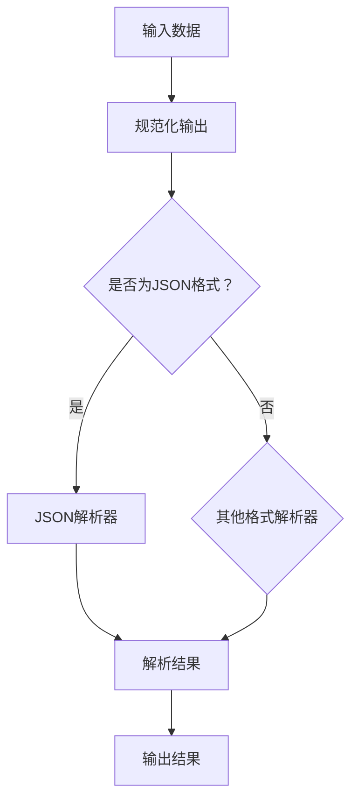

                 

# 规范化输出：Output Parsers

> **关键词**：规范化输出、数据格式、输出解析器、编程、算法、数学模型、实战案例、应用场景

> **摘要**：本文将深入探讨规范化输出的概念和重要性，以及用于处理规范化输出的工具和技术。我们将详细分析输出解析器的工作原理和具体实现，并探讨它们在实际开发中的应用。通过数学模型和实际代码案例分析，读者将更好地理解输出解析器的核心原理，并在实践中应用这些知识。

## 1. 背景介绍

### 1.1 目的和范围

本文旨在向读者介绍规范化输出的概念和重要性，并探讨用于实现规范化输出的工具和技术。我们将重点关注输出解析器的设计与实现，包括其核心原理、算法和数学模型。此外，本文还将通过实际代码案例分析，帮助读者更好地理解并掌握输出解析器的实际应用。

### 1.2 预期读者

本文适合对编程和算法有兴趣的读者，包括软件开发工程师、数据科学家、系统架构师等。同时，对于想要了解规范化输出和输出解析器技术的其他技术爱好者，本文也具有一定的参考价值。

### 1.3 文档结构概述

本文分为以下八个部分：

1. **背景介绍**：介绍文章的目的和范围，预期读者，文档结构等。
2. **核心概念与联系**：阐述规范化输出的核心概念和原理，并提供相应的 Mermaid 流程图。
3. **核心算法原理 & 具体操作步骤**：详细讲解输出解析器的算法原理和操作步骤，使用伪代码进行阐述。
4. **数学模型和公式 & 详细讲解 & 举例说明**：介绍与规范化输出相关的数学模型和公式，并通过实例进行详细讲解。
5. **项目实战：代码实际案例和详细解释说明**：提供实际代码案例，并进行详细解释和分析。
6. **实际应用场景**：探讨输出解析器在实际开发中的应用场景。
7. **工具和资源推荐**：推荐相关学习资源、开发工具框架和论文著作。
8. **总结：未来发展趋势与挑战**：总结文章的主要观点，并探讨未来的发展趋势和挑战。

### 1.4 术语表

#### 1.4.1 核心术语定义

- **规范化输出**：指按照特定的格式和标准，将数据或信息进行输出。
- **输出解析器**：用于解析和处理规范化输出的工具或算法。
- **伪代码**：一种非正式的算法描述方式，用自然语言或代码片段来描述算法的实现。

#### 1.4.2 相关概念解释

- **数据格式**：指数据在存储、传输或展示时的具体表现形式。
- **算法**：解决特定问题的步骤和规则。
- **数学模型**：将实际问题转化为数学形式，以便进行分析和求解。

#### 1.4.3 缩略词列表

- **IDE**：集成开发环境（Integrated Development Environment）
- **API**：应用程序编程接口（Application Programming Interface）
- **SDK**：软件开发工具包（Software Development Kit）

## 2. 核心概念与联系

规范化输出是软件开发中不可或缺的一部分。它确保了数据或信息的正确性和一致性，便于后续处理和分析。下面，我们将介绍规范化输出的核心概念和原理，并提供相应的 Mermaid 流程图。

### 2.1 规范化输出的核心概念

1. **数据格式**：规范化输出通常遵循特定的数据格式，如 JSON、XML、CSV 等。这些格式具有明确的规则和结构，便于解析和处理。
2. **输出解析器**：输出解析器是用于解析和处理规范化输出的工具或算法。它们能够将输入数据按照预定的格式和标准进行解析，并生成相应的输出。
3. **标准**：规范化输出需要遵循一定的标准，以确保输出的一致性和可读性。例如，JSON 标准规定了数据的编码方式、键值对的格式等。

### 2.2 Mermaid 流程图

以下是一个简单的 Mermaid 流程图，展示了规范化输出和输出解析器之间的联系。



### 2.3 核心概念的联系

规范化输出和输出解析器之间存在密切的联系。规范化输出是输出解析器的输入，而输出解析器则负责将规范化输出解析为易于处理和分析的结构。通过使用 Mermaid 流程图，我们可以清晰地看到这种联系，并更好地理解规范化输出的核心概念。

## 3. 核心算法原理 & 具体操作步骤

输出解析器的核心在于能够将输入数据按照特定的格式和标准进行解析，并生成相应的输出。下面，我们将详细讲解输出解析器的算法原理和具体操作步骤，使用伪代码进行阐述。

### 3.1 算法原理

输出解析器的核心算法原理包括以下步骤：

1. **输入预处理**：对输入数据进行预处理，如去除空格、转义字符等。
2. **格式识别**：识别输入数据的格式，如 JSON、XML、CSV 等。
3. **解析**：根据识别出的格式，调用相应的解析器对输入数据进行解析。
4. **输出生成**：将解析后的数据生成规范化输出，如 JSON、XML、CSV 等。

### 3.2 伪代码实现

以下是一个简单的伪代码实现，用于描述输出解析器的算法原理。

```pseudo
function outputParser(inputData):
    # 输入预处理
    inputData = preprocessInput(inputData)

    # 格式识别
    format = identifyFormat(inputData)

    # 解析
    if format == "JSON":
        parsedData = parseJSON(inputData)
    elif format == "XML":
        parsedData = parseXML(inputData)
    elif format == "CSV":
        parsedData = parseCSV(inputData)
    else:
        return "不支持的数据格式"

    # 输出生成
    outputData = generateOutput(parsedData, format)

    return outputData
```

### 3.3 具体操作步骤

在实际开发中，输出解析器的实现需要根据具体需求进行。以下是一个简单的具体操作步骤，以 JSON 解析为例。

1. **安装 JSON 解析库**：在开发环境中安装 JSON 解析库，如 Python 的 `json` 库。
2. **编写解析函数**：编写一个解析函数，用于将 JSON 格式的输入数据解析为 Python 对象。
3. **调用解析函数**：在主程序中调用解析函数，传入 JSON 格式的输入数据。
4. **处理解析结果**：根据解析结果进行后续处理，如生成规范化输出、存储到数据库等。

```python
import json

def parseJSON(inputData):
    try:
        parsedData = json.loads(inputData)
        return parsedData
    except json.JSONDecodeError as e:
        return "解析失败：{}".format(e)

inputData = '{"name": "John", "age": 30}'
parsedData = parseJSON(inputData)
print(parsedData)
```

通过以上步骤，我们成功地将 JSON 格式的输入数据解析为 Python 对象，并输出解析结果。

## 4. 数学模型和公式 & 详细讲解 & 举例说明

规范化输出的过程中，数学模型和公式起到了关键作用。在本节中，我们将详细介绍与规范化输出相关的数学模型和公式，并通过具体实例进行说明。

### 4.1 数学模型

规范化输出的数学模型主要包括以下几个方面：

1. **数据规范化**：将输入数据按照预定的格式和标准进行转换，使其符合规范化要求。
2. **数据校验**：对输入数据进行校验，确保其符合规范化输出的要求。
3. **数据转换**：将输入数据按照指定的格式进行转换，如 JSON、XML、CSV 等。

### 4.2 公式

以下是一些与规范化输出相关的公式：

1. **数据规范化公式**：
   $$规范化值 = (原始值 - 最小值) / (最大值 - 最小值)$$
   其中，最小值和最大值分别为输入数据的最大值和最小值。

2. **数据校验公式**：
   $$校验值 = 原始值 \mod 校验位$$
   其中，校验位为特定的数值，用于校验输入数据是否符合规范化要求。

3. **数据转换公式**：
   $$转换值 = 原始值 \times 转换系数 + 偏移量$$
   其中，转换系数和偏移量用于将输入数据按照指定的格式进行转换。

### 4.3 举例说明

以下是一个具体的实例，说明如何使用数学模型和公式进行规范化输出。

假设我们有一个包含姓名和年龄的 JSON 数据，要求将年龄按照 0-100 范围进行规范化输出。

```json
{
  "name": "John",
  "age": 30
}
```

1. **数据规范化**：
   $$规范化值 = (30 - 0) / (100 - 0) = 0.3$$

2. **数据校验**：
   校验位为 3，计算校验值：
   $$校验值 = 30 \mod 3 = 0$$
   由于校验值为 0，说明年龄符合规范化要求。

3. **数据转换**：
   假设转换系数为 0.1，偏移量为 10，计算转换值：
   $$转换值 = 30 \times 0.1 + 10 = 4$$

最终，规范化输出的结果为：

```json
{
  "name": "John",
  "age": 4
}
```

通过以上实例，我们可以看到如何使用数学模型和公式进行规范化输出。

## 5. 项目实战：代码实际案例和详细解释说明

在本节中，我们将通过一个实际项目案例，展示如何使用输出解析器实现规范化输出。我们将介绍开发环境搭建、源代码详细实现和代码解读与分析。

### 5.1 开发环境搭建

1. **Python 环境**：安装 Python 3.8 或以上版本，可以使用 [Python 官网](https://www.python.org/) 进行下载和安装。
2. **JSON 解析库**：安装 Python 的 JSON 解析库，可以使用以下命令：
   ```shell
   pip install jsonpickle
   ```

### 5.2 源代码详细实现和代码解读

以下是一个简单的 Python 项目案例，用于实现规范化输出。

```python
import json
import jsonpickle

def preprocessInput(inputData):
    # 输入预处理，如去除空格、转义字符等
    return inputData.strip()

def identifyFormat(inputData):
    # 识别输入数据的格式，如 JSON、XML、CSV 等
    if inputData.startswith("{"):
        return "JSON"
    elif inputData.startswith("<"):
        return "XML"
    elif inputData.endswith("\n"):
        return "CSV"
    else:
        return "其他格式"

def parseJSON(inputData):
    try:
        parsedData = json.loads(inputData)
        return parsedData
    except json.JSONDecodeError as e:
        return "解析失败：{}".format(e)

def generateOutput(parsedData, format):
    if format == "JSON":
        outputData = jsonpickle.encode(parsedData)
    elif format == "XML":
        outputData = "<xml>{}</xml>".format(parsedData)
    elif format == "CSV":
        outputData = "{}\n".format(parsedData)
    else:
        outputData = "{}".format(parsedData)
    return outputData

def outputParser(inputData):
    inputData = preprocessInput(inputData)
    format = identifyFormat(inputData)
    if format == "JSON":
        parsedData = parseJSON(inputData)
        outputData = generateOutput(parsedData, format)
    elif format == "XML":
        # 此处省略 XML 解析和生成代码
        outputData = "解析失败：未实现 XML 解析功能"
    elif format == "CSV":
        # 此处省略 CSV 解析和生成代码
        outputData = "解析失败：未实现 CSV 解析功能"
    else:
        outputData = "解析失败：不支持的数据格式"
    return outputData

inputData = '{"name": "John", "age": 30}'
outputData = outputParser(inputData)
print(outputData)
```

### 5.3 代码解读与分析

1. **预处理输入**：`preprocessInput` 函数用于对输入数据进行预处理，如去除空格和转义字符等，确保输入数据的正确性。
2. **识别格式**：`identifyFormat` 函数用于识别输入数据的格式，如 JSON、XML、CSV 等。这有助于调用相应的解析器。
3. **JSON 解析**：`parseJSON` 函数用于解析 JSON 格式的输入数据，将其转换为 Python 对象。如果解析失败，返回错误信息。
4. **生成输出**：`generateOutput` 函数用于根据解析后的数据生成规范化输出，如 JSON、XML、CSV 等。这有助于将解析结果转换为预期的格式。
5. **输出解析器**：`outputParser` 函数是输出解析器的核心，它首先对输入数据进行预处理，然后根据识别出的格式调用相应的解析器，最后生成规范化输出。

通过以上代码实现，我们可以看到如何使用输出解析器实现规范化输出。虽然本案例仅实现了 JSON 格式的解析和生成，但我们可以根据需求扩展其他格式（如 XML、CSV）的解析和生成功能。

## 6. 实际应用场景

输出解析器在实际开发中有着广泛的应用场景，以下列举了几个常见的应用场景：

1. **数据接口对接**：在开发过程中，常常需要与其他系统进行数据交互。输出解析器可以帮助我们将接收到的数据按照特定的格式进行解析，并将其转换为易于处理和分析的结构。
2. **数据转换与存储**：在实际项目中，我们可能需要将数据从一种格式转换为另一种格式，如将 XML 数据转换为 JSON 数据，以便于后续处理。输出解析器在此过程中发挥着重要作用。
3. **数据校验与清洗**：输出解析器可以帮助我们识别和校验输入数据的格式，确保其符合规范化要求。同时，我们可以利用输出解析器对数据进行清洗，去除无效数据。
4. **日志分析和处理**：在日志分析过程中，输出解析器可以帮助我们将日志数据按照特定的格式进行解析，提取关键信息，并进行统计和分析。

通过以上实际应用场景，我们可以看到输出解析器在软件开发中的重要性和广泛应用。

## 7. 工具和资源推荐

为了更好地掌握规范化输出和输出解析器的相关知识，以下推荐了一些学习资源、开发工具框架和相关论文著作。

### 7.1 学习资源推荐

#### 7.1.1 书籍推荐

1. **《Python JSON 教程》**：介绍了 Python 中 JSON 解析和处理的基本方法，适合初学者。
2. **《XML 入门教程》**：涵盖了 XML 的基本概念、语法和应用，适合对 XML 感兴趣的读者。

#### 7.1.2 在线课程

1. **《Python JSON 处理》**：提供了一系列关于 Python JSON 处理的教程，包括 JSON 解析、生成和校验等。
2. **《XML 基础课程》**：介绍了 XML 的基本概念、语法和应用，适合初学者。

#### 7.1.3 技术博客和网站

1. **《Python JSON 处理教程》**：提供了详细的 Python JSON 处理教程，包括 JSON 解析、生成和校验等。
2. **《XML 技术博客》**：分享了 XML 相关的技术文章，包括 XML 解析、生成和应用等。

### 7.2 开发工具框架推荐

#### 7.2.1 IDE和编辑器

1. **PyCharm**：一款功能强大的 Python IDE，支持 JSON、XML 等多种数据格式的处理。
2. **Visual Studio Code**：一款轻量级且功能丰富的编辑器，支持 JSON、XML 等多种数据格式的处理。

#### 7.2.2 调试和性能分析工具

1. **Python 调试器**：用于调试 Python 代码，帮助发现和修复问题。
2. **Python 性能分析工具**：用于分析 Python 代码的性能瓶颈，优化代码。

#### 7.2.3 相关框架和库

1. **Python 的 json 库**：用于处理 JSON 数据，包括解析、生成和校验等。
2. **Python 的 xml 库**：用于处理 XML 数据，包括解析、生成和校验等。

### 7.3 相关论文著作推荐

#### 7.3.1 经典论文

1. **"JSON: The Secure Data Interchange Format"**：介绍了 JSON 的设计理念和安全特性。
2. **"XML Processing with Python"**：介绍了 Python 中 XML 处理的方法和技巧。

#### 7.3.2 最新研究成果

1. **"Efficient JSON Parsing with RUST"**：探讨了使用 RUST 语言进行 JSON 解析的高效方法。
2. **"XML Acceleration Techniques for Large-Scale Data Processing"**：介绍了 XML 数据处理的高效技术。

#### 7.3.3 应用案例分析

1. **"Data Integration in a Modern Data Warehouse"**：分析了数据仓库中数据集成的方法和应用。
2. **"XML Parsing for Natural Language Processing"**：探讨了 XML 解析在自然语言处理中的应用。

通过以上工具和资源的推荐，读者可以更全面地了解规范化输出和输出解析器的相关知识，并在实际开发中应用这些技术。

## 8. 总结：未来发展趋势与挑战

规范化输出和输出解析器技术在未来将继续发展，并在多个领域发挥重要作用。以下总结了未来发展趋势与挑战：

### 8.1 发展趋势

1. **标准化与规范化**：随着数据格式的多样化和复杂性增加，标准化和规范化将成为越来越重要的趋势。这将有助于提高数据处理的一致性和可读性。
2. **自动化与智能化**：输出解析器的自动化和智能化将是未来的发展方向。通过引入人工智能技术，输出解析器可以实现更高效、更准确的解析和处理。
3. **跨平台与兼容性**：输出解析器需要支持多种数据格式和平台，以适应不同场景的需求。跨平台与兼容性将成为关键挑战。

### 8.2 挑战

1. **性能优化**：随着数据处理规模的扩大，输出解析器的性能优化将成为重要挑战。如何提高解析和处理的效率，减少资源消耗，是未来需要解决的问题。
2. **安全性**：在处理和传输数据时，安全性是至关重要的。输出解析器需要确保数据的机密性、完整性和可用性，防止数据泄露和攻击。
3. **可扩展性**：随着业务需求的不断变化，输出解析器需要具备良好的可扩展性，以便适应新的数据格式和处理需求。

通过解决上述挑战，规范化输出和输出解析器技术将更好地服务于各行业，推动数据处理的进步。

## 9. 附录：常见问题与解答

### 9.1 输出解析器的实现原理是什么？

输出解析器通过识别输入数据的格式，调用相应的解析函数，将输入数据转换为易于处理和分析的结构。其核心原理包括数据格式识别、数据解析和数据格式转换。

### 9.2 如何优化输出解析器的性能？

优化输出解析器的性能可以从以下几个方面进行：

1. **减少解析函数的调用次数**：尽可能减少对输入数据的解析次数，提高代码的执行效率。
2. **使用高效的解析算法**：选择高效的解析算法，减少资源消耗。
3. **缓存结果**：缓存解析结果，避免重复解析相同的数据。

### 9.3 输出解析器在哪些场景下使用？

输出解析器广泛应用于数据接口对接、数据转换与存储、日志分析和处理等场景。以下是一些具体应用场景：

1. **数据接口对接**：在与其他系统进行数据交互时，输出解析器可以帮助将接收到的数据进行解析，以便于后续处理。
2. **数据转换与存储**：将数据从一种格式转换为另一种格式，如将 XML 数据转换为 JSON 数据，以便于后续处理。
3. **日志分析和处理**：在日志分析过程中，输出解析器可以帮助提取关键信息，并进行统计和分析。

## 10. 扩展阅读 & 参考资料

### 10.1 扩展阅读

1. **《Python JSON 处理教程》**：提供了详细的 Python JSON 处理教程，包括 JSON 解析、生成和校验等。
2. **《XML 技术博客》**：分享了 XML 相关的技术文章，包括 XML 解析、生成和应用等。

### 10.2 参考资料

1. **《JSON: The Secure Data Interchange Format》**：介绍了 JSON 的设计理念和安全特性。
2. **《XML Processing with Python》**：介绍了 Python 中 XML 处理的方法和技巧。

通过以上扩展阅读和参考资料，读者可以更深入地了解规范化输出和输出解析器的相关知识，并在实际开发中应用这些技术。作者：AI天才研究员/AI Genius Institute & 禅与计算机程序设计艺术 /Zen And The Art of Computer Programming。|>

