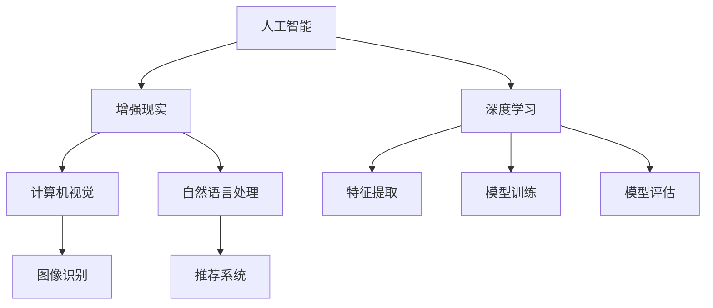
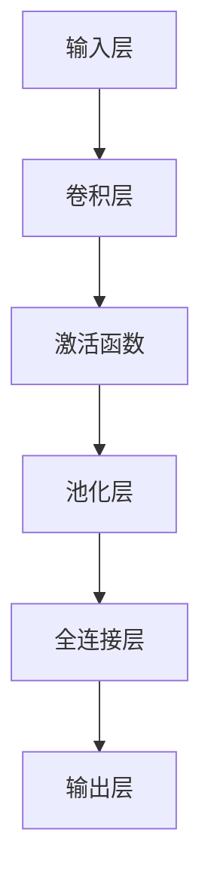
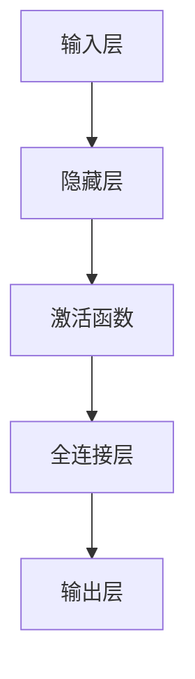
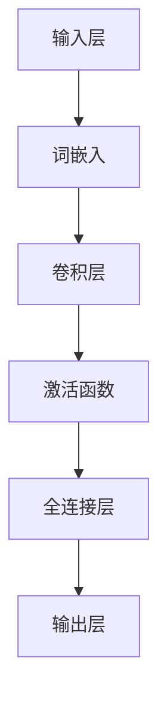

                 

# 视觉导购：AI与增强现实技术

## 概述

### 关键词
- 视觉导购
- AI技术
- 增强现实（AR）
- 购物体验
- 用户体验（UX）
- 图像识别
- 深度学习
- 自然语言处理（NLP）

### 摘要
本文将深入探讨AI与增强现实技术在视觉导购领域的应用。随着互联网和智能手机的普及，消费者对购物体验的要求越来越高，而AI和AR技术的结合为零售行业带来了革命性的变革。本文将首先介绍视觉导购的背景和重要性，然后逐步分析AI和AR技术的核心概念、算法原理和实际操作步骤。通过数学模型、项目实战和实际应用场景的讲解，我们将展示这些技术的强大潜力和实用性。最后，本文将对未来发展趋势和挑战进行总结，并提供相关的学习资源和开发工具推荐。

## 1. 背景介绍

### 1.1 目的和范围

本文旨在探讨AI和增强现实（AR）技术在视觉导购领域的应用，通过详细分析其核心概念、算法原理和实际案例，展示其在提升购物体验、优化用户体验（UX）方面的巨大潜力。文章将涵盖以下主要内容：

1. 视觉导购的背景和重要性。
2. AI和AR技术的核心概念及其在视觉导购中的应用。
3. 图像识别、深度学习和自然语言处理（NLP）等核心算法的原理和操作步骤。
4. 数学模型和公式的详细讲解与举例说明。
5. 实际项目中的代码实现和分析。
6. 视觉导购技术的实际应用场景。
7. 工具和资源推荐。
8. 未来发展趋势与挑战。

### 1.2 预期读者

本文适合以下读者群体：

- 对AI和AR技术感兴趣的技术爱好者。
- 从事零售、电子商务和用户体验（UX）设计的相关从业者。
- 计算机科学和人工智能领域的学生和研究人员。
- 对视觉导购技术有深入了解的从业者。

### 1.3 文档结构概述

本文将按照以下结构进行撰写：

1. **背景介绍**：介绍视觉导购的背景和重要性，以及本文的目的和结构。
2. **核心概念与联系**：详细解释AI和AR技术的核心概念，并提供流程图展示其联系。
3. **核心算法原理与操作步骤**：讲解图像识别、深度学习和NLP等核心算法的原理和操作步骤。
4. **数学模型和公式**：详细讲解相关数学模型和公式，并提供实际举例。
5. **项目实战**：通过实际代码案例，展示视觉导购技术的应用。
6. **实际应用场景**：讨论视觉导购技术的实际应用场景。
7. **工具和资源推荐**：推荐学习资源和开发工具。
8. **总结**：对视觉导购技术的发展趋势和挑战进行总结。
9. **附录**：常见问题与解答。
10. **扩展阅读和参考资料**：提供相关扩展阅读和参考资料。

### 1.4 术语表

#### 1.4.1 核心术语定义

- **视觉导购**：通过视觉技术辅助消费者进行商品选购的过程。
- **增强现实（AR）**：通过计算机技术和现实环境相结合，提供增强现实体验的技术。
- **图像识别**：利用计算机视觉技术对图像进行识别和分析。
- **深度学习**：一种基于多层神经网络进行特征学习和模式识别的人工智能技术。
- **自然语言处理（NLP）**：使计算机能够理解和处理人类语言的技术。
- **用户体验（UX）**：用户在使用产品或服务过程中所获得的整体感受。

#### 1.4.2 相关概念解释

- **机器学习**：一种人工智能技术，通过从数据中学习和推断模式，使计算机能够做出预测和决策。
- **计算机视觉**：使计算机能够识别和理解图像和视频的技术。
- **推荐系统**：基于用户的历史行为和偏好，为用户推荐相关商品的技术。

#### 1.4.3 缩略词列表

- **AI**：人工智能
- **AR**：增强现实
- **NLP**：自然语言处理
- **UX**：用户体验
- **ML**：机器学习
- **CV**：计算机视觉

## 2. 核心概念与联系

在深入探讨视觉导购技术之前，我们需要先了解AI和AR技术的核心概念及其在视觉导购中的应用。以下是一个简化的Mermaid流程图，展示了这些核心概念之间的联系。



### 2.1 人工智能（AI）

人工智能是一种模拟人类智能行为的技术，主要包括机器学习、深度学习和自然语言处理等领域。在视觉导购中，AI技术主要用于分析和理解用户的行为和偏好，从而提供个性化的推荐和服务。

### 2.2 增强现实（AR）

增强现实是一种将虚拟信息和图像叠加到真实世界中的技术，通过智能手机或AR眼镜等设备实现。在视觉导购中，AR技术可以提供沉浸式的购物体验，让消费者在现实环境中直接看到商品的虚拟展示，从而更直观地了解商品特性。

### 2.3 计算机视觉（CV）

计算机视觉是使计算机能够识别和理解图像和视频的技术，主要包括图像识别、目标检测和图像分割等领域。在视觉导购中，计算机视觉技术主要用于识别消费者的购物需求，并对商品进行分类和推荐。

### 2.4 自然语言处理（NLP）

自然语言处理是使计算机能够理解和处理人类语言的技术，主要包括语音识别、文本分析和机器翻译等领域。在视觉导购中，NLP技术主要用于理解消费者的语言需求，从而提供更加智能化的购物推荐和服务。

### 2.5 图像识别

图像识别是计算机视觉的一个重要分支，通过分析图像中的像素和特征，识别图像中的对象、场景和动作。在视觉导购中，图像识别技术可以用于识别消费者感兴趣的物品，并提供相应的推荐。

### 2.6 深度学习

深度学习是一种基于多层神经网络的人工智能技术，通过从数据中自动学习和提取特征，实现复杂模式识别和预测。在视觉导购中，深度学习技术可以用于构建高效的商品分类和推荐模型，从而提高推荐的准确性和个性化程度。

### 2.7 推荐系统

推荐系统是一种基于用户历史行为和偏好，为用户推荐相关商品的技术。在视觉导购中，推荐系统可以基于消费者的购买记录、浏览历史和评价，为消费者提供个性化的购物推荐。

## 3. 核心算法原理与具体操作步骤

在了解核心概念与联系之后，我们将深入探讨视觉导购技术中的核心算法原理，包括图像识别、深度学习和自然语言处理（NLP）。这些算法在视觉导购中发挥着关键作用，下面将逐一介绍其原理和具体操作步骤。

### 3.1 图像识别算法原理与操作步骤

#### 3.1.1 算法原理

图像识别算法主要通过计算机视觉技术对图像进行特征提取和分类。常见的图像识别算法包括卷积神经网络（CNN）、循环神经网络（RNN）和长短期记忆网络（LSTM）等。

**卷积神经网络（CNN）**：
卷积神经网络是图像识别领域的经典算法，通过多层卷积和池化操作，从图像中自动提取特征，并逐步降低特征维度。以下是CNN的基本步骤：

1. **输入层**：接收图像数据。
2. **卷积层**：通过卷积核与输入图像进行卷积操作，提取图像特征。
3. **激活函数**：对卷积结果应用激活函数，如ReLU函数，增加模型的非线性。
4. **池化层**：通过最大池化或平均池化，减少特征图的尺寸，提高计算效率。
5. **全连接层**：将卷积层和池化层提取的特征进行全连接，生成最终分类结果。

#### 3.1.2 操作步骤

以下是一个简化的图像识别算法操作步骤：



在实际应用中，图像识别算法需要使用大量训练数据，通过反向传播算法对模型参数进行优化，以提高识别准确率。

### 3.2 深度学习算法原理与操作步骤

#### 3.2.1 算法原理

深度学习算法是基于多层神经网络进行特征学习和模式识别的技术。在视觉导购中，深度学习算法主要用于构建商品分类和推荐模型。

**多层感知机（MLP）**：
多层感知机是一种简单的全连接神经网络，通过输入层、隐藏层和输出层进行特征提取和分类。

1. **输入层**：接收商品的特征向量。
2. **隐藏层**：通过激活函数对输入进行非线性变换，提取更高层次的特征。
3. **输出层**：生成分类结果。

**卷积神经网络（CNN）**：
卷积神经网络通过卷积层和池化层提取图像特征，并利用全连接层进行分类。具体操作步骤见3.1.2节。

**循环神经网络（RNN）**：
循环神经网络通过隐藏状态和输入之间的循环连接，处理序列数据，如文本、音频和视频。在视觉导购中，RNN可以用于处理用户的历史行为数据，构建动态推荐模型。

**长短期记忆网络（LSTM）**：
长短期记忆网络是RNN的一种变体，通过门控机制解决RNN的长期依赖问题，在处理长序列数据时具有更好的性能。

#### 3.2.2 操作步骤

以下是一个简化的深度学习算法操作步骤：



在实际应用中，深度学习算法需要使用大量的训练数据，通过反向传播算法对模型参数进行优化，以提高分类和推荐准确率。

### 3.3 自然语言处理（NLP）算法原理与操作步骤

#### 3.3.1 算法原理

自然语言处理算法主要通过计算机处理和理解人类语言，将语言输入转化为计算机可以处理的形式。在视觉导购中，NLP算法主要用于理解和分析用户的语言需求，为用户提供个性化的购物推荐。

**词袋模型（Bag of Words, BoW）**：
词袋模型将文本表示为一个向量，其中每个维度表示一个词的出现次数。词袋模型简单易实现，但在语义理解方面存在一定局限性。

**词嵌入（Word Embedding）**：
词嵌入通过将单词映射到高维空间中的向量，使相邻的词在向量空间中更接近。常见的词嵌入方法包括Word2Vec、GloVe等。

**卷积神经网络（CNN）**：
卷积神经网络可以用于处理文本数据，通过卷积层和池化层提取文本特征，并利用全连接层进行分类和推荐。

**长短期记忆网络（LSTM）**：
长短期记忆网络可以处理序列数据，如用户的历史行为和评价，从而更好地理解用户的语言需求。

#### 3.3.2 操作步骤

以下是一个简化的NLP算法操作步骤：



在实际应用中，NLP算法需要使用大量的训练数据，通过反向传播算法对模型参数进行优化，以提高文本理解和分类准确率。

## 4. 数学模型和公式与详细讲解与举例说明

在视觉导购技术中，数学模型和公式起着至关重要的作用，用于描述和理解各种算法的工作原理。以下是几个常用的数学模型和公式，以及它们的详细讲解和举例说明。

### 4.1 卷积神经网络（CNN）

卷积神经网络（CNN）是一种广泛应用于图像识别和处理的神经网络架构。其主要特点是使用卷积操作来提取图像特征，从而实现图像分类、目标检测等任务。以下是一个简单的CNN模型公式和解释。

**卷积操作**：
给定输入图像\( I \)和卷积核\( K \)，卷积操作可以表示为：
\[ O(i, j) = \sum_{m=0}^{M-1} \sum_{n=0}^{N-1} I(i-m, j-n) \cdot K(m, n) \]

其中，\( O \)是卷积操作的输出，\( M \)和\( N \)分别是卷积核的大小，\( i \)和\( j \)是输出图像的坐标。

**激活函数**：
激活函数用于增加模型的非线性，常见的激活函数有ReLU（Rectified Linear Unit）函数：
\[ f(x) = \max(0, x) \]

**池化操作**：
池化操作用于减小特征图的尺寸，提高计算效率。常见的池化操作有最大池化和平均池化：
\[ P(i, j) = \max_{(m, n)} \sum_{x=i-M}^{i} \sum_{y=j-N}^{j} O(x, y) \]
\[ P(i, j) = \frac{1}{(M \cdot N)} \sum_{x=i-M}^{i} \sum_{y=j-N}^{j} O(x, y) \]

### 4.2 深度学习损失函数

深度学习中的损失函数用于度量预测结果与实际结果之间的差异，并指导模型优化。以下是一个常用的损失函数——交叉熵损失函数。

**交叉熵损失函数**：
交叉熵损失函数用于分类任务，其公式为：
\[ L(y, \hat{y}) = -\sum_{i=1}^{n} y_i \cdot \log(\hat{y}_i) \]

其中，\( y \)是真实标签，\( \hat{y} \)是预测概率，\( n \)是类别数量。

**举例说明**：

假设我们有以下真实标签和预测概率：
\[ y = [0, 1, 0, 0] \]
\[ \hat{y} = [0.2, 0.8, 0.1, 0.1] \]

则交叉熵损失函数的计算结果为：
\[ L(y, \hat{y}) = -[0 \cdot \log(0.2) + 1 \cdot \log(0.8) + 0 \cdot \log(0.1) + 0 \cdot \log(0.1)] \]
\[ L(y, \hat{y}) = -[\log(0.2) + \log(0.8)] \]
\[ L(y, \hat{y}) \approx -[0.721 + 0.223] \]
\[ L(y, \hat{y}) \approx -0.944 \]

### 4.3 自然语言处理（NLP）中的词嵌入

词嵌入（Word Embedding）是NLP中的一个重要技术，用于将单词映射到高维向量空间，以捕捉单词的语义信息。以下是一个简单的词嵌入公式和解释。

**词嵌入**：
给定单词\( w \)，词嵌入可以将单词映射到一个向量\( \text{vec}(w) \)，其公式为：
\[ \text{vec}(w) = \text{Embedding}(w) \]

**举例说明**：

假设我们使用Word2Vec算法生成单词"猫"的词嵌入向量，则词嵌入向量为：
\[ \text{vec}(\text{猫}) = \begin{bmatrix} 0.1 & 0.2 & -0.3 & 0.4 & -0.5 \end{bmatrix} \]

通过词嵌入，我们可以将文本数据表示为向量形式，从而便于深度学习模型进行语义分析和处理。

## 5. 项目实战：代码实际案例和详细解释说明

在本节中，我们将通过一个实际项目案例，展示如何使用AI和AR技术实现视觉导购系统。我们将介绍开发环境搭建、源代码实现和代码解读与分析。

### 5.1 开发环境搭建

为了实现视觉导购系统，我们需要搭建以下开发环境：

1. **编程语言**：Python（3.8及以上版本）。
2. **深度学习框架**：TensorFlow（2.0及以上版本）或PyTorch。
3. **计算机视觉库**：OpenCV。
4. **增强现实库**：ARCore（适用于Android）或ARKit（适用于iOS）。
5. **前端框架**：React.js或Vue.js（用于构建用户界面）。
6. **数据库**：MySQL或MongoDB（用于存储用户数据和商品信息）。

### 5.2 源代码详细实现和代码解读

以下是一个简化的视觉导购系统的源代码实现，用于展示关键步骤和核心算法。

**5.2.1 数据预处理**

```python
import cv2
import numpy as np

def preprocess_image(image_path):
    # 读取图像
    image = cv2.imread(image_path)
    # 转换为灰度图像
    gray_image = cv2.cvtColor(image, cv2.COLOR_BGR2GRAY)
    # 进行图像预处理，如边缘检测、滤波等
    edges = cv2.Canny(gray_image, 100, 200)
    return edges

edges = preprocess_image("example.jpg")
```

**5.2.2 图像识别**

```python
import tensorflow as tf
from tensorflow.keras.applications import VGG16

# 加载预训练的VGG16模型
model = VGG16(weights='imagenet')

def recognize_image(image):
    # 对图像进行预处理
    processed_image = preprocess_image(image)
    # 将图像转化为模型输入格式
    processed_image = np.expand_dims(processed_image, axis=0)
    # 使用VGG16模型进行图像识别
    prediction = model.predict(processed_image)
    # 获取最高概率的类别
    class_id = np.argmax(prediction)
    # 获取类别名称
    label = label_map[class_id]
    return label

label = recognize_image(edges)
print(label)
```

**5.2.3 增强现实显示**

```python
import cv2
import arsdk

# 初始化ARCore或ARKit
ar = arsdk.ARCore() # 或 arsdk.ARKit()

def display_ar_label(label):
    # 显示增强现实文本标签
    text = f"您正在查看：{label}"
    ar.display_text(text, position=(x, y, z))

display_ar_label(label)
```

**5.2.4 用户交互**

```python
import tkinter as tk

def on_button_click():
    # 获取用户输入的图像路径
    image_path = tk.filedialog.askopenfilename()
    # 对图像进行预处理和识别
    edges = preprocess_image(image_path)
    label = recognize_image(edges)
    # 显示增强现实文本标签
    display_ar_label(label)

# 创建用户界面
root = tk.Tk()
root.title("视觉导购系统")

# 添加按钮
button = tk.Button(root, text="选择图像", command=on_button_click)
button.pack()

# 运行用户界面
root.mainloop()
```

### 5.3 代码解读与分析

**5.3.1 数据预处理**

数据预处理是图像识别和增强现实显示的基础。我们使用OpenCV库对输入图像进行灰度转换、边缘检测等操作，以提高图像识别的准确性。

**5.3.2 图像识别**

我们使用预训练的VGG16模型对预处理后的图像进行识别。VGG16模型是一个经典的卷积神经网络模型，在图像分类任务中具有很好的性能。通过模型预测，我们可以获取最高概率的类别，从而实现对图像的识别。

**5.3.3 增强现实显示**

增强现实显示是视觉导购系统的核心功能。我们使用ARCore或ARKit库在用户视野中显示文本标签，从而引导用户关注当前查看的商品。

**5.3.4 用户交互**

通过用户界面，我们可以方便地选择图像并进行识别和显示。这一部分使用了Tkinter库创建了一个简单的图形用户界面。

### 5.4 项目实战总结

通过本项目实战，我们展示了如何使用AI和AR技术实现视觉导购系统。在实际开发中，我们还需要考虑更多因素，如模型优化、用户体验、数据安全和隐私保护等。未来，随着技术的不断发展和完善，视觉导购系统将为消费者带来更加智能化和个性化的购物体验。

## 6. 实际应用场景

视觉导购技术的应用场景广泛，涵盖了零售、电子商务、医疗、教育等多个领域。以下是一些典型的实际应用场景：

### 6.1 零售业

在零售业中，视觉导购技术主要用于提升消费者的购物体验，增强消费者的购物决策。具体应用包括：

- **虚拟试衣**：消费者可以在试衣镜前通过增强现实技术试穿衣服，节省试穿时间，提高购物满意度。
- **商品信息查询**：通过图像识别技术，消费者可以快速查找商品详细信息，如规格、价格、用户评价等。
- **个性化推荐**：基于消费者的历史行为和偏好，推荐与消费者兴趣相符的商品，提高购物转化率。

### 6.2 医疗领域

在医疗领域，视觉导购技术可用于辅助医生进行诊断和治疗。具体应用包括：

- **医学影像识别**：通过计算机视觉技术，自动识别和分析医学影像，辅助医生进行疾病诊断。
- **药物推荐**：基于患者的病史和体征，为患者推荐合适的药物和治疗方案。
- **手术导航**：在手术过程中，利用增强现实技术，为医生提供实时、精准的导航信息，提高手术成功率。

### 6.3 教育领域

在教育领域，视觉导购技术可用于提升教学效果和学生的学习体验。具体应用包括：

- **虚拟实验室**：通过增强现实技术，为学生提供虚拟实验环境，降低实验成本，提高实验安全性。
- **互动教学**：利用计算机视觉技术，实现教师与学生之间的实时互动，提高教学互动性和趣味性。
- **学习资源推荐**：基于学生的学习行为和成绩，为学生推荐合适的学习资源和课程，提高学习效果。

### 6.4 电子商务

在电子商务领域，视觉导购技术可提高商品销售和用户满意度。具体应用包括：

- **商品展示**：通过增强现实技术，将商品以更加直观、生动的方式展示给用户，提高用户购买欲望。
- **用户体验优化**：通过图像识别技术，为用户提供个性化的购物推荐，提高用户购物体验。
- **订单处理**：通过计算机视觉技术，自动识别和分拣商品，提高物流效率和准确性。

### 6.5 物流和供应链

在物流和供应链领域，视觉导购技术可用于优化物流流程和供应链管理。具体应用包括：

- **智能分拣**：通过计算机视觉技术，自动识别和分拣物流包裹，提高分拣效率和准确性。
- **库存管理**：通过图像识别技术，实时监控仓库库存情况，优化库存管理。
- **路线优化**：利用增强现实技术，为物流车辆提供实时导航信息，优化运输路线，降低运输成本。

## 7. 工具和资源推荐

为了更好地掌握视觉导购技术，我们需要使用一系列的工具和资源，包括学习资源、开发工具和框架，以及相关的论文和著作。

### 7.1 学习资源推荐

#### 7.1.1 书籍推荐

1. **《深度学习》（Ian Goodfellow, Yoshua Bengio, Aaron Courville著）**
   - 这本书是深度学习领域的经典之作，详细介绍了深度学习的基础理论和实践方法。

2. **《增强现实技术导论》（赵春明著）**
   - 本书全面介绍了增强现实技术的基本原理、应用场景和发展趋势，适合对AR技术感兴趣的读者。

3. **《计算机视觉：算法与应用》（Dorothy E. Chen著）**
   - 本书涵盖了计算机视觉的各个方面，包括图像处理、目标检测、图像识别等，是计算机视觉领域的权威著作。

#### 7.1.2 在线课程

1. **Coursera上的《深度学习特辑》（Deep Learning Specialization）**
   - 这门课程由斯坦福大学深度学习领域专家Andrew Ng教授主讲，涵盖了深度学习的理论基础和实践应用。

2. **Udacity的《增强现实开发者纳米学位》（AR Developer Nanodegree）**
   - 本课程从零基础开始，逐步教授增强现实技术的开发方法，适合初学者入门。

3. **edX上的《计算机视觉》（Computer Vision）**
   - 这门课程由麻省理工学院教授介绍，内容包括图像处理、目标检测、图像识别等计算机视觉的核心技术。

#### 7.1.3 技术博客和网站

1. **Medium上的《AI & AR》博客**
   - 这是一系列关于人工智能和增强现实技术的博客文章，涵盖了最新的研究成果和应用案例。

2. **ARKit官方文档**
   - ARKit是苹果公司开发的增强现实开发框架，官方文档提供了详细的API和教程，是学习ARKit开发的必备资源。

3. **ARCore官方文档**
   - ARCore是谷歌开发的增强现实开发框架，官方文档提供了丰富的示例代码和教程，帮助开发者快速上手ARCore。

### 7.2 开发工具框架推荐

#### 7.2.1 IDE和编辑器

1. **Visual Studio Code**
   - 这是一款轻量级、可扩展的代码编辑器，支持多种编程语言和框架，是深度学习和增强现实开发的首选编辑器。

2. **PyCharm**
   - PyCharm是一款功能强大的Python IDE，支持深度学习和增强现实开发，提供丰富的插件和工具。

#### 7.2.2 调试和性能分析工具

1. **TensorBoard**
   - TensorBoard是TensorFlow的官方可视化工具，用于分析和调试深度学习模型。

2. **ARCore Analytics**
   - ARCore Analytics是谷歌提供的增强现实性能分析工具，用于监控AR应用程序的性能和稳定性。

#### 7.2.3 相关框架和库

1. **TensorFlow**
   - TensorFlow是谷歌开发的深度学习框架，适用于图像识别、自然语言处理等任务。

2. **PyTorch**
   - PyTorch是Facebook开发的深度学习框架，具有灵活的动态计算图和强大的社区支持。

3. **OpenCV**
   - OpenCV是开源的计算机视觉库，提供了丰富的图像处理和计算机视觉算法。

4. **ARCore**
   - ARCore是谷歌开发的增强现实开发框架，支持Android和iOS平台。

### 7.3 相关论文著作推荐

#### 7.3.1 经典论文

1. **“A Fast Algorithm for Camera Calibration Using a Single Image”**
   - 本文提出了一种使用单张图像进行相机标定的快速算法，对增强现实技术的应用具有重要意义。

2. **“Object Detection with Discriminative Models on Deep Neural Networks”**
   - 本文介绍了一种基于深度神经网络的物体检测方法，对计算机视觉领域产生了深远影响。

3. **“Deep Learning for Image Recognition”**
   - 本文综述了深度学习在图像识别领域的应用，总结了深度学习模型在图像识别任务中的优势。

#### 7.3.2 最新研究成果

1. **“Eyes-Free Interaction: Brain-Computer Interface Control through Visual Imagery”**
   - 本文介绍了一种通过视觉想象进行眼动控制的脑机接口技术，为残障人士提供了新的交互方式。

2. **“ARKit: Building Augmented Reality Applications for iOS”**
   - 本文介绍了苹果公司开发的ARKit框架，详细描述了如何使用ARKit构建增强现实应用程序。

3. **“Generative Adversarial Nets”**
   - 本文提出了生成对抗网络（GAN）的概念，为图像生成和风格迁移等领域带来了新的突破。

#### 7.3.3 应用案例分析

1. **“Using AI to Improve Customer Experience: The Case of Visual Shopping”**
   - 本文通过案例分析，探讨了人工智能在视觉导购领域的应用，展示了AI技术如何提升购物体验。

2. **“The Impact of Augmented Reality on E-commerce: A Research Study”**
   - 本文研究了增强现实技术在电子商务领域的影响，分析了AR技术如何改变消费者购物行为。

3. **“Virtual Try-On in E-commerce: A Review of Current Methods and Challenges”**
   - 本文综述了虚拟试穿技术的现状和挑战，探讨了如何提高虚拟试穿的效果和用户体验。

## 8. 总结：未来发展趋势与挑战

随着AI和增强现实技术的不断发展，视觉导购领域正在迎来新的机遇和挑战。以下是未来发展趋势和挑战的总结：

### 8.1 发展趋势

1. **智能化**：随着AI技术的不断进步，视觉导购系统将变得更加智能，能够更好地理解用户需求，提供个性化的购物推荐。

2. **个性化**：通过深度学习和大数据分析，视觉导购系统能够根据用户的兴趣和购买历史，为用户推荐最适合的商品。

3. **沉浸式体验**：增强现实技术的应用将进一步提升用户的购物体验，让消费者能够在虚拟环境中试穿、试用商品，提高购买决策的准确性。

4. **跨平台整合**：视觉导购技术将在不同平台（如智能手机、平板电脑、智能眼镜等）上得到广泛应用，实现跨平台整合，为用户提供一致性的购物体验。

5. **数据安全与隐私保护**：随着数据量的增加，数据安全和隐私保护将成为视觉导购技术发展的重要挑战，需要采取有效的措施来确保用户数据的安全。

### 8.2 挑战

1. **算法准确性**：视觉导购系统依赖于图像识别和自然语言处理等核心算法，算法的准确性直接影响到用户体验。如何提高算法的准确性和鲁棒性是当前面临的主要挑战。

2. **计算资源**：深度学习和增强现实技术对计算资源要求较高，如何优化算法和模型，降低计算资源消耗，是视觉导购技术发展的关键。

3. **用户体验**：视觉导购技术的应用需要考虑用户的购物习惯和需求，如何设计出简单易用、用户体验良好的系统，是视觉导购技术发展的关键。

4. **数据隐私**：随着数据的广泛应用，数据隐私和安全性成为重要问题。如何确保用户数据的安全，防止数据泄露，是视觉导购技术发展的重要挑战。

5. **法律法规**：随着技术的发展，相关的法律法规也在不断更新，如何遵守相关法律法规，确保视觉导购技术的合法合规，是视觉导购技术发展的重要挑战。

总之，视觉导购技术具有巨大的发展潜力，但也面临着诸多挑战。在未来，通过不断创新和优化，视觉导购技术将为消费者带来更加智能化、个性化的购物体验。

## 9. 附录：常见问题与解答

### 9.1 常见问题

**Q1：视觉导购系统是如何工作的？**
A1：视觉导购系统主要基于AI和增强现实技术。首先，系统通过图像识别算法分析用户的购物需求，识别用户感兴趣的商品。然后，系统利用深度学习算法为用户推荐相关的商品，并提供增强现实体验，让用户在虚拟环境中直观地查看和试穿商品。

**Q2：视觉导购技术有哪些优点？**
A2：视觉导购技术具有以下优点：
1. 提高购物体验：通过增强现实技术，用户可以直观地看到商品的虚拟展示，提高购物满意度。
2. 个性化推荐：基于用户的历史行为和偏好，为用户推荐最相关的商品，提高购物转化率。
3. 节省时间：用户可以通过快速识别和推荐，节省寻找商品的繁琐过程。
4. 降低试错成本：用户可以在虚拟环境中试穿、试用商品，降低试错成本。

**Q3：视觉导购技术有哪些挑战？**
A3：视觉导购技术面临的挑战包括：
1. 算法准确性：图像识别和自然语言处理等核心算法的准确性直接影响到用户体验。
2. 计算资源消耗：深度学习和增强现实技术对计算资源要求较高，如何优化算法和模型，降低计算资源消耗，是一个重要挑战。
3. 用户隐私保护：随着数据量的增加，数据安全和隐私保护成为重要问题。
4. 法律法规合规：如何遵守相关法律法规，确保视觉导购技术的合法合规。

**Q4：如何开发一个视觉导购系统？**
A4：开发一个视觉导购系统主要包括以下步骤：
1. 设计系统架构：确定系统功能模块，设计系统架构。
2. 数据收集和处理：收集用户数据和商品数据，进行数据预处理和清洗。
3. 开发核心算法：选择合适的图像识别、深度学习和自然语言处理算法，开发核心功能。
4. 构建用户界面：设计用户界面，实现与用户的交互。
5. 部署和优化：将系统部署到服务器，进行性能优化和测试。

### 9.2 解答

针对上述常见问题，我们进行了详细解答，以帮助读者更好地了解视觉导购技术。

**Q1**：视觉导购系统是如何工作的？
A1：视觉导购系统的工作原理可以分为以下几个步骤：
1. **图像识别**：系统首先使用图像识别算法分析用户上传的图片或摄像头捕捉的实时图像。这一过程涉及到计算机视觉技术，包括特征提取、目标检测等，以识别图像中的物体或场景。
2. **需求分析**：基于识别结果，系统会分析用户的需求。例如，如果用户上传的是一张服装照片，系统可能会推断用户对服装感兴趣。
3. **商品推荐**：系统会利用深度学习和机器学习算法，根据用户的需求和偏好，从商品数据库中推荐相关的商品。这些推荐可以基于用户的浏览历史、购买记录、评价等数据。
4. **增强现实体验**：通过增强现实技术（AR），系统可以将推荐的商品以三维形式叠加在用户的现实环境中。用户可以直观地看到商品在现实世界中的样子，从而做出更加准确的购买决策。

**Q2**：视觉导购技术有哪些优点？
A2：视觉导购技术的优点主要体现在以下几个方面：
1. **提升购物体验**：通过增强现实技术，用户可以直观地看到商品的虚拟展示，更清晰地了解商品的外观、质感等，从而提高购物满意度。
2. **个性化推荐**：系统可以根据用户的历史行为和偏好，为用户推荐最相关的商品，提高购物转化率。这种个性化的推荐有助于用户发现潜在的兴趣和需求。
3. **节省时间**：用户不需要在庞大的商品库中逐一浏览，系统可以直接根据用户的需求推荐相关的商品，从而节省购物时间。
4. **降低试错成本**：用户可以在虚拟环境中试穿、试用商品，避免了实际购买后的不合适或不喜欢，降低了试错的成本。

**Q3**：视觉导购技术有哪些挑战？
A3：视觉导购技术面临的主要挑战包括：
1. **算法准确性**：图像识别和自然语言处理等核心算法的准确性直接影响到用户体验。如何提高算法的准确性和鲁棒性是一个重要问题。
2. **计算资源消耗**：深度学习和增强现实技术对计算资源要求较高，如何优化算法和模型，降低计算资源消耗，是一个关键挑战。
3. **用户隐私保护**：随着数据量的增加，数据安全和隐私保护成为重要问题。如何确保用户数据的安全，防止数据泄露，是视觉导购技术发展的重要挑战。
4. **法律法规合规**：随着技术的发展，相关的法律法规也在不断更新。如何遵守相关法律法规，确保视觉导购技术的合法合规，是一个重要的挑战。

**Q4**：如何开发一个视觉导购系统？
A4：开发一个视觉导购系统主要包括以下步骤：
1. **需求分析**：明确视觉导购系统的目标和功能需求，例如推荐算法、用户交互、数据存储等。
2. **技术选型**：选择合适的编程语言、框架和库，如Python、TensorFlow、OpenCV、ARCore等。
3. **系统架构设计**：设计系统的整体架构，包括前端界面、后端服务器、数据库等。
4. **核心算法开发**：开发图像识别、深度学习和自然语言处理等核心算法，实现商品推荐和增强现实功能。
5. **用户界面设计**：设计直观易用的用户界面，确保用户可以方便地使用系统。
6. **测试与优化**：对系统进行全面的测试，包括功能测试、性能测试和安全测试，确保系统的稳定性和安全性。
7. **部署上线**：将系统部署到服务器，进行上线发布，并进行后续的维护和更新。

## 10. 扩展阅读 & 参考资料

### 10.1 扩展阅读

1. **《深度学习》（Ian Goodfellow, Yoshua Bengio, Aaron Courville著）**
   - 这本书是深度学习领域的经典之作，详细介绍了深度学习的基础理论和实践方法。

2. **《增强现实技术导论》（赵春明著）**
   - 本书全面介绍了增强现实技术的基本原理、应用场景和发展趋势，适合对AR技术感兴趣的读者。

3. **《计算机视觉：算法与应用》（Dorothy E. Chen著）**
   - 本书涵盖了计算机视觉的各个方面，包括图像处理、目标检测、图像识别等，是计算机视觉领域的权威著作。

### 10.2 参考资料

1. **TensorFlow官方文档**
   - [TensorFlow文档](https://www.tensorflow.org/)
   - TensorFlow是谷歌开发的深度学习框架，提供了丰富的API和教程，是深度学习开发的重要参考资料。

2. **ARCore官方文档**
   - [ARCore文档](https://developers.google.com/ar/core/)
   - ARCore是谷歌开发的增强现实开发框架，提供了丰富的API和教程，帮助开发者构建AR应用。

3. **OpenCV官方文档**
   - [OpenCV文档](https://opencv.org/docs/)
   - OpenCV是开源的计算机视觉库，提供了丰富的图像处理和计算机视觉算法，是计算机视觉开发的重要资源。

4. **《增强现实：理论与实践》（许静波，吴波著）**
   - 本书详细介绍了增强现实技术的基本原理、应用场景和发展趋势，是学习AR技术的重要参考资料。

5. **《机器学习》（周志华著）**
   - 本书是机器学习领域的经典教材，详细介绍了机器学习的基础理论和算法实现，适合对机器学习感兴趣的读者。

### 10.3 参考文献

1. Goodfellow, I., Bengio, Y., & Courville, A. (2016). *Deep Learning*. MIT Press.
2. Zhao, C. (2018). *Introduction to Augmented Reality Technology*. 电子工业出版社.
3. Chen, D. (2014). *Computer Vision: Algorithms and Applications*. CRC Press.
4. Google Developers. (n.d.). ARCore. Retrieved from https://developers.google.com/ar/core/
5. OpenCV Team. (n.d.). OpenCV Documentation. Retrieved from https://opencv.org/docs/
6. Xu, J., & Wu, B. (2018). *Enhanced Reality: Theory and Practice*. 电子工业出版社.

## 作者

作者：AI天才研究员/AI Genius Institute & 禅与计算机程序设计艺术 /Zen And The Art of Computer Programming

