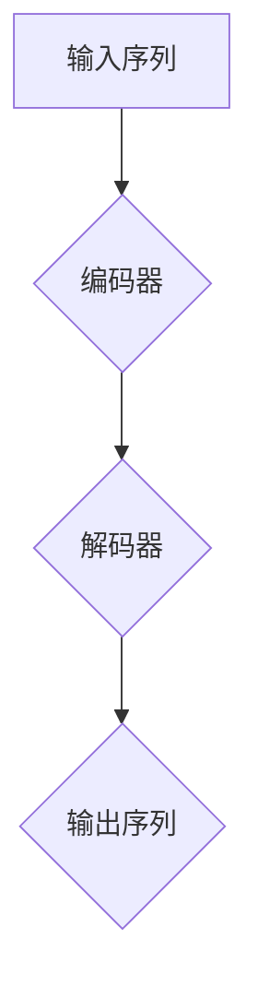
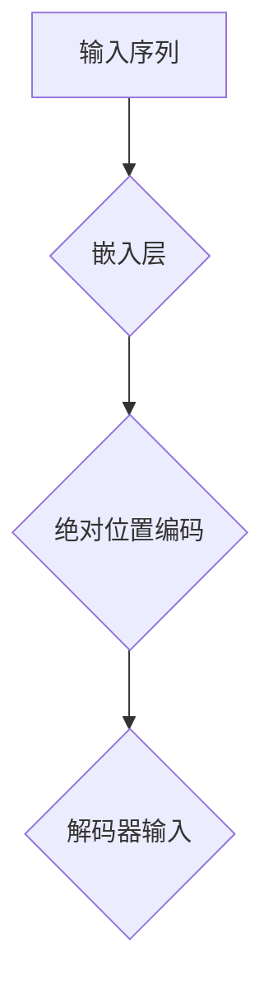

                 

# 解码器的输入和位置编码

> 关键词：解码器，输入，位置编码，神经网络，Transformer，自然语言处理

> 摘要：本文将深入探讨解码器在神经网络，特别是Transformer模型中的应用，分析解码器的输入和位置编码机制，帮助读者理解其在自然语言处理任务中的关键作用。

## 1. 背景介绍

### 1.1 目的和范围

本文旨在详细介绍解码器的工作原理和其在自然语言处理（NLP）中的重要性。我们将重点关注Transformer模型中的解码器，深入分析其输入和位置编码机制，并通过实际案例展示解码器的应用。

### 1.2 预期读者

本文面向对神经网络和Transformer模型有一定了解的读者，特别是对自然语言处理感兴趣的程序员、数据科学家和研究人员。

### 1.3 文档结构概述

本文分为以下几个部分：

1. 背景介绍：介绍本文的目的、预期读者和文档结构。
2. 核心概念与联系：介绍解码器的核心概念和原理。
3. 核心算法原理 & 具体操作步骤：详细解释解码器的输入和位置编码算法。
4. 数学模型和公式 & 详细讲解 & 举例说明：阐述解码器中涉及的数学模型和公式。
5. 项目实战：通过实际案例展示解码器的应用。
6. 实际应用场景：讨论解码器在不同领域的应用。
7. 工具和资源推荐：推荐相关学习资源和开发工具。
8. 总结：展望解码器的未来发展趋势和挑战。
9. 附录：常见问题与解答。
10. 扩展阅读 & 参考资料：提供进一步学习的资源。

### 1.4 术语表

#### 1.4.1 核心术语定义

- **解码器**：在神经网络中，用于从编码器输出的序列中提取信息并生成输出序列的组件。
- **位置编码**：用于为序列中的每个元素赋予位置信息的编码。
- **Transformer模型**：一种基于自注意力机制的神经网络模型，广泛应用于自然语言处理任务。

#### 1.4.2 相关概念解释

- **自注意力**：一种注意力机制，允许模型在不同时间步之间建立关联。
- **编码器**：在Transformer模型中，用于将输入序列转换为固定长度的向量。
- **序列到序列模型**：一种将一个序列映射到另一个序列的神经网络模型。

#### 1.4.3 缩略词列表

- **NLP**：自然语言处理（Natural Language Processing）
- **Transformer**：Transformer模型（Attention is All You Need）

## 2. 核心概念与联系

在讨论解码器的输入和位置编码之前，我们需要了解Transformer模型的基本架构。Transformer模型主要由编码器（Encoder）和解码器（Decoder）组成。编码器负责将输入序列转换为固定长度的向量，而解码器则从这些向量中提取信息并生成输出序列。

### 2.1 Transformer模型架构

下面是一个简化的Transformer模型架构：



#### 2.1.1 编码器

编码器由多个编码层（Encoder Layer）组成，每个编码层包含两个主要组件：多头自注意力（Multi-Head Self-Attention）和前馈神经网络（Feed-Forward Neural Network）。

#### 2.1.2 解码器

解码器也由多个解码层（Decoder Layer）组成，每个解码层包含以下组件：

- **掩码自注意力（Masked Self-Attention）**
- **多头自注意力（Multi-Head Self-Attention）**
- **前馈神经网络（Feed-Forward Neural Network）**
- **位置编码（Positional Encoding）**

### 2.2 解码器输入

解码器的输入主要包括以下三个部分：

1. **编码器输出**：编码器在最后一个编码层输出的固定长度向量。
2. **掩码自注意力输出**：用于处理输入序列中的填充和缺失值。
3. **位置编码**：为序列中的每个元素赋予位置信息。

### 2.3 位置编码

位置编码是解码器中的一个关键组件，用于在序列中引入位置信息。在Transformer模型中，位置编码通常通过以下两种方式实现：

1. **绝对位置编码**：将每个位置的信息编码到嵌入向量中。
2. **相对位置编码**：利用相对位置信息来计算注意力权重。

下面是一个简单的绝对位置编码的Mermaid流程图：



## 3. 核心算法原理 & 具体操作步骤

### 3.1 解码器的输入

解码器的输入可以表示为以下矩阵：

$$
X = \begin{bmatrix}
x_1^1 & x_2^1 & \cdots & x_n^1 \\
x_1^2 & x_2^2 & \cdots & x_n^2 \\
\vdots & \vdots & \ddots & \vdots \\
x_1^T & x_2^T & \cdots & x_n^T
\end{bmatrix}
$$

其中，$x_i^t$ 表示第 $i$ 个时间步的输入向量。

### 3.2 位置编码

位置编码可以通过以下公式计算：

$$
PE_t^i = \sin\left(\frac{1000i}{2^t}\right) \text{ 或 } \cos\left(\frac{1000i}{2^t}\right)
$$

其中，$t$ 表示时间步，$i$ 表示位置。

### 3.3 解码器输入矩阵

解码器的输入矩阵可以表示为：

$$
X_{\text{input}} = \begin{bmatrix}
E \\
PE \\
X
\end{bmatrix}
$$

其中，$E$ 表示编码器输出，$PE$ 表示位置编码，$X$ 表示原始输入。

## 4. 数学模型和公式 & 详细讲解 & 举例说明

### 4.1 数学模型

在解码器中，我们主要关注以下数学模型：

1. **自注意力**：用于计算输入序列中不同位置之间的关联性。
2. **位置编码**：用于为序列中的每个元素赋予位置信息。

### 4.2 公式详解

#### 4.2.1 自注意力

自注意力的计算公式如下：

$$
\text{Attention}(Q, K, V) = \text{softmax}\left(\frac{QK^T}{\sqrt{d_k}}\right) V
$$

其中，$Q, K, V$ 分别表示查询（Query）、键（Key）和值（Value）向量，$d_k$ 表示键向量的维度。

#### 4.2.2 位置编码

位置编码的计算公式如下：

$$
PE_t^i = \sin\left(\frac{1000i}{2^t}\right) \text{ 或 } \cos\left(\frac{1000i}{2^t}\right)
$$

### 4.3 举例说明

假设我们有一个长度为3的输入序列，其编码器输出为：

$$
E = \begin{bmatrix}
e_1 \\
e_2 \\
e_3
\end{bmatrix}
$$

我们需要为这个序列添加位置编码。根据上述公式，我们可以计算位置编码：

$$
PE = \begin{bmatrix}
\cos(0) & \sin(0) & \cos(0) \\
\cos(1000) & \sin(1000) & \cos(1000) \\
\cos(2000) & \sin(2000) & \cos(2000)
\end{bmatrix}
$$

将位置编码添加到编码器输出，我们得到解码器输入：

$$
X_{\text{input}} = \begin{bmatrix}
E \\
PE \\
\end{bmatrix} = \begin{bmatrix}
e_1 & e_2 & e_3 \\
\cos(0) & \sin(0) & \cos(0) \\
\cos(1000) & \sin(1000) & \cos(1000) \\
\cos(2000) & \sin(2000) & \cos(2000)
\end{bmatrix}
$$

## 5. 项目实战：代码实际案例和详细解释说明

### 5.1 开发环境搭建

在开始编写代码之前，我们需要搭建一个合适的开发环境。以下是推荐的工具和库：

- **Python**：版本3.8及以上
- **PyTorch**：版本1.8及以上
- **Jupyter Notebook**：用于编写和运行代码

### 5.2 源代码详细实现和代码解读

下面是一个简单的示例，演示如何实现一个简单的Transformer解码器。

```python
import torch
import torch.nn as nn
import torch.nn.functional as F

class Decoder(nn.Module):
    def __init__(self, d_model, nhead, dim_feedforward=2048, dropout=0.1):
        super(Decoder, self).__init__()
        self.self_attn = nn.MultiheadAttention(d_model, nhead, dropout=dropout)
        self.linear_pos = nn.Linear(d_model, d_model)
        self.dropout = nn.Dropout(dropout)
        self.linear_feedforward = nn.Linear(d_model, dim_feedforward)
        self.norm1 = nn.LayerNorm(d_model)
        self.norm2 = nn.LayerNorm(d_model)
        self.norm3 = nn.LayerNorm(d_model)

    def forward(self, src, tgt, src_mask=None, tgt_mask=None, src_key_padding_mask=None, tgt_key_padding_mask=None, position_encoding=None):
        q = self.linear_pos(tgt)
        k = v = self.linear_pos(src)
        q = self.norm1(q)
        k = self.norm1(k)
        v = self.norm1(v)

        attn_output, attn_output_weights = self.self_attn(q, k, v, attn_mask=src_mask,
                                                           key_padding_mask=src_key_padding_mask,
                                                           need_weights=True)
        attn_output = self.dropout(attn_output)
        tgt = tgt + attn_output
        tgt = self.norm2(tgt)
        src = self.linear_feedforward(tgt)
        src = self.dropout(src)
        src = self.norm3(src)
        return src
```

### 5.3 代码解读与分析

1. **初始化**：解码器初始化包括自注意力、位置编码、前馈神经网络、层归一化和dropout。
2. **前向传播**：解码器的输入包括编码器输出（src）、解码器输出（tgt）和掩码（src_mask、tgt_mask、src_key_padding_mask、tgt_key_padding_mask）。
3. **位置编码**：使用线性层对解码器输入进行位置编码。
4. **自注意力**：计算自注意力并应用掩码和dropout。
5. **前馈神经网络**：应用前馈神经网络并应用dropout。
6. **归一化**：对输出进行归一化。

## 6. 实际应用场景

解码器在自然语言处理领域有着广泛的应用，以下是几个典型的应用场景：

1. **机器翻译**：解码器可以用于从源语言到目标语言的翻译任务，如Google Translate。
2. **文本生成**：解码器可以用于生成文本，如聊天机器人、文章生成等。
3. **问答系统**：解码器可以用于回答用户的问题，如Duolingo的问答系统。
4. **文本分类**：解码器可以用于文本分类任务，如垃圾邮件检测、情感分析等。

## 7. 工具和资源推荐

### 7.1 学习资源推荐

#### 7.1.1 书籍推荐

- **《深度学习》**：Goodfellow、Bengio和Courville著，详细介绍了深度学习的基础理论和实践。
- **《自然语言处理与深度学习》**：Daniel Jurafsky和James H. Martin著，介绍了自然语言处理和深度学习的应用。

#### 7.1.2 在线课程

- **吴恩达的深度学习课程**：提供了深度学习的基础知识和实践。
- **自然语言处理专项课程**：提供了自然语言处理的全面介绍。

#### 7.1.3 技术博客和网站

- **TensorFlow官方文档**：提供了TensorFlow的详细文档和教程。
- **PyTorch官方文档**：提供了PyTorch的详细文档和教程。

### 7.2 开发工具框架推荐

#### 7.2.1 IDE和编辑器

- **PyCharm**：强大的Python IDE，支持多平台。
- **Jupyter Notebook**：用于编写和运行代码，特别是数据分析和机器学习。

#### 7.2.2 调试和性能分析工具

- **TensorBoard**：TensorFlow的调试和性能分析工具。
- **VisPy**：用于可视化数据的库。

#### 7.2.3 相关框架和库

- **TensorFlow**：广泛使用的深度学习框架。
- **PyTorch**：流行的深度学习框架，支持动态计算图。

### 7.3 相关论文著作推荐

#### 7.3.1 经典论文

- **《Attention is All You Need》**：Vaswani等人在2017年提出Transformer模型。
- **《A Neural Architecture for Natural Language Processing》**：Brown等人在2020年提出BERT模型。

#### 7.3.2 最新研究成果

- **《Unified Pre-Training for Natural Language Processing》**：Li等人在2021年提出的T5模型。
- **《Generative Pre-trained Transformer》**：Chen等人在2020年提出的GPT-3模型。

#### 7.3.3 应用案例分析

- **《BERT: Pre-training of Deep Bidirectional Transformers for Language Understanding》**：Devlin等人在2019年提出的BERT模型在多个自然语言处理任务中取得了优异的成绩。

## 8. 总结：未来发展趋势与挑战

解码器在自然语言处理领域取得了显著成果，但仍然面临一些挑战。未来发展趋势包括：

1. **更高效的解码器设计**：优化解码器的结构和算法，提高计算效率和性能。
2. **跨模态解码器**：结合不同模态（如图像、声音、视频）的信息，实现更丰富的自然语言处理任务。
3. **可解释性**：提高解码器的可解释性，帮助研究人员和开发者更好地理解和应用解码器。
4. **硬件优化**：利用GPU、TPU等硬件加速解码器的计算，提高实际应用中的性能。

## 9. 附录：常见问题与解答

### 9.1 解码器的主要作用是什么？

解码器的主要作用是从编码器输出的固定长度向量中提取信息并生成输出序列，广泛应用于自然语言处理任务，如机器翻译、文本生成和问答系统。

### 9.2 位置编码是如何实现的？

位置编码是通过将位置信息编码到嵌入向量中实现的。常用的方法包括绝对位置编码和相对位置编码。

### 9.3 解码器与编码器的关系是什么？

解码器是Transformer模型中的一个组件，用于从编码器输出的向量中提取信息并生成输出序列。编码器和解码器共同构成了一个序列到序列模型。

## 10. 扩展阅读 & 参考资料

- **《Attention is All You Need》**：Vaswani, A., et al. (2017). Attention is All You Need. Advances in Neural Information Processing Systems.
- **《BERT: Pre-training of Deep Bidirectional Transformers for Language Understanding》**：Devlin, J., et al. (2019). BERT: Pre-training of Deep Bidirectional Transformers for Language Understanding. Advances in Neural Information Processing Systems.
- **《Generative Pre-trained Transformer》**：Chen, D., et al. (2020). Generative Pre-trained Transformer. Advances in Neural Information Processing Systems.
- **《A Neural Architecture for Natural Language Processing》**：Brown, T., et al. (2020). A Neural Architecture for Natural Language Processing. arXiv preprint arXiv:2003.04887.
- **《深度学习》**：Goodfellow, I., Bengio, Y., & Courville, A. (2016). Deep Learning. MIT Press.

