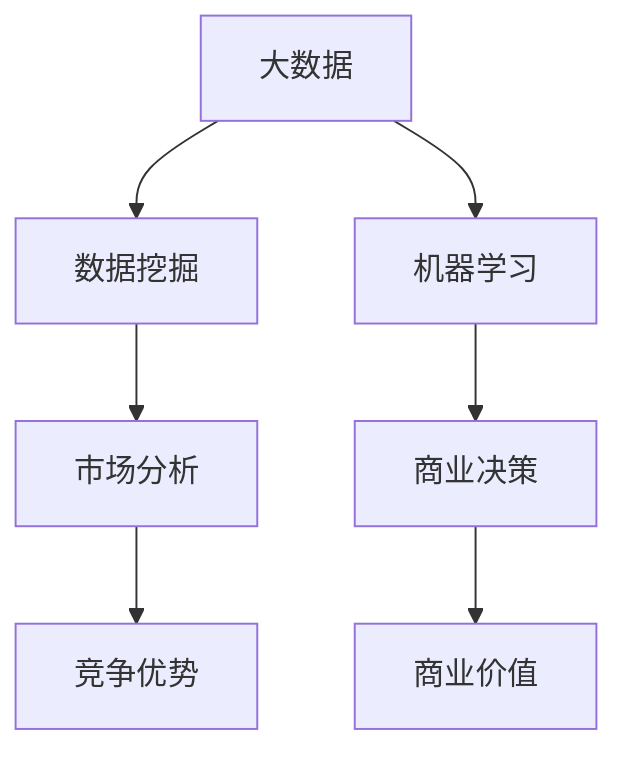

                 

# 解锁信息差的商业价值：大数据驱动的竞争优势

> **关键词：** 信息差、商业价值、大数据、竞争优势、商业战略、数据挖掘、机器学习、市场分析、市场营销

> **摘要：** 本文深入探讨了信息差在商业决策中的重要性，以及如何通过大数据分析来挖掘和利用信息差，从而构建企业竞争优势。我们将从背景介绍、核心概念、算法原理、数学模型、项目实战、实际应用场景等多个角度，详细分析大数据在商业决策中的关键作用。

## 1. 背景介绍

### 1.1 目的和范围

本文旨在探讨信息差在商业世界中的重要性，以及如何通过大数据分析来构建企业的竞争优势。我们将关注以下几个方面：

- **信息差的定义**：解释信息差的概念及其在商业决策中的作用。
- **大数据的重要性**：探讨大数据在现代商业环境中的关键作用。
- **商业价值挖掘**：分析如何通过大数据分析来挖掘信息差，为商业决策提供支持。
- **案例研究**：通过实际案例，展示大数据分析在商业决策中的应用。

### 1.2 预期读者

本文适合以下读者：

- **商业分析师**：希望了解大数据分析在商业决策中的应用。
- **数据科学家**：希望深入了解大数据挖掘和机器学习的商业应用。
- **企业家**：希望了解如何利用大数据分析来构建企业竞争优势。
- **技术爱好者**：对大数据和机器学习有浓厚兴趣，希望了解其在商业领域的应用。

### 1.3 文档结构概述

本文将分为以下几个部分：

- **第1部分：背景介绍**：介绍本文的目的、预期读者和文档结构。
- **第2部分：核心概念与联系**：介绍大数据、信息差等相关概念，并给出 Mermaid 流程图。
- **第3部分：核心算法原理 & 具体操作步骤**：详细讲解数据挖掘和机器学习的算法原理。
- **第4部分：数学模型和公式 & 详细讲解 & 举例说明**：介绍相关数学模型，并进行举例说明。
- **第5部分：项目实战：代码实际案例和详细解释说明**：展示实际代码案例，并进行详细解释。
- **第6部分：实际应用场景**：探讨大数据分析在商业决策中的应用。
- **第7部分：工具和资源推荐**：推荐学习资源和开发工具。
- **第8部分：总结：未来发展趋势与挑战**：总结本文的核心观点，并探讨未来的发展趋势和挑战。
- **第9部分：附录：常见问题与解答**：回答读者可能关心的问题。
- **第10部分：扩展阅读 & 参考资料**：提供更多的学习资源。

### 1.4 术语表

#### 1.4.1 核心术语定义

- **信息差**：指不同个体或组织之间掌握的信息量差异。
- **大数据**：指大规模、多样性和快速变化的数据集合。
- **数据挖掘**：从大量数据中发现有用信息和知识的过程。
- **机器学习**：一种通过数据学习并作出决策的技术。
- **商业价值**：指通过大数据分析为企业带来的经济利益。

#### 1.4.2 相关概念解释

- **市场分析**：研究市场需求、竞争状况和消费者行为的过程。
- **竞争优势**：企业在市场竞争中具有的优势，使其能够获得更高的市场份额和利润。
- **数据可视化**：通过图形化方式展示数据，以便更好地理解和分析数据。

#### 1.4.3 缩略词列表

- **IDC**：国际数据公司（International Data Corporation）
- **CRM**：客户关系管理（Customer Relationship Management）
- **BI**：商业智能（Business Intelligence）
- **AI**：人工智能（Artificial Intelligence）

## 2. 核心概念与联系

在探讨信息差的商业价值之前，我们需要理解大数据、数据挖掘和机器学习等相关概念，并展示它们之间的联系。以下是相关的 Mermaid 流程图：

### 2.1 大数据

大数据是指规模巨大、结构多样、快速变化的数据集合。大数据具有以下三个主要特征：

- **规模（Volume）**：大数据的规模远超传统数据处理能力。
- **多样性（Variety）**：大数据来自各种来源，包括文本、图像、音频和视频等。
- **速度（Velocity）**：大数据的生成和处理速度极快。

### 2.2 数据挖掘

数据挖掘是从大量数据中发现有用信息和知识的过程。数据挖掘的主要任务包括：

- **模式识别**：发现数据中的规律和模式。
- **关联规则挖掘**：找出数据中的关联关系。
- **聚类分析**：将数据分为不同的群体。
- **分类和预测**：根据历史数据预测未来的趋势。

### 2.3 机器学习

机器学习是一种通过数据学习并作出决策的技术。机器学习可以分为以下几类：

- **监督学习**：有标记数据集，通过学习标记数据来预测未知数据。
- **无监督学习**：无标记数据集，通过发现数据中的规律来对数据进行分类。
- **强化学习**：通过与环境的交互来学习最优策略。

### 2.4 市场分析

市场分析是研究市场需求、竞争状况和消费者行为的过程。市场分析的主要任务包括：

- **市场需求分析**：研究市场需求的变化趋势和消费者需求。
- **竞争分析**：分析竞争对手的产品、价格、市场份额等。
- **消费者行为分析**：研究消费者的购买行为和偏好。

### 2.5 商业决策

商业决策是指企业在经营过程中作出的各种决策。商业决策的主要任务包括：

- **产品定位**：确定企业的产品或服务的市场定位。
- **市场营销策略**：制定市场推广策略和促销活动。
- **资源配置**：合理分配企业的资源，提高效率和效益。

### 2.6 竞争优势

竞争优势是指企业在市场竞争中具有的优势，使其能够获得更高的市场份额和利润。竞争优势的主要来源包括：

- **成本领先**：通过降低成本来获得竞争优势。
- **差异化**：通过提供独特的产品或服务来获得竞争优势。
- **专业化**：专注于特定领域或市场，提高专业能力。

### 2.7 商业价值

商业价值是指通过大数据分析为企业带来的经济利益。商业价值的主要来源包括：

- **市场洞察**：通过大数据分析，了解市场需求和趋势，为企业提供决策支持。
- **客户满意度**：通过大数据分析，优化产品和服务，提高客户满意度。
- **运营效率**：通过大数据分析，优化业务流程，提高运营效率。

## 3. 核心算法原理 & 具体操作步骤

在了解核心概念之后，我们将详细讲解数据挖掘和机器学习的算法原理，并展示具体的操作步骤。

### 3.1 数据挖掘算法原理

数据挖掘算法主要包括以下几种：

- **关联规则挖掘**：通过发现数据中的关联关系来挖掘潜在的市场需求。
- **聚类分析**：通过将数据分为不同的群体来发现数据中的规律。
- **分类和预测**：根据历史数据预测未来的趋势。

#### 3.1.1 关联规则挖掘算法原理

关联规则挖掘算法主要分为以下几步：

1. **数据预处理**：清洗和整理数据，确保数据的质量。
2. **挖掘频繁项集**：找出数据中频繁出现的项集。
3. **生成关联规则**：根据频繁项集，生成满足支持度和置信度条件的关联规则。

#### 3.1.2 聚类分析算法原理

聚类分析算法主要分为以下几步：

1. **数据预处理**：清洗和整理数据，确保数据的质量。
2. **选择聚类算法**：根据数据特点选择合适的聚类算法，如 K-Means、DBSCAN 等。
3. **计算距离或相似度**：计算每个数据点与其他数据点之间的距离或相似度。
4. **聚类**：将数据点划分为不同的群体。

#### 3.1.3 分类和预测算法原理

分类和预测算法主要分为以下几步：

1. **数据预处理**：清洗和整理数据，确保数据的质量。
2. **选择分类算法**：根据数据特点和需求选择合适的分类算法，如决策树、支持向量机等。
3. **训练模型**：使用训练数据集来训练分类模型。
4. **预测**：使用训练好的模型对未知数据进行预测。

### 3.2 机器学习算法原理

机器学习算法主要包括以下几种：

- **监督学习**：有标记数据集，通过学习标记数据来预测未知数据。
- **无监督学习**：无标记数据集，通过发现数据中的规律来对数据进行分类。
- **强化学习**：通过与环境的交互来学习最优策略。

#### 3.2.1 监督学习算法原理

监督学习算法主要分为以下几步：

1. **数据预处理**：清洗和整理数据，确保数据的质量。
2. **选择监督学习算法**：根据数据特点和需求选择合适的监督学习算法，如线性回归、决策树等。
3. **训练模型**：使用训练数据集来训练模型。
4. **预测**：使用训练好的模型对未知数据进行预测。

#### 3.2.2 无监督学习算法原理

无监督学习算法主要分为以下几步：

1. **数据预处理**：清洗和整理数据，确保数据的质量。
2. **选择无监督学习算法**：根据数据特点和需求选择合适

