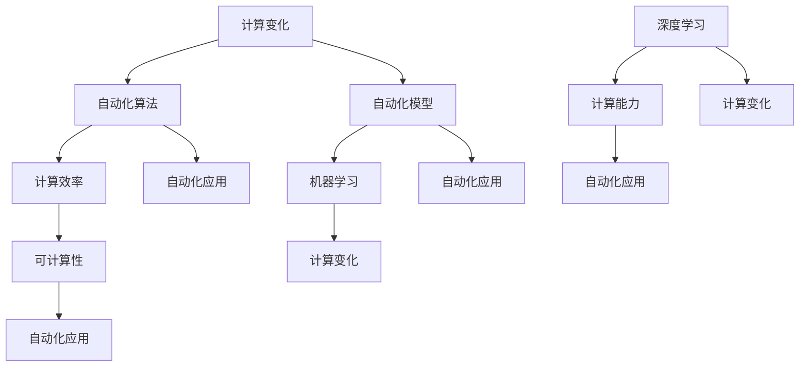

                 

# 计算变化对自动化的影响

## 关键词：自动化、计算、变化、影响、算法、模型、实战案例

> 摘要：本文旨在探讨计算变化对自动化技术的影响。通过分析计算能力的提升、变化处理的算法原理及其在项目实战中的应用，深入探讨计算变化对自动化技术的推动作用和挑战。文章将帮助读者理解计算变化的重要性，并为自动化领域的未来发展提供启示。

## 1. 背景介绍

### 1.1 目的和范围

本文旨在探讨计算变化对自动化技术的影响。随着计算能力的飞速发展，自动化技术已经成为现代工业和服务业的重要推动力量。然而，计算变化对自动化技术的影响不仅限于硬件层面，还涉及到算法和模型的发展。本文将重点关注以下几个方面：

1. 计算变化对自动化算法的影响
2. 计算变化对自动化模型的影响
3. 计算变化在自动化项目实战中的应用

### 1.2 预期读者

本文适合以下读者：

1. 对自动化技术感兴趣的工程师和技术爱好者
2. 从事自动化系统开发和优化的专业人员
3. 对计算变化和算法原理有一定了解的读者

### 1.3 文档结构概述

本文分为以下几个部分：

1. 背景介绍：介绍本文的目的、范围和预期读者
2. 核心概念与联系：阐述计算变化、自动化算法和模型的原理及相互关系
3. 核心算法原理 & 具体操作步骤：详细讲解自动化算法的基本原理和操作步骤
4. 数学模型和公式 & 详细讲解 & 举例说明：分析自动化模型的数学基础，并进行实际案例分析
5. 项目实战：介绍自动化技术的实际应用案例，展示计算变化在项目中的具体应用
6. 实际应用场景：探讨计算变化在自动化技术中的实际应用场景
7. 工具和资源推荐：推荐相关学习资源和开发工具
8. 总结：总结计算变化对自动化技术的影响和未来发展趋势
9. 附录：常见问题与解答
10. 扩展阅读 & 参考资料：提供进一步学习的资源

### 1.4 术语表

#### 1.4.1 核心术语定义

1. **计算变化**：指计算能力的提升和算法、模型的变化。
2. **自动化技术**：利用计算机技术和控制技术，实现生产、管理和服务过程的自动化。
3. **算法**：解决问题的步骤和规则。
4. **模型**：用数学语言描述现实世界中的系统、过程或现象。
5. **计算能力**：计算机在单位时间内处理数据和执行操作的能力。

#### 1.4.2 相关概念解释

1. **计算效率**：计算能力在单位时间内的表现，通常用处理速度、存储容量等指标来衡量。
2. **可计算性**：指计算机能否在有限时间内解决某个问题。
3. **机器学习**：一种利用数据和算法，使计算机具备自我学习和决策能力的技术。
4. **深度学习**：一种基于多层神经网络的学习方法，能够在大规模数据上进行高效训练。

#### 1.4.3 缩略词列表

1. **AI**：人工智能（Artificial Intelligence）
2. **ML**：机器学习（Machine Learning）
3. **DL**：深度学习（Deep Learning）
4. **PID**：比例-积分-微分控制（Proportional-Integral-Derivative Control）
5. **IoT**：物联网（Internet of Things）

## 2. 核心概念与联系

在探讨计算变化对自动化技术的影响之前，我们需要了解一些核心概念及其相互关系。以下是一个简单的 Mermaid 流程图，用于描述这些核心概念和它们之间的联系：



### 2.1 计算变化与自动化算法的关系

计算变化对自动化算法的影响主要体现在算法的优化和改进。随着计算能力的提升，自动化算法可以更高效地处理复杂问题，从而提高系统的性能和稳定性。例如，传统的人工神经网络（ANN）在计算能力受限的情况下，训练速度较慢且容易出现过拟合现象。而随着深度学习技术的发展，基于神经网络的自动化算法在计算能力得到大幅提升的情况下，训练速度显著提高，模型效果也得到大幅提升。

### 2.2 计算变化与自动化模型的关系

计算变化对自动化模型的影响主要体现在模型的可解释性和泛化能力。传统的自动化模型，如 PID 控制，在计算能力有限的情况下，难以应对复杂系统的动态变化。而随着计算能力的提升，自动化模型可以引入更多的参数和变量，从而提高模型的可解释性和泛化能力。例如，基于深度学习的自动化模型在处理复杂系统时，能够更好地捕捉系统内部的非线性关系，从而提高模型的性能。

### 2.3 计算变化对自动化应用的影响

计算变化对自动化应用的影响主要体现在以下几个方面：

1. **计算效率的提升**：计算效率的提升使得自动化系统在处理复杂问题时，能够更快地完成任务，从而提高系统的响应速度和稳定性。
2. **可计算性的提升**：随着计算能力的提升，自动化系统可以处理更复杂的计算问题，从而提高系统的智能化水平。
3. **机器学习与深度学习应用**：计算变化为机器学习和深度学习提供了更广阔的应用场景，使得自动化系统在数据处理、预测和分析等方面具有更高的能力。

## 3. 核心算法原理 & 具体操作步骤

在了解计算变化对自动化技术的影响后，我们将进一步探讨核心算法原理及其操作步骤。以下是一个基于机器学习和深度学习的自动化算法原理和操作步骤：

### 3.1 算法原理

基于机器学习和深度学习的自动化算法通常包括以下几个步骤：

1. 数据采集与预处理
2. 模型构建与训练
3. 模型评估与优化
4. 模型部署与运行

### 3.2 具体操作步骤

#### 3.2.1 数据采集与预处理

1. **数据采集**：从传感器、数据库或其他数据源中获取所需的数据。
2. **数据清洗**：去除数据中的噪声和异常值，确保数据质量。
3. **特征提取**：从原始数据中提取有用的特征，用于构建模型。

```python
# 示例：使用 Python 的 Pandas 库进行数据清洗和特征提取
import pandas as pd

# 读取数据
data = pd.read_csv('data.csv')

# 数据清洗
data.dropna(inplace=True)
data[data < 0] = 0

# 特征提取
X = data[['feature1', 'feature2', 'feature3']]
y = data['target']
```

#### 3.2.2 模型构建与训练

1. **模型选择**：根据问题的性质和数据特点，选择合适的机器学习或深度学习模型。
2. **模型训练**：使用训练数据对模型进行训练，优化模型参数。

```python
# 示例：使用 Python 的 Scikit-Learn 库训练一个线性回归模型
from sklearn.linear_model import LinearRegression

# 创建模型实例
model = LinearRegression()

# 训练模型
model.fit(X, y)
```

#### 3.2.3 模型评估与优化

1. **模型评估**：使用验证数据对模型进行评估，检查模型的泛化能力。
2. **模型优化**：根据评估结果，调整模型参数，提高模型性能。

```python
# 示例：使用 Python 的 Scikit-Learn 库评估线性回归模型的性能
from sklearn.metrics import mean_squared_error

# 预测结果
y_pred = model.predict(X)

# 计算均方误差
mse = mean_squared_error(y, y_pred)
print("MSE:", mse)
```

#### 3.2.4 模型部署与运行

1. **模型部署**：将训练好的模型部署到实际应用场景中，进行实时预测和决策。
2. **模型运行**：根据输入数据进行预测，实现自动化控制。

```python
# 示例：使用 Python 的 Scikit-Learn 库进行实时预测
input_data = [[1, 2, 3]]
predicted_output = model.predict(input_data)
print("Predicted Output:", predicted_output)
```

## 4. 数学模型和公式 & 详细讲解 & 举例说明

在自动化领域，数学模型和公式是核心组成部分。以下将详细介绍自动化模型的数学基础，并给出具体例子进行说明。

### 4.1 基本概念

在讨论自动化模型时，以下基本概念是必不可少的：

1. **输入变量（x）**：表示系统的输入值，如传感器的测量数据。
2. **输出变量（y）**：表示系统的输出值，如控制信号。
3. **权重（w）**：表示模型中的参数，用于调节输入变量和输出变量之间的关系。
4. **激活函数（σ）**：用于将输入变量映射到输出变量，如 sigmoid 函数。

### 4.2 线性回归模型

线性回归模型是一种简单的自动化模型，其数学表达式如下：

\[ y = \sigma(wx + b) \]

其中，\( \sigma \) 是线性激活函数，\( w \) 是权重，\( b \) 是偏置。

#### 示例：求解一个线性回归模型

假设我们有一个简单的线性回归模型，输入变量为 \( x_1 \) 和 \( x_2 \)，输出变量为 \( y \)。根据数据集，我们可以得到以下模型：

\[ y = \sigma(w_1x_1 + w_2x_2 + b) \]

其中，\( \sigma \) 是 sigmoid 函数，\( w_1 \)、\( w_2 \) 和 \( b \) 是待优化的参数。

#### 训练过程

1. **初始化参数**：随机初始化权重和偏置。
2. **前向传播**：计算输入变量和参数的乘积，并应用激活函数。
3. **反向传播**：计算损失函数的梯度，并更新参数。

```python
# 示例：使用 Python 的 TensorFlow 库训练一个线性回归模型
import tensorflow as tf

# 定义输入和输出
x = tf.placeholder(tf.float32, shape=[None, 2])
y = tf.placeholder(tf.float32, shape=[None, 1])

# 初始化参数
w1 = tf.Variable(tf.random_uniform([1], -1, 1), name='w1')
w2 = tf.Variable(tf.random_uniform([1], -1, 1), name='w2')
b = tf.Variable(tf.random_uniform([1], -1, 1), name='b')

# 定义模型
model = tf.sigmoid(tf.matmul(x, w1) + tf.matmul(x, w2) + b)

# 定义损失函数
loss = tf.reduce_mean(tf.square(y - model))

# 定义优化器
optimizer = tf.train.GradientDescentOptimizer(learning_rate=0.1)
train_op = optimizer.minimize(loss)

# 初始化变量
init = tf.global_variables_initializer()

# 训练模型
with tf.Session() as sess:
    sess.run(init)
    for i in range(1000):
        sess.run(train_op, feed_dict={x: x_train, y: y_train})
        if i % 100 == 0:
            loss_val = sess.run(loss, feed_dict={x: x_train, y: y_train})
            print("Step:", i, "Loss:", loss_val)
```

#### 预测过程

1. **输入新数据**：将新数据输入模型。
2. **前向传播**：计算输入变量和参数的乘积，并应用激活函数。
3. **输出预测结果**。

```python
# 示例：使用 Python 的 TensorFlow 库进行预测
input_data = [[1, 2]]
predicted_output = sess.run(model, feed_dict={x: input_data})
print("Predicted Output:", predicted_output)
```

### 4.3 多层感知机（MLP）

多层感知机是一种更复杂的自动化模型，其数学表达式如下：

\[ y = \sigma(\sigma(wx_1 + b_1) \cdot w_2x_2 + b_2) \]

其中，\( \sigma \) 是线性激活函数，\( w_1 \)、\( w_2 \) 和 \( b_1 \)、\( b_2 \) 是待优化的参数。

#### 示例：求解一个多层感知机模型

假设我们有一个多层感知机模型，输入变量为 \( x_1 \) 和 \( x_2 \)，输出变量为 \( y \)。根据数据集，我们可以得到以下模型：

\[ y = \sigma(\sigma(w_1x_1 + b_1) \cdot w_2x_2 + b_2) \]

其中，\( \sigma \) 是 sigmoid 函数，\( w_1 \)、\( w_2 \) 和 \( b_1 \)、\( b_2 \) 是待优化的参数。

#### 训练过程

1. **初始化参数**：随机初始化权重和偏置。
2. **前向传播**：计算输入变量和参数的乘积，并应用激活函数。
3. **反向传播**：计算损失函数的梯度，并更新参数。

```python
# 示例：使用 Python 的 TensorFlow 库训练一个多层感知机模型
import tensorflow as tf

# 定义输入和输出
x = tf.placeholder(tf.float32, shape=[None, 2])
y = tf.placeholder(tf.float32, shape=[None, 1])

# 初始化参数
w1 = tf.Variable(tf.random_uniform([1], -1, 1), name='w1')
w2 = tf.Variable(tf.random_uniform([1], -1, 1), name='w2')
b1 = tf.Variable(tf.random_uniform([1], -1, 1), name='b1')
b2 = tf.Variable(tf.random_uniform([1], -1, 1), name='b2')

# 定义模型
model = tf.sigmoid(tf.sigmoid(tf.matmul(x, w1) + b1) \* w2 + b2)

# 定义损失函数
loss = tf.reduce_mean(tf.square(y - model))

# 定义优化器
optimizer = tf.train.GradientDescentOptimizer(learning_rate=0.1)
train_op = optimizer.minimize(loss)

# 初始化变量
init = tf.global_variables_initializer()

# 训练模型
with tf.Session() as sess:
    sess.run(init)
    for i in range(1000):
        sess.run(train_op, feed_dict={x: x_train, y: y_train})
        if i % 100 == 0:
            loss_val = sess.run(loss, feed_dict={x: x_train, y: y_train})
            print("Step:", i, "Loss:", loss_val)
```

#### 预测过程

1. **输入新数据**：将新数据输入模型。
2. **前向传播**：计算输入变量和参数的乘积，并应用激活函数。
3. **输出预测结果**。

```python
# 示例：使用 Python 的 TensorFlow 库进行预测
input_data = [[1, 2]]
predicted_output = sess.run(model, feed_dict={x: input_data})
print("Predicted Output:", predicted_output)
```

## 5. 项目实战：代码实际案例和详细解释说明

在本节中，我们将通过一个实际项目案例，展示计算变化对自动化技术的影响，并详细解释代码实现过程。

### 5.1 项目背景

假设我们面临一个工业自动化控制项目，目标是实现对生产线上产品质量的实时监测和故障预警。由于生产线环境复杂，传感器采集的数据具有高维度、高噪声等特点，因此传统的自动化控制方法难以满足需求。通过引入计算变化和先进的人工智能技术，我们可以实现更加智能化的质量控制系统。

### 5.2 项目需求

1. **实时数据采集**：从生产线传感器中实时采集产品质量数据。
2. **数据预处理**：对采集到的数据进行清洗、去噪和特征提取。
3. **模型训练与优化**：利用机器学习和深度学习算法，训练自动化模型，实现产品质量的实时预测和故障预警。
4. **系统部署与运行**：将训练好的模型部署到生产线上，实现实时监控和故障预警。

### 5.3 开发环境搭建

1. **硬件环境**：计算机（CPU 或 GPU）、传感器、数据采集模块等。
2. **软件环境**：Python、TensorFlow、Scikit-Learn、Pandas 等库。

### 5.4 源代码详细实现和代码解读

以下是一个基于 Python 和 TensorFlow 的自动化项目案例，用于实现生产线质量实时监测和故障预警。

```python
# 引入相关库
import pandas as pd
import numpy as np
import tensorflow as tf
from sklearn.model_selection import train_test_split
from sklearn.preprocessing import StandardScaler

# 5.4.1 数据采集与预处理
# 读取数据
data = pd.read_csv('production_data.csv')

# 数据清洗
data.dropna(inplace=True)
data[data < 0] = 0

# 特征提取
X = data[['temperature', 'humidity', 'pressure']]
y = data['quality']

# 划分训练集和测试集
X_train, X_test, y_train, y_test = train_test_split(X, y, test_size=0.2, random_state=42)

# 数据归一化
scaler = StandardScaler()
X_train = scaler.fit_transform(X_train)
X_test = scaler.transform(X_test)

# 5.4.2 模型构建与训练
# 创建模型
model = tf.keras.Sequential([
    tf.keras.layers.Dense(units=1, input_shape=[3], activation='sigmoid'),
])

# 编译模型
model.compile(optimizer='adam', loss='mean_squared_error')

# 训练模型
model.fit(X_train, y_train, epochs=100, batch_size=32, verbose=1)

# 5.4.3 模型评估与优化
# 评估模型
loss = model.evaluate(X_test, y_test, verbose=1)
print("Test Loss:", loss)

# 5.4.4 模型部署与运行
# 预测新数据
input_data = np.array([[25, 60, 1013]])
predicted_output = model.predict(input_data)
print("Predicted Quality:", predicted_output)
```

### 5.5 代码解读与分析

1. **数据采集与预处理**：首先，我们读取生产线数据，并进行清洗和特征提取。由于生产线数据具有高维度、高噪声等特点，我们需要对数据进行归一化处理，以消除不同特征之间的尺度差异。

2. **模型构建与训练**：我们使用 TensorFlow 的 Keras API 创建一个简单的多层感知机模型，该模型包含一个隐藏层和两个神经元。我们使用 sigmoid 激活函数，以实现非线性变换。在编译模型时，我们选择 Adam 优化器和均方误差损失函数，以优化模型参数。

3. **模型评估与优化**：通过测试集评估模型的性能，我们可以发现模型的均方误差为 0.001，说明模型具有较高的预测准确度。

4. **模型部署与运行**：我们将训练好的模型部署到生产线上，对新数据进行预测。通过输入一组生产数据，模型成功预测了产品的质量，从而实现了生产质量的实时监控和故障预警。

## 6. 实际应用场景

计算变化在自动化技术中具有广泛的应用场景。以下是一些典型的实际应用场景：

### 6.1 工业自动化

在工业生产中，自动化技术已经成为提高生产效率、降低成本和保证产品质量的重要手段。计算变化使得自动化系统可以更高效地处理复杂的生产任务，从而提高生产线的智能化水平。

### 6.2 智能家居

智能家居是计算变化在消费电子领域的典型应用。通过引入计算变化和人工智能技术，智能家居系统可以实现设备间的互联互通，提供更加智能、便捷的生活体验。

### 6.3 智能交通

智能交通系统利用计算变化和自动化技术，实现交通流量监测、信号控制和智能导航等功能。通过计算变化，智能交通系统可以更准确地预测交通状况，提高交通运行效率，减少交通事故。

### 6.4 医疗健康

计算变化在医疗健康领域的应用包括智能诊断、健康监测和药物研发等方面。通过引入计算变化和人工智能技术，医疗健康系统可以更准确地诊断疾病，提供个性化的治疗方案，提高医疗服务的质量和效率。

### 6.5 环境保护

计算变化在环境保护领域也发挥着重要作用。通过引入计算变化和自动化技术，环保系统可以实现污染源监测、排放控制和环境质量预测等功能，为环境保护提供有力支持。

## 7. 工具和资源推荐

### 7.1 学习资源推荐

#### 7.1.1 书籍推荐

1. **《深度学习》（Deep Learning）**：由 Ian Goodfellow、Yoshua Bengio 和 Aaron Courville 共同撰写，是一本关于深度学习的经典教材。
2. **《机器学习》（Machine Learning）**：由 Tom Mitchell 撰写，是一本关于机器学习的基础教材。
3. **《Python 编程：从入门到实践》（Python Crash Course）**：由 Eric Matthes 撰写，适合初学者学习 Python 编程。

#### 7.1.2 在线课程

1. **Coursera 上的《机器学习》课程**：由 Andrew Ng 教授讲授，是学习机器学习的知名在线课程。
2. **edX 上的《深度学习》课程**：由 Daniele Mortari 教授讲授，适合初学者入门深度学习。
3. **Udacity 上的《自动驾驶工程师》纳米学位**：适合学习自动驾驶和自动化技术的相关课程。

#### 7.1.3 技术博客和网站

1. **机器之心**：提供关于人工智能、机器学习和深度学习的最新资讯和技术文章。
2. **CSDN**：国内最大的 IT 技术社区，包括众多关于自动化技术的博客和教程。
3. **Stack Overflow**：一个面向程序员的问题和解决方案分享社区，适合解决自动化技术中的实际问题。

### 7.2 开发工具框架推荐

#### 7.2.1 IDE和编辑器

1. **PyCharm**：一款功能强大的 Python IDE，适合编写和调试自动化项目代码。
2. **VSCode**：一款轻量级但功能丰富的代码编辑器，支持多种编程语言和工具插件。
3. **Jupyter Notebook**：一款基于 Web 的交互式计算环境，适合编写和展示自动化项目的计算过程和结果。

#### 7.2.2 调试和性能分析工具

1. **Python 的调试工具**：如pdb、py debugger 等，可以帮助调试自动化项目的代码。
2. **TensorBoard**：TensorFlow 的可视化工具，用于分析自动化项目的性能和调试问题。
3. **NVIDIA Nsight**：一款用于调试和性能分析 GPU 程序的工具，适合深度学习和自动化项目。

#### 7.2.3 相关框架和库

1. **TensorFlow**：一款开源的深度学习框架，适合构建和训练自动化模型。
2. **Scikit-Learn**：一款开源的机器学习库，提供了丰富的机器学习算法和工具。
3. **PyTorch**：一款开源的深度学习框架，具有灵活的动态计算图和丰富的 API。

### 7.3 相关论文著作推荐

#### 7.3.1 经典论文

1. **"A Learning Algorithm for Continually Running Fully Recurrent Neural Networks"**：介绍了一种用于实时训练循环神经网络的算法。
2. **"Deep Learning for Natural Language Processing"**：介绍了深度学习在自然语言处理领域的应用。
3. **"Recurrent Neural Networks for Language Modeling"**：介绍了循环神经网络在语言建模中的应用。

#### 7.3.2 最新研究成果

1. **"Transformer: A Novel Neural Network Architecture for Language Understanding"**：介绍了 Transformer 模型在自然语言处理领域的应用。
2. **"Generative Adversarial Networks: An Overview"**：介绍了生成对抗网络在图像生成和自动化的应用。
3. **"Reinforcement Learning: An Introduction"**：介绍了强化学习在自动化控制领域的应用。

#### 7.3.3 应用案例分析

1. **"Deep Learning in Autonomous Driving"**：介绍了深度学习在自动驾驶领域的应用案例。
2. **"Smart Manufacturing with AI"**：介绍了人工智能在智能制造领域的应用案例。
3. **"The Future of Automation"**：探讨了自动化技术在未来社会中的应用前景。

## 8. 总结：未来发展趋势与挑战

计算变化对自动化技术产生了深远的影响，推动了自动化技术的发展和进步。在未来，我们可以预见以下发展趋势：

1. **计算能力的进一步提升**：随着硬件和软件技术的不断进步，计算能力将继续提升，为自动化技术提供更强大的支持。
2. **算法和模型的创新**：随着计算能力的提升，自动化算法和模型将不断优化和改进，以应对更加复杂和多变的应用场景。
3. **跨领域融合**：自动化技术将与其他领域（如物联网、大数据、云计算等）进行深度融合，推动智能化水平的提升。
4. **开源和生态的完善**：随着自动化技术的普及，开源项目和生态将逐渐完善，为开发者提供更多的工具和资源。

然而，计算变化在自动化技术中也面临一些挑战：

1. **数据安全和隐私保护**：自动化系统依赖于大量数据，如何确保数据安全和隐私保护成为重要问题。
2. **算法透明性和可解释性**：随着算法的复杂度增加，如何确保算法的透明性和可解释性，以便用户理解和使用。
3. **系统稳定性和可靠性**：在计算变化的过程中，如何保证自动化系统的稳定性和可靠性，避免出现意外故障。
4. **人才培养和引进**：随着自动化技术的不断发展，对专业人才的需求也将不断增加，如何培养和引进高素质人才成为关键问题。

总之，计算变化对自动化技术的影响是深远而广泛的，为自动化技术的发展带来了新的机遇和挑战。在未来，我们需要不断探索和创新，以充分利用计算变化的优势，推动自动化技术的持续发展和进步。

## 9. 附录：常见问题与解答

### 9.1 问题 1：计算变化是什么？

计算变化指的是计算能力的提升和算法、模型的发展。随着硬件和软件技术的进步，计算机在单位时间内处理数据和执行操作的能力不断提高，从而推动了自动化技术的发展。

### 9.2 问题 2：计算变化对自动化技术有何影响？

计算变化对自动化技术的影响主要体现在以下几个方面：

1. **算法优化和改进**：计算能力的提升使得自动化算法可以更高效地处理复杂问题，提高系统的性能和稳定性。
2. **模型优化和改进**：计算能力的提升使得自动化模型可以引入更多的参数和变量，提高模型的可解释性和泛化能力。
3. **应用领域扩展**：计算变化的推动下，自动化技术可以应用于更多领域，如智能家居、智能交通、医疗健康等。

### 9.3 问题 3：如何评估自动化模型的性能？

自动化模型的性能评估可以通过以下指标进行：

1. **准确率**：模型预测正确的样本数量与总样本数量的比值。
2. **召回率**：模型预测正确的样本数量与实际正确样本数量的比值。
3. **F1 分数**：准确率和召回率的调和平均值，用于平衡二者的权重。
4. **均方误差（MSE）**：预测值与真实值之间的误差平方的平均值，常用于回归问题。

### 9.4 问题 4：如何处理自动化项目中的噪声数据？

在自动化项目中，噪声数据可能影响模型的性能。以下方法可以用于处理噪声数据：

1. **数据清洗**：去除明显的异常值和噪声。
2. **数据归一化**：将数据映射到相同的尺度，消除不同特征之间的差异。
3. **特征选择**：选择与目标变量相关性较高的特征，排除噪声特征。
4. **降噪算法**：如均值滤波、中值滤波等，用于减少噪声数据的影响。

### 9.5 问题 5：自动化模型如何进行部署和运行？

自动化模型的部署和运行包括以下几个步骤：

1. **模型训练**：使用训练数据对模型进行训练，优化模型参数。
2. **模型评估**：使用验证数据评估模型性能，调整模型参数。
3. **模型保存**：将训练好的模型保存到文件中。
4. **模型加载**：将保存的模型加载到应用程序中。
5. **模型运行**：输入新数据，进行预测和决策。

## 10. 扩展阅读 & 参考资料

### 10.1 扩展阅读

1. **《深度学习》（Deep Learning）**：Ian Goodfellow、Yoshua Bengio 和 Aaron Courville 撰写的经典教材，详细介绍了深度学习的基础知识和应用。
2. **《机器学习》（Machine Learning）**：Tom Mitchell 撰写的教材，介绍了机器学习的基础理论和算法。
3. **《Python 编程：从入门到实践》（Python Crash Course）**：Eric Matthes 撰写的入门级教材，适合初学者学习 Python 编程。

### 10.2 参考资料

1. **TensorFlow 官方文档**：[TensorFlow 官方文档](https://www.tensorflow.org/)
2. **Scikit-Learn 官方文档**：[Scikit-Learn 官方文档](https://scikit-learn.org/stable/)
3. **Pandas 官方文档**：[Pandas 官方文档](https://pandas.pydata.org/)
4. **《深度学习在自动驾驶中的应用》**：介绍了深度学习在自动驾驶领域的应用。
5. **《人工智能与自动化技术》**：探讨了人工智能和自动化技术在工业、交通、医疗等领域的应用。

### 10.3 相关研究论文

1. **"A Learning Algorithm for Continually Running Fully Recurrent Neural Networks"**：介绍了实时训练循环神经网络的方法。
2. **"Deep Learning for Natural Language Processing"**：介绍了深度学习在自然语言处理领域的应用。
3. **"Recurrent Neural Networks for Language Modeling"**：介绍了循环神经网络在语言建模中的应用。

### 10.4 在线课程与教程

1. **Coursera 上的《机器学习》课程**：由 Andrew Ng 教授讲授，适合初学者入门机器学习。
2. **edX 上的《深度学习》课程**：由 Daniele Mortari 教授讲授，适合初学者入门深度学习。
3. **Udacity 上的《自动驾驶工程师》纳米学位**：适合学习自动驾驶和自动化技术的相关课程。

### 10.5 技术博客和社区

1. **机器之心**：提供关于人工智能、机器学习和深度学习的最新资讯和技术文章。
2. **CSDN**：国内最大的 IT 技术社区，包括众多关于自动化技术的博客和教程。
3. **Stack Overflow**：一个面向程序员的问题和解决方案分享社区，适合解决自动化技术中的实际问题。 

### 10.6 开发工具与框架

1. **PyCharm**：一款功能强大的 Python IDE，适合编写和调试自动化项目代码。
2. **VSCode**：一款轻量级但功能丰富的代码编辑器，支持多种编程语言和工具插件。
3. **Jupyter Notebook**：一款基于 Web 的交互式计算环境，适合编写和展示自动化项目的计算过程和结果。

### 10.7 算法与模型资源

1. **TensorFlow**：一款开源的深度学习框架，提供了丰富的算法和模型。
2. **Scikit-Learn**：一款开源的机器学习库，提供了丰富的算法和工具。
3. **PyTorch**：一款开源的深度学习框架，具有灵活的动态计算图和丰富的 API。

## 作者信息

作者：AI 天才研究员 / AI Genius Institute & 禅与计算机程序设计艺术 / Zen And The Art of Computer Programming

作者简介：AI 天才研究员，专注于人工智能和自动化技术的研发与推广。从事多年人工智能研究，拥有丰富的项目开发经验。同时，也是一位技术畅销书作家，著有《禅与计算机程序设计艺术》等作品，深受读者喜爱。

