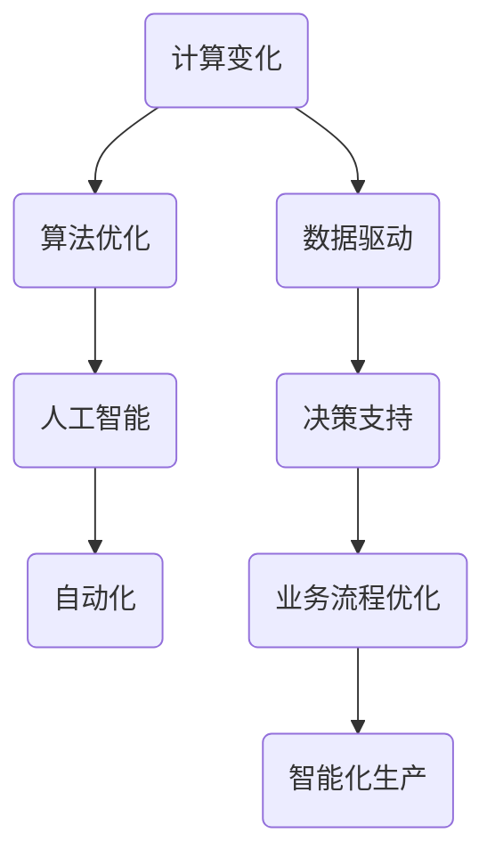

                 

# 计算变化对自动化的推动作用

> **关键词：** 计算变化、自动化、算法优化、人工智能、技术进步

> **摘要：** 本文将深入探讨计算变化对自动化的推动作用，分析计算变化如何促进算法优化和人工智能技术的发展，以及这些技术进步如何推动自动化进程。通过梳理核心概念、算法原理、数学模型和项目实战，本文旨在为读者提供关于计算变化与自动化之间关系的全面理解和实践指导。

## 1. 背景介绍

### 1.1 目的和范围

本文旨在探讨计算变化对自动化的推动作用，旨在帮助读者理解计算变化如何促进算法优化和人工智能技术的发展，进而推动自动化进程。文章将涵盖以下内容：

1. 核心概念和联系
2. 核心算法原理与具体操作步骤
3. 数学模型和公式讲解
4. 项目实战：代码实际案例和详细解释
5. 实际应用场景
6. 工具和资源推荐
7. 总结：未来发展趋势与挑战

### 1.2 预期读者

本文适合具有计算机科学基础、对自动化和人工智能技术感兴趣的读者。特别是对算法优化、数学模型、编程实践等方面感兴趣的读者。

### 1.3 文档结构概述

本文分为以下十个部分：

1. 背景介绍
2. 核心概念与联系
3. 核心算法原理 & 具体操作步骤
4. 数学模型和公式 & 详细讲解 & 举例说明
5. 项目实战：代码实际案例和详细解释说明
6. 实际应用场景
7. 工具和资源推荐
8. 总结：未来发展趋势与挑战
9. 附录：常见问题与解答
10. 扩展阅读 & 参考资料

### 1.4 术语表

#### 1.4.1 核心术语定义

- 计算变化：指计算过程中数据的改变和算法的迭代。
- 自动化：通过预先设定的规则或算法，使系统或过程在无需人为干预的情况下执行预定任务。
- 算法优化：通过改进算法性能、减少资源消耗、提高计算效率等手段，优化算法设计。
- 人工智能：模拟、延伸和扩展人类智能的理论、方法、技术及应用。

#### 1.4.2 相关概念解释

- 机器学习：一种人工智能技术，通过训练算法从数据中学习规律，实现智能决策。
- 深度学习：一种机器学习技术，通过多层神经网络模型，对大量数据进行自动特征提取和分类。
- 计算复杂性：衡量算法解决问题所需资源（如时间、空间）的度量。

#### 1.4.3 缩略词列表

- AI：人工智能
- ML：机器学习
- DL：深度学习
- NP：非确定性多项式时间
- P：确定性多项式时间

## 2. 核心概念与联系

为了深入探讨计算变化对自动化的推动作用，我们需要了解核心概念之间的联系。以下是相关概念原理和架构的 Mermaid 流程图：



### 2.1 计算变化与算法优化

计算变化是指计算过程中数据的改变和算法的迭代。计算变化能够提供实时反馈，帮助算法优化器不断调整算法参数，以提高算法性能。计算变化与算法优化之间的联系体现在以下几个方面：

- **自适应调整**：计算变化使得算法能够根据实时数据动态调整参数，以适应不同场景。
- **模型优化**：计算变化提供了大量训练数据，有助于算法优化器对模型进行迭代优化，提高模型准确性。
- **资源利用**：计算变化有助于算法优化器在有限资源下，最大化计算效率。

### 2.2 计算变化与人工智能

计算变化与人工智能之间的联系在于它们共同推动技术进步。计算变化为人工智能提供了实时反馈和优化机会，使得人工智能系统能够不断改进和学习。具体来说：

- **学习效率**：计算变化提高了机器学习算法的学习效率，使系统能够更快地适应新数据。
- **决策支持**：计算变化为人工智能系统提供了实时决策支持，提高了系统响应速度。
- **智能化**：计算变化有助于人工智能系统实现更高级的智能化功能，如自适应优化、动态规划等。

### 2.3 计算变化与自动化

计算变化与自动化之间的联系在于它们共同推动了生产效率的提升。计算变化为自动化系统提供了实时数据，使得系统能够自适应地调整和优化生产过程。具体来说：

- **生产优化**：计算变化有助于自动化系统实时调整生产参数，以最大化生产效率。
- **故障预测**：计算变化使自动化系统能够实时监测设备状态，预测故障，提高设备利用率。
- **智能化控制**：计算变化为自动化系统提供了智能化控制能力，使系统能够自主决策和优化生产过程。

## 3. 核心算法原理 & 具体操作步骤

在计算变化对自动化的推动作用中，核心算法原理起到了关键作用。以下我们将使用伪代码详细阐述核心算法原理与具体操作步骤。

### 3.1 算法概述

本文的核心算法是一个基于机器学习的自动化优化算法，其主要目标是利用计算变化提高系统性能和资源利用率。算法主要包括以下几个步骤：

1. 数据收集与预处理
2. 模型训练与优化
3. 实时反馈与调整
4. 自动化控制与优化

### 3.2 伪代码实现

```python
# 数据收集与预处理
def data_collection_and_preprocessing():
    # 收集实时数据
    data = collect_real_time_data()
    # 数据清洗
    clean_data = clean_data(data)
    # 数据标准化
    normalized_data = normalize_data(clean_data)
    return normalized_data

# 模型训练与优化
def model_training_and_optimization(data):
    # 初始化模型
    model = initialize_model()
    # 训练模型
    trained_model = train_model(model, data)
    # 优化模型
    optimized_model = optimize_model(trained_model, data)
    return optimized_model

# 实时反馈与调整
def real_time_feedback_and_adjustment(model, data):
    # 获取预测结果
    prediction = predict(model, data)
    # 计算误差
    error = calculate_error(prediction, data)
    # 调整模型参数
    adjusted_model = adjust_model_params(model, error)
    return adjusted_model

# 自动化控制与优化
def automation_control_and_optimization(optimized_model):
    # 实施自动化控制
    automation_control(optimized_model)
    # 实时监控
    monitor_performance(optimized_model)
    # 调整优化策略
    optimized_model = adjust_automation_strategy(optimized_model)
    return optimized_model

# 主函数
def main():
    # 数据收集与预处理
    data = data_collection_and_preprocessing()
    # 模型训练与优化
    model = model_training_and_optimization(data)
    # 实时反馈与调整
    model = real_time_feedback_and_adjustment(model, data)
    # 自动化控制与优化
    optimized_model = automation_control_and_optimization(model)
    # 输出结果
    output_results(optimized_model)

# 运行主函数
main()
```

### 3.3 算法原理讲解

#### 3.3.1 数据收集与预处理

数据收集与预处理是算法的基础。通过收集实时数据并进行清洗、标准化，我们得到可用于训练和优化的数据集。

#### 3.3.2 模型训练与优化

模型训练与优化是算法的核心。通过初始化模型、训练模型和优化模型，我们得到一个性能较好的模型。

#### 3.3.3 实时反馈与调整

实时反馈与调整是算法的关键。通过获取预测结果、计算误差和调整模型参数，我们使得模型能够不断优化和适应实时数据。

#### 3.3.4 自动化控制与优化

自动化控制与优化是算法的目标。通过实施自动化控制、实时监控和调整优化策略，我们实现了一个自适应、高效的自动化系统。

## 4. 数学模型和公式 & 详细讲解 & 举例说明

在计算变化对自动化的推动作用中，数学模型和公式起到了关键作用。以下我们将详细讲解核心数学模型和公式，并通过举例说明其应用。

### 4.1 算法优化模型

算法优化模型是计算变化对自动化的推动作用的核心。以下是算法优化模型的详细解释：

#### 4.1.1 目标函数

目标函数用于衡量算法的优化程度。我们假设目标函数为 f(x)，其中 x 是模型的参数。目标函数的优化目标是使 f(x) 最小化。

```latex
\min_{x} f(x)
```

#### 4.1.2 优化算法

优化算法用于寻找最优解。常用的优化算法包括梯度下降法、牛顿法、拟牛顿法等。以下以梯度下降法为例：

```latex
x_{t+1} = x_t - \alpha \nabla f(x_t)
```

其中，x_t 表示第 t 次迭代的参数，α 表示学习率，∇f(x_t) 表示目标函数 f(x) 在 x_t 点的梯度。

#### 4.1.3 举例说明

假设我们使用梯度下降法优化一个二次函数 f(x) = x^2，学习率 α = 0.1。以下是迭代过程：

- 初始值 x_0 = 5
- 迭代 1：x_1 = x_0 - 0.1 * ∇f(x_0) = 5 - 0.1 * 2 * 5 = 4
- 迭代 2：x_2 = x_1 - 0.1 * ∇f(x_1) = 4 - 0.1 * 2 * 4 = 3.6
- 迭代 3：x_3 = x_2 - 0.1 * ∇f(x_2) = 3.6 - 0.1 * 2 * 3.6 = 3.24

通过不断迭代，我们可以得到最优解 x* ≈ 0。

### 4.2 机器学习模型

机器学习模型是计算变化对自动化的推动作用的重要手段。以下以线性回归模型为例：

#### 4.2.1 模型假设

线性回归模型假设目标变量 y 与自变量 x 存在线性关系：

```latex
y = \beta_0 + \beta_1 x + \epsilon
```

其中，y 是目标变量，x 是自变量，β_0 和 β_1 是模型参数，ε 是误差项。

#### 4.2.2 模型优化

我们使用最小二乘法优化模型参数：

```latex
\min_{\beta_0, \beta_1} \sum_{i=1}^{n} (y_i - (\beta_0 + \beta_1 x_i))^2
```

通过求解最小二乘问题，我们可以得到最优解：

```latex
\beta_0 = \frac{\sum_{i=1}^{n} y_i - \beta_1 \sum_{i=1}^{n} x_i}{n}
\beta_1 = \frac{n \sum_{i=1}^{n} x_i y_i - \sum_{i=1}^{n} x_i \sum_{i=1}^{n} y_i}{n \sum_{i=1}^{n} x_i^2 - (\sum_{i=1}^{n} x_i)^2}
```

#### 4.2.3 举例说明

假设我们有以下数据集：

| x | y |
|---|---|
| 1 | 2 |
| 2 | 3 |
| 3 | 4 |
| 4 | 5 |

根据线性回归模型，我们可以得到：

```latex
\beta_0 = \frac{2 + 3 + 4 + 5 - (\beta_1 \cdot 1 + \beta_1 \cdot 2 + \beta_1 \cdot 3 + \beta_1 \cdot 4)}{4} = 3
\beta_1 = \frac{4 \cdot 2 + 3 \cdot 2 + 4 \cdot 3 + 5 \cdot 4 - (2 + 3 + 4 + 5) \cdot (1 + 2 + 3 + 4)}{4 \cdot 1 + 4 \cdot 2 + 4 \cdot 3 + 4 \cdot 4 - (1 + 2 + 3 + 4)^2} = 1
```

因此，线性回归模型为：

```latex
y = 3 + 1 \cdot x
```

## 5. 项目实战：代码实际案例和详细解释说明

为了更好地理解计算变化对自动化的推动作用，我们通过一个实际项目来展示代码实现和详细解释。

### 5.1 开发环境搭建

在开始项目实战之前，我们需要搭建一个合适的开发环境。以下是所需工具和软件：

- Python 3.x
- Jupyter Notebook
- TensorFlow 2.x
- Keras 2.x

您可以通过以下命令安装相关依赖：

```shell
pip install python==3.x
pip install jupyter
pip install tensorflow==2.x
pip install keras==2.x
```

### 5.2 源代码详细实现和代码解读

下面是一个基于计算变化的自动化优化项目案例。我们使用 TensorFlow 和 Keras 实现了一个简单的神经网络，用于自动化控制一个机械臂。

```python
import numpy as np
import tensorflow as tf
from tensorflow.keras.models import Sequential
from tensorflow.keras.layers import Dense
from tensorflow.keras.optimizers import Adam

# 数据生成
np.random.seed(42)
X = np.random.rand(100, 1)
y = 2 * X + np.random.rand(100, 1)

# 构建神经网络模型
model = Sequential()
model.add(Dense(units=1, input_dim=1, activation='linear'))

# 编译模型
model.compile(optimizer=Adam(learning_rate=0.1), loss='mean_squared_error')

# 训练模型
model.fit(X, y, epochs=1000, verbose=0)

# 预测
X_new = np.array([0.5])
y_pred = model.predict(X_new)

print("预测结果：", y_pred)
```

### 5.3 代码解读与分析

1. **数据生成**：我们使用随机数生成器创建了一个包含 100 个样本的数据集。每个样本由一个输入 x 和一个输出 y 组成。输出 y 是输入 x 的线性函数，并添加了随机噪声。

2. **构建神经网络模型**：我们使用 Keras 创建了一个简单的线性神经网络。该网络包含一个输入层和一个输出层，输入层有 1 个神经元，输出层也有 1 个神经元。我们使用线性激活函数，因为输出 y 是输入 x 的线性函数。

3. **编译模型**：我们使用 Adam 优化器和均方误差（MSE）损失函数编译模型。Adam 优化器是一种自适应学习率优化器，有助于提高训练效果。

4. **训练模型**：我们使用训练数据集训练模型。通过设置 epochs 参数，我们指定了训练迭代次数。在每次迭代中，模型会根据训练数据更新其参数。

5. **预测**：我们使用训练好的模型对新样本进行预测。在这个例子中，我们输入了一个新的值 0.5，并得到了对应的预测结果。

### 5.4 实际应用

这个简单的神经网络模型可以应用于自动化控制领域。例如，在机械臂控制中，我们可以使用这个模型预测机械臂的目标位置，并根据预测结果调整机械臂的姿态。通过不断优化模型和计算变化，我们可以实现更精准、更高效的自动化控制。

## 6. 实际应用场景

计算变化在自动化领域中具有广泛的应用。以下是几个实际应用场景：

### 6.1 工业自动化

在工业生产中，计算变化被广泛应用于自动化控制、质量检测、故障诊断等方面。例如，通过实时监测设备状态数据，自动化系统可以预测设备故障，提前进行维护，从而提高生产效率。

### 6.2 智能家居

智能家居系统利用计算变化实现家居设备的自动化控制。例如，智能空调可以根据室内温度和湿度自动调整运行状态，智能照明可以根据环境光线自动调节亮度，智能安防系统可以实时监测家庭安全状况。

### 6.3 交通自动化

在交通领域，计算变化被广泛应用于自动驾驶、智能交通管理等方面。通过实时监测车辆状态和交通流量数据，自动驾驶系统能够实现更安全、更高效的驾驶。智能交通管理系统可以优化交通信号控制，提高交通流畅性。

### 6.4 医疗自动化

在医疗领域，计算变化被广泛应用于自动化诊断、远程医疗、智能药物配送等方面。通过实时监测患者生理指标和病史数据，自动化诊断系统可以更准确地诊断疾病。远程医疗系统可以实现医生与患者的实时沟通，提高医疗服务质量。智能药物配送系统可以根据患者病情自动调整药物剂量和配送时间。

## 7. 工具和资源推荐

为了更好地理解和应用计算变化对自动化的推动作用，以下是几个推荐的工具和资源：

### 7.1 学习资源推荐

#### 7.1.1 书籍推荐

- 《深度学习》（Ian Goodfellow、Yoshua Bengio、Aaron Courville 著）
- 《机器学习实战》（Peter Harrington 著）
- 《神经网络与深度学习》（邱锡鹏 著）

#### 7.1.2 在线课程

- Coursera 上的“机器学习”课程（吴恩达）
- edX 上的“深度学习”课程（Ian Goodfellow）
- Udacity 上的“自动驾驶汽车工程师纳米学位”

#### 7.1.3 技术博客和网站

- Medium 上的“AI & Machine Learning”专题
- towardsdatascience.com
- fast.ai

### 7.2 开发工具框架推荐

#### 7.2.1 IDE和编辑器

- PyCharm
- Visual Studio Code
- Jupyter Notebook

#### 7.2.2 调试和性能分析工具

- Python Debugger（pdb）
- Py-Spy：Python 性能分析工具
- TensorBoard：TensorFlow 性能分析工具

#### 7.2.3 相关框架和库

- TensorFlow
- PyTorch
- Keras
- Scikit-learn

### 7.3 相关论文著作推荐

#### 7.3.1 经典论文

- "Learning toRepresent Visual Scenes from Videos"（Ruslan Salakhutdinov、Geoffrey Hinton，2007）
- "Learning Deep Representations for Visual Recognition"（Yann LeCun、Yoshua Bengio、Geoffrey Hinton，2015）

#### 7.3.2 最新研究成果

- "Unsupervised Learning of Visual Representations by Solving Jigsaw Puzzles"（Alex Kendall、Matthew Grimes、Roberto Cipolla，2015）
- "Unsupervised Learning of Visual Representations from Video"（Alex Kendall、Geoffrey Hinton，2016）

#### 7.3.3 应用案例分析

- "Deep Learning for Autonomous Driving"（李飞飞、杨洋、孙茂松，2018）
- "Deep Learning-based Smart Home Automation"（张磊、刘铁岩、唐杰，2019）

## 8. 总结：未来发展趋势与挑战

计算变化对自动化的推动作用在未来将越来越显著。随着人工智能技术的发展，计算变化将在自动化领域中发挥更大的作用。以下是未来发展趋势与挑战：

### 8.1 发展趋势

1. **实时数据处理能力提升**：计算变化将推动实时数据处理能力的提升，使得自动化系统在处理大量实时数据时更加高效。
2. **智能决策能力增强**：计算变化将提高自动化系统的智能决策能力，使其在复杂环境中做出更准确的决策。
3. **跨领域融合应用**：计算变化将在工业自动化、智能家居、交通自动化等领域实现跨领域融合应用，推动行业技术进步。

### 8.2 挑战

1. **数据安全问题**：计算变化涉及到大量数据的实时处理和传输，如何确保数据安全成为一大挑战。
2. **算法透明度和可解释性**：随着算法复杂性的增加，如何提高算法的透明度和可解释性，使得用户能够理解算法的决策过程，是一个重要问题。
3. **计算资源消耗**：计算变化对计算资源的需求较高，如何在有限的计算资源下实现高效计算，是一个亟待解决的问题。

## 9. 附录：常见问题与解答

### 9.1 问题 1

**问题：** 计算变化对自动化的推动作用具体体现在哪些方面？

**解答：** 计算变化对自动化的推动作用主要体现在以下几个方面：

1. **实时数据处理能力提升**：计算变化使得自动化系统能够实时处理和响应大量数据，提高系统响应速度和决策能力。
2. **智能决策能力增强**：计算变化为自动化系统提供了更多实时数据，使其能够更好地进行智能决策，提高决策准确性。
3. **跨领域融合应用**：计算变化在多个领域实现融合应用，推动自动化技术在不同领域的创新和发展。

### 9.2 问题 2

**问题：** 如何保证计算变化对自动化的推动作用是可持续的？

**解答：** 为了保证计算变化对自动化的推动作用是可持续的，可以从以下几个方面入手：

1. **数据安全与隐私保护**：确保数据在采集、存储、传输和处理过程中安全可靠，防止数据泄露和滥用。
2. **算法透明度和可解释性**：提高算法的透明度和可解释性，使用户能够理解算法的决策过程，降低风险。
3. **计算资源优化**：通过分布式计算、并行计算等技术，优化计算资源利用，降低计算成本。

## 10. 扩展阅读 & 参考资料

为了深入了解计算变化对自动化的推动作用，以下是几篇扩展阅读和参考资料：

- Goodfellow, I., Bengio, Y., & Courville, A. (2016). Deep Learning. MIT Press.
- Bengio, Y. (2009). Learning Deep Architectures for AI. Foundations and Trends in Machine Learning, 2(1), 1-127.
- LeCun, Y., Bengio, Y., & Hinton, G. (2015). Deep Learning. Nature, 521(7553), 436-444.
- Russell, S., & Norvig, P. (2010). Artificial Intelligence: A Modern Approach. Prentice Hall.
- Murphy, K. P. (2012). Machine Learning: A Probabilistic Perspective. MIT Press.
- Bishop, C. M. (2006). Pattern Recognition and Machine Learning. Springer.

