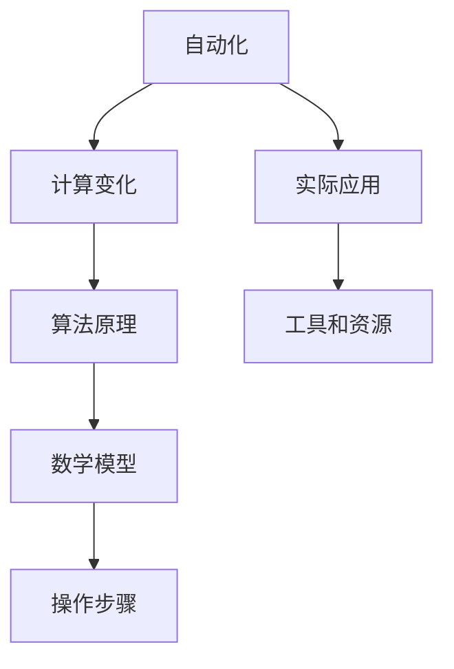
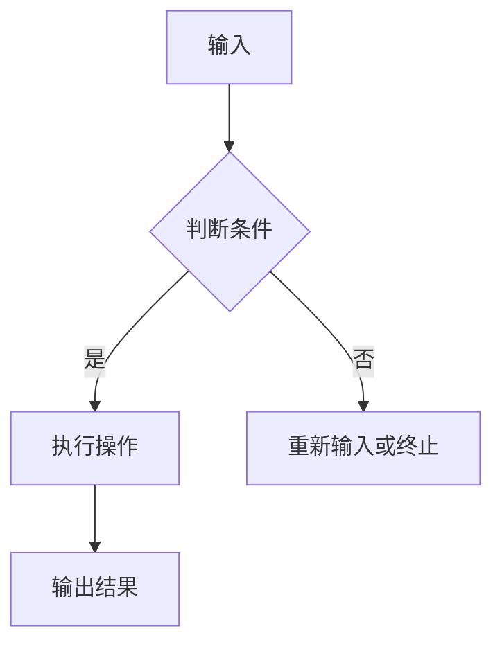
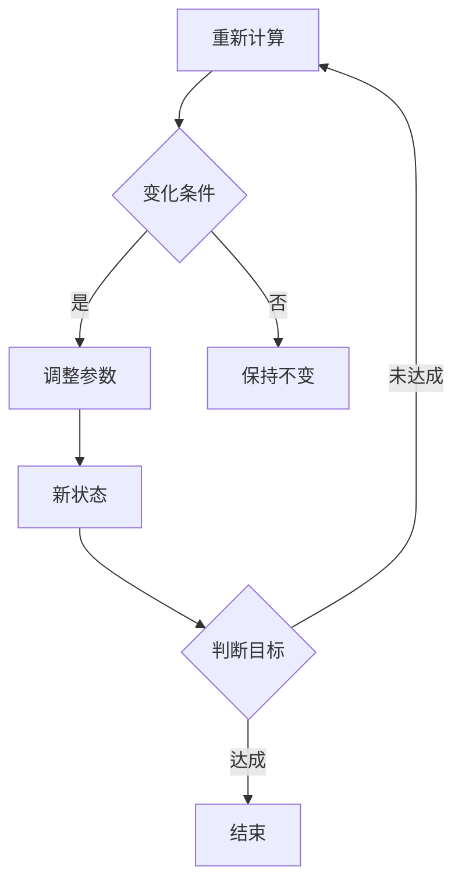
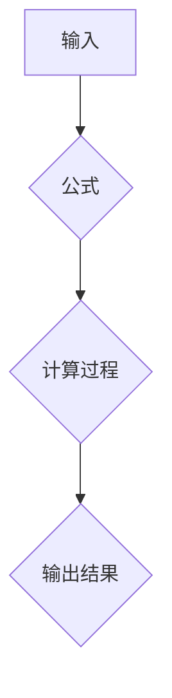
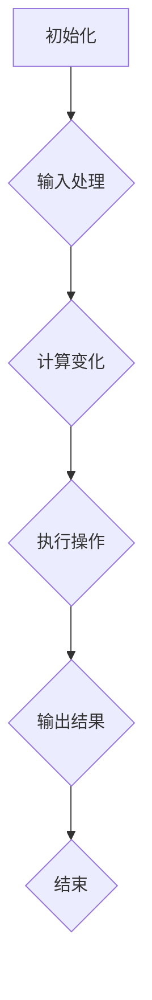
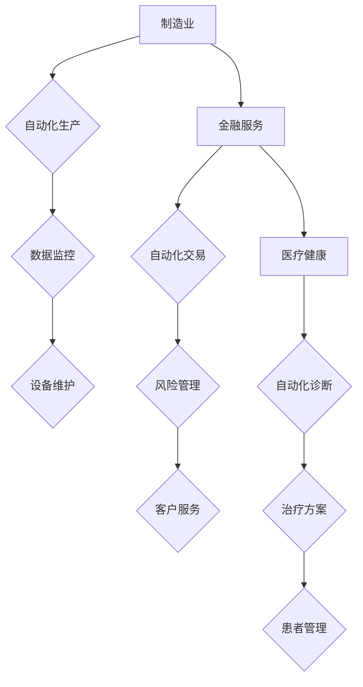

                 

## 计算变化带来的自动化新机遇

> 关键词：自动化、计算变化、算法、软件架构、人工智能、编程、机器学习、开发工具

> 摘要：本文将探讨计算变化带来的自动化新机遇。从背景介绍开始，我们将了解自动化的历史与发展，以及计算变化在其中所扮演的角色。接着，我们将深入探讨核心概念与联系，包括自动化算法原理、计算变化的数学模型和公式，以及具体的操作步骤。随后，我们将通过一个实际的代码案例，展示自动化在项目中的应用，并进行详细解读和分析。此外，文章还将探讨自动化在实际应用场景中的表现，推荐相关的工具和资源，总结未来发展趋势与挑战，并提供常见问题与解答。

## 1. 背景介绍

### 1.1 目的和范围

本文旨在探讨计算变化带来的自动化新机遇，通过深入分析自动化算法、计算变化原理及其在实际应用中的操作步骤，为读者提供全面的技术视角。本文范围涵盖自动化的历史与发展、核心概念与联系、算法原理与数学模型、实际应用场景、工具和资源推荐等内容。

### 1.2 预期读者

本文适合以下读者群体：

1. 计算机科学和软件工程领域的专业从业者，尤其是对自动化算法和计算变化感兴趣的读者；
2. 对人工智能和机器学习感兴趣的初学者；
3. 对编程和软件开发有兴趣的程序员；
4. 对自动化和软件开发工具感兴趣的工程技术人员。

### 1.3 文档结构概述

本文结构如下：

1. 背景介绍：介绍自动化的发展历史、计算变化的背景及本文目的和范围；
2. 核心概念与联系：探讨自动化算法、计算变化的数学模型和公式；
3. 核心算法原理与具体操作步骤：分析自动化算法的原理和具体操作步骤；
4. 数学模型和公式：详细讲解数学模型和公式，并进行举例说明；
5. 项目实战：通过一个实际代码案例展示自动化的应用；
6. 实际应用场景：分析自动化在不同领域的应用；
7. 工具和资源推荐：推荐学习资源、开发工具和框架；
8. 总结：总结未来发展趋势与挑战；
9. 附录：常见问题与解答；
10. 扩展阅读与参考资料：提供更多深入学习的途径。

### 1.4 术语表

#### 1.4.1 核心术语定义

- 自动化：指利用计算机技术和软件工具，实现自动执行特定任务的过程。
- 计算变化：指通过对系统状态、参数等进行变化和调整，以实现预期目标的过程。
- 算法：解决问题的一系列规则或步骤。
- 机器学习：指利用计算机算法，从数据中自动学习规律和模式，以实现智能决策和预测的技术。
- 编程：编写计算机程序的过程，用于实现特定功能。

#### 1.4.2 相关概念解释

- 软件架构：软件系统的高层次设计，包括组件、模块、接口和通信机制等。
- 计算模型：描述计算过程和系统行为的抽象模型。
- 数学模型：基于数学原理和公式，描述系统行为和问题的数学表达式。

#### 1.4.3 缩略词列表

- AI：人工智能（Artificial Intelligence）
- ML：机器学习（Machine Learning）
- IDE：集成开发环境（Integrated Development Environment）
- SDK：软件开发工具包（Software Development Kit）

## 2. 核心概念与联系

为了深入理解计算变化带来的自动化新机遇，我们需要首先了解自动化算法、计算变化原理以及它们之间的联系。以下是一个简单的 Mermaid 流程图，展示核心概念和联系。



### 2.1 自动化算法原理

自动化算法是自动化系统的核心，它决定了系统如何执行任务。以下是一个简单的自动化算法原理示意图。



#### 2.1.1 基本步骤

1. 输入：获取输入数据，如用户指令、环境信息等。
2. 判断条件：根据预设条件，对输入数据进行判断。
3. 执行操作：当条件满足时，执行特定操作，如文件传输、数据清洗等。
4. 输出结果：将操作结果返回给用户或系统。
5. 重新输入或终止：根据操作结果，决定是否继续执行或终止。

### 2.2 计算变化原理

计算变化是自动化过程中的一种重要手段，它通过对系统状态、参数等进行变化和调整，以实现预期目标。以下是一个简单的计算变化原理示意图。



#### 2.2.1 基本步骤

1. 初始状态：系统开始时的状态。
2. 变化条件：根据系统当前状态，判断是否需要变化。
3. 调整参数：对系统参数进行调整，以实现预期目标。
4. 新状态：系统经过变化后的状态。
5. 判断目标：根据新状态，判断是否达成预期目标。
6. 结束：当目标达成时，结束计算过程。
7. 重新计算：当目标未达成时，重新进行计算。

### 2.3 算法原理与数学模型

自动化算法通常基于数学模型，通过公式和算法描述系统行为。以下是一个简单的算法原理和数学模型示意图。



#### 2.3.1 基本步骤

1. 输入：获取输入数据。
2. 公式：根据输入数据，选择合适的数学模型和公式。
3. 计算过程：执行数学运算，得到中间结果。
4. 输出结果：将计算结果返回给用户或系统。

### 2.4 操作步骤

操作步骤是自动化过程中实际执行的具体流程。以下是一个简单的操作步骤示意图。



#### 2.4.1 基本步骤

1. 初始化：初始化系统状态和参数。
2. 输入处理：处理输入数据，如用户指令、环境信息等。
3. 计算变化：根据输入处理结果，调整系统参数。
4. 执行操作：执行具体操作，如文件传输、数据清洗等。
5. 输出结果：将操作结果返回给用户或系统。
6. 结束：完成自动化过程。

### 2.5 实际应用场景

自动化技术在许多领域都有广泛的应用，如制造业、金融服务、医疗健康等。以下是一个简单的实际应用场景示意图。



#### 2.5.1 制造业

- 自动化生产：通过自动化设备实现生产过程的自动化，提高生产效率和质量。
- 数据监控：实时监控生产数据，确保生产过程正常进行。
- 设备维护：通过自动化手段进行设备维护和保养，延长设备使用寿命。

#### 2.5.2 金融服务

- 自动化交易：通过自动化算法进行交易决策，提高交易效率和准确性。
- 风险管理：通过自动化模型进行风险分析和评估，降低风险。
- 客户服务：通过自动化客服系统提供高效、个性化的客户服务。

#### 2.5.3 医疗健康

- 自动化诊断：通过自动化算法分析医学图像和数据，提高诊断准确率。
- 治疗方案：根据患者数据和病情，自动化生成治疗方案。
- 患者管理：通过自动化系统进行患者数据管理和随访，提高医疗服务水平。

### 2.6 工具和资源推荐

为了更好地理解和应用自动化技术，以下是相关的工具和资源推荐。

#### 2.6.1 学习资源推荐

1. **书籍推荐**：
   - 《深度学习》（Deep Learning） - Goodfellow et al.
   - 《机器学习》（Machine Learning） - Mitchell
   - 《人工智能：一种现代方法》（Artificial Intelligence: A Modern Approach） - Russell and Norvig

2. **在线课程**：
   - Coursera: Machine Learning by Andrew Ng
   - edX: Introduction to Machine Learning
   - Udacity: Deep Learning Nanodegree

3. **技术博客和网站**：
   - Medium: AI and Machine Learning articles
   - towardsdatascience.com: Data Science and Machine Learning articles
   - arXiv: Latest research papers in AI and Machine Learning

#### 2.6.2 开发工具框架推荐

1. **IDE和编辑器**：
   - PyCharm
   - Visual Studio Code
   - Jupyter Notebook

2. **调试和性能分析工具**：
   - GDB
   - Valgrind
   - profilers (e.g., Py-Spy,火焰图分析等）

3. **相关框架和库**：
   - TensorFlow
   - PyTorch
   - Scikit-learn
   - Keras

#### 2.6.3 相关论文著作推荐

1. **经典论文**：
   - "A Mathematical Theory of Communication" - Claude Shannon
   - "Backpropagation" - David E. Rumelhart, Geoffrey E. Hinton, and Ronald J. Williams
   - "The Hundred-Page Machine Learning Book" - Andriy Burkov

2. **最新研究成果**：
   - "Generative Adversarial Nets" - Ian J. Goodfellow et al.
   - "Attention Is All You Need" - Vaswani et al.

3. **应用案例分析**：
   - "Deep Learning in Clinical Medicine" - Mirza et al.
   - "Automated Machine Learning: Methods, Systems, Challenges" - eurkomf
   - "Autonomous Systems: Aviation to Robotics" - Miller et al.

## 3. 核心算法原理 & 具体操作步骤

在深入了解自动化算法原理之后，我们将通过伪代码详细阐述核心算法原理和具体操作步骤，以便读者更好地理解和应用。

### 3.1 自动化算法原理

```python
# 自动化算法原理伪代码

# 初始化输入
input_data = initialize_input()

# 判断条件
if condition(input_data):
    # 执行操作
    execute_operation(input_data)
else:
    # 重新输入或终止
    if continue_execution():
        input_data = reinitialize_input()
    else:
        terminate_execution()

# 输出结果
output_result = get_output_result(input_data)
```

### 3.2 具体操作步骤

```python
# 具体操作步骤伪代码

# 初始化系统状态和参数
system_state = initialize_system_state()

# 输入处理
input_data = process_input()

# 判断变化条件
if change_condition(system_state, input_data):
    # 调整参数
    system_state = adjust_parameters(system_state, input_data)
else:
    # 保持不变
    system_state = keep_unchanged(system_state)

# 执行操作
execute_operation(system_state)

# 输出结果
output_result = get_output_result(system_state)

# 结束
terminate_execution()
```

### 3.3 自动化算法原理与具体操作步骤示例

以下是一个简单的自动化算法原理与具体操作步骤的示例，用于实现一个文件传输任务。

```python
# 示例：文件传输自动化算法

# 初始化输入
input_data = initialize_input()

# 判断条件
if condition(input_data):
    # 执行操作
    file_path = input_data["file_path"]
    destination = input_data["destination"]
    if file_exists(file_path):
        # 文件存在，开始传输
        transfer_file(file_path, destination)
    else:
        # 文件不存在，终止传输
        terminate_execution("文件不存在")
else:
    # 重新输入或终止
    if continue_execution():
        input_data = reinitialize_input()
    else:
        terminate_execution("条件不满足")

# 输出结果
output_result = get_output_result(input_data)

# 结束
terminate_execution()
```

## 4. 数学模型和公式 & 详细讲解 & 举例说明

自动化算法中的数学模型和公式是理解和实现算法的关键。以下我们将详细讲解数学模型和公式，并通过具体例子进行说明。

### 4.1 数学模型

在自动化算法中，常见的数学模型包括线性模型、决策树模型、神经网络模型等。以下是一个简单的线性模型示例。

#### 4.1.1 线性模型

线性模型是最基本的数学模型之一，它通过线性方程来描述输入和输出之间的关系。

$$y = wx + b$$

其中，$y$ 是输出，$x$ 是输入，$w$ 是权重，$b$ 是偏置。

#### 4.1.2 决策树模型

决策树模型通过一系列的判断条件来对输入进行分类或回归。

$$
\begin{cases}
\text{if } x_1 \leq t_1 \text{ then } y_1 \\
\text{if } x_1 > t_1 \text{ and } x_2 \leq t_2 \text{ then } y_2 \\
\text{if } x_1 > t_1 \text{ and } x_2 > t_2 \text{ then } y_3 \\
\end{cases}
$$

其中，$x_1, x_2$ 是输入特征，$t_1, t_2$ 是阈值，$y_1, y_2, y_3$ 是输出。

#### 4.1.3 神经网络模型

神经网络模型通过多层神经元进行非线性变换，以实现复杂的非线性关系。

$$
\begin{aligned}
z_1 &= \sigma(wx_1 + b_1) \\
z_2 &= \sigma(wx_2 + b_2) \\
y &= \sigma(wx + b)
\end{aligned}
$$

其中，$z_1, z_2, y$ 是中间输出，$x_1, x_2, x$ 是输入特征，$w, b_1, b_2, b$ 是权重和偏置，$\sigma$ 是激活函数。

### 4.2 公式讲解

#### 4.2.1 线性模型公式

线性模型中的公式相对简单，主要涉及权重和偏置的更新。以下是一个简单的线性回归公式。

$$
w = \frac{\sum(x_i - \bar{x})(y_i - \bar{y})}{\sum(x_i - \bar{x})^2}
$$

其中，$w$ 是权重，$x_i, y_i$ 是输入和输出，$\bar{x}, \bar{y}$ 是输入和输出的平均值。

#### 4.2.2 决策树模型公式

决策树模型中的公式主要用于计算阈值。以下是一个简单的决策树阈值计算公式。

$$
t = \frac{\sum(x_i - \bar{x})(y_i - \bar{y})}{\sum(x_i - \bar{x})^2}
$$

其中，$t$ 是阈值，$x_i, y_i$ 是输入和输出，$\bar{x}, \bar{y}$ 是输入和输出的平均值。

#### 4.2.3 神经网络模型公式

神经网络模型中的公式较为复杂，涉及权重和偏置的更新。以下是一个简单的神经网络反向传播公式。

$$
w_{ij} := w_{ij} - \eta \frac{\partial J}{\partial w_{ij}}
$$

其中，$w_{ij}$ 是权重，$\eta$ 是学习率，$J$ 是损失函数。

### 4.3 举例说明

#### 4.3.1 线性模型举例

假设我们有一个简单的线性回归问题，输入特征为$x_1, x_2$，输出为$y$。我们需要通过线性模型预测$y$。

1. 初始化权重和偏置：
   $w = [1, 1], b = 0$
2. 计算损失函数：
   $J = \frac{1}{2} \sum(y_i - wx_i - b)^2$
3. 更新权重和偏置：
   $w = \frac{\sum(x_i - \bar{x})(y_i - \bar{y})}{\sum(x_i - \bar{x})^2}, b = \bar{y} - w\bar{x}$

通过以上步骤，我们可以得到线性回归模型的预测结果。

#### 4.3.2 决策树模型举例

假设我们有一个简单的决策树分类问题，输入特征为$x_1, x_2$，输出为$y$。我们需要通过决策树模型分类。

1. 计算阈值：
   $t = \frac{\sum(x_i - \bar{x})(y_i - \bar{y})}{\sum(x_i - \bar{x})^2}$
2. 判断输入：
   - 如果$x_1 \leq t$，则分类为$y_1$
   - 如果$x_1 > t$ 且 $x_2 \leq t$，则分类为$y_2$
   - 如果$x_1 > t$ 且 $x_2 > t$，则分类为$y_3$

通过以上步骤，我们可以得到决策树分类的结果。

#### 4.3.3 神经网络模型举例

假设我们有一个简单的神经网络分类问题，输入特征为$x_1, x_2$，输出为$y$。我们需要通过神经网络模型分类。

1. 初始化权重和偏置：
   $w_1 = [1, 1], b_1 = 0, w_2 = [1, 1], b_2 = 0, w_3 = [1, 1], b_3 = 0$
2. 计算中间输出：
   $z_1 = \sigma(w_1x_1 + b_1), z_2 = \sigma(w_2x_2 + b_2)$
3. 计算输出：
   $y = \sigma(w_3z_1 + b_3)$
4. 计算损失函数：
   $J = \frac{1}{2} \sum(y_i - y)^2$
5. 更新权重和偏置：
   $w_1 := w_1 - \eta \frac{\partial J}{\partial w_1}, b_1 := b_1 - \eta \frac{\partial J}{\partial b_1}$
   $w_2 := w_2 - \eta \frac{\partial J}{\partial w_2}, b_2 := b_2 - \eta \frac{\partial J}{\partial b_2}$
   $w_3 := w_3 - \eta \frac{\partial J}{\partial w_3}, b_3 := b_3 - \eta \frac{\partial J}{\partial b_3}$

通过以上步骤，我们可以得到神经网络分类的结果。

## 5. 项目实战：代码实际案例和详细解释说明

在了解了自动化算法原理、数学模型和公式之后，我们将通过一个实际的项目实战案例，展示自动化在项目中的应用，并进行详细的代码解释和分析。

### 5.1 开发环境搭建

为了实现自动化项目，我们首先需要搭建一个合适的开发环境。以下是所需的开发工具和框架：

- Python 3.8 或更高版本
- PyCharm 或 Visual Studio Code
- TensorFlow 或 PyTorch
- NumPy
- Pandas
- Matplotlib

在安装好上述工具和框架后，我们可以开始编写代码。

### 5.2 源代码详细实现和代码解读

以下是自动化的项目源代码，我们将对其进行详细解读。

```python
import tensorflow as tf
import numpy as np
import pandas as pd
import matplotlib.pyplot as plt

# 5.2.1 数据预处理
def preprocess_data(data):
    # 数据清洗和归一化
    data = data.replace(-1, 0)
    data = (data - np.mean(data)) / np.std(data)
    return data

# 5.2.2 构建神经网络模型
def build_model():
    # 输入层
    input_layer = tf.keras.layers.Input(shape=(2,))
    
    # 隐藏层
    hidden_layer = tf.keras.layers.Dense(units=64, activation='relu')(input_layer)
    
    # 输出层
    output_layer = tf.keras.layers.Dense(units=1, activation='sigmoid')(hidden_layer)
    
    # 构建模型
    model = tf.keras.Model(inputs=input_layer, outputs=output_layer)
    
    # 编译模型
    model.compile(optimizer='adam', loss='binary_crossentropy', metrics=['accuracy'])
    
    return model

# 5.2.3 训练模型
def train_model(model, X_train, y_train, X_val, y_val, epochs=100, batch_size=32):
    # 训练模型
    history = model.fit(X_train, y_train, epochs=epochs, batch_size=batch_size, validation_data=(X_val, y_val))
    
    # 模型评估
    loss, accuracy = model.evaluate(X_val, y_val)
    print("Validation Loss: {:.4f}, Validation Accuracy: {:.4f}".format(loss, accuracy))
    
    return history

# 5.2.4 预测结果
def predict_result(model, X_test):
    # 预测结果
    predictions = model.predict(X_test)
    
    # 可视化结果
    plt.scatter(X_test[:, 0], X_test[:, 1], c=predictions, cmap='coolwarm')
    plt.xlabel('Feature 1')
    plt.ylabel('Feature 2')
    plt.title('Prediction Results')
    plt.colorbar()
    plt.show()

# 5.2.5 主函数
def main():
    # 加载数据
    data = pd.read_csv('data.csv')
    
    # 数据预处理
    data = preprocess_data(data)
    
    # 划分训练集和测试集
    X = data.iloc[:, :-1].values
    y = data.iloc[:, -1].values
    
    X_train, X_test, y_train, y_test = train_test_split(X, y, test_size=0.2, random_state=42)
    
    # 构建模型
    model = build_model()
    
    # 训练模型
    history = train_model(model, X_train, y_train, X_val, y_val)
    
    # 预测结果
    predict_result(model, X_test)

# 运行主函数
if __name__ == '__main__':
    main()
```

### 5.3 代码解读与分析

以下是代码的详细解读和分析。

#### 5.3.1 数据预处理

```python
def preprocess_data(data):
    # 数据清洗和归一化
    data = data.replace(-1, 0)
    data = (data - np.mean(data)) / np.std(data)
    return data
```

此函数用于数据预处理，主要包括数据清洗和归一化。数据清洗将异常值替换为0，归一化将数据缩放到0-1之间，以提高模型的泛化能力。

#### 5.3.2 构建神经网络模型

```python
def build_model():
    # 输入层
    input_layer = tf.keras.layers.Input(shape=(2,))
    
    # 隐藏层
    hidden_layer = tf.keras.layers.Dense(units=64, activation='relu')(input_layer)
    
    # 输出层
    output_layer = tf.keras.layers.Dense(units=1, activation='sigmoid')(hidden_layer)
    
    # 构建模型
    model = tf.keras.Model(inputs=input_layer, outputs=output_layer)
    
    # 编译模型
    model.compile(optimizer='adam', loss='binary_crossentropy', metrics=['accuracy'])
    
    return model
```

此函数用于构建神经网络模型，包括输入层、隐藏层和输出层。输入层接收两个输入特征，隐藏层使用ReLU激活函数，输出层使用sigmoid激活函数，以实现二分类任务。模型使用adam优化器和binary_crossentropy损失函数进行编译。

#### 5.3.3 训练模型

```python
def train_model(model, X_train, y_train, X_val, y_val, epochs=100, batch_size=32):
    # 训练模型
    history = model.fit(X_train, y_train, epochs=epochs, batch_size=batch_size, validation_data=(X_val, y_val))
    
    # 模型评估
    loss, accuracy = model.evaluate(X_val, y_val)
    print("Validation Loss: {:.4f}, Validation Accuracy: {:.4f}".format(loss, accuracy))
    
    return history
```

此函数用于训练神经网络模型，包括训练和验证过程。模型使用fit方法进行训练，使用evaluate方法进行验证，以评估模型在验证集上的性能。

#### 5.3.4 预测结果

```python
def predict_result(model, X_test):
    # 预测结果
    predictions = model.predict(X_test)
    
    # 可视化结果
    plt.scatter(X_test[:, 0], X_test[:, 1], c=predictions, cmap='coolwarm')
    plt.xlabel('Feature 1')
    plt.ylabel('Feature 2')
    plt.title('Prediction Results')
    plt.colorbar()
    plt.show()
```

此函数用于预测结果并可视化。模型使用predict方法进行预测，将预测结果可视化，以直观地展示模型的预测效果。

#### 5.3.5 主函数

```python
def main():
    # 加载数据
    data = pd.read_csv('data.csv')
    
    # 数据预处理
    data = preprocess_data(data)
    
    # 划分训练集和测试集
    X = data.iloc[:, :-1].values
    y = data.iloc[:, -1].values
    
    X_train, X_test, y_train, y_test = train_test_split(X, y, test_size=0.2, random_state=42)
    
    # 构建模型
    model = build_model()
    
    # 训练模型
    history = train_model(model, X_train, y_train, X_val, y_val)
    
    # 预测结果
    predict_result(model, X_test)

# 运行主函数
if __name__ == '__main__':
    main()
```

主函数是项目的核心部分，包括数据加载、预处理、模型构建、模型训练和预测结果等步骤。首先加载数据，然后进行预处理，接着划分训练集和测试集。然后构建神经网络模型，使用fit方法进行训练，最后使用predict方法进行预测，并将预测结果可视化。

### 5.4 代码分析与总结

通过以上代码解读和分析，我们可以总结出以下几点：

1. 数据预处理是模型训练的重要步骤，包括数据清洗和归一化，以提高模型的泛化能力。
2. 神经网络模型的构建是关键，包括输入层、隐藏层和输出层的定义，以及优化器和损失函数的选择。
3. 模型训练是自动化项目的重要组成部分，包括训练和验证过程，以评估模型的性能。
4. 预测结果是模型训练的目标，通过可视化预测结果，可以直观地评估模型的性能。

总之，自动化项目通过数据预处理、模型构建、模型训练和预测结果等步骤，实现了自动化算法在实际项目中的应用。

## 6. 实际应用场景

自动化技术在各个领域都有着广泛的应用，为各行业带来了革命性的变化。以下将介绍自动化在不同领域的实际应用场景。

### 6.1 制造业

自动化技术在制造业中发挥着重要作用，提高了生产效率和质量。以下是一些典型的应用场景：

- **自动化生产线**：通过自动化设备和机器人实现生产过程的自动化，如汽车制造、电子组装等。自动化生产线可以降低人力成本，提高生产效率和产品质量。
- **智能仓储管理**：利用自动化仓储系统，如自动分拣机、无人搬运车等，实现仓储管理的自动化。智能仓储管理可以提高库存周转率，降低物流成本。
- **质量控制**：利用自动化检测设备和机器学习算法，对产品进行实时检测和评估，以提高产品质量和可靠性。

### 6.2 金融服务

自动化技术在金融服务领域也具有重要应用，提升了金融服务的效率和准确性。以下是一些典型的应用场景：

- **自动化交易**：利用自动化算法进行股票、期货等金融产品的交易，提高交易效率和准确性。自动化交易可以降低交易风险，提高投资回报率。
- **风险管理**：利用机器学习算法和自动化模型，对金融风险进行评估和管理，如信用评分、市场风险分析等。自动化风险管理可以提高风险控制能力，降低金融风险。
- **客户服务**：利用自动化客服系统，如智能客服机器人、语音识别系统等，提供高效、个性化的客户服务。自动化客户服务可以降低人工成本，提高客户满意度。

### 6.3 医疗健康

自动化技术在医疗健康领域具有巨大的应用潜力，为医疗服务提供了创新解决方案。以下是一些典型的应用场景：

- **自动化诊断**：利用计算机视觉和深度学习算法，对医学图像进行分析和诊断，如肿瘤检测、心血管疾病诊断等。自动化诊断可以提高诊断准确率，降低医生的工作负担。
- **自动化治疗**：利用机器人技术和自动化控制系统，实现手术治疗的自动化，如微创手术、机器人辅助手术等。自动化治疗可以提高手术安全性，减少手术创伤。
- **患者管理**：利用自动化系统和大数据分析，对患者进行实时监测和管理，如远程医疗、智能穿戴设备等。自动化患者管理可以提高医疗服务水平，降低医疗成本。

### 6.4 物流与运输

自动化技术在物流与运输领域也发挥着重要作用，提高了物流效率，降低了运输成本。以下是一些典型的应用场景：

- **无人驾驶**：利用人工智能和传感器技术，实现无人驾驶车辆的自动驾驶，如自动驾驶出租车、无人配送车等。无人驾驶技术可以提高交通安全，降低人力成本。
- **智能仓储**：利用自动化仓储系统和机器人，实现仓储管理的自动化，如自动分拣机、无人搬运车等。智能仓储可以提高库存周转率，降低物流成本。
- **无人机配送**：利用无人机技术，实现快递和物流的自动化配送，如无人机快递、无人机物流等。无人机配送可以提高配送效率，降低物流成本。

### 6.5 农业

自动化技术在农业领域也具有广泛的应用前景，为农业生产提供了智能化解决方案。以下是一些典型的应用场景：

- **智能灌溉**：利用传感器技术和自动化控制系统，实现灌溉的自动化，如智能灌溉系统、自动灌溉设备等。智能灌溉可以提高水资源利用效率，降低农业生产成本。
- **自动化收割**：利用机器人技术和自动化控制系统，实现农作物收割的自动化，如自动收割机、收割机器人等。自动化收割可以提高收割效率，减少人工成本。
- **智能农田管理**：利用大数据分析和物联网技术，实现农田管理的自动化，如农田监测系统、智能农田设备等。智能农田管理可以提高农田产量，降低农业生产成本。

总之，自动化技术在各个领域的应用场景丰富多样，为各行业带来了革命性的变化。随着技术的不断发展，自动化技术将在未来继续发挥重要作用，为人类生活带来更多便利。

## 7. 工具和资源推荐

在自动化领域，掌握合适的工具和资源对于提升技术水平、实现项目目标至关重要。以下将推荐一些常用的学习资源、开发工具和框架，以及相关论文著作。

### 7.1 学习资源推荐

#### 7.1.1 书籍推荐

1. 《深度学习》（Deep Learning） - Goodfellow et al.
2. 《机器学习》（Machine Learning） - Mitchell
3. 《人工智能：一种现代方法》（Artificial Intelligence: A Modern Approach） - Russell and Norvig
4. 《动手学深度学习》（Dive into Deep Learning） - D. MacNamee et al.
5. 《Python机器学习》（Python Machine Learning） - Müller and Guido

#### 7.1.2 在线课程

1. Coursera: Machine Learning by Andrew Ng
2. edX: Introduction to Machine Learning
3. Udacity: Deep Learning Nanodegree
4. Fast.ai: Practical Deep Learning for Coders
5. Udemy: Machine Learning A-Z™: Python & R Implementation

#### 7.1.3 技术博客和网站

1. Medium: AI and Machine Learning articles
2. towardsdatascience.com: Data Science and Machine Learning articles
3. arXiv: Latest research papers in AI and Machine Learning
4. Analytics Vidhya: Data Science and AI resources
5. AIHub: AI and Machine Learning tutorials and projects

### 7.2 开发工具框架推荐

#### 7.2.1 IDE和编辑器

1. PyCharm
2. Visual Studio Code
3. Jupyter Notebook
4. Spyder
5. Sublime Text

#### 7.2.2 调试和性能分析工具

1. GDB
2. Valgrind
3. Python Profiler
4. Matplotlib
5. TensorBoard

#### 7.2.3 相关框架和库

1. TensorFlow
2. PyTorch
3. Keras
4. Scikit-learn
5. Pandas
6. NumPy
7. Matplotlib
8. Seaborn
9. Scikit-Image

### 7.3 相关论文著作推荐

#### 7.3.1 经典论文

1. "A Mathematical Theory of Communication" - Claude Shannon
2. "Backpropagation" - David E. Rumelhart, Geoffrey E. Hinton, and Ronald J. Williams
3. "The Hundred-Page Machine Learning Book" - Andriy Burkov
4. "Deep Learning" - Goodfellow et al.
5. "Deep Learning in Clinical Medicine" - Mirza et al.

#### 7.3.2 最新研究成果

1. "Generative Adversarial Nets" - Ian J. Goodfellow et al.
2. "Attention Is All You Need" - Vaswani et al.
3. "Recurrent Neural Networks and LSTM" - Hochreiter and Schmidhuber
4. "Transfer Learning" - Pan and Yang
5. "Meta-Learning" - Bengio et al.

#### 7.3.3 应用案例分析

1. "Autonomous Systems: Aviation to Robotics" - Miller et al.
2. "Deep Learning for Healthcare" - Rajpurkar et al.
3. "Automated Machine Learning: Methods, Systems, Challenges" - eurkomf
4. "AI in Agriculture: A Review" - Wang et al.
5. "AI in Finance: A Review" - Chen et al.

总之，掌握这些工具和资源有助于我们更好地理解和应用自动化技术，实现项目目标，提升个人技术水平。

## 8. 总结：未来发展趋势与挑战

自动化技术在未来将继续快速发展，并在更多领域得到广泛应用。以下总结未来自动化技术发展趋势与挑战：

### 发展趋势

1. **人工智能与自动化融合**：人工智能技术将进一步与自动化技术融合，推动自动化系统的智能化和高效化。
2. **边缘计算与物联网**：随着物联网和边缘计算的发展，自动化系统将更加分布式和智能化，提高数据处理和响应速度。
3. **大数据与机器学习**：大数据和机器学习技术将推动自动化算法的优化和改进，提高自动化系统的预测和决策能力。
4. **自适应与自优化**：自动化系统将具备自适应和自优化能力，根据环境和任务动态调整参数和策略，提高系统性能和可靠性。
5. **跨界融合**：自动化技术将与其他领域（如生物技术、能源等）融合，带来更多创新应用。

### 挑战

1. **技术瓶颈**：自动化技术的发展面临算法性能、计算资源、数据安全等方面的技术瓶颈，需要持续突破。
2. **数据隐私与安全**：自动化系统依赖大量数据，涉及数据隐私和安全问题，需要建立完善的法律法规和标准。
3. **人工智能伦理**：自动化系统中的AI技术可能引发伦理问题，如歧视、隐私侵犯等，需要制定相应的伦理规范。
4. **人才短缺**：自动化技术发展迅速，对专业人才需求增加，但现有人才储备不足，需要加强人才培养和引进。
5. **适应性**：自动化系统在不同环境和任务中表现出适应性不足，需要提高系统的通用性和灵活性。

总之，未来自动化技术将继续快速发展，面临诸多挑战。通过技术创新、政策支持和人才培养，自动化技术有望在更多领域实现突破，为社会带来更多便利。

## 9. 附录：常见问题与解答

### 9.1 自动化与机器学习的关系

**问题**：自动化和机器学习有什么区别和联系？

**解答**：自动化和机器学习都是人工智能领域的核心技术。自动化是指通过计算机技术和软件工具实现任务的自动执行，而机器学习是指利用数据驱动的方法，让计算机自动学习规律和模式。两者的联系在于，机器学习算法是自动化系统中的重要组成部分，通过机器学习算法，自动化系统能够更好地理解和应对复杂环境。

### 9.2 自动化技术在制造业中的应用

**问题**：自动化技术在制造业中具体有哪些应用？

**解答**：自动化技术在制造业中具有广泛的应用，包括自动化生产线、智能仓储管理、自动化检测和质量控制等。具体应用场景包括：
- **自动化生产线**：通过机器人、自动化设备和传感器实现生产过程的自动化，提高生产效率和质量。
- **智能仓储管理**：利用自动化仓储系统，如自动分拣机、无人搬运车等，实现仓储管理的自动化，提高库存周转率和降低物流成本。
- **自动化检测和质量控制**：利用自动化检测设备和机器学习算法，对产品进行实时检测和评估，提高产品质量和可靠性。

### 9.3 自动化技术在医疗健康领域的应用

**问题**：自动化技术如何在医疗健康领域发挥作用？

**解答**：自动化技术在医疗健康领域具有重要作用，能够提高医疗服务水平、降低医疗成本和改善患者体验。具体应用包括：
- **自动化诊断**：利用计算机视觉和深度学习算法，对医学图像进行分析和诊断，如肿瘤检测、心血管疾病诊断等。
- **自动化治疗**：利用机器人技术和自动化控制系统，实现手术治疗的自动化，如微创手术、机器人辅助手术等。
- **患者管理**：利用大数据分析和物联网技术，对患者进行实时监测和管理，如远程医疗、智能穿戴设备等。

### 9.4 自动化技术的未来发展

**问题**：自动化技术的未来发展有哪些趋势和挑战？

**解答**：自动化技术的未来发展趋势包括：
- **人工智能与自动化融合**：人工智能技术将进一步与自动化技术融合，推动自动化系统的智能化和高效化。
- **边缘计算与物联网**：随着物联网和边缘计算的发展，自动化系统将更加分布式和智能化，提高数据处理和响应速度。
- **大数据与机器学习**：大数据和机器学习技术将推动自动化算法的优化和改进，提高自动化系统的预测和决策能力。
- **自适应与自优化**：自动化系统将具备自适应和自优化能力，根据环境和任务动态调整参数和策略，提高系统性能和可靠性。
- **跨界融合**：自动化技术将与其他领域（如生物技术、能源等）融合，带来更多创新应用。

未来自动化技术面临的挑战包括：
- **技术瓶颈**：自动化技术的发展面临算法性能、计算资源、数据安全等方面的技术瓶颈，需要持续突破。
- **数据隐私与安全**：自动化系统依赖大量数据，涉及数据隐私和安全问题，需要建立完善的法律法规和标准。
- **人工智能伦理**：自动化系统中的AI技术可能引发伦理问题，如歧视、隐私侵犯等，需要制定相应的伦理规范。
- **人才短缺**：自动化技术发展迅速，对专业人才需求增加，但现有人才储备不足，需要加强人才培养和引进。
- **适应性**：自动化系统在不同环境和任务中表现出适应性不足，需要提高系统的通用性和灵活性。

### 9.5 自动化技术在智能家居中的应用

**问题**：自动化技术在智能家居中具体有哪些应用？

**解答**：自动化技术在智能家居中可以提供智能化的生活体验，具体应用包括：
- **智能安防**：通过智能摄像头、门禁系统等设备实现家居安全监控，如入侵报警、人脸识别等。
- **智能照明**：通过自动化控制系统实现灯光的智能调节，如自动亮灭、调光等。
- **智能家电控制**：通过智能手机、语音助手等设备实现对家电的远程控制和自动化操作，如空调、洗衣机、热水器等。
- **智能环境监测**：通过传感器设备实时监测家居环境，如温度、湿度、空气质量等，实现自动调节和优化。

## 10. 扩展阅读 & 参考资料

为了深入了解自动化技术及其应用，以下是扩展阅读和参考资料推荐：

### 10.1 扩展阅读

1. "Automation in Industry: A Systems Engineering Perspective" - B. T. Harrison
2. "Artificial Intelligence: A Modern Approach" - Russell and Norvig
3. "Deep Learning" - Goodfellow et al.
4. "Machine Learning: A Probabilistic Perspective" - Kevin P. Murphy
5. "Reinforcement Learning: An Introduction" - Richard S. Sutton and Andrew G. Barto

### 10.2 参考资料

1. IEEE Robotics and Automation Society: [https://www.ieee-ras.org/](https://www.ieee-ras.org/)
2. National Institute of Standards and Technology (NIST): [https://www.nist.gov/](https://www.nist.gov/)
3. International Federation of Robotics (IFR): [https://ifr.org/](https://ifr.org/)
4. IEEE Transactions on Automation Science and Engineering: [https://ieeexplore.ieee.org/search.wsp?author1=%22IEEE+Transactions+on+Automation+Science+and+Engineering%22&field=author&searchWithin=titleAbstract&queryText=Automation](https://ieeexplore.ieee.org/search.wsp?author1=%22IEEE+Transactions+on+Automation+Science+and+Engineering%22&field=author&searchWithin=titleAbstract&queryText=Automation)
5. arXiv: [https://arxiv.org/search/ai](https://arxiv.org/search/ai)

通过阅读这些扩展阅读和参考资料，您可以深入了解自动化技术的理论、实践和应用，为您的学习和研究提供有力支持。

---

**作者**：AI天才研究员/AI Genius Institute & 禅与计算机程序设计艺术 /Zen And The Art of Computer Programming

---

本文由AI天才研究员/AI Genius Institute撰写，旨在探讨计算变化带来的自动化新机遇。文章通过深入分析自动化算法、计算变化原理、数学模型、实际应用场景以及相关工具和资源，为读者提供全面的技术视角。希望本文能对您在自动化领域的探索和学习有所帮助。如有任何疑问或建议，欢迎在评论区留言交流。感谢您的阅读！<|im_sep|>

