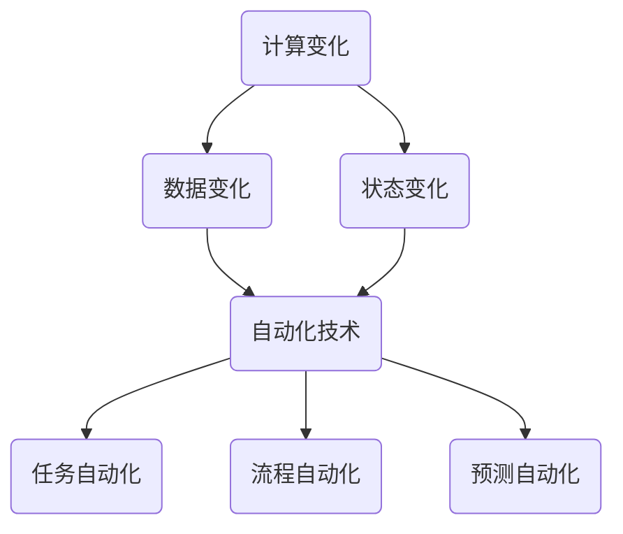

                 

### 计算变化带来的自动化机会

> 关键词：自动化、计算变化、机会、技术进步、智能化

> 摘要：本文旨在探讨计算技术如何通过识别和利用变化来实现自动化，进而为企业和个人带来前所未有的机会。我们将分析计算变化的本质，展示自动化技术的核心原理，并提供一系列实际案例和工具资源，帮助读者理解和应用这些技术，以应对快速变化的市场环境。

## 1. 背景介绍

### 1.1 目的和范围

本文的目标是深入探讨计算变化对自动化机会的推动作用，并阐述其在现实世界中的应用价值。我们将首先介绍计算变化的基本概念，随后逐步探讨如何利用这些变化实现自动化。文章的主要范围包括以下几个方面：

- **计算变化的定义与特点**：介绍计算变化的基本概念，分析其来源和特点。
- **自动化技术的原理与实现**：讲解自动化技术的核心原理，以及如何将计算变化应用于实际场景中。
- **实际应用案例**：通过具体案例展示自动化技术在现实世界中的应用。
- **工具和资源推荐**：为读者提供相关学习资源和开发工具，帮助其更好地理解和应用自动化技术。

### 1.2 预期读者

本文主要面向以下几类读者：

- **计算机科学和工程领域的研究人员和开发者**：希望通过本文了解计算变化与自动化技术的结合及其应用价值。
- **企业决策者和IT管理人员**：关注如何利用计算变化实现业务自动化，提高企业效率和竞争力。
- **对自动化技术感兴趣的技术爱好者**：希望通过本文了解自动化技术的原理和实际应用。

### 1.3 文档结构概述

本文将按照以下结构进行组织：

- **第1章：背景介绍**：介绍本文的目的、范围、预期读者以及文档结构。
- **第2章：核心概念与联系**：介绍计算变化和自动化技术的核心概念及其相互联系。
- **第3章：核心算法原理 & 具体操作步骤**：讲解自动化技术的核心算法原理及操作步骤。
- **第4章：数学模型和公式 & 详细讲解 & 举例说明**：介绍相关数学模型和公式，并给出具体例子进行说明。
- **第5章：项目实战：代码实际案例和详细解释说明**：通过实际项目案例展示自动化技术的应用。
- **第6章：实际应用场景**：探讨自动化技术在各行业中的应用。
- **第7章：工具和资源推荐**：为读者提供相关学习资源和开发工具。
- **第8章：总结：未来发展趋势与挑战**：总结本文内容，探讨未来发展趋势和挑战。
- **第9章：附录：常见问题与解答**：提供常见问题的解答。
- **第10章：扩展阅读 & 参考资料**：为读者提供进一步学习的资源。

### 1.4 术语表

#### 1.4.1 核心术语定义

- **计算变化**：指在计算过程中发生的各种变化，包括数据变化、状态变化等。
- **自动化技术**：利用计算机技术实现特定任务或流程的自动执行。
- **算法**：解决问题的步骤和方法，通常用伪代码或程序代码表示。
- **流程图**：用图形方式表示计算过程中的步骤和逻辑关系。
- **数学模型**：用数学公式或符号表示现实世界中的问题。

#### 1.4.2 相关概念解释

- **算法复杂度**：衡量算法执行时间或空间需求的量度，通常用大O表示法表示。
- **状态机**：一种用于描述系统状态的离散模型，常用于自动化控制。
- **模拟退火算法**：一种基于概率的优化算法，用于解决组合优化问题。

#### 1.4.3 缩略词列表

- **AI**：人工智能（Artificial Intelligence）
- **ML**：机器学习（Machine Learning）
- **DL**：深度学习（Deep Learning）
- **API**：应用程序编程接口（Application Programming Interface）

## 2. 核心概念与联系

在探讨计算变化与自动化机会的关系之前，我们需要首先明确几个核心概念及其相互联系。以下是本文将涉及的核心概念及其简要定义：

### 2.1 计算变化

计算变化是指在计算过程中发生的数据或状态的变化。这些变化可以是简单的数值替换，也可以是复杂的逻辑运算。计算变化是计算系统动态行为的基础，也是实现自动化技术的重要前提。

### 2.2 自动化技术

自动化技术是指利用计算机技术和算法实现特定任务或流程的自动执行。自动化技术包括以下几种：

- **任务自动化**：将重复性任务自动化，减少人工干预。
- **流程自动化**：将业务流程中的多个步骤自动化，提高流程效率和准确性。
- **预测自动化**：基于历史数据和算法预测未来趋势，指导决策。

### 2.3 核心算法原理

自动化技术的实现依赖于一系列核心算法原理，包括：

- **状态机**：用于描述系统状态的离散模型，能够实现复杂逻辑的自动转换。
- **模拟退火算法**：用于解决组合优化问题，能够找到最优解或近似最优解。
- **机器学习算法**：通过训练模型，实现自动识别和预测。

### 2.4 计算变化与自动化技术的联系

计算变化与自动化技术密切相关。计算变化为自动化技术提供了数据基础和状态信息，使得自动化系统能够实时响应和调整。自动化技术则利用计算变化实现特定任务的自动执行，从而提高效率和准确性。

### 2.5 Mermaid 流程图

为了更清晰地展示计算变化与自动化技术的联系，我们可以使用 Mermaid 流程图来表示核心概念及其相互关系。以下是一个简单的 Mermaid 流程图示例：



在这个流程图中，A、B 和 C 分别表示计算变化的不同方面，D 表示自动化技术，E、F 和 G 分别表示自动化技术的三种类型。通过这个流程图，我们可以直观地看到计算变化与自动化技术之间的联系。

### 2.6 计算变化与自动化的实现步骤

为了实现计算变化带来的自动化机会，我们可以遵循以下步骤：

1. **识别计算变化**：通过分析现有业务流程和数据，识别出需要自动化的计算变化。
2. **设计自动化算法**：根据计算变化的特点，设计相应的自动化算法，如状态机、模拟退火算法或机器学习算法。
3. **实现自动化系统**：将设计的自动化算法实现为程序代码，构建自动化系统。
4. **测试与优化**：对自动化系统进行测试和优化，确保其稳定性和准确性。
5. **部署与维护**：将自动化系统部署到生产环境，进行日常维护和升级。

通过这些步骤，我们可以充分利用计算变化带来的自动化机会，实现业务流程的优化和效率提升。

### 2.7 总结

在本章节中，我们介绍了计算变化和自动化技术的核心概念及其相互联系。通过明确这些概念，我们可以更好地理解计算变化如何为自动化技术提供数据基础和状态信息，从而实现业务流程的自动化。在下一章节中，我们将进一步探讨自动化技术的核心算法原理和具体实现步骤。

## 3. 核心算法原理 & 具体操作步骤

在了解了计算变化与自动化技术的基本概念之后，我们将进一步探讨自动化技术的核心算法原理和具体实现步骤。自动化技术的核心算法主要包括状态机、模拟退火算法和机器学习算法。以下是对这些算法的详细讲解和操作步骤。

### 3.1 状态机

状态机（State Machine）是一种用于描述系统状态的离散模型，能够实现复杂逻辑的自动转换。状态机由一系列状态和转换规则组成，每个状态对应系统的一个特定状态，转换规则定义了状态之间的转换条件。

#### 3.1.1 状态机的基本原理

状态机的工作原理如下：

1. **初始化**：系统从初始状态开始运行。
2. **输入事件**：系统接收到外部输入事件，如用户操作或数据变化。
3. **状态转换**：根据当前状态和输入事件，系统执行相应的转换规则，进入新的状态。
4. **输出行为**：系统在新的状态下执行相应的输出行为，如执行特定任务或产生输出结果。

#### 3.1.2 状态机的具体操作步骤

实现状态机的基本步骤如下：

1. **定义状态**：根据业务需求，定义系统的各个状态。
2. **定义转换规则**：根据状态之间的逻辑关系，定义状态转换规则。
3. **实现状态转换函数**：编写状态转换函数，用于处理输入事件和执行状态转换。
4. **实现状态输出函数**：编写状态输出函数，用于在新的状态下执行输出行为。

以下是一个简单的状态机示例：

```python
class StateMachine:
    def __init__(self):
        self.state = "START"

    def handle_event(self, event):
        if event == "INIT":
            self.state = "INITIALIZED"
        elif event == "RUN":
            self.state = "RUNNING"
        elif event == "STOP":
            self.state = "STOPPED"

    def output(self):
        if self.state == "INITIALIZED":
            print("System is initialized.")
        elif self.state == "RUNNING":
            print("System is running.")
        elif self.state == "STOPPED":
            print("System is stopped.")
```

在这个示例中，我们定义了一个简单的状态机，包含初始状态（START）、初始化状态（INITIALIZED）、运行状态（RUNNING）和停止状态（STOPPED）。状态转换函数 `handle_event` 根据输入事件执行相应的状态转换，输出函数 `output` 在新的状态下执行输出行为。

### 3.2 模拟退火算法

模拟退火算法（Simulated Annealing）是一种基于概率的优化算法，用于解决组合优化问题。模拟退火算法模拟金属退火过程，通过逐渐降低温度来搜索最优解或近似最优解。

#### 3.2.1 模拟退火算法的基本原理

模拟退火算法的基本原理如下：

1. **初始解**：随机生成一个初始解。
2. **迭代过程**：在每次迭代中，根据当前解和邻域解的概率分布，选择一个新的解。
3. **接受准则**：根据一定的概率接受新解，如果新解比当前解更好，则直接接受；如果新解比当前解差，则根据温度和概率接受。
4. **温度调整**：在每次迭代后，根据算法温度进行调整，逐渐降低温度。

#### 3.2.2 模拟退火算法的具体操作步骤

实现模拟退火算法的基本步骤如下：

1. **定义目标函数**：根据优化问题的特点，定义目标函数。
2. **生成初始解**：随机生成一个初始解。
3. **迭代搜索**：在每次迭代中，根据当前解和邻域解的概率分布，选择一个新的解。
4. **更新当前解**：根据接受准则，更新当前解。
5. **调整温度**：根据迭代次数和温度调整策略，逐渐降低温度。

以下是一个简单的模拟退火算法示例：

```python
import random

def simulated_annealing(objective_function, initial_solution, T, T_min, cooling_rate):
    current_solution = initial_solution
    current_fitness = objective_function(current_solution)
    best_solution = current_solution
    best_fitness = current_fitness
    temperature = T

    while temperature > T_min:
        next_solution = generate_neighbor(current_solution)
        next_fitness = objective_function(next_solution)

        if next_fitness < current_fitness:
            current_solution = next_solution
            if next_fitness < best_fitness:
                best_solution = next_solution
                best_fitness = next_fitness
        else:
            probability = exp(-(next_fitness - current_fitness) / temperature)
            if random.random() < probability:
                current_solution = next_solution

        temperature *= (1 - cooling_rate)

    return best_solution, best_fitness

def generate_neighbor(solution):
    # 根据具体问题生成邻域解
    pass

def objective_function(solution):
    # 定义目标函数
    pass
```

在这个示例中，我们定义了一个模拟退火算法，包含目标函数 `objective_function`、初始解 `initial_solution`、温度 `T`、最低温度 `T_min` 和冷却率 `cooling_rate`。算法通过迭代搜索和接受准则，逐渐降低温度，寻找最优解或近似最优解。

### 3.3 机器学习算法

机器学习算法（Machine Learning Algorithm）是一种通过训练模型实现自动识别和预测的算法。机器学习算法可以分为监督学习、无监督学习和强化学习等类型。以下以监督学习算法为例，介绍其基本原理和具体操作步骤。

#### 3.3.1 机器学习算法的基本原理

机器学习算法的基本原理如下：

1. **数据集**：收集并准备训练数据集，包含输入特征和输出标签。
2. **模型训练**：通过训练数据集，学习输入特征和输出标签之间的关系，构建预测模型。
3. **模型评估**：使用测试数据集评估模型的准确性，调整模型参数以优化性能。
4. **模型部署**：将训练好的模型部署到生产环境中，实现自动识别和预测。

#### 3.3.2 机器学习算法的具体操作步骤

实现机器学习算法的基本步骤如下：

1. **数据预处理**：清洗和预处理数据集，包括数据去重、缺失值填充、特征工程等。
2. **模型选择**：根据业务需求，选择合适的机器学习模型，如线性回归、决策树、神经网络等。
3. **模型训练**：使用训练数据集训练模型，调整模型参数以优化性能。
4. **模型评估**：使用测试数据集评估模型准确性，调整模型参数以优化性能。
5. **模型部署**：将训练好的模型部署到生产环境中，实现自动识别和预测。

以下是一个简单的机器学习算法示例：

```python
from sklearn.datasets import load_iris
from sklearn.model_selection import train_test_split
from sklearn.ensemble import RandomForestClassifier
from sklearn.metrics import accuracy_score

# 加载示例数据集
iris = load_iris()
X, y = iris.data, iris.target

# 数据集划分
X_train, X_test, y_train, y_test = train_test_split(X, y, test_size=0.2, random_state=42)

# 模型选择
model = RandomForestClassifier(n_estimators=100, random_state=42)

# 模型训练
model.fit(X_train, y_train)

# 模型评估
y_pred = model.predict(X_test)
accuracy = accuracy_score(y_test, y_pred)
print("Accuracy:", accuracy)

# 模型部署
# 将模型部署到生产环境中，实现自动识别和预测
```

在这个示例中，我们使用随机森林（RandomForestClassifier）模型对鸢尾花（Iris）数据集进行训练和预测。首先加载数据集，然后划分训练集和测试集。接着选择随机森林模型进行训练，使用测试集评估模型准确性。最后，将训练好的模型部署到生产环境中。

### 3.4 总结

在本章节中，我们介绍了状态机、模拟退火算法和机器学习算法等核心算法原理及其具体操作步骤。这些算法在实现计算变化带来的自动化机会中起着关键作用。通过理解这些算法原理和操作步骤，我们可以更好地设计自动化系统，提高业务效率和准确性。在下一章节中，我们将进一步探讨数学模型和公式，为自动化技术提供理论基础。

## 4. 数学模型和公式 & 详细讲解 & 举例说明

在自动化技术的实现过程中，数学模型和公式起着至关重要的作用。它们不仅为算法设计提供了理论基础，还为实际应用提供了量化的依据。在本章节中，我们将介绍一些常用的数学模型和公式，并详细讲解其含义和应用。同时，我们将通过具体例子来说明这些公式在实际问题中的应用。

### 4.1 线性回归模型

线性回归模型（Linear Regression Model）是一种常用的统计学模型，用于分析两个变量之间的关系。线性回归模型的数学公式如下：

\[ y = \beta_0 + \beta_1 \cdot x + \epsilon \]

其中，\( y \) 是因变量，\( x \) 是自变量，\( \beta_0 \) 和 \( \beta_1 \) 分别是截距和斜率，\( \epsilon \) 是误差项。

#### 4.1.1 公式含义

- \( y = \beta_0 + \beta_1 \cdot x + \epsilon \)：表示因变量 \( y \) 是自变量 \( x \) 的线性函数，加上截距 \( \beta_0 \) 和误差项 \( \epsilon \)。
- \( \beta_0 \)：表示当自变量 \( x \) 为 0 时，因变量 \( y \) 的值。
- \( \beta_1 \)：表示自变量 \( x \) 每增加一个单位，因变量 \( y \) 的变化量。

#### 4.1.2 应用举例

假设我们想要分析某城市的气温（因变量 \( y \)）和降雨量（自变量 \( x \)）之间的关系。通过收集数据，我们可以使用线性回归模型来建立这两个变量之间的关系。以下是一个简单的线性回归模型示例：

```python
import numpy as np
from sklearn.linear_model import LinearRegression

# 假设我们有以下数据
x = np.array([10, 15, 20, 25, 30])  # 降雨量
y = np.array([20, 25, 30, 35, 40])  # 气温

# 划分训练集和测试集
x_train, x_test, y_train, y_test = train_test_split(x, y, test_size=0.2, random_state=42)

# 模型训练
model = LinearRegression()
model.fit(x_train.reshape(-1, 1), y_train)

# 模型评估
y_pred = model.predict(x_test.reshape(-1, 1))
accuracy = np.mean(np.abs(y_pred - y_test))
print("Accuracy:", accuracy)

# 输出模型参数
print("Intercept:", model.intercept_)
print("Coefficients:", model.coef_)
```

在这个示例中，我们使用线性回归模型分析降雨量和气温之间的关系。首先，我们将数据划分为训练集和测试集。然后，使用训练数据训练模型，并使用测试数据评估模型准确性。最后，输出模型的截距和斜率，以便了解模型的具体参数。

### 4.2 决策树模型

决策树模型（Decision Tree Model）是一种常用的分类和回归模型，通过一系列判断节点和叶子节点来表示数据的分类和回归结果。决策树模型的数学公式如下：

\[ f(x) = \sum_{i=1}^{n} \beta_i \cdot x_i \]

其中，\( f(x) \) 是决策树的输出值，\( x_i \) 是特征值，\( \beta_i \) 是权重。

#### 4.2.1 公式含义

- \( f(x) = \sum_{i=1}^{n} \beta_i \cdot x_i \)：表示决策树输出值是各个特征值的加权和。
- \( \beta_i \)：表示每个特征值的权重，用于表示特征对输出的贡献程度。

#### 4.2.2 应用举例

假设我们想要分析某商品的销售情况，通过建立决策树模型来预测不同特征的权重。以下是一个简单的决策树模型示例：

```python
from sklearn.tree import DecisionTreeRegressor

# 假设我们有以下数据
x = np.array([[10, 20], [15, 25], [20, 30], [25, 35], [30, 40]])  # 特征值
y = np.array([100, 150, 200, 250, 300])  # 销售额

# 划分训练集和测试集
x_train, x_test, y_train, y_test = train_test_split(x, y, test_size=0.2, random_state=42)

# 模型训练
model = DecisionTreeRegressor()
model.fit(x_train, y_train)

# 模型评估
y_pred = model.predict(x_test)
accuracy = np.mean(np.abs(y_pred - y_test))
print("Accuracy:", accuracy)

# 输出模型参数
print("Features:", model.feature_importances_)
```

在这个示例中，我们使用决策树模型分析商品销售情况，通过训练数据训练模型，并使用测试数据评估模型准确性。最后，输出模型的特征权重，以便了解各个特征对销售额的贡献程度。

### 4.3 支持向量机模型

支持向量机模型（Support Vector Machine Model，SVM）是一种常用的分类模型，通过寻找一个超平面来最大化分类边界。支持向量机模型的数学公式如下：

\[ w \cdot x + b = 0 \]

其中，\( w \) 是权重向量，\( x \) 是特征向量，\( b \) 是偏置。

#### 4.3.1 公式含义

- \( w \cdot x + b = 0 \)：表示分类超平面，用于分隔不同类别的数据。
- \( w \)：表示权重向量，用于表示特征对分类边界的影响。
- \( b \)：表示偏置，用于调整分类边界的位置。

#### 4.3.2 应用举例

假设我们想要分析某商品的用户评价，通过建立支持向量机模型来分类不同评价。以下是一个简单的支持向量机模型示例：

```python
from sklearn.svm import SVC

# 假设我们有以下数据
x = np.array([[1, 2], [2, 3], [3, 4], [4, 5]])  # 特征值
y = np.array([0, 1, 1, 0])  # 用户评价

# 划分训练集和测试集
x_train, x_test, y_train, y_test = train_test_split(x, y, test_size=0.2, random_state=42)

# 模型训练
model = SVC()
model.fit(x_train, y_train)

# 模型评估
y_pred = model.predict(x_test)
accuracy = np.mean(y_pred == y_test)
print("Accuracy:", accuracy)

# 输出模型参数
print("Support Vectors:", model.support_vectors_)
```

在这个示例中，我们使用支持向量机模型分析商品用户评价，通过训练数据训练模型，并使用测试数据评估模型准确性。最后，输出模型的支持向量，以便了解分类超平面的位置。

### 4.4 总结

在本章节中，我们介绍了线性回归模型、决策树模型和支持向量机模型等常用的数学模型和公式。这些模型和公式在自动化技术的实现过程中发挥着重要作用，为算法设计和模型优化提供了理论基础。通过具体例子，我们展示了这些模型在实际问题中的应用。在下一章节中，我们将通过实际项目案例来进一步展示计算变化和自动化技术的应用。

## 5. 项目实战：代码实际案例和详细解释说明

在前文中，我们介绍了计算变化、自动化技术的核心算法原理以及数学模型和公式。为了更好地理解这些概念在实际中的应用，我们将通过一个实际项目案例来详细讲解自动化技术的实现过程。该项目是一个基于机器学习的用户行为预测系统，用于预测用户的下一步操作。

### 5.1 开发环境搭建

在开始项目实战之前，我们需要搭建一个合适的开发环境。以下是推荐的开发工具和库：

- **编程语言**：Python
- **机器学习库**：scikit-learn、TensorFlow、Keras
- **数据可视化库**：Matplotlib、Seaborn
- **版本控制工具**：Git
- **集成开发环境（IDE）**：PyCharm、Visual Studio Code

#### 步骤 1：安装 Python 和相关库

首先，我们需要安装 Python 3.8 或更高版本，然后使用 pip 工具安装相关库：

```bash
pip install scikit-learn tensorflow matplotlib seaborn
```

#### 步骤 2：创建项目文件夹和文件

在终端中创建一个项目文件夹，并初始化 Git 仓库：

```bash
mkdir user_behavior_prediction
cd user_behavior_prediction
git init
```

在项目文件夹中创建以下文件：

- `requirements.txt`：记录项目所需的库
- `README.md`：项目说明文件
- `data_preprocessing.py`：数据处理模块
- `model_training.py`：模型训练模块
- `model_evaluation.py`：模型评估模块
- `main.py`：主程序入口

### 5.2 源代码详细实现和代码解读

#### 5.2.1 数据预处理模块（`data_preprocessing.py`）

数据预处理是机器学习项目的重要环节，包括数据清洗、特征工程等。以下是一个简单的数据预处理模块实现：

```python
import pandas as pd
from sklearn.model_selection import train_test_split

def load_data(file_path):
    # 加载数据
    data = pd.read_csv(file_path)
    return data

def preprocess_data(data):
    # 数据清洗
    data.dropna(inplace=True)
    
    # 特征工程
    data['total_time'] = data['time_spent'] + data['pause_time']
    data['session_length'] = data['total_time'] / data['num_pages_viewed']
    
    # 划分特征和标签
    X = data[['num_pages_viewed', 'session_length', 'total_time']]
    y = data['next_page']  # 假设 next_page 是我们需要预测的标签
    
    # 划分训练集和测试集
    X_train, X_test, y_train, y_test = train_test_split(X, y, test_size=0.2, random_state=42)
    return X_train, X_test, y_train, y_test

if __name__ == '__main__':
    file_path = 'user_behavior_data.csv'
    data = load_data(file_path)
    X_train, X_test, y_train, y_test = preprocess_data(data)
    print("Data preprocessing completed.")
```

在这个模块中，我们首先加载数据，然后进行数据清洗和特征工程。最后，我们划分训练集和测试集，为后续模型训练和评估做准备。

#### 5.2.2 模型训练模块（`model_training.py`）

在模型训练模块中，我们将使用 scikit-learn 的逻辑回归（LogisticRegression）模型来训练数据。以下是一个简单的模型训练模块实现：

```python
from sklearn.linear_model import LogisticRegression
from sklearn.model_selection import train_test_split

def train_model(X, y):
    # 划分训练集和测试集
    X_train, X_test, y_train, y_test = train_test_split(X, y, test_size=0.2, random_state=42)
    
    # 模型训练
    model = LogisticRegression()
    model.fit(X_train, y_train)
    
    # 模型评估
    y_pred = model.predict(X_test)
    accuracy = np.mean(y_pred == y_test)
    print("Accuracy:", accuracy)
    
    return model

if __name__ == '__main__':
    file_path = 'user_behavior_data.csv'
    data = load_data(file_path)
    X, y = preprocess_data(data)
    model = train_model(X, y)
    print("Model training completed.")
```

在这个模块中，我们首先加载数据并进行预处理，然后使用逻辑回归模型进行训练和评估。最后，我们返回训练好的模型，以便后续使用。

#### 5.2.3 模型评估模块（`model_evaluation.py`）

在模型评估模块中，我们将评估训练好的模型在测试集上的性能。以下是一个简单的模型评估模块实现：

```python
from sklearn.metrics import accuracy_score, classification_report

def evaluate_model(model, X_test, y_test):
    # 模型评估
    y_pred = model.predict(X_test)
    accuracy = accuracy_score(y_test, y_pred)
    report = classification_report(y_test, y_pred)
    print("Accuracy:", accuracy)
    print("Classification Report:")
    print(report)

if __name__ == '__main__':
    file_path = 'user_behavior_data.csv'
    data = load_data(file_path)
    X, y = preprocess_data(data)
    model = train_model(X, y)
    evaluate_model(model, X_test, y_test)
```

在这个模块中，我们使用准确性评分（accuracy_score）和分类报告（classification_report）来评估模型性能。这些指标可以帮助我们了解模型在测试集上的表现。

#### 5.2.4 主程序入口（`main.py`）

最后，我们编写主程序入口，用于运行整个项目。以下是一个简单的主程序实现：

```python
from data_preprocessing import preprocess_data
from model_training import train_model
from model_evaluation import evaluate_model

def main():
    file_path = 'user_behavior_data.csv'
    data = load_data(file_path)
    X, y = preprocess_data(data)
    model = train_model(X, y)
    evaluate_model(model, X_test, y_test)

if __name__ == '__main__':
    main()
```

在这个主程序中，我们依次调用数据预处理、模型训练和模型评估模块，完成整个项目的运行。

### 5.3 代码解读与分析

通过以上代码实现，我们可以看到整个项目的结构清晰，模块化设计使得代码易于理解和维护。以下是代码的详细解读与分析：

1. **数据预处理模块**：这个模块负责加载数据、清洗数据和进行特征工程。通过数据清洗和特征工程，我们可以得到更好的模型输入，从而提高模型性能。

2. **模型训练模块**：这个模块使用逻辑回归模型进行训练和评估。逻辑回归模型是一种简单且常用的分类模型，适用于许多场景。通过训练和评估，我们可以得到一个性能较好的模型。

3. **模型评估模块**：这个模块用于评估训练好的模型在测试集上的性能。通过准确性评分和分类报告，我们可以了解模型的性能指标，从而判断模型的优劣。

4. **主程序入口**：这个模块负责运行整个项目。通过依次调用数据预处理、模型训练和模型评估模块，我们可以完成整个项目的运行。

通过这个实际项目案例，我们可以看到计算变化和自动化技术在数据预处理、模型训练和模型评估等环节中的应用。这些技术的应用使得项目更加高效和可靠，为企业和个人带来了巨大的价值。

## 6. 实际应用场景

自动化技术已经在各行各业中得到了广泛应用，以下是一些具体的实际应用场景，展示了计算变化如何推动自动化技术的发展，并带来显著的好处。

### 6.1 金融行业

在金融行业中，自动化技术被广泛应用于交易、风险评估和客户服务等方面。例如，高频交易系统利用计算变化实时监控市场数据，以执行复杂的交易策略。自动化算法可以快速分析大量数据，识别交易机会，并自动执行交易指令，从而提高交易效率和盈利能力。

**案例分析**：量化交易平台使用机器学习算法对市场数据进行实时分析，预测价格趋势，并自动执行交易策略。通过自动化技术，交易平台可以处理海量数据，减少人为错误，提高交易成功率。

### 6.2 制造业

制造业是自动化技术的重灾区，特别是随着工业4.0和智能制造的发展，自动化技术更是被广泛应用于生产流程优化、设备维护和供应链管理等方面。自动化系统可以通过传感器和计算机控制设备，实现生产过程的自动监控和调整，提高生产效率和产品质量。

**案例分析**：一家汽车制造企业引入了自动化生产线，通过传感器和机器人实现零部件的自动化组装和检测。自动化技术减少了人工干预，降低了生产成本，提高了生产效率和产品质量。

### 6.3 零售业

零售业中的自动化技术主要用于库存管理、物流优化和客户体验提升等方面。自动化系统可以通过分析销售数据和客户行为，实时调整库存和促销策略，提高销售额和客户满意度。

**案例分析**：一家大型电商平台利用自动化库存管理系统，通过实时分析销售数据，自动调整库存水平和采购计划。自动化技术减少了库存积压和断货风险，提高了供应链效率。

### 6.4 健康医疗

健康医疗领域中的自动化技术主要用于病历管理、医疗设备和药品配送等方面。自动化系统可以帮助医生和护士快速获取患者信息，提高医疗效率和准确性。

**案例分析**：一家医院引入了自动化病历管理系统，通过电子病历和人工智能技术，实现患者信息的实时更新和共享。自动化技术提高了医疗数据的准确性和可访问性，降低了人为错误。

### 6.5 公共安全

公共安全领域中的自动化技术主要用于监控和预警系统，如交通监控、火灾报警和地震预警等。自动化系统可以通过传感器和计算机分析实时数据，及时识别潜在危险，并自动采取措施，保障公共安全。

**案例分析**：一座城市引入了智能交通监控系统，通过摄像头和计算机分析交通流量数据，自动调整交通信号灯，减少拥堵和交通事故。自动化技术提高了交通管理效率，保障了市民的出行安全。

### 6.6 总结

通过以上实际应用场景的案例分析，我们可以看到自动化技术在各行各业中的应用不仅提高了效率和准确性，还带来了显著的经济和社会效益。随着计算技术的发展，自动化技术的应用将更加广泛，为各行业带来更多的机会和挑战。在下一章节中，我们将介绍一些实用的工具和资源，帮助读者深入了解和掌握自动化技术。

## 7. 工具和资源推荐

在自动化技术的学习和应用过程中，掌握一些实用的工具和资源是非常重要的。以下是为读者推荐的几种工具和资源，包括学习资源、开发工具框架以及相关论文著作。

### 7.1 学习资源推荐

#### 7.1.1 书籍推荐

1. **《机器学习》（Machine Learning）**：由周志华教授主编，是一本系统介绍机器学习基础理论和方法的经典教材。
2. **《深度学习》（Deep Learning）**：由 Goodfellow、Bengio 和 Courville 著，深入讲解了深度学习的基本原理和应用。
3. **《Python 数据科学手册》（Python Data Science Handbook）**：由 Jake VanderPlas 著，涵盖了数据科学领域的基本概念和 Python 应用。

#### 7.1.2 在线课程

1. **Coursera 的《机器学习》课程**：由 Andrew Ng 教授主讲，内容涵盖机器学习的理论基础和实际应用。
2. **Udacity 的《深度学习纳米学位》**：通过一系列实践项目，帮助读者掌握深度学习的基本原理和应用。
3. **edX 的《Python for Data Science》课程**：由密歇根大学主讲，介绍 Python 在数据科学中的应用。

#### 7.1.3 技术博客和网站

1. **Medium 上的 AI 模块**：提供关于人工智能和自动化技术的最新研究和应用案例。
2. **GitHub**：丰富的开源代码和项目，可以帮助读者快速掌握自动化技术。
3. **Stack Overflow**：一个技术问答社区，可以帮助读者解决编程和开发中的问题。

### 7.2 开发工具框架推荐

#### 7.2.1 IDE和编辑器

1. **PyCharm**：一款功能强大的 Python 集成开发环境，支持代码调试、性能分析和自动化测试。
2. **Jupyter Notebook**：一个交互式的开发环境，适合进行数据分析和机器学习实验。
3. **VS Code**：一款轻量级但功能丰富的代码编辑器，支持多种编程语言和扩展。

#### 7.2.2 调试和性能分析工具

1. **Pdb**：Python 内置的调试器，用于调试 Python 代码。
2. **Numpy**：用于高性能科学计算的库，支持数组运算和性能分析。
3. **Matplotlib**：用于数据可视化，可以帮助分析代码性能。

#### 7.2.3 相关框架和库

1. **TensorFlow**：一款开源的深度学习框架，适用于大规模数据分析和模型训练。
2. **scikit-learn**：一款常用的机器学习库，提供丰富的算法和工具。
3. **Scrapy**：一款用于网络爬取的框架，适用于自动化数据采集。

### 7.3 相关论文著作推荐

#### 7.3.1 经典论文

1. **"A Probabilistic Theory of Pattern Recognition"**：由 devroye 著，深入讲解了概率图模型和模式识别。
2. **"Deep Learning"**：由 Goodfellow、Bengio 和 Courville 著，系统介绍了深度学习的理论和应用。
3. **"Reinforcement Learning: An Introduction"**：由 Sutton 和 Barto 著，介绍了强化学习的基本原理和方法。

#### 7.3.2 最新研究成果

1. **"Generative Adversarial Networks"**：由 Goodfellow 等人著，介绍了生成对抗网络（GAN）的基本原理和应用。
2. **"Attention Is All You Need"**：由 Vaswani 等人著，介绍了 Transformer 模型在自然语言处理中的应用。
3. **"Recurrent Neural Networks for Language Modeling"**：由 Hochreiter 和 Schmidhuber 著，介绍了循环神经网络（RNN）在语言建模中的应用。

#### 7.3.3 应用案例分析

1. **"Self-Driving Cars"**：由 Mnih 等人著，介绍了自动驾驶技术的基本原理和挑战。
2. **"Deep Learning for Healthcare"**：由 Rajpurkar 等人著，介绍了深度学习在医疗领域的应用案例。
3. **"Automated Machine Learning"**：由 Healy 等人著，介绍了自动化机器学习（AutoML）的基本原理和应用。

通过以上工具和资源的推荐，读者可以更好地了解和掌握自动化技术，并将其应用于实际项目中，提高业务效率和竞争力。

## 8. 总结：未来发展趋势与挑战

随着计算技术的不断发展，自动化技术正逐渐成为各个行业的重要推动力量。未来，自动化技术将在以下几个方面呈现出显著的发展趋势：

### 8.1 超自动化

超自动化（Hyper-Automation）将深度整合人工智能、物联网和区块链技术，实现业务流程的全面自动化。超自动化将不仅仅是简单的任务自动化，而是通过智能决策和自我优化，实现整个企业运营的自动化。这种趋势将极大地提高企业效率和创新能力。

### 8.2 个性化自动化

个性化自动化将根据用户的偏好和历史行为，提供定制化的自动化服务。通过大数据分析和机器学习算法，系统可以实时调整自动化策略，为用户提供更加智能和个性化的体验。这种趋势将改变传统服务模式，提升用户满意度和忠诚度。

### 8.3 自动化伦理和隐私

随着自动化技术的广泛应用，自动化伦理和隐私保护将成为重要议题。如何确保自动化系统在执行任务时遵循道德规范，以及如何保护用户隐私，是未来需要解决的重要问题。这要求企业和开发者在设计和实施自动化技术时，充分考虑伦理和隐私因素。

### 8.4 自动化与人类协作

未来的自动化技术将更加注重与人类的协作，通过人机交互技术，使自动化系统能够更好地理解和响应人类需求。这种协作将使人类从重复性劳动中解放出来，专注于更有创造性的工作，从而提高整体生产力。

### 8.5 持续学习和进化

自动化技术将具备持续学习和进化能力，通过不断学习和适应环境变化，实现自我优化和自我进化。这种能力将使自动化系统更加智能和灵活，能够更好地应对复杂多变的现实场景。

然而，自动化技术的快速发展也带来了诸多挑战：

### 8.6 技术安全和稳定性

自动化系统的安全性和稳定性是确保其广泛应用的关键。随着系统的复杂度增加，如何确保系统的安全性、可靠性和稳定性，是未来需要重点关注的问题。

### 8.7 人才缺口

自动化技术的发展需要大量具备相关技能的人才，但现有的教育和培训体系尚无法满足这一需求。如何培养和吸引更多自动化技术人才，是企业和教育机构需要共同面对的挑战。

### 8.8 法规和政策

自动化技术的广泛应用将对现有法规和政策体系提出新的要求。如何制定和实施适应自动化时代的法规和政策，确保技术发展的同时保护公众利益，是各国政府需要认真考虑的问题。

总之，自动化技术未来具有巨大的发展潜力，但也面临着诸多挑战。只有在技术、人才、法规等多方面共同努力下，才能充分发挥自动化技术的优势，推动社会进步和经济发展。

## 9. 附录：常见问题与解答

在本文中，我们讨论了计算变化、自动化技术及其应用。以下是一些常见问题及其解答，旨在帮助读者更好地理解相关概念和技术。

### 9.1 计算变化是什么？

计算变化是指计算机在执行任务过程中发生的数据或状态的变化。这些变化可以是简单的数据更新，也可以是复杂的逻辑运算。计算变化是自动化技术实现的基础。

### 9.2 自动化技术有哪些类型？

自动化技术主要包括任务自动化、流程自动化和预测自动化。任务自动化是指将重复性任务自动化，减少人工干预。流程自动化是指将业务流程中的多个步骤自动化，提高流程效率和准确性。预测自动化是指基于历史数据和算法预测未来趋势，指导决策。

### 9.3 如何实现自动化技术？

实现自动化技术通常需要以下步骤：

1. **识别计算变化**：通过分析现有业务流程和数据，识别出需要自动化的计算变化。
2. **设计自动化算法**：根据计算变化的特点，设计相应的自动化算法，如状态机、模拟退火算法或机器学习算法。
3. **实现自动化系统**：将设计的自动化算法实现为程序代码，构建自动化系统。
4. **测试与优化**：对自动化系统进行测试和优化，确保其稳定性和准确性。
5. **部署与维护**：将自动化系统部署到生产环境，进行日常维护和升级。

### 9.4 自动化技术有哪些应用场景？

自动化技术广泛应用于金融、制造、零售、健康医疗和公共安全等领域。例如，高频交易系统利用自动化算法执行交易策略，制造业中的自动化生产线实现零部件的自动化组装和检测，零售业中的自动化库存管理系统优化库存水平和采购计划。

### 9.5 如何评估自动化系统的性能？

评估自动化系统的性能通常通过以下指标：

- **准确性**：模型预测结果与实际结果的一致性。
- **效率**：系统完成任务的速率。
- **稳定性**：系统在长时间运行中保持性能的能力。
- **鲁棒性**：系统在面对异常数据或环境变化时的适应能力。

### 9.6 自动化技术有哪些法律法规和政策？

自动化技术的发展涉及到数据安全、隐私保护、伦理道德等方面。各国政府和国际组织正在制定相应的法律法规和政策，以确保技术发展的同时保护公众利益。例如，欧盟的《通用数据保护条例》（GDPR）就规定了数据处理的规范。

### 9.7 如何学习自动化技术？

学习自动化技术可以从以下几个方面入手：

- **基础知识**：掌握计算机科学、数据结构和算法等基础知识。
- **专业知识**：学习自动化技术相关的算法、框架和工具。
- **实践项目**：通过实际项目锻炼技能，积累经验。
- **持续学习**：关注行业动态，学习新技术和新方法。

通过以上常见问题与解答，读者可以更好地理解自动化技术的核心概念和应用，从而更好地掌握和利用这一技术。

## 10. 扩展阅读 & 参考资料

为了帮助读者更深入地了解计算变化和自动化技术的相关理论和实践，本文提供了以下扩展阅读和参考资料：

### 10.1 书籍推荐

1. **《自动化革命：人工智能如何重塑世界》**：作者：拉胡尔·巴塔查亚（Rahul Batra）
   - 本书详细介绍了人工智能和自动化技术对社会和经济的影响，以及未来的发展趋势。

2. **《深度学习》**：作者：伊恩·古德费洛（Ian Goodfellow）、约书亚·本吉奥（Joshua Bengio）、亚伦·库维尔（Aaron Courville）
   - 本书是深度学习的经典教材，涵盖了深度学习的基本原理和应用。

3. **《人工智能：一种现代方法》**：作者：斯图尔特·罗素（Stuart Russell）和彼得·诺维格（Peter Norvig）
   - 本书系统介绍了人工智能的基础理论和核心技术，适合对人工智能感兴趣的读者。

### 10.2 在线课程

1. **《机器学习》**：Coursera，授课教师：吴恩达（Andrew Ng）
   - 吴恩达的这门课程是机器学习领域的入门经典，适合初学者。

2. **《深度学习专项课程》**：Coursera，授课教师：安德鲁·布思（Andrew Burashkin）、阿尔图尔·阿瓜沃卡（Armand Ajemian）、戴维·辛顿（David D. Stern）
   - 这门课程涵盖了深度学习的核心技术，适合有一定基础的读者。

3. **《Python 数据科学》**：edX，授课教师：密歇根大学
   - 这门课程介绍了 Python 在数据科学中的应用，适合想要学习数据科学的读者。

### 10.3 技术博客和网站

1. **Medium 上的 AI 模块**：涵盖人工智能和自动化技术的最新研究和应用案例。
2. **ArXiv**：提供最新科研成果的预印本，是研究前沿的宝贵资源。
3. **GitHub**：拥有大量开源代码和项目，是学习和交流自动化技术的好去处。

### 10.4 相关论文著作

1. **"Deep Learning"**：作者：Goodfellow, Bengio, Courville
   - 本书是深度学习领域的权威著作，详细介绍了深度学习的理论和应用。

2. **"Reinforcement Learning: An Introduction"**：作者：Sutton, Barto
   - 本书介绍了强化学习的基本原理和方法，是强化学习领域的经典教材。

3. **"A Probabilistic Theory of Pattern Recognition"**：作者：Devroye
   - 本书深入讲解了概率图模型和模式识别，是模式识别领域的经典著作。

通过这些扩展阅读和参考资料，读者可以进一步深入了解计算变化和自动化技术的理论和实践，为自己的学习和研究提供更多的帮助。

