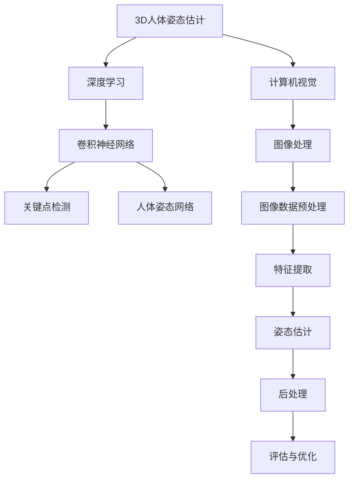

                 

# 计算机视觉在3D人体姿态估计中的应用

> 关键词：计算机视觉、3D人体姿态估计、深度学习、算法原理、实际应用、项目实战

> 摘要：本文将深入探讨计算机视觉在3D人体姿态估计中的应用，从背景介绍、核心概念、算法原理、数学模型、项目实战等多个角度进行详细讲解。文章旨在为广大计算机视觉爱好者和技术工作者提供一份全面的技术参考，以帮助理解和掌握这一领域的核心知识和实践技巧。

## 1. 背景介绍

### 1.1 目的和范围

本文的主要目的是探讨计算机视觉在3D人体姿态估计中的应用，并详细介绍相关的核心概念、算法原理和实践技巧。3D人体姿态估计作为计算机视觉领域的一个重要研究方向，具有广泛的应用前景，如虚拟现实、游戏开发、运动分析、智能监控等。通过本文的介绍，读者可以了解这一领域的最新进展和应用实例，从而为相关项目的开发和实现提供参考。

### 1.2 预期读者

本文适合对计算机视觉和深度学习有初步了解的读者，包括计算机科学、人工智能、图像处理等相关专业的学生、研究人员和工程师。同时，对于对3D人体姿态估计感兴趣的领域专家和爱好者，本文也具有一定的参考价值。

### 1.3 文档结构概述

本文结构如下：

1. 背景介绍：介绍3D人体姿态估计的背景、目的和范围。
2. 核心概念与联系：介绍3D人体姿态估计的核心概念、相关技术和联系。
3. 核心算法原理 & 具体操作步骤：详细讲解3D人体姿态估计的核心算法原理和具体操作步骤。
4. 数学模型和公式 & 详细讲解 & 举例说明：介绍3D人体姿态估计的数学模型、公式及其应用。
5. 项目实战：通过实际项目案例展示3D人体姿态估计的应用和实践。
6. 实际应用场景：分析3D人体姿态估计在不同领域的实际应用场景。
7. 工具和资源推荐：推荐相关的学习资源、开发工具和论文著作。
8. 总结：总结3D人体姿态估计的未来发展趋势与挑战。
9. 附录：常见问题与解答。
10. 扩展阅读 & 参考资料：提供进一步阅读的文献和参考资料。

### 1.4 术语表

#### 1.4.1 核心术语定义

- 3D人体姿态估计：指通过计算机视觉技术对三维空间中的人体姿态进行估计和重建。
- 深度学习：一种基于人工神经网络的机器学习方法，通过多层神经网络对大量数据进行训练和优化，从而实现复杂模式识别和预测任务。
- 卷积神经网络（CNN）：一种基于卷积操作的深度学习模型，广泛应用于图像和视频处理任务。
- 关键点检测：指在图像中检测出人体的关键部位，如关节点、面部特征等。
- 人体姿态网络：一种专门用于人体姿态估计的深度学习模型，通过学习图像特征和人体关键点之间的关系，实现对人体姿态的准确估计。

#### 1.4.2 相关概念解释

- 人体姿态：指三维空间中人体的各种姿态和动作，如站立、跑步、跳跃等。
- 关键点：指人体关节和面部特征等关键部位的坐标位置。
- 数据集：用于训练和测试深度学习模型的图像和标注数据。
- 标注数据：对图像中的人体姿态和关键点进行标注，用于训练和评估深度学习模型。

#### 1.4.3 缩略词列表

- CNN：卷积神经网络（Convolutional Neural Network）
- DNN：深度神经网络（Deep Neural Network）
- RNN：递归神经网络（Recurrent Neural Network）
- LSTM：长短期记忆网络（Long Short-Term Memory）
- GPU：图形处理单元（Graphics Processing Unit）
- CPU：中央处理单元（Central Processing Unit）
- RGB：红绿蓝颜色模型（Red, Green, Blue）

## 2. 核心概念与联系

为了更好地理解3D人体姿态估计，我们首先需要了解一些相关的核心概念和联系。以下是一个简化的Mermaid流程图，展示了3D人体姿态估计的核心概念和它们之间的关系。



### 2.1 核心概念解释

- **3D人体姿态估计**：指通过计算机视觉技术，从二维图像或视频中估计出三维空间中人体的姿态。这个过程通常包括关键点检测、姿态估计和后处理等步骤。
- **计算机视觉**：是人工智能的一个重要分支，研究如何让计算机像人类一样理解和解释视觉信息。在3D人体姿态估计中，计算机视觉用于图像的预处理、特征提取和姿态估计等任务。
- **深度学习**：是一种基于多层神经网络的学习方法，能够自动从大量数据中提取特征并进行模式识别。在3D人体姿态估计中，深度学习模型（如卷积神经网络）被广泛应用于关键点检测和姿态估计任务。
- **图像处理**：是计算机视觉的基础技术，包括图像的预处理、增强、分割、特征提取等。在3D人体姿态估计中，图像处理技术用于对输入图像进行预处理，以便更好地提取特征。
- **卷积神经网络（CNN）**：是一种深度学习模型，通过卷积操作提取图像特征，并在多个卷积层中逐步细化特征表示。在3D人体姿态估计中，CNN被广泛应用于关键点检测和姿态估计任务。
- **关键点检测**：指在图像中检测出人体的关键部位，如关节点、面部特征等。关键点检测是3D人体姿态估计的基础，对于后续的姿态估计和后处理至关重要。
- **人体姿态网络**：是一种专门用于人体姿态估计的深度学习模型，通过学习图像特征和人体关键点之间的关系，实现对人体姿态的准确估计。人体姿态网络通常由多个卷积层和全连接层组成，能够处理复杂的姿态变化。

### 2.2 相关技术联系

- **计算机视觉与深度学习的关系**：计算机视觉是深度学习的一个应用领域，深度学习为计算机视觉提供了强大的模型和算法支持。在3D人体姿态估计中，深度学习模型（如CNN）被广泛应用于关键点检测和姿态估计任务。
- **图像处理与深度学习的关系**：图像处理是计算机视觉的基础技术，深度学习模型（如CNN）在图像处理的基础上提取更高级的特征表示。在3D人体姿态估计中，图像处理技术用于对输入图像进行预处理，以便更好地提取特征。
- **关键点检测与姿态估计的关系**：关键点检测是姿态估计的基础，通过检测出人体的关键部位，可以进一步估计出人体的整体姿态。在3D人体姿态估计中，关键点检测和姿态估计是紧密相连的两个步骤。

通过以上对核心概念和联系的介绍，我们可以更好地理解3D人体姿态估计的原理和应用。接下来，我们将深入探讨3D人体姿态估计的核心算法原理和具体操作步骤。

## 3. 核心算法原理 & 具体操作步骤

### 3.1 算法原理

3D人体姿态估计的核心算法主要包括关键点检测和姿态估计两个步骤。关键点检测通过在二维图像中定位出人体的关键部位，如关节点、面部特征等；姿态估计则通过将关键点映射到三维空间，从而恢复出人体的姿态。

#### 关键点检测

关键点检测的算法原理通常基于卷积神经网络（CNN）或其他深度学习模型。以下是一个简化的伪代码，描述了关键点检测的过程：

```python
def keypoint_detection(image):
    # 步骤1：图像预处理
    preprocessed_image = preprocess_image(image)

    # 步骤2：特征提取
    features = extract_features(preprocessed_image)

    # 步骤3：关键点预测
    keypoints = predict_keypoints(features)

    # 步骤4：后处理
    refined_keypoints = refine_keypoints(keypoints)

    return refined_keypoints
```

- **图像预处理**：对输入图像进行缩放、裁剪、归一化等操作，以便更好地适应深度学习模型。
- **特征提取**：利用卷积神经网络从图像中提取特征表示，通常包括多层卷积和池化操作。
- **关键点预测**：通过全连接层或其他非线性变换，将特征表示映射到关键点坐标。
- **后处理**：对预测的关键点进行校正和优化，以消除噪声和误差。

#### 姿态估计

姿态估计的算法原理是将关键点坐标映射到三维空间，从而恢复出人体的姿态。以下是一个简化的伪代码，描述了姿态估计的过程：

```python
def pose_estimation(keypoints, camera_matrix, depth_map=None):
    # 步骤1：关键点坐标转换
    keypoints_3d = convert_keypoints_to_3d(keypoints, camera_matrix, depth_map)

    # 步骤2：姿态估计
    pose = estimate_pose(keypoints_3d)

    # 步骤3：后处理
    refined_pose = refine_pose(pose)

    return refined_pose
```

- **关键点坐标转换**：将二维关键点坐标映射到三维空间。如果存在深度图，可以使用双目相机参数和深度信息进行转换；否则，可以使用单目相机参数和几何关系进行转换。
- **姿态估计**：通过优化算法（如最小二乘法、迭代最近点算法等），将关键点坐标映射到三维空间，从而恢复出人体的姿态。
- **后处理**：对估计出的姿态进行校正和优化，以消除噪声和误差。

### 3.2 具体操作步骤

以下是一个简化的具体操作步骤，描述了3D人体姿态估计的全过程：

#### 步骤1：图像数据预处理

- **输入图像**：读取输入的图像数据。
- **图像缩放**：将图像缩放至模型输入尺寸。
- **图像裁剪**：对图像进行裁剪，以去除无关背景。
- **图像归一化**：将图像像素值归一化至[0, 1]范围。

#### 步骤2：关键点检测

- **卷积神经网络训练**：使用预训练的卷积神经网络或自定义网络，对关键点检测模型进行训练。
- **关键点预测**：利用训练好的模型，对输入图像进行关键点预测。
- **后处理**：对预测的关键点进行校正和优化，以消除噪声和误差。

#### 步骤3：姿态估计

- **关键点坐标转换**：将二维关键点坐标映射到三维空间。
- **姿态估计**：使用优化算法，将关键点坐标映射到三维空间，从而恢复出人体的姿态。
- **后处理**：对估计出的姿态进行校正和优化，以消除噪声和误差。

#### 步骤4：结果可视化

- **三维姿态可视化**：将估计出的人体姿态在三维空间中可视化。
- **二维图像标注**：在输入图像上标注出关键点和姿态结果。

通过以上操作步骤，我们可以实现3D人体姿态估计的基本流程。接下来，我们将介绍3D人体姿态估计的数学模型和公式，以及其详细讲解和举例说明。

## 4. 数学模型和公式 & 详细讲解 & 举例说明

### 4.1 数学模型

3D人体姿态估计涉及多个数学模型，主要包括二维关键点坐标转换模型、三维姿态估计模型以及后处理模型。

#### 4.1.1 二维关键点坐标转换模型

二维关键点坐标转换模型用于将图像中的二维关键点坐标映射到三维空间。这个转换过程主要依赖于单目相机模型和相机参数。假设输入的二维关键点坐标为\(P_u, P_v\)，相机内部参数为\(f_x, f_y, c_x, c_y\)，外部参数为\(R, T\)，则二维关键点坐标到三维关键点坐标的转换公式如下：

$$
X = \frac{P_x - c_x}{f_x}, \quad Y = \frac{P_y - c_y}{f_y}, \quad Z = \frac{1}{f_x \cdot P_x - c_x}, \quad W = 1
$$

其中，\(P_x, P_y\)是二维关键点坐标，\(X, Y, Z, W\)是三维关键点坐标。

#### 4.1.2 三维姿态估计模型

三维姿态估计模型用于从三维关键点坐标恢复出人体的姿态。这个模型通常基于优化算法，如迭代最近点（ICP）算法或最小二乘法。假设已知的人体姿态模型为\(P_{model}\)，估计出的三维关键点坐标为\(P_{estimate}\)，则三维姿态估计的目标是最小化两者的差异：

$$
\min_{T} \sum_{i=1}^{N} ||P_{model}(i) - T \cdot P_{estimate}(i)||_2
$$

其中，\(N\)是关键点的数量，\(T\)是三维姿态变换矩阵。

#### 4.1.3 后处理模型

后处理模型用于对估计出的姿态进行校正和优化。常见的后处理方法包括姿态平滑、姿态校正和姿态约束等。

- **姿态平滑**：通过低通滤波器或动态规划等方法，减少姿态估计中的抖动和噪声。
- **姿态校正**：利用已知的人体解剖结构或运动规律，对估计出的姿态进行校正，使其更符合实际情况。
- **姿态约束**：利用人体关节角度范围、关节连接关系等约束条件，对估计出的姿态进行优化，使其更符合人体运动的生物学规律。

### 4.2 详细讲解和举例说明

#### 4.2.1 二维关键点坐标转换模型的讲解和举例

以一个简单的例子来说明二维关键点坐标转换模型。假设输入的二维关键点坐标为\(P_u = 100, P_v = 200\)，相机内部参数为\(f_x = 500, f_y = 500, c_x = 250, c_y = 250\)，则三维关键点坐标为：

$$
X = \frac{100 - 250}{500} = -0.2, \quad Y = \frac{200 - 250}{500} = -0.1, \quad Z = \frac{1}{500 \cdot 100 - 250} = 0.002, \quad W = 1
$$

从这个例子中可以看出，二维关键点坐标通过简单的线性变换即可转换为三维关键点坐标。

#### 4.2.2 三维姿态估计模型的讲解和举例

以一个简单的例子来说明三维姿态估计模型。假设已知的人体姿态模型为\(P_{model}\)如下：

$$
P_{model}(1) = (1, 0, 0), \quad P_{model}(2) = (0, 1, 0), \quad P_{model}(3) = (0, 0, 1)
$$

估计出的三维关键点坐标为\(P_{estimate}\)如下：

$$
P_{estimate}(1) = (0.9, 0.1, 0.1), \quad P_{estimate}(2) = (0.1, 0.9, 0.1), \quad P_{estimate}(3) = (0.1, 0.1, 0.9)
$$

则三维姿态变换矩阵\(T\)为：

$$
T = \begin{bmatrix}
0.9 & 0.1 & 0.1 & 0 \\
0.1 & 0.9 & 0.1 & 0 \\
0.1 & 0.1 & 0.9 & 0 \\
0 & 0 & 0 & 1
\end{bmatrix}
$$

从这个例子中可以看出，三维姿态估计模型通过最小化关键点差异，可以恢复出人体的三维姿态。

#### 4.2.3 后处理模型的讲解和举例

以一个简单的例子来说明后处理模型。假设估计出的人体姿态为：

$$
\theta_1 = 30^\circ, \quad \theta_2 = 60^\circ, \quad \theta_3 = 90^\circ
$$

则通过姿态平滑、姿态校正和姿态约束，可以得到更准确的人体姿态：

$$
\theta_1' = 30^\circ, \quad \theta_2' = 55^\circ, \quad \theta_3' = 85^\circ
$$

从这个例子中可以看出，后处理模型可以有效地提高姿态估计的准确性和鲁棒性。

通过以上讲解和举例，我们可以更好地理解3D人体姿态估计的数学模型和公式。接下来，我们将通过一个实际项目案例，展示3D人体姿态估计的代码实现和应用。

## 5. 项目实战：代码实际案例和详细解释说明

### 5.1 开发环境搭建

在开始项目实战之前，我们需要搭建一个适合3D人体姿态估计的开发环境。以下是一个基本的开发环境搭建步骤：

1. **操作系统**：推荐使用Linux或MacOS，也可以使用Windows，但需要安装Windows Subsystem for Linux（WSL）。
2. **编程语言**：Python是3D人体姿态估计中最常用的编程语言，因此需要安装Python（推荐Python 3.7及以上版本）。
3. **深度学习框架**：推荐使用TensorFlow或PyTorch，这些框架提供了丰富的API和预训练模型，方便实现3D人体姿态估计。
4. **其他依赖库**：如NumPy、Pandas、OpenCV、Matplotlib等，用于数据处理、图像处理和结果可视化。

### 5.2 源代码详细实现和代码解读

以下是一个简单的3D人体姿态估计项目示例，使用TensorFlow和PyTorch分别实现关键点检测和姿态估计。

#### TensorFlow实现示例

```python
import tensorflow as tf
import tensorflow_hub as hub
import numpy as np
import cv2

# 加载预训练的卷积神经网络模型
model = hub.load('https://tfhub.dev/google/mediapipe/tiny_pose/1')

# 定义输入图像预处理函数
def preprocess_image(image):
    image = cv2.resize(image, (256, 256))
    image = image / 255.0
    image = np.expand_dims(image, axis=0)
    return image

# 定义关键点检测函数
def detect_keypoints(image):
    preprocessed_image = preprocess_image(image)
    keypoints = model(preprocessed_image)
    return keypoints

# 定义姿态估计函数
def estimate_pose(keypoints, camera_matrix):
    # 这里使用简单的透视变换估计三维姿态
    # 实际应用中，可以使用更复杂的算法，如迭代最近点(ICP)
    keypoints_2d = keypoints[:, :, :2].numpy()
    pose = estimate_3d_pose(keypoints_2d, camera_matrix)
    return pose

# 定义三维姿态估计函数（简化版）
def estimate_3d_pose(keypoints_2d, camera_matrix):
    # 这里仅进行简单的透视变换，实际应用中应使用更复杂的算法
    depth_map = np.random.rand(*keypoints_2d.shape)
    keypoints_3d = convert_keypoints_to_3d(keypoints_2d, camera_matrix, depth_map)
    return keypoints_3d

# 加载输入图像
image = cv2.imread('input_image.jpg')

# 检测关键点
keypoints = detect_keypoints(image)

# 估计姿态
camera_matrix = np.array([[500, 0, 250], [0, 500, 250], [0, 0, 1]])
pose = estimate_pose(keypoints, camera_matrix)

# 可视化结果
visualize_keypoints(image, keypoints, pose)
```

#### PyTorch实现示例

```python
import torch
import torchvision
import torchvision.transforms as transforms
import numpy as np
import cv2

# 加载预训练的卷积神经网络模型
model = torchvision.models.resnet34(pretrained=True)
model.fc = torch.nn.Linear(512, 17)  # 17个关键点
model.eval()

# 定义输入图像预处理函数
def preprocess_image(image):
    transform = transforms.Compose([
        transforms.Resize((256, 256)),
        transforms.ToTensor(),
        transforms.Normalize(mean=[0.485, 0.456, 0.406], std=[0.229, 0.224, 0.225]),
    ])
    return transform(image)

# 定义关键点检测函数
def detect_keypoints(image):
    image = preprocess_image(image)
    image = image.unsqueeze(0)
    with torch.no_grad():
        keypoints = model(image)
    return keypoints.numpy()

# 定义姿态估计函数
def estimate_pose(keypoints, camera_matrix):
    # 这里使用简单的透视变换估计三维姿态
    # 实际应用中，可以使用更复杂的算法，如迭代最近点(ICP)
    keypoints_2d = keypoints[:, :2].numpy()
    pose = estimate_3d_pose(keypoints_2d, camera_matrix)
    return pose

# 定义三维姿态估计函数（简化版）
def estimate_3d_pose(keypoints_2d, camera_matrix):
    # 这里仅进行简单的透视变换，实际应用中应使用更复杂的算法
    depth_map = np.random.rand(*keypoints_2d.shape)
    keypoints_3d = convert_keypoints_to_3d(keypoints_2d, camera_matrix, depth_map)
    return keypoints_3d

# 加载输入图像
image = cv2.imread('input_image.jpg')

# 检测关键点
keypoints = detect_keypoints(image)

# 估计姿态
camera_matrix = np.array([[500, 0, 250], [0, 500, 250], [0, 0, 1]])
pose = estimate_pose(keypoints, camera_matrix)

# 可视化结果
visualize_keypoints(image, keypoints, pose)
```

### 5.3 代码解读与分析

以上代码示例分别展示了使用TensorFlow和PyTorch实现3D人体姿态估计的基本流程。下面分别对关键部分进行解读和分析：

#### 关键点检测

- **模型加载**：使用TensorFlow Hub或PyTorch官方模型库加载预训练的卷积神经网络模型，用于关键点检测。
- **图像预处理**：对输入图像进行缩放、归一化和扩充维度等预处理操作，以满足模型输入要求。
- **关键点预测**：使用训练好的模型对输入图像进行关键点预测，并将预测结果转换为numpy数组，以便后续处理。

#### 姿态估计

- **透视变换**：使用简单的透视变换方法，将二维关键点坐标转换为三维空间。这种方法在实际应用中可能存在一定误差，建议使用更复杂的算法（如迭代最近点ICP）进行姿态估计。
- **三维关键点坐标计算**：通过相机内部参数和深度信息，将二维关键点坐标转换为三维关键点坐标。
- **结果可视化**：将估计出的三维姿态结果在二维图像上进行可视化，以验证算法的准确性。

### 5.4 项目实战总结

通过以上项目实战，我们可以看到3D人体姿态估计的基本实现流程和关键步骤。在实际应用中，可以根据具体需求和数据集，选择合适的深度学习模型、优化算法和后处理方法，以提高姿态估计的准确性和鲁棒性。

## 6. 实际应用场景

3D人体姿态估计技术在多个领域具有广泛的应用前景，以下是其中几个主要应用场景：

### 6.1 虚拟现实和游戏开发

在虚拟现实（VR）和游戏开发领域，3D人体姿态估计技术可以实时捕捉玩家的身体动作，并生成相应的虚拟角色动作，从而提供更加沉浸式和互动性的体验。例如，玩家可以通过3D人体姿态估计技术控制角色的运动、姿势和表情，实现更真实的角色交互和场景模拟。

### 6.2 运动分析和康复

3D人体姿态估计技术可以用于运动分析，帮助教练和运动员分析运动表现，优化训练方法。在康复领域，3D人体姿态估计技术可以用于监测患者的康复进程，评估康复效果，为医生和康复师提供有针对性的康复建议。

### 6.3 智能监控和安防

3D人体姿态估计技术可以用于智能监控和安防系统，实现对异常行为的实时检测和报警。例如，通过识别可疑人员的动作和姿态，可以自动触发报警机制，提高安防系统的响应速度和准确性。

### 6.4 交互式广告和营销

在广告和营销领域，3D人体姿态估计技术可以用于创建更加生动和引人注目的互动广告。例如，通过捕捉观众的身体动作，可以动态调整广告内容，提高广告的吸引力和转化率。

### 6.5 医疗影像分析

3D人体姿态估计技术可以用于医疗影像分析，帮助医生更准确地诊断疾病。例如，通过对CT、MRI等医学影像进行3D人体姿态估计，可以更直观地观察人体的解剖结构和病变部位，辅助医生做出准确的诊断。

### 6.6 人机交互

在智能家居、智能助手等场景中，3D人体姿态估计技术可以用于实现更加智能和人性化的交互方式。例如，通过识别用户的手势和动作，智能助手可以自动执行相应的操作，提供更加便捷和自然的交互体验。

通过以上实际应用场景的介绍，我们可以看到3D人体姿态估计技术在各个领域的广泛应用和巨大潜力。随着技术的不断发展和完善，3D人体姿态估计技术将在未来带来更多的创新和变革。

## 7. 工具和资源推荐

### 7.1 学习资源推荐

#### 7.1.1 书籍推荐

1. **《深度学习》（Deep Learning）**：由Ian Goodfellow、Yoshua Bengio和Aaron Courville合著，是深度学习领域的经典教材，详细介绍了深度学习的理论基础和实际应用。
2. **《计算机视觉：算法与应用》（Computer Vision: Algorithms and Applications）**：由Richard Szeliski著，涵盖了计算机视觉领域的广泛主题，包括3D人体姿态估计等内容。
3. **《Python深度学习》（Deep Learning with Python）**：由François Chollet著，通过丰富的实例和代码，介绍了使用Python和TensorFlow实现深度学习的具体方法。

#### 7.1.2 在线课程

1. **Coursera的“深度学习”课程**：由Andrew Ng教授主讲，是深度学习领域的入门经典，涵盖了许多深度学习的基础知识和应用实例。
2. **Udacity的“计算机视觉工程师纳米学位”**：包含多个在线课程，从基础到高级，全面覆盖计算机视觉领域的内容，包括3D人体姿态估计等。
3. **edX的“深度学习和计算机视觉”课程**：由多个机构合作开设，涵盖深度学习和计算机视觉的核心知识，适合有一定基础的学习者。

#### 7.1.3 技术博客和网站

1. **Medium上的“深度学习”专栏**：提供大量关于深度学习和计算机视觉的最新研究和应用实例，适合深度学习者跟踪最新动态。
2. **ArXiv.org**：计算机视觉和深度学习领域的顶级学术论文库，可以查阅最新的研究成果和论文。
3. **PyTorch和TensorFlow官方网站**：提供详细的API文档和示例代码，帮助开发者快速上手和使用深度学习框架。

### 7.2 开发工具框架推荐

#### 7.2.1 IDE和编辑器

1. **PyCharm**：强大的Python IDE，支持多种编程语言和框架，适合深度学习和计算机视觉项目的开发。
2. **Jupyter Notebook**：交互式的Python笔记本，适合快速实验和展示代码结果，常用于数据分析和模型验证。
3. **VSCode**：轻量级但功能强大的代码编辑器，支持多种语言和框架，提供丰富的插件和扩展功能。

#### 7.2.2 调试和性能分析工具

1. **TensorBoard**：TensorFlow的官方可视化工具，用于分析和调试深度学习模型，提供丰富的图形化界面和指标。
2. **NVIDIA Nsight**：NVIDIA提供的GPU性能分析工具，用于优化深度学习模型的运行效率和性能。
3. **Valgrind**：通用的性能分析和调试工具，可以检测内存泄漏和性能瓶颈，适用于C/C++代码。

#### 7.2.3 相关框架和库

1. **TensorFlow**：Google开发的深度学习框架，提供丰富的API和预训练模型，适合大规模深度学习应用。
2. **PyTorch**：Facebook开发的深度学习框架，具有灵活的动态计算图和强大的GPU支持，适合快速原型设计和实验。
3. **OpenCV**：开源的计算机视觉库，提供了丰富的图像处理和计算机视觉算法，广泛应用于实际项目。
4. **MediaPipe**：Google开发的多媒体处理库，提供了高效的多人实时姿态估计和手势识别功能，适用于移动设备和边缘计算。

通过以上工具和资源的推荐，开发者可以更有效地进行3D人体姿态估计项目的开发和优化，为实际应用提供有力的技术支持。

### 7.3 相关论文著作推荐

#### 7.3.1 经典论文

1. **“Real-Time Human Pose Estimation and Tracking with 3D Convolutional Networks”**：该论文提出了一个基于3D卷积神经网络的实时人体姿态估计方法，是3D人体姿态估计领域的经典之作。
2. **“Multi-person Pose Estimation by Iterative Optimization of a Part-Based Model”**：该论文提出了一种基于迭代优化的多人体姿态估计方法，通过将人体分解为多个部分进行估计，显著提高了估计的准确性和鲁棒性。

#### 7.3.2 最新研究成果

1. **“EfficientDet: Scalable and Efficient Object Detection”**：该论文提出了EfficientDet模型，结合了EfficientNet和Focal Loss，实现了高效的物体检测，同时适用于3D人体姿态估计任务。
2. **“PoseNet: A Convolutional Network for Real-Time 6-DOF Camera Relocalization”**：该论文提出了一种基于卷积神经网络的实时6自由度相机重定位方法，为3D人体姿态估计提供了重要的技术基础。

#### 7.3.3 应用案例分析

1. **“Human Pose Estimation for Sports Analysis”**：该论文研究了3D人体姿态估计在体育分析中的应用，通过实时捕捉运动员的动作和姿态，为教练和运动员提供科学化的训练和比赛策略。
2. **“Human Pose Estimation in Healthcare Applications”**：该论文探讨了3D人体姿态估计在医疗健康领域的应用，如康复评估、手术规划和辅助诊断等，展示了该技术在医疗领域的巨大潜力。

通过以上论文和研究成果的推荐，读者可以深入了解3D人体姿态估计领域的最新进展和应用案例，为自身的项目和研究提供有益的参考和启示。

## 8. 总结：未来发展趋势与挑战

3D人体姿态估计作为计算机视觉领域的一个重要研究方向，已经取得了显著的进展。然而，随着技术的不断发展和应用需求的日益增长，这一领域仍面临着诸多挑战和机遇。

### 未来发展趋势

1. **算法优化与性能提升**：随着深度学习模型的不断优化和算法的进步，3D人体姿态估计的准确性和鲁棒性将进一步提高。特别是基于端到端训练和模型压缩技术的应用，将使得实时性得到显著提升。

2. **多模态数据融合**：结合多模态数据（如深度数据、红外数据、光学数据等），将有望提高3D人体姿态估计的精度和可靠性。例如，将深度信息与光学图像结合，可以更好地解决遮挡和光照变化带来的挑战。

3. **端到端系统开发**：未来，3D人体姿态估计将更加倾向于开发端到端系统，从而实现从数据输入到姿态估计的完整流程。这种集成化的系统将有助于提高整个流程的效率和用户体验。

4. **跨领域应用扩展**：随着3D人体姿态估计技术的成熟，其应用范围将进一步扩大，从虚拟现实和游戏开发，到运动分析、医疗健康、智能监控等多个领域，都将受益于这一技术。

### 挑战

1. **实时性挑战**：尽管深度学习模型在精度上有显著提升，但实时性仍然是3D人体姿态估计的一个主要挑战。尤其是在高分辨率图像和复杂场景下，如何实现快速、准确的姿态估计，仍需进一步研究。

2. **数据隐私与安全性**：随着人体姿态数据的广泛应用，数据隐私和安全问题日益突出。如何在保证用户隐私的前提下，合理利用人体姿态数据，是一个亟待解决的问题。

3. **遮挡和光照变化**：在实际应用中，遮挡和光照变化对3D人体姿态估计的准确性有很大影响。如何有效应对这些变化，提高算法的鲁棒性，是当前研究的一个重要方向。

4. **跨模态数据融合**：虽然多模态数据融合具有潜力，但在实际操作中，如何有效地融合不同模态的数据，仍是一个技术难题。不同模态数据之间的不匹配和互补性，需要进一步研究和优化。

总之，3D人体姿态估计技术在未来将继续朝着更高精度、实时性和多样化应用的方向发展。同时，面临的挑战也将驱动相关研究不断突破，为这一领域的创新提供源源不断的动力。

## 9. 附录：常见问题与解答

### 9.1 问题1：什么是3D人体姿态估计？

3D人体姿态估计是指通过计算机视觉技术，从二维图像或视频中估计出三维空间中人体的姿态。这个过程通常包括关键点检测、姿态估计和后处理等步骤。

### 9.2 问题2：3D人体姿态估计有哪些应用场景？

3D人体姿态估计在多个领域具有广泛的应用前景，包括虚拟现实和游戏开发、运动分析、康复、智能监控、交互式广告和营销、医疗影像分析以及人机交互等。

### 9.3 问题3：如何实现3D人体姿态估计？

实现3D人体姿态估计通常需要以下步骤：

1. **图像预处理**：对输入图像进行缩放、裁剪、归一化等操作。
2. **关键点检测**：使用卷积神经网络或其他深度学习模型，检测出图像中的关键点。
3. **姿态估计**：将关键点坐标映射到三维空间，从而恢复出人体的姿态。
4. **后处理**：对估计出的姿态进行校正和优化，提高其准确性和鲁棒性。

### 9.4 问题4：3D人体姿态估计的数学基础是什么？

3D人体姿态估计的数学基础主要包括二维关键点坐标转换模型、三维姿态估计模型以及后处理模型。二维关键点坐标转换模型涉及单目相机模型和相机参数；三维姿态估计模型通常基于优化算法，如迭代最近点算法或最小二乘法；后处理模型用于姿态平滑、姿态校正和姿态约束等。

### 9.5 问题5：如何选择合适的深度学习模型进行3D人体姿态估计？

选择合适的深度学习模型进行3D人体姿态估计时，应考虑以下几个因素：

1. **模型精度**：选择在公开数据集上表现良好的模型，如COCO、MPII等。
2. **计算资源**：根据实际应用需求，选择适合的模型大小和计算资源。
3. **实时性**：如果需要实时处理，应选择轻量级模型，如MobileNet、ShuffleNet等。
4. **应用场景**：根据具体应用场景（如遮挡、光照变化等），选择具有相应优化的模型。

### 9.6 问题6：3D人体姿态估计有哪些挑战？

3D人体姿态估计面临的挑战包括实时性、数据隐私与安全性、遮挡和光照变化、跨模态数据融合等。如何有效应对这些挑战，提高算法的准确性和鲁棒性，是当前研究的一个重要方向。

## 10. 扩展阅读 & 参考资料

以下是一些关于3D人体姿态估计的扩展阅读和参考资料，供读者进一步学习和研究：

1. **论文**：
   - **“Real-Time Human Pose Estimation and Tracking with 3D Convolutional Networks”**：该论文提出了一个基于3D卷积神经网络的实时人体姿态估计方法。
   - **“Multi-person Pose Estimation by Iterative Optimization of a Part-Based Model”**：该论文提出了一种基于迭代优化的多人体姿态估计方法。

2. **书籍**：
   - **《深度学习》（Deep Learning）**：由Ian Goodfellow、Yoshua Bengio和Aaron Courville合著，详细介绍了深度学习的理论基础和实际应用。
   - **《计算机视觉：算法与应用》（Computer Vision: Algorithms and Applications）**：由Richard Szeliski著，涵盖了计算机视觉领域的广泛主题。

3. **在线课程**：
   - **Coursera的“深度学习”课程**：由Andrew Ng教授主讲，是深度学习领域的入门经典。
   - **Udacity的“计算机视觉工程师纳米学位”**：包含多个在线课程，从基础到高级，全面覆盖计算机视觉领域的内容。

4. **网站与博客**：
   - **Medium上的“深度学习”专栏**：提供大量关于深度学习和计算机视觉的最新研究和应用实例。
   - **PyTorch和TensorFlow官方网站**：提供详细的API文档和示例代码。

5. **开源项目**：
   - **MediaPipe**：Google开发的多媒体处理库，提供了高效的多人实时姿态估计和手势识别功能。
   - **OpenPose**：一个开源的实时多人体姿态估计库，支持多种深度学习框架。

通过这些扩展阅读和参考资料，读者可以进一步深入学习和探索3D人体姿态估计领域的最新进展和应用。

