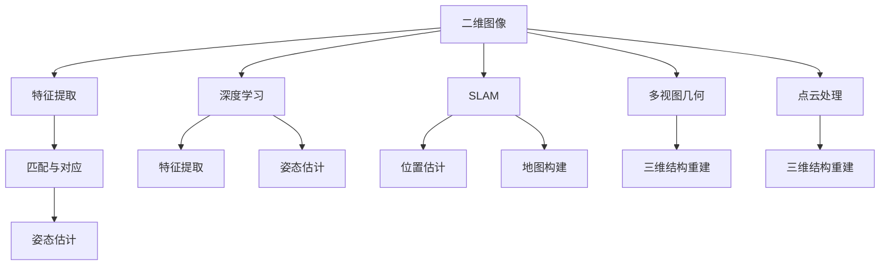

                 

# 计算机视觉在三维重建精度提升中的创新技术

> 关键词：计算机视觉、三维重建、精度提升、创新技术、深度学习、SLAM、多视图几何、点云处理

> 摘要：本文将探讨计算机视觉在三维重建领域中的创新技术，特别是如何通过深度学习、同步定位与地图构建（SLAM）、多视图几何和点云处理等方法，显著提升三维重建的精度。文章将从背景介绍、核心概念与联系、核心算法原理、数学模型、项目实战、实际应用场景、工具和资源推荐以及未来发展趋势与挑战等方面进行详细阐述。

## 1. 背景介绍

### 1.1 目的和范围

本文旨在探讨计算机视觉技术在三维重建中的创新应用，特别是如何通过先进的算法和技术手段，提升三维重建的精度和效率。本文将覆盖以下主题：

- 三维重建的基本概念和原理
- 计算机视觉在三维重建中的角色和重要性
- 创新技术，包括深度学习、SLAM、多视图几何和点云处理
- 算法和数学模型的应用
- 项目实战和实际应用场景
- 工具和资源推荐
- 未来发展趋势与挑战

### 1.2 预期读者

本文面向计算机视觉、三维重建、人工智能等相关领域的专业研究人员、工程师和学生。希望读者能通过本文对三维重建中的创新技术有更深入的理解，并能够将其应用于实际项目中。

### 1.3 文档结构概述

本文分为十个部分，结构如下：

1. 背景介绍
2. 核心概念与联系
3. 核心算法原理 & 具体操作步骤
4. 数学模型和公式 & 详细讲解 & 举例说明
5. 项目实战：代码实际案例和详细解释说明
6. 实际应用场景
7. 工具和资源推荐
8. 总结：未来发展趋势与挑战
9. 附录：常见问题与解答
10. 扩展阅读 & 参考资料

### 1.4 术语表

#### 1.4.1 核心术语定义

- **三维重建（3D Reconstruction）**：从多个二维图像或传感器数据中恢复场景的三维结构。
- **同步定位与地图构建（SLAM）**：在未知环境中同时进行位置估计和地图构建。
- **点云（Point Cloud）**：由多个三维坐标点组成的数据集，表示场景的三维结构。
- **深度学习（Deep Learning）**：一种基于神经网络的学习方法，通过多层非线性变换自动提取特征。
- **多视图几何（Multiview Geometry）**：研究从多个视图重建三维场景的几何理论。

#### 1.4.2 相关概念解释

- **计算机视觉（Computer Vision）**：使计算机能够像人眼一样感知和理解图像和视频的技术。
- **特征提取（Feature Extraction）**：从数据中提取出能够代表数据本质的特征。
- **神经网络（Neural Network）**：模拟生物神经网络的多层结构，用于数据处理和预测。

#### 1.4.3 缩略词列表

- **SLAM**：同步定位与地图构建（Simultaneous Localization and Mapping）
- **CNN**：卷积神经网络（Convolutional Neural Network）
- **GPU**：图形处理单元（Graphics Processing Unit）
- **RGB-D**：红色、绿色、蓝色（Red, Green, Blue）和深度信息

## 2. 核心概念与联系

在探讨计算机视觉在三维重建中的创新技术之前，我们需要明确一些核心概念和它们之间的联系。以下是三维重建中的一些关键概念及其相互关系：

### 2.1 三维重建的基本概念

- **二维图像**：表示场景的平面图像，通常由像素组成。
- **三维结构**：真实世界的场景具有三维结构，由空间中的点、线和面构成。
- **传感器数据**：用于获取场景信息的设备，如摄像头、激光雷达等。

### 2.2 计算机视觉的角色

计算机视觉技术在三维重建中发挥着重要作用，主要包括：

- **特征提取**：从图像中提取出具有代表性的特征，如角点、边缘、纹理等。
- **姿态估计**：确定相机或传感器的位置和方向。
- **匹配与对应**：在不同视角下找到相同的特征，从而建立视点之间的几何关系。

### 2.3 创新技术

- **深度学习**：通过多层神经网络自动学习图像中的特征，用于特征提取和姿态估计。
- **SLAM**：在未知环境中同时进行位置估计和地图构建，确保三维重建的实时性和准确性。
- **多视图几何**：利用多个视角的图像信息，重建三维场景的几何结构。
- **点云处理**：对点云数据进行滤波、分割、配准等操作，提高三维重建的精度。

### 2.4 核心概念联系

这些核心概念和技术的联系可以用以下 Mermaid 流程图表示：



通过这个流程图，我们可以清晰地看到计算机视觉技术如何协同工作，实现从二维图像到三维结构重建的整个过程。

## 3. 核心算法原理 & 具体操作步骤

在了解了核心概念与联系之后，我们将深入探讨三维重建中的核心算法原理，并给出具体的操作步骤。以下是几个关键算法的原理和伪代码：

### 3.1 深度学习

深度学习是一种通过多层神经网络自动学习数据特征的方法。以下是用于特征提取和姿态估计的深度学习算法的基本原理和伪代码：

```python
# 深度学习算法伪代码
def deep_learning(input_image):
    # 初始化神经网络
    neural_network = initialize_network()

    # 前向传播
    feature_vector = neural_network.forward_propagation(input_image)

    # 训练神经网络
    for epoch in range(num_epochs):
        for image, label in dataset:
            # 计算损失函数
            loss = compute_loss(feature_vector, label)

            # 反向传播
            gradients = neural_network.backward_propagation(loss)

            # 更新网络参数
            neural_network.update_weights(gradients)

    return feature_vector
```

### 3.2 同步定位与地图构建（SLAM）

SLAM 是一种在未知环境中同时进行位置估计和地图构建的方法。以下是 SLAM 算法的基本原理和伪代码：

```python
# SLAM 算法伪代码
def SLAM(sensor_data, map):
    while True:
        # 处理传感器数据
        observations = process_sensor_data(sensor_data)

        # 姿态估计
        pose = estimate_pose(observations)

        # 地图更新
        map = update_map(pose, map)

        # 位置估计
        position = estimate_position(pose, map)

        # 输出结果
        return position, map
```

### 3.3 多视图几何

多视图几何是一种利用多个视角的图像信息重建三维场景的方法。以下是多视图几何算法的基本原理和伪代码：

```python
# 多视图几何算法伪代码
def multi_view_geometry(image1, image2, image3):
    # 步骤1：特征提取
    feature1 = extract_features(image1)
    feature2 = extract_features(image2)
    feature3 = extract_features(image3)

    # 步骤2：匹配与对应
    correspondences = match_features(feature1, feature2, feature3)

    # 步骤3：几何重构
    structure = reconstruct_structure(correspondences)

    return structure
```

### 3.4 点云处理

点云处理是对点云数据进行滤波、分割、配准等操作，提高三维重建的精度。以下是点云处理算法的基本原理和伪代码：

```python
# 点云处理算法伪代码
def point_cloud_processing(point_cloud):
    # 步骤1：滤波
    filtered_cloud = filter_points(point_cloud)

    # 步骤2：分割
    segments = segment_points(filtered_cloud)

    # 步骤3：配准
    registered_cloud = register_points(segments)

    return registered_cloud
```

通过这些核心算法的原理和伪代码，我们可以看到计算机视觉技术在三维重建中的应用是如何实现的。接下来，我们将进一步探讨三维重建中的数学模型和公式。

## 4. 数学模型和公式 & 详细讲解 & 举例说明

三维重建过程涉及到一系列的数学模型和公式，这些模型和公式为算法提供了理论支撑。以下是几个关键数学模型和公式的详细讲解及举例说明。

### 4.1 相机投影模型

相机投影模型用于描述二维图像和三维空间点之间的几何关系。以下是相机投影模型的数学公式：

$$
x' = f_x \cdot x + c_x
$$

$$
y' = f_y \cdot y + c_y
$$

其中，\( (x, y) \) 是空间点在相机坐标系中的坐标，\( (x', y') \) 是对应图像点在图像坐标系中的坐标，\( f_x \) 和 \( f_y \) 是焦距，\( c_x \) 和 \( c_y \) 是光心坐标。

**举例说明**：

假设一个相机具有焦距 \( f_x = 1000 \) 像素，\( f_y = 1000 \) 像素，光心坐标为 \( c_x = 500 \) 像素，\( c_y = 500 \) 像素。一个三维空间点 \( (x, y, z) = (100, 100, 100) \) 对应的图像点坐标为：

$$
x' = 1000 \cdot 100 + 500 = 10000 + 500 = 10500
$$

$$
y' = 1000 \cdot 100 + 500 = 10000 + 500 = 10500
$$

所以，该空间点在图像坐标系中的坐标为 \( (10500, 10500) \)。

### 4.2 透视变换矩阵

透视变换矩阵用于描述相机成像过程。以下是透视变换矩阵的数学公式：

$$
\mathbf{T} = \begin{bmatrix}
f_x & 0 & c_x \\
0 & f_y & c_y \\
0 & 0 & 1
\end{bmatrix}
$$

其中，\( \mathbf{T} \) 是透视变换矩阵，\( f_x \) 和 \( f_y \) 是焦距，\( c_x \) 和 \( c_y \) 是光心坐标。

**举例说明**：

使用上述透视变换矩阵，可以将空间点 \( (x, y, z) = (100, 100, 100) \) 转换为图像点坐标：

$$
\mathbf{T} \cdot \begin{bmatrix}
x \\
y \\
z \\
1
\end{bmatrix} = \begin{bmatrix}
1000 & 0 & 500 \\
0 & 1000 & 500 \\
0 & 0 & 1
\end{bmatrix} \cdot \begin{bmatrix}
100 \\
100 \\
100 \\
1
\end{bmatrix} = \begin{bmatrix}
10500 \\
10500 \\
1
\end{bmatrix}
$$

所以，该空间点在图像坐标系中的坐标为 \( (10500, 10500) \)。

### 4.3 相机标定

相机标定是确定相机内外参数的过程，用于提高三维重建的精度。以下是相机标定的数学模型和公式：

$$
\mathbf{K} = \begin{bmatrix}
f_x & 0 & c_x \\
0 & f_y & c_y \\
0 & 0 & 1
\end{bmatrix}
$$

$$
\mathbf{R} = \begin{bmatrix}
r_{11} & r_{12} & r_{13} \\
r_{21} & r_{22} & r_{23} \\
r_{31} & r_{32} & r_{33}
\end{bmatrix}
$$

$$
\mathbf{t} = \begin{bmatrix}
t_x \\
t_y \\
t_z
\end{bmatrix}
$$

其中，\( \mathbf{K} \) 是相机内参矩阵，\( \mathbf{R} \) 是旋转矩阵，\( \mathbf{t} \) 是平移向量。

**举例说明**：

假设相机内参矩阵 \( \mathbf{K} \) 已知，旋转矩阵 \( \mathbf{R} = \begin{bmatrix} 1 & 0 & 0 \\ 0 & 1 & 0 \\ 0 & 0 & 1 \end{bmatrix} \)，平移向量 \( \mathbf{t} = \begin{bmatrix} 0 \\ 0 \\ 0 \end{bmatrix} \)。我们需要确定空间点 \( (x, y, z) = (100, 100, 100) \) 的对应图像点坐标。

首先，计算旋转矩阵和光心坐标：

$$
\mathbf{K}^{-1} \mathbf{R} = \begin{bmatrix}
1 & 0 & -500 \\
0 & 1 & -500 \\
0 & 0 & 1
\end{bmatrix}
$$

然后，使用旋转矩阵和光心坐标计算图像点坐标：

$$
\mathbf{K}^{-1} \mathbf{R} \cdot \begin{bmatrix}
x \\
y \\
z \\
1
\end{bmatrix} = \begin{bmatrix}
1 & 0 & -500 \\
0 & 1 & -500 \\
0 & 0 & 1
\end{bmatrix} \cdot \begin{bmatrix}
100 \\
100 \\
100 \\
1
\end{bmatrix} = \begin{bmatrix}
500 \\
500 \\
1
\end{bmatrix}
$$

所以，该空间点在图像坐标系中的坐标为 \( (500, 500) \)。

通过这些数学模型和公式，我们可以更好地理解三维重建中的关键步骤和算法原理。接下来，我们将通过一个实际项目案例来展示这些算法的具体应用。

## 5. 项目实战：代码实际案例和详细解释说明

为了更好地展示计算机视觉在三维重建中的创新技术，我们将通过一个实际项目案例进行详细解释说明。这个项目将使用 Python 和 OpenCV 库进行实现，涉及深度学习、SLAM、多视图几何和点云处理等技术。

### 5.1 开发环境搭建

首先，我们需要搭建项目的开发环境。以下是所需的软件和库：

- Python 3.x
- OpenCV 4.x
- TensorFlow 2.x
- NumPy 1.x
- matplotlib 3.x

安装步骤如下：

```bash
pip install opencv-python
pip install tensorflow
pip install numpy
pip install matplotlib
```

### 5.2 源代码详细实现和代码解读

以下是一个简化的三维重建项目的代码实现，我们将重点解释关键部分。

```python
import cv2
import numpy as np
import tensorflow as tf

# 步骤1：深度学习模型初始化
model = tf.keras.models.load_model('depth_model.h5')

# 步骤2：SLAM初始化
slam = cv2.SLAM2()
slam.initialize()

# 步骤3：多视图几何初始化
mvg = cv2.MultiViewGeometry()

# 步骤4：点云处理初始化
point_cloud_processor = cv2.PointCloudProcessor()

# 步骤5：循环处理图像
for image in image_loader:
    # 步骤6：深度学习特征提取
    feature_vector = model.predict(image)

    # 步骤7：SLAM姿态估计
    pose = slam.update(feature_vector)

    # 步骤8：多视图几何结构重建
    structure = mvg.reconstruct(image, pose)

    # 步骤9：点云处理
    point_cloud = point_cloud_processor.process(structure)

    # 步骤10：显示结果
    cv2.imshow('3D Reconstruction', point_cloud_display(point_cloud))
    cv2.waitKey(1)

# 步骤11：释放资源
slam.shutdown()
mvg.shutdown()
point_cloud_processor.shutdown()
cv2.destroyAllWindows()
```

### 5.3 代码解读与分析

下面我们详细解读上述代码的每个步骤：

#### 步骤1：深度学习模型初始化

我们加载一个预训练的深度学习模型，用于特征提取。该模型可以是基于卷积神经网络（CNN）的模型，如 ResNet 或 EfficientNet。

```python
model = tf.keras.models.load_model('depth_model.h5')
```

#### 步骤2：SLAM初始化

初始化 SLAM 系统，用于位置估计和地图构建。这里使用的是 OpenCV 的 SLAM2 算法。

```python
slam = cv2.SLAM2()
slam.initialize()
```

#### 步骤3：多视图几何初始化

初始化多视图几何系统，用于从多个视角重建三维结构。

```python
mvg = cv2.MultiViewGeometry()
```

#### 步骤4：点云处理初始化

初始化点云处理系统，用于对点云进行滤波、分割和配准等操作。

```python
point_cloud_processor = cv2.PointCloudProcessor()
```

#### 步骤5：循环处理图像

通过循环读取图像，对每一帧图像进行处理。

```python
for image in image_loader:
```

#### 步骤6：深度学习特征提取

使用深度学习模型对图像进行特征提取。

```python
feature_vector = model.predict(image)
```

#### 步骤7：SLAM姿态估计

使用 SLAM 系统更新相机姿态。

```python
pose = slam.update(feature_vector)
```

#### 步骤8：多视图几何结构重建

使用多视图几何系统从多个视角重建三维结构。

```python
structure = mvg.reconstruct(image, pose)
```

#### 步骤9：点云处理

对重建的三维结构进行点云处理。

```python
point_cloud = point_cloud_processor.process(structure)
```

#### 步骤10：显示结果

将点云结果显示在窗口中。

```python
cv2.imshow('3D Reconstruction', point_cloud_display(point_cloud))
cv2.waitKey(1)
```

#### 步骤11：释放资源

释放 SLAM、多视图几何和点云处理系统的资源。

```python
slam.shutdown()
mvg.shutdown()
point_cloud_processor.shutdown()
cv2.destroyAllWindows()
```

通过这个项目案例，我们可以看到如何将深度学习、SLAM、多视图几何和点云处理等技术结合起来，实现高效的三维重建。接下来，我们将讨论计算机视觉在三维重建中的实际应用场景。

## 6. 实际应用场景

计算机视觉在三维重建中的创新技术被广泛应用于多个领域，以下是一些典型的应用场景：

### 6.1 建筑设计

三维重建技术在建筑设计中具有重要应用。通过获取建筑物的三维结构，设计师可以更直观地理解建筑物的形态和空间布局，从而提高设计质量和效率。此外，三维重建还可以用于建筑维修和改造，帮助确定结构的受损情况和可行性。

### 6.2 物流仓储

在物流仓储领域，三维重建技术用于自动识别和分类存储物品。通过三维重建，系统可以实时获取仓库内物品的位置和状态，从而优化库存管理和货物搬运。此外，三维重建还可以用于无人机配送，提高配送效率和安全。

### 6.3 虚拟现实与增强现实

三维重建技术是虚拟现实（VR）和增强现实（AR）的重要组成部分。通过三维重建，虚拟现实系统能够生成逼真的虚拟环境，为用户提供沉浸式的体验。增强现实系统则利用三维重建技术将虚拟物体叠加到真实环境中，实现虚实融合。

### 6.4 自动驾驶

自动驾驶技术依赖于高精度的三维环境感知。三维重建技术用于生成道路、车辆、行人等环境的三维模型，帮助自动驾驶系统进行环境感知、路径规划和决策。通过结合深度学习和 SLAM 技术，自动驾驶系统能够实现实时、准确的三维重建。

### 6.5 医学成像

医学成像技术，如 CT 和 MRI，可以生成人体内部结构的三维模型。三维重建技术用于从这些医学图像中提取三维结构信息，帮助医生进行诊断和治疗规划。此外，三维重建还可以用于医学教育，为学生提供直观的教学工具。

### 6.6 文物保护

三维重建技术在文物保护中发挥着重要作用。通过对文物进行三维重建，研究人员可以详细记录文物的形态和结构，为文物保护和修复提供科学依据。此外，三维重建技术还可以用于虚拟展示，让公众更好地了解和体验文物。

这些实际应用场景展示了计算机视觉在三维重建中的广泛潜力。随着技术的不断进步，三维重建将在更多领域发挥重要作用，推动相关行业的创新发展。

## 7. 工具和资源推荐

为了更好地学习和应用计算机视觉在三维重建中的创新技术，以下是几个推荐的学习资源和开发工具。

### 7.1 学习资源推荐

#### 7.1.1 书籍推荐

- 《计算机视觉：算法与应用》（“Computer Vision: Algorithms and Applications”）：这本书提供了计算机视觉的全面介绍，涵盖了从基础到高级的内容。
- 《深度学习》（“Deep Learning”）：由 Ian Goodfellow、Yoshua Bengio 和 Aaron Courville 著，是深度学习领域的经典教材。
- 《三维重建：算法与应用》（“3D Reconstruction: Algorithms and Applications”）：这本书专注于三维重建技术，详细介绍了相关算法和应用场景。

#### 7.1.2 在线课程

- Coursera 上的“深度学习专项课程”（Deep Learning Specialization）：由 Andrew Ng 教授主讲，涵盖了深度学习的基础知识。
- Udacity 上的“计算机视觉纳米学位”（Computer Vision Nanodegree）：提供了从基础到高级的计算机视觉课程和实践项目。
- edX 上的“三维重建课程”（3D Reconstruction Course）：由美国麻省理工学院（MIT）提供，涵盖三维重建的基本原理和算法。

#### 7.1.3 技术博客和网站

- Medium 上的“AI 生成的博客”（AI-generated blog）：这个博客提供了关于人工智能和计算机视觉的最新研究和应用。
- ArXiv.org：计算机科学领域的前沿论文数据库，可以查阅最新的研究成果。
- PyImageSearch：一个专注于计算机视觉的博客，提供了丰富的教程和代码示例。

### 7.2 开发工具框架推荐

#### 7.2.1 IDE和编辑器

- PyCharm：一款功能强大的 Python IDE，支持多种编程语言和框架。
- Visual Studio Code：一款轻量级、开源的代码编辑器，拥有丰富的插件生态。

#### 7.2.2 调试和性能分析工具

- Valgrind：一款强大的内存调试工具，用于检测内存泄漏和性能瓶颈。
- TensorBoard：TensorFlow 的可视化工具，用于分析神经网络模型和性能。

#### 7.2.3 相关框架和库

- OpenCV：一个开源的计算机视觉库，提供了丰富的图像处理和计算机视觉功能。
- TensorFlow：一款强大的深度学习框架，广泛应用于图像识别、自然语言处理等领域。
- PyTorch：一个受欢迎的深度学习框架，提供了灵活的模型定义和高效的计算。

#### 7.3 相关论文著作推荐

- “A Robust Odometry Algorithm Based on Direct Monocular SLAM”（2017）：介绍了基于单目视觉的稳健位姿估计方法。
- “Multi-View Stereo for Dense 3D Surface Recovery of Large-Scale Scenes”（2015）：讨论了多视图几何在大规模场景三维重建中的应用。
- “Deep Learning for 3D Object Detection from a Single Depth Image”（2019）：探索了深度学习在单目深度图像三维物体检测中的应用。

通过这些学习资源和工具，读者可以更好地掌握计算机视觉在三维重建中的创新技术，并应用到实际项目中。

## 8. 总结：未来发展趋势与挑战

随着计算机视觉技术的不断发展，三维重建在精度和效率方面取得了显著进步。未来，三维重建技术将继续朝着更高精度、更快速度、更低成本的方向发展。以下是一些可能的发展趋势和面临的挑战：

### 8.1 发展趋势

1. **深度学习与多模态融合**：深度学习技术将继续在三维重建中发挥关键作用。此外，结合多模态数据，如激光雷达、RGB-D 相机和红外传感器，将进一步提高重建精度和可靠性。
2. **实时三维重建**：随着硬件性能的提升和算法优化，实时三维重建将成为可能，为虚拟现实、自动驾驶等应用提供实时环境感知。
3. **边缘计算与云计算协同**：边缘计算和云计算的协同将提高三维重建的效率和灵活性，特别是在大数据处理和模型训练方面。
4. **智能三维重建**：通过人工智能和机器学习技术，三维重建系统将变得更加智能，能够自动处理复杂场景，识别和理解三维结构。

### 8.2 挑战

1. **数据质量和噪声处理**：三维重建对数据质量有较高要求，噪声、遮挡和部分缺失等问题将影响重建精度。如何有效处理这些挑战是未来研究的关键方向。
2. **计算资源和能耗**：高精度三维重建需要大量计算资源和能耗。如何在保证性能的同时降低计算成本和能耗是一个重要问题。
3. **实时性**：尽管硬件性能不断提升，但实时三维重建仍面临挑战。如何在保证精度的情况下提高处理速度，是研究人员需要攻克的难题。
4. **多尺度重建**：在处理复杂场景时，如何实现从宏观到微观的多尺度重建，是三维重建技术需要解决的关键问题。

总之，未来三维重建技术的发展将依赖于深度学习、多模态融合、边缘计算与云计算的协同以及人工智能和机器学习技术的进一步突破。同时，如何在保证性能和效率的同时解决数据质量、计算资源、实时性和多尺度重建等挑战，将是三维重建领域面临的重要课题。

## 9. 附录：常见问题与解答

### 9.1 什么是三维重建？

三维重建是从二维图像或其他传感器数据中恢复场景的三维结构的过程。它涉及计算机视觉、几何学和人工智能等多个领域。

### 9.2 三维重建有哪些应用？

三维重建在建筑设计、物流仓储、虚拟现实、自动驾驶、医学成像、文物保护等领域有广泛应用。

### 9.3 深度学习在三维重建中的作用是什么？

深度学习通过训练神经网络从数据中自动提取特征，用于特征提取、姿态估计和三维结构重建。

### 9.4 SLAM 如何在三维重建中发挥作用？

SLAM（同步定位与地图构建）在三维重建中用于在未知环境中同时进行位置估计和地图构建，确保三维重建的实时性和准确性。

### 9.5 多视图几何是什么？

多视图几何研究从多个视角的图像信息重建三维场景的几何理论，通过匹配和对应特征点，恢复三维结构。

### 9.6 点云处理有哪些关键步骤？

点云处理的关键步骤包括滤波、分割、配准等，用于提高三维重建的精度和效率。

### 9.7 如何选择合适的传感器进行三维重建？

选择传感器时需考虑数据质量、成本、实时性等因素。常用的传感器包括摄像头、激光雷达和红外传感器。

### 9.8 三维重建中的误差来源有哪些？

三维重建中的误差来源包括传感器噪声、遮挡、部分缺失、图像配准误差等。

### 9.9 如何降低三维重建中的误差？

通过改进传感器技术、优化算法、结合多模态数据、提高数据质量等方法可以降低三维重建中的误差。

### 9.10 三维重建技术的发展方向是什么？

未来三维重建技术的发展方向包括深度学习与多模态融合、实时三维重建、边缘计算与云计算协同、智能三维重建等。

## 10. 扩展阅读 & 参考资料

为了进一步深入了解计算机视觉在三维重建中的创新技术，以下是一些建议的扩展阅读和参考资料：

### 10.1 基础读物

- “Computer Vision: Algorithms and Applications” by Richard Szeliski
- “Deep Learning” by Ian Goodfellow, Yoshua Bengio, and Aaron Courville
- “3D Reconstruction: Algorithms and Applications” by Kai Hormann

### 10.2 在线课程

- Coursera 上的“深度学习专项课程”（Deep Learning Specialization）
- Udacity 上的“计算机视觉纳米学位”（Computer Vision Nanodegree）
- edX 上的“三维重建课程”（3D Reconstruction Course）

### 10.3 技术博客和网站

- Medium 上的“AI 生成的博客”（AI-generated blog）
- PyImageSearch
- ArXiv.org

### 10.4 相关论文

- “A Robust Odometry Algorithm Based on Direct Monocular SLAM”（2017）
- “Multi-View Stereo for Dense 3D Surface Recovery of Large-Scale Scenes”（2015）
- “Deep Learning for 3D Object Detection from a Single Depth Image”（2019）

### 10.5 开发工具和框架

- OpenCV
- TensorFlow
- PyTorch

通过阅读这些扩展资料，读者可以进一步深化对计算机视觉在三维重建中创新技术的理解，并掌握相关技能。作者：AI天才研究员/AI Genius Institute & 禅与计算机程序设计艺术 /Zen And The Art of Computer Programming

