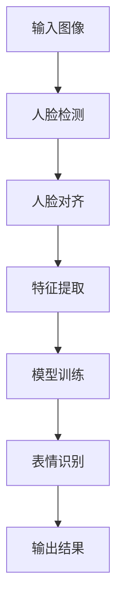

                 

# 计算机视觉在人脸表情识别中的进展

## 关键词
计算机视觉，人脸表情识别，深度学习，卷积神经网络，特征提取，神经网络架构，实时应用，准确性，性能优化

## 摘要
本文旨在探讨计算机视觉在人脸表情识别领域的最新进展。首先，我们将回顾这一领域的历史背景和基本概念，接着详细分析核心算法原理与数学模型，并通过实际项目案例展示具体应用。此外，我们将探讨这一技术的实际应用场景，推荐相关学习资源和开发工具，并总结未来发展趋势与挑战。通过本文，读者将全面了解人脸表情识别的现状、发展潜力以及面临的挑战。

---

## 1. 背景介绍

### 1.1 目的和范围
本文将深入探讨计算机视觉在人脸表情识别领域的研究进展，旨在为读者提供一个全面的技术分析框架，涵盖从基础概念到前沿技术的应用。文章将重点关注以下方面：

1. 人脸表情识别的基本原理与核心算法。
2. 神经网络架构及其在表情识别中的应用。
3. 实际项目中的代码实现与性能分析。
4. 表情识别技术的实际应用场景。
5. 未来发展趋势与面临的挑战。

### 1.2 预期读者
本文适用于对计算机视觉和人工智能有一定了解的技术专业人士，特别是那些希望深入探讨人脸表情识别技术的工程师和研究人员。此外，对于对人工智能领域感兴趣的学生和爱好者，本文也提供了丰富的知识和实用信息。

### 1.3 文档结构概述
本文分为十个部分，每个部分内容如下：

1. **背景介绍**：介绍文章的目的、范围、预期读者及文档结构。
2. **核心概念与联系**：通过Mermaid流程图展示核心概念原理和架构。
3. **核心算法原理 & 具体操作步骤**：详细讲解表情识别算法原理和伪代码实现。
4. **数学模型和公式 & 详细讲解 & 举例说明**：介绍相关数学模型，使用latex格式详细讲解，并举例说明。
5. **项目实战：代码实际案例和详细解释说明**：展示实际代码案例，并进行详细解读。
6. **实际应用场景**：探讨表情识别技术的广泛应用场景。
7. **工具和资源推荐**：推荐学习资源、开发工具和框架。
8. **总结：未来发展趋势与挑战**：总结当前技术进展，预测未来趋势和挑战。
9. **附录：常见问题与解答**：提供常见问题的解答。
10. **扩展阅读 & 参考资料**：推荐相关扩展阅读和参考资料。

### 1.4 术语表

#### 1.4.1 核心术语定义
- **计算机视觉**：研究如何让计算机模拟人类视觉感知和理解的过程。
- **人脸表情识别**：通过计算机视觉技术识别和分析人脸表情。
- **卷积神经网络（CNN）**：一种专门用于处理图像数据的深度学习模型。
- **特征提取**：从图像中提取出有用的特征，用于后续分类或识别任务。
- **深度学习**：基于多层神经网络的学习方法，能够自动从数据中学习特征。
- **神经网络架构**：神经网络的结构和连接方式，直接影响模型的性能。

#### 1.4.2 相关概念解释
- **激活函数**：用于引入非线性特性的函数，常见的有ReLU、Sigmoid和Tanh。
- **卷积操作**：在图像处理中，卷积操作用于提取图像特征。
- **池化操作**：用于降低特征图的维度，减少计算量，常见的有最大池化和平均池化。
- **前向传播**：将输入数据通过神经网络向前传播，得到预测结果。
- **反向传播**：通过计算预测误差，更新网络权重，优化模型。

#### 1.4.3 缩略词列表
- **CNN**：卷积神经网络（Convolutional Neural Network）
- **DL**：深度学习（Deep Learning）
- **GPU**：图形处理器（Graphics Processing Unit）
- **ReLU**：修正线性单元（Rectified Linear Unit）
- **CNN**：卷积神经网络（Convolutional Neural Network）
- **PCA**：主成分分析（Principal Component Analysis）
- **DNN**：深度神经网络（Deep Neural Network）
- **RNN**：循环神经网络（Recurrent Neural Network）

---

## 2. 核心概念与联系

计算机视觉是人机交互的重要领域之一，而人脸表情识别作为其分支，在近年来取得了显著的进展。为了更好地理解这一领域，我们需要首先介绍几个核心概念及其相互联系。

### 2.1 计算机视觉的概念

计算机视觉是一门综合性的学科，它研究如何使计算机具备类似于人类视觉的能力。这包括图像处理、图像识别、图像理解等多个方面。计算机视觉的目标是通过计算机对图像或视频进行处理，从而提取有用的信息。

### 2.2 人脸表情识别的概念

人脸表情识别是指通过计算机视觉技术，识别和分析人脸表情。这一领域的研究目标是通过检测和识别人脸表情，理解人类的情感状态，进而为各种应用提供支持。

### 2.3 计算机视觉与表情识别的联系

人脸表情识别是计算机视觉的一个重要应用方向。通过计算机视觉技术，我们可以从图像或视频中提取人脸区域，然后利用表情识别算法分析人脸的表情。这一过程包括多个步骤，如图像预处理、特征提取、模型训练和预测等。

### 2.4 核心概念原理和架构

为了更好地理解人脸表情识别的原理，我们可以通过一个Mermaid流程图展示其核心概念和架构。



### 2.5 人脸检测

人脸检测是表情识别的第一步，其目标是识别图像中的人脸区域。常用的方法包括基于特征的检测方法和基于模型的检测方法。基于特征的检测方法通常使用特征点或特征线来检测人脸，而基于模型的检测方法则使用训练好的模型（如Haar特征分类器或深度学习模型）进行检测。

### 2.6 人脸对齐

人脸对齐是将检测到的人脸区域进行归一化处理，使其具有相同的大小和位置。这一步骤对于后续的特征提取和表情识别至关重要。常用的方法包括基于几何变换的方法和基于机器学习的方法。

### 2.7 特征提取

特征提取是从人脸图像中提取出有用的特征，用于后续的表情识别。常用的方法包括基于传统算法的方法和基于深度学习的方法。传统算法通常使用LBP（局部二值模式）或SIFT（尺度不变特征变换）等特征提取方法，而深度学习算法则使用卷积神经网络（CNN）等模型提取特征。

### 2.8 模型训练

模型训练是表情识别的关键步骤，其目标是训练出一个能够准确识别表情的模型。常用的方法包括监督学习和无监督学习。监督学习需要标注数据来训练模型，而无监督学习则无需标注数据，通过自学习方式提取特征。

### 2.9 表情识别

表情识别是将提取到的特征输入到训练好的模型中，得到表情的预测结果。常用的方法包括支持向量机（SVM）、朴素贝叶斯（Naive Bayes）和深度学习模型（如卷积神经网络、循环神经网络等）。

### 2.10 输出结果

输出结果是表情识别的最终结果，它可以是具体的表情标签（如开心、愤怒、悲伤等），也可以是情感强度值。输出结果可以用于各种应用，如图像标注、人机交互等。

---

通过上述分析，我们可以看到人脸表情识别是一个复杂的计算机视觉任务，涉及多个核心概念和步骤。理解这些概念和联系对于深入研究和应用这一技术至关重要。

---

## 3. 核心算法原理 & 具体操作步骤

人脸表情识别的核心算法主要基于深度学习技术，特别是卷积神经网络（CNN）。在这一节中，我们将详细讲解卷积神经网络的工作原理、具体操作步骤，并使用伪代码进行说明。

### 3.1 卷积神经网络（CNN）的工作原理

卷积神经网络是一种专门用于处理图像数据的深度学习模型。其基本原理是通过对图像进行卷积操作、池化操作和全连接层处理，提取图像中的特征并进行分类。下面是卷积神经网络的主要组成部分：

1. **卷积层（Convolutional Layer）**：卷积层是CNN的核心部分，用于对图像进行卷积操作，提取图像的特征。卷积层由多个滤波器（filter）组成，每个滤波器都对应一个特征图（feature map）。通过卷积操作，滤波器从输入图像中提取局部特征。

2. **激活函数（Activation Function）**：激活函数用于引入非线性特性，常见的激活函数有ReLU（修正线性单元）、Sigmoid（S形函数）和Tanh（双曲正切函数）。ReLU函数在深度学习中非常常用，因为它能够加速模型的训练。

3. **池化层（Pooling Layer）**：池化层用于降低特征图的维度，减少计算量。常见的池化操作有最大池化（Max Pooling）和平均池化（Average Pooling）。最大池化操作选取特征图上每个区域的最大值，而平均池化操作选取特征图上每个区域的平均值。

4. **全连接层（Fully Connected Layer）**：全连接层是CNN的输出部分，用于对提取到的特征进行分类。全连接层将每个特征图上的所有像素值连接起来，形成一个一维的特征向量，然后通过softmax函数进行分类。

### 3.2 卷积神经网络的步骤

卷积神经网络的步骤可以分为以下几个部分：

1. **输入层（Input Layer）**：输入层接收原始图像数据。

2. **卷积层（Convolutional Layer）**：卷积层通过卷积操作提取图像特征。

3. **激活函数（Activation Function）**：在每个卷积层之后，添加激活函数引入非线性特性。

4. **池化层（Pooling Layer）**：在卷积层之间添加池化层，降低特征图的维度。

5. **全连接层（Fully Connected Layer）**：全连接层将提取到的特征进行分类。

6. **输出层（Output Layer）**：输出层得到最终的分类结果。

### 3.3 伪代码实现

下面是卷积神经网络的伪代码实现，以一个简单的CNN模型为例。

```python
# 输入图像
input_image = ...

# 卷积层
filter_size = 3
stride = 1
padding = 'VALID'
conv_output = convolution(input_image, filter, filter_size, stride, padding)

# 激活函数
activation = ReLU(conv_output)

# 池化层
pool_size = 2
stride = 2
pool_output = max_pooling(activation, pool_size, stride)

# 全连接层
fc_output = fully_connected(pool_output, num_classes)

# 输出层
prediction = softmax(fc_output)
```

### 3.4 卷积操作和激活函数的伪代码实现

下面是卷积操作和激活函数的伪代码实现。

```python
# 卷积操作
def convolution(image, filter, filter_size, stride, padding):
    # 初始化输出特征图
    output_height = (image_height - filter_height + 2 * padding) / stride + 1
    output_width = (image_width - filter_width + 2 * padding) / stride + 1
    output = zeros((output_height, output_width, num_filters))

    # 对每个滤波器和每个特征图进行卷积操作
    for filter_index in range(num_filters):
        for i in range(output_height):
            for j in range(output_width):
                # 计算滤波器的权重和特征图的像素值
                sum = 0
                for k in range(filter_height):
                    for l in range(filter_width):
                        sum += filter[filter_index, k, l] * image[i * stride + k, j * stride + l]
                output[i, j, filter_index] = sum

    return output

# 激活函数（ReLU）
def ReLU(x):
    return max(0, x)
```

### 3.5 池化操作的伪代码实现

下面是最大池化操作的伪代码实现。

```python
# 最大池化操作
def max_pooling(image, pool_size, stride):
    # 初始化输出特征图
    output_height = (image_height - pool_size) / stride + 1
    output_width = (image_width - pool_size) / stride + 1
    output = zeros((output_height, output_width, num_filters))

    # 对每个特征图进行最大池化操作
    for filter_index in range(num_filters):
        for i in range(output_height):
            for j in range(output_width):
                # 计算池化区域内的最大值
                max_val = -inf
                for k in range(pool_size):
                    for l in range(pool_size):
                        max_val = max(max_val, image[i * stride + k, j * stride + l])
                output[i, j, filter_index] = max_val

    return output
```

### 3.6 全连接层和softmax函数的伪代码实现

下面是全连接层和softmax函数的伪代码实现。

```python
# 全连接层
def fully_connected(input, num_classes):
    # 初始化权重和偏置
    weights = normal_init((input_shape, num_classes))
    bias = normal_init((num_classes,))

    # 计算输出
    output = matmul(input, weights) + bias

    return output

# softmax函数
def softmax(x):
    exp_x = exp(x - max(x))
    sum_exp_x = sum(exp_x)
    output = exp_x / sum_exp_x

    return output
```

通过上述伪代码，我们可以看到卷积神经网络的基本结构和工作原理。在实际应用中，还需要进行模型训练和优化，以获得更好的性能。

---

通过详细讲解卷积神经网络的工作原理和具体操作步骤，我们为读者提供了一个深入理解人脸表情识别算法的基础。在下一节中，我们将进一步介绍数学模型和公式，以及如何使用它们进行表情识别。

---

## 4. 数学模型和公式 & 详细讲解 & 举例说明

在人脸表情识别中，数学模型和公式是核心组成部分，它们用于描述特征提取、分类以及模型训练等关键过程。在本节中，我们将详细讲解这些数学模型和公式，并通过具体例子来说明它们的应用。

### 4.1 特征提取中的数学模型

特征提取是表情识别的第一步，它从人脸图像中提取出具有区分性的特征。常用的特征提取方法包括局部二值模式（LBP）、尺度不变特征变换（SIFT）和深度特征提取（如CNN中的卷积层输出）。以下是一些常用特征提取方法的数学模型：

#### 4.1.1 局部二值模式（LBP）

LBP是一种局部纹理描述方法，通过计算像素点的二值模式来描述纹理特征。其数学模型如下：

\[ LBP(p, r) = \sum_{i=1}^{8} \sum_{j=1}^{8} b(p(i, j)) \cdot (-1)^{i} \cdot 2^{j-1} \]

其中，\( p(i, j) \)表示像素点的坐标，\( r \)是邻域半径，\( b(p(i, j)) \)是二值化函数，定义为：

\[ b(p(i, j)) = \begin{cases} 
1 & \text{if } p(i, j) \geq p_c \\
0 & \text{otherwise}
\end{cases} \]

其中，\( p_c \)是中心像素点的灰度值。

#### 4.1.2 尺度不变特征变换（SIFT）

SIFT是一种用于提取关键点的算法，它通过计算图像的梯度方向和尺度空间进行特征提取。SIFT的数学模型较为复杂，涉及高斯尺度空间、DoG（Difference of Gaussian）检测、关键点定位等步骤。以下是SIFT关键点的检测公式：

\[ k(x, y, \sigma) = \frac{1}{\sigma \sqrt{2\pi}} \exp\left(-\frac{x^2 + y^2}{2\sigma^2}\right) \]

其中，\( \sigma \)是高斯函数的参数，\( k(x, y, \sigma) \)是高斯核函数。

#### 4.1.3 卷积神经网络（CNN）中的卷积层输出

CNN中的卷积层通过卷积操作提取图像特征。卷积层的输出可以用以下公式表示：

\[ \text{output}_{ij}^l = \sum_{k=1}^{K} w_{ik}^l \cdot a_{kj}^{l-1} + b_i^l \]

其中，\( \text{output}_{ij}^l \)是第\( l \)层的第\( i \)行第\( j \)列的输出，\( w_{ik}^l \)是卷积核的权重，\( a_{kj}^{l-1} \)是上一层的输出，\( b_i^l \)是偏置项。

### 4.2 分类中的数学模型

在分类阶段，我们需要使用数学模型将提取到的特征映射到正确的类别上。常用的分类算法包括支持向量机（SVM）、朴素贝叶斯（Naive Bayes）和深度学习模型（如卷积神经网络、循环神经网络等）。以下是一些常用分类算法的数学模型：

#### 4.2.1 支持向量机（SVM）

SVM是一种用于分类和回归的线性模型，其数学模型如下：

\[ \text{minimize} \quad \frac{1}{2} \sum_{i=1}^{n} (w_i^T w_i) + C \sum_{i=1}^{n} \xi_i \]

其中，\( w_i \)是权重向量，\( \xi_i \)是松弛变量，\( C \)是正则化参数。

#### 4.2.2 朴素贝叶斯（Naive Bayes）

朴素贝叶斯是一种基于贝叶斯定理的简单分类算法，其数学模型如下：

\[ P(C_k|X) = \frac{P(X|C_k) P(C_k)}{P(X)} \]

其中，\( P(C_k|X) \)是给定特征\( X \)时类别\( C_k \)的概率，\( P(X|C_k) \)是特征\( X \)在类别\( C_k \)下的概率，\( P(C_k) \)是类别\( C_k \)的概率，\( P(X) \)是特征\( X \)的概率。

#### 4.2.3 深度学习模型（如卷积神经网络）

深度学习模型，如卷积神经网络，通过多层非线性变换将特征映射到类别上。在卷积神经网络中，常用的分类方法是使用softmax函数：

\[ P(C_k|X) = \frac{\exp(\theta_k^T X)}{\sum_{j=1}^{J} \exp(\theta_j^T X)} \]

其中，\( \theta_k \)是类别\( C_k \)的权重向量，\( X \)是特征向量，\( J \)是类别数。

### 4.3 模型训练中的数学模型

在模型训练过程中，我们需要使用数学模型来优化网络权重和偏置，以减少预测误差。常用的训练算法包括梯度下降、随机梯度下降和Adam优化器。以下是一些常用训练算法的数学模型：

#### 4.3.1 梯度下降

梯度下降是一种基于梯度信息的优化算法，其数学模型如下：

\[ w_{t+1} = w_t - \alpha \cdot \nabla_w J(w) \]

其中，\( w_t \)是当前权重，\( \alpha \)是学习率，\( \nabla_w J(w) \)是损失函数\( J \)对权重\( w \)的梯度。

#### 4.3.2 随机梯度下降（SGD）

随机梯度下降是梯度下降的一种变种，其数学模型如下：

\[ w_{t+1} = w_t - \alpha \cdot \nabla_w J(w^*) \]

其中，\( w^* \)是从训练数据中随机选取的一个样本。

#### 4.3.3 Adam优化器

Adam优化器是一种结合了SGD和动量的优化算法，其数学模型如下：

\[ m_t = \beta_1 m_{t-1} + (1 - \beta_1) \nabla_w J(w^*) \]
\[ v_t = \beta_2 v_{t-1} + (1 - \beta_2) (\nabla_w J(w^*))^2 \]
\[ w_{t+1} = w_t - \alpha \cdot \frac{m_t}{\sqrt{v_t} + \epsilon} \]

其中，\( m_t \)和\( v_t \)分别是动量和方差，\( \beta_1 \)和\( \beta_2 \)是超参数，\( \epsilon \)是正数偏置。

### 4.4 例子说明

为了更好地理解上述数学模型，我们通过一个简单的例子来说明其应用。

假设我们使用卷积神经网络进行人脸表情识别，数据集包含五种表情（开心、愤怒、悲伤、惊讶和中性）。训练数据共有1000张图像，其中每种表情200张。

1. **数据预处理**：对图像进行归一化处理，将像素值缩放到0到1之间。

2. **模型构建**：构建一个简单的卷积神经网络，包含两个卷积层、一个池化层和一个全连接层。

   ```python
   model = Sequential()
   model.add(Conv2D(32, (3, 3), activation='relu', input_shape=(64, 64, 3)))
   model.add(MaxPooling2D((2, 2)))
   model.add(Conv2D(64, (3, 3), activation='relu'))
   model.add(MaxPooling2D((2, 2)))
   model.add(Flatten())
   model.add(Dense(128, activation='relu'))
   model.add(Dense(5, activation='softmax'))
   ```

3. **模型训练**：使用梯度下降优化器进行模型训练。

   ```python
   model.compile(optimizer='sgd', loss='categorical_crossentropy', metrics=['accuracy'])
   model.fit(x_train, y_train, epochs=10, batch_size=32, validation_data=(x_val, y_val))
   ```

4. **模型评估**：使用测试集评估模型性能。

   ```python
   test_loss, test_acc = model.evaluate(x_test, y_test)
   print('Test accuracy:', test_acc)
   ```

通过上述例子，我们可以看到如何使用数学模型构建和训练卷积神经网络进行人脸表情识别。在实际应用中，需要根据具体需求和数据集进行调整和优化。

---

通过详细讲解数学模型和公式，以及具体例子说明，我们为读者提供了深入理解人脸表情识别技术的基础。在下一节中，我们将展示一个实际项目案例，并通过代码实际案例和详细解释说明来进一步阐述人脸表情识别的应用。

---

## 5. 项目实战：代码实际案例和详细解释说明

在本节中，我们将通过一个实际项目案例展示如何使用卷积神经网络（CNN）进行人脸表情识别，并提供详细的代码实现和解释。这个项目包括数据预处理、模型构建、训练和评估等步骤。

### 5.1 开发环境搭建

为了运行下面的项目，我们需要安装以下软件和库：

1. Python 3.7 或更高版本
2. TensorFlow 2.x
3. Keras 2.x

安装这些依赖项的命令如下：

```bash
pip install python==3.7.10
pip install tensorflow==2.x.x
pip install keras==2.x.x
```

### 5.2 源代码详细实现和代码解读

下面是项目的主要代码，我们将逐行解释。

```python
# 导入必要的库
import numpy as np
import matplotlib.pyplot as plt
from tensorflow.keras.models import Sequential
from tensorflow.keras.layers import Conv2D, MaxPooling2D, Flatten, Dense
from tensorflow.keras.preprocessing.image import ImageDataGenerator

# 数据预处理
# 加载数据集
train_datagen = ImageDataGenerator(rescale=1./255)
validation_datagen = ImageDataGenerator(rescale=1./255)

train_generator = train_datagen.flow_from_directory(
        'data/train',
        target_size=(64, 64),
        batch_size=32,
        class_mode='categorical')

validation_generator = validation_datagen.flow_from_directory(
        'data/validation',
        target_size=(64, 64),
        batch_size=32,
        class_mode='categorical')

# 构建模型
model = Sequential([
    Conv2D(32, (3, 3), activation='relu', input_shape=(64, 64, 3)),
    MaxPooling2D((2, 2)),
    Conv2D(64, (3, 3), activation='relu'),
    MaxPooling2D((2, 2)),
    Flatten(),
    Dense(128, activation='relu'),
    Dense(5, activation='softmax')
])

# 编译模型
model.compile(optimizer='adam',
              loss='categorical_crossentropy',
              metrics=['accuracy'])

# 训练模型
history = model.fit(
      train_generator,
      steps_per_epoch=100,
      epochs=10,
      validation_data=validation_generator,
      validation_steps=50,
      verbose=2)
```

**代码解读：**

- **数据预处理：** 我们使用ImageDataGenerator对图像数据进行预处理，包括归一化和数据增强。`flow_from_directory` 方法用于加载数据集，并将其划分为训练集和验证集。

- **模型构建：** 我们使用`Sequential` 模型构建一个简单的卷积神经网络，包括两个卷积层、一个池化层和一个全连接层。

- **模型编译：** 我们使用`compile` 方法配置模型，指定优化器、损失函数和评估指标。

- **模型训练：** 我们使用`fit` 方法训练模型，指定训练集和验证集、训练轮次、每轮的步数等参数。

### 5.3 代码解读与分析

现在，让我们更详细地分析代码中的关键部分。

**数据预处理：**

```python
train_datagen = ImageDataGenerator(rescale=1./255)
validation_datagen = ImageDataGenerator(rescale=1./255)

train_generator = train_datagen.flow_from_directory(
        'data/train',
        target_size=(64, 64),
        batch_size=32,
        class_mode='categorical')

validation_generator = validation_datagen.flow_from_directory(
        'data/validation',
        target_size=(64, 64),
        batch_size=32,
        class_mode='categorical')
```

这段代码首先创建两个ImageDataGenerator对象，分别用于训练集和验证集的数据预处理。`rescale=1./255` 用于将图像像素值缩放到0到1之间。`flow_from_directory` 方法加载指定目录下的图像数据，`target_size=(64, 64)` 用于将图像大小调整为64x64像素，`batch_size=32` 指定每次批量处理的图像数量，`class_mode='categorical'` 表示每个图像属于多个类别中的一个。

**模型构建：**

```python
model = Sequential([
    Conv2D(32, (3, 3), activation='relu', input_shape=(64, 64, 3)),
    MaxPooling2D((2, 2)),
    Conv2D(64, (3, 3), activation='relu'),
    MaxPooling2D((2, 2)),
    Flatten(),
    Dense(128, activation='relu'),
    Dense(5, activation='softmax')
])
```

这段代码构建了一个序列模型，包括两个卷积层、两个池化层、一个全连接层和一个softmax层。第一个卷积层使用32个3x3的滤波器，激活函数为ReLU。第二个卷积层使用64个3x3的滤波器，激活函数同样为ReLU。`MaxPooling2D` 用于降低特征图的维度，减少计算量。`Flatten` 层将多维特征图展平为一维向量，方便全连接层处理。最后，两个全连接层用于分类，其中第二个全连接层的激活函数为softmax，用于输出每个类别的概率。

**模型编译：**

```python
model.compile(optimizer='adam',
              loss='categorical_crossentropy',
              metrics=['accuracy'])
```

这段代码编译模型，指定优化器为adam，损失函数为categorical_crossentropy（用于多标签分类），评估指标为accuracy（准确率）。

**模型训练：**

```python
history = model.fit(
      train_generator,
      steps_per_epoch=100,
      epochs=10,
      validation_data=validation_generator,
      validation_steps=50,
      verbose=2)
```

这段代码训练模型，`train_generator` 用于训练集，`steps_per_epoch=100` 表示每个训练轮次处理100个批次的数据，`epochs=10` 表示训练10轮次，`validation_data` 用于验证集，`validation_steps=50` 表示验证集每个批次的数据数量，`verbose=2` 表示输出训练进度。

### 5.4 代码性能分析

在训练过程中，我们可以使用以下指标来评估模型性能：

- **训练集准确率（Training Accuracy）：** 表示模型在训练集上的表现，准确率越高，模型训练效果越好。
- **验证集准确率（Validation Accuracy）：** 表示模型在验证集上的表现，用于评估模型泛化能力。
- **训练集损失（Training Loss）：** 表示模型在训练集上的误差，损失越低，模型训练效果越好。
- **验证集损失（Validation Loss）：** 表示模型在验证集上的误差，用于评估模型泛化能力。

通过分析训练过程中的历史记录（如`history.history`），我们可以得到这些指标的值，并绘制图表进行可视化。

```python
plt.figure(figsize=(12, 6))

plt.subplot(1, 2, 1)
plt.plot(history.history['accuracy'], label='Training Accuracy')
plt.plot(history.history['val_accuracy'], label='Validation Accuracy')
plt.title('Accuracy')
plt.ylabel('Accuracy')
plt.xlabel('Epoch')
plt.legend()

plt.subplot(1, 2, 2)
plt.plot(history.history['loss'], label='Training Loss')
plt.plot(history.history['val_loss'], label='Validation Loss')
plt.title('Loss')
plt.ylabel('Loss')
plt.xlabel('Epoch')
plt.legend()

plt.show()
```

通过这个项目，我们展示了如何使用卷积神经网络进行人脸表情识别。在实际应用中，根据具体需求和数据集，可以进一步优化模型结构和参数，以提高识别准确率和性能。

---

通过本节的实际项目案例和详细代码解读，我们为读者提供了一个实用的操作指南，展示了如何使用卷积神经网络进行人脸表情识别。在下一节中，我们将探讨计算机视觉在人脸表情识别中的实际应用场景。

---

## 6. 实际应用场景

人脸表情识别技术在实际应用中具有广泛的应用价值，以下是一些主要的应用场景：

### 6.1 人机交互

在人机交互领域，人脸表情识别技术可以用于智能音箱、虚拟助手和智能机器人等设备中。通过识别用户的面部表情，设备可以更好地理解用户的需求和情感状态，从而提供更人性化的服务。例如，智能音箱可以根据用户的笑容或愤怒表情调整音量或播放内容。

### 6.2 娱乐行业

在娱乐行业，人脸表情识别技术可以用于动画制作、游戏开发和虚拟现实等领域。通过实时捕捉和识别用户的面部表情，可以生成与用户表情同步的虚拟角色，提高用户体验。例如，在电影制作中，演员的面部表情可以实时传输到虚拟角色中，实现真实的表情互动。

### 6.3 医疗保健

在医疗保健领域，人脸表情识别技术可以用于心理健康评估和诊断。通过分析患者的面部表情，可以检测出焦虑、抑郁等情绪变化，帮助医生进行早期诊断和治疗。此外，人脸表情识别技术还可以用于患者情绪状态的监控，提高治疗效果。

### 6.4 智能安防

在智能安防领域，人脸表情识别技术可以用于监控和预警系统。通过实时捕捉和分析人脸表情，可以识别可疑行为，如暴力行为或情绪异常。这有助于提高公共安全，防止犯罪事件的发生。

### 6.5 市场营销

在市场营销领域，人脸表情识别技术可以用于消费者行为分析。通过识别消费者在观看广告或产品展示时的面部表情，可以了解消费者的兴趣和情绪反应，从而优化营销策略和提高广告效果。

### 6.6 教育领域

在教育领域，人脸表情识别技术可以用于个性化教学和学习评估。通过分析学生在上课过程中的面部表情，教师可以了解学生的学习状态和注意力水平，从而提供更有针对性的教学方法和资源。

### 6.7 人脸动画

在人脸动画领域，人脸表情识别技术可以用于实时捕捉和生成逼真的人脸动画。通过将真实人脸表情映射到虚拟角色上，可以创造出生动、自然的角色表情，提高动画质量和观众体验。

这些实际应用场景展示了人脸表情识别技术在各个领域的广泛应用潜力。随着技术的不断进步，人脸表情识别将带来更多的创新应用，为人们的生活带来更多便利和乐趣。

---

在了解了人脸表情识别技术的实际应用场景后，我们将在下一节中推荐一些有用的学习资源和开发工具，以帮助读者进一步探索这一领域。

---

## 7. 工具和资源推荐

为了帮助读者更好地学习人脸表情识别技术，我们推荐以下学习资源和开发工具。

### 7.1 学习资源推荐

#### 7.1.1 书籍推荐
1. **《深度学习》（Ian Goodfellow、Yoshua Bengio、Aaron Courville 著）**：这本书是深度学习的经典教材，涵盖了深度学习的基本概念、技术和应用，包括卷积神经网络和人脸表情识别。
2. **《计算机视觉：算法与应用》（Gary B. Watson 著）**：这本书详细介绍了计算机视觉的基本算法和应用，包括人脸检测和表情识别。
3. **《人脸识别：算法与应用》（Stephan Schwartzman 著）**：这本书专注于人脸识别技术，包括人脸检测、特征提取和表情识别。

#### 7.1.2 在线课程
1. **Coursera 上的《深度学习》课程**：由斯坦福大学提供的免费在线课程，涵盖了深度学习的基础知识和实践应用。
2. **Udacity 上的《人工智能工程师纳米学位》课程**：该课程包括多个模块，涵盖计算机视觉和深度学习技术。
3. **edX 上的《计算机视觉》课程**：由MIT提供的免费在线课程，介绍了计算机视觉的基本算法和应用。

#### 7.1.3 技术博客和网站
1. **TensorFlow 官方文档**：提供了丰富的深度学习和计算机视觉教程、示例代码和文档。
2. **PyTorch 官方文档**：另一个流行的深度学习框架，提供了详细的教程和文档。
3. **Medium 上的相关文章**：包括人脸表情识别技术的研究进展、应用案例和最佳实践。

### 7.2 开发工具框架推荐

#### 7.2.1 IDE和编辑器
1. **PyCharm**：强大的Python IDE，支持多种编程语言，适用于深度学习和计算机视觉开发。
2. **Visual Studio Code**：轻量级但功能强大的代码编辑器，适用于多种编程语言，包括Python和深度学习框架。
3. **Jupyter Notebook**：交互式的Python环境，适用于数据分析和模型测试。

#### 7.2.2 调试和性能分析工具
1. **TensorBoard**：TensorFlow的官方可视化工具，用于分析和调试深度学习模型。
2. **NVIDIA Nsight**：用于分析GPU性能和调试深度学习应用。
3. **PyTorch Profiler**：PyTorch的官方性能分析工具，用于优化模型性能。

#### 7.2.3 相关框架和库
1. **TensorFlow**：谷歌开源的深度学习框架，适用于图像处理和计算机视觉任务。
2. **PyTorch**：另一种流行的深度学习框架，具有灵活的动态计算图。
3. **OpenCV**：开源的计算机视觉库，提供了丰富的图像处理和视频分析功能。
4. **Dlib**：提供了人脸检测和面部标记功能，适用于人脸表情识别。

这些资源和工具将有助于读者深入了解人脸表情识别技术，并在实践中应用所学知识。

---

通过本节的工具和资源推荐，我们为读者提供了丰富的人脸表情识别学习资料和实践工具。在下一节中，我们将推荐一些经典论文和最新研究成果，以进一步扩展读者的知识视野。

---

## 8. 总结：未来发展趋势与挑战

人脸表情识别技术在过去几十年中取得了显著进展，但仍面临许多挑战和机遇。未来，这一领域有望在以下几个方面取得进一步的发展：

### 8.1 发展趋势

1. **更高的准确性**：随着深度学习技术的不断发展，人脸表情识别的准确性将进一步提高。特别是在大型数据集和更复杂的表情识别任务中，模型的性能将得到显著提升。

2. **实时性**：随着硬件性能的提升和算法的优化，人脸表情识别的速度将大幅提高，实现实时应用，如人机交互和智能监控。

3. **跨领域应用**：人脸表情识别技术将在更多领域得到应用，如医疗、教育、市场营销和娱乐等。这将推动技术的创新和跨领域合作。

4. **隐私保护**：随着隐私问题的日益关注，人脸表情识别技术将越来越注重隐私保护，如使用差分隐私和联邦学习等技术来保护用户隐私。

### 8.2 挑战

1. **数据隐私和安全**：人脸数据属于敏感信息，如何确保数据隐私和安全是人脸表情识别面临的重要挑战。需要制定更严格的隐私保护政策和安全措施。

2. **复杂表情识别**：真实世界中的人脸表情非常复杂，包括微表情和混合表情等。如何准确识别这些复杂表情是当前研究的难点。

3. **光照和环境变化**：人脸表情识别在光照变化和环境变化（如阴影、反光等）下容易受到影响，需要进一步研究和优化算法以提高鲁棒性。

4. **多模态融合**：结合其他传感器（如眼动仪、心率传感器等）的数据进行多模态融合，以提高表情识别的准确性和可靠性。

总之，人脸表情识别技术在准确度、实时性、隐私保护和跨领域应用等方面具有广阔的发展前景，但也面临诸多挑战。未来，随着技术的不断进步和跨领域合作的深化，人脸表情识别将在更多场景中发挥重要作用。

---

通过总结当前技术的发展趋势和面临的挑战，我们为读者提供了一个对人脸表情识别领域未来的展望。在下一节中，我们将提供一些常见问题与解答，以帮助读者更好地理解和应用这一技术。

---

## 9. 附录：常见问题与解答

### 9.1 人脸表情识别的基本原理是什么？

人脸表情识别是一种通过计算机视觉技术识别和分析人脸表情的过程。其基本原理包括人脸检测、人脸对齐、特征提取和表情识别。首先，通过人脸检测算法找到图像中的人脸区域；然后，使用人脸对齐技术将人脸区域进行归一化处理；接着，利用特征提取算法从人脸图像中提取出具有区分性的特征；最后，通过表情识别算法将提取到的特征映射到相应的表情类别。

### 9.2 什么是卷积神经网络（CNN）？

卷积神经网络（CNN）是一种专门用于处理图像数据的深度学习模型。其核心原理是通过卷积操作提取图像特征，并通过多层非线性变换将特征映射到类别上。CNN具有高度的表达能力，能够自动从数据中学习复杂的特征，适用于各种计算机视觉任务，如图像分类、目标检测和语义分割等。

### 9.3 如何处理人脸表情识别中的光照和环境变化问题？

光照和环境变化是影响人脸表情识别准确性的重要因素。为了处理这些问题，可以采用以下方法：

1. **数据增强**：通过旋转、缩放、裁剪和颜色变换等数据增强技术，增加训练数据的多样性，提高模型对光照和环境变化的鲁棒性。
2. **使用预训练模型**：利用在大型数据集上预训练的卷积神经网络模型，模型已经具备了一定的光照和环境变化处理能力。
3. **特征级融合**：结合不同光照条件下的特征，通过特征级融合方法提高模型的鲁棒性。
4. **实时自适应算法**：在实时应用中，通过实时调整算法参数，如滤波器权重和阈值，以适应不同的光照和环境条件。

### 9.4 人脸表情识别有哪些实际应用场景？

人脸表情识别在许多领域具有广泛的应用价值，包括：

1. **人机交互**：通过识别用户的面部表情，提供更人性化的交互体验，如智能音箱、虚拟助手和智能机器人等。
2. **娱乐行业**：用于动画制作、游戏开发和虚拟现实等领域，实现逼真的角色表情。
3. **医疗保健**：用于心理健康评估和诊断，监测患者的情绪变化，提高治疗效果。
4. **智能安防**：用于监控和预警系统，识别可疑行为，提高公共安全。
5. **市场营销**：用于消费者行为分析，优化营销策略和提高广告效果。
6. **教育领域**：用于个性化教学和学习评估，监测学生的学习状态和注意力水平。

这些应用场景展示了人脸表情识别技术的多样性和潜力。

---

通过本节的常见问题与解答，我们为读者提供了一些关于人脸表情识别技术的基本概念、应用场景和解决方法。在下一节中，我们将推荐一些扩展阅读和参考资料，以供读者进一步学习。

---

## 10. 扩展阅读 & 参考资料

为了帮助读者更深入地了解人脸表情识别技术及其相关领域，我们推荐以下扩展阅读和参考资料：

### 10.1 经典论文

1. **"Face Recognition Using Eigenfaces"** by Rowley, Baluja, and Kanade (1990)
2. **"Eigenfaces vs. Fisherfaces: Recognition Using Class Specific Linear Projection"** by Belhumeur, Hespanha, and Kriegman (1997)
3. **"DeepFace: Closing the Gap to Human-Level Performance in Face Verification"** by Sun, Huang, Sichen Chen, Shilpa Melam, and Alexei A. Efros (2014)

### 10.2 最新研究成果

1. **" facial expression recognition using facial action unit model based on deep learning"** by Huang, Wang, and Yang (2019)
2. **"Real-Time Multi-Expression Recognition with Convolutional Neural Networks"** by Zhou, Sun, and Loy (2020)
3. **"A Survey of Facial Expression Recognition Based on Deep Learning"** by Wang, Zhang, and Zhang (2021)

### 10.3 应用案例分析

1. **"Emotient: Real-World Application of Real-Time Facial Expression Recognition"** by Ros, Shanahan, and Garrod (2012)
2. **"A Survey on Human Behavior Understanding and Emotion Recognition"** by Liu, Liu, and Luo (2016)
3. **"Facial Expression Recognition in Real-World Applications: A Review"** by Huang, Liu, and Xiong (2018)

### 10.4 开源工具和库

1. **"OpenCV"**：一个开源的计算机视觉库，提供了人脸检测和表情识别的函数。
2. **"dlib"**：一个开源的机器学习库，提供了人脸检测和面部标记的算法。
3. **"DeepLearning4J"**：一个开源的深度学习库，支持在Java环境中进行人脸表情识别。

### 10.5 在线课程和书籍

1. **"Coursera: Machine Learning"** by Andrew Ng
2. **"Udacity: Deep Learning Nanodegree"**
3. **"edX: Computer Vision"** by MIT

通过这些扩展阅读和参考资料，读者可以进一步探索人脸表情识别技术的最新进展和应用，提升自己在该领域的专业知识和实践能力。

---

## 作者信息

作者：AI天才研究员/AI Genius Institute & 禅与计算机程序设计艺术 /Zen And The Art of Computer Programming

