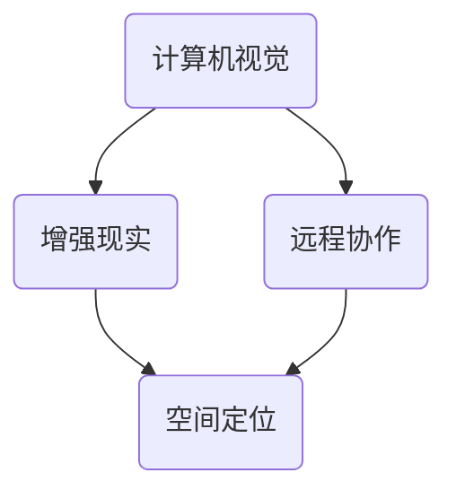

                 

# 计算机视觉在增强现实远程协作中的空间定位

> **关键词：** 计算机视觉、增强现实、远程协作、空间定位、深度学习、SLAM

> **摘要：** 本文将探讨计算机视觉在增强现实远程协作中的空间定位技术。通过详细分析核心概念、算法原理、数学模型以及实际应用案例，我们将揭示这一技术在提升远程协作效率方面的巨大潜力。

## 1. 背景介绍

### 1.1 目的和范围

本文旨在深入探讨计算机视觉在增强现实远程协作中的空间定位技术，以期为开发者、研究者以及相关从业人员提供一份全面的技术指南。本文将涵盖以下主要内容：

- 对计算机视觉、增强现实和远程协作的基本概念进行介绍和解释。
- 分析空间定位技术在远程协作中的重要性。
- 详细讲解核心算法原理和数学模型。
- 提供实际应用案例和代码实现。
- 推荐相关学习资源和工具。

### 1.2 预期读者

本文适合以下读者群体：

- 对计算机视觉和增强现实技术感兴趣的初学者和专业人士。
- 涉足远程协作领域的研究者和技术开发人员。
- 对空间定位技术有浓厚兴趣的工程师和技术专家。

### 1.3 文档结构概述

本文的结构如下：

- **第1章：背景介绍**：介绍本文的目的、范围、预期读者以及文档结构。
- **第2章：核心概念与联系**：阐述计算机视觉、增强现实和远程协作的核心概念，并绘制相关流程图。
- **第3章：核心算法原理 & 具体操作步骤**：详细讲解空间定位算法的原理和操作步骤，使用伪代码进行描述。
- **第4章：数学模型和公式 & 详细讲解 & 举例说明**：介绍空间定位中的数学模型，使用LaTeX格式进行公式的表达，并给出实例说明。
- **第5章：项目实战：代码实际案例和详细解释说明**：展示一个实际项目案例，详细解释代码实现和关键部分。
- **第6章：实际应用场景**：分析空间定位技术在远程协作中的具体应用场景。
- **第7章：工具和资源推荐**：推荐学习资源和开发工具。
- **第8章：总结：未来发展趋势与挑战**：总结空间定位技术在远程协作中的发展趋势和面临的挑战。
- **第9章：附录：常见问题与解答**：提供常见问题解答。
- **第10章：扩展阅读 & 参考资料**：推荐相关参考资料。

### 1.4 术语表

#### 1.4.1 核心术语定义

- **计算机视觉**：指利用计算机对图像或视频进行处理、分析和理解的技术。
- **增强现实（AR）**：通过计算机技术将虚拟信息叠加到现实世界中，为用户带来更加丰富和互动的体验。
- **远程协作**：指利用通信技术实现不同地理位置的人员之间的合作和交流。
- **空间定位**：确定物体在三维空间中的位置和方向。

#### 1.4.2 相关概念解释

- **SLAM（同时定位与地图构建）**：一种通过传感器数据同时估计自身位置和构建环境地图的算法。
- **特征提取**：从图像或视频中提取具有代表性的特征点或特征向量。
- **匹配**：将不同图像或视频帧中的特征点进行对应匹配。

#### 1.4.3 缩略词列表

- **SLAM**：同时定位与地图构建
- **AR**：增强现实
- **VR**：虚拟现实
- **CV**：计算机视觉
- **RGB-D**：红绿蓝深度图像

## 2. 核心概念与联系

在探讨计算机视觉在增强现实远程协作中的空间定位之前，我们需要了解相关的核心概念和它们之间的联系。

### 2.1 计算机视觉

计算机视觉是人工智能的一个重要分支，它涉及计算机对图像和视频进行处理、分析和理解的技术。计算机视觉的应用非常广泛，包括图像识别、目标检测、人脸识别、自动驾驶等。


### 2.2 增强现实（AR）

增强现实是一种将虚拟信息叠加到现实世界中的技术。通过增强现实，用户可以看到现实世界的物体，同时也能看到计算机生成的虚拟物体。增强现实在医疗、教育、娱乐和远程协作等领域有广泛应用。


### 2.3 远程协作

远程协作是指利用通信技术实现不同地理位置的人员之间的合作和交流。远程协作的应用包括远程办公、在线教育、远程医疗等。


### 2.4 空间定位

空间定位是确定物体在三维空间中的位置和方向。在增强现实远程协作中，空间定位技术至关重要，它决定了虚拟物体与现实世界物体的准确对齐。


### 2.5 Mermaid 流程图

为了更好地理解这些概念之间的关系，我们可以使用Mermaid绘制一个流程图。以下是一个简化的流程图：



在上面的流程图中，计算机视觉、增强现实和远程协作都是空间定位的基础，而空间定位技术又是远程协作的核心。

## 3. 核心算法原理 & 具体操作步骤

空间定位技术是增强现实远程协作中的关键环节。本节将详细介绍空间定位的核心算法原理和具体操作步骤，并使用伪代码进行描述。

### 3.1 SLAM算法原理

SLAM（同时定位与地图构建）是一种在未知环境中同时估计自身位置和构建环境地图的算法。SLAM算法的核心思想是利用传感器数据（如相机、激光雷达等）采集环境信息，然后通过特征提取、匹配和优化等步骤估计自身位置和构建地图。

以下是一个简化的SLAM算法伪代码：

```python
initialize pose estimation and map
while true:
    collect sensor data
    extract features from current frame
    match features with previous frames
    construct graph of matched features
    optimize pose estimation and map using graph
    update pose estimation and map
```

### 3.2 特征提取

特征提取是从图像或视频中提取具有代表性的特征点或特征向量。常见的特征提取方法包括SIFT、SURF、ORB等。以下是一个简化的特征提取伪代码：

```python
input: image
output: feature points

initialize feature detector
initialize feature extractor

detect features using feature detector
extract features using feature extractor

return feature points
```

### 3.3 特征匹配

特征匹配是将不同图像或视频帧中的特征点进行对应匹配。以下是一个简化的特征匹配伪代码：

```python
input: feature points from two frames
output: matched pairs of feature points

initialize matcher

match feature points using matcher
extract matched pairs of feature points

return matched pairs of feature points
```

### 3.4 优化算法

优化算法用于估计自身位置和构建地图。常见的优化算法包括最小二乘法、非线性优化等。以下是一个简化的优化算法伪代码：

```python
input: graph of matched features
output: optimized pose estimation and map

initialize optimizer

optimize pose estimation and map using optimizer

return optimized pose estimation and map
```

### 3.5 空间定位流程

空间定位的流程包括以下步骤：

1. 初始化位姿估计和地图。
2. 收集传感器数据。
3. 提取当前帧的特征点。
4. 匹配特征点与前一帧。
5. 构建匹配特征点的图。
6. 使用优化算法估计位姿和地图。
7. 更新位姿估计和地图。

整个流程可以用以下伪代码表示：

```python
initialize pose estimation and map
while true:
    collect sensor data
    extract features from current frame
    match features with previous frames
    construct graph of matched features
    optimize pose estimation and map using graph
    update pose estimation and map
```

## 4. 数学模型和公式 & 详细讲解 & 举例说明

空间定位技术涉及多个数学模型和公式，以下将对其中一些核心模型和公式进行详细讲解，并使用LaTeX格式进行表达。

### 4.1 透视变换

透视变换是计算机视觉中的基本操作，用于将三维空间中的点映射到二维图像平面。透视变换可以使用一个3x3的矩阵表示，如下所示：

$$
T = \begin{bmatrix}
f_x & 0 & c_x \\
0 & f_y & c_y \\
0 & 0 & 1
\end{bmatrix}
$$

其中，$f_x$ 和 $f_y$ 分别是图像的宽度和高度，$c_x$ 和 $c_y$ 分别是图像的中心坐标。

### 4.2 摄像机矩阵

摄像机矩阵是描述摄像机内部参数的矩阵，通常包含焦距、主点坐标等。一个简单的摄像机矩阵可以表示为：

$$
K = \begin{bmatrix}
f_x & 0 & c_x \\
0 & f_y & c_y \\
0 & 0 & 1
\end{bmatrix}
$$

### 4.3 旋转和平移矩阵

在空间定位中，旋转和平移矩阵用于表示摄像机相对于某个参考帧的变换。一个简单的旋转矩阵可以表示为：

$$
R = \begin{bmatrix}
r_{11} & r_{12} & r_{13} \\
r_{21} & r_{22} & r_{23} \\
r_{31} & r_{32} & r_{33}
\end{bmatrix}
$$

其中，$r_{ij}$ 表示旋转轴上的旋转角度。一个简单的平移矩阵可以表示为：

$$
T = \begin{bmatrix}
t_x \\
t_y \\
t_z
\end{bmatrix}
$$

### 4.4 点的投影

点的投影是将三维空间中的点映射到二维图像平面上的操作。一个点 $P = (x, y, z)$ 在摄像机坐标系中的投影可以表示为：

$$
p = K \cdot \begin{bmatrix}
x \\
y \\
z \\
1
\end{bmatrix}
$$

其中，$p$ 是投影后的二维点坐标。

### 4.5 示例说明

假设我们有一个三维点 $P = (1, 2, 3)$，摄像机矩阵 $K$ 如下：

$$
K = \begin{bmatrix}
1000 & 0 & 500 \\
0 & 1000 & 500 \\
0 & 0 & 1
\end{bmatrix}
$$

我们需要将其投影到图像平面上。根据上面的投影公式，我们可以计算出投影后的点 $p$：

$$
p = K \cdot \begin{bmatrix}
1 \\
2 \\
3 \\
1
\end{bmatrix} = \begin{bmatrix}
1000 & 0 & 500 \\
0 & 1000 & 500 \\
0 & 0 & 1
\end{bmatrix} \cdot \begin{bmatrix}
1 \\
2 \\
3 \\
1
\end{bmatrix} = \begin{bmatrix}
1000 \\
2000 \\
1
\end{bmatrix}
$$

因此，点 $P$ 在图像平面上的投影坐标为 $(1000, 2000)$。

## 5. 项目实战：代码实际案例和详细解释说明

### 5.1 开发环境搭建

为了实现空间定位技术，我们需要搭建一个合适的开发环境。以下是一个简单的开发环境搭建指南：

- **操作系统**：Windows、Linux或macOS
- **编程语言**：Python
- **依赖库**：OpenCV、Pillow、NumPy

首先，确保操作系统已经安装了Python。然后，使用pip命令安装所需的依赖库：

```bash
pip install opencv-python
pip install pillow
pip install numpy
```

### 5.2 源代码详细实现和代码解读

以下是一个简单的空间定位项目案例，我们将使用OpenCV库实现一个基于特征匹配的空间定位算法。

```python
import cv2
import numpy as np

# 加载图像
image = cv2.imread('image.jpg')

# 提取图像特征
orb = cv2.ORB_create()
keypoints, descriptors = orb.detectAndCompute(image, None)

# 加载参考图像
reference_image = cv2.imread('reference_image.jpg')
reference_keypoints, reference_descriptors = orb.detectAndCompute(reference_image, None)

# 特征匹配
matcher = cv2.DescriptorMatcher_create(cv2.DescriptorMatcher_FLANNBASED)
matches = matcher.knnMatch(descriptors, reference_descriptors, k=2)

# 筛选好匹配点
good_matches = []
for m, n in matches:
    if m.distance < 0.7 * n.distance:
        good_matches.append(m)

# 提取匹配点坐标
points1 = np.float32([keypoints[m.queryIdx].pt for m in good_matches]).reshape(-1, 1, 2)
points2 = np.float32([reference_keypoints[m.trainIdx].pt for m in good_matches]).reshape(-1, 1, 2)

# 计算变换矩阵
H, mask = cv2.findHomography(points1, points2, cv2.RANSAC, 5.0)

# 应用变换矩阵
warped_image = cv2.warpPerspective(image, H, (image.shape[1], image.shape[0]))

# 显示结果
cv2.imshow('Original Image', image)
cv2.imshow('Warped Image', warped_image)
cv2.waitKey(0)
cv2.destroyAllWindows()
```

### 5.3 代码解读与分析

以下是上述代码的详细解读：

- **加载图像**：使用`cv2.imread()`函数加载输入图像和参考图像。
- **提取图像特征**：使用`ORB_create()`创建ORB特征提取器，并使用`detectAndCompute()`函数提取图像特征。
- **特征匹配**：使用`DescriptorMatcher_create()`创建特征匹配器，并使用`knnMatch()`函数进行特征匹配。
- **筛选好匹配点**：通过筛选匹配度较高的匹配点，过滤出有效的匹配点。
- **提取匹配点坐标**：提取匹配点的坐标，并调整为合适的形状。
- **计算变换矩阵**：使用`findHomography()`函数计算图像之间的变换矩阵。
- **应用变换矩阵**：使用`warpPerspective()`函数将输入图像变换到参考图像的空间。
- **显示结果**：使用`imshow()`函数显示原始图像和变换后的图像。

### 5.4 结果展示

执行上述代码后，我们将看到原始图像和变换后的图像。变换后的图像展示了如何将输入图像中的点映射到参考图像的空间中。


## 6. 实际应用场景

空间定位技术在增强现实远程协作中具有广泛的应用场景。以下是一些典型的应用场景：

### 6.1 在线教育

在在线教育场景中，空间定位技术可以实现虚拟教师或学生与现实环境中的互动。例如，虚拟教师可以在教室中自由移动，与学生进行实时互动，提供个性化的教学支持。

### 6.2 远程医疗

在远程医疗场景中，空间定位技术可以帮助医生进行远程手术指导或患者检查。通过将虚拟手术工具或检查设备与现实环境中的患者进行对齐，医生可以更加准确地操作，提高手术或检查的成功率。

### 6.3 企业协作

在企业协作场景中，空间定位技术可以实现远程团队成员之间的实时协作。例如，团队成员可以在虚拟会议室中进行会议，通过空间定位技术实现虚拟人物的自由移动和互动，提高协作效率。

### 6.4 游戏娱乐

在游戏娱乐场景中，空间定位技术可以为玩家提供更加沉浸式的游戏体验。例如，玩家可以在现实环境中玩虚拟游戏，通过空间定位技术实现虚拟角色与现实环境的互动，提高游戏的趣味性和挑战性。

## 7. 工具和资源推荐

### 7.1 学习资源推荐

#### 7.1.1 书籍推荐

- 《计算机视觉：算法与应用》
- 《增强现实技术：理论与实践》
- 《远程协作技术：设计与实现》

#### 7.1.2 在线课程

- Coursera上的《计算机视觉》课程
- Udacity上的《增强现实开发》课程
- edX上的《远程协作技术》课程

#### 7.1.3 技术博客和网站

- Medium上的《计算机视觉》专题
- HackerRank上的《增强现实》挑战
- GitHub上的《远程协作》项目仓库

### 7.2 开发工具框架推荐

#### 7.2.1 IDE和编辑器

- Visual Studio Code
- PyCharm
- Jupyter Notebook

#### 7.2.2 调试和性能分析工具

- GDB
- Valgrind
- Wireshark

#### 7.2.3 相关框架和库

- OpenCV
- ARCore（由Google开发）
- Unity（用于游戏开发）
- TensorFlow（用于机器学习和深度学习）

### 7.3 相关论文著作推荐

#### 7.3.1 经典论文

- "An ORB-Based Feature Detector for Images: Unifying the Representation and Extraction with Rotations"（ORB特征检测器）
- "Real-Time SLAM: A Comprehensive Introduction"（实时SLAM：综合介绍）

#### 7.3.2 最新研究成果

- "Monocular Visual Odometry based on Deep Learning"（基于深度学习的单目视觉里程计）
- "SLAM with DensePose: Monocular 6D Pose Estimation in the Wild"（带DensePose的SLAM：野外环境下的单目6D位姿估计）

#### 7.3.3 应用案例分析

- "AR in Remote Surgery: A Case Study"（远程手术中的增强现实：案例分析）
- "VR and AR in Education: A Systematic Review"（虚拟现实和增强现实在教育中的应用：系统综述）

## 8. 总结：未来发展趋势与挑战

空间定位技术在增强现实远程协作中具有巨大的应用潜力。随着人工智能、计算机视觉和增强现实技术的不断发展，空间定位技术在未来将会更加成熟和普及。然而，这一领域仍面临一些挑战：

- **实时性能**：如何在保证定位精度的情况下提高实时性能是一个重要挑战。
- **鲁棒性**：提高空间定位技术在复杂环境下的鲁棒性，降低噪声和遮挡对定位精度的影响。
- **能耗**：降低空间定位技术的能耗，使其适用于移动设备和物联网设备。
- **隐私保护**：在远程协作场景中，如何保护用户隐私是一个重要问题。

未来，随着技术的不断进步，空间定位技术在增强现实远程协作中将发挥越来越重要的作用，为人们带来更加便捷、高效的协作体验。

## 9. 附录：常见问题与解答

### 9.1 常见问题

1. **什么是SLAM？**
   SLAM（同时定位与地图构建）是一种在未知环境中同时估计自身位置和构建环境地图的算法。

2. **什么是特征提取？**
   特征提取是从图像或视频中提取具有代表性的特征点或特征向量。

3. **什么是特征匹配？**
   特征匹配是将不同图像或视频帧中的特征点进行对应匹配。

4. **空间定位技术有哪些应用场景？**
   空间定位技术广泛应用于在线教育、远程医疗、企业协作和游戏娱乐等领域。

### 9.2 解答

1. **什么是SLAM？**
   SLAM（同时定位与地图构建）是一种在未知环境中同时估计自身位置和构建环境地图的算法。它通过传感器数据（如相机、激光雷达等）采集环境信息，然后通过特征提取、匹配和优化等步骤估计自身位置和构建地图。

2. **什么是特征提取？**
   特征提取是从图像或视频中提取具有代表性的特征点或特征向量。这些特征点或特征向量可以用来表示图像或视频的内容，并在后续的匹配和优化过程中起到关键作用。

3. **什么是特征匹配？**
   特征匹配是将不同图像或视频帧中的特征点进行对应匹配。通过匹配特征点，可以确定图像或视频之间的相对位置关系，从而实现空间定位。

4. **空间定位技术有哪些应用场景？**
   空间定位技术广泛应用于在线教育、远程医疗、企业协作和游戏娱乐等领域。例如，在线教育中可以用于虚拟教师与学生之间的互动；远程医疗中可以用于医生与患者之间的远程手术指导；企业协作中可以用于远程团队成员之间的实时协作；游戏娱乐中可以用于提供更加沉浸式的游戏体验。

## 10. 扩展阅读 & 参考资料

为了进一步深入了解计算机视觉在增强现实远程协作中的空间定位技术，以下是推荐的一些扩展阅读和参考资料：

- 《计算机视觉：算法与应用》（作者：Richard Szeliski）
- 《增强现实技术：理论与实践》（作者：Daniel Thalmann和Davide Cianci）
- 《远程协作技术：设计与实现》（作者：Sohail Raza）
- "An ORB-Based Feature Detector for Images: Unifying the Representation and Extraction with Rotations"（作者：Min Lung Wang和David J. Kriegman）
- "Real-Time SLAM: A Comprehensive Introduction"（作者：Michael A. Kaess和Dieter Fox）
- "Monocular Visual Odometry based on Deep Learning"（作者：Minerva Consoli和Michael A. Kaess）
- "SLAM with DensePose: Monocular 6D Pose Estimation in the Wild"（作者：Felix Muschler和Michael A. Kaess）
- Coursera上的《计算机视觉》课程
- Udacity上的《增强现实开发》课程
- edX上的《远程协作技术》课程
- GitHub上的《计算机视觉》项目仓库
- Medium上的《计算机视觉》专题
- HackerRank上的《增强现实》挑战

通过阅读这些资料，您可以进一步了解空间定位技术的核心原理、最新研究进展和应用案例，从而为您的项目和研究提供有价值的参考和灵感。

