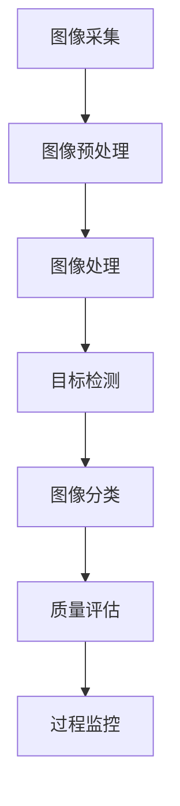

                 

# 计算机视觉在工业质量检测中的实时应用

> **关键词：**计算机视觉、工业质量检测、实时应用、图像处理、深度学习
>
> **摘要：**本文将深入探讨计算机视觉在工业质量检测中的应用，分析其在提高生产效率、确保产品质量方面的关键作用。通过详细的理论讲解、算法原理、实际案例以及未来发展趋势，本文旨在为读者提供一个全面的技术解读和实战指南。

## 1. 背景介绍

### 1.1 目的和范围

本文的目的是介绍计算机视觉在工业质量检测中的实时应用，分析其技术原理、核心算法以及实际案例。本文旨在为从事工业质量检测的技术人员提供一个全面的技术指南，帮助他们更好地理解和应用计算机视觉技术。

本文的范围涵盖了计算机视觉在工业质量检测中的基础知识、核心算法原理、数学模型、实际应用案例以及未来发展趋势。通过本文的阅读，读者将能够了解如何将计算机视觉技术应用于工业质量检测，并掌握相关技术实现的细节。

### 1.2 预期读者

本文的预期读者包括以下几类：

1. **工业质量检测工程师**：对工业质量检测流程和技术有一定了解，希望深入了解计算机视觉在其中的应用。
2. **计算机视觉研究人员**：对计算机视觉技术有一定了解，希望了解其在工业质量检测中的应用和实践。
3. **技术管理人员**：负责技术选型和项目管理，需要了解计算机视觉技术对工业质量检测的影响和实际应用。
4. **计算机科学与技术专业学生**：对计算机视觉和工业质量检测领域有兴趣，希望通过本文获得对相关技术的深入理解。

### 1.3 文档结构概述

本文的结构分为以下几个部分：

1. **背景介绍**：介绍本文的目的、范围、预期读者以及文档结构。
2. **核心概念与联系**：阐述计算机视觉在工业质量检测中的核心概念和联系。
3. **核心算法原理 & 具体操作步骤**：详细讲解计算机视觉在工业质量检测中的核心算法原理和操作步骤。
4. **数学模型和公式 & 详细讲解 & 举例说明**：介绍与计算机视觉相关的数学模型和公式，并进行详细讲解和举例说明。
5. **项目实战：代码实际案例和详细解释说明**：通过实际代码案例展示计算机视觉在工业质量检测中的应用。
6. **实际应用场景**：分析计算机视觉在工业质量检测中的实际应用场景。
7. **工具和资源推荐**：推荐相关学习资源、开发工具框架和相关论文著作。
8. **总结：未来发展趋势与挑战**：总结计算机视觉在工业质量检测中的未来发展趋势和面临的挑战。
9. **附录：常见问题与解答**：提供常见问题的解答。
10. **扩展阅读 & 参考资料**：推荐相关扩展阅读和参考资料。

### 1.4 术语表

#### 1.4.1 核心术语定义

- **计算机视觉**：使计算机能够像人类一样理解和解释视觉信息的技术和理论。
- **工业质量检测**：对工业产品在生产过程中的质量进行检测和评估的过程。
- **实时应用**：在计算机视觉系统运行时，能够实时处理和响应输入信息的应用。
- **图像处理**：对图像进行数字化、增强、分割、识别等处理的一系列技术。
- **深度学习**：一种基于多层神经网络的学习方法，能够自动从数据中学习特征并进行预测和分类。

#### 1.4.2 相关概念解释

- **卷积神经网络（CNN）**：一种深度学习模型，通过卷积层提取图像特征，实现图像分类、目标检测等功能。
- **图像分类**：将图像分为不同类别的过程，常用于目标检测和图像识别。
- **目标检测**：在图像中识别并定位出特定的目标，常用于工业质量检测中的缺陷识别。
- **深度学习框架**：用于构建和训练深度学习模型的软件库，如TensorFlow、PyTorch等。

#### 1.4.3 缩略词列表

- **CNN**：卷积神经网络（Convolutional Neural Network）
- **DNN**：深度神经网络（Deep Neural Network）
- **GPU**：图形处理器（Graphics Processing Unit）
- **CPU**：中央处理器（Central Processing Unit）
- **ROS**：机器人操作系统（Robot Operating System）

## 2. 核心概念与联系

在探讨计算机视觉在工业质量检测中的应用之前，我们首先需要了解一些核心概念和它们之间的联系。以下是计算机视觉在工业质量检测中的核心概念及其相互关系。

### 2.1 计算机视觉与工业质量检测的联系

计算机视觉是工业质量检测的重要工具，它能够通过图像处理、目标检测和分类等技术，实现对产品生产过程中缺陷的识别和评估。具体来说，计算机视觉在工业质量检测中的作用包括：

1. **缺陷识别**：通过图像处理技术，对产品表面缺陷进行定位和分类，如划痕、孔洞、色泽不均等。
2. **质量评估**：通过目标检测和分类技术，对产品的质量等级进行评估，如合格品、次品等。
3. **过程监控**：实时监控生产过程中的关键环节，如温度、压力等，及时发现并预警异常情况。

### 2.2 核心概念原理

以下是计算机视觉在工业质量检测中的核心概念原理：

1. **图像处理**：图像处理是计算机视觉的基础，包括图像的采集、预处理、增强、分割和特征提取等步骤。通过图像处理，可以提取出图像中的关键信息，为后续的目标检测和分类提供支持。

2. **目标检测**：目标检测是计算机视觉的一个重要任务，旨在从图像或视频序列中识别并定位出特定的目标。常用的目标检测算法包括基于传统机器学习的算法（如SVM、R-CNN）和基于深度学习的算法（如YOLO、Faster R-CNN）。

3. **图像分类**：图像分类是将图像分为不同类别的过程，如将缺陷图像分为划痕、孔洞等。图像分类算法包括基于传统机器学习的算法（如K-近邻、支持向量机）和基于深度学习的算法（如卷积神经网络）。

4. **深度学习**：深度学习是一种基于多层神经网络的学习方法，能够自动从数据中学习特征并进行预测和分类。在计算机视觉中，深度学习广泛应用于图像分类、目标检测和图像分割等领域。

### 2.3 架构和流程

计算机视觉在工业质量检测中的应用架构和流程如下：

1. **图像采集**：通过工业相机或其他传感器采集产品图像。
2. **图像预处理**：对采集的图像进行去噪、增强、对比度调整等预处理操作，以提高图像质量。
3. **图像处理**：对预处理后的图像进行分割、特征提取等操作，提取出图像中的关键信息。
4. **目标检测**：利用目标检测算法，从图像中识别并定位出缺陷目标。
5. **图像分类**：利用图像分类算法，对缺陷目标进行分类，如合格品、次品等。
6. **质量评估**：根据缺陷目标的检测结果和分类结果，对产品的质量进行评估。
7. **过程监控**：实时监控生产过程中的关键参数，如温度、压力等，及时发现并预警异常情况。

### 2.4 Mermaid 流程图

以下是计算机视觉在工业质量检测中的核心概念和流程的Mermaid流程图：



在接下来的章节中，我们将详细探讨计算机视觉在工业质量检测中的核心算法原理、具体操作步骤、数学模型和公式，并通过实际案例展示其应用。

## 3. 核心算法原理 & 具体操作步骤

### 3.1 图像处理算法原理

图像处理是计算机视觉在工业质量检测中的基础，其核心目的是提取图像中的关键信息，为后续的目标检测和分类提供支持。以下是图像处理算法的原理和具体操作步骤：

#### 3.1.1 图像预处理

图像预处理主要包括去噪、增强、对比度调整等操作，以提高图像的质量和清晰度。具体步骤如下：

1. **去噪**：利用滤波算法，如均值滤波、高斯滤波等，去除图像中的噪声。
   ```python
   import cv2
   image = cv2.imread('image.jpg')
   image = cv2.GaussianBlur(image, (5, 5), 0)
   ```
2. **增强**：通过调整图像的亮度和对比度，增强图像的细节。
   ```python
   import cv2
   image = cv2.imread('image.jpg')
   image = cv2.equalizeHist(image)
   ```
3. **对比度调整**：通过线性变换调整图像的对比度。
   ```python
   import cv2
   image = cv2.imread('image.jpg')
   alpha = 1.2  # 对比度增强系数
   beta = 10  # 平移量
   image = cv2.convertScaleAbs(image, alpha=alpha, beta=beta)
   ```

#### 3.1.2 图像分割

图像分割是将图像划分为多个区域的过程，每个区域具有相似的特性。常用的图像分割算法包括基于阈值的分割、基于区域的分割和基于边缘的分割。

1. **基于阈值的分割**：通过设定阈值，将图像分为前景和背景。
   ```python
   import cv2
   image = cv2.imread('image.jpg', cv2.IMREAD_GRAYSCALE)
   _, binary = cv2.threshold(image, 128, 255, cv2.THRESH_BINARY_INV + cv2.THRESH_OTSU)
   ```
2. **基于区域的分割**：通过比较区域间的相似性，将图像分割为多个区域。
   ```python
   import cv2
   image = cv2.imread('image.jpg')
   labels, _ = cv2.connectedComponents(binary)
   regions = cv2.label2img(labels)
   ```
3. **基于边缘的分割**：通过检测图像中的边缘，将图像分割为前景和背景。
   ```python
   import cv2
   image = cv2.imread('image.jpg', cv2.IMREAD_GRAYSCALE)
   edges = cv2.Canny(image, 100, 200)
   image[edges == 255] = 255
   image[edges != 255] = 0
   ```

#### 3.1.3 特征提取

特征提取是从图像中提取出具有区分性的特征，用于后续的目标检测和分类。常用的特征提取方法包括颜色特征、纹理特征和形状特征。

1. **颜色特征**：通过计算图像的颜色直方图，提取颜色特征。
   ```python
   import cv2
   image = cv2.imread('image.jpg')
   color_histogram = cv2.calcHist([image], [0], None, [256], [0, 256])
   ```
2. **纹理特征**：通过计算图像的纹理直方图，提取纹理特征。
   ```python
   import cv2
   image = cv2.imread('image.jpg', cv2.IMREAD_GRAYSCALE)
   texture_histogram = cv2.calcHist([image], [0], None, [16], [0, 16])
   ```
3. **形状特征**：通过计算图像的形状特征，如周长、面积、矩形度等，提取形状特征。
   ```python
   import cv2
   image = cv2.imread('image.jpg', cv2.IMREAD_GRAYSCALE)
   contours, _ = cv2.findContours(image, cv2.RETR_EXTERNAL, cv2.CHAIN_APPROX_SIMPLE)
   for contour in contours:
       perimeter = cv2.arcLength(contour, True)
       area = cv2.contourArea(contour)
       rectangularity = area / (perimeter * perimeter)
   ```

### 3.2 目标检测算法原理

目标检测是计算机视觉中的一个重要任务，旨在从图像或视频序列中识别并定位出特定的目标。以下是目标检测算法的原理和具体操作步骤：

#### 3.2.1 基于传统机器学习的目标检测算法

基于传统机器学习的目标检测算法包括支持向量机（SVM）、随机森林（Random Forest）等。

1. **支持向量机（SVM）**：
   - **原理**：SVM是一种二分类模型，通过找到一个最佳的超平面，将不同类别的样本分隔开来。
   - **步骤**：
     ```python
     from sklearn.svm import SVC
     from sklearn.model_selection import train_test_split

     X, y = ...  # 数据准备
     X_train, X_test, y_train, y_test = train_test_split(X, y, test_size=0.2)

     model = SVC(kernel='linear')
     model.fit(X_train, y_train)
     accuracy = model.score(X_test, y_test)
     ```

2. **随机森林（Random Forest）**：
   - **原理**：随机森林是一种基于决策树的集成学习模型，通过构建多个决策树并投票得出最终结果。
   - **步骤**：
     ```python
     from sklearn.ensemble import RandomForestClassifier
     from sklearn.model_selection import train_test_split

     X, y = ...  # 数据准备
     X_train, X_test, y_train, y_test = train_test_split(X, y, test_size=0.2)

     model = RandomForestClassifier(n_estimators=100)
     model.fit(X_train, y_train)
     accuracy = model.score(X_test, y_test)
     ```

#### 3.2.2 基于深度学习的目标检测算法

基于深度学习的目标检测算法包括卷积神经网络（CNN）、区域建议网络（R-CNN）等。

1. **卷积神经网络（CNN）**：
   - **原理**：CNN是一种深度学习模型，通过卷积层提取图像特征，实现图像分类、目标检测等功能。
   - **步骤**：
     ```python
     import tensorflow as tf
     from tensorflow.keras.models import Sequential
     from tensorflow.keras.layers import Conv2D, Flatten, Dense

     model = Sequential([
         Conv2D(32, (3, 3), activation='relu', input_shape=(28, 28, 1)),
         Flatten(),
         Dense(10, activation='softmax')
     ])

     model.compile(optimizer='adam', loss='categorical_crossentropy', metrics=['accuracy'])
     model.fit(X_train, y_train, epochs=10, batch_size=32, validation_data=(X_test, y_test))
     ```

2. **区域建议网络（R-CNN）**：
   - **原理**：R-CNN是一种基于深度学习的目标检测算法，通过提取区域建议和分类特征，实现目标检测。
   - **步骤**：
     ```python
     import tensorflow as tf
     from tensorflow.keras.models import Model
     from tensorflow.keras.layers import Input, Conv2D, Flatten, Dense

     input_layer = Input(shape=(28, 28, 1))
     conv_layer = Conv2D(32, (3, 3), activation='relu')(input_layer)
     flatten_layer = Flatten()(conv_layer)
     output_layer = Dense(10, activation='softmax')(flatten_layer)

     model = Model(inputs=input_layer, outputs=output_layer)

     model.compile(optimizer='adam', loss='categorical_crossentropy', metrics=['accuracy'])
     model.fit(X_train, y_train, epochs=10, batch_size=32, validation_data=(X_test, y_test))
     ```

### 3.3 图像分类算法原理

图像分类是将图像分为不同类别的过程，如将缺陷图像分为划痕、孔洞等。以下是图像分类算法的原理和具体操作步骤：

#### 3.3.1 基于传统机器学习的图像分类算法

基于传统机器学习的图像分类算法包括K-近邻（K-Nearest Neighbors，K-NN）和支持向量机（SVM）。

1. **K-近邻（K-NN）**：
   - **原理**：K-NN算法是一种基于实例的学习方法，通过计算新样本与训练样本的相似度，选择最近的K个样本并预测其类别。
   - **步骤**：
     ```python
     from sklearn.neighbors import KNeighborsClassifier
     from sklearn.model_selection import train_test_split

     X, y = ...  # 数据准备
     X_train, X_test, y_train, y_test = train_test_split(X, y, test_size=0.2)

     model = KNeighborsClassifier(n_neighbors=3)
     model.fit(X_train, y_train)
     accuracy = model.score(X_test, y_test)
     ```

2. **支持向量机（SVM）**：
   - **原理**：SVM是一种二分类模型，通过找到一个最佳的超平面，将不同类别的样本分隔开来。
   - **步骤**：
     ```python
     from sklearn.svm import SVC
     from sklearn.model_selection import train_test_split

     X, y = ...  # 数据准备
     X_train, X_test, y_train, y_test = train_test_split(X, y, test_size=0.2)

     model = SVC(kernel='linear')
     model.fit(X_train, y_train)
     accuracy = model.score(X_test, y_test)
     ```

#### 3.3.2 基于深度学习的图像分类算法

基于深度学习的图像分类算法包括卷积神经网络（CNN）和迁移学习。

1. **卷积神经网络（CNN）**：
   - **原理**：CNN是一种深度学习模型，通过卷积层提取图像特征，实现图像分类。
   - **步骤**：
     ```python
     import tensorflow as tf
     from tensorflow.keras.models import Sequential
     from tensorflow.keras.layers import Conv2D, Flatten, Dense

     model = Sequential([
         Conv2D(32, (3, 3), activation='relu', input_shape=(28, 28, 1)),
         Flatten(),
         Dense(10, activation='softmax')
     ])

     model.compile(optimizer='adam', loss='categorical_crossentropy', metrics=['accuracy'])
     model.fit(X_train, y_train, epochs=10, batch_size=32, validation_data=(X_test, y_test))
     ```

2. **迁移学习**：
   - **原理**：迁移学习是一种利用预训练模型进行新任务学习的方法，通过在预训练模型的基础上进行微调，提高新任务的性能。
   - **步骤**：
     ```python
     import tensorflow as tf
     from tensorflow.keras.applications import VGG16
     from tensorflow.keras.layers import Flatten, Dense
     from tensorflow.keras.models import Model

     base_model = VGG16(weights='imagenet', include_top=False, input_shape=(224, 224, 3))
     x = Flatten()(base_model.output)
     x = Dense(10, activation='softmax')(x)

     model = Model(inputs=base_model.input, outputs=x)

     model.compile(optimizer='adam', loss='categorical_crossentropy', metrics=['accuracy'])
     model.fit(X_train, y_train, epochs=10, batch_size=32, validation_data=(X_test, y_test))
     ```

通过以上核心算法原理和具体操作步骤的讲解，读者可以更好地理解计算机视觉在工业质量检测中的应用。在接下来的章节中，我们将进一步探讨数学模型和公式，并通过实际案例展示其应用。

## 4. 数学模型和公式 & 详细讲解 & 举例说明

### 4.1 图像处理中的数学模型

图像处理中的数学模型主要包括图像的采样、图像的变换和图像的特征提取。以下是这些模型的基本原理和公式：

#### 4.1.1 图像的采样

图像的采样是指将连续的图像信号转换为离散的数字图像。采样过程中涉及的主要参数有采样频率和采样点数。

- **采样频率（f_s）**：采样频率是指每秒钟采集的样本数，通常用采样率（采样频率的单位是Hz）表示。采样频率与采样时间（T_s）的关系为：
  $$ f_s = \frac{1}{T_s} $$

- **采样点数（N）**：采样点数是指图像在水平方向和垂直方向上的采样点数。采样点数与图像分辨率的关系为：
  $$ N = f_s \times T_s $$

#### 4.1.2 图像的变换

图像的变换是指将原始图像通过某种数学变换，得到新的图像。常见的图像变换有傅里叶变换、离散余弦变换、离散小波变换等。

- **傅里叶变换**：傅里叶变换是一种将图像从空间域转换到频域的方法。傅里叶变换的公式为：
  $$ F(u, v) = \sum_{x=0}^{N-1} \sum_{y=0}^{N-1} I(x, y) \cdot e^{-j2\pi(u\frac{x}{N} + v\frac{y}{N})} $$
  其中，\( F(u, v) \) 是频域图像，\( I(x, y) \) 是空间域图像，\( N \) 是采样点数。

- **离散余弦变换**：离散余弦变换是一种将图像从空间域转换到频域的方法，与傅里叶变换类似，但更加高效。离散余弦变换的公式为：
  $$ DCT(u, v) = \sum_{x=0}^{N-1} \sum_{y=0}^{N-1} I(x, y) \cdot \cos\left(\frac{2x+1}{2N} \pi u + \frac{2y+1}{2N} \pi v\right) $$
  其中，\( DCT(u, v) \) 是频域图像，\( I(x, y) \) 是空间域图像，\( N \) 是采样点数。

#### 4.1.3 图像的特征提取

图像的特征提取是指从图像中提取出具有区分性的特征，用于后续的目标检测和分类。常见的特征提取方法有颜色特征、纹理特征和形状特征。

- **颜色特征**：颜色特征是指通过计算图像的颜色直方图，提取图像的颜色信息。颜色直方图的公式为：
  $$ H(r, g, b) = \sum_{x=0}^{N-1} \sum_{y=0}^{N-1} \delta(r - I(x, y)_r, g - I(x, y)_g, b - I(x, y)_b) $$
  其中，\( H(r, g, b) \) 是颜色直方图，\( I(x, y) \) 是空间域图像，\( \delta() \) 是指示函数，当条件成立时，返回1，否则返回0。

- **纹理特征**：纹理特征是指通过计算图像的纹理直方图，提取图像的纹理信息。纹理直方图的公式为：
  $$ T(u, v) = \sum_{x=0}^{N-1} \sum_{y=0}^{N-1} \delta(u - I(x, y)_u, v - I(x, y)_v) $$
  其中，\( T(u, v) \) 是纹理直方图，\( I(x, y) \) 是空间域图像，\( \delta() \) 是指示函数。

- **形状特征**：形状特征是指通过计算图像的形状特征，如周长、面积、矩形度等，提取图像的形状信息。形状特征的公式为：
  $$ C = \frac{1}{N} \sum_{x=0}^{N-1} \sum_{y=0}^{N-1} \sqrt{(x - \bar{x})^2 + (y - \bar{y})^2} $$
  $$ A = \frac{1}{2} \sum_{x=0}^{N-1} \sum_{y=0}^{N-1} \sqrt{(x - \bar{x})^2 + (y - \bar{y})^2} $$
  $$ R = \frac{4A}{C} $$
  其中，\( C \) 是周长，\( A \) 是面积，\( R \) 是矩形度，\( I(x, y) \) 是空间域图像，\( \bar{x} \) 和 \( \bar{y} \) 是图像的中心坐标。

### 4.2 目标检测中的数学模型

目标检测中的数学模型主要包括目标检测的损失函数、目标检测的优化算法和目标检测的性能评估指标。

#### 4.2.1 目标检测的损失函数

目标检测的损失函数用于衡量预测框与真实框之间的差距，常用的损失函数有平滑L1损失、交叉熵损失等。

- **平滑L1损失**：平滑L1损失是一种对L1损失的平滑处理，公式为：
  $$ L_{\text{smoothL1}} = \frac{1}{N} \sum_{i=1}^{N} \left( \frac{|y_i - \hat{y_i}|}{\epsilon} + \epsilon \right) $$
  其中，\( y_i \) 是真实框的回归目标，\( \hat{y_i} \) 是预测框的回归目标，\( \epsilon \) 是平滑参数。

- **交叉熵损失**：交叉熵损失是一种用于分类问题的损失函数，公式为：
  $$ L_{\text{crossentropy}} = - \frac{1}{N} \sum_{i=1}^{N} y_i \cdot \log(\hat{y_i}) + (1 - y_i) \cdot \log(1 - \hat{y_i}) $$
  其中，\( y_i \) 是真实框的分类标签，\( \hat{y_i} \) 是预测框的分类概率。

#### 4.2.2 目标检测的优化算法

目标检测的优化算法用于优化模型的参数，提高模型的性能。常用的优化算法有随机梯度下降（SGD）、Adam优化器等。

- **随机梯度下降（SGD）**：随机梯度下降是一种基于梯度信息的优化算法，公式为：
  $$ w_{t+1} = w_t - \alpha \cdot \nabla_w L(w) $$
  其中，\( w_t \) 是第\( t \)次迭代的参数，\( \alpha \) 是学习率，\( \nabla_w L(w) \) 是参数的梯度。

- **Adam优化器**：Adam优化器是一种基于SGD的优化算法，它结合了动量法和RMSprop的特点，公式为：
  $$ \beta_1 = 0.9, \beta_2 = 0.999, \epsilon = 10^{-8} $$
  $$ v_t = \beta_1 v_{t-1} + (1 - \beta_1) \cdot \nabla_w L(w) $$
  $$ s_t = \beta_2 s_{t-1} + (1 - \beta_2) \cdot \frac{\nabla_w L(w)}{\sqrt{v_t}} $$
  $$ \hat{v}_t = \frac{v_t}{1 - \beta_1^t} $$
  $$ \hat{s}_t = \frac{s_t}{1 - \beta_2^t} $$
  $$ w_{t+1} = w_t - \alpha \cdot \frac{\hat{s}_t}{\sqrt{\hat{v}_t} + \epsilon} $$

#### 4.2.3 目标检测的性能评估指标

目标检测的性能评估指标用于衡量模型的检测效果，常用的评估指标有平均准确率（mAP）、精确率（Precision）、召回率（Recall）等。

- **平均准确率（mAP）**：平均准确率是不同召回率下的精确率的平均值，公式为：
  $$ mAP = \frac{1}{N} \sum_{i=1}^{N} Precision_i $$
  其中，\( Precision_i \) 是第\( i \)个召回率下的精确率。

- **精确率（Precision）**：精确率是预测为正例的样本中实际为正例的比例，公式为：
  $$ Precision = \frac{TP}{TP + FP} $$
  其中，\( TP \) 是真实为正例且预测为正例的样本数，\( FP \) 是真实为负例但预测为正例的样本数。

- **召回率（Recall）**：召回率是预测为正例的样本中实际为正例的比例，公式为：
  $$ Recall = \frac{TP}{TP + FN} $$
  其中，\( TP \) 是真实为正例且预测为正例的样本数，\( FN \) 是真实为正例但预测为负例的样本数。

### 4.3 图像分类中的数学模型

图像分类中的数学模型主要包括图像分类的损失函数、图像分类的优化算法和图像分类的性能评估指标。

#### 4.3.1 图像分类的损失函数

图像分类的损失函数用于衡量预测标签与真实标签之间的差距，常用的损失函数有交叉熵损失、对数损失等。

- **交叉熵损失**：交叉熵损失是一种用于分类问题的损失函数，公式为：
  $$ L_{\text{crossentropy}} = - \frac{1}{N} \sum_{i=1}^{N} y_i \cdot \log(\hat{y_i}) + (1 - y_i) \cdot \log(1 - \hat{y_i}) $$
  其中，\( y_i \) 是真实标签，\( \hat{y_i} \) 是预测概率。

- **对数损失**：对数损失是一种用于分类问题的损失函数，公式为：
  $$ L_{\text{logloss}} = - \frac{1}{N} \sum_{i=1}^{N} y_i \cdot \log(\hat{y_i}) $$
  其中，\( y_i \) 是真实标签，\( \hat{y_i} \) 是预测概率。

#### 4.3.2 图像分类的优化算法

图像分类的优化算法用于优化模型的参数，提高模型的性能。常用的优化算法有随机梯度下降（SGD）、Adam优化器等。

- **随机梯度下降（SGD）**：随机梯度下降是一种基于梯度信息的优化算法，公式为：
  $$ w_{t+1} = w_t - \alpha \cdot \nabla_w L(w) $$
  其中，\( w_t \) 是第\( t \)次迭代的参数，\( \alpha \) 是学习率，\( \nabla_w L(w) \) 是参数的梯度。

- **Adam优化器**：Adam优化器是一种基于SGD的优化算法，它结合了动量法和RMSprop的特点，公式为：
  $$ \beta_1 = 0.9, \beta_2 = 0.999, \epsilon = 10^{-8} $$
  $$ v_t = \beta_1 v_{t-1} + (1 - \beta_1) \cdot \nabla_w L(w) $$
  $$ s_t = \beta_2 s_{t-1} + (1 - \beta_2) \cdot \frac{\nabla_w L(w)}{\sqrt{v_t}} $$
  $$ \hat{v}_t = \frac{v_t}{1 - \beta_1^t} $$
  $$ \hat{s}_t = \frac{s_t}{1 - \beta_2^t} $$
  $$ w_{t+1} = w_t - \alpha \cdot \frac{\hat{s}_t}{\sqrt{\hat{v}_t} + \epsilon} $$

#### 4.3.3 图像分类的性能评估指标

图像分类的性能评估指标用于衡量模型的分类效果，常用的评估指标有准确率（Accuracy）、精确率（Precision）、召回率（Recall）等。

- **准确率（Accuracy）**：准确率是预测正确的样本数与总样本数之比，公式为：
  $$ Accuracy = \frac{TP + TN}{TP + TN + FP + FN} $$
  其中，\( TP \) 是真实为正例且预测为正例的样本数，\( TN \) 是真实为负例且预测为负例的样本数，\( FP \) 是真实为负例但预测为正例的样本数，\( FN \) 是真实为正例但预测为负例的样本数。

- **精确率（Precision）**：精确率是预测为正例的样本中实际为正例的比例，公式为：
  $$ Precision = \frac{TP}{TP + FP} $$
  其中，\( TP \) 是真实为正例且预测为正例的样本数，\( FP \) 是真实为负例但预测为正例的样本数。

- **召回率（Recall）**：召回率是预测为正例的样本中实际为正例的比例，公式为：
  $$ Recall = \frac{TP}{TP + FN} $$
  其中，\( TP \) 是真实为正例且预测为正例的样本数，\( FN \) 是真实为正例但预测为负例的样本数。

通过以上数学模型和公式的讲解，读者可以更好地理解计算机视觉在工业质量检测中的应用。在接下来的章节中，我们将通过实际案例展示计算机视觉在工业质量检测中的应用。

### 5. 项目实战：代码实际案例和详细解释说明

#### 5.1 开发环境搭建

在进行计算机视觉在工业质量检测中的应用实战之前，首先需要搭建一个合适的开发环境。以下是一个基本的开发环境搭建步骤：

1. **安装Python环境**：确保Python环境已安装，推荐使用Python 3.8或更高版本。

2. **安装深度学习框架**：安装常用的深度学习框架，如TensorFlow、PyTorch等。以下以TensorFlow为例：
   ```bash
   pip install tensorflow
   ```

3. **安装OpenCV库**：安装OpenCV库，用于图像处理和视频处理：
   ```bash
   pip install opencv-python
   ```

4. **安装Numpy库**：安装Numpy库，用于数学运算：
   ```bash
   pip install numpy
   ```

5. **安装其他依赖库**：根据需要安装其他依赖库，如Scikit-learn等：
   ```bash
   pip install scikit-learn
   ```

#### 5.2 源代码详细实现和代码解读

以下是一个简单的计算机视觉在工业质量检测中的应用代码示例，该示例使用TensorFlow和OpenCV库实现了一个基于卷积神经网络的工业质量检测系统。

```python
import cv2
import numpy as np
import tensorflow as tf

# 加载预训练的深度学习模型
model = tf.keras.models.load_model('quality_detection_model.h5')

# 定义缺陷检测函数
def detect_defects(image_path):
    # 读取图像
    image = cv2.imread(image_path)
    image = cv2.resize(image, (224, 224))  # 将图像调整为模型输入大小

    # 将图像数据转换为模型的输入格式
    image = np.expand_dims(image, axis=0)
    image = image / 255.0  # 将图像数据归一化

    # 使用模型进行预测
    predictions = model.predict(image)

    # 解析预测结果
    defect_classes = ['no_defect', 'defect_1', 'defect_2']  # 缺陷类别
    predicted_class = np.argmax(predictions, axis=1)
    predicted_label = defect_classes[predicted_class[0]]

    # 绘制检测结果
    if predicted_label != 'no_defect':
        image = cv2.rectangle(image, (50, 50), (175, 175), (0, 0, 255), 2)
        image = cv2.putText(image, predicted_label, (50, 25), cv2.FONT_HERSHEY_SIMPLEX, 1, (0, 0, 255), 2)

    return image

# 测试缺陷检测函数
def test_defect_detection():
    image_path = 'defect_image.jpg'  # 测试图像路径
    result_image = detect_defects(image_path)
    cv2.imshow('Defect Detection', result_image)
    cv2.waitKey(0)
    cv2.destroyAllWindows()

test_defect_detection()
```

**代码解读**：

1. **导入库**：首先导入所需的库，包括OpenCV、Numpy和TensorFlow。

2. **加载模型**：使用`load_model()`函数加载预训练的深度学习模型，该模型用于对输入图像进行缺陷检测。

3. **定义缺陷检测函数**：
   - **读取图像**：使用`imread()`函数读取输入图像，并将其调整为模型输入大小。
   - **图像预处理**：将图像数据扩展为批次维度的数组，并进行归一化处理。
   - **模型预测**：使用`predict()`函数对预处理后的图像进行预测，得到预测类别。

4. **解析预测结果**：根据预测结果，将类别标签转换为可读的字符串。

5. **绘制检测结果**：如果预测结果为缺陷，则在图像上绘制矩形框，并在框内显示缺陷类别。

6. **测试缺陷检测函数**：调用`test_defect_detection()`函数进行测试，展示检测结果。

#### 5.3 代码解读与分析

以下是对上述代码的详细解读和分析：

1. **导入库**：导入所需的库，包括OpenCV、Numpy和TensorFlow。这些库提供了图像处理、数据预处理和深度学习模型训练所需的工具和函数。

2. **加载模型**：使用`load_model()`函数加载预训练的深度学习模型。该模型是基于卷积神经网络（CNN）训练的，可以用于对输入图像进行缺陷检测。加载的模型通常包含多个卷积层和全连接层，用于提取图像特征并进行分类。

3. **定义缺陷检测函数**：
   - **读取图像**：使用`imread()`函数读取输入图像。这个函数可以从文件系统中读取图像，并返回一个Numpy数组。图像可以是任何常见的图像格式，如JPEG、PNG等。
   - **图像预处理**：将图像调整为模型输入大小（在本例中为224x224像素）。这通常是为了确保输入数据的大小一致，以便模型可以进行处理。然后，将图像数据扩展为批次维度的数组，即将单张图像转换为包含一个图像的批次。接下来，将图像数据除以255进行归一化，以便数据在0到1的范围内，这有助于加速模型的训练过程。

4. **模型预测**：使用`predict()`函数对预处理后的图像进行预测。该函数将输入图像传递给模型，并返回一个包含预测概率的数组。在本例中，模型预测了一个包含三个类别的数组，分别是“no_defect”、“defect_1”和“defect_2”。

5. **解析预测结果**：使用`np.argmax()`函数找到预测概率最高的类别索引，并将其转换为对应的类别标签。这里定义了一个缺陷类别列表，用于将索引映射到具体的类别名称。

6. **绘制检测结果**：如果预测结果为“no_defect”以外的类别，表示图像中检测到了缺陷。使用`rectangle()`函数在图像上绘制一个矩形框，以突出显示缺陷区域。然后，使用`putText()`函数在框内显示缺陷类别。

7. **测试缺陷检测函数**：调用`test_defect_detection()`函数进行测试。这个函数加载一个测试图像，并调用`detect_defects()`函数进行缺陷检测。最后，使用`imshow()`函数显示检测结果，并等待用户按任意键关闭窗口。

通过这个简单的示例，我们可以看到如何使用深度学习模型进行工业质量检测。在实际应用中，可能需要更复杂的预处理、更多的训练数据和更精细的模型调优，以提高检测的准确率和鲁棒性。

### 6. 实际应用场景

计算机视觉在工业质量检测中的实际应用场景非常广泛，以下是一些典型的应用案例：

#### 6.1 电子制造行业

在电子制造行业中，计算机视觉技术可以用于检测电路板（PCB）的焊接点、元器件的安装质量和导电性能等。例如，使用深度学习算法对焊接点进行检测，可以识别出焊接不良、短路或开路等问题。通过对成千上万张图像的分析，计算机视觉系统可以在生产过程中实时检测和分类缺陷，确保产品质量。

#### 6.2 汽车制造行业

在汽车制造过程中，计算机视觉技术可用于检测车身外观、内饰、轮胎等部件的质量。例如，使用图像处理算法对车身涂漆进行质量检测，可以识别出颜色不均、划痕、污渍等问题。在装配过程中，计算机视觉系统可以帮助确认螺丝的紧固程度、零件的位置精度等，从而提高装配质量和生产效率。

#### 6.3 食品和饮料行业

在食品和饮料行业，计算机视觉技术可以用于检测产品包装的质量、外观和卫生状况。例如，对罐装饮料的封口进行检查，可以确保没有泄漏或破损。对于食品切片，计算机视觉系统可以检测切片的厚度、形状和颜色，确保产品的一致性和质量。

#### 6.4 机械加工行业

在机械加工行业，计算机视觉技术可用于检测零件的尺寸、形状和表面质量。例如，使用三维扫描技术对机械零件进行精确测量，可以检测出尺寸偏差和表面缺陷。通过实时监控和反馈，计算机视觉系统可以帮助调整加工参数，确保产品的加工质量和一致性。

#### 6.5 航空航天行业

在航空航天行业，计算机视觉技术可以用于检测飞机零部件的制造质量、装配质量和运行状态。例如，通过高分辨率图像分析，可以检测出复合材料部件中的裂纹、气泡等问题。此外，计算机视觉系统还可以用于无人机的导航和避障，确保飞行安全。

通过上述实际应用案例可以看出，计算机视觉在工业质量检测中的应用不仅能够提高生产效率和产品质量，还能够降低人工成本和检测错误率。随着技术的不断进步，计算机视觉在工业质量检测中的应用前景将更加广阔。

### 7. 工具和资源推荐

#### 7.1 学习资源推荐

要深入了解计算机视觉在工业质量检测中的应用，以下是几本推荐的书籍、在线课程和技术博客：

##### 7.1.1 书籍推荐

1. **《计算机视觉：算法与应用》**（Ashraf A. M. Abdulla）：本书详细介绍了计算机视觉的基础理论和应用，适合初学者和有一定基础的读者。
2. **《深度学习：卷积神经网络与视觉识别》**（Ian Goodfellow、Yoshua Bengio、Aaron Courville）：这本书是深度学习领域的经典教材，深入讲解了卷积神经网络在图像处理中的应用。
3. **《机器学习实战》**（Peter Harrington）：本书通过大量的实例和代码，详细介绍了机器学习的基本算法和应用，包括图像分类和目标检测。

##### 7.1.2 在线课程

1. **《深度学习专项课程》**（吴恩达）：由深度学习领域的权威专家吴恩达教授开设，涵盖了深度学习的基础知识、神经网络和卷积神经网络等。
2. **《计算机视觉专项课程》**（斯坦福大学）：斯坦福大学开设的计算机视觉专项课程，详细介绍了计算机视觉的基本原理和应用。
3. **《机器学习与数据科学专项课程》**（北京大学）：该课程涵盖了机器学习和数据科学的基础知识，包括图像分类和目标检测等内容。

##### 7.1.3 技术博客和网站

1. **《雷锋网》**：提供最新的AI技术和应用资讯，包括计算机视觉在工业质量检测中的应用案例。
2. **《机器之心》**：专注于机器学习和人工智能领域的技术博客，涵盖深度学习和计算机视觉等前沿技术。
3. **《TensorFlow官网》**：TensorFlow官方文档和教程，提供了丰富的深度学习模型和应用实例。

#### 7.2 开发工具框架推荐

##### 7.2.1 IDE和编辑器

1. **PyCharm**：强大的Python IDE，支持多种编程语言，适用于深度学习和计算机视觉项目的开发。
2. **Jupyter Notebook**：适用于数据分析和交互式编程，特别适合探索性研究和模型训练。
3. **Visual Studio Code**：轻量级且功能强大的代码编辑器，适用于Python、C++等多种编程语言。

##### 7.2.2 调试和性能分析工具

1. **TensorBoard**：TensorFlow的官方可视化工具，用于分析和调试深度学习模型。
2. **NVIDIA Nsight**：用于调试和性能分析NVIDIA GPU的专用工具。
3. **PyTorch Profiler**：PyTorch官方的性能分析工具，帮助开发者优化代码性能。

##### 7.2.3 相关框架和库

1. **TensorFlow**：广泛使用的深度学习框架，适用于构建和训练复杂的神经网络模型。
2. **PyTorch**：动态图深度学习框架，提供了灵活的编程接口和丰富的预训练模型。
3. **OpenCV**：开源的计算机视觉库，提供了丰富的图像处理和计算机视觉算法。
4. **Scikit-learn**：用于机器学习的Python库，提供了多种经典的机器学习算法和工具。

#### 7.3 相关论文著作推荐

##### 7.3.1 经典论文

1. **“A Cognitive Theory of Vision”**（J. J. Gibson）：阐述了视觉感知的基本原理和过程，对计算机视觉的研究具有重要意义。
2. **“Object Recognition in Combinatorial Vision”**（J. A. Atick and A. D. Redish）：提出了组合视觉理论，为计算机视觉提供了新的思路。
3. **“Convolutional Networks and Applications in Vision”**（Y. LeCun、B. Boser、J. S. Denker）：介绍了卷积神经网络在图像识别中的应用，标志着深度学习时代的到来。

##### 7.3.2 最新研究成果

1. **“Deep Learning for Object Detection”**（F. Chollet）：详细介绍了深度学习在目标检测中的应用，包括基于卷积神经网络的检测算法。
2. **“A Brief Introduction to Transfer Learning”**（F. Chollet）：介绍了迁移学习的基本原理和应用，为小样本学习提供了有效的解决方案。
3. **“Understanding Deep Learning”**（Y. Bengio、A. Courville、P. Vincent）：深入讲解了深度学习的理论基础和技术细节。

##### 7.3.3 应用案例分析

1. **“Computer Vision in Manufacturing: A Case Study”**（IBM）：分析了计算机视觉在制造业中的应用案例，包括生产线质量检测和设备故障诊断。
2. **“AI-powered Quality Inspection: A Vision for the Future”**（PwC）：探讨了人工智能和计算机视觉在质量检测领域的未来趋势和潜在价值。
3. **“Deep Learning for Defect Detection in Electronics Manufacturing”**（Microsoft）：介绍了深度学习在电子制造行业中的应用，包括缺陷检测和分类。

通过以上工具和资源推荐，读者可以更加系统地学习和掌握计算机视觉在工业质量检测中的应用，为实际项目的开发提供有力支持。

## 8. 总结：未来发展趋势与挑战

随着计算机视觉技术的不断进步和工业自动化需求的增长，计算机视觉在工业质量检测中的应用前景十分广阔。以下是未来发展趋势与挑战的探讨：

### 8.1 未来发展趋势

1. **算法性能提升**：随着深度学习算法的优化和计算资源的增加，计算机视觉算法在图像处理、目标检测和分类等方面的性能将得到显著提升，从而提高工业质量检测的准确率和效率。

2. **多模态数据融合**：未来，计算机视觉系统将整合更多类型的传感器数据，如红外、激光、超声波等，实现多模态数据融合，以获得更全面的质量检测信息，提高检测精度。

3. **实时数据处理**：随着边缘计算和5G技术的发展，计算机视觉系统将能够在设备边缘实时处理数据，实现快速响应，进一步缩短检测周期。

4. **智能决策支持**：计算机视觉系统将结合大数据分析和人工智能技术，提供智能化的决策支持，辅助工程师优化生产流程和制定质量标准。

### 8.2 面临的挑战

1. **数据隐私与安全**：在工业质量检测中，计算机视觉系统需要处理大量的生产数据，涉及数据隐私和安全问题。如何确保数据安全，防止数据泄露，将成为一大挑战。

2. **设备可靠性与稳定性**：工业环境复杂多变，计算机视觉系统需要具备高可靠性和稳定性，以应对各种恶劣工作条件，保证持续运行。

3. **算法泛化能力**：当前计算机视觉算法往往在特定环境下表现优秀，但在不同环境下可能存在泛化能力不足的问题。如何提高算法的泛化能力，使其适应各种复杂环境，是未来需要解决的关键问题。

4. **技术普及与人才短缺**：尽管计算机视觉技术具有巨大潜力，但在实际应用中，技术普及度和人才短缺仍然是制约其发展的主要因素。如何推动技术普及，培养更多专业人才，是实现计算机视觉在工业质量检测中广泛应用的重要保障。

总之，计算机视觉在工业质量检测中的应用前景广阔，但也面临诸多挑战。通过技术创新、政策支持和人才培养，有望推动计算机视觉在工业质量检测中的广泛应用，进一步提升工业生产效率和产品质量。

## 9. 附录：常见问题与解答

在本文中，我们讨论了计算机视觉在工业质量检测中的实时应用，包括其核心概念、算法原理、数学模型和实际案例。以下是一些常见问题及解答：

### 9.1 如何确保计算机视觉系统的可靠性？

**解答**：计算机视觉系统的可靠性主要依赖于以下几点：
1. **硬件设备**：选择高质量的工业相机和稳定的传感器，确保系统的硬件设备能够适应复杂的工作环境。
2. **算法优化**：通过算法优化和模型训练，提高系统的检测准确率和鲁棒性。
3. **数据预处理**：对输入数据进行预处理，如去噪、增强和归一化，以提高图像质量和系统性能。
4. **冗余设计**：在设计系统中引入冗余，如多个相机或多个检测模块，以提高系统的可靠性和稳定性。

### 9.2 计算机视觉在工业质量检测中的应用有哪些局限性？

**解答**：计算机视觉在工业质量检测中的应用存在以下局限性：
1. **环境影响**：环境光线、温度、湿度等因素可能影响图像质量和系统性能。
2. **多模态信息缺失**：仅依赖图像数据可能无法全面评估产品的质量，需要结合其他传感器数据。
3. **算法泛化能力**：当前算法在特定环境下表现优秀，但在不同环境中可能存在泛化能力不足的问题。
4. **数据隐私和安全**：处理大量生产数据时，需确保数据隐私和安全，防止数据泄露。

### 9.3 如何优化计算机视觉系统的性能？

**解答**：以下方法可以优化计算机视觉系统的性能：
1. **模型选择**：选择适合问题的模型架构，如卷积神经网络（CNN）或循环神经网络（RNN）。
2. **超参数调优**：通过调整学习率、批量大小、迭代次数等超参数，优化模型性能。
3. **数据增强**：通过数据增强技术，增加训练数据多样性，提高模型的泛化能力。
4. **硬件加速**：利用GPU或TPU等硬件加速计算，提高模型训练和推理速度。

### 9.4 计算机视觉在工业质量检测中的应用前景如何？

**解答**：计算机视觉在工业质量检测中的应用前景十分广阔：
1. **提高生产效率**：通过自动化检测，减少人工干预，提高生产效率和产品质量。
2. **降低成本**：减少废品率和返工成本，降低整体生产成本。
3. **智能化决策**：结合大数据分析和人工智能技术，为工程师提供智能化的决策支持。
4. **适应多种环境**：通过多模态数据融合和算法优化，提高系统在不同环境下的适应能力。

## 10. 扩展阅读 & 参考资料

为了深入了解计算机视觉在工业质量检测中的应用，以下是推荐的扩展阅读和参考资料：

### 10.1 相关书籍

1. **《计算机视觉基础教程》**（Edward R. Davison）：详细介绍了计算机视觉的基本概念、算法和技术。
2. **《深度学习》**（Ian Goodfellow、Yoshua Bengio、Aaron Courville）：全面讲解了深度学习的基础理论和应用。
3. **《机器学习实战》**（Peter Harrington）：通过实例介绍了机器学习的基本算法和应用。

### 10.2 在线课程

1. **《深度学习专项课程》**（吴恩达）：由知名学者吴恩达教授开设，涵盖深度学习的基础知识。
2. **《计算机视觉专项课程》**（斯坦福大学）：由斯坦福大学提供，详细介绍计算机视觉的基本原理和应用。
3. **《机器学习与数据科学专项课程》**（北京大学）：由北京大学开设，涵盖机器学习和数据科学的基础知识。

### 10.3 技术博客和网站

1. **《雷锋网》**：提供最新的AI技术和应用资讯。
2. **《机器之心》**：专注于机器学习和人工智能领域的技术博客。
3. **《TensorFlow官网》**：提供TensorFlow的官方文档和教程。

### 10.4 相关论文和期刊

1. **《IEEE Transactions on Pattern Analysis and Machine Intelligence》**：该期刊是计算机视觉和模式识别领域的顶级期刊。
2. **《ACM Transactions on Computer Vision and Graphics》**：该期刊是计算机视觉和图形学领域的顶级期刊。
3. **《International Journal of Computer Vision》**：该期刊是计算机视觉领域的权威期刊。

通过以上扩展阅读和参考资料，读者可以进一步深入了解计算机视觉在工业质量检测中的应用，提高自己的技术水平和专业知识。

