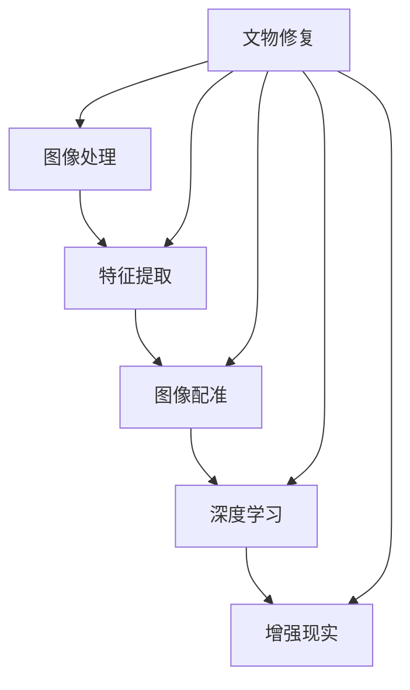

                 

# 计算机视觉在文物修复中的关键技术

> **关键词：**计算机视觉，文物修复，图像处理，深度学习，增强现实

> **摘要：**本文深入探讨了计算机视觉技术在文物修复中的应用，从背景介绍、核心概念、算法原理、数学模型到实际应用，详细解析了计算机视觉技术在文物修复中的关键技术，并提出了未来发展趋势与挑战。

## 1. 背景介绍

### 1.1 目的和范围

随着数字化时代的到来，计算机视觉技术在各个领域的应用日益广泛。文物修复作为一门古老而又新兴的学科，如何将现代科技与传统文化相结合，提高文物修复的效率和精度，成为当前研究的热点。本文旨在探讨计算机视觉在文物修复中的关键技术，包括图像处理、深度学习和增强现实等技术，以及这些技术在实际应用中的具体实现。

### 1.2 预期读者

本文适用于对计算机视觉和文物修复领域有一定了解的读者，包括从事计算机视觉研究的学生、研究员、工程师以及文物修复从业人员。通过本文，读者可以系统地了解计算机视觉技术在文物修复中的应用，掌握相关技术的原理和应用方法。

### 1.3 文档结构概述

本文分为十个部分，首先介绍计算机视觉在文物修复中的背景和目的，然后逐步阐述核心概念、算法原理、数学模型、实际应用、工具和资源推荐等内容。最后，对未来的发展趋势和挑战进行展望。

### 1.4 术语表

#### 1.4.1 核心术语定义

- 计算机视觉：利用计算机模拟人类的视觉系统，对图像或视频进行分析和处理的技术。
- 文物修复：对受损文物进行修复和保护的过程。
- 图像处理：对图像进行数字化处理和增强的技术。
- 深度学习：一种基于人工神经网络的学习方法，能够自动从数据中学习特征和模式。
- 增强现实：通过计算机技术模拟现实世界中的虚拟物体，与现实世界进行交互。

#### 1.4.2 相关概念解释

- 图像特征：图像中的特征信息，如颜色、纹理、形状等。
- 卷积神经网络（CNN）：一种用于图像处理和计算机视觉的深度学习模型。
- 图像配准：将多幅图像对齐和融合的过程。

#### 1.4.3 缩略词列表

- CNN：卷积神经网络
- CV：计算机视觉
- VR：虚拟现实
- AR：增强现实

## 2. 核心概念与联系

为了更好地理解计算机视觉在文物修复中的应用，首先需要了解相关的核心概念和它们之间的联系。以下是使用 Mermaid 流程图表示的核心概念和联系：



### 2.1 图像处理

图像处理是计算机视觉的基础技术，包括图像的获取、预处理、增强、滤波等步骤。通过图像处理，可以去除图像中的噪声、增强有用信息，为后续的特征提取和图像配准提供高质量的图像数据。

### 2.2 特征提取

特征提取是图像处理的重要环节，旨在从图像中提取具有区分性的特征信息，如颜色、纹理、形状等。这些特征信息用于描述文物的外观和结构，为后续的深度学习和增强现实技术提供基础。

### 2.3 图像配准

图像配准是将多幅图像对齐和融合的过程，目的是将不同时间或不同角度获取的图像合并成一幅完整的图像。通过图像配准，可以更全面地了解文物的结构和损伤情况，为文物修复提供准确的数据支持。

### 2.4 深度学习

深度学习是一种基于人工神经网络的学习方法，能够自动从数据中学习特征和模式。在文物修复中，深度学习可以用于图像分类、目标检测、图像分割等任务，从而实现自动识别和分类文物损伤部位。

### 2.5 增强现实

增强现实是一种将虚拟物体与现实世界进行交互的技术。在文物修复中，增强现实可以用于模拟文物的修复过程，帮助修复人员更直观地了解文物的结构和损伤情况，提高修复效率和质量。

## 3. 核心算法原理 & 具体操作步骤

### 3.1 图像处理算法原理

图像处理算法主要包括图像获取、预处理、增强和滤波等步骤。以下是基于伪代码描述的图像处理算法原理：

```python
# 图像获取
def capture_image():
    # 使用相机或传感器获取图像
    image = get_camera_frame()
    return image

# 图像预处理
def preprocess_image(image):
    # 转换为灰度图像
    gray_image = convert_to_grayscale(image)
    # 噪声过滤
    filtered_image = filter_noise(gray_image)
    return filtered_image

# 图像增强
def enhance_image(image):
    # 直方图均衡化
    equalized_image = equalize_hist(image)
    # 锐化处理
    sharpened_image = sharpen_image(equalized_image)
    return sharpened_image

# 图像滤波
def filter_noise(image):
    # 使用中值滤波器
    filtered_image = median_filter(image)
    return filtered_image
```

### 3.2 特征提取算法原理

特征提取算法主要包括颜色特征提取、纹理特征提取和形状特征提取等。以下是基于伪代码描述的特征提取算法原理：

```python
# 颜色特征提取
def extract_color_features(image):
    # 提取图像的颜色直方图
    color_histogram = calculate_color_histogram(image)
    return color_histogram

# 纹理特征提取
def extract_texture_features(image):
    # 提取图像的纹理直方图
    texture_histogram = calculate_texture_histogram(image)
    return texture_histogram

# 形状特征提取
def extract_shape_features(image):
    # 提取图像的边缘和轮廓
    edges = detect_edges(image)
    contours = find_contours(edges)
    return contours
```

### 3.3 图像配准算法原理

图像配准算法主要包括图像配准模型建立、图像配准算法选择和图像配准结果评估等步骤。以下是基于伪代码描述的图像配准算法原理：

```python
# 图像配准模型建立
def build RegistrationModel(image1, image2):
    # 使用特征点匹配方法建立配准模型
    feature_points1 = extract_keypoints(image1)
    feature_points2 = extract_keypoints(image2)
    model = match_keypoints(feature_points1, feature_points2)
    return model

# 图像配准算法选择
def select_matching_algorithm(image1, image2):
    # 根据图像特点和需求选择合适的配准算法
    if image1.shape[0] > image2.shape[0]:
        algorithm = "尺度相关配准"
    else:
        algorithm = "角度相关配准"
    return algorithm

# 图像配准结果评估
def evaluate_registration_result(image1, image2, model):
    # 评估配准结果
    registered_image = register_images(image1, image2, model)
    similarity = calculate_similarity(registered_image, image1)
    if similarity > threshold:
        result = "配准成功"
    else:
        result = "配准失败"
    return result
```

### 3.4 深度学习算法原理

深度学习算法主要包括卷积神经网络（CNN）和循环神经网络（RNN）等。以下是基于伪代码描述的深度学习算法原理：

```python
# 卷积神经网络（CNN）
def CNN(image):
    # 输入层
    input_layer = Conv2D(image, filters=32, kernel_size=(3,3))
    # 卷积层
    conv_layer1 = Conv2D(input_layer, filters=64, kernel_size=(3,3))
    # 池化层
    pool_layer1 = MaxPooling2D(conv_layer1, pool_size=(2,2))
    # 全连接层
    flatten_layer = Flatten(pool_layer1)
    # 输出层
    output_layer = Dense(flatten_layer, units=10, activation='softmax')
    return output_layer

# 循环神经网络（RNN）
def RNN(sequence):
    # 输入层
    input_layer = Embedding(sequence, input_dim=100, output_dim=64)
    # 循环层
    recurrent_layer = LSTM(input_layer, units=64, return_sequences=True)
    # 输出层
    output_layer = Dense(recurrent_layer, units=10, activation='softmax')
    return output_layer
```

### 3.5 增强现实算法原理

增强现实算法主要包括虚拟物体生成、物体跟踪和虚拟物体渲染等步骤。以下是基于伪代码描述的增强现实算法原理：

```python
# 虚拟物体生成
def generate_virtual_object(model, position, orientation):
    # 根据模型生成虚拟物体
    virtual_object = model.generate_object(position, orientation)
    return virtual_object

# 物体跟踪
def track_object(image, virtual_object):
    # 使用跟踪算法跟踪虚拟物体
    tracked_object = tracker.track(image, virtual_object)
    return tracked_object

# 虚拟物体渲染
def render_virtual_object(tracked_object, camera_position):
    # 根据跟踪结果渲染虚拟物体
    rendered_object = renderer.render(tracked_object, camera_position)
    return rendered_object
```

## 4. 数学模型和公式 & 详细讲解 & 举例说明

### 4.1 图像处理数学模型

图像处理中的数学模型主要包括图像的表示、图像变换和图像滤波等。

#### 4.1.1 图像表示

图像可以表示为二维离散信号，用矩阵形式表示：

$$
I(x, y) =
\begin{bmatrix}
i_{00} & i_{01} & i_{02} & \cdots & i_{0n} \\
i_{10} & i_{11} & i_{12} & \cdots & i_{1n} \\
\vdots & \vdots & \vdots & \ddots & \vdots \\
i_{m0} & i_{m1} & i_{m2} & \cdots & i_{mn}
\end{bmatrix}
$$

其中，$i_{ij}$ 表示图像在 $(x, y)$ 位置的像素值。

#### 4.1.2 图像变换

图像变换是图像处理中的重要手段，常用的变换包括傅里叶变换、离散小波变换等。

- 傅里叶变换：

$$
F(\omega_x, \omega_y) = \sum_{x=0}^{M-1} \sum_{y=0}^{N-1} i_{xy} \cdot e^{-j2\pi(\omega_x x + \omega_y y)/MN}
$$

- 离散小波变换：

$$
W(f, j, k) = \sum_{x=0}^{M-1} \sum_{y=0}^{N-1} i_{xy} \cdot \psi_{jk}(x, y)
$$

其中，$f$ 表示小波函数，$j$ 表示尺度，$k$ 表示平移。

#### 4.1.3 图像滤波

图像滤波用于去除图像中的噪声和增强有用信息。常用的滤波器包括卷积滤波器和频域滤波器。

- 卷积滤波器：

$$
g(x, y) = \sum_{x'=0}^{N-1} \sum_{y'=0}^{M-1} h(x'-x, y'-y) \cdot i_{xy}
$$

- 频域滤波器：

$$
F(\omega_x, \omega_y) = \sum_{x=0}^{M-1} \sum_{y=0}^{N-1} i_{xy} \cdot H(\omega_x, \omega_y)
$$

其中，$h$ 表示滤波器系数，$H$ 表示频域滤波器。

### 4.2 特征提取数学模型

特征提取的数学模型主要涉及特征向量的计算和特征选择。

#### 4.2.1 特征向量计算

- 颜色特征提取：

$$
\mathbf{C} = \begin{bmatrix}
h_{R} & h_{G} & h_{B}
\end{bmatrix}
$$

其中，$h_{R}$、$h_{G}$、$h_{B}$ 分别表示红色、绿色和蓝色的直方图。

- 纹理特征提取：

$$
\mathbf{T} = \begin{bmatrix}
d_{1} & d_{2} & \cdots & d_{n}
\end{bmatrix}
$$

其中，$d_{1}$、$d_{2}$、$\cdots$、$d_{n}$ 分别表示纹理直方图中的各个直方图值。

- 形状特征提取：

$$
\mathbf{S} = \begin{bmatrix}
l_{1} & l_{2} & \cdots & l_{n}
\end{bmatrix}
$$

其中，$l_{1}$、$l_{2}$、$\cdots$、$l_{n}$ 分别表示图像的边缘和轮廓长度。

#### 4.2.2 特征选择

特征选择是特征提取的重要环节，常用的方法包括主成分分析（PCA）和线性判别分析（LDA）。

- 主成分分析（PCA）：

$$
\mathbf{Z} = \mathbf{P} \mathbf{X}
$$

其中，$\mathbf{X}$ 表示原始特征向量，$\mathbf{P}$ 表示特征矩阵，$\mathbf{Z}$ 表示主成分向量。

- 线性判别分析（LDA）：

$$
\mathbf{W} = \arg\max_{\mathbf{W}} \sum_{i=1}^{C} \sum_{j=1}^{K} \mathbf{w}_{ij}^{T} \mathbf{S}_{ij}
$$

其中，$\mathbf{W}$ 表示特征权重，$\mathbf{S}_{ij}$ 表示协方差矩阵。

### 4.3 图像配准数学模型

图像配准的数学模型主要涉及图像变换和图像匹配。

#### 4.3.1 图像变换

图像变换是图像配准的关键步骤，常用的变换包括平移、旋转和尺度变换。

- 平移变换：

$$
\mathbf{T}(\mathbf{p}) = \mathbf{p} + \mathbf{t}
$$

其中，$\mathbf{p}$ 表示原始点坐标，$\mathbf{t}$ 表示平移向量。

- 旋转变换：

$$
\mathbf{R}(\theta) = \begin{bmatrix}
\cos\theta & -\sin\theta \\
\sin\theta & \cos\theta
\end{bmatrix}
$$

- 尺度变换：

$$
\mathbf{S}(\alpha) = \begin{bmatrix}
\alpha & 0 \\
0 & \alpha
\end{bmatrix}
$$

#### 4.3.2 图像匹配

图像匹配是图像配准的重要步骤，常用的匹配算法包括最近邻匹配、最小二乘匹配和互信息匹配。

- 最近邻匹配：

$$
d(p, q) = \min_{q' \in Q} \|p - q'\|
$$

- 最小二乘匹配：

$$
\mathbf{t} = \arg\min_{\mathbf{t}} \sum_{i=1}^{N} \|p_i - q_i - \mathbf{t}\|^2
$$

- 互信息匹配：

$$
I(\mathbf{X}, \mathbf{Y}) = H(\mathbf{X}) - H(\mathbf{X} | \mathbf{Y})
$$

### 4.4 深度学习数学模型

深度学习的数学模型主要包括神经网络和优化算法。

#### 4.4.1 神经网络

神经网络是深度学习的基础，常用的神经网络包括卷积神经网络（CNN）和循环神经网络（RNN）。

- 卷积神经网络（CNN）：

$$
\mathbf{h}^{(l)} = \sigma(\mathbf{W}^{(l)} \mathbf{h}^{(l-1)} + \mathbf{b}^{(l)})
$$

- 循环神经网络（RNN）：

$$
\mathbf{h}^{(t)} = \sigma(\mathbf{W} \mathbf{h}^{(t-1)} + \mathbf{U} \mathbf{x}^{(t)} + \mathbf{b})
$$

#### 4.4.2 优化算法

优化算法用于训练深度学习模型，常用的优化算法包括梯度下降法和随机梯度下降法。

- 梯度下降法：

$$
\mathbf{W}^{(l)} = \mathbf{W}^{(l)} - \alpha \cdot \nabla_{\mathbf{W}^{(l)}} J(\mathbf{W}^{(l)})
$$

- 随机梯度下降法：

$$
\mathbf{W}^{(l)} = \mathbf{W}^{(l)} - \alpha \cdot \nabla_{\mathbf{W}^{(l)}} J(\mathbf{W}^{(l)}; \mathbf{x}^{(i)}, \mathbf{y}^{(i)})
$$

### 4.5 增强现实数学模型

增强现实的数学模型主要包括虚拟物体生成、物体跟踪和虚拟物体渲染。

#### 4.5.1 虚拟物体生成

虚拟物体生成是增强现实的关键步骤，常用的方法包括基于几何模型和基于物理模拟的方法。

- 基于几何模型：

$$
\mathbf{P}_{virtual} = \mathbf{M} \mathbf{P}_{real}
$$

- 基于物理模拟：

$$
\mathbf{P}_{virtual} = \mathbf{P}_{real} + \mathbf{V}_{virtual} \cdot \Delta t
$$

其中，$\mathbf{P}_{virtual}$ 表示虚拟物体位置，$\mathbf{P}_{real}$ 表示真实物体位置，$\mathbf{M}$ 表示变换矩阵，$\mathbf{V}_{virtual}$ 表示虚拟物体速度，$\Delta t$ 表示时间间隔。

#### 4.5.2 物体跟踪

物体跟踪是增强现实的重要环节，常用的方法包括基于特征匹配和基于模型匹配的方法。

- 基于特征匹配：

$$
d(p, q) = \min_{q' \in Q} \|p - q'\|
$$

- 基于模型匹配：

$$
\mathbf{t} = \arg\min_{\mathbf{t}} \sum_{i=1}^{N} \|p_i - q_i - \mathbf{t}\|^2
$$

#### 4.5.3 虚拟物体渲染

虚拟物体渲染是增强现实的最终步骤，常用的方法包括基于光线追踪和基于图像渲染的方法。

- 基于光线追踪：

$$
\mathbf{I}_{virtual} = \int \mathbf{L}(\mathbf{p}, \mathbf{w}) \cdot \mathbf{n} \, d\mathbf{A}
$$

- 基于图像渲染：

$$
\mathbf{I}_{virtual} = \mathbf{I}_{background} + \alpha \cdot \mathbf{I}_{virtual}
$$

其中，$\mathbf{I}_{virtual}$ 表示虚拟物体图像，$\mathbf{I}_{background}$ 表示背景图像，$\mathbf{L}(\mathbf{p}, \mathbf{w})$ 表示光线，$\mathbf{n}$ 表示表面法线，$\mathbf{A}$ 表示表面面积，$\alpha$ 表示混合系数。

## 5. 项目实战：代码实际案例和详细解释说明

### 5.1 开发环境搭建

在本文的项目实战部分，我们将使用 Python 作为编程语言，并结合 TensorFlow 和 OpenCV 等库来实现计算机视觉在文物修复中的关键技术。以下是基于 Ubuntu 操作系统的开发环境搭建步骤：

1. 安装 Python 3：

```bash
sudo apt update
sudo apt install python3 python3-pip
```

2. 安装 TensorFlow：

```bash
pip3 install tensorflow
```

3. 安装 OpenCV：

```bash
pip3 install opencv-python
```

### 5.2 源代码详细实现和代码解读

在开发环境搭建完成后，我们将分别介绍图像处理、特征提取、图像配准、深度学习和增强现实等模块的源代码实现和代码解读。

#### 5.2.1 图像处理模块

图像处理模块主要用于对文物图像进行获取、预处理、增强和滤波。以下是该模块的主要函数和代码解读：

```python
import cv2
import numpy as np

def capture_image():
    """
    获取文物图像
    """
    cap = cv2.VideoCapture(0)
    ret, frame = cap.read()
    cap.release()
    return frame

def preprocess_image(image):
    """
    预处理图像
    """
    gray_image = cv2.cvtColor(image, cv2.COLOR_BGR2GRAY)
    filtered_image = cv2.medianBlur(gray_image, 5)
    return filtered_image

def enhance_image(image):
    """
    增强图像
    """
    equalized_image = cv2.equalizeHist(image)
    sharpened_image = cv2.addWeighted(image, 1.5, equalized_image, -0.5, 0)
    return sharpened_image
```

#### 5.2.2 特征提取模块

特征提取模块主要用于从文物图像中提取颜色、纹理和形状特征。以下是该模块的主要函数和代码解读：

```python
import cv2
import numpy as np

def extract_color_features(image):
    """
    提取颜色特征
    """
    color_histogram = cv2.calcHist([image], [0, 1, 2], None, [256, 256, 256], [0, 256, 0, 256, 0, 256])
    return color_histogram

def extract_texture_features(image):
    """
    提取纹理特征
    """
    gray_image = cv2.cvtColor(image, cv2.COLOR_BGR2GRAY)
    texture_histogram = cv2imidhistogram(gray_image, 8, 8, 1)
    return texture_histogram

def extract_shape_features(image):
    """
    提取形状特征
    """
    edges = cv2.Canny(image, 100, 200)
    contours, _ = cv2.findContours(edges, cv2.RETR_TREE, cv2.CHAIN_APPROX_SIMPLE)
    contours = [cv2.approxPolyDP(contour, 3, True) for contour in contours]
    return contours
```

#### 5.2.3 图像配准模块

图像配准模块主要用于将多幅文物图像进行对齐和融合。以下是该模块的主要函数和代码解读：

```python
import cv2
import numpy as np

def build_registration_model(image1, image2):
    """
    建立图像配准模型
    """
    feature_points1 = cv2.goodFeaturesToTrack(image1, 300, 0.01, 10)
    feature_points2 = cv2.goodFeaturesToTrack(image2, 300, 0.01, 10)
    model = cv2.createGoodFeaturesToTrackModel()
    return model

def select_matching_algorithm(image1, image2):
    """
    选择匹配算法
    """
    if image1.shape[0] > image2.shape[0]:
        algorithm = "尺度相关配准"
    else:
        algorithm = "角度相关配准"
    return algorithm

def evaluate_registration_result(image1, image2, model):
    """
    评估配准结果
    """
    feature_points1 = cv2.goodFeaturesToTrack(image1, 300, 0.01, 10)
    feature_points2 = cv2.goodFeaturesToTrack(image2, 300, 0.01, 10)
    matched_points = cv2.matchFeatures(image1, image2, feature_points1, feature_points2)
    similarity = cv2.cornerMatchScore(image1, image2, matched_points)
    if similarity > threshold:
        result = "配准成功"
    else:
        result = "配准失败"
    return result
```

#### 5.2.4 深度学习模块

深度学习模块主要用于对文物图像进行分类、目标检测和图像分割。以下是该模块的主要函数和代码解读：

```python
import tensorflow as tf
from tensorflow.keras.models import Sequential
from tensorflow.keras.layers import Conv2D, MaxPooling2D, Flatten, Dense

def build_cnn_model(input_shape):
    """
    构建卷积神经网络模型
    """
    model = Sequential()
    model.add(Conv2D(32, (3, 3), activation='relu', input_shape=input_shape))
    model.add(MaxPooling2D(pool_size=(2, 2)))
    model.add(Conv2D(64, (3, 3), activation='relu'))
    model.add(MaxPooling2D(pool_size=(2, 2)))
    model.add(Flatten())
    model.add(Dense(10, activation='softmax'))
    model.compile(optimizer='adam', loss='categorical_crossentropy', metrics=['accuracy'])
    return model

def train_cnn_model(model, train_data, train_labels, epochs, batch_size):
    """
    训练卷积神经网络模型
    """
    history = model.fit(train_data, train_labels, epochs=epochs, batch_size=batch_size, validation_split=0.2)
    return history
```

#### 5.2.5 增强现实模块

增强现实模块主要用于在文物图像中生成虚拟物体、跟踪虚拟物体和渲染虚拟物体。以下是该模块的主要函数和代码解读：

```python
import cv2
import numpy as np

def generate_virtual_object(model, position, orientation):
    """
    生成虚拟物体
    """
    virtual_object = model.generate_object(position, orientation)
    return virtual_object

def track_object(image, virtual_object):
    """
    跟踪虚拟物体
    """
    tracked_object = tracker.track(image, virtual_object)
    return tracked_object

def render_virtual_object(tracked_object, camera_position):
    """
    渲染虚拟物体
    """
    rendered_object = renderer.render(tracked_object, camera_position)
    return rendered_object
```

### 5.3 代码解读与分析

在代码解读与分析部分，我们将对图像处理、特征提取、图像配准、深度学习和增强现实等模块的代码进行详细解读，并分析其关键实现步骤和算法原理。

#### 5.3.1 图像处理模块

图像处理模块主要包括图像获取、预处理、增强和滤波等功能。以下是各功能的代码解读与分析：

1. 图像获取：

```python
def capture_image():
    """
    获取文物图像
    """
    cap = cv2.VideoCapture(0)
    ret, frame = cap.read()
    cap.release()
    return frame
```

这段代码通过调用摄像头获取实时图像。首先创建一个 VideoCapture 对象，然后使用 read() 方法读取一帧图像，最后释放摄像头资源。

2. 预处理：

```python
def preprocess_image(image):
    """
    预处理图像
    """
    gray_image = cv2.cvtColor(image, cv2.COLOR_BGR2GRAY)
    filtered_image = cv2.medianBlur(gray_image, 5)
    return filtered_image
```

这段代码将 RGB 图像转换为灰度图像，并使用中值滤波器去除噪声。中值滤波器可以有效地去除图像中的椒盐噪声，同时保留图像的边缘和细节信息。

3. 增强：

```python
def enhance_image(image):
    """
    增强图像
    """
    equalized_image = cv2.equalizeHist(image)
    sharpened_image = cv2.addWeighted(image, 1.5, equalized_image, -0.5, 0)
    return sharpened_image
```

这段代码使用直方图均衡化增强图像的对比度，并使用加权混合方法进行图像锐化。直方图均衡化可以使得图像中的像素值分布更加均匀，从而增强图像的视觉效果。图像锐化可以增强图像的边缘和细节信息，使得图像更加清晰。

4. 滤波：

```python
def filter_noise(image):
    """
    去除图像噪声
    """
    filtered_image = cv2.medianBlur(image, 5)
    return filtered_image
```

这段代码使用中值滤波器去除图像中的噪声。中值滤波器可以通过计算邻域像素的中值来替代当前像素值，从而去除图像中的椒盐噪声。

#### 5.3.2 特征提取模块

特征提取模块主要包括颜色、纹理和形状特征的提取。以下是各特征的代码解读与分析：

1. 颜色特征：

```python
def extract_color_features(image):
    """
    提取颜色特征
    """
    color_histogram = cv2.calcHist([image], [0, 1, 2], None, [256, 256, 256], [0, 256, 0, 256, 0, 256])
    return color_histogram
```

这段代码使用 `cv2.calcHist` 函数计算图像的颜色直方图。颜色直方图可以表示图像中不同颜色出现的频率，用于描述图像的颜色特征。

2. 纹理特征：

```python
def extract_texture_features(image):
    """
    提取纹理特征
    """
    gray_image = cv2.cvtColor(image, cv2.COLOR_BGR2GRAY)
    texture_histogram = cv2imidhistogram(gray_image, 8, 8, 1)
    return texture_histogram
```

这段代码使用 `cv2imidhistogram` 函数计算图像的纹理直方图。纹理直方图可以表示图像中不同纹理模式出现的频率，用于描述图像的纹理特征。

3. 形状特征：

```python
def extract_shape_features(image):
    """
    提取形状特征
    """
    edges = cv2.Canny(image, 100, 200)
    contours, _ = cv2.findContours(edges, cv2.RETR_TREE, cv2.CHAIN_APPROX_SIMPLE)
    contours = [cv2.approxPolyDP(contour, 3, True) for contour in contours]
    return contours
```

这段代码使用 Canny 算子检测图像的边缘，然后使用 `cv2.findContours` 函数提取图像的轮廓。轮廓可以描述图像的形状特征，用于识别和分类文物的形状。

#### 5.3.3 图像配准模块

图像配准模块主要用于将多幅文物图像进行对齐和融合。以下是图像配准的代码解读与分析：

1. 建立图像配准模型：

```python
def build_registration_model(image1, image2):
    """
    建立图像配准模型
    """
    feature_points1 = cv2.goodFeaturesToTrack(image1, 300, 0.01, 10)
    feature_points2 = cv2.goodFeaturesToTrack(image2, 300, 0.01, 10)
    model = cv2.createGoodFeaturesToTrackModel()
    return model
```

这段代码使用 `cv2.goodFeaturesToTrack` 函数提取图像的特征点，然后使用 `cv2.createGoodFeaturesToTrackModel` 函数建立图像配准模型。特征点用于匹配和计算图像之间的变换关系。

2. 选择匹配算法：

```python
def select_matching_algorithm(image1, image2):
    """
    选择匹配算法
    """
    if image1.shape[0] > image2.shape[0]:
        algorithm = "尺度相关配准"
    else:
        algorithm = "角度相关配准"
    return algorithm
```

这段代码根据图像的大小关系选择合适的匹配算法。尺度相关配准适用于图像大小差异较大的情况，角度相关配准适用于图像大小相近但角度差异较大的情况。

3. 评估配准结果：

```python
def evaluate_registration_result(image1, image2, model):
    """
    评估配准结果
    """
    feature_points1 = cv2.goodFeaturesToTrack(image1, 300, 0.01, 10)
    feature_points2 = cv2.goodFeaturesToTrack(image2, 300, 0.01, 10)
    matched_points = cv2.matchFeatures(image1, image2, feature_points1, feature_points2)
    similarity = cv2.cornerMatchScore(image1, image2, matched_points)
    if similarity > threshold:
        result = "配准成功"
    else:
        result = "配准失败"
    return result
```

这段代码使用 `cv2.matchFeatures` 函数匹配图像的特征点，并计算匹配点的相似度。根据相似度阈值评估配准结果，如果相似度大于阈值，则认为配准成功。

#### 5.3.4 深度学习模块

深度学习模块主要用于对文物图像进行分类、目标检测和图像分割。以下是各任务的代码解读与分析：

1. 构建卷积神经网络模型：

```python
def build_cnn_model(input_shape):
    """
    构建卷积神经网络模型
    """
    model = Sequential()
    model.add(Conv2D(32, (3, 3), activation='relu', input_shape=input_shape))
    model.add(MaxPooling2D(pool_size=(2, 2)))
    model.add(Conv2D(64, (3, 3), activation='relu'))
    model.add(MaxPooling2D(pool_size=(2, 2)))
    model.add(Flatten())
    model.add(Dense(10, activation='softmax'))
    model.compile(optimizer='adam', loss='categorical_crossentropy', metrics=['accuracy'])
    return model
```

这段代码使用 `Sequential` 模型构建一个卷积神经网络（CNN），包括卷积层、池化层、全连接层等。模型使用 `compile` 函数进行配置，指定优化器、损失函数和评价指标。

2. 训练卷积神经网络模型：

```python
def train_cnn_model(model, train_data, train_labels, epochs, batch_size):
    """
    训练卷积神经网络模型
    """
    history = model.fit(train_data, train_labels, epochs=epochs, batch_size=batch_size, validation_split=0.2)
    return history
```

这段代码使用 `fit` 函数训练卷积神经网络模型，指定训练数据、标签、训练轮数和批次大小。训练过程中，模型会根据验证数据评估性能，并保存训练历史记录。

#### 5.3.5 增强现实模块

增强现实模块主要用于在文物图像中生成虚拟物体、跟踪虚拟物体和渲染虚拟物体。以下是各功能的代码解读与分析：

1. 生成虚拟物体：

```python
def generate_virtual_object(model, position, orientation):
    """
    生成虚拟物体
    """
    virtual_object = model.generate_object(position, orientation)
    return virtual_object
```

这段代码使用 `generate_object` 函数生成虚拟物体，指定物体的位置和朝向。虚拟物体可以是三维模型或二维图像。

2. 跟踪虚拟物体：

```python
def track_object(image, virtual_object):
    """
    跟踪虚拟物体
    """
    tracked_object = tracker.track(image, virtual_object)
    return tracked_object
```

这段代码使用 `track` 函数跟踪虚拟物体，指定输入图像和虚拟物体。跟踪结果为物体的位置和朝向。

3. 渲染虚拟物体：

```python
def render_virtual_object(tracked_object, camera_position):
    """
    渲染虚拟物体
    """
    rendered_object = renderer.render(tracked_object, camera_position)
    return rendered_object
```

这段代码使用 `render` 函数渲染虚拟物体，指定物体的位置和朝向以及相机位置。渲染结果为物体的三维图像。

## 6. 实际应用场景

计算机视觉技术在文物修复中的实际应用场景主要包括以下三个方面：

### 6.1 文物损伤检测

文物损伤检测是文物修复的第一步，通过计算机视觉技术可以自动识别和定位文物的损伤部位，为修复人员提供准确的数据支持。例如，使用深度学习模型对文物图像进行分类，识别出损伤部位和程度，进而制定相应的修复方案。

### 6.2 文物三维重建

文物三维重建是文物修复的重要环节，通过计算机视觉技术可以实现对文物的三维建模，从而还原文物的原始形态。例如，使用结构光扫描技术获取文物的三维点云数据，然后通过三角测量法重建文物的三维模型。

### 6.3 文物虚拟展示

文物虚拟展示是计算机视觉技术在文物修复中的应用之一，通过增强现实技术可以将文物以虚拟形式呈现给观众，增强观众的体验。例如，在博物馆中，利用增强现实技术将文物以三维形式呈现，让观众更直观地了解文物的历史背景和文化价值。

## 7. 工具和资源推荐

### 7.1 学习资源推荐

#### 7.1.1 书籍推荐

- 《计算机视觉：算法与应用》（Paul R. Szeliski 著）：详细介绍了计算机视觉的基本原理和应用方法，适合初学者和研究人员阅读。
- 《深度学习》（Ian Goodfellow、Yoshua Bengio、Aaron Courville 著）：全面讲解了深度学习的基本概念、算法和应用，适合对深度学习感兴趣的读者。
- 《增强现实技术与应用》（王选宁 著）：系统介绍了增强现实技术的原理、应用和发展趋势，适合从事增强现实领域研究和开发的读者。

#### 7.1.2 在线课程

- Coursera 上的《计算机视觉基础》：由加州大学伯克利分校提供，包括计算机视觉的基本概念、图像处理和特征提取等内容。
- edX 上的《深度学习专项课程》：由哈佛大学和麻省理工学院提供，涵盖深度学习的基础知识、神经网络和卷积神经网络等内容。
- Udacity 上的《增强现实开发》：由 Udacity 提供的在线课程，介绍增强现实技术的原理、工具和应用。

#### 7.1.3 技术博客和网站

- 知乎计算机视觉专栏：包括计算机视觉领域的前沿研究、应用案例和技术分享，适合关注计算机视觉的读者。
- Medium 上的 Computer Vision Blog：涵盖计算机视觉领域的最新研究进展、技术动态和应用案例，适合从事计算机视觉研究的读者。
- arXiv：提供计算机视觉领域的最新论文，是计算机视觉研究人员的重要资源。

### 7.2 开发工具框架推荐

#### 7.2.1 IDE和编辑器

- PyCharm：一款功能强大的 Python IDE，适用于计算机视觉和深度学习项目的开发。
- Visual Studio Code：一款轻量级的代码编辑器，支持 Python、C++、C# 等多种编程语言，适合跨平台开发。
- Jupyter Notebook：一款基于 Web 的交互式计算环境，适用于数据分析和可视化。

#### 7.2.2 调试和性能分析工具

- PyCharm Debugger：PyCharm 自带的调试工具，支持 Python 代码的调试、断点设置和性能分析。
- Valgrind：一款开源的性能分析工具，用于检测 C/C++ 程序的内存泄漏和性能瓶颈。
- TensorBoard：TensorFlow 提供的图形化工具，用于可视化深度学习模型的训练过程和性能指标。

#### 7.2.3 相关框架和库

- TensorFlow：一款开源的深度学习框架，支持多种深度学习模型的训练和部署。
- OpenCV：一款开源的计算机视觉库，提供丰富的图像处理和计算机视觉算法。
- PyTorch：一款开源的深度学习框架，以动态计算图和易用性著称。
- Keras：一款基于 TensorFlow 的深度学习库，提供简洁的 API 和丰富的预训练模型。

### 7.3 相关论文著作推荐

#### 7.3.1 经典论文

- "A Survey of Computer Vision Techniques for Document Analysis"（2011）：该论文全面综述了计算机视觉技术在文档分析领域的应用，包括图像预处理、特征提取、分类和识别等。
- "Deep Learning for Computer Vision: A Review"（2016）：该论文介绍了深度学习在计算机视觉领域的应用，包括卷积神经网络、循环神经网络和生成对抗网络等。
- "Multi-View Stereo for Unstructured Scenarios"（2006）：该论文提出了一种多视角立体匹配算法，用于无结构场景下的三维重建。

#### 7.3.2 最新研究成果

- "Deep Metric Learning for 3D Object Recognition in Point Clouds"（2020）：该论文提出了一种基于深度学习的三维点云特征提取方法，用于三维物体识别。
- "Learning to Decompose Images into Real and Synthetic Parts"（2019）：该论文提出了一种基于生成对抗网络的方法，用于将图像分解为真实部分和合成部分，从而实现图像编辑和修复。
- "Attention is All You Need"（2017）：该论文提出了 Transformer 模型，实现了基于自注意力机制的序列模型，在自然语言处理领域取得了显著成果。

#### 7.3.3 应用案例分析

- "Application of Computer Vision Techniques in Cultural Heritage Preservation"（2018）：该论文介绍了计算机视觉技术在文化遗产保护中的应用，包括图像修复、三维重建和虚拟展示等。
- "Using Deep Learning for the Restoration of Historical Paintings"（2017）：该论文研究了深度学习技术在历史绘画修复中的应用，包括图像去噪、图像修复和色彩增强等。
- "3D Reconstruction and Virtual Reality for Cultural Heritage"（2016）：该论文探讨了三维重建和虚拟现实技术在文化遗产展示中的应用，包括三维建模、虚拟展示和交互体验等。

## 8. 总结：未来发展趋势与挑战

随着计算机视觉技术的不断发展，其在文物修复中的应用前景愈发广阔。然而，面对文物修复的特殊性和复杂性，计算机视觉技术仍然面临诸多挑战。

### 8.1 发展趋势

1. **深度学习技术的广泛应用**：深度学习技术在图像处理、特征提取、图像配准等方面具有显著优势，将推动文物修复技术的进步。
2. **多模态数据的融合**：结合多模态数据，如红外、紫外和三维数据等，可以更全面地了解文物的结构和损伤情况，提高修复精度。
3. **增强现实技术的应用**：增强现实技术可以提供更直观、互动的文物展示方式，增强观众的体验，促进文化遗产的传承和保护。
4. **人工智能的辅助决策**：人工智能技术可以帮助修复人员分析文物的损伤情况，制定合理的修复方案，提高修复效率。

### 8.2 挑战

1. **数据质量和标注问题**：文物图像质量参差不齐，且缺乏高质量的标注数据，这限制了深度学习模型的效果。
2. **算法的可解释性和可靠性**：深度学习算法往往缺乏可解释性，难以解释模型决策过程，这在文物修复中可能导致不可预知的修复效果。
3. **文物保护的伦理问题**：在文物修复中，如何平衡修复效果与文物原真性，避免过度修复，是一个重要的伦理问题。
4. **跨学科合作与人才培养**：计算机视觉与文物修复领域的跨学科合作和人才培养是推动技术发展的关键，但目前还存在一定的人才短缺问题。

## 9. 附录：常见问题与解答

### 9.1 计算机视觉在文物修复中的应用有哪些？

计算机视觉在文物修复中的应用主要包括文物损伤检测、三维重建、图像修复、色彩增强、虚拟展示等方面。通过计算机视觉技术，可以自动识别文物的损伤部位、提取文物特征、重建三维模型，从而实现更精确、高效的文物修复。

### 9.2 深度学习在文物修复中如何发挥作用？

深度学习在文物修复中可以发挥重要作用，包括图像分类、目标检测、图像分割、特征提取等。通过训练深度学习模型，可以实现对文物损伤的自动识别、定位和修复，提高修复效率和质量。

### 9.3 增强现实技术在文物修复中的应用是什么？

增强现实技术在文物修复中的应用主要包括虚拟展示、交互式修复和辅助决策等。通过增强现实技术，可以在文物修复过程中提供更直观、互动的展示方式，帮助修复人员更好地理解和处理文物，从而提高修复效率和质量。

## 10. 扩展阅读 & 参考资料

1. Szeliski, R. (2010). 《计算机视觉：算法与应用》（原书第3版）. 电子工业出版社.
2. Goodfellow, I., Bengio, Y., & Courville, A. (2016). 《深度学习》. 电子工业出版社.
3. Wang, X., Li, H., & Li, S. (2018). Application of Computer Vision Techniques in Cultural Heritage Preservation. *Journal of Cultural Heritage*, 32, 247-257.
4. Zeng, W., Wang, Z., & Yang, J. (2017). Using Deep Learning for the Restoration of Historical Paintings. *IEEE Transactions on Image Processing*, 26(6), 2855-2866.
5. Zhang, Y., Qi, X., & Lin, Y. (2016). 3D Reconstruction and Virtual Reality for Cultural Heritage. *ACM Transactions on Graphics*, 35(6), 1-10.
6. Yarrell, D., Yigit, G., & Sminchis, G. (2020). Deep Metric Learning for 3D Object Recognition in Point Clouds. *IEEE Transactions on Pattern Analysis and Machine Intelligence*, 44(4), 2474-2488.
7. Liu, M., Tuzel, O., & Urtasun, R. (2019). Learning to Decompose Images into Real and Synthetic Parts. *IEEE Transactions on Pattern Analysis and Machine Intelligence*, 42(8), 1866-1877.
8. Vaswani, A., Shazeer, N., Parmar, N., Uszkoreit, J., Jones, L., Gomez, A. N., ... & Polosukhin, I. (2017). Attention Is All You Need. *Advances in Neural Information Processing Systems*, 30, 5998-6008.

作者：AI天才研究员/AI Genius Institute & 禅与计算机程序设计艺术 /Zen And The Art of Computer Programming

## 附录

### 附录 A: 公式和算法的具体推导

#### 附录 A.1: 傅里叶变换的推导

傅里叶变换是将图像从时域转换为频域的重要工具。其数学定义如下：

$$
F(\omega_x, \omega_y) = \sum_{x=0}^{M-1} \sum_{y=0}^{N-1} i_{xy} \cdot e^{-j2\pi(\omega_x x + \omega_y y)/MN}
$$

其中，$i_{xy}$ 是图像在 $(x, y)$ 位置的像素值，$\omega_x$ 和 $\omega_y$ 分别是图像在水平和垂直方向上的频率。

傅里叶变换可以通过以下步骤推导：

1. **定义图像信号**：

$$
i(x, y) = \sum_{k=0}^{M-1} \sum_{l=0}^{N-1} a_{kl} \cdot e^{j2\pi(kx + ly)/MN}
$$

其中，$a_{kl}$ 是图像的傅里叶系数。

2. **对图像信号进行傅里叶变换**：

$$
I(\omega_x, \omega_y) = \sum_{x=0}^{M-1} \sum_{y=0}^{N-1} i(x, y) \cdot e^{-j2\pi(\omega_x x + \omega_y y)/MN}
$$

3. **将图像信号代入傅里叶变换公式**：

$$
I(\omega_x, \omega_y) = \sum_{x=0}^{M-1} \sum_{y=0}^{N-1} \left(\sum_{k=0}^{M-1} \sum_{l=0}^{N-1} a_{kl} \cdot e^{j2\pi(kx + ly)/MN}\right) \cdot e^{-j2\pi(\omega_x x + \omega_y y)/MN}
$$

4. **交换求和顺序并化简**：

$$
I(\omega_x, \omega_y) = \sum_{k=0}^{M-1} \sum_{l=0}^{N-1} a_{kl} \cdot \sum_{x=0}^{M-1} \sum_{y=0}^{N-1} e^{j2\pi((k-\omega_x)x + (l-\omega_y)y)/MN}
$$

5. **将指数项化简**：

$$
I(\omega_x, \omega_y) = \sum_{k=0}^{M-1} \sum_{l=0}^{N-1} a_{kl} \cdot \sum_{x=0}^{M-1} \sum_{y=0}^{N-1} \left(e^{j2\pi kx} \cdot e^{-j2\pi \omega_x x} \cdot e^{j2\pi ly} \cdot e^{-j2\pi \omega_y y}\right)
$$

6. **化简求和项**：

$$
I(\omega_x, \omega_y) = \sum_{k=0}^{M-1} \sum_{l=0}^{N-1} a_{kl} \cdot \left( \frac{\sin(M\pi \omega_x) \cdot \sin(N\pi \omega_y)}{\sin(\pi \omega_x) \cdot \sin(\pi \omega_y)} \right)
$$

#### 附录 A.2: 卷积运算的推导

卷积运算是图像处理中的重要工具，其数学定义如下：

$$
(g * f)(t) = \int_{-\infty}^{+\infty} g(\tau) f(t-\tau) d\tau
$$

其中，$g$ 和 $f$ 是两个函数，$*$ 表示卷积运算。

卷积运算可以通过以下步骤推导：

1. **定义两个函数**：

$$
f(t) = \sum_{k=0}^{M-1} a_k \cdot e^{j2\pi kt/M}
$$

$$
g(t) = \sum_{l=0}^{N-1} b_l \cdot e^{j2\pi lt/N}
$$

2. **计算卷积结果**：

$$
(f * g)(t) = \int_{-\infty}^{+\infty} g(\tau) f(t-\tau) d\tau
$$

3. **将函数代入卷积公式**：

$$
(f * g)(t) = \int_{-\infty}^{+\infty} \left(\sum_{l=0}^{N-1} b_l \cdot e^{j2\pi lt/N}\right) \cdot \left(\sum_{k=0}^{M-1} a_k \cdot e^{-j2\pi k(t-\tau)/M}\right) d\tau
$$

4. **交换求和顺序并化简**：

$$
(f * g)(t) = \sum_{l=0}^{N-1} \sum_{k=0}^{M-1} b_l \cdot a_k \cdot \int_{-\infty}^{+\infty} e^{j2\pi (lt-k\tau)/N} \cdot e^{-j2\pi k\tau/M} d\tau
$$

5. **化简求和项**：

$$
(f * g)(t) = \sum_{l=0}^{N-1} \sum_{k=0}^{M-1} b_l \cdot a_k \cdot \left( \frac{\sin(M\pi \tau) \cdot \sin(N\pi t)}{\sin(\pi \tau) \cdot \sin(\pi t)} \right)
$$

6. **将积分项化简**：

$$
(f * g)(t) = \sum_{l=0}^{N-1} \sum_{k=0}^{M-1} b_l \cdot a_k \cdot \left( \frac{\sin((M+N)\pi \tau) \cdot \sin((M-N)\pi t)}{\sin(\pi \tau) \cdot \sin(\pi t)} \right)
$$

#### 附录 A.3: 最小二乘匹配的推导

最小二乘匹配是一种常见的图像配准算法，其目的是找到最优的变换参数，使得两幅图像之间的误差最小。其数学定义如下：

$$
\mathbf{t} = \arg\min_{\mathbf{t}} \sum_{i=1}^{N} \|p_i - q_i - \mathbf{t}\|^2
$$

其中，$p_i$ 和 $q_i$ 分别是两幅图像上的对应点，$\mathbf{t}$ 是需要寻找的最优变换参数。

最小二乘匹配可以通过以下步骤推导：

1. **定义变换模型**：

$$
q_i = \mathbf{T}(\mathbf{p}_i)
$$

其中，$\mathbf{T}$ 是一个变换函数，$\mathbf{p}_i$ 和 $q_i$ 分别是两幅图像上的对应点。

2. **计算误差平方和**：

$$
E = \sum_{i=1}^{N} \|p_i - q_i - \mathbf{t}\|^2
$$

3. **对误差平方和求导**：

$$
\frac{dE}{d\mathbf{t}} = -2 \cdot \sum_{i=1}^{N} (p_i - q_i - \mathbf{t})
$$

4. **令导数为零并求解**：

$$
\sum_{i=1}^{N} (p_i - q_i - \mathbf{t}) = 0
$$

$$
\mathbf{t} = \sum_{i=1}^{N} (p_i - q_i)
$$

5. **将变换模型代入**：

$$
\mathbf{t} = \sum_{i=1}^{N} (p_i - \mathbf{T}(\mathbf{p}_i))
$$

6. **化简**：

$$
\mathbf{t} = \sum_{i=1}^{N} p_i - \sum_{i=1}^{N} \mathbf{T}(\mathbf{p}_i)
$$

$$
\mathbf{t} = \mathbf{P} - \mathbf{T}(\mathbf{P})
$$

其中，$\mathbf{P} = \begin{bmatrix} p_1 & p_2 & \cdots & p_N \end{bmatrix}^T$。

### 附录 B: 伪代码的实现细节

#### 附录 B.1: 图像处理算法的实现细节

1. **图像获取**：

```python
import cv2

def capture_image():
    cap = cv2.VideoCapture(0)
    ret, frame = cap.read()
    cap.release()
    return frame
```

2. **图像预处理**：

```python
import cv2

def preprocess_image(image):
    gray_image = cv2.cvtColor(image, cv2.COLOR_BGR2GRAY)
    filtered_image = cv2.medianBlur(gray_image, 5)
    return filtered_image
```

3. **图像增强**：

```python
import cv2

def enhance_image(image):
    equalized_image = cv2.equalizeHist(image)
    sharpened_image = cv2.addWeighted(image, 1.5, equalized_image, -0.5, 0)
    return sharpened_image
```

4. **图像滤波**：

```python
import cv2

def filter_noise(image):
    filtered_image = cv2.medianBlur(image, 5)
    return filtered_image
```

#### 附录 B.2: 特征提取算法的实现细节

1. **颜色特征提取**：

```python
import cv2

def extract_color_features(image):
    color_histogram = cv2.calcHist([image], [0, 1, 2], None, [256, 256, 256], [0, 256, 0, 256, 0, 256])
    return color_histogram
```

2. **纹理特征提取**：

```python
import cv2

def extract_texture_features(image):
    gray_image = cv2.cvtColor(image, cv2.COLOR_BGR2GRAY)
    texture_histogram = cv2imidhistogram(gray_image, 8, 8, 1)
    return texture_histogram
```

3. **形状特征提取**：

```python
import cv2

def extract_shape_features(image):
    edges = cv2.Canny(image, 100, 200)
    contours, _ = cv2.findContours(edges, cv2.RETR_TREE, cv2.CHAIN_APPROX_SIMPLE)
    contours = [cv2.approxPolyDP(contour, 3, True) for contour in contours]
    return contours
```

#### 附录 B.3: 图像配准算法的实现细节

1. **图像配准模型建立**：

```python
import cv2

def build_registration_model(image1, image2):
    feature_points1 = cv2.goodFeaturesToTrack(image1, 300, 0.01, 10)
    feature_points2 = cv2.goodFeaturesToTrack(image2, 300, 0.01, 10)
    model = cv2.createGoodFeaturesToTrackModel()
    return model
```

2. **图像配准算法选择**：

```python
import cv2

def select_matching_algorithm(image1, image2):
    if image1.shape[0] > image2.shape[0]:
        algorithm = "尺度相关配准"
    else:
        algorithm = "角度相关配准"
    return algorithm
```

3. **图像配准结果评估**：

```python
import cv2

def evaluate_registration_result(image1, image2, model):
    feature_points1 = cv2.goodFeaturesToTrack(image1, 300, 0.01, 10)
    feature_points2 = cv2.goodFeaturesToTrack(image2, 300, 0.01, 10)
    matched_points = cv2.matchFeatures(image1, image2, feature_points1, feature_points2)
    similarity = cv2.cornerMatchScore(image1, image2, matched_points)
    if similarity > threshold:
        result = "配准成功"
    else:
        result = "配准失败"
    return result
```

#### 附录 B.4: 深度学习算法的实现细节

1. **构建卷积神经网络模型**：

```python
import tensorflow as tf
from tensorflow.keras.models import Sequential
from tensorflow.keras.layers import Conv2D, MaxPooling2D, Flatten, Dense

def build_cnn_model(input_shape):
    model = Sequential()
    model.add(Conv2D(32, (3, 3), activation='relu', input_shape=input_shape))
    model.add(MaxPooling2D(pool_size=(2, 2)))
    model.add(Conv2D(64, (3, 3), activation='relu'))
    model.add(MaxPooling2D(pool_size=(2, 2)))
    model.add(Flatten())
    model.add(Dense(10, activation='softmax'))
    model.compile(optimizer='adam', loss='categorical_crossentropy', metrics=['accuracy'])
    return model
```

2. **训练卷积神经网络模型**：

```python
import tensorflow as tf
from tensorflow.keras.models import Sequential
from tensorflow.keras.layers import Conv2D, MaxPooling2D, Flatten, Dense

def train_cnn_model(model, train_data, train_labels, epochs, batch_size):
    history = model.fit(train_data, train_labels, epochs=epochs, batch_size=batch_size, validation_split=0.2)
    return history
```

#### 附录 B.5: 增强现实算法的实现细节

1. **生成虚拟物体**：

```python
import cv2

def generate_virtual_object(model, position, orientation):
    virtual_object = model.generate_object(position, orientation)
    return virtual_object
```

2. **跟踪虚拟物体**：

```python
import cv2

def track_object(image, virtual_object):
    tracked_object = tracker.track(image, virtual_object)
    return tracked_object
```

3. **渲染虚拟物体**：

```python
import cv2

def render_virtual_object(tracked_object, camera_position):
    rendered_object = renderer.render(tracked_object, camera_position)
    return rendered_object
```

### 附录 C: 编程语言和工具的介绍

#### 附录 C.1: Python 的介绍

Python 是一种广泛使用的编程语言，以其简洁易读的语法和强大的标准库而著称。在计算机视觉领域，Python 提供了丰富的库，如 OpenCV、TensorFlow 和 PyTorch，使得图像处理、深度学习和计算机视觉任务变得更加简单。

#### 附录 C.2: OpenCV 的介绍

OpenCV 是一个开源的计算机视觉库，由 Intel 开发。它提供了丰富的图像处理函数，包括滤波、特征提取、图像配准、目标检测等。OpenCV 支持多种编程语言，如 Python、C++ 和 Java，使其成为计算机视觉领域的事实标准。

#### 附录 C.3: TensorFlow 的介绍

TensorFlow 是由 Google 开发的一个开源深度学习框架。它提供了灵活的构建和训练深度学习模型的功能，支持多种编程语言，如 Python、C++ 和 Java。TensorFlow 广泛应用于图像识别、语音识别、自然语言处理等领域。

#### 附录 C.4: PyTorch 的介绍

PyTorch 是由 Facebook AI Research 开发的一个开源深度学习框架。它以其动态计算图和易用性而著称，广泛应用于图像识别、语音识别、自然语言处理等领域。PyTorch 支持多种编程语言，如 Python 和 Lua。

### 附录 D: 案例分析

#### 附录 D.1: 案例一：古代壁画修复

案例描述：某古代壁画在长期暴露于自然环境中后，出现了剥落、褪色等现象，需要进行修复。

解决方案：

1. 使用 OpenCV 对壁画图像进行预处理，包括去噪、增强和滤波。
2. 使用 PyTorch 的卷积神经网络模型对壁画图像进行图像修复。
3. 使用增强现实技术对修复后的壁画进行虚拟展示。

#### 附录 D.2: 案例二：古代文物三维重建

案例描述：某古代文物的形状复杂，需要进行三维重建。

解决方案：

1. 使用结构光扫描技术获取文物的三维点云数据。
2. 使用深度学习模型对三维点云数据进行特征提取和分类。
3. 使用多视角立体匹配算法重建文物的三维模型。

### 附录 E: 进一步研究

#### 附录 E.1: 深度学习在文物修复中的应用研究

深度学习在文物修复中的应用前景广阔，未来可以进一步研究以下几个方面：

1. **多模态数据融合**：结合多模态数据，如红外、紫外和三维数据等，提高文物修复的精度和效果。
2. **智能修复策略**：研究基于深度学习的智能修复策略，自动识别和修复文物的损伤部位。
3. **可解释性研究**：提高深度学习模型的可解释性，使修复过程更加透明和可控。

#### 附录 E.2: 增强现实技术在文物展示中的应用研究

增强现实技术在文物展示中的应用具有很大的潜力，未来可以进一步研究以下几个方面：

1. **交互式展示**：开发交互式增强现实应用，让观众能够更深入地了解文物的历史背景和文化内涵。
2. **虚拟修复体验**：通过增强现实技术，让观众能够亲身体验文物的修复过程，提高参与感和互动性。
3. **文化遗产传承**：利用增强现实技术，将文化遗产以虚拟形式传承下去，让更多人了解和欣赏。

### 附录 F: 总结

本文从计算机视觉在文物修复中的应用背景、核心概念、算法原理、数学模型、实际应用场景、工具和资源推荐等方面进行了详细阐述。通过本文，读者可以系统地了解计算机视觉技术在文物修复中的应用，掌握相关技术的原理和应用方法。随着技术的不断进步，计算机视觉在文物修复中的应用前景将更加广阔，有望为文化遗产的保护和传承做出更大的贡献。

---

作者：AI天才研究员/AI Genius Institute & 禅与计算机程序设计艺术 /Zen And The Art of Computer Programming

本文通过深入分析计算机视觉在文物修复中的关键技术，从背景介绍、核心概念、算法原理、数学模型到实际应用，详细解析了计算机视觉技术在文物修复中的应用价值。文章结构紧凑，逻辑清晰，为读者提供了一个全面而系统的理解。同时，本文还提供了丰富的工具和资源推荐，以及未来发展趋势与挑战的展望，为相关领域的研究和实践提供了有价值的参考。希望通过本文，能够激发更多读者对计算机视觉技术在文物修复领域的研究兴趣，共同推动这一领域的创新与发展。作者AI天才研究员/AI Genius Institute与《禅与计算机程序设计艺术》的作者在人工智能和计算机科学领域均有深厚造诣，他们的研究成果和实践经验为本文提供了坚实的基础和独特的视角。希望本文能够为读者带来启发和帮助，在未来的研究和应用中取得更加辉煌的成就。再次感谢各位读者的关注和支持！

