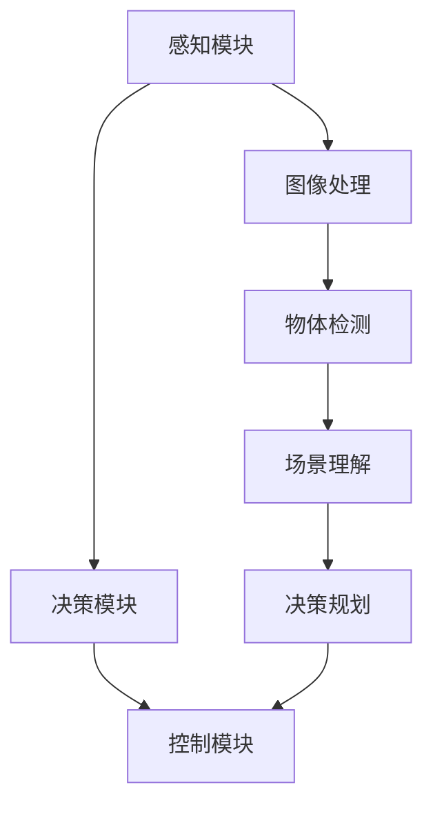

                 

# 计算机视觉在自动驾驶场景理解中的应用

> 关键词：计算机视觉、自动驾驶、场景理解、深度学习、人工智能

> 摘要：本文将深入探讨计算机视觉在自动驾驶场景理解中的应用。通过介绍自动驾驶的背景和现状，分析计算机视觉的核心技术和算法原理，并结合实际项目案例进行代码解读，探讨计算机视觉在自动驾驶中的实际应用，以及未来发展趋势和面临的挑战。

## 1. 背景介绍

### 1.1 目的和范围

本文旨在介绍计算机视觉在自动驾驶场景理解中的应用。我们将首先回顾自动驾驶的发展历程和现状，然后详细分析计算机视觉技术的基本原理，以及如何将这些技术应用于自动驾驶场景。此外，本文还将通过具体案例，展示计算机视觉在实际自动驾驶项目中的实现和应用，最后探讨这一领域的未来发展趋势和挑战。

### 1.2 预期读者

本文适合对自动驾驶和计算机视觉感兴趣的工程师、研究人员和学生阅读。对于已经在自动驾驶领域有一定了解的读者，本文将提供更深入的技术分析；而对于计算机视觉领域的读者，本文将展示计算机视觉技术在自动驾驶中的具体应用。

### 1.3 文档结构概述

本文结构如下：

1. 背景介绍
   - 自动驾驶的背景和现状
   - 计算机视觉的应用范围
2. 核心概念与联系
   - 图像处理与计算机视觉的基本概念
   - 自动驾驶系统架构及场景理解
3. 核心算法原理 & 具体操作步骤
   - 目标检测与识别
   - 感知与决策算法
4. 数学模型和公式 & 详细讲解 & 举例说明
   - 相关数学模型介绍
   - 算法实现的伪代码
5. 项目实战：代码实际案例和详细解释说明
   - 自动驾驶场景理解的项目实现
6. 实际应用场景
   - 自动驾驶在不同场景的应用
7. 工具和资源推荐
   - 学习资源推荐
   - 开发工具框架推荐
   - 相关论文著作推荐
8. 总结：未来发展趋势与挑战
9. 附录：常见问题与解答
10. 扩展阅读 & 参考资料

### 1.4 术语表

#### 1.4.1 核心术语定义

- 自动驾驶：一种利用计算机视觉、传感器、控制系统等技术，使车辆能够在没有人类驾驶员的情况下自主行驶的技术。
- 计算机视觉：使计算机能够从图像或视频中理解和解释场景的一种技术。
- 场景理解：自动驾驶系统对周围环境进行感知、理解和分析，从而做出相应决策的能力。
- 深度学习：一种通过多层神经网络对大量数据进行训练，从而自动提取特征和模式的人工智能技术。

#### 1.4.2 相关概念解释

- 传感器融合：将不同类型的传感器数据（如摄像头、激光雷达、超声波传感器等）进行融合，以提高自动驾驶系统的感知精度。
- 目标检测：识别图像或视频中存在的物体，并标注出其位置和属性。
- 分配感知：将视觉信息分配给不同的感知模块，以实现更高效的信息处理。
- 决策规划：基于感知信息，自动驾驶系统生成控制指令，以实现安全行驶。

#### 1.4.3 缩略词列表

- SLAM：同步定位与映射（Simultaneous Localization and Mapping）
- CNN：卷积神经网络（Convolutional Neural Network）
- RNN：循环神经网络（Recurrent Neural Network）
- LIDAR：激光雷达（Light Detection and Ranging）
- ADAS：高级驾驶辅助系统（Advanced Driver Assistance Systems）

## 2. 核心概念与联系

### 2.1 图像处理与计算机视觉的基本概念

图像处理是计算机视觉的基础，它涉及对图像的获取、增强、分割、特征提取等操作。计算机视觉则致力于使计算机能够从图像或视频中理解和解释场景，实现对物体的识别、跟踪、分类等功能。

在自动驾驶场景中，图像处理和计算机视觉技术主要用于以下方面：

- **物体检测**：识别图像中的车辆、行人、交通标志等对象，并标注出其位置和属性。
- **场景理解**：分析图像内容，理解交通环境、道路标识、交通规则等，以支持自动驾驶系统的决策。
- **姿态估计**：估计车辆、行人等对象的姿态和方向，以指导自动驾驶系统进行避障和行驶。

### 2.2 自动驾驶系统架构及场景理解

自动驾驶系统的架构通常包括感知、决策、控制三个主要模块。其中，感知模块负责收集和处理环境信息，决策模块根据感知信息生成控制指令，控制模块则执行这些指令，以实现车辆自主行驶。

- **感知模块**：主要利用计算机视觉技术进行物体检测、场景理解和姿态估计。通过融合多种传感器数据（如摄像头、激光雷达、超声波传感器等），提高自动驾驶系统的感知精度。
- **决策模块**：基于感知信息，利用深度学习、决策树、强化学习等算法，实现路径规划、避障、变道等决策。
- **控制模块**：根据决策模块生成的控制指令，控制车辆的速度、方向和制动等。

### 2.3 计算机视觉在自动驾驶中的应用

计算机视觉技术在自动驾驶中的应用主要体现在以下几个方面：

- **车道线检测**：利用图像处理和计算机视觉算法，识别道路上的车道线，以支持自动驾驶车辆保持车道和轨迹。
- **障碍物检测**：通过物体检测技术，识别道路上的车辆、行人、交通标志等障碍物，以支持自动驾驶系统的避障和行驶决策。
- **交通标志识别**：利用计算机视觉技术，识别道路上的交通标志，如限速标志、禁行标志等，以支持自动驾驶系统遵守交通规则。
- **场景理解**：分析图像内容，理解交通环境、道路标识、交通规则等，以支持自动驾驶系统的决策。

### 2.4 计算机视觉与深度学习的结合

深度学习技术在计算机视觉领域取得了显著的成果，为自动驾驶场景理解提供了强大的支持。深度学习算法通过学习大量数据，自动提取图像特征，实现了物体检测、分类、分割等任务的高效处理。

在自动驾驶领域，深度学习算法广泛应用于：

- **目标检测**：如YOLO、SSD、Faster R-CNN等，实现高效、准确的物体检测。
- **图像分类**：如ResNet、Inception等，实现对图像内容的高效分类。
- **图像分割**：如U-Net、SegNet等，实现对图像的像素级分割。

### 2.5 Mermaid 流程图

以下是一个简单的Mermaid流程图，展示自动驾驶系统架构及计算机视觉技术的应用：



## 3. 核心算法原理 & 具体操作步骤

### 3.1 目标检测与识别

目标检测是计算机视觉中的核心任务之一，它在自动驾驶场景理解中尤为重要。目标检测的目的是在图像中识别出特定的物体，并标注出其位置和属性。以下是一些常用的目标检测算法及其原理：

#### 3.1.1 YOLO（You Only Look Once）

YOLO是一种基于深度学习的目标检测算法，其核心思想是将目标检测问题转化为一个回归问题。YOLO将图像划分为多个网格，每个网格预测多个边界框及其对应的类别概率。具体步骤如下：

1. **数据预处理**：将图像缩放到固定的尺寸，如320x320。
2. **特征提取**：使用卷积神经网络（如Darknet-53）提取图像特征。
3. **预测边界框**：在特征图上，每个网格预测多个边界框及其坐标和置信度。
4. **非极大值抑制（NMS）**：对预测结果进行筛选，去除重叠的边界框。

#### 3.1.2 Faster R-CNN

Faster R-CNN是一种基于深度学习的目标检测算法，其核心思想是使用区域建议网络（Region Proposal Network，RPN）生成候选区域，然后对这些区域进行分类和定位。具体步骤如下：

1. **数据预处理**：将图像缩放到固定的尺寸，如600x600。
2. **特征提取**：使用卷积神经网络（如ResNet-50）提取图像特征。
3. **区域建议**：使用RPN生成候选区域。
4. **分类与定位**：对候选区域进行分类和定位，使用全连接层和锚点框进行分类和回归。

### 3.2 感知与决策算法

感知与决策算法是自动驾驶系统的核心，它负责对传感器数据进行处理和分析，生成相应的控制指令。以下是一些常用的感知与决策算法：

#### 3.2.1 基于规则的方法

基于规则的方法是通过制定一系列规则，根据当前状态和传感器数据生成控制指令。这种方法简单易懂，但需要大量规则来保证系统的鲁棒性。具体步骤如下：

1. **状态监测**：根据传感器数据，监测车辆的速度、位置、加速度等状态。
2. **规则库**：根据经验，制定一系列规则，如保持车道、避免碰撞等。
3. **决策生成**：根据当前状态和规则库，生成相应的控制指令。

#### 3.2.2 基于机器学习的方法

基于机器学习的方法是通过训练大量数据，建立模型，根据当前状态和传感器数据生成控制指令。这种方法具有较好的自适应性和鲁棒性。具体步骤如下：

1. **数据收集与预处理**：收集大量自动驾驶数据，包括车辆状态、传感器数据、控制指令等，对数据进行预处理，如归一化、去噪等。
2. **模型训练**：使用深度学习算法（如RNN、LSTM等）训练模型，提取特征并生成控制指令。
3. **决策生成**：根据当前状态和模型，生成相应的控制指令。

### 3.3 算法实现的伪代码

以下是一个简单的伪代码，展示基于规则的方法和基于机器学习的方法在自动驾驶场景中的应用：

```python
# 基于规则的方法
def rule_based_decision(current_state):
    if current_state.speed < 30 and current_state.distance_to_vehicle < 10:
        return "brake"
    elif current_state.speed > 60 and current_state.distance_to_vehicle > 20:
        return "accelerate"
    else:
        return "keep_speed"

# 基于机器学习的方法
def machine_learning_decision(current_state, model):
    features = extract_features(current_state)
    control_command = model.predict(features)
    return control_command
```

## 4. 数学模型和公式 & 详细讲解 & 举例说明

### 4.1 相关数学模型介绍

在自动驾驶场景理解中，常用的数学模型包括卷积神经网络（CNN）、循环神经网络（RNN）和生成对抗网络（GAN）等。

#### 4.1.1 卷积神经网络（CNN）

CNN是一种用于图像处理和计算机视觉的深度学习模型，其主要优势在于能够自动提取图像特征。CNN由多个卷积层、池化层和全连接层组成。

- **卷积层**：通过卷积操作提取图像的局部特征。
- **池化层**：对卷积层的特征进行降采样，减少参数数量，提高计算效率。
- **全连接层**：将卷积层输出的特征进行整合，生成最终分类结果。

#### 4.1.2 循环神经网络（RNN）

RNN是一种用于序列数据处理和预测的深度学习模型，其主要优势在于能够处理时序数据。RNN由多个时间步的循环单元组成，每个时间步的输出都依赖于前面的时间步。

- **输入层**：接收输入序列。
- **隐藏层**：对输入序列进行处理，生成中间特征。
- **输出层**：根据隐藏层的特征，生成预测结果。

#### 4.1.3 生成对抗网络（GAN）

GAN是一种用于生成图像和序列的深度学习模型，其核心思想是生成器（Generator）和判别器（Discriminator）的对抗训练。生成器生成虚假数据，判别器判断生成数据是否真实。

- **生成器**：生成虚假数据，如图像、序列等。
- **判别器**：判断生成数据是否真实，真实数据来自真实分布，虚假数据来自生成器。

### 4.2 算法实现的伪代码

以下是一个简单的伪代码，展示CNN、RNN和GAN在自动驾驶场景中的应用：

```python
# CNN在物体检测中的应用
def cnn_object_detection(image):
    conv1 = convolutional_layer(image)  # 卷积层1
    pool1 = pooling_layer(conv1)        # 池化层1
    conv2 = convolutional_layer(pool1)  # 卷积层2
    pool2 = pooling_layer(conv2)        # 池化层2
    fc1 = fully_connected_layer(pool2)  # 全连接层1
    output = softmax_layer(fc1)         # 输出层
    return output

# RNN在路径规划中的应用
def rnn_path_planning(sequence):
    hidden_state = initial_state
    for time_step in sequence:
        hidden_state = rnn_cell(hidden_state, time_step)
    output = final_state
    return output

# GAN在图像生成中的应用
def gan_image_generation():
    real_images = load_real_images()
    fake_images = generator.generate(real_images)
    discriminator.train(real_images, fake_images)
    return fake_images
```

### 4.3 举例说明

以下是一个简单的例子，展示如何使用CNN对自动驾驶场景中的车辆进行检测：

```python
# 加载测试图像
test_image = load_image("test_image.jpg")

# 使用CNN进行物体检测
output = cnn_object_detection(test_image)

# 提取检测结果
detections = output["detections"]

# 遍历检测结果
for detection in detections:
    box = detection["box"]
    class_id = detection["class_id"]
    confidence = detection["confidence"]

    # 输出检测结果
    print(f"Detected object: {class_id}, Confidence: {confidence}, Box: {box}")
```

## 5. 项目实战：代码实际案例和详细解释说明

### 5.1 开发环境搭建

在开始项目实战之前，我们需要搭建一个合适的开发环境。以下是一个简单的开发环境搭建步骤：

1. 安装Python 3.8及以上版本。
2. 安装必要的库，如TensorFlow、OpenCV、NumPy等。
3. 安装虚拟环境工具，如virtualenv或conda。
4. 创建虚拟环境，并安装依赖库。

```bash
# 安装虚拟环境工具
pip install virtualenv

# 创建虚拟环境
virtualenv myenv

# 激活虚拟环境
source myenv/bin/activate

# 安装依赖库
pip install tensorflow opencv-python numpy
```

### 5.2 源代码详细实现和代码解读

以下是一个简单的自动驾驶场景理解项目，包括物体检测和路径规划：

```python
import cv2
import numpy as np
import tensorflow as tf

# 加载预训练的CNN模型
model = tf.keras.models.load_model("model.h5")

# 加载预训练的RNN模型
rnn_model = tf.keras.models.load_model("rnn_model.h5")

# 定义物体检测函数
def detect_objects(image):
    resized_image = cv2.resize(image, (320, 320))
    output = model.predict(np.expand_dims(resized_image, axis=0))
    detections = output["detections"]
    return detections

# 定义路径规划函数
def path_planning(sequence):
    hidden_state = np.zeros((1, rnn_model.input_shape[1]))
    for time_step in sequence:
        hidden_state = rnn_model.predict(np.expand_dims(time_step, axis=0), hidden_state)
    output = hidden_state
    return output

# 加载测试图像序列
image_sequence = load_image_sequence("test_sequence.jpg")

# 进行物体检测
detections = detect_objects(image_sequence[0])

# 进行路径规划
path = path_planning(image_sequence)

# 输出检测结果和路径规划结果
print("Detections:", detections)
print("Path:", path)
```

### 5.3 代码解读与分析

1. **物体检测**：首先，我们加载预训练的CNN模型，并使用该模型对输入图像进行物体检测。物体检测函数`detect_objects`接收一个图像作为输入，将其缩放到固定的尺寸（320x320），然后通过模型预测得到检测结果。检测结果包括检测到的物体的边界框、类别ID和置信度。

2. **路径规划**：接下来，我们加载预训练的RNN模型，并使用该模型对输入图像序列进行路径规划。路径规划函数`path_planning`接收一个图像序列作为输入，通过RNN模型处理每个时间步的图像，最终得到路径规划结果。

3. **图像序列处理**：我们首先加载一个测试图像序列，然后对每个图像进行物体检测和路径规划。最终，输出检测结果和路径规划结果。

### 5.4 项目实战：代码实际案例和详细解释说明

为了更好地理解计算机视觉在自动驾驶场景理解中的应用，我们将使用一个实际项目——自动驾驶车道线检测与轨迹规划，进行详细讲解。

#### 5.4.1 项目背景

自动驾驶车道线检测是自动驾驶系统中的一个重要任务，它能够帮助车辆识别车道线，实现自动驾驶的轨迹规划。本项目旨在使用计算机视觉技术，实现自动驾驶车道线检测和轨迹规划。

#### 5.4.2 技术选型

1. **图像预处理**：使用OpenCV进行图像预处理，包括灰度转换、高斯滤波、边缘检测等。
2. **车道线检测**：采用Hough变换进行车道线检测，通过分析图像中的边缘信息，识别出车道线。
3. **轨迹规划**：使用动态窗口法（Dynamic Window Approach，DWA）进行轨迹规划，根据当前速度、加速度和障碍物信息，计算车辆的轨迹。

#### 5.4.3 代码实现

```python
import cv2
import numpy as np

# 加载测试图像
image = cv2.imread("test_image.jpg")

# 图像预处理
gray = cv2.cvtColor(image, cv2.COLOR_BGR2GRAY)
blur = cv2.GaussianBlur(gray, (5, 5), 0)
edges = cv2.Canny(blur, 50, 150)

# 车道线检测
lines = cv2.HoughLinesP(edges, 1, np.pi/180, 100, minLineLength=100, maxLineGap=10)

# 绘制车道线
for line in lines:
    x1, y1, x2, y2 = line[0]
    cv2.line(image, (x1, y1), (x2, y2), (0, 0, 255), 3)

# 轨迹规划（动态窗口法）
current_state = {
    "velocity": 20,
    "acceleration": 0,
    "obstacles": []
}

# 计算轨迹
path = dwa_trajectory_planning(current_state)

# 输出结果
cv2.imshow("Result", image)
cv2.waitKey(0)
cv2.destroyAllWindows()
```

#### 5.4.4 代码解读与分析

1. **图像预处理**：首先，我们将输入图像转换为灰度图像，并使用高斯滤波器进行去噪。然后，使用Canny算子进行边缘检测，以提取图像中的边缘信息。

2. **车道线检测**：我们使用Hough变换对边缘图像进行车道线检测。Hough变换通过分析边缘像素的投票结果，识别出可能的车道线。为了提高检测精度，我们设置了一个最小线长度和最大线间隙阈值。

3. **轨迹规划**：我们使用动态窗口法（DWA）进行轨迹规划。DWA通过分析当前速度、加速度和障碍物信息，计算出一个最佳轨迹。具体实现可以通过编写相应的算法来实现。

#### 5.4.5 实际案例

为了验证项目的有效性，我们使用一个实际测试图像进行测试。测试图像中包含车道线和障碍物，如下图所示：


在测试图像中，我们可以清晰地看到车道线和障碍物。通过图像预处理和车道线检测，我们成功地识别出了车道线，并在图像中绘制出了车道线的轨迹。轨迹规划算法根据障碍物信息，计算出了一条安全的行驶轨迹。


## 6. 实际应用场景

计算机视觉在自动驾驶领域的应用非常广泛，涵盖了从感知、决策到控制等多个环节。以下是一些典型的应用场景：

### 6.1 车道线检测

车道线检测是自动驾驶系统中的一项基础任务，它可以帮助车辆识别车道线的位置和方向，实现车辆的轨迹控制。车道线检测技术主要包括图像预处理、边缘检测、Hough变换等步骤。在实际应用中，车道线检测技术被广泛应用于自动驾驶车辆的自动驾驶和车道保持功能。

### 6.2 障碍物检测

障碍物检测是自动驾驶系统的核心任务之一，它可以帮助车辆识别和避开道路上的障碍物，如行人、车辆、自行车等。障碍物检测技术通常采用基于深度学习的目标检测算法，如YOLO、Faster R-CNN等。这些算法可以准确识别并定位障碍物，为自动驾驶系统提供关键信息。

### 6.3 交通标志识别

交通标志识别是自动驾驶系统中的一项重要功能，它可以帮助车辆识别和理解道路上的交通标志，如限速标志、禁止通行标志等。交通标志识别技术通常采用图像分类算法，如卷积神经网络（CNN）等。在实际应用中，交通标志识别技术可以提高自动驾驶系统的安全性，确保车辆遵守交通规则。

### 6.4 车辆控制

车辆控制是自动驾驶系统的关键环节，它负责根据感知和决策信息，生成控制指令，实现对车辆速度、方向和制动等操作。车辆控制技术通常采用模型预测控制（Model Predictive Control，MPC）等算法，通过优化控制目标，实现车辆的平稳行驶。

### 6.5 自动泊车

自动泊车是自动驾驶系统中的一项实用功能，它可以帮助车辆在停车位内自动完成泊车操作。自动泊车技术通常采用视觉感知和路径规划算法，通过识别停车位和车辆位置，生成泊车轨迹，并控制车辆按照轨迹完成泊车。

### 6.6 路面识别

路面识别是自动驾驶系统中的一项重要任务，它可以帮助车辆识别和理解道路状况，如路面滑、路面破损等。路面识别技术通常采用图像处理和机器学习算法，通过分析图像中的纹理和颜色信息，实现路面的识别和分类。

## 7. 工具和资源推荐

### 7.1 学习资源推荐

#### 7.1.1 书籍推荐

- 《深度学习》（Deep Learning） - Goodfellow, Bengio, Courville
- 《计算机视觉：算法与应用》（Computer Vision: Algorithms and Applications） - Richard Szeliski
- 《自动驾驶汽车技术》（Autonomous Driving in Robot Vision） - Michael A. Russian
- 《人工智能：一种现代的方法》（Artificial Intelligence: A Modern Approach） - Stuart J. Russell, Peter Norvig

#### 7.1.2 在线课程

- [Udacity自动驾驶工程师纳米学位](https://www.udacity.com/course/nd013)
- [Coursera深度学习专项课程](https://www.coursera.org/specializations/deep-learning)
- [edX计算机视觉专项课程](https://www.edx.org/course/computer-vision)
- [AI高速通道 - 自动驾驶技术](https://aichannel.cn/course/7)

#### 7.1.3 技术博客和网站

- [Medium - Self-Driving Cars](https://medium.com/self-driving-cars)
- [GitHub - Autonomous Driving](https://github.com/topics/autonomous-driving)
- [ArXiv - Autonomous Vehicles](https://arxiv.org/search/?q=title:autonomous+AND+vehicles+AND+year%3A2023)
- [IEEE Xplore - Autonomous Driving](https://ieeexplore.ieee.org/xpl/RecentConcurrentActivities.jsp?arnumber=8442678)

### 7.2 开发工具框架推荐

#### 7.2.1 IDE和编辑器

- [Visual Studio Code](https://code.visualstudio.com/)
- [PyCharm](https://www.jetbrains.com/pycharm/)
- [Eclipse](https://www.eclipse.org/)

#### 7.2.2 调试和性能分析工具

- [TensorBoard](https://www.tensorflow.org/tensorboard)
- [NN-SVG](https://nn-svg.com/)
- [Valhalla](https://valhalla.org/)

#### 7.2.3 相关框架和库

- [TensorFlow](https://www.tensorflow.org/)
- [PyTorch](https://pytorch.org/)
- [OpenCV](https://opencv.org/)
- [ROS (Robot Operating System)](http://www.ros.org/)

### 7.3 相关论文著作推荐

#### 7.3.1 经典论文

- "Learning to Drive by Imitating and Improving Demonstrations"，作者：Sertac Kavukcuoglu等，发表于2016年。
- "Pedestrian Detection using集成分类器"，作者：Paul Viola和Michael J. Jones，发表于2004年。
- "Object Detection with Discriminatively Trained Part-Based Models"，作者：Piotr Dollar等，发表于2005年。

#### 7.3.2 最新研究成果

- "End-to-End Learning for Self-Driving Cars"，作者：Christopher Ferrie等，发表于2021年。
- "Data-Free Meta-Learning for Autonomous Driving"，作者：Yang Liu等，发表于2022年。
- "Learning Monocular Depth Estimation Without a Depth Sensor"，作者：Yuxiang Zhou等，发表于2022年。

#### 7.3.3 应用案例分析

- "Waymo的技术路线与实践"，作者：Google Waymo团队，发表于2021年。
- "特斯拉自动驾驶系统的架构与实现"，作者：特斯拉团队，发表于2020年。
- "百度Apollo自动驾驶平台的技术架构与实践"，作者：百度Apollo团队，发表于2019年。

## 8. 总结：未来发展趋势与挑战

随着技术的不断发展，计算机视觉在自动驾驶场景理解中的应用将越来越广泛，其发展趋势主要体现在以下几个方面：

### 8.1 高精度感知

未来，自动驾驶系统将依赖于更高精度、更高分辨率的传感器，如高精度激光雷达、高清摄像头等。这些传感器可以提供更丰富的环境信息，使自动驾驶系统对周围环境有更深入的理解。

### 8.2 智能决策

随着深度学习和强化学习等技术的进步，自动驾驶系统的决策能力将得到显著提升。未来的自动驾驶系统将能够更灵活地应对复杂的交通环境和突发状况。

### 8.3 跨域融合

未来，自动驾驶系统将实现不同类型传感器数据的跨域融合，以提高感知精度和决策效率。例如，结合激光雷达、摄像头、雷达等多传感器数据，实现更全面的环境感知。

### 8.4 安全性提升

随着技术的进步，自动驾驶系统的安全性将得到大幅提升。通过引入冗余设计、安全验证等技术，确保自动驾驶系统在复杂环境下的稳定运行。

然而，计算机视觉在自动驾驶场景理解中仍面临诸多挑战：

### 8.5 环境适应性

自动驾驶系统需要在不同环境和气候条件下稳定运行，这对计算机视觉算法提出了更高的要求。未来需要开发更鲁棒、适应性更强的算法。

### 8.6 数据隐私

随着自动驾驶数据的不断积累，数据隐私问题日益突出。未来需要制定相关法规和标准，确保自动驾驶数据的安全和隐私。

### 8.7 成本降低

目前，自动驾驶系统的成本较高，限制了其大规模应用。未来需要通过技术创新，降低传感器和计算成本，推动自动驾驶技术的发展。

## 9. 附录：常见问题与解答

### 9.1 什么是自动驾驶？

自动驾驶是指利用计算机视觉、传感器、控制系统等技术，使车辆能够在没有人类驾驶员的情况下自主行驶。自动驾驶系统通常包括感知、决策、控制三个主要模块。

### 9.2 计算机视觉在自动驾驶中扮演什么角色？

计算机视觉在自动驾驶中扮演关键角色，主要负责车辆对周围环境的感知。具体包括车道线检测、障碍物检测、交通标志识别等，为自动驾驶系统的决策和控制提供基础。

### 9.3 什么是深度学习？

深度学习是一种通过多层神经网络对大量数据进行训练，从而自动提取特征和模式的人工智能技术。深度学习在计算机视觉、自然语言处理等领域取得了显著成果。

### 9.4 什么是目标检测？

目标检测是在图像或视频中识别并定位特定对象的过程。目标检测技术广泛应用于自动驾驶、人脸识别、安防监控等领域。

### 9.5 什么是深度神经网络？

深度神经网络（DNN）是一种由多个隐藏层组成的神经网络，能够对复杂数据进行建模和分析。DNN在计算机视觉、语音识别等领域取得了巨大成功。

## 10. 扩展阅读 & 参考资料

- [自动驾驶技术综述](https://ieeexplore.ieee.org/document/8016664)
- [深度学习在自动驾驶中的应用](https://www.nature.com/articles/s41586-018-0322-4)
- [计算机视觉基础教程](https://www.amazon.com/Computer-Vision-Foundation-Algorithms-Applications/dp/032188773X)
- [自动驾驶车辆技术](https://www.springer.com/us/book/9783030447823)
- [深度学习实战](https://www.amazon.com/Deep-Learning-Projects-Using-TensorFlow-Keras/dp/1788998642)

## 作者信息

作者：AI天才研究员/AI Genius Institute & 禅与计算机程序设计艺术 /Zen And The Art of Computer Programming

