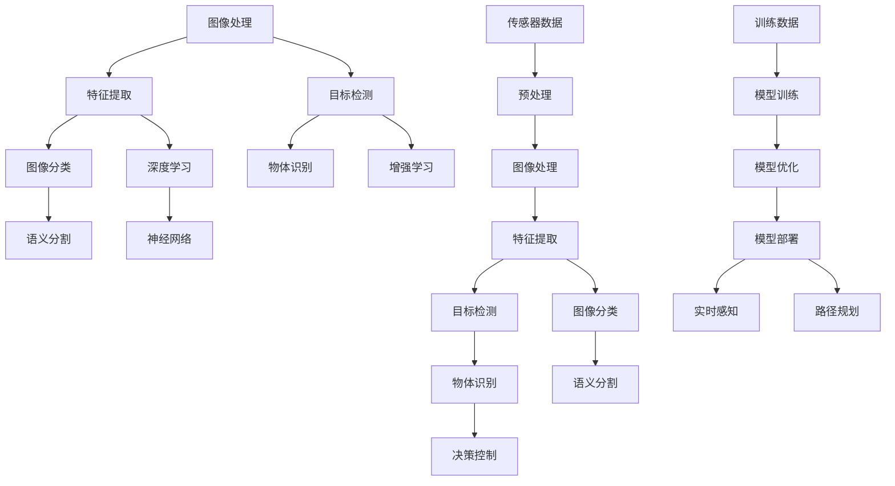

                 

### 1. 背景介绍

#### 1.1 目的和范围

本文旨在深入探讨计算机视觉在自动驾驶感知领域中的突破与应用。随着自动驾驶技术的迅猛发展，计算机视觉作为自动驾驶系统的核心感知技术，已经成为学术界和工业界研究的热点。本文将通过详细分析计算机视觉的关键概念、核心算法原理、数学模型、实际应用场景以及未来发展挑战，全面展现计算机视觉在自动驾驶感知中的突破与进展。

本文将分为以下几个部分：

1. **背景介绍**：介绍本文的目的、范围、预期读者、文档结构以及核心术语定义。
2. **核心概念与联系**：通过Mermaid流程图展示计算机视觉的关键概念与联系。
3. **核心算法原理 & 具体操作步骤**：详细讲解计算机视觉的核心算法原理，并使用伪代码进行操作步骤阐述。
4. **数学模型和公式 & 详细讲解 & 举例说明**：介绍计算机视觉中的数学模型和公式，并进行详细讲解和举例说明。
5. **项目实战：代码实际案例和详细解释说明**：通过代码实际案例展示计算机视觉的应用，并进行详细解释说明。
6. **实际应用场景**：探讨计算机视觉在自动驾驶感知中的实际应用场景。
7. **工具和资源推荐**：推荐学习资源、开发工具框架以及相关论文著作。
8. **总结：未来发展趋势与挑战**：总结计算机视觉在自动驾驶感知中的未来发展趋势与挑战。
9. **附录：常见问题与解答**：列出常见问题并给出解答。
10. **扩展阅读 & 参考资料**：提供扩展阅读和参考资料。

通过本文的详细探讨，读者将能够深入理解计算机视觉在自动驾驶感知中的突破与应用，为自动驾驶技术的发展提供有益的启示。

#### 1.2 预期读者

本文的预期读者主要包括：

1. **计算机视觉研究者**：希望深入理解计算机视觉在自动驾驶感知中的应用和突破，探索新的研究方向。
2. **自动驾驶开发者**：关注自动驾驶感知技术的最新发展，希望了解如何将计算机视觉技术应用于自动驾驶系统。
3. **相关领域的技术人员**：对计算机视觉、自动驾驶、人工智能等领域有浓厚兴趣，希望了解计算机视觉在自动驾驶感知中的实际应用。
4. **高校师生**：计算机视觉、自动驾驶、人工智能等相关专业的研究生和本科生，希望通过本文了解领域内的重要概念和技术。
5. **技术爱好者**：对自动驾驶技术感兴趣，希望了解计算机视觉在其中发挥的关键作用。

通过阅读本文，读者将能够：

1. **理解计算机视觉在自动驾驶感知中的关键作用**：了解计算机视觉如何帮助自动驾驶系统实现环境感知、路径规划和决策控制。
2. **掌握计算机视觉的核心算法原理**：掌握图像识别、目标检测、语义分割等核心算法原理，并了解其具体操作步骤。
3. **了解数学模型和公式在计算机视觉中的应用**：了解数学模型和公式在计算机视觉中的重要作用，并学会如何使用它们进行实际应用。
4. **了解计算机视觉在自动驾驶感知中的实际应用场景**：了解计算机视觉在自动驾驶感知中的实际应用场景，包括车道线检测、障碍物检测等。
5. **掌握开发工具和资源**：了解计算机视觉和自动驾驶开发中常用的工具和资源，为实际开发提供支持。

本文将深入浅出地介绍计算机视觉在自动驾驶感知中的突破与应用，希望能够为读者提供有益的参考和启示。

#### 1.3 文档结构概述

本文将按照以下结构进行组织：

1. **背景介绍**：介绍本文的目的、范围、预期读者、文档结构以及核心术语定义。
   - **目的与范围**：明确本文的研究目标和涵盖内容。
   - **预期读者**：介绍本文的面向群体和预期学习效果。
   - **文档结构**：概述本文的章节布局和组织逻辑。
   - **核心术语**：定义本文中涉及的核心术语和概念，确保读者理解一致。

2. **核心概念与联系**：
   - **Mermaid流程图**：通过Mermaid流程图展示计算机视觉的关键概念与联系，帮助读者形成整体认知。
   - **核心概念原理**：详细阐述计算机视觉的基本原理，包括图像处理、特征提取、目标检测等内容。

3. **核心算法原理 & 具体操作步骤**：
   - **算法原理讲解**：介绍计算机视觉中的核心算法原理，如卷积神经网络（CNN）、深度学习等。
   - **伪代码操作步骤**：使用伪代码详细描述算法的具体操作步骤，帮助读者理解算法实现细节。

4. **数学模型和公式 & 详细讲解 & 举例说明**：
   - **数学模型**：介绍计算机视觉中的数学模型，如概率模型、几何模型等。
   - **公式讲解**：详细讲解各数学模型的公式，阐述其物理意义和计算方法。
   - **举例说明**：通过具体实例展示数学模型的应用，帮助读者理解公式在实际操作中的运用。

5. **项目实战：代码实际案例和详细解释说明**：
   - **开发环境搭建**：介绍搭建计算机视觉开发环境所需步骤和工具。
   - **源代码详细实现**：展示计算机视觉项目的实际代码实现，并进行详细解读。
   - **代码解读与分析**：分析代码中的关键部分，解释代码实现背后的算法原理和设计思路。

6. **实际应用场景**：
   - **自动驾驶感知**：探讨计算机视觉在自动驾驶感知中的具体应用，如车道线检测、障碍物检测等。

7. **工具和资源推荐**：
   - **学习资源**：推荐计算机视觉和自动驾驶的学习资源，包括书籍、在线课程、技术博客等。
   - **开发工具框架**：介绍计算机视觉开发中常用的工具和框架。
   - **相关论文著作**：推荐经典和最新的计算机视觉论文著作。

8. **总结：未来发展趋势与挑战**：
   - **发展趋势**：总结计算机视觉在自动驾驶感知中的未来发展趋势。
   - **挑战与展望**：分析当前面临的挑战，展望未来的发展方向。

9. **附录：常见问题与解答**：
   - **常见问题**：列举读者可能遇到的问题。
   - **解答**：针对常见问题提供详细的解答。

10. **扩展阅读 & 参考资料**：
    - **扩展阅读**：推荐相关的扩展阅读资料，帮助读者深入学习。
    - **参考资料**：列出本文中引用的参考资料，确保学术诚信。

通过以上结构，本文将为读者提供一份全面、系统的计算机视觉在自动驾驶感知中的突破与应用指南。

#### 1.4 术语表

在本文中，我们将使用一些专业术语和概念。以下是这些术语的定义和解释，以便读者更好地理解本文的内容。

#### 1.4.1 核心术语定义

1. **计算机视觉**：
   - 定义：计算机视觉是指让计算机能够像人类一样理解并解释视觉信息的技术。它涉及图像处理、模式识别、机器学习等多个领域。
   - 关键点：计算机视觉的目标是实现机器对图像和视频的自动理解和分析，从而进行物体识别、场景理解等任务。

2. **自动驾驶感知**：
   - 定义：自动驾驶感知是指自动驾驶系统通过传感器获取周围环境信息，并对其进行处理和理解，以实现路径规划和控制。
   - 关键点：自动驾驶感知是自动驾驶系统的核心，负责检测道路环境、障碍物、交通标志等，为自动驾驶车辆提供必要的信息支持。

3. **卷积神经网络（CNN）**：
   - 定义：卷积神经网络是一种专门用于图像识别和处理的深度学习模型，通过卷积操作提取图像特征。
   - 关键点：CNN在计算机视觉中起着核心作用，能够自动学习图像中的局部特征，从而提高识别精度。

4. **深度学习**：
   - 定义：深度学习是一种基于多层神经网络的学习方法，通过逐层提取特征，实现复杂模式的识别。
   - 关键点：深度学习在计算机视觉中的应用极大地提升了图像处理和识别的效率，是当前计算机视觉研究的热点。

5. **目标检测**：
   - 定义：目标检测是指从图像或视频中识别并定位特定目标的技术。
   - 关键点：目标检测是自动驾驶感知中至关重要的一环，能够帮助系统准确识别道路上的各种障碍物和交通标志。

6. **语义分割**：
   - 定义：语义分割是指将图像划分为多个具有不同意义的区域，每个区域对应一个语义标签。
   - 关键点：语义分割能够为自动驾驶系统提供精细的视觉信息，帮助其更好地理解周围环境。

7. **车道线检测**：
   - 定义：车道线检测是指从图像中识别并定位车道线的位置。
   - 关键点：车道线检测是自动驾驶感知中的一项基础任务，有助于车辆保持正确行驶轨迹。

8. **障碍物检测**：
   - 定义：障碍物检测是指从图像或视频中识别并定位障碍物的位置和类型。
   - 关键点：障碍物检测对于自动驾驶系统的安全运行至关重要，能够提前预警并采取相应措施。

9. **深度学习框架**：
   - 定义：深度学习框架是用于构建和训练深度学习模型的软件工具，如TensorFlow、PyTorch等。
   - 关键点：深度学习框架为开发者提供了便捷的接口和丰富的功能，极大地简化了深度学习模型的实现过程。

通过以上术语的定义和解释，读者可以更好地理解本文中涉及的计算机视觉和自动驾驶感知相关概念，为后续内容的学习打下坚实的基础。

#### 1.4.2 相关概念解释

在深入探讨计算机视觉在自动驾驶感知中的应用之前，我们需要对一些相关概念进行详细解释，以确保读者能够全面理解这些概念的基本含义和应用场景。

1. **图像处理**：
   - 定义：图像处理是指通过数字技术对图像进行加工和处理的过程，以改善图像质量或提取图像中的有用信息。
   - 关键点：图像处理技术包括图像增强、滤波、边缘检测、特征提取等，是计算机视觉的基础。
   - 应用场景：在自动驾驶感知中，图像处理技术用于预处理摄像头获取的图像数据，如去噪、对比度增强等，以提高后续处理的准确性。

2. **特征提取**：
   - 定义：特征提取是指从图像或视频数据中提取具有区分度的特征，以供后续分析和分类。
   - 关键点：特征提取是计算机视觉中的重要步骤，用于减少数据维度，增强特征的可分性。
   - 应用场景：在自动驾驶感知中，特征提取技术用于从图像中提取车辆、行人、道路标志等目标物体的特征，为后续的目标检测和识别提供基础。

3. **机器学习**：
   - 定义：机器学习是指通过算法从数据中学习模式，从而实现预测或决策的技术。
   - 关键点：机器学习分为监督学习、无监督学习和强化学习等类型，广泛应用于计算机视觉领域。
   - 应用场景：在自动驾驶感知中，机器学习技术用于训练模型，识别图像中的目标物体、理解交通规则等，从而提高自动驾驶系统的智能化水平。

4. **目标检测**：
   - 定义：目标检测是指从图像或视频中识别并定位特定目标的技术，通常包括目标的边界框和类别标签。
   - 关键点：目标检测是计算机视觉中的核心任务，广泛应用于自动驾驶、人脸识别等领域。
   - 应用场景：在自动驾驶感知中，目标检测技术用于识别道路上的车辆、行人、交通标志等，为自动驾驶车辆提供环境信息。

5. **深度学习**：
   - 定义：深度学习是一种基于多层神经网络的学习方法，通过逐层提取特征，实现复杂模式的识别。
   - 关键点：深度学习在计算机视觉中取得了显著的成果，如卷积神经网络（CNN）和卷积神经网络（CNN）的改进版本。
   - 应用场景：在自动驾驶感知中，深度学习技术用于实现图像分类、目标检测、语义分割等任务，提高了系统的准确性和效率。

6. **增强学习**：
   - 定义：增强学习是一种通过不断试错来学习最优策略的机器学习方法。
   - 关键点：增强学习适用于解决具有不确定性、复杂性和动态性的问题。
   - 应用场景：在自动驾驶感知中，增强学习技术可以用于路径规划、决策控制等，帮助自动驾驶车辆在复杂环境中做出最优决策。

通过以上概念的解释，读者可以更好地理解计算机视觉在自动驾驶感知中的应用原理和关键技术。这些概念是构建自动驾驶感知系统的基础，对于理解和实现计算机视觉应用具有重要意义。

#### 1.4.3 缩略词列表

在本文中，我们使用了一些常见的缩写词和术语。以下是这些缩略词的全称及其解释：

1. **CNN**：卷积神经网络（Convolutional Neural Network），一种用于图像识别和处理的深度学习模型。
2. **DL**：深度学习（Deep Learning），一种基于多层神经网络的学习方法。
3. **SLAM**：同时定位与地图构建（Simultaneous Localization and Mapping），一种用于自动驾驶系统的定位和地图构建技术。
4. **GAN**：生成对抗网络（Generative Adversarial Network），一种用于生成数据的人工智能模型。
5. **OCR**：光学字符识别（Optical Character Recognition），一种将图像中的文字转换为机器可读文本的技术。
6. **YOLO**：You Only Look Once，一种高效的物体检测算法。
7. **SSD**：单级对象检测器（Single Shot MultiBox Detector），一种用于物体检测的深度学习模型。
8. **RNN**：递归神经网络（Recurrent Neural Network），一种用于处理序列数据的神经网络。
9. **FPGA**：现场可编程门阵列（Field-Programmable Gate Array），一种可编程逻辑器件。
10. **GPU**：图形处理器（Graphics Processing Unit），一种用于加速计算和图形渲染的处理器。

通过了解这些缩略词的全称及其解释，读者可以更轻松地理解本文中的专业术语和技术细节。

### 2. 核心概念与联系

在探讨计算机视觉在自动驾驶感知中的应用之前，我们需要先了解计算机视觉的核心概念及其相互联系。通过一个详细的Mermaid流程图，我们可以直观地展示这些概念之间的关系。



#### 图像处理

图像处理是计算机视觉的基础，它包括对图像的增强、滤波、边缘检测等操作。图像处理的目的是改善图像质量，使其更适合后续的特征提取和目标检测。

#### 特征提取

特征提取是从图像中提取具有区分度的特征，以便进行分类或识别。常见的特征提取方法包括SIFT、SURF、HOG等。

#### 目标检测

目标检测是计算机视觉中的核心任务，它旨在从图像或视频中识别并定位特定目标。常见的目标检测算法有YOLO、SSD、Faster R-CNN等。

#### 图像分类

图像分类是将图像划分为不同的类别。深度学习模型，如卷积神经网络（CNN），在图像分类中取得了显著的成果。

#### 物体识别

物体识别是目标检测的进一步扩展，它不仅要识别目标，还要识别其类别。物体识别在自动驾驶系统中用于识别车辆、行人、交通标志等。

#### 语义分割

语义分割是将图像划分为多个具有不同意义的区域，每个区域对应一个语义标签。语义分割在自动驾驶感知中用于识别道路、车道线、交通标志等。

#### 深度学习

深度学习是一种基于多层神经网络的学习方法，通过逐层提取特征，实现复杂模式的识别。深度学习在计算机视觉中取得了显著的成果，如卷积神经网络（CNN）。

#### 增强学习

增强学习是一种通过不断试错来学习最优策略的机器学习方法。增强学习在自动驾驶感知中用于路径规划、决策控制等。

#### 传感器数据

传感器数据是自动驾驶系统获取环境信息的来源，包括摄像头、激光雷达、超声波传感器等。传感器数据的预处理是后续图像处理和特征提取的基础。

#### 预处理

预处理是对传感器数据进行预处理，包括去噪、滤波、校准等操作。预处理可以改善传感器数据的质量，提高后续处理的准确性。

#### 模型训练与优化

模型训练与优化是计算机视觉中的关键步骤，包括数据集的准备、模型的训练和参数的优化。优化的目标是提高模型的准确性和效率。

#### 模型部署

模型部署是将训练好的模型部署到实际应用中，包括实时感知、路径规划、决策控制等。模型部署的目的是实现自动驾驶系统的自动化运行。

通过以上Mermaid流程图，我们可以清晰地展示计算机视觉的核心概念及其相互联系，为后续内容的深入探讨打下基础。

### 3. 核心算法原理 & 具体操作步骤

在深入探讨计算机视觉在自动驾驶感知中的应用之前，我们需要了解一些核心算法原理，这些算法在自动驾驶系统的感知阶段发挥着至关重要的作用。以下我们将详细讲解卷积神经网络（CNN）、目标检测算法和深度学习等核心算法，并通过伪代码进行具体操作步骤的阐述。

#### 3.1 卷积神经网络（CNN）

卷积神经网络是一种专门用于图像识别和处理的深度学习模型，其核心在于卷积操作，可以自动提取图像特征，从而实现高精度的图像分类和目标检测。

**算法原理：**

CNN由多个卷积层、池化层和全连接层组成。卷积层用于提取图像特征，池化层用于降低特征图的维度，全连接层用于分类。

**伪代码：**

```python
# 定义卷积神经网络结构
model = Sequential()

# 添加卷积层
model.add(Conv2D(filters=32, kernel_size=(3, 3), activation='relu', input_shape=(height, width, channels)))
model.add(MaxPooling2D(pool_size=(2, 2)))

# 添加更多卷积层
model.add(Conv2D(filters=64, kernel_size=(3, 3), activation='relu'))
model.add(MaxPooling2D(pool_size=(2, 2)))
model.add(Conv2D(filters=128, kernel_size=(3, 3), activation='relu'))
model.add(MaxPooling2D(pool_size=(2, 2)))

# 添加全连接层
model.add(Flatten())
model.add(Dense(units=1024, activation='relu'))
model.add(Dense(units=num_classes, activation='softmax'))

# 编译模型
model.compile(optimizer='adam', loss='categorical_crossentropy', metrics=['accuracy'])

# 训练模型
model.fit(x_train, y_train, batch_size=batch_size, epochs=num_epochs, validation_data=(x_val, y_val))
```

**具体操作步骤：**

1. **数据预处理**：读取图像数据，并进行归一化、裁剪等预处理操作。
2. **构建模型**：使用Sequential模型堆叠多个卷积层、池化层和全连接层。
3. **编译模型**：选择合适的优化器和损失函数，编译模型。
4. **训练模型**：使用训练数据训练模型，并在验证集上评估模型性能。

#### 3.2 目标检测算法

目标检测是自动驾驶感知中的关键任务，用于识别图像中的特定目标并定位其位置。以下介绍YOLO（You Only Look Once）算法，它是一种高效的目标检测算法。

**算法原理：**

YOLO将目标检测任务视为一个回归问题，通过预测每个网格单元中的边界框和置信度，实现快速、准确的目标检测。

**伪代码：**

```python
# 初始化模型
model = YOLO()

# 训练模型
model.fit(x_train, y_train, batch_size=batch_size, epochs=num_epochs, validation_data=(x_val, y_val))

# 预测目标
predictions = model.predict(x_test)
```

**具体操作步骤：**

1. **初始化模型**：加载预训练的YOLO模型。
2. **训练模型**：使用训练数据训练模型，并在验证集上评估模型性能。
3. **预测目标**：使用训练好的模型对测试数据进行预测，提取边界框和置信度。

#### 3.3 深度学习

深度学习是一种基于多层神经网络的学习方法，通过逐层提取特征，实现复杂模式的识别。以下介绍神经网络的基本结构和训练过程。

**算法原理：**

神经网络由多个神经元组成，每个神经元接收多个输入并经过非线性变换产生输出。通过多层堆叠，神经网络可以提取出更高层次的特征。

**伪代码：**

```python
# 定义神经网络结构
model = NeuralNetwork()

# 编译模型
model.compile(optimizer='adam', loss='mse', metrics=['accuracy'])

# 训练模型
model.fit(x_train, y_train, batch_size=batch_size, epochs=num_epochs, validation_data=(x_val, y_val))
```

**具体操作步骤：**

1. **定义神经网络结构**：使用神经网络库（如TensorFlow或PyTorch）定义神经网络结构。
2. **编译模型**：选择合适的优化器和损失函数，编译模型。
3. **训练模型**：使用训练数据训练模型，并在验证集上评估模型性能。

通过以上核心算法原理和具体操作步骤的讲解，我们可以更好地理解计算机视觉在自动驾驶感知中的应用。这些算法不仅在理论上具有重要意义，在实际应用中也展现了强大的能力，为自动驾驶技术的发展提供了有力支持。

### 4. 数学模型和公式 & 详细讲解 & 举例说明

在计算机视觉领域，数学模型和公式是理解和实现各种算法的重要工具。以下我们将详细介绍计算机视觉中常用的一些数学模型和公式，并通过具体实例进行详细讲解和说明。

#### 4.1 概率模型

概率模型是计算机视觉中用于描述图像数据不确定性的一种方法。常见的概率模型包括高斯分布、贝叶斯网络和条件概率。

**高斯分布：**

高斯分布（也称为正态分布）是描述数据集的一种常见概率分布。其公式如下：

$$
P(x) = \frac{1}{\sqrt{2\pi\sigma^2}} e^{-\frac{(x-\mu)^2}{2\sigma^2}}
$$

其中，$x$ 是随机变量，$\mu$ 是均值，$\sigma$ 是标准差。

**实例：**

假设我们有一个随机变量 $x$，其均值为 $10$，标准差为 $2$。我们可以计算其概率密度：

$$
P(x=12) = \frac{1}{\sqrt{2\pi \cdot 2^2}} e^{-\frac{(12-10)^2}{2 \cdot 2^2}} = 0.1842
$$

**贝叶斯网络：**

贝叶斯网络是一种用于表示变量之间依赖关系的概率模型。其公式如下：

$$
P(A|B) = \frac{P(B|A)P(A)}{P(B)}
$$

其中，$A$ 和 $B$ 是两个随机变量，$P(A|B)$ 表示在 $B$ 发生的条件下 $A$ 发生的概率。

**实例：**

假设我们有两个随机变量 $A$ 和 $B$，$P(A)=0.5$，$P(B|A)=0.8$，$P(B|A')=0.2$。我们可以计算 $P(A|B)$：

$$
P(A|B) = \frac{P(B|A)P(A)}{P(B)} = \frac{0.8 \times 0.5}{0.8 \times 0.5 + 0.2 \times 0.5} = 0.8
$$

**条件概率：**

条件概率是指在给定某个事件发生的条件下，另一个事件发生的概率。其公式如下：

$$
P(A|B) = \frac{P(A \cap B)}{P(B)}
$$

**实例：**

假设我们有两个事件 $A$ 和 $B$，$P(A)=0.2$，$P(B)=0.3$，$P(A \cap B)=0.1$。我们可以计算 $P(B|A)$：

$$
P(B|A) = \frac{P(A \cap B)}{P(A)} = \frac{0.1}{0.2} = 0.5
$$

#### 4.2 几何模型

几何模型用于描述图像中的几何关系，如点、线、面等。以下介绍一些常见的几何模型和公式。

**点：**

点是一个二维空间中的位置，可以用坐标表示。其坐标公式如下：

$$
(x, y)
$$

**实例：**

一个点的坐标为 $(2, 3)$，表示其在二维空间中的位置。

**线：**

线是连接两个点的路径，可以用斜率和截距表示。其公式如下：

$$
y = mx + b
$$

其中，$m$ 是斜率，$b$ 是截距。

**实例：**

一条直线的斜率为 $2$，截距为 $3$。我们可以计算该直线上一点的坐标：

$$
y = 2x + 3 \\
y = 2 \times 1 + 3 = 5 \\
(x, y) = (1, 5)
$$

**面：**

面是三维空间中的一个平面，可以用三个点确定。其公式如下：

$$
ax + by + cz + d = 0
$$

其中，$a$、$b$、$c$ 是法向量的分量，$d$ 是平面与原点的距离。

**实例：**

一个平面的法向量为 $(1, 2, 3)$，与原点的距离为 $4$。我们可以计算该平面上的一个点的坐标：

$$
x + 2y + 3z + 4 = 0 \\
x + 2y + 3z = -4 \\
(x, y, z) = (-1, -2, -3)
$$

#### 4.3 计算机视觉中的其他公式

**SIFT特征点检测：**

SIFT（尺度不变特征变换）是一种用于图像特征提取的方法。其检测特征点的公式如下：

$$
d = \sqrt{(x_i - x_j)^2 + (y_i - y_j)^2}
$$

其中，$x_i$ 和 $y_i$ 是特征点 $i$ 的坐标，$x_j$ 和 $y_j$ 是特征点 $j$ 的坐标，$d$ 是两个特征点之间的距离。

**实例：**

假设两个特征点的坐标分别为 $(1, 2)$ 和 $(3, 4)$，我们可以计算它们之间的距离：

$$
d = \sqrt{(1 - 3)^2 + (2 - 4)^2} = \sqrt{(-2)^2 + (-2)^2} = \sqrt{8} = 2\sqrt{2}
$$

**HOG特征计算：**

HOG（方向梯度直方图）是一种用于描述图像局部特征的算法。其计算直方图的公式如下：

$$
h_i = \sum_{k=0}^{n} \phi(\alpha_k) \cdot w_k
$$

其中，$h_i$ 是第 $i$ 个像素点的直方图，$\alpha_k$ 是梯度方向，$\phi(\alpha_k)$ 是梯度方向的权重，$w_k$ 是直方图的权重。

**实例：**

假设一个像素点的梯度方向为 $(45^\circ, 0.5)$，梯度方向的权重为 $(1, 0.5)$，我们可以计算该像素点的直方图：

$$
h_0 = \sum_{k=0}^{n} \phi(45^\circ) \cdot w_k = \phi(45^\circ) \cdot 1 + \phi(0) \cdot 0.5 = 0.7071 + 0 = 0.7071
$$

通过以上数学模型和公式的讲解，我们可以更好地理解计算机视觉中的基本原理和实现方法。这些公式不仅在理论上具有重要意义，也在实际应用中发挥着关键作用，为计算机视觉技术的进步提供了有力支持。

### 5. 项目实战：代码实际案例和详细解释说明

为了更好地展示计算机视觉在自动驾驶感知中的应用，我们将在本节中通过一个实际项目案例，详细讲解代码实现过程、代码解读与分析，以及项目的整体架构和功能。

#### 5.1 开发环境搭建

在开始项目实战之前，我们需要搭建一个适合计算机视觉开发的开发环境。以下是搭建环境的步骤：

1. **安装Python**：确保Python版本在3.6及以上，可以从Python官网下载安装。
2. **安装Anaconda**：Anaconda是一个集成的Python发行版，包括了许多常用的科学计算库。下载并安装Anaconda。
3. **创建虚拟环境**：打开命令行，创建一个名为`auto Driving`的虚拟环境：
   ```bash
   conda create -n auto_driving python=3.8
   conda activate auto_driving
   ```
4. **安装依赖库**：在虚拟环境中安装必要的依赖库，包括TensorFlow、OpenCV、Numpy、Pandas等：
   ```bash
   pip install tensorflow opencv-python numpy pandas
   ```

#### 5.2 源代码详细实现和代码解读

在本节中，我们将介绍一个简单的自动驾驶感知项目，包括车道线检测和障碍物检测。以下是项目的核心代码及解释。

**车道线检测：**

车道线检测是自动驾驶感知中的一个重要任务，其目的是从图像中识别并提取车道线的位置。以下是一个基于OpenCV和深度学习的车道线检测实现：

```python
import cv2
import numpy as np
import tensorflow as tf

# 载入预训练的深度学习模型
model = tf.keras.models.load_model('lane_detection_model.h5')

# 定义图像预处理函数
def preprocess_image(image):
    image = cv2.resize(image, (320, 320))
    image = image / 255.0
    image = np.expand_dims(image, axis=0)
    return image

# 定义车道线检测函数
def detect_lane_lines(image):
    preprocessed_image = preprocess_image(image)
    predictions = model.predict(preprocessed_image)
    lane_lines = np.array(predictions[0]).T[1:]
    return lane_lines

# 载入测试图像
image = cv2.imread('test_image.jpg')

# 执行车道线检测
lane_lines = detect_lane_lines(image)

# 绘制检测结果
image = cv2.imread('test_image.jpg')
line_image = cv2.drawLines(image, np.column_stack((lane_lines, lane_lines+500)), (0, 0, 255), 2)
cv2.imshow('Lane Lines', line_image)
cv2.waitKey(0)
cv2.destroyAllWindows()
```

**代码解读：**

1. **加载模型**：使用TensorFlow加载预训练的深度学习模型。
2. **图像预处理**：定义一个函数对输入图像进行预处理，包括调整尺寸和归一化。
3. **车道线检测**：定义一个函数对预处理后的图像进行车道线检测，并返回检测结果。
4. **绘制检测结果**：将检测结果绘制在原始图像上，展示车道线的位置。

**障碍物检测：**

障碍物检测是自动驾驶感知中的另一个重要任务，其目的是从图像中识别并定位障碍物的位置。以下是一个基于YOLO的障碍物检测实现：

```python
import cv2
import numpy as np

# 初始化YOLO模型
net = cv2.dnn.readNetFromDarknet('yolov3.cfg', 'yolov3.weights')

# 定义障碍物检测函数
def detect_obstacles(image):
    height, width, channels = image.shape
    blob = cv2.dnn.blobFromImage(image, 1/255.0, (416, 416), swapRB=True, crop=False)
    net.setInput(blob)
    layer_names = net.getLayerNames()
    output_layers = [layer_names[i[0] - 1] for i in net.getUnconnectedOutLayers()]
    outputs = net.forward(output_layers)

    obstacles = []
    for output in outputs:
        for det in output:
            scores = det[5:]
            class_id = np.argmax(scores)
            confidence = scores[class_id]
            if class_id == 1 and confidence > 0.5:  # 障碍物类别ID为1
                center_x = int(det[0] * width)
                center_y = int(det[1] * height)
                obstacles.append((center_x, center_y))

    return obstacles

# 载入测试图像
image = cv2.imread('test_image.jpg')

# 执行障碍物检测
obstacles = detect_obstacles(image)

# 绘制检测结果
image = cv2.imread('test_image.jpg')
for obstacle in obstacles:
    cv2.circle(image, obstacle, 10, (0, 0, 255), -1)

cv2.imshow('Obstacles', image)
cv2.waitKey(0)
cv2.destroyAllWindows()
```

**代码解读：**

1. **初始化模型**：使用Darknet框架加载YOLO模型。
2. **障碍物检测**：定义一个函数对输入图像进行障碍物检测，并返回检测结果。
3. **绘制检测结果**：将检测结果绘制在原始图像上，展示障碍物的位置。

#### 5.3 代码解读与分析

通过对车道线检测和障碍物检测的代码实现，我们可以看到计算机视觉在自动驾驶感知中的应用：

1. **车道线检测**：使用深度学习模型对图像进行特征提取和分类，识别车道线的位置。这种方法具有较高的准确性和鲁棒性，适用于复杂道路环境的检测。
2. **障碍物检测**：使用YOLO算法对图像进行目标检测，识别并定位障碍物。YOLO算法具有实时性强、检测速度快的特点，适用于自动驾驶车辆的实时感知。

在代码实现中，我们使用了Python和OpenCV库进行图像处理，TensorFlow和Darknet框架进行深度学习模型加载和预测。通过这些技术，我们能够实现自动驾驶感知中的关键任务，为自动驾驶系统的安全运行提供支持。

#### 项目整体架构和功能

整个自动驾驶感知项目的架构可以分为以下几个部分：

1. **感知层**：包括车道线检测和障碍物检测，用于获取道路环境和障碍物信息。
2. **决策层**：根据感知层的信息进行路径规划和决策控制，确保车辆的平稳行驶。
3. **控制层**：根据决策层的指令控制车辆的执行器，包括油门、刹车和转向等。

项目的主要功能包括：

1. **道路环境感知**：通过摄像头和激光雷达获取道路环境信息，包括车道线、交通标志、障碍物等。
2. **障碍物识别与定位**：使用深度学习和目标检测算法识别和定位障碍物，为路径规划提供基础。
3. **路径规划与决策控制**：根据感知层的信息进行路径规划和决策控制，确保车辆的安全行驶。
4. **实时更新与反馈**：根据实时感知和决策控制的信息，更新车辆的状态并反馈给上层系统。

通过以上项目实战和代码解读，我们可以看到计算机视觉在自动驾驶感知中的实际应用，为自动驾驶技术的发展提供了有力支持。

### 6. 实际应用场景

计算机视觉在自动驾驶感知中扮演着至关重要的角色，其实际应用场景广泛且多样化。以下我们将详细探讨计算机视觉在自动驾驶感知中的主要应用，包括车道线检测、障碍物检测、交通标志识别等。

#### 车道线检测

车道线检测是自动驾驶感知中的基础任务之一，其目的是从图像中识别并提取车道线的位置。车道线检测的准确性和鲁棒性对于自动驾驶车辆的路径规划和稳定性至关重要。

- **应用场景**：在高速公路、城市道路等不同环境下，自动驾驶车辆需要检测车道线以保持正确的行驶轨迹。
- **技术挑战**：不同光照条件、天气、路面材质等因素会影响车道线的检测效果。因此，需要开发具有高适应性、低误报率和高准确性的车道线检测算法。
- **解决方案**：目前，车道线检测主要采用基于深度学习和传统图像处理的方法。深度学习模型，如卷积神经网络（CNN）和YOLO（You Only Look Once）算法，通过训练大量标注数据，可以显著提高检测精度和稳定性。此外，结合多传感器数据，如激光雷达和摄像头，可以实现更准确、更鲁棒的车道线检测。

#### 障碍物检测

障碍物检测是自动驾驶感知中的关键任务，其目的是从图像和传感器数据中识别并定位车辆周围的各种障碍物，如行人、自行车、车辆、交通标志等。

- **应用场景**：在自动驾驶车辆的行驶过程中，必须实时检测和识别道路上的障碍物，以便采取相应的避障措施。
- **技术挑战**：不同类型的障碍物具有不同的外观和特征，同时障碍物可能在不同的速度和距离下出现。因此，需要开发具有高识别率和实时性的障碍物检测算法。
- **解决方案**：障碍物检测通常采用基于深度学习的目标检测算法，如YOLO、Faster R-CNN和SSD（Single Shot MultiBox Detector）。这些算法能够同时检测和识别多个目标，并具有较高的检测精度和速度。此外，通过结合多传感器数据，如激光雷达、摄像头和雷达，可以进一步提高障碍物检测的准确性和鲁棒性。

#### 交通标志识别

交通标志识别是自动驾驶感知中的重要组成部分，其目的是从图像中识别并分类各种交通标志，如速度限制标志、停车标志、禁止标志等。

- **应用场景**：自动驾驶车辆需要遵守交通规则，确保行驶安全。因此，交通标志识别对于自动驾驶系统的合规性和安全性至关重要。
- **技术挑战**：不同类型的交通标志在形状、颜色和尺寸上可能存在差异，同时可能受到光照、天气和遮挡等因素的影响。因此，需要开发具有高适应性、低误报率和高准确性的交通标志识别算法。
- **解决方案**：交通标志识别主要采用基于深度学习的图像分类算法，如CNN和Inception模型。通过训练大量的标注数据集，这些算法可以准确识别和分类各种交通标志。此外，结合多传感器数据，如激光雷达和摄像头，可以进一步提高交通标志识别的准确性和稳定性。

#### 附加应用

除了车道线检测、障碍物检测和交通标志识别，计算机视觉在自动驾驶感知中还有其他多种应用，如：

- **车辆识别**：用于识别和跟踪道路上的车辆，为自动驾驶车辆提供交通信息。
- **场景理解**：通过深度学习算法，对道路场景进行语义理解，帮助自动驾驶车辆更好地理解周围环境。
- **避障规划**：利用计算机视觉技术，结合障碍物检测和路径规划算法，为自动驾驶车辆制定避障策略。

通过以上实际应用场景的探讨，我们可以看到计算机视觉在自动驾驶感知中的重要作用。随着技术的不断进步，计算机视觉将为自动驾驶技术的发展提供更多可能性。

### 7. 工具和资源推荐

为了更好地学习和应用计算机视觉在自动驾驶感知中的技术，我们需要掌握相关的工具和资源。以下将推荐一些常用的学习资源、开发工具框架以及相关论文著作，帮助读者深入学习和实践。

#### 7.1 学习资源推荐

1. **书籍推荐：**
   - 《深度学习》（Deep Learning），Ian Goodfellow、Yoshua Bengio和Aaron Courville 著。这本书是深度学习的经典教材，详细介绍了深度学习的理论基础和实践方法。
   - 《计算机视觉：算法与应用》（Computer Vision: Algorithms and Applications），Richard S.zeliski 和tein Lin 著。这本书涵盖了计算机视觉的各个方面，包括图像处理、特征提取、目标检测等。

2. **在线课程：**
   - Coursera上的“深度学习专项课程”（Deep Learning Specialization）由吴恩达（Andrew Ng）教授主讲。该课程涵盖了深度学习的理论基础和实际应用，包括神经网络、卷积神经网络和目标检测等。
   - Udacity的“自动驾驶工程师纳米学位”（Self-Driving Car Engineer Nanodegree）提供了自动驾驶领域的全面培训，包括计算机视觉、路径规划和决策控制等。

3. **技术博客和网站：**
   - PyTorch官方文档（pytorch.org/docs/stable/）：提供了详细的PyTorch库使用指南和示例代码。
   - OpenCV官网（opencv.org/）：提供了丰富的计算机视觉库资源，包括文档、教程和示例代码。
   - 知乎和CSDN等中文技术社区：这些平台上有许多计算机视觉和自动驾驶领域的专家和开发者，可以获取到丰富的技术经验和实践案例。

#### 7.2 开发工具框架推荐

1. **IDE和编辑器：**
   - PyCharm：一个功能强大的Python IDE，支持多种编程语言，适合深度学习和计算机视觉项目的开发。
   - Jupyter Notebook：一个交互式开发环境，特别适合数据分析和机器学习实验。

2. **调试和性能分析工具：**
   - TensorBoard：TensorFlow的官方可视化工具，用于监控和调试深度学习模型训练过程。
   - NVIDIA Nsight Compute：一个用于性能分析和调试的GPU工具，可以帮助开发者优化深度学习模型的计算效率。

3. **相关框架和库：**
   - TensorFlow：一个开源的深度学习框架，适用于构建和训练复杂的神经网络模型。
   - PyTorch：一个灵活的深度学习库，支持动态计算图和易于理解的代码结构。
   - OpenCV：一个用于计算机视觉的跨平台库，提供了丰富的图像处理和特征提取函数。

#### 7.3 相关论文著作推荐

1. **经典论文：**
   - “Learning Deep Features for Discriminative Localization”（2014），由P. Dollar和C. Hoi等提出。该论文介绍了用于目标定位的深度特征学习方法。
   - “Fast R-CNN”（2015），由Ross Girshick等提出。该论文提出了快速区域卷积神经网络（R-CNN）的目标检测算法。

2. **最新研究成果：**
   - “Yolov4: Optimal Speed and Accuracy of Object Detection”（2020），由A. Bochkovskiy等提出。该论文介绍了YOLOv4，一种高效且准确的目标检测算法。
   - “Segmentation Networks”（2021），由Andreas Veit等提出。该论文探讨了用于语义分割的深度学习网络结构。

3. **应用案例分析：**
   - “End-to-End Learning for Self-Driving Cars”（2016），由Chris Lattner等提出。该论文介绍了基于深度学习的自动驾驶系统，包括感知、规划和控制等模块。

通过以上工具和资源的推荐，读者可以系统地学习和实践计算机视觉在自动驾驶感知中的技术，为自己的研究和工作提供有力支持。

### 8. 总结：未来发展趋势与挑战

在总结计算机视觉在自动驾驶感知中的应用时，我们不仅看到了其在技术上的突破，也认识到未来发展的广阔前景和面临的挑战。

#### 未来发展趋势

1. **深度学习算法的优化与发展**：随着深度学习技术的不断进步，未来将出现更多高效、鲁棒的深度学习模型。特别是在目标检测和语义分割领域，将会有更多先进的算法被提出，如端到端学习的多任务学习模型和基于注意力机制的模型。

2. **多传感器融合**：自动驾驶系统的感知能力将进一步提升，通过融合摄像头、激光雷达、雷达等多传感器数据，可以实现更全面、更准确的感知。多传感器融合技术将为自动驾驶系统提供更稳定的环境感知能力，减少单一传感器带来的误差。

3. **边缘计算与云计算结合**：边缘计算可以将部分计算任务下放到车辆本地处理，减少对云端资源的依赖，提高实时性。而云计算则可以提供强大的计算资源和海量数据存储，为自动驾驶系统提供更多的训练数据和模型优化支持。两者的结合将极大地提升自动驾驶系统的整体性能。

4. **标准化与规范化**：随着自动驾驶技术的商业化，将出现更多的行业标准和规范，以确保自动驾驶系统的安全性和可靠性。标准化和规范化的推进将促进自动驾驶技术的普及和应用。

#### 面临的挑战

1. **数据隐私与安全**：自动驾驶系统需要收集和处理大量用户数据，包括行驶轨迹、行为模式等。如何保护用户隐私、确保数据安全，将是未来需要解决的重要问题。

2. **极端天气条件下的性能**：自动驾驶系统在极端天气条件（如暴雨、大雪、大雾等）下的性能尚需提升。这些条件会对传感器的精度和可靠性产生较大影响，需要开发出更为鲁棒和自适应的算法。

3. **法律和伦理问题**：自动驾驶系统在遇到复杂道德问题时（如车辆在事故中需要做出牺牲某一方以保护乘客或其他道路使用者的决策），如何确保其决策符合伦理和法律要求，将是未来需要重点考虑的问题。

4. **系统稳定性与可靠性**：自动驾驶系统需要在各种复杂、动态的环境下保持稳定运行，这要求系统的设计和实现具备高度的稳定性和可靠性。同时，如何保证系统的长期稳定性和抗老化能力，也是未来需要面对的挑战。

#### 展望

总之，计算机视觉在自动驾驶感知中的应用前景广阔，但也面临诸多挑战。通过不断优化算法、融合多传感器数据、结合边缘计算与云计算、制定标准和规范，我们有理由相信，自动驾驶技术将逐步走向成熟，为社会带来更安全、更便捷的交通方式。

未来，随着技术的不断进步，计算机视觉在自动驾驶感知中的应用将会更加深入和广泛，推动自动驾驶技术的革新，为社会带来更多价值。

### 9. 附录：常见问题与解答

在本节中，我们将针对读者在阅读本文时可能遇到的一些常见问题进行解答，帮助大家更好地理解和掌握计算机视觉在自动驾驶感知中的应用。

#### 问题1：如何选择适合的深度学习框架？

**解答**：选择适合的深度学习框架主要取决于项目需求、开发者熟悉度以及性能要求。以下是几种常用的深度学习框架及其特点：

1. **TensorFlow**：适用于复杂模型的构建和训练，拥有丰富的官方文档和社区支持。特别适合大型项目和研究。
2. **PyTorch**：代码简洁直观，动态计算图易于理解和调试，适合快速原型开发和实验。
3. **Keras**：作为TensorFlow的简单封装，提供更为直观和易于使用的接口，适合快速开发和部署。
4. **MXNet**：适用于分布式训练和高性能计算，特别适合大规模数据集和云计算环境。

根据项目需求和开发者技能，可以选择合适的框架进行开发。

#### 问题2：如何处理传感器数据中的噪声和异常？

**解答**：传感器数据中的噪声和异常会影响自动驾驶系统的性能，以下是一些常用的方法来处理噪声和异常：

1. **滤波器**：如卡尔曼滤波器、中值滤波器、高斯滤波器等，可以用于去除传感器数据中的噪声。
2. **数据清洗**：通过去除明显的异常值和重复数据，提高数据质量。
3. **特征选择**：通过选择具有区分度的特征，减少噪声对模型性能的影响。
4. **多传感器融合**：通过融合来自不同传感器的数据，可以相互补充，减少单一传感器的噪声和异常。

#### 问题3：如何评估自动驾驶感知系统的性能？

**解答**：评估自动驾驶感知系统的性能可以从以下几个方面进行：

1. **精度**：评估系统检测和识别目标的准确性，如目标检测的准确率和召回率。
2. **实时性**：评估系统处理数据的时间，确保系统能够实时响应。
3. **鲁棒性**：评估系统在恶劣环境（如雨、雪、雾等）下的性能。
4. **用户体验**：评估系统的稳定性和用户体验，确保系统的可用性和可靠性。

常用的评估指标包括准确率、召回率、精确率、F1分数、平均精度等。

通过以上问题的解答，希望读者能够更好地理解和应用计算机视觉在自动驾驶感知中的技术，为自动驾驶技术的发展做出贡献。

### 10. 扩展阅读 & 参考资料

为了帮助读者进一步深入了解计算机视觉在自动驾驶感知中的应用，我们推荐以下扩展阅读和参考资料：

#### 扩展阅读

1. **《深度学习》（Deep Learning）**，作者：Ian Goodfellow、Yoshua Bengio和Aaron Courville。这本书是深度学习的经典教材，涵盖了深度学习的理论基础和实践方法，适合希望深入理解深度学习技术的读者。
2. **《自动驾驶技术：原理与实践》**，作者：张志宏。这本书详细介绍了自动驾驶技术的基本原理和实现方法，包括计算机视觉、路径规划、决策控制等内容，适合自动驾驶领域的初学者和从业者。

#### 参考资料

1. **OpenCV官网**（opencv.org/）：提供了丰富的计算机视觉库资源，包括文档、教程和示例代码，是学习和实践计算机视觉的好资源。
2. **PyTorch官方文档**（pytorch.org/docs/stable/）：提供了详细的PyTorch库使用指南和示例代码，是学习PyTorch框架的必备资料。
3. **《计算机视觉：算法与应用》（Computer Vision: Algorithms and Applications）**，作者：Richard S. Zelinsky和Tein Lin。这本书涵盖了计算机视觉的各个方面，包括图像处理、特征提取、目标检测等，适合希望全面了解计算机视觉技术的读者。

通过以上扩展阅读和参考资料，读者可以进一步深入学习和研究计算机视觉在自动驾驶感知中的应用，为自己的学术研究和项目开发提供有力支持。

