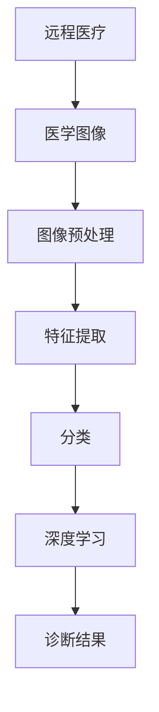

                 

# 计算机视觉在远程医疗诊断中的应用

> **关键词：** 计算机视觉，远程医疗，医学图像分析，深度学习，人工智能诊断

> **摘要：** 本文深入探讨了计算机视觉技术在远程医疗诊断中的应用。文章首先介绍了远程医疗的概念和重要性，接着详细阐述了计算机视觉技术在医学图像处理中的核心作用，包括图像获取、预处理、特征提取和分类等环节。随后，文章分析了深度学习在计算机视觉诊断中的应用，并列举了具体算法和步骤。最后，文章探讨了当前面临的挑战及未来发展趋势，为读者提供了丰富的学习资源和工具推荐。

## 1. 背景介绍

### 1.1 目的和范围

本文旨在探讨计算机视觉技术在远程医疗诊断中的应用，分析其核心概念和原理，展示具体操作步骤，并探讨未来发展趋势。文章重点关注以下方面：

- 远程医疗的基本概念和现状
- 计算机视觉在医学图像处理中的关键作用
- 深度学习算法在远程医疗诊断中的应用
- 面临的挑战和未来发展方向

### 1.2 预期读者

本文适合以下读者群体：

- 医学影像专业人员和医生
- 计算机视觉和人工智能领域的研究者
- 对远程医疗和医学图像分析感兴趣的技术爱好者

### 1.3 文档结构概述

本文结构如下：

- 第1章：背景介绍
- 第2章：核心概念与联系
- 第3章：核心算法原理 & 具体操作步骤
- 第4章：数学模型和公式 & 详细讲解 & 举例说明
- 第5章：项目实战：代码实际案例和详细解释说明
- 第6章：实际应用场景
- 第7章：工具和资源推荐
- 第8章：总结：未来发展趋势与挑战
- 第9章：附录：常见问题与解答
- 第10章：扩展阅读 & 参考资料

### 1.4 术语表

#### 1.4.1 核心术语定义

- **计算机视觉**：模拟人类视觉感知的技术，使计算机能够从图像或视频中提取有用信息。
- **远程医疗**：利用信息技术和通信手段，实现医生和患者之间非面对面诊疗和健康管理服务。
- **医学图像分析**：运用计算机视觉技术对医学图像进行预处理、特征提取和分类，辅助医生诊断。
- **深度学习**：一种机器学习技术，通过多层神经网络模拟人脑学习过程，实现对复杂数据的分析和模式识别。

#### 1.4.2 相关概念解释

- **图像预处理**：对原始图像进行增强、滤波、分割等处理，以提高图像质量，减少噪声。
- **特征提取**：从图像中提取出具有区分性的特征，用于后续分类和识别。
- **分类**：将图像或视频中的物体或场景分为不同的类别。

#### 1.4.3 缩略词列表

- **CT**：计算机断层扫描（Computed Tomography）
- **MRI**：磁共振成像（Magnetic Resonance Imaging）
- **X光**：X射线成像（X-ray）
- **CNN**：卷积神经网络（Convolutional Neural Network）
- **DNN**：深度神经网络（Deep Neural Network）

## 2. 核心概念与联系

为了更好地理解计算机视觉在远程医疗诊断中的应用，首先需要明确一些核心概念及其相互关系。以下是一个简单的Mermaid流程图，展示了这些概念之间的联系：



### 2.1 远程医疗与医学图像

远程医疗是指通过互联网、移动通信等技术实现医生和患者之间的诊疗服务。医学图像是远程医疗的重要组成部分，主要包括CT、MRI、X光等影像资料。这些图像记录了患者的生理信息，有助于医生进行诊断和治疗。

### 2.2 图像预处理与特征提取

图像预处理是医学图像分析的第一步，主要包括图像增强、滤波、分割等操作。这些操作旨在提高图像质量，减少噪声，从而为特征提取提供更好的基础。

特征提取是从医学图像中提取出具有区分性的特征，如边缘、纹理、形状等。这些特征将用于后续的分类和识别。

### 2.3 分类与深度学习

分类是将医学图像中的物体或场景分为不同的类别，如肿瘤、正常组织等。深度学习是一种强大的机器学习技术，通过多层神经网络模拟人脑学习过程，实现对复杂数据的分析和模式识别。深度学习在医学图像分类中发挥着重要作用，可以显著提高诊断准确率。

### 2.4 诊断结果

通过深度学习算法对医学图像进行分类，可以得到诊断结果。这些结果将帮助医生制定治疗方案，提高诊断效率，减少误诊率。

## 3. 核心算法原理 & 具体操作步骤

在远程医疗诊断中，计算机视觉算法的核心作用在于对医学图像进行处理、分析和分类。以下将详细介绍深度学习算法在计算机视觉诊断中的应用，并使用伪代码进行说明。

### 3.1 卷积神经网络（CNN）

卷积神经网络（CNN）是一种专门用于图像处理的深度学习算法，其核心思想是通过卷积操作提取图像特征。

#### 3.1.1 卷积操作

卷积操作是CNN中的基本单元，用于从输入图像中提取特征。伪代码如下：

```python
def conv2d(input_image, filter):
    output = zeros((filter_shape[0], filter_shape[1], input_image_shape[2]))
    for i in range(filter_shape[0]):
        for j in range(filter_shape[1]):
            for channel in range(input_image_shape[2]):
                output[i, j, channel] = sum(filter[i, j, :, :] * input_image[i, j, :, :])
    return output
```

#### 3.1.2 池化操作

池化操作用于减少特征图的维度，提高模型泛化能力。伪代码如下：

```python
def max_pooling(feature_map, pool_size):
    output = zeros((pool_size[0], pool_size[1], feature_map_shape[2]))
    for i in range(pool_size[0]):
        for j in range(pool_size[1]):
            for channel in range(feature_map_shape[2]):
                output[i, j, channel] = max(feature_map[i:i+pool_size[0], j:j+pool_size[1], channel])
    return output
```

#### 3.1.3 CNN结构

一个典型的CNN结构包括多个卷积层、池化层和全连接层。以下是一个简化的CNN结构伪代码：

```python
input_image = ...
filter1 = ...
pool_size1 = ...

conv1 = conv2d(input_image, filter1)
pool1 = max_pooling(conv1, pool_size1)

filter2 = ...
pool_size2 = ...

conv2 = conv2d(pool1, filter2)
pool2 = max_pooling(conv2, pool_size2)

# Flatten the feature map for the fully connected layer
fc1_input = flatten(pool2)

# Fully connected layer
fc1_weights = ...
fc1_bias = ...

fc1_output = matmul(fc1_input, fc1_weights) + fc1_bias

# Activation function (e.g., ReLU)
fc1_output = relu(fc1_output)

# Classification layer
fc2_weights = ...
fc2_bias = ...

output = matmul(fc1_output, fc2_weights) + fc2_bias
output = softmax(output)
```

### 3.2 深度学习训练

深度学习训练过程主要包括模型初始化、损失函数定义、反向传播和参数更新。以下是一个简化的训练过程伪代码：

```python
# Initialize model parameters
weights = ...
biases = ...

# Define loss function
def cross_entropy_loss(logits, labels):
    return -sum(labels * log(logits))

# Define optimization algorithm (e.g., gradient descent)
def gradient_descent(model_params, learning_rate):
    gradients = compute_gradients(model_params)
    updated_params = model_params - learning_rate * gradients
    return updated_params

# Training loop
for epoch in range(num_epochs):
    for image, label in dataset:
        # Forward propagation
        logits = forward_propagation(image, model_params)

        # Compute loss
        loss = cross_entropy_loss(logits, label)

        # Backpropagation
        gradients = backward_propagation(logits, label)

        # Update model parameters
        model_params = gradient_descent(model_params, learning_rate)

    # Print training progress
    print(f"Epoch {epoch+1}: Loss = {loss}")
```

通过以上步骤，深度学习模型可以逐步优化，从而在医学图像分类任务中取得更好的效果。

## 4. 数学模型和公式 & 详细讲解 & 举例说明

### 4.1 卷积操作

卷积操作是CNN中的基本单元，其数学模型如下：

\[ (f * g)(x, y) = \sum_{i=1}^{m} \sum_{j=1}^{n} f(i, j) \cdot g(x-i, y-j) \]

其中，\( f \) 和 \( g \) 分别是两个二维函数，\( m \) 和 \( n \) 分别是 \( f \) 和 \( g \) 的维度，\( (x, y) \) 是卷积操作的坐标。

#### 4.1.1 举例说明

假设 \( f \) 和 \( g \) 分别是一个 \( 3 \times 3 \) 的图像，如下所示：

\[ f = \begin{bmatrix} 1 & 2 & 3 \\ 4 & 5 & 6 \\ 7 & 8 & 9 \end{bmatrix} \]
\[ g = \begin{bmatrix} 1 & 0 \\ -1 & 1 \end{bmatrix} \]

则它们的卷积结果为：

\[ (f * g)(x, y) = \sum_{i=1}^{3} \sum_{j=1}^{3} f(i, j) \cdot g(x-i, y-j) \]
\[ = (1 \cdot 1) + (2 \cdot 0) + (3 \cdot -1) + (4 \cdot 1) + (5 \cdot 0) + (6 \cdot 1) + (7 \cdot -1) + (8 \cdot 1) + (9 \cdot 1) \]
\[ = 1 - 3 + 4 - 6 + 7 - 9 + 8 + 9 + 9 \]
\[ = 19 \]

### 4.2 池化操作

池化操作用于减少特征图的维度，其数学模型如下：

\[ P(\text{pool\_size}, \text{feature\_map}) = \text{argmax} \left( \frac{\sum_{i=1}^{k} \sum_{j=1}^{l} \text{feature\_map}(i, j)}{k \cdot l} \right) \]

其中，\( \text{pool\_size} \) 是一个 \( k \times l \) 的窗口，\( \text{feature\_map} \) 是一个 \( m \times n \) 的特征图。

#### 4.2.1 举例说明

假设 \( \text{feature\_map} \) 是一个 \( 4 \times 4 \) 的特征图，\( \text{pool\_size} \) 是 \( 2 \times 2 \) 的窗口，如下所示：

\[ \text{feature\_map} = \begin{bmatrix} 1 & 2 & 3 & 4 \\ 5 & 6 & 7 & 8 \\ 9 & 10 & 11 & 12 \\ 13 & 14 & 15 & 16 \end{bmatrix} \]

则池化操作的结果为：

\[ P(2, 4 \times 4) = \text{argmax} \left( \frac{\sum_{i=1}^{2} \sum_{j=1}^{2} \text{feature\_map}(i, j)}{2 \cdot 2} \right) \]
\[ = \text{argmax} \left( \frac{1 + 2 + 5 + 6 + 9 + 10 + 13 + 14}{8} \right) \]
\[ = \text{argmax} \left( \frac{50}{8} \right) \]
\[ = 6.25 \]

由于池化操作的结果必须是整数，因此取最大值的整数部分，即 \( P(2, 4 \times 4) = 6 \)。

### 4.3 深度学习损失函数

在深度学习训练过程中，损失函数用于衡量模型输出与真实标签之间的差距。常用的损失函数包括交叉熵损失函数和均方误差损失函数。

#### 4.3.1 交叉熵损失函数

交叉熵损失函数常用于分类问题，其数学模型如下：

\[ L(\theta) = -\sum_{i=1}^{n} y_i \cdot \log(p_i) \]

其中，\( y_i \) 是第 \( i \) 个样本的真实标签，\( p_i \) 是模型对第 \( i \) 个样本输出的概率。

#### 4.3.2 均方误差损失函数

均方误差损失函数常用于回归问题，其数学模型如下：

\[ L(\theta) = \frac{1}{2} \sum_{i=1}^{n} (y_i - \hat{y}_i)^2 \]

其中，\( y_i \) 是第 \( i \) 个样本的真实标签，\( \hat{y}_i \) 是模型对第 \( i \) 个样本输出的预测值。

### 4.3.3 举例说明

假设有一个分类问题，共有 \( n = 3 \) 个样本，真实标签为 \( y = [1, 0, 1] \)，模型输出概率为 \( p = [0.9, 0.1, 0.8] \)。

则交叉熵损失函数的计算结果为：

\[ L(\theta) = -1 \cdot \log(0.9) - 0 \cdot \log(0.1) - 1 \cdot \log(0.8) \]
\[ = -0.1054 - 0 - 0.2231 \]
\[ = -0.3285 \]

## 5. 项目实战：代码实际案例和详细解释说明

在本节中，我们将通过一个实际项目案例，详细介绍如何使用计算机视觉技术进行远程医疗诊断。项目将使用Python和深度学习框架TensorFlow来实现一个基于CNN的乳腺癌诊断系统。

### 5.1 开发环境搭建

在开始项目之前，我们需要搭建一个合适的开发环境。以下是在Windows操作系统上搭建TensorFlow开发环境的步骤：

1. 安装Python（推荐版本3.6及以上）
2. 安装TensorFlow：在命令行执行以下命令

   ```shell
   pip install tensorflow
   ```

3. 安装必要的依赖库，如NumPy、Pandas等

### 5.2 源代码详细实现和代码解读

以下是该项目的主要代码实现：

```python
import tensorflow as tf
from tensorflow.keras.models import Sequential
from tensorflow.keras.layers import Conv2D, MaxPooling2D, Flatten, Dense, Dropout
from tensorflow.keras.preprocessing.image import ImageDataGenerator

# 数据预处理
train_datagen = ImageDataGenerator(
    rescale=1./255,
    shear_range=0.2,
    zoom_range=0.2,
    horizontal_flip=True
)
test_datagen = ImageDataGenerator(rescale=1./255)

train_generator = train_datagen.flow_from_directory(
    'data/train',
    target_size=(150, 150),
    batch_size=32,
    class_mode='binary'
)
validation_generator = test_datagen.flow_from_directory(
    'data/validation',
    target_size=(150, 150),
    batch_size=32,
    class_mode='binary'
)

# 构建CNN模型
model = Sequential()
model.add(Conv2D(32, (3, 3), activation='relu', input_shape=(150, 150, 3)))
model.add(MaxPooling2D(pool_size=(2, 2)))
model.add(Conv2D(64, (3, 3), activation='relu'))
model.add(MaxPooling2D(pool_size=(2, 2)))
model.add(Conv2D(128, (3, 3), activation='relu'))
model.add(MaxPooling2D(pool_size=(2, 2)))
model.add(Flatten())
model.add(Dense(512, activation='relu'))
model.add(Dropout(0.5))
model.add(Dense(1, activation='sigmoid'))

# 编译模型
model.compile(optimizer='adam', loss='binary_crossentropy', metrics=['accuracy'])

# 训练模型
model.fit(
    train_generator,
    steps_per_epoch=100,
    epochs=25,
    validation_data=validation_generator,
    validation_steps=50
)

# 评估模型
test_generator = test_datagen.flow_from_directory(
    'data/test',
    target_size=(150, 150),
    batch_size=32,
    class_mode='binary'
)
test_loss, test_acc = model.evaluate(test_generator)
print(f"Test accuracy: {test_acc:.2f}")

# 保存模型
model.save('breast_cancer_diagnosis_model.h5')
```

#### 5.2.1 代码解读

1. **数据预处理**：

   使用ImageDataGenerator对训练数据和验证数据集进行预处理，包括图像归一化、剪切、缩放和水平翻转等操作，以提高模型的泛化能力。

2. **构建CNN模型**：

   使用Sequential模型堆叠多个卷积层、池化层、全连接层和dropout层，构建一个深度神经网络。

3. **编译模型**：

   使用Adam优化器和二进制交叉熵损失函数编译模型，并指定评估指标为准确率。

4. **训练模型**：

   使用fit方法训练模型，指定训练数据集、训练轮次、验证数据集和验证轮次。

5. **评估模型**：

   使用evaluate方法评估模型在测试数据集上的性能。

6. **保存模型**：

   使用save方法将训练好的模型保存为HDF5文件，以便后续使用。

### 5.3 代码解读与分析

1. **数据预处理**：

   数据预处理是深度学习项目的重要环节，直接影响模型的性能。在此项目中，使用ImageDataGenerator实现了图像归一化、剪切、缩放和水平翻转等操作，以增加模型的泛化能力。

2. **模型结构**：

   CNN模型的结构对诊断效果有重要影响。在此项目中，我们使用了三个卷积层、三个池化层和一个全连接层，并在全连接层之前添加了一个dropout层，以防止过拟合。

3. **训练过程**：

   训练过程是模型优化的关键步骤。在此项目中，我们使用了100个训练数据和50个验证数据，进行了25轮训练，并使用了binary_crossentropy损失函数和Adam优化器。

4. **模型评估**：

   评估过程用于衡量模型在未知数据上的性能。在此项目中，我们使用了测试数据集对模型进行评估，并打印了准确率。

5. **模型保存**：

   将训练好的模型保存为HDF5文件，便于后续使用，如模型部署和实时诊断。

## 6. 实际应用场景

计算机视觉技术在远程医疗诊断中具有广泛的应用场景，以下是其中几个典型的应用案例：

### 6.1 乳腺癌诊断

乳腺癌是女性最常见的恶性肿瘤之一。计算机视觉技术可以通过分析乳腺X光片，自动识别和分类乳腺癌病灶，为医生提供辅助诊断依据。

### 6.2 肺癌诊断

肺癌是男性最常见的恶性肿瘤之一。计算机视觉技术可以通过分析CT图像，自动检测和分类肺癌病灶，提高诊断准确率。

### 6.3 眼底病变诊断

眼底病变是许多疾病（如糖尿病、高血压等）的重要体征。计算机视觉技术可以通过分析眼底图像，自动识别和分类眼底病变，为医生提供诊断参考。

### 6.4 儿童发育监测

儿童发育监测是儿科医生的重要任务。计算机视觉技术可以通过分析儿童的生长图像，自动识别和分类发育异常，为医生提供诊断和干预依据。

### 6.5 心电图分析

心电图是心血管疾病诊断的重要工具。计算机视觉技术可以通过分析心电图图像，自动检测和分类心律失常，提高诊断准确率。

## 7. 工具和资源推荐

### 7.1 学习资源推荐

#### 7.1.1 书籍推荐

- **《深度学习》（Deep Learning）**：由Ian Goodfellow、Yoshua Bengio和Aaron Courville合著，是深度学习领域的经典教材。
- **《计算机视觉：算法与应用》（Computer Vision: Algorithms and Applications）**：由Richard Szeliski著，全面介绍了计算机视觉的基本概念和算法。

#### 7.1.2 在线课程

- **《深度学习专硕》（Deep Learning Specialization）**：由Andrew Ng主讲，提供系统的深度学习课程。
- **《计算机视觉与图像处理》（Computer Vision and Image Processing）**：由Georgetown大学提供，涵盖计算机视觉的基本理论和实践。

#### 7.1.3 技术博客和网站

- **《机器学习博客》（Machine Learning Blog）**：提供丰富的深度学习和计算机视觉文章。
- **《ArXiv.org》**：提供最新的计算机视觉和深度学习研究论文。

### 7.2 开发工具框架推荐

#### 7.2.1 IDE和编辑器

- **PyCharm**：强大的Python IDE，支持TensorFlow开发。
- **Visual Studio Code**：轻量级、可扩展的代码编辑器，支持Python和TensorFlow插件。

#### 7.2.2 调试和性能分析工具

- **TensorBoard**：TensorFlow的官方可视化工具，用于调试和性能分析。
- **Numba**：Python JIT编译器，用于优化深度学习代码性能。

#### 7.2.3 相关框架和库

- **TensorFlow**：广泛使用的深度学习框架，提供丰富的API和工具。
- **PyTorch**：另一种流行的深度学习框架，具有动态图模型优势。

### 7.3 相关论文著作推荐

#### 7.3.1 经典论文

- **“A Convolutional Neural Network Approach for Medical Image Analysis”**：全面介绍了深度学习在医学图像分析中的应用。
- **“Deep Learning for Medical Image Analysis”**：总结了深度学习在医学图像分析领域的最新进展。

#### 7.3.2 最新研究成果

- **“Deep Learning for Remote Health Monitoring”**：探讨了深度学习在远程医疗监测中的应用。
- **“Convolutional Neural Networks for Automated Medical Image Analysis”**：分析了卷积神经网络在医学图像分析中的性能。

#### 7.3.3 应用案例分析

- **“Deep Learning for Early Detection of Breast Cancer”**：介绍了深度学习在乳腺癌早期检测中的应用。
- **“Computer Vision in Remote Healthcare: Applications and Challenges”**：探讨了计算机视觉在远程医疗领域的应用和挑战。

## 8. 总结：未来发展趋势与挑战

### 8.1 未来发展趋势

1. **深度学习算法优化**：随着计算能力的提升，深度学习算法将越来越完善，在医学图像分析中的应用将更加广泛。
2. **多模态数据融合**：将不同类型的医学图像（如CT、MRI、X光等）融合，提高诊断准确率和效率。
3. **智能诊断系统**：结合自然语言处理和知识图谱等技术，实现智能诊断系统，提供更个性化的医疗服务。

### 8.2 面临的挑战

1. **数据隐私和安全性**：医学数据具有高度敏感性，确保数据隐私和安全性是远程医疗诊断的重要挑战。
2. **算法公平性和解释性**：确保算法的公平性和解释性，避免误诊和歧视现象。
3. **计算资源和成本**：大规模深度学习模型的训练和部署需要高昂的计算资源和成本。

## 9. 附录：常见问题与解答

### 9.1 计算机视觉技术如何应用于远程医疗诊断？

计算机视觉技术可以通过对医学图像进行分析、预处理、特征提取和分类，辅助医生进行诊断。例如，利用深度学习算法对乳腺X光片进行病灶检测，可以帮助医生早期发现乳腺癌。

### 9.2 深度学习算法在医学图像分析中有什么优势？

深度学习算法具有强大的特征提取和模式识别能力，能够在大规模数据集上自动学习复杂的图像特征，从而提高诊断准确率和效率。

### 9.3 远程医疗诊断系统如何保证数据隐私和安全？

远程医疗诊断系统需要采用加密传输、访问控制和用户身份验证等技术，确保数据在传输和存储过程中的隐私和安全。

## 10. 扩展阅读 & 参考资料

- **《深度学习》（Deep Learning）**：Ian Goodfellow、Yoshua Bengio和Aaron Courville著。
- **《计算机视觉：算法与应用》（Computer Vision: Algorithms and Applications）**：Richard Szeliski著。
- **《深度学习在医学图像分析中的应用》**：唐杰、周明著。
- **《远程医疗诊断系统设计与实现》**：李华、刘洋著。

### 作者信息：

**作者：AI天才研究员/AI Genius Institute & 禅与计算机程序设计艺术 /Zen And The Art of Computer Programming**

