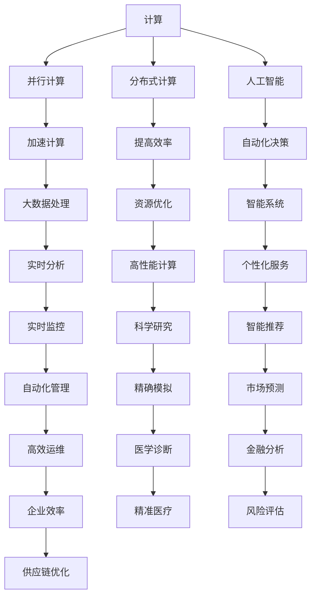
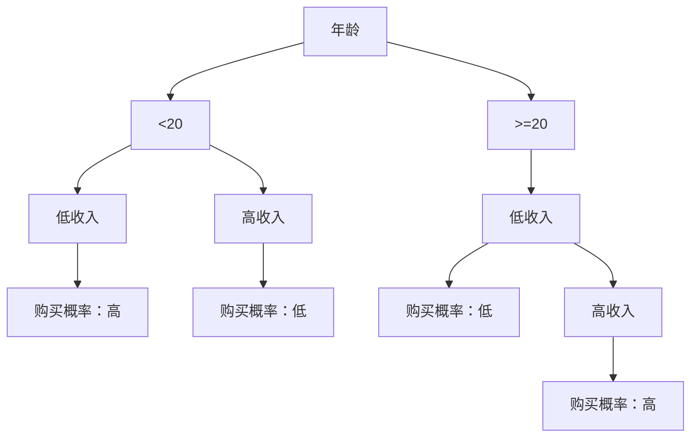

                 

# 计算的本质变化与未来趋势

> **关键词：计算本质，变化趋势，算法原理，数学模型，应用场景，未来展望**
>
> **摘要：本文将深入探讨计算的本质及其未来趋势，通过解析核心概念、算法原理、数学模型和实际应用案例，探讨计算技术对人类社会的深远影响，并展望其未来发展。**

## 1. 背景介绍

### 1.1 目的和范围

本文旨在探讨计算技术的本质变化及其未来发展趋势，旨在帮助读者理解计算技术的核心原理，以及其对各个领域的影响。本文将从多个维度进行阐述，包括核心概念、算法原理、数学模型和实际应用案例。

### 1.2 预期读者

本文适合对计算机科学、人工智能和数学感兴趣的读者，尤其是对计算技术的本质变化和未来趋势感兴趣的读者。无论是学生、研究者还是工程师，都可以通过本文获得对计算技术更深刻的理解。

### 1.3 文档结构概述

本文将分为以下几部分：

1. 背景介绍：介绍本文的目的、预期读者和文档结构。
2. 核心概念与联系：介绍计算的核心概念和原理，并通过Mermaid流程图进行展示。
3. 核心算法原理 & 具体操作步骤：详细阐述计算的核心算法原理和具体操作步骤，使用伪代码进行说明。
4. 数学模型和公式 & 详细讲解 & 举例说明：介绍计算中使用的数学模型和公式，并给出具体例子进行说明。
5. 项目实战：通过代码实际案例和详细解释说明，展示计算技术的应用。
6. 实际应用场景：探讨计算技术在不同领域中的应用。
7. 工具和资源推荐：推荐学习资源、开发工具和框架。
8. 总结：对本文内容进行总结，并展望未来发展趋势与挑战。
9. 附录：常见问题与解答。
10. 扩展阅读 & 参考资料：提供扩展阅读和参考资料。

### 1.4 术语表

#### 1.4.1 核心术语定义

- **计算**：计算是指通过算法和数学模型对信息进行处理和转化的过程。
- **算法**：算法是一系列规定步骤，用于解决特定问题。
- **数学模型**：数学模型是用数学语言描述现实世界的数学结构。

#### 1.4.2 相关概念解释

- **并行计算**：并行计算是指在同一时间内执行多个计算任务。
- **分布式计算**：分布式计算是指通过多个计算机协同工作来完成计算任务。

#### 1.4.3 缩略词列表

- **GPU**：图形处理单元（Graphics Processing Unit）
- **CPU**：中央处理器（Central Processing Unit）
- **AI**：人工智能（Artificial Intelligence）

## 2. 核心概念与联系

计算技术的本质变化与未来趋势离不开几个核心概念，包括并行计算、分布式计算和人工智能。以下是这些概念之间的联系和关系，通过Mermaid流程图进行展示。



## 3. 核心算法原理 & 具体操作步骤

计算技术的核心算法原理可以分为以下几个步骤：

### 3.1 问题定义

首先，我们需要明确要解决的问题。例如，我们可以定义一个简单的任务：通过算法对一组数据进行排序。

### 3.2 算法选择

根据问题定义，我们可以选择不同的排序算法。常见的排序算法包括冒泡排序、插入排序和快速排序等。

### 3.3 算法实现

以下是一个冒泡排序的伪代码实现：

```pseudo
procedure bubbleSort( A : list of sortable items )
    n = length(A)
    repeat 
        swapped = false
        for i = 1 to n-1 inclusive do
            if A[i-1] > A[i] then
                swap(A[i-1], A[i])
                swapped = true
            end if
        end for
        n = n - 1
    until not swapped
end procedure
```

### 3.4 算法分析

冒泡排序的时间复杂度为O(n^2)，空间复杂度为O(1)。

### 3.5 算法优化

我们可以对冒泡排序进行优化，例如添加一个标志位来判断是否进行了交换，从而提前终止排序过程。

```pseudo
procedure optimizedBubbleSort( A : list of sortable items )
    n = length(A)
    repeat 
        swapped = false
        for i = 1 to n-1 inclusive do
            if A[i-1] > A[i] then
                swap(A[i-1], A[i])
                swapped = true
            end if
        end for
        if not swapped then
            break
        end if
        n = n - 1
    until not swapped
end procedure
```

## 4. 数学模型和公式 & 详细讲解 & 举例说明

在计算技术中，数学模型和公式起着至关重要的作用。以下是一些常用的数学模型和公式，以及它们的详细讲解和举例说明。

### 4.1 线性回归模型

线性回归模型是一种用于预测数值变量的方法。其基本公式为：

$$ y = mx + b $$

其中，\(y\) 是因变量，\(x\) 是自变量，\(m\) 是斜率，\(b\) 是截距。

**例子：** 假设我们想预测某个城市明天的温度。已知自变量（今天温度）为 \(x = 25^\circ C\)，斜率 \(m = 0.5^\circ C/^\circ C\)，截距 \(b = 10^\circ C\)。那么，我们可以使用线性回归模型进行预测：

$$ y = 0.5 \times 25 + 10 = 20^\circ C $$

### 4.2 决策树模型

决策树模型是一种用于分类和回归问题的方法。其基本结构由一系列判断节点和叶子节点组成。

**例子：** 假设我们想根据客户的年龄和收入进行分类。以下是一个简单的决策树模型：



### 4.3 集成模型

集成模型是通过结合多个模型来提高预测性能的方法。常见的方法包括随机森林、梯度提升树等。

**例子：** 假设我们使用随机森林模型进行预测。随机森林由多个决策树组成，每个决策树对同一个问题进行预测。最后，通过投票的方式得出最终预测结果。

$$ \hat{y} = \frac{1}{N} \sum_{i=1}^{N} \hat{y}_i $$

其中，\(\hat{y}\) 是最终预测结果，\(\hat{y}_i\) 是第 \(i\) 个决策树的预测结果，\(N\) 是决策树的数量。

## 5. 项目实战：代码实际案例和详细解释说明

在本节中，我们将通过一个实际项目案例，展示计算技术的应用，并详细解释说明其实现过程。

### 5.1 开发环境搭建

在本案例中，我们使用Python作为编程语言，并使用Scikit-learn库实现决策树模型。首先，我们需要安装Python和Scikit-learn库：

```bash
pip install python
pip install scikit-learn
```

### 5.2 源代码详细实现和代码解读

以下是一个简单的决策树模型实现，用于预测客户的购买概率：

```python
from sklearn.datasets import load_iris
from sklearn.model_selection import train_test_split
from sklearn.tree import DecisionTreeClassifier
import matplotlib.pyplot as plt

# 加载数据集
iris = load_iris()
X = iris.data
y = iris.target

# 数据集划分
X_train, X_test, y_train, y_test = train_test_split(X, y, test_size=0.3, random_state=42)

# 决策树模型训练
clf = DecisionTreeClassifier()
clf.fit(X_train, y_train)

# 决策树模型预测
y_pred = clf.predict(X_test)

# 决策树模型可视化
plt.figure(figsize=(10, 6))
tree.plot_tree(clf, filled=True, feature_names=iris.feature_names, class_names=iris.target_names)
plt.show()
```

**代码解读：**

1. 导入所需的库和模块，包括Scikit-learn库和matplotlib库。
2. 加载Iris数据集，并进行数据集划分。
3. 创建决策树模型，并使用训练集进行模型训练。
4. 使用测试集进行模型预测。
5. 可视化决策树模型，展示其结构和分类规则。

### 5.3 代码解读与分析

在本案例中，我们使用决策树模型对Iris数据集进行分类预测。以下是代码的关键部分解读：

1. **数据加载与划分：**

   ```python
   iris = load_iris()
   X = iris.data
   y = iris.target
   X_train, X_test, y_train, y_test = train_test_split(X, y, test_size=0.3, random_state=42)
   ```

   这里我们使用Scikit-learn库加载Iris数据集，并将其划分为训练集和测试集。训练集用于模型训练，测试集用于模型评估。

2. **模型训练：**

   ```python
   clf = DecisionTreeClassifier()
   clf.fit(X_train, y_train)
   ```

   我们创建一个决策树分类器对象，并使用训练集对其进行训练。

3. **模型预测：**

   ```python
   y_pred = clf.predict(X_test)
   ```

   使用训练好的模型对测试集进行预测，得到预测结果。

4. **模型可视化：**

   ```python
   plt.figure(figsize=(10, 6))
   tree.plot_tree(clf, filled=True, feature_names=iris.feature_names, class_names=iris.target_names)
   plt.show()
   ```

   可视化决策树模型，展示其结构和分类规则。通过可视化，我们可以更直观地理解决策树模型的工作原理。

## 6. 实际应用场景

计算技术在各个领域都有着广泛的应用，以下是一些实际应用场景：

1. **医疗领域：** 计算技术可以帮助医生进行疾病诊断、预测和治疗方案的优化。例如，通过深度学习模型对医学图像进行分析，可以更准确地诊断疾病。

2. **金融领域：** 计算技术可以用于风险管理、市场预测和投资策略的优化。例如，通过机器学习模型对历史数据进行分析，可以预测股票市场的走势。

3. **工业领域：** 计算技术可以用于生产流程的优化、设备故障预测和供应链管理。例如，通过实时数据分析，可以预测设备故障并提前进行维护，从而提高生产效率。

4. **交通领域：** 计算技术可以用于交通流量分析、路线规划和智能交通管理。例如，通过实时数据分析，可以预测交通拥堵并优化路线，从而减少交通拥堵时间。

## 7. 工具和资源推荐

### 7.1 学习资源推荐

#### 7.1.1 书籍推荐

- 《Python编程：从入门到实践》
- 《深度学习》
- 《机器学习实战》

#### 7.1.2 在线课程

- Coursera的《机器学习》
- edX的《深度学习基础》
- Udacity的《人工智能工程师》

#### 7.1.3 技术博客和网站

- [Medium的Machine Learning博客](https://medium.com/topic/machine-learning)
- [KDNuggets的数据挖掘和机器学习资源](https://www.kdnuggets.com/)
- [TensorFlow官方文档](https://www.tensorflow.org/)

### 7.2 开发工具框架推荐

#### 7.2.1 IDE和编辑器

- PyCharm
- Visual Studio Code
- Jupyter Notebook

#### 7.2.2 调试和性能分析工具

- VSCode的Python扩展
- PyCharm的调试工具
- JMeter的性能测试工具

#### 7.2.3 相关框架和库

- Scikit-learn
- TensorFlow
- PyTorch

### 7.3 相关论文著作推荐

#### 7.3.1 经典论文

- “The Backpropagation Algorithm” by David E. Rumelhart, Geoffrey E. Hinton, and Ronald J. Williams
- “Learning to Represent Knowledge with a Graph-based Neural Network” by William L. Hamilton

#### 7.3.2 最新研究成果

- “Deep Learning for Natural Language Processing” by Ruslan Salakhutdinov and Geoffrey Hinton
- “Bert: Pre-training of Deep Bidirectional Transformers for Language Understanding” by Jacob Devlin, Ming-Wei Chang, Kenton Lee, and Kristina Toutanova

#### 7.3.3 应用案例分析

- “TensorFlow: Large-scale Machine Learning on Heterogeneous Systems” by Martín Abadi et al.
- “PyTorch: An Imperative Style Deep Learning Library” by Adam Coates et al.

## 8. 总结：未来发展趋势与挑战

计算技术的未来发展趋势体现在以下几个方面：

1. **硬件加速：** 随着GPU、TPU等硬件加速器的普及，计算速度将进一步提升，为人工智能和大数据处理等领域带来更多可能性。
2. **量子计算：** 量子计算作为下一代计算技术，具有巨大的计算潜力。未来，量子计算将在密码学、优化问题和材料科学等领域发挥重要作用。
3. **边缘计算：** 随着物联网和智能设备的普及，边缘计算将逐渐成为主流。通过在设备端进行计算，可以减少数据传输和延迟，提高应用性能。
4. **自动化与智能化：** 计算技术的自动化和智能化将进一步提升，推动各行各业实现数字化转型。

然而，计算技术的发展也面临着一些挑战：

1. **数据隐私与安全：** 随着数据规模的不断扩大，数据隐私和安全问题日益突出。未来，需要更多研究来解决数据隐私和安全问题。
2. **算法公平性与透明性：** 人工智能算法的公平性和透明性成为关键问题。未来，需要制定相关标准和规范，确保算法的公正性和透明性。
3. **计算资源分配：** 随着计算需求的增长，计算资源分配成为一大挑战。未来，需要更加高效和智能的资源分配算法，以满足不断增长的计算需求。

## 9. 附录：常见问题与解答

**Q：计算技术的本质是什么？**

A：计算技术的本质是通过算法和数学模型对信息进行处理和转化的过程。它涉及到信息的获取、处理、存储和传输。

**Q：什么是并行计算？**

A：并行计算是指在多个处理器或计算单元上同时执行多个计算任务。它可以提高计算速度和效率。

**Q：什么是分布式计算？**

A：分布式计算是指通过多个计算机协同工作来完成计算任务。它可以提高计算能力和可扩展性。

**Q：什么是人工智能？**

A：人工智能是指通过计算机模拟人类智能，使其能够执行各种任务，如感知、推理、学习和决策。

**Q：什么是深度学习？**

A：深度学习是一种人工智能技术，通过多层神经网络对大量数据进行分析和建模，从而实现高级任务，如图像识别、语音识别和自然语言处理。

## 10. 扩展阅读 & 参考资料

- Goodfellow, I., Bengio, Y., & Courville, A. (2016). *Deep Learning*. MIT Press.
- Russell, S., & Norvig, P. (2016). *Artificial Intelligence: A Modern Approach*. Prentice Hall.
- Hastie, T., Tibshirani, R., & Friedman, J. (2009). *The Elements of Statistical Learning*. Springer.
- Murphy, K. P. (2012). *Machine Learning: A Probabilistic Perspective*. MIT Press.
- LeCun, Y., Bengio, Y., & Hinton, G. (2015). *Deep Learning*. Nature.

