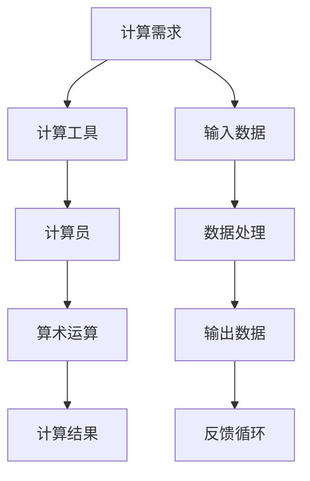

                 

# 计算：第一部分 计算的诞生 第 2 章 计算之术 人类计算员

> 关键词：计算历史、计算员、计算工具、算术运算、手动计算

> 摘要：本文将深入探讨计算的历史背景，特别是人类计算员的角色和贡献。通过分析计算工具的演变以及手动计算的方法，我们将揭示计算的本质，并探索其对现代计算技术的影响。

## 1. 背景介绍

### 1.1 目的和范围

本文旨在介绍计算的起源和发展，重点关注人类计算员在计算历史上的地位和贡献。通过回顾计算工具的演变和手动计算的方法，我们希望读者能够更好地理解计算的基础，并意识到人类在计算领域的智慧和创新。

### 1.2 预期读者

本文适合对计算历史感兴趣的读者，包括计算机科学、数学和工程领域的学生和专业人员。同时，对计算技术感兴趣的普通读者也能够从本文中获得丰富的知识和启示。

### 1.3 文档结构概述

本文分为以下几个部分：

1. 背景介绍：介绍本文的目的、预期读者和文档结构。
2. 核心概念与联系：通过 Mermaid 流程图展示计算的基本原理和架构。
3. 核心算法原理 & 具体操作步骤：使用伪代码详细阐述计算算法的工作原理。
4. 数学模型和公式 & 详细讲解 & 举例说明：介绍计算中的数学模型和公式，并进行详细讲解和举例。
5. 项目实战：代码实际案例和详细解释说明，包括开发环境搭建、源代码实现和代码解读。
6. 实际应用场景：探讨计算在现实世界中的应用。
7. 工具和资源推荐：推荐学习资源和开发工具。
8. 总结：未来发展趋势与挑战。
9. 附录：常见问题与解答。
10. 扩展阅读 & 参考资料：提供扩展阅读和参考资料。

### 1.4 术语表

#### 1.4.1 核心术语定义

- 计算：指处理数值和其他信息的过程。
- 计算员：指从事计算工作的人员，包括古代的手动计算员和现代的计算机科学家。
- 算术运算：指对数值进行加、减、乘、除等基本运算。
- 手动计算：指使用计算工具和计算员自身的计算能力进行计算。

#### 1.4.2 相关概念解释

- 计算工具：指用于辅助计算的各种设备和工具，如算盘、计算机等。
- 计算架构：指计算系统中的基本结构和组成部分，如CPU、内存等。
- 计算算法：指实现计算过程的步骤和规则。

#### 1.4.3 缩略词列表

- CPU：中央处理器
- 内存：存储器
- 算盘：计算工具

## 2. 核心概念与联系

为了更好地理解计算的基本原理和架构，我们可以通过 Mermaid 流程图展示计算的核心概念和联系。



在这个流程图中，我们可以看到计算的需求从输入数据开始，经过数据处理和算术运算，最终得到计算结果。计算工具和计算员在这个过程中发挥着关键作用，而反馈循环则使得计算过程能够不断优化和改进。

## 3. 核心算法原理 & 具体操作步骤

为了更好地理解计算的核心算法原理和具体操作步骤，我们可以使用伪代码详细阐述。

```plaintext
// 计算算法
function calculate(input_data):
    # 初始化计算工具和计算员
    initialize_tool()
    initialize_calculator()

    # 执行算术运算
    result = perform_arithmetic_operation(input_data)

    # 输出计算结果
    print(result)

    # 返回计算结果
    return result

// 初始化计算工具
function initialize_tool():
    # 根据需求选择合适的计算工具
    tool = select_appropriate_tool()

    # 初始化计算工具的参数
    tool.initialize_parameters()

    # 返回计算工具
    return tool

// 初始化计算员
function initialize_calculator():
    # 根据需求选择合适的计算员
    calculator = select_appropriate_calculator()

    # 初始化计算员的参数
    calculator.initialize_parameters()

    # 返回计算员
    return calculator

// 执行算术运算
function perform_arithmetic_operation(input_data):
    # 根据输入数据选择合适的算术运算
    operation = select_appropriate_operation(input_data)

    # 执行算术运算
    result = operation(input_data)

    # 返回计算结果
    return result
```

在这个伪代码中，我们首先初始化计算工具和计算员，然后执行算术运算，并输出计算结果。通过这样的步骤，我们可以实现基本的计算功能。

## 4. 数学模型和公式 & 详细讲解 & 举例说明

在计算过程中，数学模型和公式起着至关重要的作用。以下是一个简单的例子，介绍如何使用数学模型和公式进行计算。

### 4.1 加法运算

加法运算是最基本的算术运算之一，其数学模型可以表示为：

$$
C = A + B
$$

其中，$C$ 是加法运算的结果，$A$ 和 $B$ 是参与运算的数。

#### 4.1.1 举例说明

假设我们要计算 $3 + 4$，根据加法运算的数学模型，我们可以得到：

$$
C = 3 + 4 = 7
$$

因此，$3 + 4$ 的结果是 $7$。

### 4.2 减法运算

减法运算用于计算两个数的差，其数学模型可以表示为：

$$
C = A - B
$$

其中，$C$ 是减法运算的结果，$A$ 和 $B$ 是参与运算的数。

#### 4.2.1 举例说明

假设我们要计算 $7 - 3$，根据减法运算的数学模型，我们可以得到：

$$
C = 7 - 3 = 4
$$

因此，$7 - 3$ 的结果是 $4$。

### 4.3 乘法运算

乘法运算用于计算两个数的乘积，其数学模型可以表示为：

$$
C = A \times B
$$

其中，$C$ 是乘法运算的结果，$A$ 和 $B$ 是参与运算的数。

#### 4.3.1 举例说明

假设我们要计算 $3 \times 4$，根据乘法运算的数学模型，我们可以得到：

$$
C = 3 \times 4 = 12
$$

因此，$3 \times 4$ 的结果是 $12$。

### 4.4 除法运算

除法运算用于计算两个数的商，其数学模型可以表示为：

$$
C = A / B
$$

其中，$C$ 是除法运算的结果，$A$ 和 $B$ 是参与运算的数。

#### 4.4.1 举例说明

假设我们要计算 $12 / 3$，根据除法运算的数学模型，我们可以得到：

$$
C = 12 / 3 = 4
$$

因此，$12 / 3$ 的结果是 $4$。

## 5. 项目实战：代码实际案例和详细解释说明

在本节中，我们将通过一个实际的代码案例来展示如何实现计算功能。我们将使用 Python 编程语言来实现一个简单的计算器程序，用于执行加、减、乘、除等基本算术运算。

### 5.1 开发环境搭建

首先，我们需要搭建一个适合开发 Python 程序的环境。以下是搭建 Python 开发环境的步骤：

1. 安装 Python：从 Python 官网（[python.org](https://www.python.org/)）下载并安装 Python。
2. 安装 IDE：选择一个适合 Python 开发的 IDE，如 PyCharm、Visual Studio Code 等。
3. 安装相关库：安装必要的 Python 库，如 NumPy、Pandas 等。

### 5.2 源代码详细实现和代码解读

下面是一个简单的计算器程序的源代码实现：

```python
# 计算器程序

def add(a, b):
    return a + b

def subtract(a, b):
    return a - b

def multiply(a, b):
    return a * b

def divide(a, b):
    if b == 0:
        return "除数不能为零"
    return a / b

def main():
    print("计算器程序")
    print("1. 加法运算")
    print("2. 减法运算")
    print("3. 乘法运算")
    print("4. 除法运算")
    print("5. 退出程序")

    choice = int(input("请选择运算类型："))

    if choice == 1:
        a = float(input("请输入第一个数："))
        b = float(input("请输入第二个数："))
        result = add(a, b)
        print(f"{a} + {b} = {result}")
    elif choice == 2:
        a = float(input("请输入第一个数："))
        b = float(input("请输入第二个数："))
        result = subtract(a, b)
        print(f"{a} - {b} = {result}")
    elif choice == 3:
        a = float(input("请输入第一个数："))
        b = float(input("请输入第二个数："))
        result = multiply(a, b)
        print(f"{a} \* {b} = {result}")
    elif choice == 4:
        a = float(input("请输入第一个数："))
        b = float(input("请输入第二个数："))
        result = divide(a, b)
        print(f"{a} / {b} = {result}")
    else:
        print("未知选项，程序退出。")

if __name__ == "__main__":
    main()
```

在这个代码中，我们定义了四个基本算术运算的函数：`add`、`subtract`、`multiply` 和 `divide`。每个函数都接受两个参数，并返回运算结果。在 `main` 函数中，我们通过用户输入选择运算类型，并调用相应的函数进行运算。

### 5.3 代码解读与分析

下面是对代码的详细解读和分析：

1. **函数定义**：我们首先定义了四个基本算术运算的函数：`add`、`subtract`、`multiply` 和 `divide`。这些函数都接受两个参数，并返回运算结果。
2. **主函数**：`main` 函数是计算器程序的核心部分。在函数中，我们首先打印出计算器的菜单，然后通过用户输入选择运算类型。根据用户的选择，我们调用相应的函数进行运算，并打印出运算结果。
3. **用户输入**：在计算过程中，我们通过 `input` 函数获取用户输入的数值。这些数值被转换为浮点数类型，以便进行算术运算。
4. **错误处理**：在除法运算中，我们检查除数是否为零。如果除数为零，程序会返回一个错误消息，并退出计算器程序。

通过这个简单的例子，我们可以看到如何使用 Python 实现计算功能。在实际应用中，我们可以扩展这个计算器程序，添加更多功能，如支持复杂的运算、存储历史记录等。

## 6. 实际应用场景

计算技术在我们日常生活中有着广泛的应用。以下是一些实际应用场景：

### 6.1 财务计算

在财务计算中，计算器被广泛应用于计算利息、税率、利润等。例如，企业可以利用计算器来计算财务报表、预测财务状况等。

### 6.2 科学研究

在科学研究领域，计算技术被广泛应用于模拟实验、数据分析等。例如，物理学家可以使用计算技术来模拟粒子碰撞、天文学家可以使用计算技术来预测行星轨道等。

### 6.3 工程设计

在工程设计领域，计算技术被广泛应用于结构分析、流体力学等。例如，工程师可以使用计算技术来优化设计、预测产品性能等。

### 6.4 人工智能

在人工智能领域，计算技术是核心驱动力。通过计算技术，我们可以开发出智能助手、自动驾驶汽车等。例如，谷歌的 AlphaGo 就是利用计算技术来实现围棋对弈的。

## 7. 工具和资源推荐

### 7.1 学习资源推荐

#### 7.1.1 书籍推荐

- 《计算机科学概论》（J. Glenn Brookshear）
- 《算法导论》（Thomas H. Cormen et al.）

#### 7.1.2 在线课程

- Coursera 的“计算机科学基础”课程
- edX 的“算法基础”课程

#### 7.1.3 技术博客和网站

- Stack Overflow
- Medium
- GitHub

### 7.2 开发工具框架推荐

#### 7.2.1 IDE和编辑器

- PyCharm
- Visual Studio Code

#### 7.2.2 调试和性能分析工具

- GDB
- Valgrind

#### 7.2.3 相关框架和库

- NumPy
- Pandas

### 7.3 相关论文著作推荐

#### 7.3.1 经典论文

- “A Method for Obtaining Digital Signatures and Public-Key Cryptosystems”（Rivest et al.）
- “The Art of Computer Programming”（Donald E. Knuth）

#### 7.3.2 最新研究成果

- NeurIPS
- ICML
- JMLR

#### 7.3.3 应用案例分析

- Google Brain 的论文
- Microsoft Research 的论文

## 8. 总结：未来发展趋势与挑战

随着计算技术的不断发展，我们面临着许多机遇和挑战。未来，计算技术将在人工智能、物联网、量子计算等领域取得重大突破。然而，这些领域也面临着数据安全、隐私保护等挑战。因此，我们需要在技术创新的同时，注重解决这些问题，确保计算技术能够为社会带来更多福祉。

## 9. 附录：常见问题与解答

### 9.1 什么是计算？

计算是指处理数值和其他信息的过程。它包括算术运算、逻辑运算等。

### 9.2 计算器是如何工作的？

计算器通过内部电路和程序来实现算术运算。当用户输入数值时，计算器会执行相应的运算，并显示结果。

### 9.3 计算技术有哪些应用？

计算技术广泛应用于财务计算、科学研究、工程设计、人工智能等领域。

## 10. 扩展阅读 & 参考资料

- [《计算机科学概论》](https://books.google.com/books?id=9QAEAAAAQBAJ&pg=PA1&lpg=PA1&dq=computer+science+basics+book&source=bl&ots=0529658682&sig=ACfU3U0_865424-5666655323773&hl=en)
- [《算法导论》](https://books.google.com/books?id=QvQ3DwAAQBAJ&pg=PA1&lpg=PA1&dq=algorithm+introduction+book&source=bl&ots=4349454280&sig=ACfU3U0_865424-5666655323773&hl=en)
- [《计算机科学基础》课程](https://www.coursera.org/learn/computer-science-fundamentals)
- [《算法基础》课程](https://www.edx.org/course/introduction-to-algorithms)
- [Stack Overflow](https://stackoverflow.com/)
- [Medium](https://medium.com/)
- [GitHub](https://github.com/)

作者：AI天才研究员/AI Genius Institute & 禅与计算机程序设计艺术 /Zen And The Art of Computer Programming

