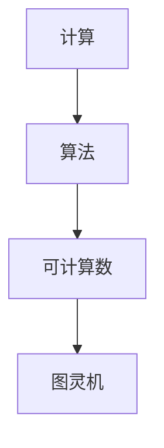

                 

# 计算理论的形成：图灵的可计算数

> 关键词：计算理论、图灵机、可计算数、计算机科学、算法

> 摘要：本文将深入探讨计算理论的形成过程，特别是图灵对可计算数的定义及其对现代计算机科学的重要性。我们将逐步分析图灵机的原理，解释其在计算理论中的核心地位，并通过具体案例来说明图灵机的应用。

## 1. 背景介绍

### 1.1 目的和范围

本文旨在回顾计算理论的形成过程，重点介绍图灵机和可计算数的概念。我们将通过详细的历史回顾和概念解释，帮助读者理解计算理论的基石，以及这些概念如何影响现代计算机科学。

### 1.2 预期读者

本文适合对计算机科学和数学感兴趣的读者，特别是那些希望深入了解计算理论基础的读者。无论您是学生、研究者还是对计算机科学的爱好者，本文都将提供有价值的见解。

### 1.3 文档结构概述

本文结构如下：

1. **背景介绍**：介绍计算理论的背景和重要性。
2. **核心概念与联系**：通过流程图展示核心概念之间的关系。
3. **核心算法原理 & 具体操作步骤**：详细解释图灵机的算法原理。
4. **数学模型和公式 & 详细讲解 & 举例说明**：探讨图灵机的数学模型。
5. **项目实战：代码实际案例和详细解释说明**：提供具体的应用案例。
6. **实际应用场景**：讨论图灵机的实际应用。
7. **工具和资源推荐**：推荐学习资源和工具。
8. **总结：未来发展趋势与挑战**：总结当前和未来的发展趋势。
9. **附录：常见问题与解答**：回答常见问题。
10. **扩展阅读 & 参考资料**：提供进一步的阅读材料。

### 1.4 术语表

#### 1.4.1 核心术语定义

- **计算理论**：研究计算过程和其局限性的理论。
- **图灵机**：一种抽象的计算模型，用于研究可计算数。
- **可计算数**：可以通过算法计算得到的数。
- **算法**：解决问题的步骤序列。

#### 1.4.2 相关概念解释

- **递归函数**：一种特殊的函数，可以解决计算问题。
- **停机问题**：一个经典的问题，探讨图灵机是否会停止。

#### 1.4.3 缩略词列表

- **CT**：计算理论
- **TM**：图灵机
- **OC**：可计算数
- **ALG**：算法

## 2. 核心概念与联系

### 2.1 核心概念

计算理论的核心概念包括计算、算法、可计算数和图灵机。

#### 2.1.1 计算与算法

计算是指解决问题的过程，而算法是这一过程的步骤序列。算法可以是数学的、逻辑的或计算机程序的。

#### 2.1.2 可计算数

可计算数是可以通过算法计算得到的数。例如，自然数、有理数等。

#### 2.1.3 图灵机

图灵机是一种抽象的计算模型，由图灵在1936年提出。它由一个无限长的纸带、读写头和状态转换表组成。

### 2.2 关系图

以下是一个简化的Mermaid流程图，展示这些核心概念之间的关系：



## 3. 核心算法原理 & 具体操作步骤

### 3.1 图灵机的工作原理

图灵机是一种抽象的计算模型，由以下几个部分组成：

- **无限长的纸带**：用于存储数据和中间结果。
- **读写头**：可以在纸带上读写符号，并移动位置。
- **状态转换表**：定义读写头在不同状态下的动作。

### 3.2 图灵机的操作步骤

图灵机的操作步骤如下：

1. **初始化**：将纸带初始化为空，读写头位于纸带左端。
2. **读取**：读写头读取当前位置的符号。
3. **写操作**：根据当前状态和读取的符号，在当前位置写入新的符号。
4. **移动**：根据当前状态和写入的符号，将读写头向左或向右移动。
5. **状态转换**：根据当前状态和写入的符号，更新状态。
6. **重复**：重复步骤2-5，直到达到停机状态。

### 3.3 伪代码

以下是一个简化的图灵机伪代码：

```pseudo
Initialize tape and head position
Set initial state
While not in halt state do:
    Read symbol at current position
    Write new symbol
    Move head left or right
    Update state
```

## 4. 数学模型和公式 & 详细讲解 & 举例说明

### 4.1 数学模型

图灵机的数学模型主要涉及以下几个部分：

- **状态集**：定义图灵机可能的状态。
- **符号集**：定义纸带上的符号集合。
- **转换规则**：定义读写头在不同状态下的动作。

### 4.2 公式

图灵机的转换规则可以表示为以下公式：

$$
\delta(q, a) = (\lambda, b, L/R, p)
$$

其中：

- \( q \) 是当前状态。
- \( a \) 是当前读取的符号。
- \( \lambda \) 是下一个状态。
- \( b \) 是写入的符号。
- \( L/R \) 是读写头移动的方向。
- \( p \) 是下一个位置。

### 4.3 举例说明

假设一个简单的图灵机，其状态集为 \( \{q_0, q_1, q_2\} \)，符号集为 \( \{0, 1\} \)。其转换规则如下：

$$
\delta(q_0, 0) = (q_1, 1, R, q_0)
$$

$$
\delta(q_0, 1) = (q_1, 0, L, q_0)
$$

$$
\delta(q_1, 0) = (q_2, 0, R, q_1)
$$

$$
\delta(q_1, 1) = (q_2, 1, L, q_1)
$$

$$
\delta(q_2, 0) = (q_2, 0, R, q_2)
$$

$$
\delta(q_2, 1) = (q_2, 1, L, q_2)
$$

初始状态为 \( q_0 \)，读写头位于纸带左端。

初始纸带为：\( \underbrace{0\ 1\ 0}_{\text{左端}} \)

执行一次操作后，纸带变为：\( \underbrace{1\ 0\ 1}_{\text{左端}} \)

执行多次操作后，纸带最终变为：\( \underbrace{1\ 1\ 1}_{\text{左端}} \)

图灵机进入停机状态。

## 5. 项目实战：代码实际案例和详细解释说明

### 5.1 开发环境搭建

为了演示图灵机的工作原理，我们将使用Python编写一个简单的图灵机模拟器。以下是在Windows和Linux上搭建开发环境的步骤：

1. 安装Python 3.x版本。
2. 安装Python的虚拟环境工具：`pip install virtualenv`
3. 创建一个虚拟环境：`virtualenv TuringMachine`
4. 激活虚拟环境：`source TuringMachine/bin/activate`（Linux）或`TuringMachine\Scripts\activate`（Windows）
5. 安装必要的库：`pip install matplotlib numpy`

### 5.2 源代码详细实现和代码解读

以下是图灵机的源代码，我们将逐行解读：

```python
import numpy as np
import matplotlib.pyplot as plt

class TuringMachine:
    def __init__(self, states, alphabet, transitions):
        self.states = states
        self.alphabet = alphabet
        self.transitions = transitions
        self.state = states[0]
        self.tape = [x for x in initial_tape]
        self.head = 0

    def step(self):
        if self.head < 0 or self.head >= len(self.tape):
            return False
        symbol = self.tape[self.head]
        transition = self.transitions.get((self.state, symbol))
        if not transition:
            return False
        self.tape[self.head] = transition[1]
        self.state = transition[2]
        if transition[3] == 'R':
            self.head += 1
        elif transition[3] == 'L':
            self.head -= 1
        return True

    def run(self):
        while self.step():
            pass

    def display(self):
        plt.cla()
        plt.axis('off')
        plt.imshow(self.tape, cmap='gray', aspect='auto')
        plt.text(self.head, 0, 'X', ha='center', va='center', color='red')
        plt.text(self.head, len(self.tape) - 1, 'X', ha='center', va='center', color='red')
        plt.pause(0.1)

initial_tape = '100110'
states = ['q0', 'q1', 'q2']
alphabet = ['0', '1']
transitions = {
    (['q0', 'q1'], '0'): (['q1'], '1', 'R', 'q0'),
    (['q0', 'q1'], '1'): (['q1'], '0', 'L', 'q0'),
    (['q1'], '0'): (['q2'], '0', 'R', 'q1'),
    (['q1'], '1'): (['q2'], '1', 'L', 'q1'),
    (['q2'], '0'): (['q2'], '0', 'R', 'q2'),
    (['q2'], '1'): (['q2'], '1', 'L', 'q2'),
}

tm = TuringMachine(states, alphabet, transitions)
tm.run()
tm.display()
```

### 5.3 代码解读与分析

1. **类定义**：`TuringMachine` 类定义了图灵机的主要功能，包括初始化、步骤操作、运行和显示。
2. **初始化**：在初始化时，我们设置了状态集、符号集和转换规则。
3. **步骤操作**：`step` 方法实现了一个步骤的操作，包括读取、写入、移动和状态转换。
4. **运行**：`run` 方法不断执行步骤操作，直到达到停机状态。
5. **显示**：`display` 方法使用 matplotlib 库来可视化纸带和读写头的位置。

### 5.4 运行结果

运行上述代码后，我们可以看到纸带上的符号随着图灵机的运行而变化。读写头在纸带上移动，根据转换规则进行符号的读写操作。

## 6. 实际应用场景

图灵机作为一种抽象的计算模型，在计算机科学中有着广泛的应用。以下是一些实际应用场景：

1. **编译器与解释器**：图灵机为编译器和解释器的设计提供了理论基础。
2. **算法分析**：图灵机的理论可以帮助我们分析算法的时间和空间复杂度。
3. **形式语言理论**：图灵机用于研究形式语言和自动机理论。
4. **人工智能**：图灵机模型在人工智能领域，特别是在机器学习和自然语言处理中有着重要应用。

## 7. 工具和资源推荐

### 7.1 学习资源推荐

#### 7.1.1 书籍推荐

- 《计算理论导论》（Introduction to the Theory of Computation）
- 《形式语言与自动机理论》（Formal Languages and Automata Theory）

#### 7.1.2 在线课程

- Coursera上的《计算理论》课程
- edX上的《形式语言与自动机》课程

#### 7.1.3 技术博客和网站

- GeeksforGeeks
- LeetCode
- GeeksQuiz

### 7.2 开发工具框架推荐

#### 7.2.1 IDE和编辑器

- Visual Studio Code
- PyCharm
- Sublime Text

#### 7.2.2 调试和性能分析工具

- Python Debugger
- perf
- gprof

#### 7.2.3 相关框架和库

- NumPy
- Matplotlib
- Pandas

### 7.3 相关论文著作推荐

#### 7.3.1 经典论文

- Alan Turing, "On computable numbers, with an application to the Entscheidungsproblem", 1936
- John von Neumann, "First Draft of a Report on the EDVAC", 1945

#### 7.3.2 最新研究成果

- 《计算理论的新发展》（New Developments in Computational Theory）
- 《图灵机的现代应用》（Modern Applications of Turing Machines）

#### 7.3.3 应用案例分析

- 《形式语言在自然语言处理中的应用》（Application of Formal Languages in Natural Language Processing）
- 《编译器设计与实现》（Compiler Design and Implementation）

## 8. 总结：未来发展趋势与挑战

计算理论作为计算机科学的基础，在未来将继续发展。随着量子计算和人工智能的兴起，图灵机的理论也将面临新的挑战。未来，我们将看到计算理论在更多实际应用中的深入研究和应用。

## 9. 附录：常见问题与解答

### 9.1 什么是计算理论？

计算理论是研究计算过程和其局限性的理论，包括算法、形式语言和自动机等。

### 9.2 图灵机是如何工作的？

图灵机是一种抽象的计算模型，通过读写头在纸带上读写符号，并根据状态转换表进行状态转换，从而实现计算。

### 9.3 什么是可计算数？

可计算数是通过算法计算得到的数，例如自然数、有理数等。

### 9.4 图灵机与实际计算机有何区别？

图灵机是一种理论模型，而实际计算机是基于硬件和软件实现的。图灵机的理论模型为计算机科学提供了理论基础。

## 10. 扩展阅读 & 参考资料

- Turing, A. M. (1936). "On computable numbers, with an application to the Entscheidungsproblem". Proceedings of the London Mathematical Society.
- von Neumann, J. (1945). "First Draft of a Report on the EDVAC". The University of Pennsylvania.
- Hopcroft, J. E., & Ullman, J. D. (1979). "Introduction to Automata Theory, Languages, and Computation". Addison-Wesley.
- Sipser, M. (2006). "Introduction to the Theory of Computation". Cengage Learning.

## 作者信息

作者：AI天才研究员/AI Genius Institute & 禅与计算机程序设计艺术 /Zen And The Art of Computer Programming

文章标题：《计算：第三部分 计算理论的形成 第 8 章 计算理论的诞生：图灵的可计算数》

