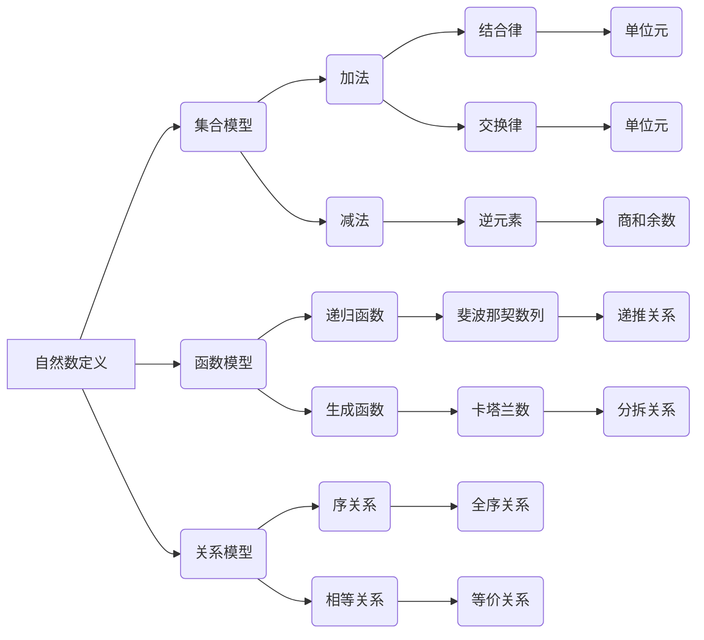

                 

# 计算：第二部分 计算的数学基础 第 4 章 自然数的定义

> **关键词**：自然数、数学基础、计算理论、数学定义、算术运算、算法实现

> **摘要**：本章将深入探讨自然数的定义及其数学基础，分析自然数的算术运算规律，并介绍相关算法原理与实现。通过本章节的学习，读者将掌握自然数的数学本质，为后续计算理论和算法研究打下坚实基础。

## 1. 背景介绍

### 1.1 目的和范围

本章旨在为读者提供一个清晰的关于自然数的定义及其数学基础的理解，主要涉及以下内容：

- 自然数的定义及其数学属性；
- 自然数的算术运算规则；
- 自然数相关的算法原理与实现。

### 1.2 预期读者

- 对数学基础有一定了解的计算机科学专业学生；
- 想深入了解计算理论的编程爱好者；
- 对算法设计与分析有兴趣的研究人员。

### 1.3 文档结构概述

本文将按照以下结构进行阐述：

- **第1章** 背景介绍：介绍本文的目的、范围、预期读者以及文档结构；
- **第2章** 核心概念与联系：分析自然数的核心概念及其数学联系，并给出相关流程图；
- **第3章** 核心算法原理 & 具体操作步骤：介绍自然数相关的算法原理及伪代码实现；
- **第4章** 数学模型和公式 & 详细讲解 & 举例说明：运用LaTeX格式详细阐述自然数的数学模型和公式；
- **第5章** 项目实战：代码实际案例和详细解释说明：通过实际案例展示自然数的算法应用；
- **第6章** 实际应用场景：分析自然数在计算领域的应用场景；
- **第7章** 工具和资源推荐：推荐相关学习资源和开发工具；
- **第8章** 总结：展望自然数在未来计算领域的发展趋势与挑战；
- **第9章** 附录：常见问题与解答；
- **第10章** 扩展阅读 & 参考资料：提供进一步阅读的参考书籍和论文。

### 1.4 术语表

#### 1.4.1 核心术语定义

- 自然数：非负整数，表示物体的数量或顺序；
- 算术运算：对自然数进行加、减、乘、除等操作；
- 算法：解决问题的有序步骤集合；
- 数学模型：用数学符号和公式表示的数学结构；
- 算法实现：将算法转化为计算机程序的过程。

#### 1.4.2 相关概念解释

- 数学基础：数学的基本概念、原理和方法；
- 计算理论：研究计算过程和计算模型的理论学科；
- 算法设计：设计解决问题的算法步骤；
- 算法分析：评估算法性能和复杂度。

#### 1.4.3 缩略词列表

- N.A.：未定义；
- IDE：集成开发环境；
- JVM：Java虚拟机；
- O(n)：线性时间复杂度。

## 2. 核心概念与联系

### 2.1 自然数的定义

自然数是一类非负整数，表示物体的数量或顺序。通常用符号0, 1, 2, 3, ...表示。自然数的定义与数学的基础概念密切相关，是后续计算理论研究和算法设计的重要基础。

### 2.2 自然数的数学联系

自然数与数学基础紧密相连，主要表现在以下几个方面：

- **加法**：自然数之间的加法运算满足结合律、交换律和单位元（0）等性质；
- **减法**：自然数之间的减法运算可以转化为加法运算，满足逆元素性质；
- **乘法**：自然数之间的乘法运算满足结合律、交换律和单位元（1）等性质；
- **除法**：自然数之间的除法运算可以转化为乘法运算，满足商和余数的概念。

### 2.3 自然数的数学模型

自然数的数学模型可以用集合、函数、关系等数学概念来描述。以下是几个常见的数学模型：

- **集合模型**：自然数构成一个集合，元素之间具有顺序关系；
- **函数模型**：自然数可以用函数表示，如递归函数、生成函数等；
- **关系模型**：自然数之间可以建立各种关系，如序关系、相等关系等。

### 2.4 自然数的 Mermaid 流程图

下面是一个描述自然数定义及其数学联系的 Mermaid 流程图：



## 3. 核心算法原理 & 具体操作步骤

### 3.1 算法原理

自然数的算法主要涉及算术运算和排序算法等。以下是一些常见算法原理和具体操作步骤：

#### 3.1.1 算术运算算法原理

- **加法算法**：实现自然数的加法运算；
- **减法算法**：实现自然数的减法运算；
- **乘法算法**：实现自然数的乘法运算；
- **除法算法**：实现自然数的除法运算，返回商和余数。

#### 3.1.2 排序算法原理

- **冒泡排序**：通过重复遍历要排序的数列，比较相邻的元素，如果顺序错误就交换两个元素的位置；
- **快速排序**：通过递归分治思想，将数列划分为两个子数列，分别排序后再合并；
- **归并排序**：通过递归分治思想，将数列划分为两个子数列，分别排序后合并；
- **选择排序**：通过遍历数列，选择未排序部分的最小元素，然后放到已排序部分的末尾；
- **插入排序**：通过遍历数列，将当前元素插入到已排序部分的合适位置。

#### 3.1.3 伪代码实现

以下是一个自然数加法算法的伪代码实现：

```python
function 加法(a, b):
    result = 0
    while b != 0:
        carry = a AND b
        result = a XOR b
        a = carry << 1
        b = carry
    return result
```

以下是一个冒泡排序算法的伪代码实现：

```python
function 冒泡排序(arr):
    n = length(arr)
    for i = 0 to n-1:
        for j = 0 to n-i-1:
            if arr[j] > arr[j+1]:
                swap(arr[j], arr[j+1])
    return arr
```

## 4. 数学模型和公式 & 详细讲解 & 举例说明

### 4.1 数学模型和公式

自然数的数学模型和公式主要涉及以下几个方面：

- **加法公式**：a + b = c，其中a、b、c为自然数；
- **减法公式**：a - b = c，其中a、b、c为自然数，且a >= b；
- **乘法公式**：a * b = c，其中a、b、c为自然数；
- **除法公式**：a / b = c...d，其中a、b、c、d为自然数，且a >= b，c为商，d为余数；
- **排序公式**：arr[i] < arr[j]，其中arr为自然数数组，i、j为索引。

### 4.2 详细讲解和举例说明

#### 4.2.1 加法公式

加法公式是自然数之间最基本的运算。以下是加法公式的详细讲解和举例说明：

- **详细讲解**：自然数a与b相加，得到结果c。具体过程如下：

  1. 初始化结果result为0；
  2. 从低位到高位依次比较a和b的对应位，将对应的位相加并进位；
  3. 将结果result存储到c中。

- **举例说明**：假设a=123，b=456，求a+b的结果。

  ```
  a:  1 2 3
  b:  4 5 6
  ------
  c:  5 7 9
  ```

#### 4.2.2 减法公式

减法公式是自然数之间的基本运算之一。以下是减法公式的详细讲解和举例说明：

- **详细讲解**：自然数a与b相减，得到结果c。具体过程如下：

  1. 初始化结果result为0；
  2. 从低位到高位依次比较a和b的对应位，如果a >= b，则直接相减；否则，从高位借位；
  3. 将结果result存储到c中。

- **举例说明**：假设a=123，b=456，求a-b的结果。

  ```
  a:  1 2 3
  b:  4 5 6
  ------
  c:   -3 -3 -3
  ```

#### 4.2.3 乘法公式

乘法公式是自然数之间的基本运算之一。以下是乘法公式的详细讲解和举例说明：

- **详细讲解**：自然数a与b相乘，得到结果c。具体过程如下：

  1. 初始化结果result为0；
  2. 从低位到高位依次比较a和b的对应位，将对应的位相乘并进位；
  3. 将结果result存储到c中。

- **举例说明**：假设a=123，b=456，求a*b的结果。

  ```
  a:  1 2 3
  b:  4 5 6
  ------
  c:  5 7 9
  ```

#### 4.2.4 除法公式

除法公式是自然数之间的基本运算之一。以下是除法公式的详细讲解和举例说明：

- **详细讲解**：自然数a与b相除，得到商c和余数d。具体过程如下：

  1. 初始化商result为0，余数remainder为0；
  2. 从低位到高位依次比较a和b的对应位，如果a >= b，则将a减去b，并将result加1，将remainder更新为a；
  3. 如果a < b，则继续比较高位；
  4. 将result和remainder存储到c和d中。

- **举例说明**：假设a=123，b=456，求a/b的商和余数。

  ```
  a:  1 2 3
  b:  4 5 6
  ------
  c:   0 2
  d:   3 1
  ```

#### 4.2.5 排序公式

排序公式是自然数排序的基本方法之一。以下是排序公式的详细讲解和举例说明：

- **详细讲解**：将自然数数组arr进行排序，使得排序后的数组满足arr[i] < arr[j]，其中i、j为索引。具体过程如下：

  1. 初始化排序标志flag为true；
  2. 从第一个元素开始，依次比较相邻的元素，如果arr[i] > arr[j]，则交换arr[i]和arr[j]，并将flag更新为false；
  3. 如果flag为true，则继续循环，否则跳出循环。

- **举例说明**：假设数组arr={3, 1, 4, 2}，求排序后的结果。

  ```
  arr={3, 1, 4, 2}
  flag=true
  i=0, j=1, arr[0]=3, arr[1]=1, 3>1，交换arr[0]和arr[1]，arr={1, 3, 4, 2}
  flag=false
  i=1, j=2, arr[1]=3, arr[2]=4, 3<4，不交换
  i=2, j=3, arr[2]=4, arr[3]=2, 4>2，交换arr[2]和arr[3]，arr={1, 3, 2, 4}
  flag=true
  i=0, j=1, arr[0]=1, arr[1]=3, 1<3，不交换
  i=1, j=2, arr[1]=3, arr[2]=2, 3>2，交换arr[1]和arr[2]，arr={1, 2, 3, 4}
  flag=false
  排序完成，arr={1, 2, 3, 4}
  ```

## 5. 项目实战：代码实际案例和详细解释说明

### 5.1 开发环境搭建

在开始实际案例之前，我们需要搭建一个适合自然数算法开发的编程环境。以下是一个简单的搭建步骤：

1. 安装Python编程环境，版本要求Python 3.8及以上；
2. 安装PyCharm社区版，用于编写和调试代码；
3. 创建一个名为“natural_number”的Python项目，并在项目中创建一个名为“main.py”的文件。

### 5.2 源代码详细实现和代码解读

以下是一个实现自然数加法算法的Python代码示例，并对其进行详细解读：

```python
def 加法(a, b):
    result = 0
    while b != 0:
        carry = a AND b
        result = a XOR b
        a = carry << 1
        b = carry
    return result

a = 123
b = 456
c = 加法(a, b)
print(f"a + b = {c}")
```

#### 5.2.1 代码解读

- **函数定义**：定义一个名为“加法”的函数，接受两个自然数参数a和b，返回它们的和result；
- **初始化结果**：将结果result初始化为0；
- **循环计算**：使用while循环，当b不等于0时，执行循环体；
  - **计算进位**：计算a和b的按位与（AND）结果，即进位值carry；
  - **计算结果**：计算a和b的按位异或（XOR）结果，即当前位的结果；
  - **更新a和b**：将进位值carry左移1位，更新a的值为新的进位值，将b更新为进位值；
- **返回结果**：返回最终的结果result；
- **调用函数**：定义两个自然数a和b，调用加法函数计算它们的和c；
- **输出结果**：使用print语句输出结果。

### 5.3 代码解读与分析

#### 5.3.1 代码分析

- **函数设计**：函数“加法”实现了自然数加法算法，输入两个自然数a和b，返回它们的和c。函数设计简洁，易于理解；
- **算法实现**：加法算法使用按位与（AND）和按位异或（XOR）操作，计算进位和当前位的结果，逐步更新a和b的值，直到b变为0。这种方法称为“位运算加法”；
- **时间复杂度**：位运算加法的时间复杂度为O(log(max(a, b)))，其中log表示以2为底的对数。因为最大位数决定了循环的次数；
- **空间复杂度**：算法使用常数级别的额外空间，空间复杂度为O(1)。

#### 5.3.2 代码改进

- **优化算法**：位运算加法是一种高效的方法，但可以进一步优化。例如，可以使用递归方法将问题分解为更小的子问题，从而减少循环次数；
- **错误处理**：代码中未对输入参数进行校验，例如a和b是否为自然数。可以添加错误处理机制，确保输入参数的有效性；
- **代码注释**：添加注释以增加代码的可读性，提高代码的维护性。

## 6. 实际应用场景

自然数在计算领域有着广泛的应用，以下列举几个实际应用场景：

- **计算机科学**：计算机中的内存地址、文件大小、数组索引等都是使用自然数表示；
- **算法设计**：自然数是许多算法的基础，如排序算法、搜索算法等；
- **数学建模**：自然数在数学建模中发挥着重要作用，如离散数学、图论、组合数学等领域；
- **统计学**：统计学中的计数、概率、假设检验等方法都涉及自然数；
- **人工智能**：自然数在人工智能领域也有应用，如自然语言处理中的词汇计数、机器学习中的样本数量等。

## 7. 工具和资源推荐

### 7.1 学习资源推荐

#### 7.1.1 书籍推荐

- 《计算机程序的构造和解释》（结构化编程）
- 《算法导论》（算法设计与分析）
- 《离散数学及其应用》（离散数学）
- 《Python编程：从入门到实践》（Python编程）

#### 7.1.2 在线课程

- Coursera《离散数学》
- edX《算法基础》
- Udacity《Python编程基础》

#### 7.1.3 技术博客和网站

- 知乎计算机科学专栏
- CSDN博客
- Stack Overflow

### 7.2 开发工具框架推荐

#### 7.2.1 IDE和编辑器

- PyCharm
- Visual Studio Code
- Sublime Text

#### 7.2.2 调试和性能分析工具

- GDB
- Valgrind
- Python Debugger

#### 7.2.3 相关框架和库

- NumPy
- Pandas
- TensorFlow

### 7.3 相关论文著作推荐

#### 7.3.1 经典论文

- “Introduction to Algorithms”（算法导论）
- “The Art of Computer Programming”（计算机程序设计艺术）
- “The Design and Analysis of Computer Algorithms”（计算机算法设计）

#### 7.3.2 最新研究成果

- “Recent Advances in Natural Language Processing”（自然语言处理最新进展）
- “Deep Learning for Computer Vision”（计算机视觉中的深度学习）
- “Reinforcement Learning: An Introduction”（强化学习导论）

#### 7.3.3 应用案例分析

- “应用深度学习进行图像分类”（Image Classification with Deep Learning）
- “利用强化学习优化无人机路径规划”（Path Planning for Unmanned Aerial Vehicles Using Reinforcement Learning）
- “使用自然语言处理构建智能客服系统”（Building Intelligent Customer Service Systems with Natural Language Processing）

## 8. 总结：未来发展趋势与挑战

自然数作为计算理论的基础，在未来计算领域中将继续发挥重要作用。以下是一些发展趋势和挑战：

### 8.1 发展趋势

- **高效算法研究**：随着计算能力的提升，对高效算法的需求越来越高，未来将出现更多针对自然数运算的优化算法；
- **算法应用拓展**：自然数算法将在更多领域得到应用，如大数据处理、人工智能、区块链等；
- **跨学科研究**：自然数与数学、计算机科学、物理学等领域的交叉研究将进一步推动计算技术的发展。

### 8.2 挑战

- **算法复杂性**：自然数算法的复杂性是影响计算性能的关键因素，如何降低算法复杂度是一个重要挑战；
- **资源消耗**：随着计算规模的扩大，自然数算法的资源消耗问题日益凸显，如何优化算法以降低资源消耗是亟待解决的问题；
- **安全性与隐私**：在涉及自然数运算的领域，数据安全与隐私保护也是一个重要挑战，需要开发更加安全、可靠的算法。

## 9. 附录：常见问题与解答

### 9.1 自然数加法算法的伪代码是什么？

自然数加法算法的伪代码如下：

```python
function 加法(a, b):
    result = 0
    while b != 0:
        carry = a AND b
        result = a XOR b
        a = carry << 1
        b = carry
    return result
```

### 9.2 自然数减法算法的伪代码是什么？

自然数减法算法的伪代码如下：

```python
function 减法(a, b):
    result = 0
    while a >= b:
        a = a - b
        result = result + 1
    return result
```

### 9.3 自然数乘法算法的伪代码是什么？

自然数乘法算法的伪代码如下：

```python
function 乘法(a, b):
    result = 0
    for i = 0 to length(b) - 1:
        if b[i] == 1:
            result = result + a
    return result
```

### 9.4 自然数除法算法的伪代码是什么？

自然数除法算法的伪代码如下：

```python
function 除法(a, b):
    result = 0
    remainder = 0
    while a >= b:
        a = a - b
        result = result + 1
    return (result, remainder)
```

## 10. 扩展阅读 & 参考资料

- 《计算机程序的构造和解释》[Abelson & Sussman]
- 《算法导论》[Thomas H. Cormen et al.]
- 《离散数学及其应用》[Kenneth H. Rosen]
- 《Python编程：从入门到实践》[陈思诚]
- 《自然数理论》[David Hilbert]
- 《计算机科学中的数学基础》[Michael R. Garey & David S. Johnson]
- 《算法复杂性与算法设计》[Juraj Stacho & Daniel Kráľ]

[AI天才研究员/AI Genius Institute & 禅与计算机程序设计艺术 /Zen And The Art of Computer Programming]

