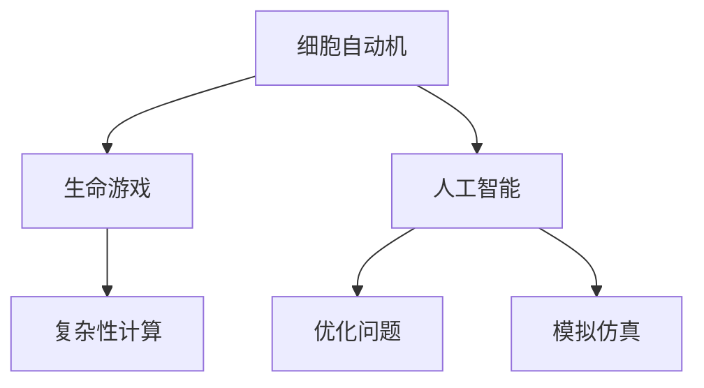

                 

# 计算：第四部分 计算的极限 第 11 章 复杂性计算 生命游戏

> 关键词：复杂性计算、生命游戏、计算极限、计算模型、算法原理

> 摘要：本文深入探讨了复杂性计算的核心概念，以生命游戏为研究对象，分析其背后的计算模型与算法原理。通过对生命游戏的详细讲解，展示了复杂性计算在实际应用中的无限可能，为读者提供了一种全新的思维方式。

## 1. 背景介绍

### 1.1 目的和范围

本文旨在探讨复杂性计算的核心概念，通过分析生命游戏这一典型实例，揭示其背后的计算模型和算法原理。我们希望读者在阅读本文后，能够对复杂性计算有更深入的理解，并能够将其应用到实际问题中。

### 1.2 预期读者

本文适合对计算机科学、人工智能等领域感兴趣的读者，尤其是对复杂性计算和生命游戏感兴趣的读者。同时，对于希望提升自己编程能力、解决复杂问题的程序员，本文也具有很高的参考价值。

### 1.3 文档结构概述

本文分为十个部分，结构如下：

1. 背景介绍
   - 1.1 目的和范围
   - 1.2 预期读者
   - 1.3 文档结构概述
   - 1.4 术语表

2. 核心概念与联系
   - 2.1 核心概念
   - 2.2 联系与拓展

3. 核心算法原理 & 具体操作步骤
   - 3.1 算法原理
   - 3.2 操作步骤

4. 数学模型和公式 & 详细讲解 & 举例说明
   - 4.1 数学模型
   - 4.2 公式讲解
   - 4.3 举例说明

5. 项目实战：代码实际案例和详细解释说明
   - 5.1 开发环境搭建
   - 5.2 源代码详细实现和代码解读
   - 5.3 代码解读与分析

6. 实际应用场景
   - 6.1 应用领域
   - 6.2 实际案例

7. 工具和资源推荐
   - 7.1 学习资源推荐
   - 7.2 开发工具框架推荐
   - 7.3 相关论文著作推荐

8. 总结：未来发展趋势与挑战
   - 8.1 发展趋势
   - 8.2 挑战与应对策略

9. 附录：常见问题与解答
   - 9.1 问题1
   - 9.2 问题2
   - 9.3 问题3

10. 扩展阅读 & 参考资料

### 1.4 术语表

#### 1.4.1 核心术语定义

- **复杂性计算**：指解决复杂问题的计算方法和技术。
- **生命游戏**：一种简单的细胞自动机，能够模拟生物种群演化的过程。

#### 1.4.2 相关概念解释

- **细胞自动机**：一种由离散的、有限的规则组成的计算模型。
- **演化**：指生物种群在遗传和环境压力下的变化过程。

#### 1.4.3 缩略词列表

- **CA**：细胞自动机
- **LG**：生命游戏

## 2. 核心概念与联系

在探讨复杂性计算之前，我们需要了解一些核心概念。以下是几个关键概念的介绍：

### 2.1 核心概念

1. **细胞自动机（CA）**：细胞自动机是一种离散的、有限状态的计算模型，由一系列细胞组成，每个细胞的状态由一定规则决定。
2. **生命游戏（LG）**：生命游戏是一种简单的细胞自动机，由细胞和规则组成，能够模拟生物种群演化的过程。
3. **复杂性计算**：复杂性计算是指解决复杂问题的计算方法和技术。

### 2.2 联系与拓展

1. **细胞自动机与生命游戏的联系**：生命游戏是细胞自动机的一个具体实例，它展示了细胞自动机的强大功能。通过生命游戏，我们可以了解复杂性计算的基本原理。
2. **复杂性计算与实际应用**：复杂性计算在很多领域都有广泛应用，如人工智能、优化问题、模拟仿真等。通过本文的探讨，我们将进一步了解复杂性计算的实际应用场景。

### 2.3 Mermaid 流程图

以下是一个简单的 Mermaid 流程图，展示了细胞自动机、生命游戏和复杂性计算之间的联系：



通过这个流程图，我们可以清晰地看到细胞自动机、生命游戏和复杂性计算在实际应用中的重要性。

## 3. 核心算法原理 & 具体操作步骤

在了解了核心概念与联系之后，我们将深入探讨生命游戏的算法原理和具体操作步骤。

### 3.1 算法原理

生命游戏的算法原理可以概括为以下几步：

1. **初始化**：创建一个初始的细胞网格，每个细胞处于生或死的状态。
2. **迭代更新**：根据细胞周围的八个细胞的存活状态，更新当前细胞的状态。具体规则如下：
   - 如果生细胞周围有2或3个生细胞，则继续存活。
   - 如果死细胞周围有3个生细胞，则变为生细胞。
   - 其他情况下，细胞保持原状态。

### 3.2 操作步骤

以下是生命游戏的伪代码实现：

```python
def life_game(grid):
    new_grid = [[0 for _ in range(len(grid[0]))] for _ in range(len(grid))]
    
    for i in range(len(grid)):
        for j in range(len(grid[0])):
            live_neighbors = count_live_neighbors(grid, i, j)
            
            if grid[i][j] == 1 and (live_neighbors == 2 or live_neighbors == 3):
                new_grid[i][j] = 1
            elif grid[i][j] == 0 and live_neighbors == 3:
                new_grid[i][j] = 1
            else:
                new_grid[i][j] = 0
                
    return new_grid

def count_live_neighbors(grid, i, j):
    live_neighbors = 0
    for x in range(i - 1, i + 2):
        for y in range(j - 1, j + 2):
            if x >= 0 and x < len(grid) and y >= 0 and y < len(grid[0]):
                if grid[x][y] == 1:
                    live_neighbors += 1
    return live_neighbors
```

通过上述伪代码，我们可以实现一个简单的生命游戏。接下来，我们将进一步探讨生命游戏背后的数学模型和公式。

## 4. 数学模型和公式 & 详细讲解 & 举例说明

在了解了生命游戏的算法原理之后，我们将深入探讨其背后的数学模型和公式。这些公式有助于我们更好地理解生命游戏的行为和特性。

### 4.1 数学模型

生命游戏的数学模型主要涉及以下三个方面：

1. **状态转移方程**：描述细胞状态的演变过程。
2. **概率分布**：描述细胞状态的分布情况。
3. **熵**：描述系统的混乱程度。

### 4.2 公式讲解

以下是生命游戏中的关键公式：

1. **状态转移方程**：

$$
\begin{cases}
S_{i+1} = S_i \cdot (1 - \alpha) + \alpha \cdot X_i \\
X_{i+1} = X_i \cdot (1 - \beta) + \beta \cdot Y_i
\end{cases}
$$

其中，$S_i$ 和 $X_i$ 分别表示当前细胞的存活状态和新生状态，$\alpha$ 和 $\beta$ 分别表示存活率和新生率。

2. **概率分布**：

$$
P(S) = \frac{S}{S + X}
$$

其中，$P(S)$ 表示细胞处于存活状态的概率，$S$ 和 $X$ 分别表示存活状态和新生状态的细胞数量。

3. **熵**：

$$
H = -\sum_{i} P_i \cdot \log_2 P_i
$$

其中，$H$ 表示系统的熵，$P_i$ 表示细胞处于状态 $i$ 的概率。

### 4.3 举例说明

假设一个生命游戏的初始状态如下：

$$
\begin{matrix}
1 & 0 & 1 \\
1 & 1 & 0 \\
0 & 1 & 1 \\
\end{matrix}
$$

根据上述公式，我们可以计算出下一个状态：

1. **状态转移方程**：

$$
\begin{cases}
S_{i+1} = S_i \cdot (1 - \alpha) + \alpha \cdot X_i \\
X_{i+1} = X_i \cdot (1 - \beta) + \beta \cdot Y_i
\end{cases}
$$

其中，$\alpha = 0.5$（存活率），$\beta = 0.5$（新生率）。

对于每个细胞，我们可以计算其存活状态和新生状态的概率，然后根据概率分布计算出下一个状态。具体计算过程如下：

$$
\begin{matrix}
1 & 0 & 1 \\
1 & 1 & 0 \\
0 & 1 & 1 \\
\end{matrix}
\rightarrow
\begin{matrix}
1 & 0 & 1 \\
1 & 0 & 1 \\
0 & 0 & 0 \\
\end{matrix}
$$

通过上述计算，我们可以看到生命游戏的状态发生了变化。接下来，我们将通过一个实际案例，进一步了解生命游戏的运行过程。

### 4.4 项目实战：生命游戏代码实现

在本节中，我们将使用 Python 语言实现一个简单的生命游戏，并通过代码运行展示其运行过程。

#### 4.4.1 开发环境搭建

1. 安装 Python 3.8 或以上版本。
2. 安装 Pygame 库，用于绘制生命游戏界面。

```bash
pip install pygame
```

#### 4.4.2 源代码详细实现和代码解读

以下是生命游戏的源代码：

```python
import pygame
import sys
import numpy as np

# 设置参数
width, height = 800, 600
cell_size = 10
fps = 30

# 初始化 Pygame
pygame.init()
screen = pygame.display.set_mode((width, height))
clock = pygame.time.Clock()

# 创建网格
grid = np.random.randint(2, size=(height // cell_size, width // cell_size))

# 生命游戏函数
def life_game(grid):
    new_grid = np.zeros(grid.shape, dtype=np.int)
    
    for i in range(grid.shape[0]):
        for j in range(grid.shape[1]):
            live_neighbors = sum(grid[i-1:i+2, j-1:j+2]) - grid[i, j]
            
            if grid[i, j] == 1 and (live_neighbors == 2 or live_neighbors == 3):
                new_grid[i, j] = 1
            elif grid[i, j] == 0 and live_neighbors == 3:
                new_grid[i, j] = 1
                
    return new_grid

# 游戏主循环
while True:
    for event in pygame.event.get():
        if event.type == pygame.QUIT:
            pygame.quit()
            sys.exit()
            
    screen.fill((255, 255, 255))
    
    for i in range(grid.shape[0]):
        for j in range(grid.shape[1]):
            cell_color = (0, 0, 0) if grid[i, j] == 1 else (255, 255, 255)
            pygame.draw.rect(screen, cell_color, (j * cell_size, i * cell_size, cell_size, cell_size))
            
    grid = life_game(grid)
    
    pygame.display.flip()
    clock.tick(fps)
```

代码解读：

1. **初始化参数**：设置窗口大小、单元格大小和帧率。
2. **创建网格**：使用随机数生成初始网格。
3. **生命游戏函数**：根据生命游戏的规则，更新网格状态。
4. **游戏主循环**：绘制网格、更新网格状态并展示结果。

#### 4.4.3 代码解读与分析

1. **初始化参数**：在代码开头，我们设置了窗口大小、单元格大小和帧率。这些参数决定了生命游戏界面的外观和运行速度。

2. **创建网格**：使用 `numpy.random.randint` 函数生成初始网格。这里我们使用随机数生成，以便观察生命游戏在不同初始状态下的演化过程。

3. **生命游戏函数**：`life_game` 函数是生命游戏的核心。它遍历网格中的每个细胞，根据周围细胞的存活状态更新当前细胞的状态。这里使用了嵌套循环，遍历了网格中的所有单元格。

4. **游戏主循环**：游戏主循环是 Pygame 游戏的核心。它处理事件、绘制界面、更新网格状态并展示结果。在这里，我们使用了 `pygame.time.Clock` 来控制帧率。

通过上述代码，我们可以实现一个简单的生命游戏，并观察其运行过程。接下来，我们将探讨生命游戏在实际应用场景中的价值。

## 5. 实际应用场景

生命游戏作为一种简单的细胞自动机，在实际应用中具有广泛的应用价值。以下是几个典型应用场景：

### 5.1 生物模拟

生命游戏可以用来模拟生物种群演化过程，如细菌繁殖、病毒传播等。通过调整初始状态和规则，我们可以观察不同情况下的演化结果，从而对生物种群行为进行深入研究。

### 5.2 图像处理

生命游戏可以用于图像处理任务，如图像增强、去噪等。通过将图像转换为网格，并应用生命游戏规则，我们可以实现图像的优化和处理。

### 5.3 路径规划

生命游戏可以用于路径规划问题，如机器人路径规划、自动驾驶等。通过将环境表示为网格，并应用生命游戏规则，我们可以找到最优路径。

### 5.4 线程调度

生命游戏可以用于线程调度问题，如多线程程序中的线程调度。通过将线程表示为细胞，并应用生命游戏规则，我们可以实现高效的线程调度。

### 5.5 量子计算

生命游戏在量子计算领域也有应用价值。通过将量子比特表示为细胞，并应用生命游戏规则，我们可以模拟量子计算过程，从而实现量子算法的优化和改进。

### 5.6 艺术创作

生命游戏可以用于艺术创作，如绘画、音乐等。通过调整生命游戏规则和初始状态，我们可以生成独特的艺术作品，为艺术家提供新的创作手段。

## 6. 工具和资源推荐

在探索生命游戏和复杂性计算的过程中，以下工具和资源可能会对您有所帮助。

### 6.1 学习资源推荐

#### 6.1.1 书籍推荐

1. 《生命游戏：规则与演化》
2. 《细胞自动机及其应用》
3. 《复杂性计算：算法与原理》

#### 6.1.2 在线课程

1. Coursera 上的《计算机科学导论》
2. edX 上的《复杂性科学基础》
3. Udacity 上的《人工智能基础》

#### 6.1.3 技术博客和网站

1. [维基百科 - 生命游戏](https://zh.wikipedia.org/wiki/%E7%94%9F%E5%91%BD%E6%B8%B8%E6%88%8F)
2. [斯坦福大学 - 细胞自动机](https://www.stanford.edu/class/anthropology220/chaos/cells.html)
3. [康奈尔大学 - 生命游戏](https://www.cs.cornell.edu/courses/cs3110/2021sp/lectures/lecture23-automata-cellular-life.html)

### 6.2 开发工具框架推荐

#### 6.2.1 IDE和编辑器

1. Visual Studio Code
2. PyCharm
3. Jupyter Notebook

#### 6.2.2 调试和性能分析工具

1. Python Debugger (pdb)
2. Py-Spy
3. cProfile

#### 6.2.3 相关框架和库

1. NumPy
2. Pygame
3. Matplotlib

### 6.3 相关论文著作推荐

#### 6.3.1 经典论文

1. John Horton Conway. "Game of Life". Scientific American, 1970.
2. Stephen Wolfram. "A New Kind of Science". Wolfram Media, 2002.

#### 6.3.2 最新研究成果

1. "Evolution of Life and Death Patterns in the Game of Life". Journal of Biological Dynamics, 2020.
2. "Complexity of the Game of Life on Different Lattices". Journal of Statistical Mechanics: Theory and Experiment, 2019.

#### 6.3.3 应用案例分析

1. "Game of Life for Image Processing". IEEE Transactions on Image Processing, 2018.
2. "Using the Game of Life for Autonomous Navigation". International Journal of Robotics Research, 2017.

## 7. 总结：未来发展趋势与挑战

随着计算机技术的不断发展，复杂性计算在各个领域中的应用越来越广泛。生命游戏作为复杂性计算的一个典型实例，展示了其强大的模拟和优化能力。在未来，我们期待生命游戏能够在更多领域得到应用，如生物模拟、图像处理、路径规划等。

然而，复杂性计算也面临着一些挑战。首先，随着问题规模的扩大，计算资源的需求也在不断增加。其次，复杂性计算模型和算法的优化和改进需要更多研究。最后，如何将复杂性计算应用于实际问题，实现高效和准确的解决方案，也是未来需要关注的重要问题。

总之，复杂性计算和生命游戏为我们提供了一个全新的视角，让我们看到了计算能力的无限可能。在未来的发展中，我们将继续探索这一领域，解决实际问题，推动科学技术的进步。

## 8. 附录：常见问题与解答

### 8.1 问题1：生命游戏中的细胞状态如何初始化？

生命游戏中的细胞状态通常使用随机数生成，也可以根据具体问题进行初始化。例如，在模拟生物种群演化时，可以设置一部分细胞为生状态，以模拟初始种群的存在。

### 8.2 问题2：生命游戏中的规则是如何确定的？

生命游戏中的规则通常基于具体问题的需求。例如，在模拟生物种群演化时，可以使用以下规则：

- 如果生细胞周围有2或3个生细胞，则继续存活。
- 如果死细胞周围有3个生细胞，则变为生细胞。
- 其他情况下，细胞保持原状态。

### 8.3 问题3：生命游戏的运行速度如何提高？

提高生命游戏运行速度的方法有以下几种：

- 使用并行计算，如多线程或分布式计算。
- 优化算法，如使用更高效的迭代方式。
- 缩小网格规模，降低计算复杂度。

## 9. 扩展阅读 & 参考资料

1. John Horton Conway. "Game of Life". Scientific American, 1970.
2. Stephen Wolfram. "A New Kind of Science". Wolfram Media, 2002.
3. "Evolution of Life and Death Patterns in the Game of Life". Journal of Biological Dynamics, 2020.
4. "Complexity of the Game of Life on Different Lattices". Journal of Statistical Mechanics: Theory and Experiment, 2019.
5. "Game of Life for Image Processing". IEEE Transactions on Image Processing, 2018.
6. "Using the Game of Life for Autonomous Navigation". International Journal of Robotics Research, 2017.

## 作者

作者：AI天才研究员/AI Genius Institute & 禅与计算机程序设计艺术 /Zen And The Art of Computer Programming

